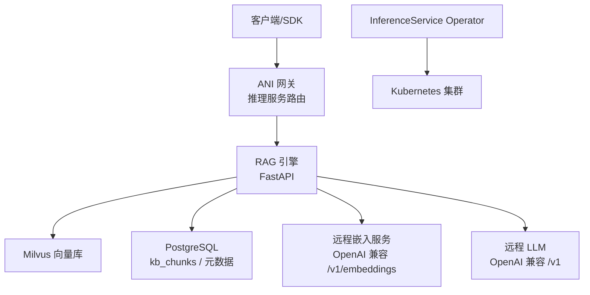
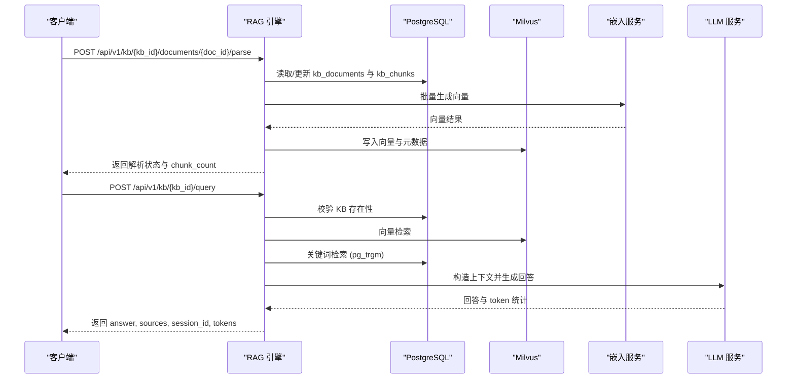
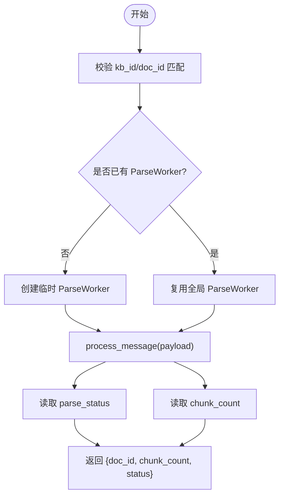
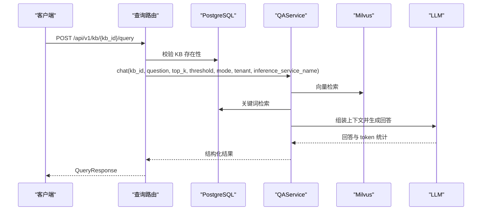
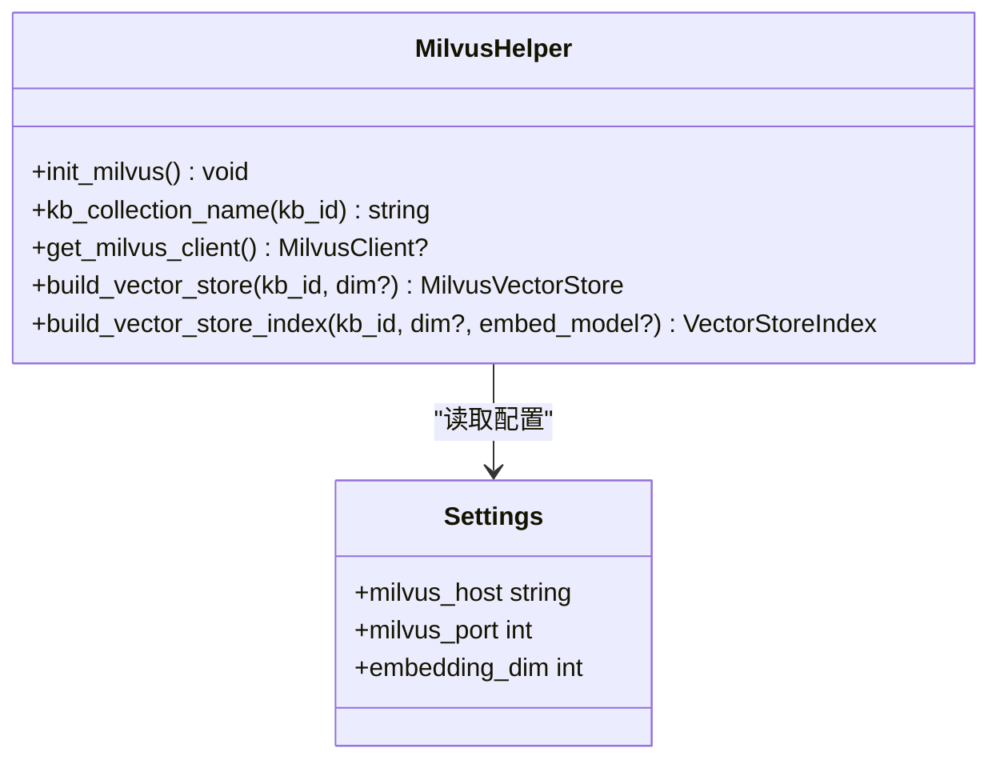
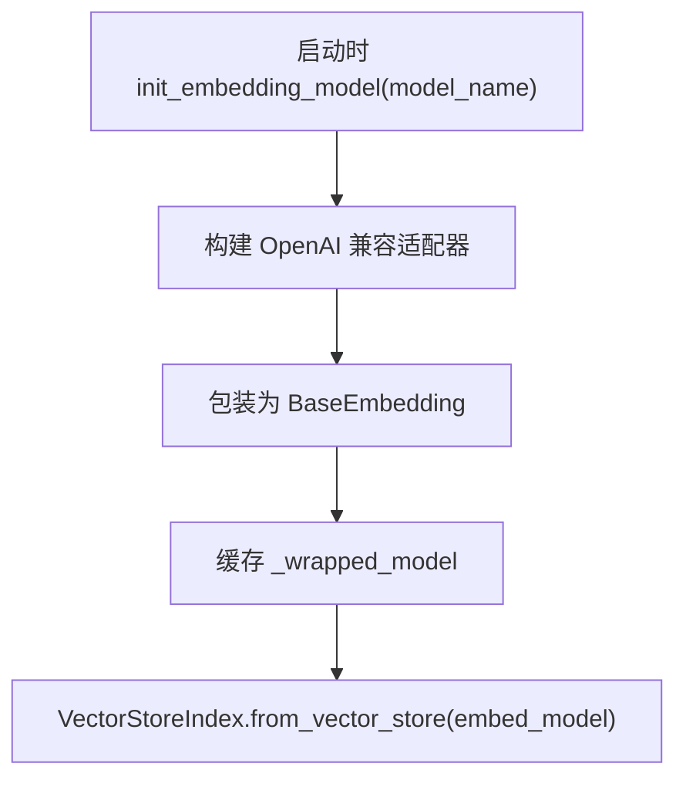
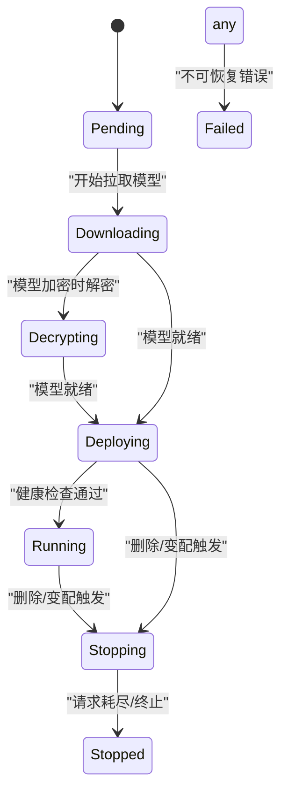
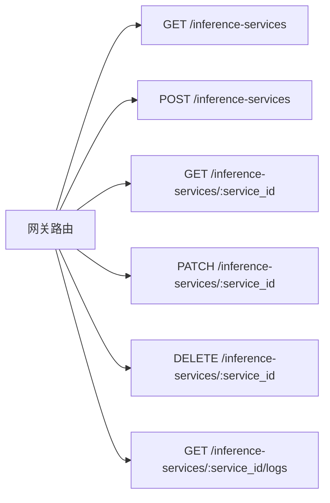
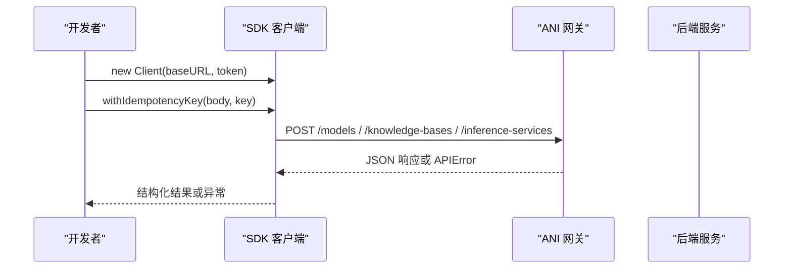
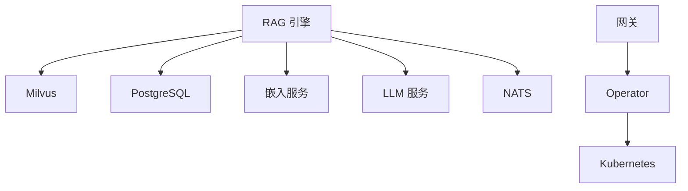

# AI 服务

<cite>
**本文引用的文件**
- [main.py](file://repo/ai/rag-engine/main.py)
- [config.py](file://repo/ai/rag-engine/app/core/config.py)
- [milvus.py](file://repo/ai/rag-engine/app/core/milvus.py)
- [embeddings.py](file://repo/ai/rag-engine/app/core/embeddings.py)
- [documents.py](file://repo/ai/rag-engine/app/routers/documents.py)
- [query.py](file://repo/ai/rag-engine/app/routers/query.py)
- [inferenceservice_types.go](file://repo/operators/inference-operator/api/v1/inferenceservice_types.go)
- [inference_resources.go](file://repo/services/ani-gateway/internal/router/inference_resources.go)
- [client.go](file://repo/sdks/services/go/anisdk/client.go)
- [client.py](file://repo/sdks/services/python/kubercloud_ani_services/client.py)
- [index.ts](file://repo/sdks/services/typescript/src/index.ts)
</cite>

## 目录
1. [简介](#简介)
2. [项目结构](#项目结构)
3. [核心组件](#核心组件)
4. [架构总览](#架构总览)
5. [详细组件分析](#详细组件分析)
6. [依赖关系分析](#依赖关系分析)
7. [性能考量](#性能考量)
8. [故障排查指南](#故障排查指南)
9. [结论](#结论)
10. [附录](#附录)

## 简介
本文件面向 ANI AI 服务的研发与使用者，聚焦以下目标：
- RAG 引擎的文档检索、向量数据库集成与语义搜索能力说明。
- InferenceService Operator 的自定义资源定义、控制器生命周期管理要点。
- SDK（Go、Java、Python、TypeScript）在模型注册、版本管理与推理调用中的使用方式。
- 从“文档入库 → 索引构建 → 混合检索 → LLM 生成”的端到端流程说明。

## 项目结构
ANI 平台将 AI 相关能力拆分为多个服务与组件：
- RAG 引擎（Python/FastAPI）：提供文档解析、向量化、Milvus 向量库集成、混合检索与问答接口。
- InferenceService Operator（Go/Kubernetes CRD）：通过自定义资源管理推理服务实例的生命周期。
- 网关路由（Go/Hertz）：对外暴露推理服务管理能力的路由占位实现。
- SDK（多语言）：基于统一 API 规范生成的客户端库，覆盖模型、知识库、推理服务等操作。

图表来源
- [main.py:38-145](file://repo/ai/rag-engine/main.py#L38-L145)
- [milvus.py:36-187](file://repo/ai/rag-engine/app/core/milvus.py#L36-L187)
- [embeddings.py:147-203](file://repo/ai/rag-engine/app/core/embeddings.py#L147-L203)
- [inferenceservice_types.go:55-164](file://repo/operators/inference-operator/api/v1/inferenceservice_types.go#L55-L164)
- [inference_resources.go:12-19](file://repo/services/ani-gateway/internal/router/inference_resources.go#L12-L19)

章节来源
- [main.py:38-145](file://repo/ai/rag-engine/main.py#L38-L145)
- [config.py:5-78](file://repo/ai/rag-engine/app/core/config.py#L5-L78)
- [milvus.py:36-187](file://repo/ai/rag-engine/app/core/milvus.py#L36-L187)
- [embeddings.py:147-203](file://repo/ai/rag-engine/app/core/embeddings.py#L147-L203)
- [inferenceservice_types.go:55-164](file://repo/operators/inference-operator/api/v1/inferenceservice_types.go#L55-L164)
- [inference_resources.go:12-19](file://repo/services/ani-gateway/internal/router/inference_resources.go#L12-L19)

## 核心组件
- RAG 引擎
  - FastAPI 应用入口与生命周期管理，启动时初始化 Milvus、嵌入模型、NATS 解析工作器与数据库连接池。
  - 文档解析与索引删除接口；查询接口支持向量、关键词与混合检索。
- 向量数据库集成
  - 通过 LlamaIndex MilvusVectorStore 直接访问 Milvus，集合命名规则与 HNSW 索引参数按规范配置。
- 嵌入模型
  - 通过 OpenAI 兼容的远程 /v1/embeddings 获取向量，写读路径共享同一模型以保证一致性。
- InferenceService Operator
  - 定义 InferenceService 自定义资源，包含 Spec、Status、Phase 与 Conditions，用于声明式管理推理服务实例。
- 网关路由
  - 提供推理服务相关的 REST 路由占位实现，后续对接实际业务逻辑。
- SDK
  - Go、Python、TypeScript 客户端库由脚本生成，封装统一的 HTTP 请求、幂等键、分页与错误处理。

章节来源
- [main.py:38-145](file://repo/ai/rag-engine/main.py#L38-L145)
- [milvus.py:36-187](file://repo/ai/rag-engine/app/core/milvus.py#L36-L187)
- [embeddings.py:147-203](file://repo/ai/rag-engine/app/core/embeddings.py#L147-L203)
- [inferenceservice_types.go:55-164](file://repo/operators/inference-operator/api/v1/inferenceservice_types.go#L55-L164)
- [inference_resources.go:12-19](file://repo/services/ani-gateway/internal/router/inference_resources.go#L12-L19)
- [client.go:391-496](file://repo/sdks/services/go/anisdk/client.go#L391-L496)
- [client.py:379-467](file://repo/sdks/services/python/kubercloud_ani_services/client.py#L379-L467)
- [index.ts:377-481](file://repo/sdks/services/typescript/src/index.ts#L377-L481)

## 架构总览
RAG 引擎作为知识检索与问答的核心，负责：
- 文档入库与解析（同步或异步 NATS 工作器）。
- 文本分块、向量化并写入 Milvus。
- 查询阶段进行向量检索、关键词检索与 RRF 融合，再调用 LLM 生成答案。
- 通过健康检查与健康状态上报，便于编排与运维。

图表来源
- [documents.py:28-90](file://repo/ai/rag-engine/app/routers/documents.py#L28-L90)
- [query.py:112-166](file://repo/ai/rag-engine/app/routers/query.py#L112-L166)
- [milvus.py:111-187](file://repo/ai/rag-engine/app/core/milvus.py#L111-L187)
- [embeddings.py:147-203](file://repo/ai/rag-engine/app/core/embeddings.py#L147-L203)

## 详细组件分析

### RAG 引擎：文档解析与索引
- 同步解析接口
  - 接收 kb_id、doc_id、存储路径、文件类型与幂等键，内部复用 ParseWorker 执行下载→解析→分块→嵌入→写入的全流程。
  - 若未启用 NATS 工作器，则创建临时 worker 以进程内执行。
  - 最终读取 parse_status 与 chunk_count 返回。
- 索引删除接口
  - 通过 MilvusClient 按 doc_id 表达式删除对应向量，幂等且可降级为“集合不存在”。

图表来源
- [documents.py:28-90](file://repo/ai/rag-engine/app/routers/documents.py#L28-L90)

章节来源
- [documents.py:28-115](file://repo/ai/rag-engine/app/routers/documents.py#L28-L115)

### RAG 引擎：查询与混合检索
- 查询接口
  - 校验 tenant_id 与 KB 存在性（通过 PostgreSQL）。
  - 根据 retrieval_mode 选择 vector/hybrid/keyword。
  - 将 QAService.chat 放入线程执行以避免阻塞事件循环。
  - 捕获超时与运行时错误，返回合适的 HTTP 状态码。
- 返回结构
  - answer、sources（含 doc_id、file_name、page、content、score）、session_id、input_tokens、output_tokens。

图表来源
- [query.py:75-166](file://repo/ai/rag-engine/app/routers/query.py#L75-L166)

章节来源
- [query.py:75-166](file://repo/ai/rag-engine/app/routers/query.py#L75-L166)

### 向量数据库集成（Milvus）
- 连接与集合
  - 启动时建立默认连接，失败时记录警告并允许下游降级。
  - 集合命名规则：kb_{kb_id 去横杠}，确保符合 Milvus 命名约束。
- 索引配置
  - HNSW 索引，余弦相似度，M=16，efConstruction=200。
- 向量存储与索引构建
  - 通过 LlamaIndex MilvusVectorStore 与 VectorStoreIndex.from_vector_store 完成写入与检索。
  - 强制同步 GrpcHandler 避免事件循环关闭导致的异常。

图表来源
- [milvus.py:36-187](file://repo/ai/rag-engine/app/core/milvus.py#L36-L187)
- [config.py:13-30](file://repo/ai/rag-engine/app/core/config.py#L13-L30)

章节来源
- [milvus.py:36-187](file://repo/ai/rag-engine/app/core/milvus.py#L36-L187)
- [config.py:13-30](file://repo/ai/rag-engine/app/core/config.py#L13-L30)

### 嵌入模型（远程 OpenAI 兼容）
- 设计要点
  - 通过 OpenAI 兼容的 /v1/embeddings 获取向量，避免本地加载模型。
  - 自定义适配器绕过框架对模型名的枚举校验，支持任意模型名。
  - 写读路径共享同一模型实例，保证嵌入一致性。
- 初始化与获取
  - 启动时初始化嵌入模型，首次 get_embed_model() 时包装为 BaseEmbedding 供 LlamaIndex 使用。
  - 提供批量嵌入函数，供写入与检索共用。

图表来源
- [embeddings.py:147-203](file://repo/ai/rag-engine/app/core/embeddings.py#L147-L203)

章节来源
- [embeddings.py:147-203](file://repo/ai/rag-engine/app/core/embeddings.py#L147-L203)

### InferenceService Operator：自定义资源与生命周期
- 自定义资源定义
  - InferenceServiceSpec：model（name:version）、replicas、gpuType、gpuCountPerPod、maxConcurrency、placement、encryptionKeyRef、drainTimeoutSeconds。
  - InferenceServiceStatus：phase、observedGeneration、endpointURL、readyReplicas、message、conditions。
- 生命周期阶段
  - Pending → Downloading → Decrypting → Deploying → Running → Stopping → Stopped/Failed。
  - 条件：ModelReady、PodScheduled、Healthy、DrainComplete。
- 控制器职责
  - 根据 Spec 拉取/解密模型、调度 vLLM Pod、健康检查、优雅停机与清理。

图表来源
- [inferenceservice_types.go:16-42](file://repo/operators/inference-operator/api/v1/inferenceservice_types.go#L16-L42)
- [inferenceservice_types.go:55-164](file://repo/operators/inference-operator/api/v1/inferenceservice_types.go#L55-L164)

章节来源
- [inferenceservice_types.go:16-42](file://repo/operators/inference-operator/api/v1/inferenceservice_types.go#L16-L42)
- [inferenceservice_types.go:55-164](file://repo/operators/inference-operator/api/v1/inferenceservice_types.go#L55-L164)

### 网关路由：推理服务管理
- 路由注册
  - 列出、创建、更新、删除推理服务，以及日志查询。
- 当前实现
  - 占位响应，后续接入真实业务逻辑。

图表来源
- [inference_resources.go:12-19](file://repo/services/ani-gateway/internal/router/inference_resources.go#L12-L19)

章节来源
- [inference_resources.go:12-19](file://repo/services/ani-gateway/internal/router/inference_resources.go#L12-L19)

### SDK 使用指南（Go、Java、Python、TypeScript）
- 通用特性
  - 基础客户端：设置 baseURL 与 token。
  - 幂等键：newIdempotencyKey/WithIdempotencyKey，防止重复计费。
  - 分页：cursorParams(limit, cursor)。
  - 错误处理：APIError/IsAPIErrorCode，统一错误码。
- 主要操作
  - 模型：listModels、createModel、importModel、deleteModel、getModel、createModelVersion。
  - 知识库：listKnowledgeBases、createKnowledgeBase、queryKnowledgeBase、streamQueryKnowledgeBase。
  - 推理服务：listInferenceServices、createInferenceService、updateInferenceService、applyInferenceServiceLifecycle、getInferenceServiceLogs。
- 各语言要点
  - Go：Client.Request(method, path, options)，自动编码 JSON 与错误映射。
  - Python：Client.request(method, path, body, params, headers)，HTTPError 转换为 APIError。
  - TypeScript：Client.request<T>(method, path, options)，fetch 封装与错误抛出。
  - Java：ApiClient 由脚本生成，遵循相同模式（参考包结构与示例）。

图表来源
- [client.go:391-496](file://repo/sdks/services/go/anisdk/client.go#L391-L496)
- [client.py:379-467](file://repo/sdks/services/python/kubercloud_ani_services/client.py#L379-L467)
- [index.ts:377-481](file://repo/sdks/services/typescript/src/index.ts#L377-L481)

章节来源
- [client.go:391-496](file://repo/sdks/services/go/anisdk/client.go#L391-L496)
- [client.py:379-467](file://repo/sdks/services/python/kubercloud_ani_services/client.py#L379-L467)
- [index.ts:377-481](file://repo/sdks/services/typescript/src/index.ts#L377-L481)

## 依赖关系分析
- RAG 引擎依赖
  - Milvus：向量检索与存储。
  - PostgreSQL：kb_chunks 与 kb_documents 元数据、pg_trgm 关键词检索。
  - 远程嵌入服务：OpenAI 兼容 /v1/embeddings。
  - 远程 LLM：OpenAI 兼容 /v1。
  - NATS：异步解析任务队列（可选，失败不阻断主流程）。
- Operator 与网关
  - Operator 管理 Kubernetes 资源（Deployment/Service/ConfigMap/Secret），驱动推理服务生命周期。
  - 网关提供推理服务管理的 REST 路由，后续对接实际逻辑。

图表来源
- [main.py:38-145](file://repo/ai/rag-engine/main.py#L38-L145)
- [milvus.py:36-187](file://repo/ai/rag-engine/app/core/milvus.py#L36-L187)
- [inferenceservice_types.go:55-164](file://repo/operators/inference-operator/api/v1/inferenceservice_types.go#L55-L164)
- [inference_resources.go:12-19](file://repo/services/ani-gateway/internal/router/inference_resources.go#L12-L19)

章节来源
- [main.py:38-145](file://repo/ai/rag-engine/main.py#L38-L145)
- [milvus.py:36-187](file://repo/ai/rag-engine/app/core/milvus.py#L36-L187)
- [inferenceservice_types.go:55-164](file://repo/operators/inference-operator/api/v1/inferenceservice_types.go#L55-L164)
- [inference_resources.go:12-19](file://repo/services/ani-gateway/internal/router/inference_resources.go#L12-L19)

## 性能考量
- 嵌入批处理
  - 批量调用远程嵌入接口，减少网络往返与提升吞吐。
- 向量索引参数
  - HNSW 的 M 与 efConstruction 影响召回与延迟，需结合数据规模调优。
- 并发与超时
  - 查询时将 QAService.chat 放入线程执行，避免阻塞事件循环；合理设置 LLM 超时。
- 连接池与重试
  - asyncpg 连接池控制 DB 并发；NATS 客户端支持自动重连，增强鲁棒性。

[本节为通用指导，不直接分析具体文件]

## 故障排查指南
- Milvus 连接失败
  - 现象：启动日志警告连接失败，查询/解析降级。
  - 处理：检查 host/port 配置，确认 Milvus 可用；必要时重启服务。
- 嵌入服务不可用
  - 现象：写入或检索时报错；需检查 embedding_api_base 与 api_key。
  - 处理：临时切换至备用嵌入服务或修复鉴权。
- KB 不存在
  - 现象：查询返回 404。
  - 处理：确认 kb-service 中 KB 状态为 active，tenant_id 正确。
- LLM 超时
  - 现象：查询返回 504。
  - 处理：调整超时或优化上下文长度；检查 LLM 服务健康。
- NATS 不可用
  - 现象：解析工作器未启动，但同步解析仍可用。
  - 处理：恢复 NATS 后自动订阅；必要时回退到同步解析。

章节来源
- [milvus.py:36-71](file://repo/ai/rag-engine/app/core/milvus.py#L36-L71)
- [config.py:13-78](file://repo/ai/rag-engine/app/core/config.py#L13-L78)
- [query.py:112-166](file://repo/ai/rag-engine/app/routers/query.py#L112-L166)
- [documents.py:28-115](file://repo/ai/rag-engine/app/routers/documents.py#L28-L115)

## 结论
- RAG 引擎提供了完整的文档入库、向量化与混合检索能力，并通过远程嵌入与 LLM 服务解耦计算负载。
- InferenceService Operator 通过声明式资源管理推理服务生命周期，具备健壮的状态机与条件化推进机制。
- 多语言 SDK 统一了模型、知识库与推理服务的调用方式，支持幂等与分页，便于上层应用快速集成。
- 建议在部署时关注 Milvus、PostgreSQL、NATS 与远程服务的可用性，并根据数据规模与并发需求调优索引与超时参数。

[本节为总结，不直接分析具体文件]

## 附录
- 关键配置项
  - Milvus：host、port、集合命名规则、索引参数。
  - 嵌入服务：base_url、model、api_key、维度。
  - PostgreSQL：DSN、pg_trgm 扩展、表结构。
  - NATS：URL、主题名称。
  - LLM：base_url、model、context_window。
- 常用接口
  - 文档解析：POST /api/v1/kb/{kb_id}/documents/{doc_id}/parse
  - 索引删除：DELETE /api/v1/kb/{kb_id}/documents/{doc_id}/index
  - 查询：POST /api/v1/kb/{kb_id}/query
  - 推理服务：/inference-services（网关路由）

[本节为补充信息，不直接分析具体文件]