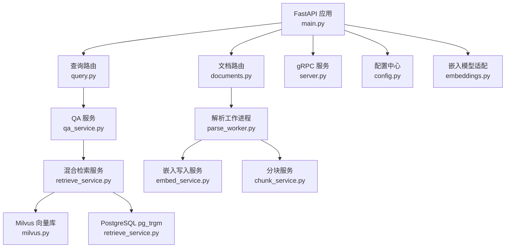
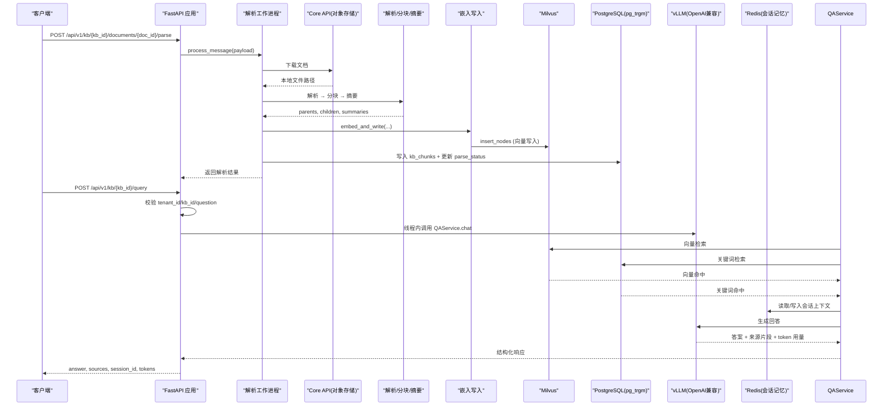
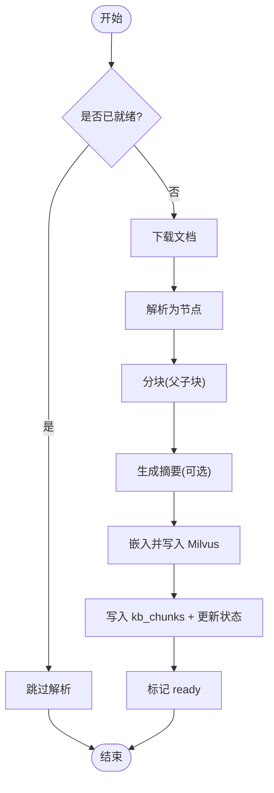
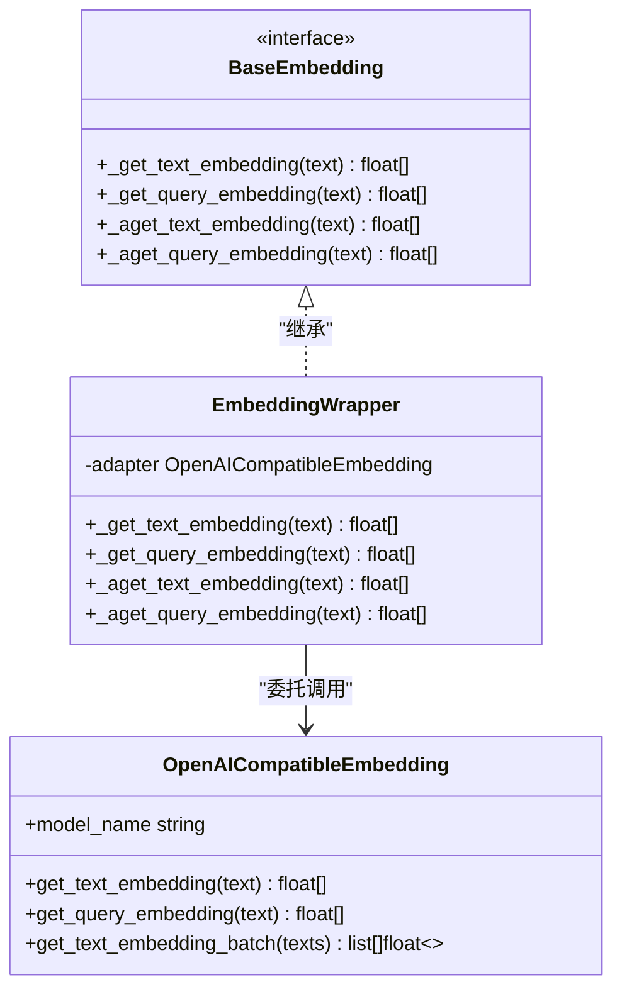
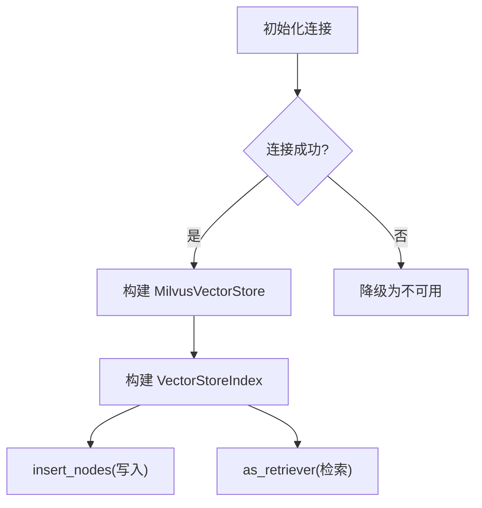
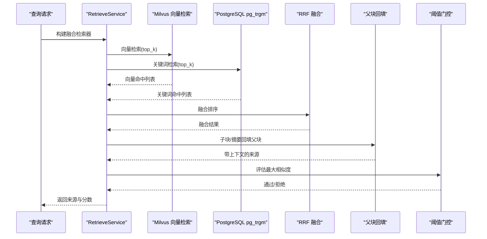
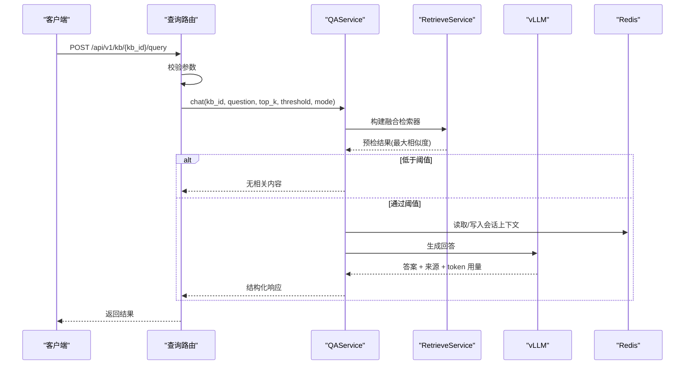
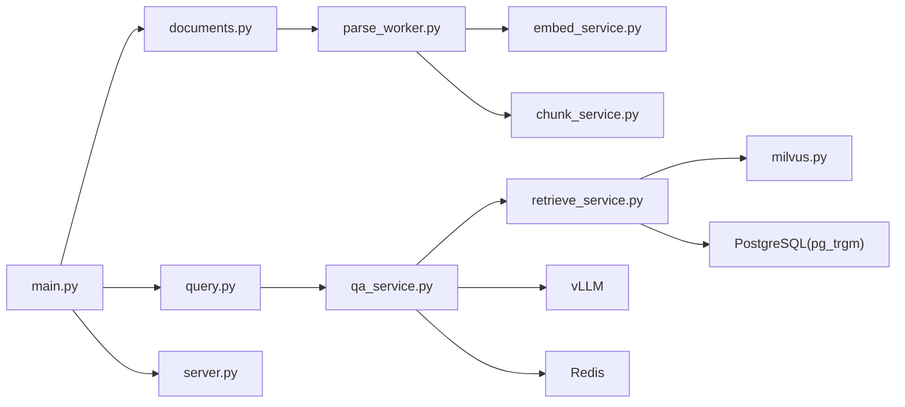

# RAG 引擎

<cite>
**本文引用的文件**
- [main.py](file://repo/ai/rag-engine/main.py)
- [config.py](file://repo/ai/rag-engine/app/core/config.py)
- [embeddings.py](file://repo/ai/rag-engine/app/core/embeddings.py)
- [milvus.py](file://repo/ai/rag-engine/app/core/milvus.py)
- [documents.py](file://repo/ai/rag-engine/app/routers/documents.py)
- [query.py](file://repo/ai/rag-engine/app/routers/query.py)
- [qa_service.py](file://repo/ai/rag-engine/app/services/qa_service.py)
- [retrieve_service.py](file://repo/ai/rag-engine/app/services/retrieve_service.py)
- [embed_service.py](file://repo/ai/rag-engine/app/services/embed_service.py)
- [chunk_service.py](file://repo/ai/rag-engine/app/services/chunk_service.py)
- [parse_worker.py](file://repo/ai/rag-engine/app/workers/parse_worker.py)
- [server.py](file://repo/ai/rag-engine/app/grpc/server.py)
- [requirements.txt](file://repo/ai/rag-engine/requirements.txt)
</cite>

## 目录
1. [简介](#简介)
2. [项目结构](#项目结构)
3. [核心组件](#核心组件)
4. [架构总览](#架构总览)
5. [详细组件分析](#详细组件分析)
6. [依赖关系分析](#依赖关系分析)
7. [性能考虑](#性能考虑)
8. [故障排查指南](#故障排查指南)
9. [结论](#结论)
10. [附录：API 与配置](#附录api-与配置)

## 简介
本仓库中的 RAG（检索增强生成）引擎提供文档解析、向量化索引与混合检索能力，支持通过 REST 与 gRPC 两种接口进行知识问答。系统采用 LlamaIndex 作为编排层，Milvus 作为向量数据库，PostgreSQL（pg_trgm）作为关键词检索后端，NATS 驱动异步解析流水线，并通过 Redis 实现多轮对话记忆。嵌入模型由远端推理服务以 OpenAI 兼容的 /v1/embeddings 接口提供，保证写读路径使用同一模型，避免不一致。

## 项目结构
RAG 引擎采用分层组织：
- 入口与生命周期管理：FastAPI 应用启动、gRPC 服务与 NATS 解析工作进程的生命周期在 main.py 中统一编排。
- 核心能力：配置、嵌入模型适配、Milvus 连接与集合构建。
- 路由层：REST API 暴露文档解析与查询接口。
- 服务层：QA 问答、混合检索、嵌入写入、分块策略等。
- 工作进程：NATS 订阅者执行解析流水线（下载→解析→分块→摘要→嵌入→写入）。
- gRPC 服务：Query RPC 与 REST 共享 QAService 逻辑，确保一致性。

图表来源
- [main.py:38-145](file://repo/ai/rag-engine/main.py#L38-L145)
- [documents.py:28-90](file://repo/ai/rag-engine/app/routers/documents.py#L28-L90)
- [query.py:112-166](file://repo/ai/rag-engine/app/routers/query.py#L112-L166)
- [server.py:60-186](file://repo/ai/rag-engine/app/grpc/server.py#L60-L186)
- [parse_worker.py:185-522](file://repo/ai/rag-engine/app/workers/parse_worker.py#L185-L522)
- [qa_service.py:283-592](file://repo/ai/rag-engine/app/services/qa_service.py#L283-L592)
- [retrieve_service.py:577-685](file://repo/ai/rag-engine/app/services/retrieve_service.py#L577-L685)
- [milvus.py:36-187](file://repo/ai/rag-engine/app/core/milvus.py#L36-L187)
- [embeddings.py:50-191](file://repo/ai/rag-engine/app/core/embeddings.py#L50-L191)
- [embed_service.py:169-251](file://repo/ai/rag-engine/app/services/embed_service.py#L169-L251)
- [chunk_service.py:413-529](file://repo/ai/rag-engine/app/services/chunk_service.py#L413-L529)
- [config.py:5-101](file://repo/ai/rag-engine/app/core/config.py#L5-L101)

章节来源
- [main.py:38-145](file://repo/ai/rag-engine/main.py#L38-L145)
- [requirements.txt:1-41](file://repo/ai/rag-engine/requirements.txt#L1-L41)

## 核心组件
- 配置中心：集中管理 Milvus、嵌入模型、Redis、PostgreSQL、NATS、OCR、MinIO 等外部依赖地址与参数。
- 嵌入模型适配：封装远端 OpenAI 兼容 /v1/embeddings 接口，提供批量嵌入与 LlamaIndex BaseEmbedding 包装。
- Milvus 集成：按知识库 ID 命名集合，HNSW + COSINE 索引，维度可配；提供客户端与索引构建工具。
- 解析工作进程：基于 NATS 订阅任务，顺序执行下载、解析、分块、摘要、嵌入与持久化，状态机驱动并幂等处理。
- 混合检索服务：向量检索（Milvus）+ 关键词检索（pg_trgm），RRF 融合，父块回填，阈值门控避免幻觉。
- QA 服务：组装 ContextChatEngine，结合 Redis 会话记忆与 vLLM 推理，输出答案、来源片段与 token 用量。
- 路由与 gRPC：REST 与 gRPC 共享 QAService，对外暴露健康检查、文档解析、查询接口。

章节来源
- [config.py:5-101](file://repo/ai/rag-engine/app/core/config.py#L5-L101)
- [embeddings.py:50-191](file://repo/ai/rag-engine/app/core/embeddings.py#L50-L191)
- [milvus.py:36-187](file://repo/ai/rag-engine/app/core/milvus.py#L36-L187)
- [parse_worker.py:185-522](file://repo/ai/rag-engine/app/workers/parse_worker.py#L185-L522)
- [retrieve_service.py:577-685](file://repo/ai/rag-engine/app/services/retrieve_service.py#L577-L685)
- [qa_service.py:283-592](file://repo/ai/rag-engine/app/services/qa_service.py#L283-L592)
- [query.py:112-166](file://repo/ai/rag-engine/app/routers/query.py#L112-L166)
- [server.py:60-186](file://repo/ai/rag-engine/app/grpc/server.py#L60-L186)

## 架构总览
RAG 引擎在启动时初始化 Milvus 连接与嵌入模型，按需拉起 gRPC 服务与 NATS 解析工作进程。REST 路由将文档解析请求转发给工作进程或同步执行；查询路由调用 QAService，内部组合混合检索与 LLM 生成。

图表来源
- [main.py:38-145](file://repo/ai/rag-engine/main.py#L38-L145)
- [documents.py:28-90](file://repo/ai/rag-engine/app/routers/documents.py#L28-L90)
- [parse_worker.py:324-522](file://repo/ai/rag-engine/app/workers/parse_worker.py#L324-L522)
- [embed_service.py:188-234](file://repo/ai/rag-engine/app/services/embed_service.py#L188-L234)
- [retrieve_service.py:640-685](file://repo/ai/rag-engine/app/services/retrieve_service.py#L640-L685)
- [qa_service.py:393-592](file://repo/ai/rag-engine/app/services/qa_service.py#L393-L592)
- [query.py:112-166](file://repo/ai/rag-engine/app/routers/query.py#L112-L166)

## 详细组件分析

### 文档上传与解析流程
- 触发方式：REST 接口 /api/v1/kb/{kb_id}/documents/{doc_id}/parse 支持同步回退模式；生产环境通常由 NATS 消息驱动。
- 幂等性：若文档已处于 ready 状态，直接跳过解析，避免重复计算。
- 状态机：pending → parsing → indexing → ready | failed，失败时记录错误信息（脱敏后）。
- 关键步骤：
  - 从 Core API 下载文档到本地临时路径。
  - 解析为节点序列（文本、表格、代码、图片链接等）。
  - 分块：按段落/原子单元切分为子块，固定窗口聚合为父块，表行拆分为子块并保留表头。
  - 摘要：对父块生成文档级摘要（可选，失败降级）。
  - 嵌入与写入：仅子块与摘要进入 Milvus；父块全文写入 PostgreSQL 并反写到子块的 parent_content。
  - 更新 kb_documents.parse_status 与 chunk_count。

图表来源
- [parse_worker.py:324-522](file://repo/ai/rag-engine/app/workers/parse_worker.py#L324-L522)
- [chunk_service.py:413-529](file://repo/ai/rag-engine/app/services/chunk_service.py#L413-L529)
- [embed_service.py:188-234](file://repo/ai/rag-engine/app/services/embed_service.py#L188-L234)
- [documents.py:28-90](file://repo/ai/rag-engine/app/routers/documents.py#L28-L90)

章节来源
- [parse_worker.py:185-522](file://repo/ai/rag-engine/app/workers/parse_worker.py#L185-L522)
- [chunk_service.py:413-529](file://repo/ai/rag-engine/app/services/chunk_service.py#L413-L529)
- [embed_service.py:169-234](file://repo/ai/rag-engine/app/services/embed_service.py#L169-L234)
- [documents.py:28-90](file://repo/ai/rag-engine/app/routers/documents.py#L28-L90)

### 向量嵌入生成
- 嵌入模型：通过 OpenAI 兼容 /v1/embeddings 调用远端推理服务，避免本地加载模型。
- 统一性：写路径（插入节点）与读路径（检索）共用同一嵌入模型实例，确保向量空间一致。
- 批处理：按批次调用远端接口，提升吞吐；LlamaIndex 内部缓存可跨调用复用。
- 维度：默认 1024，可通过配置覆盖；Milvus 集合创建时使用该维度。

图表来源
- [embeddings.py:50-191](file://repo/ai/rag-engine/app/core/embeddings.py#L50-L191)

章节来源
- [embeddings.py:50-191](file://repo/ai/rag-engine/app/core/embeddings.py#L50-L191)

### Milvus 向量数据库集成
- 集合命名：kb_{kb_id 去横杠}，符合 Milvus 命名规范。
- 索引参数：HNSW，度量 COSINE，M=16，efConstruction=200。
- 客户端：提供 MilvusClient 获取与 VectorStoreIndex 构建；连接失败时降级为 None，调用方需容错。
- 维度：写入与检索均使用配置的 embedding_dim；集合不存在时自动创建。

图表来源
- [milvus.py:36-187](file://repo/ai/rag-engine/app/core/milvus.py#L36-L187)

章节来源
- [milvus.py:36-187](file://repo/ai/rag-engine/app/core/milvus.py#L36-L187)

### 语义搜索与混合检索
- 向量检索：Milvus 余弦相似度检索，top_k 可调。
- 关键词检索：pg_trgm 相似度匹配，中文分词后逐 token 评分，归一化为 0~1 覆盖率分数。
- 融合策略：RRF（倒数排名融合），num_queries=1 关闭 LLM 查询改写。
- 父块回填：命中子块后回填父块内容；命中文档摘要则回填该文档全部父块。
- 阈值门控：最大相似度低于 score_threshold 时返回“无相关内容”，避免幻觉。

图表来源
- [retrieve_service.py:640-685](file://repo/ai/rag-engine/app/services/retrieve_service.py#L640-L685)
- [retrieve_service.py:130-211](file://repo/ai/rag-engine/app/services/retrieve_service.py#L130-L211)
- [retrieve_service.py:477-562](file://repo/ai/rag-engine/app/services/retrieve_service.py#L477-L562)

章节来源
- [retrieve_service.py:577-685](file://repo/ai/rag-engine/app/services/retrieve_service.py#L577-L685)
- [retrieve_service.py:130-211](file://repo/ai/rag-engine/app/services/retrieve_service.py#L130-L211)
- [retrieve_service.py:477-562](file://repo/ai/rag-engine/app/services/retrieve_service.py#L477-L562)

### 查询处理与问答
- 输入校验：tenant_id、kb_id、question 长度与 top_k 范围校验。
- 检索模式：vector/hybrid/keyword，默认 hybrid。
- 预检：先检索一次评估最大相似度，低于阈值直接返回“无相关内容”。
- 生成：ContextChatEngine 结合 Redis 会话记忆与 vLLM 生成回答，捕获 token 用量。
- 输出：answer、sources（含 doc_id、file_name、page、content、score）、session_id、input_tokens、output_tokens。

图表来源
- [query.py:112-166](file://repo/ai/rag-engine/app/routers/query.py#L112-L166)
- [qa_service.py:393-592](file://repo/ai/rag-engine/app/services/qa_service.py#L393-L592)
- [retrieve_service.py:640-685](file://repo/ai/rag-engine/app/services/retrieve_service.py#L640-L685)

章节来源
- [query.py:112-166](file://repo/ai/rag-engine/app/routers/query.py#L112-L166)
- [qa_service.py:283-592](file://repo/ai/rag-engine/app/services/qa_service.py#L283-L592)

### gRPC Query RPC
- 与 REST 共享 QAService，确保行为一致。
- 请求校验：tenant_id、kb_id、question、top_k、retrieval_mode。
- 错误映射：INVALID_ARGUMENT、NOT_FOUND、UNAVAILABLE、DEADLINE_EXCEEDED。
- 线程隔离：gRPC 事件循环独立于 FastAPI，阻塞调用通过 asyncio.to_thread 避免阻塞。

章节来源
- [server.py:60-186](file://repo/ai/rag-engine/app/grpc/server.py#L60-L186)

## 依赖关系分析
- 外部依赖：
  - Milvus：向量存储与检索。
  - PostgreSQL：pg_trgm 关键词检索与 kb_chunks 持久化。
  - Redis：多轮对话记忆。
  - NATS：异步解析任务分发。
  - vLLM（OpenAI 兼容）：LLM 与嵌入模型服务。
  - MinIO：文档与图片存储（通过 Core API 访问）。
- 内部模块耦合：
  - main.py 协调各组件生命周期。
  - routers 依赖 services；services 依赖 core（配置、嵌入、Milvus）。
  - parse_worker 依赖多个 service 与 repository，形成清晰的数据流管道。

图表来源
- [main.py:38-145](file://repo/ai/rag-engine/main.py#L38-L145)
- [documents.py:28-90](file://repo/ai/rag-engine/app/routers/documents.py#L28-L90)
- [query.py:112-166](file://repo/ai/rag-engine/app/routers/query.py#L112-L166)
- [server.py:60-186](file://repo/ai/rag-engine/app/grpc/server.py#L60-L186)
- [parse_worker.py:185-522](file://repo/ai/rag-engine/app/workers/parse_worker.py#L185-L522)
- [qa_service.py:283-592](file://repo/ai/rag-engine/app/services/qa_service.py#L283-L592)
- [retrieve_service.py:577-685](file://repo/ai/rag-engine/app/services/retrieve_service.py#L577-L685)
- [milvus.py:36-187](file://repo/ai/rag-engine/app/core/milvus.py#L36-L187)
- [embed_service.py:169-251](file://repo/ai/rag-engine/app/services/embed_service.py#L169-L251)
- [chunk_service.py:413-529](file://repo/ai/rag-engine/app/services/chunk_service.py#L413-L529)

章节来源
- [main.py:38-145](file://repo/ai/rag-engine/main.py#L38-L145)
- [requirements.txt:1-41](file://repo/ai/rag-engine/requirements.txt#L1-L41)

## 性能考虑
- 嵌入批处理：按批次调用远端嵌入接口，减少 HTTP 开销。
- 并发控制：解析工作进程限制最大并发任务数，防止资源耗尽。
- 事件循环保护：gRPC 与 FastAPI 各自事件循环，阻塞调用通过线程池避免阻塞。
- 嵌套事件循环：LlamaIndex 融合检索中使用 nest_asyncio 安全运行异步操作。
- 索引参数调优：HNSW 的 M 与 efConstruction 影响召回与延迟，可按数据规模调整。
- 阈值门控：提前评估最大相似度，避免不必要的 LLM 调用。
- 父块回填：减少重复上下文，提高提示质量与生成效率。

[本节为通用性能建议，不直接分析具体文件]

## 故障排查指南
- Milvus 连接失败：init_milvus 会记录警告并设置 _connected=False；调用方应降级处理。
- NATS 连接失败：connect_nats 返回 None，解析工作进程不启动；可通过 REST 同步解析测试。
- 解析失败：parse_status 标记为 failed，error_message 已脱敏；检查 Core API 下载、解析、分块、嵌入、写入步骤。
- 查询超时：LLM 超时返回 504；检查 vLLM 可用性与超时配置。
- 知识库不存在：查询前校验 knowledge_bases 表，不存在返回 404。
- 权限与租户隔离：所有 PG 操作通过 set_config('app.current_tenant_id', ...) 设置 RLS 上下文。

章节来源
- [milvus.py:36-71](file://repo/ai/rag-engine/app/core/milvus.py#L36-L71)
- [parse_worker.py:559-586](file://repo/ai/rag-engine/app/workers/parse_worker.py#L559-L586)
- [query.py:75-109](file://repo/ai/rag-engine/app/routers/query.py#L75-L109)
- [server.py:144-169](file://repo/ai/rag-engine/app/grpc/server.py#L144-L169)

## 结论
RAG 引擎以 LlamaIndex 为核心编排层，结合 Milvus 向量检索与 PostgreSQL pg_trgm 关键词检索，提供高召回、低幻觉的知识问答能力。通过统一的远端嵌入模型、严格的阈值门控与父块回填机制，系统在准确性与稳定性之间取得平衡。NATS 驱动的解析流水线与 Redis 会话记忆进一步提升了可扩展性与用户体验。

[本节为总结性内容，不直接分析具体文件]

## 附录：API 与配置

### REST API
- 健康检查
  - GET /health
  - 返回服务状态、gRPC 与解析工作进程可用性、数据库连接池状态。
- 文档解析
  - POST /api/v1/kb/{kb_id}/documents/{doc_id}/parse
  - 请求体字段：kb_id、doc_id、tenant_id、storage_path、file_type、idempotency_key。
  - 返回：doc_id、chunk_count、status。
- 删除文档索引
  - DELETE /api/v1/kb/{kb_id}/documents/{doc_id}/index
  - 返回：deleted、doc_id、note/error。
- 查询
  - POST /api/v1/kb/{kb_id}/query
  - 请求体字段：kb_id、tenant_id、question、session_id、top_k、score_threshold、idempotency_key、inference_service_name、retrieval_mode。
  - 返回：answer、sources、session_id、input_tokens、output_tokens。

章节来源
- [main.py:148-155](file://repo/ai/rag-engine/main.py#L148-L155)
- [documents.py:12-90](file://repo/ai/rag-engine/app/routers/documents.py#L12-L90)
- [query.py:26-166](file://repo/ai/rag-engine/app/routers/query.py#L26-L166)

### gRPC API
- Query RPC
  - 输入：tenant_id、kb_id、question、top_k、score_threshold、retrieval_mode、session_id、inference_service_name。
  - 输出：answer、sources、session_id、input_tokens、output_tokens。
  - 错误码：INVALID_ARGUMENT、NOT_FOUND、UNAVAILABLE、DEADLINE_EXCEEDED。

章节来源
- [server.py:60-186](file://repo/ai/rag-engine/app/grpc/server.py#L60-L186)

### 配置选项
- Milvus
  - milvus_addr、milvus_host、milvus_port
- 嵌入模型
  - embedding_model、embedding_api_base、embedding_api_key、embedding_dim
- Redis
  - redis_url
- PostgreSQL
  - pg_dsn（支持 DATABASE_URL、PG_DSN 别名）
- NATS
  - nats_url、nats_parse_subject
- vLLM
  - vllm_model、vllm_api_base、vllm_api_key、vllm_context_window
- ANI Gateway
  - ani_gateway_url（支持 ANI_GATEWAY_INTERNAL_URL 别名）
- OCR
  - ocr_api_base、ocr_timeout_seconds
- MinIO
  - minio_endpoint、minio_access_key、minio_secret_key、minio_secure、minio_bucket

章节来源
- [config.py:5-101](file://repo/ai/rag-engine/app/core/config.py#L5-L101)

### 使用示例（说明性）
- 文档上传与索引构建
  - 调用 /api/v1/kb/{kb_id}/documents/{doc_id}/parse，传入 storage_path 与 file_type，等待 status=ready。
  - 或通过 NATS 发送任务至 ani.tasks.kb.parse，由解析工作进程异步完成。
- 智能问答
  - 调用 /api/v1/kb/{kb_id}/query，设置 retrieval_mode=hybrid，score_threshold=0.3，top_k=5。
  - 返回 sources 包含 doc_id、file_name、page、content、score，便于溯源。
- 多轮对话
  - 首次查询返回 session_id，后续请求携带相同 session_id 以维持上下文。

[本节为使用指导，不直接分析具体文件]