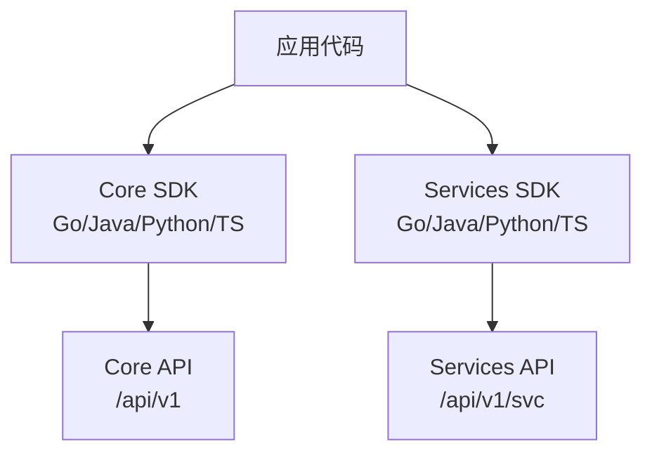
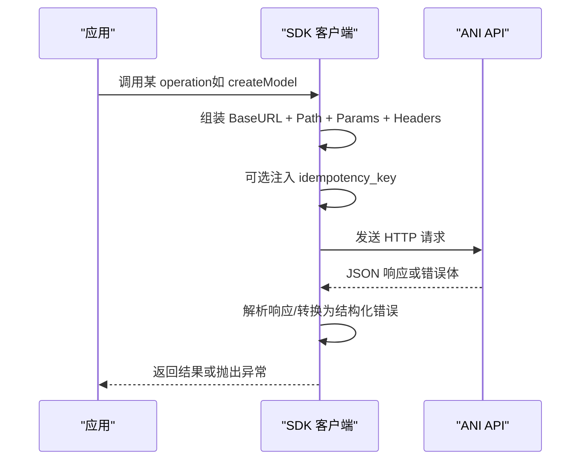
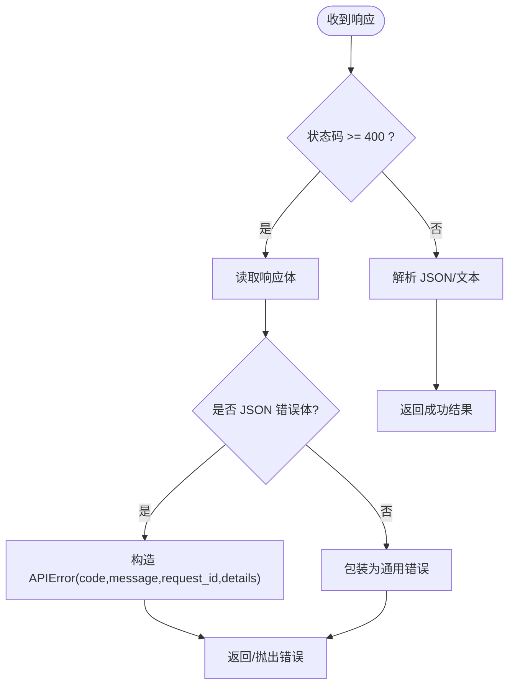
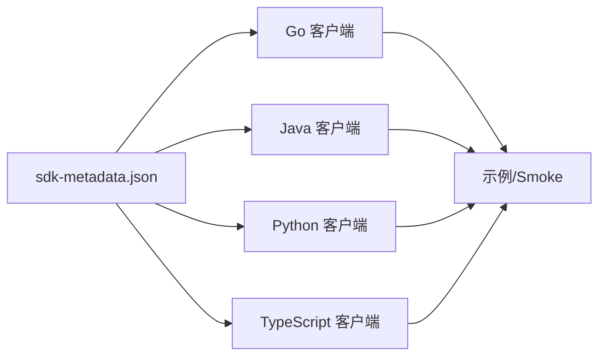
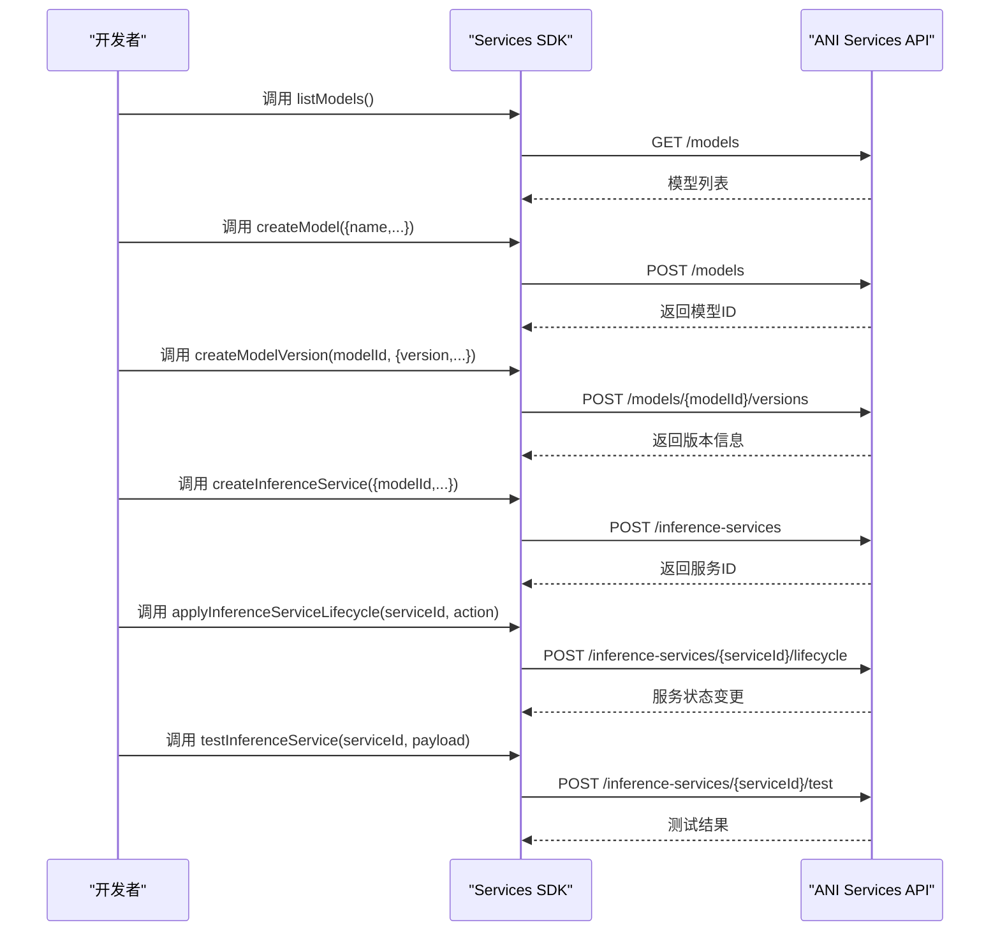

# SDK 集成指南

<cite>
**本文引用的文件**   
- [core/sdk-metadata.json](file://repo/sdks/core/sdk-metadata.json)
- [services/sdk-metadata.json](file://repo/sdks/services/sdk-metadata.json)
- [Go Core 客户端](file://repo/sdks/core/go/anisdk/client.go)
- [Java Core 客户端](file://repo/sdks/core/java/src/main/java/com/kubercloud/ani/core/ApiClient.java)
- [Python Core 客户端](file://repo/sdks/core/python/kubercloud_ani_core/client.py)
- [TypeScript Core 客户端](file://repo/sdks/core/typescript/src/index.ts)
- [Go Services 客户端](file://repo/sdks/services/go/anisdk/client.go)
- [Go Core 示例](file://repo/sdks/core/go/examples/basic/main.go)
- [Java Core 示例](file://repo/sdks/core/java/examples/Basic.java)
- [Python Core 示例](file://repo/sdks/core/python/examples/basic.py)
- [TypeScript Core 示例](file://repo/sdks/core/typescript/examples/basic.mjs)
- [Go Services 示例](file://repo/sdks/services/go/examples/basic/main.go)
- [Java Services 示例](file://repo/sdks/services/java/examples/Basic.java)
- [Python Services 示例](file://repo/sdks/services/python/examples/basic.py)
- [TypeScript Services 示例](file://repo/sdks/services/typescript/examples/basic.mjs)
</cite>

## 目录
1. [简介](#简介)
2. [项目结构](#项目结构)
3. [核心组件](#核心组件)
4. [架构总览](#架构总览)
5. [详细组件分析](#详细组件分析)
6. [依赖关系分析](#依赖关系分析)
7. [性能与连接池建议](#性能与连接池建议)
8. [故障排查指南](#故障排查指南)
9. [结论](#结论)
10. [附录：完整调用流程（模型注册、版本管理、推理调用）](#附录完整调用流程模型注册版本管理推理调用)

## 简介
本指南面向 Go、Java、Python、TypeScript 四种语言的开发者，提供 ANI 平台多语言 SDK 的集成与使用指南。内容覆盖：
- 认证配置（Token/Bearer）
- API 调用方式（统一请求封装、路径参数、查询参数、幂等键）
- 错误处理（统一错误码、结构化错误对象）
- 分页与游标（Cursor 分页）
- 连接复用与连接池（各语言 HTTP 客户端默认行为与扩展建议）
- 完整流程示例：模型注册、版本管理、推理服务生命周期与测试调用

SDK 由 OpenAPI/元数据驱动生成，保证四端一致性与可维护性。

## 项目结构
仓库中 SDK 分为两层：
- core：平台核心能力（实例、存储、网络、配额、鉴权等）
- services：上层业务能力（模型、知识库、推理服务等）

每层均提供 Go、Java、Python、TypeScript 四个语言实现，并附带示例与 smoke 测试。

图表来源
- [core/sdk-metadata.json:1-10](file://repo/sdks/core/sdk-metadata.json#L1-L10)
- [services/sdk-metadata.json:1-10](file://repo/sdks/services/sdk-metadata.json#L1-L10)

章节来源
- [core/sdk-metadata.json:1-10](file://repo/sdks/core/sdk-metadata.json#L1-L10)
- [services/sdk-metadata.json:1-10](file://repo/sdks/services/sdk-metadata.json#L1-L10)

## 核心组件
- 统一客户端：每个语言均提供 Client/ApiClient，负责构建 URL、设置 Header、发送请求、解码响应、错误转换。
- 操作清单与路径映射：通过常量数组声明可用 operationId 与 path，便于校验与工具链使用。
- 幂等性支持：提供 idempotency_key 注入与生成工具，保障重试安全。
- 游标分页：提供 cursorParams 构造 limit/cursor 查询参数。
- 错误体系：统一错误码集合与结构化错误对象，便于上层分类处理。

章节来源
- [Go Core 客户端:16-20](file://repo/sdks/core/go/anisdk/client.go#L16-L20)
- [Java Core 客户端:21-27](file://repo/sdks/core/java/src/main/java/com/kubercloud/ani/core/ApiClient.java#L21-L27)
- [Python Core 客户端:6-9](file://repo/sdks/core/python/kubercloud_ani_core/client.py#L6-L9)
- [TypeScript Core 客户端:1-5](file://repo/sdks/core/typescript/src/index.ts#L1-L5)
- [Go Services 客户端:16-19](file://repo/sdks/services/go/anisdk/client.go#L16-L19)

## 架构总览
SDK 作为轻量 HTTP 客户端，将业务语义（operationId）映射到具体 HTTP 方法+路径，并通过统一的请求/响应编解码与错误处理，屏蔽底层细节。

图表来源
- [Go Services 客户端:391-442](file://repo/sdks/services/go/anisdk/client.go#L391-L442)
- [Go Services 客户端:461-496](file://repo/sdks/services/go/anisdk/client.go#L461-L496)

## 详细组件分析

### 认证与配置
- 基础地址：BaseURL/SERVER_URL 在 SDK 常量中定义，可通过构造函数覆盖。
- 认证头：Authorization: Bearer <token> 在每次请求时自动注入。
- 环境切换：通过传入不同 BaseURL 即可切换开发/测试/生产环境。

章节来源
- [Go Core 客户端:16-20](file://repo/sdks/core/go/anisdk/client.go#L16-L20)
- [Java Core 客户端:21-27](file://repo/sdks/core/java/src/main/java/com/kubercloud/ani/core/ApiClient.java#L21-L27)
- [Python Core 客户端:6-9](file://repo/sdks/core/python/kubercloud_ani_core/client.py#L6-L9)
- [TypeScript Core 客户端:1-5](file://repo/sdks/core/typescript/src/index.ts#L1-L5)
- [Go Services 客户端:391-442](file://repo/sdks/services/go/anisdk/client.go#L391-L442)

### API 调用与参数
- 路径参数：通过 params 字典传入，SDK 会拼接为 URL。
- 查询参数：cursorParams(limit, cursor) 用于列表分页。
- 请求体：以 JSON 形式序列化后发送。
- 幂等键：withIdempotencyKey(body, key) 自动注入 idempotency_key，避免重复提交。

章节来源
- [Go Services 客户端:409-442](file://repo/sdks/services/go/anisdk/client.go#L409-L442)
- [Go Services 客户端:507-531](file://repo/sdks/services/go/anisdk/client.go#L507-L531)
- [Go Services 客户端:533-542](file://repo/sdks/services/go/anisdk/client.go#L533-L542)
- [Go Core 示例:10-21](file://repo/sdks/core/go/examples/basic/main.go#L10-L21)
- [Java Core 示例:5-17](file://repo/sdks/core/java/examples/Basic.java#L5-L17)
- [Python Core 示例:4-15](file://repo/sdks/core/python/examples/basic.py#L4-L15)
- [TypeScript Core 示例:4-13](file://repo/sdks/core/typescript/examples/basic.mjs#L4-L13)

### 错误处理
- 统一错误码：ErrorCodes 列出所有服务端错误码，便于前端/后端对齐。
- 结构化错误：APIError 包含 code、message、request_id、details。
- 判断工具：IsAPIErrorCode(code) 快速识别是否为已知错误码。

图表来源
- [Go Services 客户端:461-496](file://repo/sdks/services/go/anisdk/client.go#L461-L496)
- [Go Services 客户端:374-389](file://repo/sdks/services/go/anisdk/client.go#L374-L389)
- [Go Services 客户端:544-555](file://repo/sdks/services/go/anisdk/client.go#L544-L555)

章节来源
- [Go Services 客户端:374-389](file://repo/sdks/services/go/anisdk/client.go#L374-L389)
- [Go Services 客户端:461-496](file://repo/sdks/services/go/anisdk/client.go#L461-L496)
- [Go Services 客户端:544-555](file://repo/sdks/services/go/anisdk/client.go#L544-L555)

### 分页与游标
- 使用 cursorParams(limit, cursor) 构造分页参数。
- 服务端对列表接口采用 Cursor 分页，需循环拉取直到无更多数据。

章节来源
- [Go Services 客户端:533-542](file://repo/sdks/services/go/anisdk/client.go#L533-L542)
- [Go Core 示例:16-18](file://repo/sdks/core/go/examples/basic/main.go#L16-L18)
- [Java Core 示例:7-12](file://repo/sdks/core/java/examples/Basic.java#L7-L12)
- [Python Core 示例:6-12](file://repo/sdks/core/python/examples/basic.py#L6-L12)
- [TypeScript Core 示例:6-9](file://repo/sdks/core/typescript/examples/basic.mjs#L6-L9)

### 连接池与并发
- Go：使用 http.DefaultClient，复用连接；高并发场景建议自定义 http.Client 并配置 Transport 的连接池大小与空闲连接数。
- Java：使用 java.net.http.HttpClient.newHttpClient()，默认启用连接复用；可按需配置 Executor 与连接池策略。
- Python：标准库 urllib.request，适合简单场景；高吞吐建议使用 requests.Session 或 aiohttp 进行连接复用。
- TypeScript：Node.js fetch 基于内置 HTTP 客户端，具备连接复用；浏览器环境遵循浏览器连接复用策略。

章节来源
- [Go Services 客户端:436-442](file://repo/sdks/services/go/anisdk/client.go#L436-L442)
- [Java Core 客户端:21-23](file://repo/sdks/core/java/src/main/java/com/kubercloud/ani/core/ApiClient.java#L21-L23)
- [Python Core 客户端:1-4](file://repo/sdks/core/python/kubercloud_ani_core/client.py#L1-L4)
- [TypeScript Core 客户端:1-5](file://repo/sdks/core/typescript/src/index.ts#L1-L5)

## 依赖关系分析
- SDK 元数据驱动：core 与 services 层的 sdk-metadata.json 定义了 serverURL、operations、schemas、idempotencyOperations、cursorPaginationOperations、errorCodes。
- 代码生成：各语言客户端由脚本生成，保证与元数据一致。
- 示例与测试：每种语言提供 basic 示例与 smoke 测试，验证基本能力。

图表来源
- [core/sdk-metadata.json:1-10](file://repo/sdks/core/sdk-metadata.json#L1-L10)
- [services/sdk-metadata.json:1-10](file://repo/sdks/services/sdk-metadata.json#L1-L10)

章节来源
- [core/sdk-metadata.json:1-10](file://repo/sdks/core/sdk-metadata.json#L1-L10)
- [services/sdk-metadata.json:1-10](file://repo/sdks/services/sdk-metadata.json#L1-L10)

## 性能与连接池建议
- 合理设置超时：根据业务 SLA 设置连接超时与读写超时，避免长尾请求拖垮系统。
- 控制并发度：在高 QPS 场景下限制并发 goroutine/线程，避免资源耗尽。
- 复用连接：确保使用共享的 HTTP 客户端实例，避免频繁创建销毁连接。
- 重试与退避：对可重试的错误（如网络抖动）实施指数退避重试，结合幂等键保证一致性。
- 监控与指标：记录请求耗时、错误率、重试次数，便于定位瓶颈。

[本节为通用指导，不直接分析具体文件]

## 故障排查指南
- 认证失败：检查 BaseURL 与 Token 是否正确注入 Authorization 头。
- 404/路径错误：确认 operationId 与路径匹配，核对 paths 列表。
- 参数缺失：检查必填字段与路径参数是否完整。
- 幂等冲突：若出现 IDEMPOTENCY_CONFLICT，检查 idempotency_key 是否唯一且未过期。
- 分页卡住：确认 cursor 更新逻辑，避免死循环。
- 超时与限流：观察服务端错误码（如 RUNTIME_TIMEOUT），调整超时或降低并发。

章节来源
- [Go Services 客户端:374-389](file://repo/sdks/services/go/anisdk/client.go#L374-L389)
- [Go Services 客户端:461-496](file://repo/sdks/services/go/anisdk/client.go#L461-L496)
- [Go Services 客户端:544-555](file://repo/sdks/services/go/anisdk/client.go#L544-L555)

## 结论
本指南基于仓库中的 SDK 元数据与各语言客户端实现，提供了统一的认证、调用、错误处理、分页与连接复用实践。通过示例代码与流程图，帮助开发者快速完成模型注册、版本管理与推理调用的端到端集成。建议在真实环境中结合监控与限流策略，确保稳定性与可观测性。

[本节为总结，不直接分析具体文件]

## 附录：完整调用流程（模型注册、版本管理、推理调用）
以下流程以 Services 层为主，涵盖模型与推理服务的典型生命周期。

图表来源
- [services/sdk-metadata.json:254-288](file://repo/sdks/services/sdk-metadata.json#L254-L288)
- [services/sdk-metadata.json:74-126](file://repo/sdks/services/sdk-metadata.json#L74-L126)

章节来源
- [services/sdk-metadata.json:254-288](file://repo/sdks/services/sdk-metadata.json#L254-L288)
- [services/sdk-metadata.json:74-126](file://repo/sdks/services/sdk-metadata.json#L74-L126)