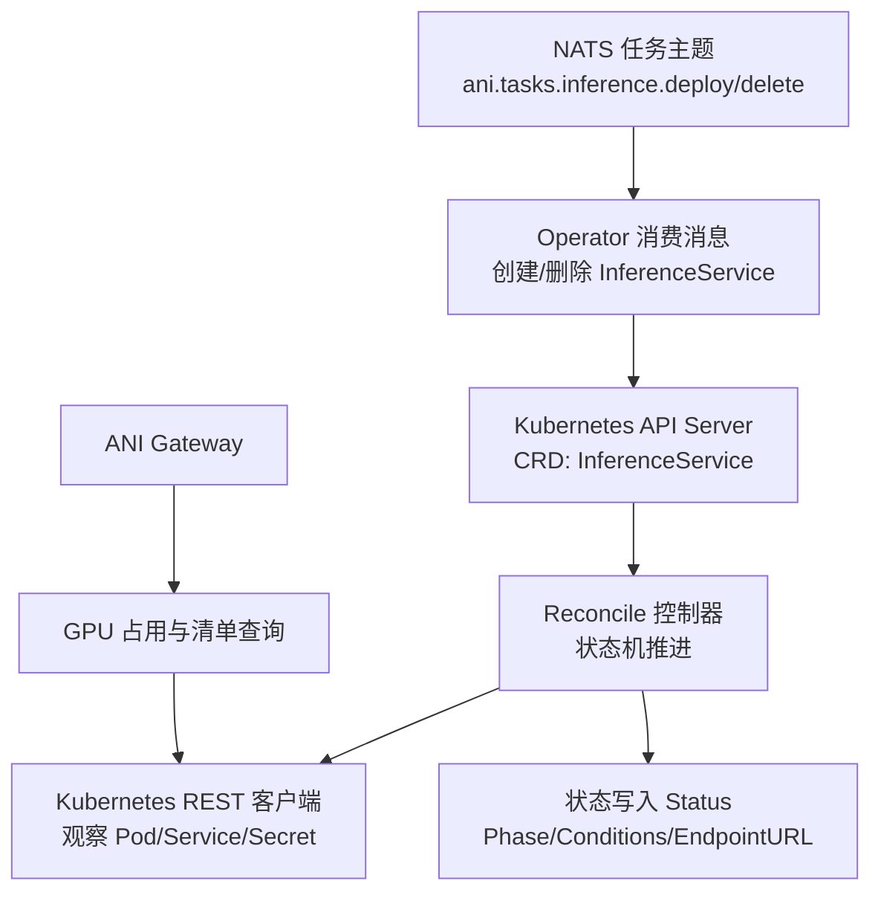
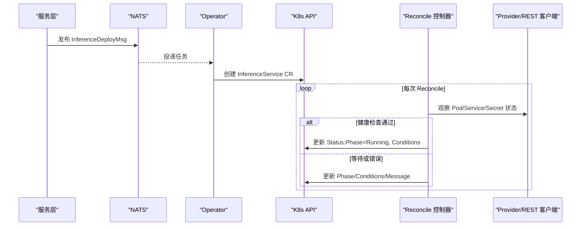
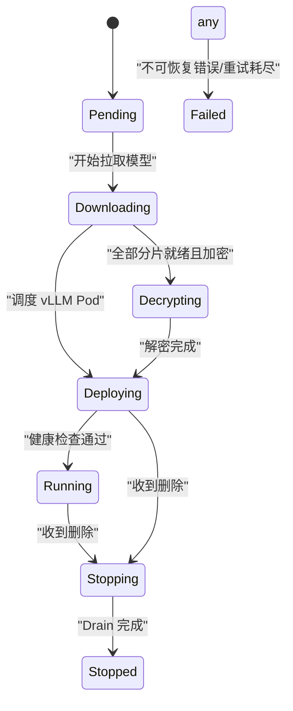
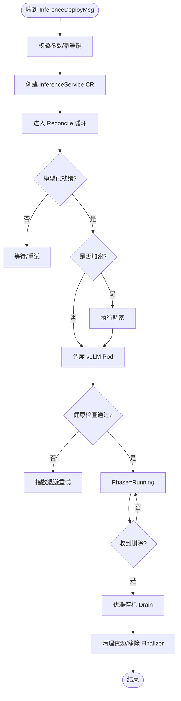
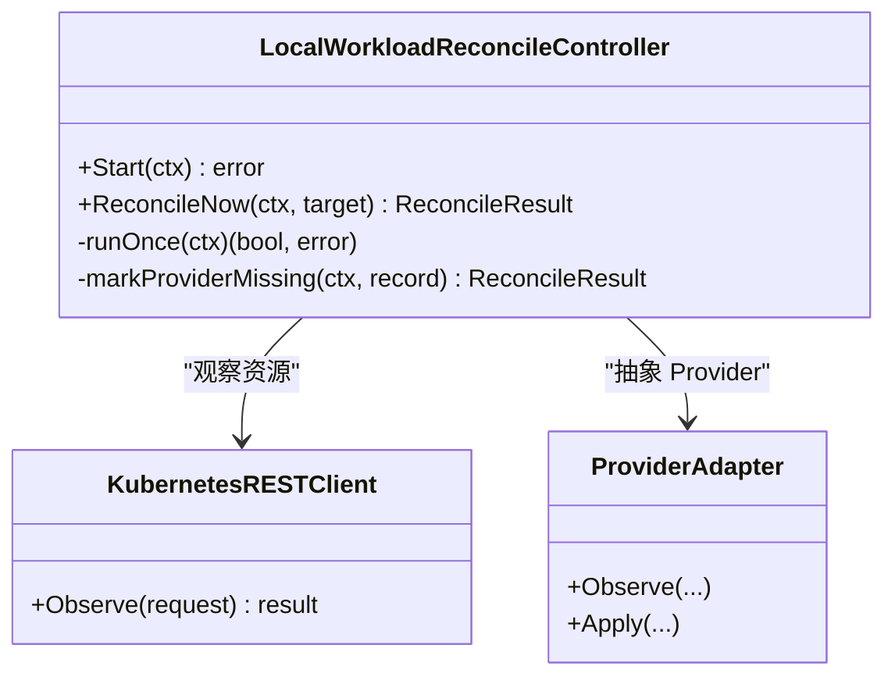
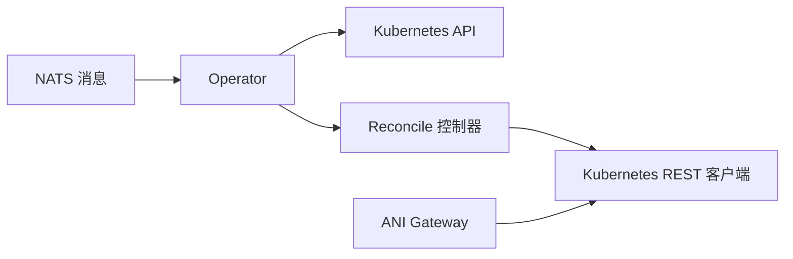

# 推理服务操作符

<cite>
**本文引用的文件**
- [inferenceservice_types.go](file://repo/operators/inference-operator/api/v1/inferenceservice_types.go)
- [messages.go](file://repo/pkg/nats/messages.go)
- [reconcile_controller.go](file://repo/pkg/adapters/runtime/reconcile_controller.go)
- [kubernetes_rest_client.go](file://repo/pkg/adapters/runtime/kubernetes_rest_client.go)
- [provider_apply.go](file://repo/pkg/adapters/runtime/provider_apply.go)
- [status_reconciler.go](file://repo/pkg/adapters/runtime/status_reconciler.go)
- [instance_orchestrator.go](file://repo/pkg/adapters/runtime/instance_orchestrator.go)
- [gpu_inventory_resources.go](file://repo/services/ani-gateway/internal/router/gpu_inventory_resources.go)
- [core-contract-a.md](file://repo/development-records/inference-platform-workload-contract-a.md)
</cite>

## 目录
1. [简介](#简介)
2. [项目结构](#项目结构)
3. [核心组件](#核心组件)
4. [架构总览](#架构总览)
5. [详细组件分析](#详细组件分析)
6. [依赖关系分析](#依赖关系分析)
7. [性能与扩缩容](#性能与扩缩容)
8. [故障恢复与可观测性](#故障恢复与可观测性)
9. [部署与配置](#部署与配置)
10. [使用示例](#使用示例)
11. [故障排查指南](#故障排查指南)
12. [结论](#结论)

## 简介
本文件面向 InferenceService Operator，系统性说明其自定义资源定义（CRD）、控制器生命周期、状态机、事件处理机制，以及部署、扩缩容、故障恢复策略。文档同时给出基于仓库现有代码的 YAML 字段参考与调用流程说明，帮助读者在不直接阅读源码的情况下理解并正确使用该操作符。

## 项目结构
InferenceService Operator 在仓库中以 CRD 类型定义的形式存在，并通过 NATS 消息与上层服务交互；控制面还复用 Core 的通用 reconcile 控制器与 Kubernetes REST 客户端能力，形成“消息驱动 + 声明式资源 + 通用调度”的整体架构。

图表来源
- [messages.go:20-27](file://repo/pkg/nats/messages.go#L20-L27)
- [inferenceservice_types.go:55-164](file://repo/operators/inference-operator/api/v1/inferenceservice_types.go#L55-L164)
- [reconcile_controller.go:15-60](file://repo/pkg/adapters/runtime/reconcile_controller.go#L15-L60)
- [kubernetes_rest_client.go](file://repo/pkg/adapters/runtime/kubernetes_rest_client.go)
- [gpu_inventory_resources.go:379-435](file://repo/services/ani-gateway/internal/router/gpu_inventory_resources.go#L379-L435)

章节来源
- [inferenceservice_types.go:55-164](file://repo/operators/inference-operator/api/v1/inferenceservice_types.go#L55-L164)
- [messages.go:20-57](file://repo/pkg/nats/messages.go#L20-L57)

## 核心组件
- InferenceService CRD：定义 Spec 与 Status，包含模型引用、副本数、GPU 规格、并发上限、放置策略、加密密钥引用、优雅停机超时等。
- 生命周期阶段与条件：Pending → Downloading → Decrypting → Deploying → Running → Stopping → Stopped/Failed，配合 ModelReady/PodScheduled/Healthy/DrainComplete 四类条件。
- 事件通道：通过 NATS 的 ani.tasks.inference.{deploy|delete} 主题触发创建与删除流程。
- Reconcile 控制器：通用工作负载协调器，负责从 Provider 观察真实状态、幂等推进、失败标记与重试退避。
- Kubernetes REST 客户端：统一访问 K8s 资源，支持 404 映射为“提供者资源丢失”，用于健壮的状态收敛。

章节来源
- [inferenceservice_types.go:16-51](file://repo/operators/inference-operator/api/v1/inferenceservice_types.go#L16-L51)
- [inferenceservice_types.go:55-164](file://repo/operators/inference-operator/api/v1/inferenceservice_types.go#L55-L164)
- [messages.go:20-57](file://repo/pkg/nats/messages.go#L20-L57)
- [reconcile_controller.go:15-60](file://repo/pkg/adapters/runtime/reconcile_controller.go#L15-L60)
- [kubernetes_rest_client.go](file://repo/pkg/adapters/runtime/kubernetes_rest_client.go)

## 架构总览
InferenceService 的生命周期由“消息驱动 + 控制器协调”共同完成：
- 创建：服务层发布 InferenceDeployMsg，Operator 消费后创建 InferenceService CR；控制器将模型拉取、解密、Pod 调度与健康检查串联推进。
- 运行：Gateway 通过内部 Service 访问 vLLM；GPU 占用信息通过 K8s Pod 标签反查聚合。
- 删除：发布 InferenceDeleteMsg，控制器优雅停机（Drain），再清理资源并移除 Finalizer。

图表来源
- [messages.go:31-47](file://repo/pkg/nats/messages.go#L31-L47)
- [inferenceservice_types.go:116-144](file://repo/operators/inference-operator/api/v1/inferenceservice_types.go#L116-L144)
- [reconcile_controller.go:89-170](file://repo/pkg/adapters/runtime/reconcile_controller.go#L89-L170)
- [kubernetes_rest_client.go](file://repo/pkg/adapters/runtime/kubernetes_rest_client.go)

## 详细组件分析

### InferenceService CRD 与状态机
- 规格字段
  - model：模型 ID（name:version），创建后不可变。
  - replicas：副本数（默认 1，范围 1-32）。
  - gpuType/gpuCountPerPod：GPU 型号与每 Pod GPU 数量。
  - maxConcurrency：全局最大并发请求数，超出部分由网关排队。
  - placement：Region/AZ 放置偏好（用于派生传播策略）。
  - encryptionKeyRef：引用 Secret 中的解密密钥（仅加密模型需要）。
  - drainTimeoutSeconds：优雅停机超时（默认 30 秒）。
- 状态字段
  - phase：当前阶段（Pending/Downloading/Decrypting/Deploying/Running/Stopping/Stopped/Failed）。
  - observedGeneration：上次处理的元数据版本。
  - endpointURL：运行时的内部 Service URL。
  - readyReplicas：通过健康检查的副本数。
  - message：人类可读状态或错误信息（Failed 时必填）。
  - conditions：ModelReady/PodScheduled/Healthy/DrainComplete 四类条件。
- 终态与转换约束
  - 禁止任意状态直接到 Running；Stopped/Failed 为终态，需重建。
  - 删除时需先 Drain 完成，再移除 Finalizer。

图表来源
- [inferenceservice_types.go:16-42](file://repo/operators/inference-operator/api/v1/inferenceservice_types.go#L16-L42)
- [inferenceservice_types.go:116-144](file://repo/operators/inference-operator/api/v1/inferenceservice_types.go#L116-L144)

章节来源
- [inferenceservice_types.go:55-164](file://repo/operators/inference-operator/api/v1/inferenceservice_types.go#L55-L164)

### 事件处理与消息契约
- 创建事件：InferenceDeployMsg 携带任务 ID、幂等键、租户、服务 ID、模型版本、是否加密、算法、GPU 规格、副本、并发、停机超时等。
- 删除事件：InferenceDeleteMsg 携带任务 ID、租户、服务 ID、停机超时。
- 事件主题：
  - ani.tasks.inference.deploy
  - ani.tasks.inference.delete
  - ani.events.task.completed.{task_id}

图表来源
- [messages.go:31-57](file://repo/pkg/nats/messages.go#L31-L57)
- [inferenceservice_types.go:16-42](file://repo/operators/inference-operator/api/v1/inferenceservice_types.go#L16-L42)

章节来源
- [messages.go:20-57](file://repo/pkg/nats/messages.go#L20-L57)

### Reconcile 控制器与 Provider 适配
- 控制器职责
  - 周期性选择待协调目标，调用 Provider 观察真实状态。
  - 对 Provider 返回的 404 识别为“提供者资源丢失”，持久化失败状态并保持幂等。
  - 支持指标暴露、退避策略、领导者选举等通用能力。
- Provider 适配
  - 通过 Kubernetes REST 客户端统一访问 K8s 资源。
  - 将底层差异封装为统一的 WorkloadInstanceRecord/Status。

图表来源
- [reconcile_controller.go:15-60](file://repo/pkg/adapters/runtime/reconcile_controller.go#L15-L60)
- [reconcile_controller.go:89-170](file://repo/pkg/adapters/runtime/reconcile_controller.go#L89-L170)
- [reconcile_controller.go:201-258](file://repo/pkg/adapters/runtime/reconcile_controller.go#L201-L258)
- [kubernetes_rest_client.go](file://repo/pkg/adapters/runtime/kubernetes_rest_client.go)
- [provider_apply.go](file://repo/pkg/adapters/runtime/provider_apply.go)

章节来源
- [reconcile_controller.go:15-60](file://repo/pkg/adapters/runtime/reconcile_controller.go#L15-L60)
- [reconcile_controller.go:89-170](file://repo/pkg/adapters/runtime/reconcile_controller.go#L89-L170)
- [reconcile_controller.go:201-258](file://repo/pkg/adapters/runtime/reconcile_controller.go#L201-L258)

### 状态协调与写回
- 状态协调器负责将 Provider 观察到的真实状态合并到对象 Status，包括 Phase、Conditions、EndpointURL、ReadyReplicas 等。
- 当观察到 Pod 未就绪或健康检查失败时，持续更新 Condition 与 Message，避免误报 Running。

章节来源
- [status_reconciler.go](file://repo/pkg/adapters/runtime/status_reconciler.go)
- [inferenceservice_types.go:116-144](file://repo/operators/inference-operator/api/v1/inferenceservice_types.go#L116-L144)

### 编排与实例管理
- 编排器负责跨步骤编排（模型拉取、解密、调度、健康检查、优雅停机），并与实例存储、计划审计、异步任务等协作。
- 与 Gateway 的 GPU 占用查询联动，确保容量与调度决策一致。

章节来源
- [instance_orchestrator.go](file://repo/pkg/adapters/runtime/instance_orchestrator.go)
- [gpu_inventory_resources.go:379-435](file://repo/services/ani-gateway/internal/router/gpu_inventory_resources.go#L379-L435)

## 依赖关系分析
- 外部依赖
  - Kubernetes API：CRD、Pod、Service、Secret、Deployment 等。
  - NATS：任务与事件总线。
  - 可选：Prometheus/Loki（指标与日志，视部署而定）。
- 内部依赖
  - Reconcile 控制器：提供通用的轮询、退避、失败标记能力。
  - Kubernetes REST 客户端：统一访问 K8s 资源，屏蔽网络与权限细节。
  - Gateway：读取 Pod 标签计算 GPU 占用，辅助容量与路由。

图表来源
- [messages.go:20-27](file://repo/pkg/nats/messages.go#L20-L27)
- [reconcile_controller.go:15-60](file://repo/pkg/adapters/runtime/reconcile_controller.go#L15-L60)
- [kubernetes_rest_client.go](file://repo/pkg/adapters/runtime/kubernetes_rest_client.go)
- [gpu_inventory_resources.go:379-435](file://repo/services/ani-gateway/internal/router/gpu_inventory_resources.go#L379-L435)

章节来源
- [messages.go:20-57](file://repo/pkg/nats/messages.go#L20-L57)
- [reconcile_controller.go:15-60](file://repo/pkg/adapters/runtime/reconcile_controller.go#L15-L60)

## 性能与扩缩容
- 扩缩容
  - 通过调整 spec.replicas 实现水平扩缩容；控制器会重新调度/终止 Pod 以匹配期望副本数。
  - 建议结合 MaxConcurrency 与 Gateway 队列能力，避免瞬时过载。
- 并发与限流
  - MaxConcurrency 限制所有副本的总并发；超出部分由网关排队，降低 429 概率。
- 资源隔离
  - 通过 PlacementSpec 指定 Region/AZ，结合 Karmada 传播策略进行多集群/多可用区部署。
- 弹性策略
  - 结合 HPA/VPA 与业务指标（如延迟、吞吐）自动扩缩容；注意模型预热成本，避免频繁抖动。

[本节为通用指导，不直接分析具体文件]

## 故障恢复与可观测性
- 失败恢复
  - 控制器将 Provider 资源 404 识别为“提供者资源丢失”，持久化失败状态并保持幂等，重复 Reconcile 不会破坏状态。
  - 非 404 错误（403/429/5xx/超时/网络）按原样上报，便于区分基础设施问题。
- 优雅停机
  - 删除时先 Drain 请求，达到 drainTimeoutSeconds 后强制终止，确保请求不丢失。
- 可观测性
  - 通过 Conditions 与 Message 暴露细粒度状态。
  - ReadyReplicas 与 EndpointURL 反映运行期可用性。
  - 指标与日志可通过 Prometheus/Loki 采集（视部署配置）。

章节来源
- [reconcile_controller.go:201-258](file://repo/pkg/adapters/runtime/reconcile_controller.go#L201-L258)
- [inferenceservice_types.go:116-144](file://repo/operators/inference-operator/api/v1/inferenceservice_types.go#L116-L144)

## 部署与配置
- 安装 CRD
  - 部署 InferenceService CRD 至集群，启用短名 isvc。
- 部署 Operator
  - 启动 Operator 进程，订阅 NATS 主题，监听 InferenceService 变更。
- 配置要点
  - 模型注册表与存储：确保模型可拉取与缓存。
  - 加密密钥：若模型加密，需在命名空间创建 Secret 并在 spec.encryptionKeyRef 引用。
  - 资源配额与调度：根据 GPU 型号与数量配置节点池/亲和性。
  - 网络与安全：确保 Gateway 能访问内部 Service；必要时配置 mTLS。

[本节为通用指导，不直接分析具体文件]

## 使用示例
以下为基于仓库中 CRD 字段的最小化 YAML 参考（字段来源于 CRD 定义，不包含具体值内容）：
- 基本推理服务（CPU/GPU 均可）
  - 关键字段：metadata.name、spec.model、spec.replicas、spec.gpuType（可选）、spec.gpuCountPerPod（可选）、spec.maxConcurrency（可选）、spec.placement（可选）、spec.encryptionKeyRef（可选）、spec.drainTimeoutSeconds（可选）。
- 加密模型推理服务
  - 额外提供 Secret 名称与 Key，供 Operator 在解密阶段使用。
- 多副本高可用
  - 设置 replicas > 1，并结合 MaxConcurrency 与 Gateway 队列能力。

提示：请根据实际环境填写 model、replicas、gpuType、gpuCountPerPod、maxConcurrency、placement.region/az、encryptionKeyRef.secretName/key、drainTimeoutSeconds 等字段。

章节来源
- [inferenceservice_types.go:55-112](file://repo/operators/inference-operator/api/v1/inferenceservice_types.go#L55-L112)
- [inferenceservice_types.go:116-144](file://repo/operators/inference-operator/api/v1/inferenceservice_types.go#L116-L144)

## 故障排查指南
- 常见症状与定位
  - Phase=Failed：查看 status.message 与 Conditions，确认是否为不可恢复错误或重试耗尽。
  - Phase=Deploying 长时间不转 Running：检查 Pod 是否调度成功、健康检查是否通过、模型是否拉取/解密完成。
  - 删除卡住：确认 Drain 是否完成，是否存在长连接或未完成的请求。
- Provider 资源丢失
  - 当底层资源被外部删除导致 404 时，控制器会记录失败状态并保持幂等；修复后重新触发 Reconcile 即可恢复。
- 并发与拥塞
  - 若出现大量排队，检查 MaxConcurrency 与 Gateway 队列配置，必要时扩容副本或优化模型加载时间。
- 监控与日志
  - 通过 Prometheus 指标与 Loki 日志定位具体阶段瓶颈（模型下载、解密、调度、健康检查）。

章节来源
- [reconcile_controller.go:201-258](file://repo/pkg/adapters/runtime/reconcile_controller.go#L201-L258)
- [inferenceservice_types.go:116-144](file://repo/operators/inference-operator/api/v1/inferenceservice_types.go#L116-L144)

## 结论
InferenceService Operator 以 CRD + NATS + Reconcile 控制器为核心，提供了声明式的 AI 推理服务管理能力。通过严格的阶段转换与条件表达，结合优雅停机与失败恢复机制，能够在复杂环境下稳定交付推理服务。配合 Gateway 的容量与队列能力，可实现高可用、可扩展的推理服务编排。

[本节为总结性内容，不直接分析具体文件]