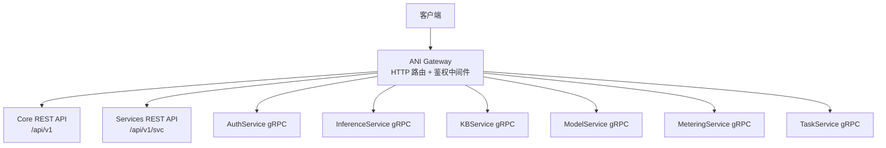
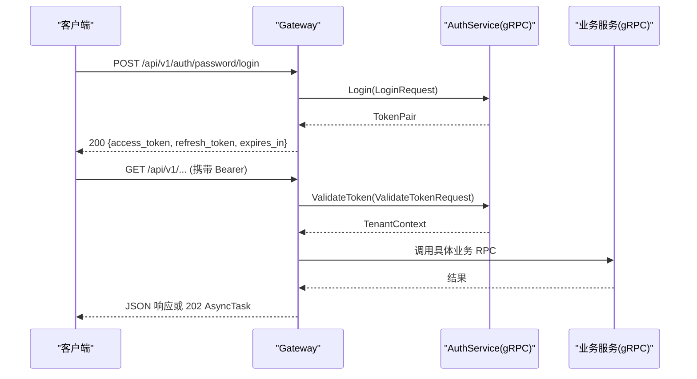
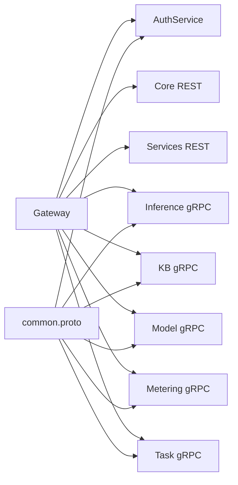

# API 参考

<cite>
**本文引用的文件**
- [repo/api/openapi/v1.yaml](file://repo/api/openapi/v1.yaml)
- [repo/api/openapi/services/v1.yaml](file://repo/api/openapi/services/v1.yaml)
- [repo/api/proto/common/v1/common.proto](file://repo/api/proto/common/v1/common.proto)
- [repo/api/proto/auth/v1/auth_service.proto](file://repo/api/proto/auth/v1/auth_service.proto)
- [repo/api/proto/inference/v1/inference_service.proto](file://repo/api/proto/inference/v1/inference_service.proto)
- [repo/api/proto/kb/v1/kb_service.proto](file://repo/api/proto/kb/v1/kb_service.proto)
- [repo/api/proto/model/v1/model_service.proto](file://repo/api/proto/model/v1/model_service.proto)
- [repo/api/proto/metering/v1/metering_service.proto](file://repo/api/proto/metering/v1/metering_service.proto)
- [repo/api/proto/task/v1/task_service.proto](file://repo/api/proto/task/v1/task_service.proto)
- [repo/services/ani-gateway/internal/router/auth.go](file://repo/services/ani-gateway/internal/router/auth.go)
</cite>

## 目录
1. [简介](#简介)
2. [项目结构](#项目结构)
3. [核心组件](#核心组件)
4. [架构总览](#架构总览)
5. [详细组件分析](#详细组件分析)
6. [依赖关系分析](#依赖关系分析)
7. [性能与一致性](#性能与一致性)
8. [故障排查指南](#故障排查指南)
9. [结论](#结论)
10. [附录：版本管理与迁移](#附录：版本管理与迁移)

## 简介
本参考文档面向 ANI 平台的 REST、gRPC 与 WebSocket 接口，覆盖认证、资源管理、推理服务、知识库、模型仓库、计量与异步任务等能力。所有 HTTP 端点统一通过 Gateway 暴露，REST 契约以 OpenAPI 定义，gRPC 契约以 Protobuf 定义；WebSocket 用于实例控制台与执行会话的实时交互。

- 认证方式：Bearer JWT（短期访问令牌）或 X-API-Key（长期密钥）。租户上下文从 JWT claims 提取，请求体中的 tenant_id 字段将被忽略。
- 错误格式：统一返回 { code, message, request_id, details? }。
- 分页：cursor 分页，查询参数 limit、cursor，响应包含 items、total、next_cursor。
- 异步操作：创建类接口通常返回 202 与 AsyncTask，Location Header 指向任务 URL，支持轮询或 Webhook。

**章节来源**
- [repo/api/openapi/v1.yaml:1-40](file://repo/api/openapi/v1.yaml#L1-L40)
- [repo/api/openapi/services/v1.yaml:1-20](file://repo/api/openapi/services/v1.yaml#L1-L20)

## 项目结构
ANI 对外暴露两类 REST 契约：
- Core API：基础设施资源（实例、存储、网络、加密、KMS、注册表、计量、可观测性等），基础路径 /api/v1。
- Services API：业务层资源（模型、推理服务、知识库、沙箱、集成、租户成员等），基础路径 /api/v1/svc。

gRPC 协议按领域分包：auth、inference、kb、model、metering、task，以及公共消息 common。



**图表来源**
- [repo/api/openapi/v1.yaml:16-26](file://repo/api/openapi/v1.yaml#L16-L26)
- [repo/api/openapi/services/v1.yaml:11-20](file://repo/api/openapi/services/v1.yaml#L11-L20)
- [repo/api/proto/auth/v1/auth_service.proto:11-30](file://repo/api/proto/auth/v1/auth_service.proto#L11-L30)
- [repo/api/proto/inference/v1/inference_service.proto:11-33](file://repo/api/proto/inference/v1/inference_service.proto#L11-L33)
- [repo/api/proto/kb/v1/kb_service.proto:11-53](file://repo/api/proto/kb/v1/kb_service.proto#L11-L53)
- [repo/api/proto/model/v1/model_service.proto:11-40](file://repo/api/proto/model/v1/model_service.proto#L11-L40)
- [repo/api/proto/metering/v1/metering_service.proto:11-22](file://repo/api/proto/metering/v1/metering_service.proto#L11-L22)
- [repo/api/proto/task/v1/task_service.proto:10-35](file://repo/api/proto/task/v1/task_service.proto#L10-L35)

**章节来源**
- [repo/api/openapi/v1.yaml:1-40](file://repo/api/openapi/v1.yaml#L1-L40)
- [repo/api/openapi/services/v1.yaml:1-20](file://repo/api/openapi/services/v1.yaml#L1-L20)

## 核心组件
- 认证与授权：提供密码登录、平台密码登录、OIDC 流程、令牌刷新与撤销、API Key 生命周期管理；Gateway 将 gRPC 错误映射为 HTTP 错误码与标准错误体。
- 资源管理（Core）：Kubernetes 集群、节点池、代理、加密密钥、Secret、平台工作负载等。
- 业务资源（Services）：模型、推理服务、知识库、沙箱、集成、租户成员、Webhook 等。
- 异步任务：统一的 AsyncTask 状态机与任务查询、取消、进度上报、租约与心跳。
- 计量：记录与查询用量，生成周期汇总。

**章节来源**
- [repo/api/proto/auth/v1/auth_service.proto:11-30](file://repo/api/proto/auth/v1/auth_service.proto#L11-L30)
- [repo/api/openapi/v1.yaml:67-198](file://repo/api/openapi/v1.yaml#L67-L198)
- [repo/api/openapi/services/v1.yaml:129-800](file://repo/api/openapi/services/v1.yaml#L129-L800)
- [repo/api/proto/task/v1/task_service.proto:10-113](file://repo/api/proto/task/v1/task_service.proto#L10-L113)
- [repo/api/proto/metering/v1/metering_service.proto:11-70](file://repo/api/proto/metering/v1/metering_service.proto#L11-L70)

## 架构总览
Gateway 作为统一入口，负责：
- 路由分发到 Core/Services REST 或对应 gRPC 服务。
- 鉴权与权限校验（JWT/API Key → TenantContext）。
- 错误标准化与重试/限流策略（由网关中间件实现）。
- 将 gRPC 错误映射为 HTTP 错误码与统一错误体。



**图表来源**
- [repo/services/ani-gateway/internal/router/auth.go:102-113](file://repo/services/ani-gateway/internal/router/auth.go#L102-L113)
- [repo/api/proto/auth/v1/auth_service.proto:11-30](file://repo/api/proto/auth/v1/auth_service.proto#L11-L30)

**章节来源**
- [repo/services/ani-gateway/internal/router/auth.go:100-300](file://repo/services/ani-gateway/internal/router/auth.go#L100-L300)
- [repo/api/proto/common/v1/common.proto:9-36](file://repo/api/proto/common/v1/common.proto#L9-L36)

## 详细组件分析

### 认证 REST 端点（Gateway 暴露）
- 账号密码登录
  - POST /api/v1/auth/password/login
  - 请求体：tenant_name, username, password, idempotency_key(可选)
  - 响应：access_token, refresh_token, expires_in, issued_at
  - 错误：BAD_REQUEST, INVALID_CREDENTIALS, TENANT_NOT_FOUND, AUTH_NOT_CONFIGURED, AUTH_SERVICE_UNAVAILABLE
- 平台密码登录
  - POST /api/v1/auth/platform/password/login
  - 请求体：username, password, idempotency_key(可选)
  - 响应：同上
- OIDC 流程
  - POST /api/v1/auth/oidc/begin → authorization_url, state
  - POST /api/v1/auth/token → access_token, refresh_token, expires_in
- 令牌刷新与登出
  - POST /api/v1/auth/refresh → access_token, expires_in
  - POST /api/v1/auth/logout → status: revoked
- API Key 管理
  - GET /api/v1/auth/api-keys
  - POST /api/v1/auth/api-keys
  - DELETE /api/v1/auth/api-keys/:key_id

说明：
- 所有认证相关 HTTP 错误由 Gateway 将 gRPC 状态码映射为标准错误码与消息。
- 成功登录返回 200；创建 API Key 返回 201。

**章节来源**
- [repo/services/ani-gateway/internal/router/auth.go:102-113](file://repo/services/ani-gateway/internal/router/auth.go#L102-L113)
- [repo/services/ani-gateway/internal/router/auth.go:115-174](file://repo/services/ani-gateway/internal/router/auth.go#L115-L174)
- [repo/services/ani-gateway/internal/router/auth.go:176-229](file://repo/services/ani-gateway/internal/router/auth.go#L176-L229)
- [repo/services/ani-gateway/internal/router/auth.go:231-285](file://repo/services/ani-gateway/internal/router/auth.go#L231-L285)
- [repo/services/ani-gateway/internal/router/auth.go:287-300](file://repo/services/ani-gateway/internal/router/auth.go#L287-L300)
- [repo/services/ani-gateway/internal/router/auth.go:533-556](file://repo/services/ani-gateway/internal/router/auth.go#L533-L556)

### gRPC 认证服务
- AuthService
  - Login / PlatformPasswordLogin → TokenPair
  - BeginOIDCLogin / CompleteOIDCLogin → 授权链接与令牌
  - RefreshToken → AccessToken
  - RevokeToken → Empty
  - ValidateToken → TenantContext（内部使用）
  - CheckPermission → 权限判定
  - CreateAPIKey / ListAPIKeys / RevokeAPIKey → API Key 生命周期

**章节来源**
- [repo/api/proto/auth/v1/auth_service.proto:11-30](file://repo/api/proto/auth/v1/auth_service.proto#L11-L30)
- [repo/api/proto/auth/v1/auth_service.proto:32-138](file://repo/api/proto/auth/v1/auth_service.proto#L32-L138)

### Core REST API（v1）
- 服务器前缀：/api/v1
- 认证：Bearer JWT 或 X-API-Key
- 分页：CursorPage（items, total, next_cursor）
- 异步：202 返回 AsyncTask，Location 指向任务 URL
- 主要资源示例（详见 OpenAPI）：
  - K8sCluster / NodePool / Proxy
  - EncryptionKey / Secret
  - PlatformWorkload（拓扑、调度、网络、健康检查、日志）

注意：
- tenant_id 从 JWT claims 提取，请求体中若出现将被忽略。
- 错误统一 ErrorResponse。

**章节来源**
- [repo/api/openapi/v1.yaml:16-40](file://repo/api/openapi/v1.yaml#L16-L40)
- [repo/api/openapi/v1.yaml:67-198](file://repo/api/openapi/v1.yaml#L67-L198)
- [repo/api/openapi/v1.yaml:333-373](file://repo/api/openapi/v1.yaml#L333-L373)
- [repo/api/openapi/v1.yaml:374-800](file://repo/api/openapi/v1.yaml#L374-L800)

### Services REST API（v1）
- 服务器前缀：/api/v1/svc
- 认证：同 Core（Bearer/JWT 或 X-API-Key）
- 业务资源示例（详见 OpenAPI）：
  - 模型与模型版本
  - 推理服务（部署、扩缩容、测试、日志、策略）
  - 知识库（创建、文档上传、检索、会话、权限）
  - 沙箱（创建、扩展、安全事件）
  - 租户成员、角色、SSO、Webhook、集成

注意：
- 列表接口统一 CursorPage。
- 异步任务返回 AsyncTask。
- 错误响应统一 ErrorResponse，部分响应类型标注了 x-ani-error-codes。

**章节来源**
- [repo/api/openapi/services/v1.yaml:1-20](file://repo/api/openapi/services/v1.yaml#L1-L20)
- [repo/api/openapi/services/v1.yaml:96-128](file://repo/api/openapi/services/v1.yaml#L96-L128)
- [repo/api/openapi/services/v1.yaml:129-800](file://repo/api/openapi/services/v1.yaml#L129-L800)

### gRPC 推理服务
- InferenceServiceRPC
  - CreateInferenceService → 初始状态 + AsyncTaskRef
  - Get/List/DeleteInferenceService
  - GetEndpointURL（Gateway 路由用）
  - UpdateStatus（内部回调）

**章节来源**
- [repo/api/proto/inference/v1/inference_service.proto:11-33](file://repo/api/proto/inference/v1/inference_service.proto#L11-L33)
- [repo/api/proto/inference/v1/inference_service.proto:35-127](file://repo/api/proto/inference/v1/inference_service.proto#L35-L127)

### gRPC 知识库服务
- KBService
  - 知识库 CRUD、文档上传 URL、通知上传完成、文档查询/删除
  - Query（同步 RAG）、Retrieve（服务端流式 token 事件）
  - Phase A P1：引用、会话、权限（P0 返回 UNIMPLEMENTED）

**章节来源**
- [repo/api/proto/kb/v1/kb_service.proto:11-53](file://repo/api/proto/kb/v1/kb_service.proto#L11-L53)
- [repo/api/proto/kb/v1/kb_service.proto:55-210](file://repo/api/proto/kb/v1/kb_service.proto#L55-L210)
- [repo/api/proto/kb/v1/kb_service.proto:211-294](file://repo/api/proto/kb/v1/kb_service.proto#L211-L294)

### gRPC 模型服务
- ModelService
  - 模型元数据 CRUD、版本管理、MinIO 直传下载 URL、远程导入（HuggingFace/ModelScope）

**章节来源**
- [repo/api/proto/model/v1/model_service.proto:11-40](file://repo/api/proto/model/v1/model_service.proto#L11-L40)
- [repo/api/proto/model/v1/model_service.proto:42-157](file://repo/api/proto/model/v1/model_service.proto#L42-L157)

### gRPC 计量服务
- MeteringService
  - RecordUsage（fire-and-forget）、QueryUsage、GetSummary

**章节来源**
- [repo/api/proto/metering/v1/metering_service.proto:11-70](file://repo/api/proto/metering/v1/metering_service.proto#L11-L70)

### gRPC 异步任务服务
- TaskService
  - GetTask、CancelTask、UpdateTaskProgress（内部）、AcquireTaskLease、HeartbeatTaskLease、FailTask、CompleteTask
  - 任务状态机：pending → running → completed/failed/cancelled/dead_letter

**章节来源**
- [repo/api/proto/task/v1/task_service.proto:10-113](file://repo/api/proto/task/v1/task_service.proto#L10-L113)

### WebSocket 接口（实例控制台/执行）
- 连接地址模式：ws(s)://{host}/api/v1/instances/{instance_id}/{exec|console}/{session_id}
- 用途：
  - exec：实例内命令执行会话（双向流）
  - console：VNC/Console 会话（双向流）
- 连接处理：
  - 由后端运行时适配器生成并返回 connect_url，客户端据此建立 WebSocket 连接。
- 消息与事件：
  - 具体帧格式由运行时实现决定；典型包括输出行、错误、关闭事件等。
- 安全：
  - 连接需经 Gateway 鉴权与会话绑定，避免未授权访问。

```mermaid
sequenceDiagram
participant U as "前端/客户端"
participant G as "Gateway"
participant O as "Observability Runtime"
U->>G : 请求创建执行/控制台会话
G-->>U : 返回 {connect_url, protocol, expires_at}
U->>U : 使用 connect_url 建立 WebSocket
U<->O : 双向消息流命令/输出/事件
```

**图表来源**
- [repo/pkg/adapters/runtime/local_instance_observability_service.go:133-170](file://repo/pkg/adapters/runtime/local_instance_observability_service.go#L133-L170)
- [repo/pkg/adapters/runtime/prometheus_instance_observability.go:81](file://repo/pkg/adapters/runtime/prometheus_instance_observability.go#L81)

**章节来源**
- [repo/pkg/adapters/runtime/local_instance_observability_service.go:133-170](file://repo/pkg/adapters/runtime/local_instance_observability_service.go#L133-L170)
- [repo/pkg/adapters/runtime/prometheus_instance_observability.go:81](file://repo/pkg/adapters/runtime/prometheus_instance_observability.go#L81)

## 依赖关系分析
- Gateway 依赖 AuthService 进行鉴权与权限校验，并将 gRPC 错误映射为 HTTP。
- Core/Services REST 与 gRPC 服务共享公共消息（TenantContext、CursorPage、AsyncTaskRef）。
- 异步任务贯穿各服务：创建即返回 AsyncTaskRef，消费者通过 TaskService 轮询或配置 Webhook。



**图表来源**
- [repo/api/proto/common/v1/common.proto:9-36](file://repo/api/proto/common/v1/common.proto#L9-L36)
- [repo/api/proto/auth/v1/auth_service.proto:11-30](file://repo/api/proto/auth/v1/auth_service.proto#L11-L30)
- [repo/api/proto/inference/v1/inference_service.proto:11-33](file://repo/api/proto/inference/v1/inference_service.proto#L11-L33)
- [repo/api/proto/kb/v1/kb_service.proto:11-53](file://repo/api/proto/kb/v1/kb_service.proto#L11-L53)
- [repo/api/proto/model/v1/model_service.proto:11-40](file://repo/api/proto/model/v1/model_service.proto#L11-L40)
- [repo/api/proto/metering/v1/metering_service.proto:11-22](file://repo/api/proto/metering/v1/metering_service.proto#L11-L22)
- [repo/api/proto/task/v1/task_service.proto:10-35](file://repo/api/proto/task/v1/task_service.proto#L10-L35)

**章节来源**
- [repo/api/proto/common/v1/common.proto:9-36](file://repo/api/proto/common/v1/common.proto#L9-L36)

## 性能与一致性
- 幂等键：所有写操作建议携带 idempotency_key，防止重复提交导致副作用。
- 游标分页：列表接口统一使用 cursor 分页，避免深翻页性能问题。
- 异步任务：长耗时操作返回 AsyncTask，支持轮询与 Webhook，降低超时压力。
- 速率限制：API Key 可配置 rate_limit_rpm，结合网关限流保护后端。
- 健康检查：平台工作负载支持 health_check，便于就绪探测与滚动更新。

[本节为通用指导，不直接分析具体文件]

## 故障排查指南
- 认证失败
  - 常见错误：INVALID_CREDENTIALS、TENANT_NOT_FOUND、AUTH_NOT_CONFIGURED、AUTH_SERVICE_UNAVAILABLE。
  - 排查要点：确认 tenant_name、用户名/密码、OIDC 回调参数、JWT 是否过期。
- 权限不足
  - 检查 JWT scope 与 RBAC 策略；服务身份令牌需满足 aud/principal_kind 要求。
- 任务失败
  - 通过 TaskService.GetTask 查看 status、error_message、dead_letter_at；必要时 CancelTask 或重试。
- 资源冲突
  - NAME_CONFLICT、IDEMPOTENCY_CONFLICT、OPERATION_IN_PROGRESS 等，检查名称唯一性与幂等键。
- 依赖不可用
  - DEPENDENCY_UNAVAILABLE、RUNTIME_ERROR、RUNTIME_TIMEOUT 等，关注下游服务健康与超时配置。

**章节来源**
- [repo/services/ani-gateway/internal/router/auth.go:533-556](file://repo/services/ani-gateway/internal/router/auth.go#L533-L556)
- [repo/api/openapi/services/v1.yaml:22-95](file://repo/api/openapi/services/v1.yaml#L22-L95)
- [repo/api/proto/task/v1/task_service.proto:10-113](file://repo/api/proto/task/v1/task_service.proto#L10-L113)

## 结论
本参考文档梳理了 ANI 平台的 REST、gRPC 与 WebSocket 接口体系，明确了认证、资源管理、推理、知识库、模型、计量与任务的契约边界与交互流程。通过统一错误格式、幂等键与异步任务机制，平台在可扩展性与稳定性方面具备良好基础。

[本节为总结性内容，不直接分析具体文件]

## 附录：版本管理与迁移
- 版本策略
  - Core API 与 Services API 分别维护 v1 契约文件；升级时新增新版本文件，旧版本保持稳定。
  - server.url 固定为 /api/v1（或 /api/v1/svc），版本变更通过新 spec 文件体现。
- 向后兼容
  - 新增字段应默认兼容；废弃字段保留一段时间并标记 deprecated。
  - 错误码保持枚举稳定，新增错误码不得破坏现有客户端解析。
- 迁移指南
  - 客户端优先使用 SDK 生成代码，随 spec 更新而升级。
  - 对已弃用字段设置兼容逻辑，逐步迁移到新字段。
  - 对于 gRPC 服务，新增 RPC 应在 proto 中标注兼容性说明，避免破坏已有调用方。

**章节来源**
- [repo/api/openapi/v1.yaml:9-23](file://repo/api/openapi/v1.yaml#L9-L23)
- [repo/api/openapi/services/v1.yaml:1-15](file://repo/api/openapi/services/v1.yaml#L1-L15)