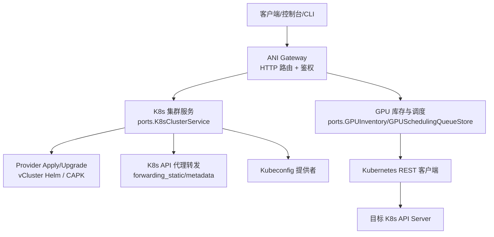
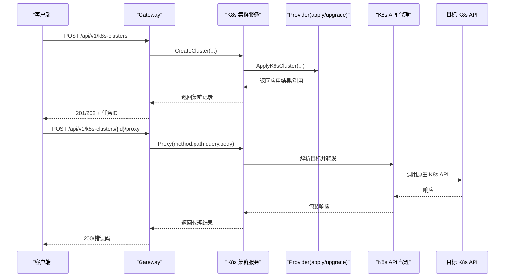
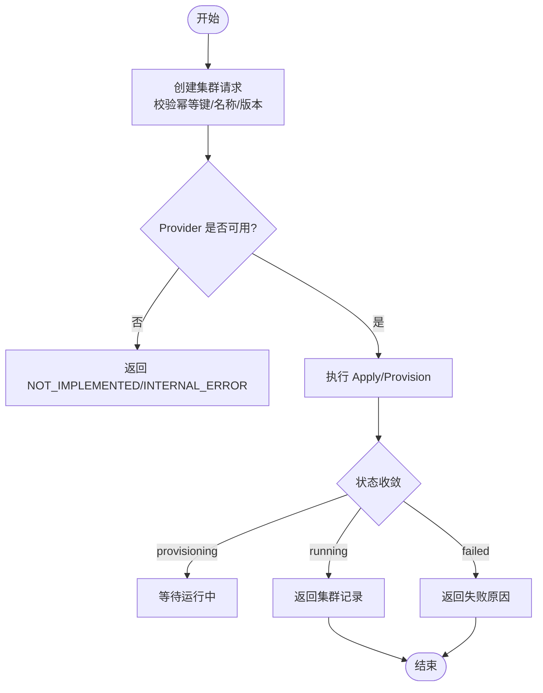
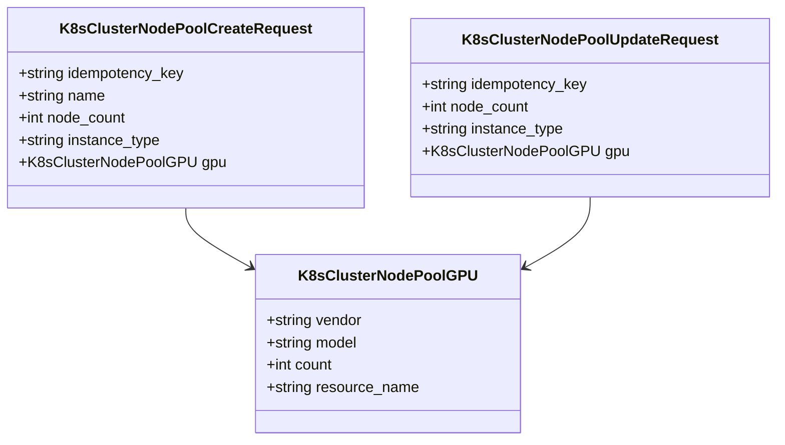
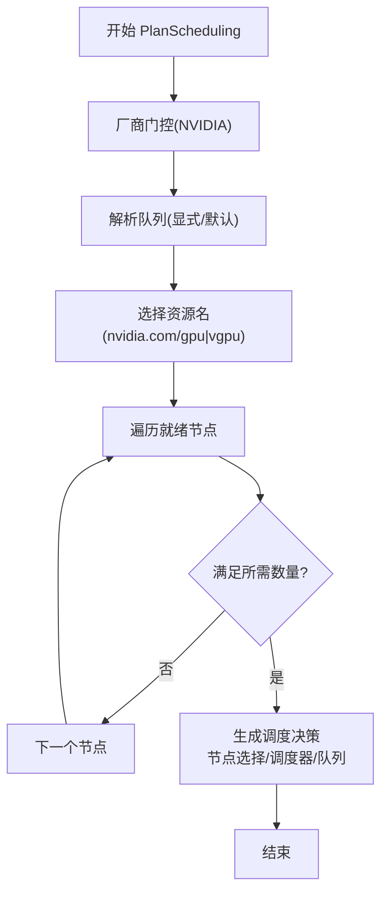
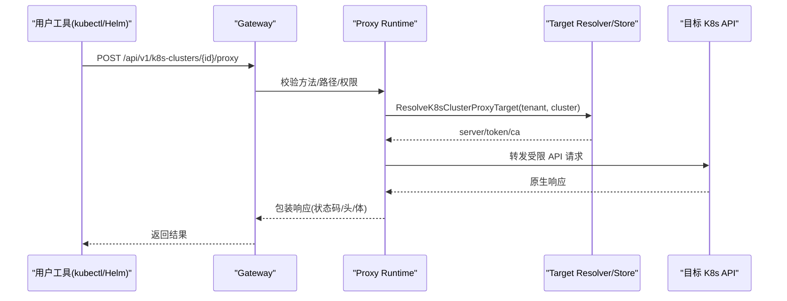
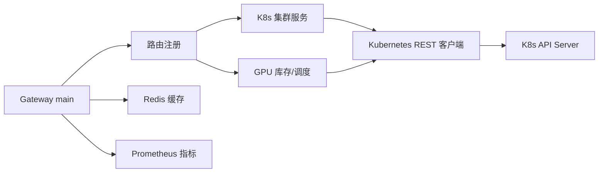

# Kubernetes 集群 API

<cite>
**本文引用的文件**
- [v1.yaml](file://repo/api/openapi/v1.yaml)
- [services/v1.yaml](file://repo/api/openapi/services/v1.yaml)
- [k8s_clusters.go](file://repo/pkg/ports/k8s_clusters.go)
- [gpu_scheduling.go](file://repo/pkg/ports/gpu_scheduling.go)
- [kubernetes_rest_client.go](file://repo/pkg/adapters/runtime/kubernetes_rest_client.go)
- [kubernetes_gpu_inventory.go](file://repo/pkg/adapters/runtime/kubernetes_gpu_inventory.go)
- [main.go](file://repo/services/ani-gateway/main.go)
- [k8s_proxy_runtime.go](file://repo/services/ani-gateway/k8s_proxy_runtime.go)
- [gpu_inventory_runtime.go](file://repo/services/ani-gateway/gpu_inventory_runtime.go)
- [ANI-06-开发计划.md](file://ANI-06-开发计划.md)
</cite>

## 目录
1. [简介](#简介)
2. [项目结构](#项目结构)
3. [核心组件](#核心组件)
4. [架构总览](#架构总览)
5. [详细组件分析](#详细组件分析)
6. [依赖关系分析](#依赖关系分析)
7. [性能与可靠性](#性能与可靠性)
8. [故障排查指南](#故障排查指南)
9. [结论](#结论)
10. [附录：API 参考与使用示例](#附录api-参考与使用示例)

## 简介
本文件面向“Kubernetes 集群管理 API”，围绕集群注册、升级、扩缩容等生命周期管理接口，以及节点池管理、GPU 资源调度、集群监控、Kubeconfig 生成、API 代理、资源配额管理等运维能力进行系统化说明。同时给出多集群管理、混合云部署、灾难恢复等企业级场景的使用指引与最佳实践。

该 API 以 OpenAPI 契约为唯一真实来源，Gateway 作为统一入口，将请求路由到对应的运行时适配器（本地 dev profile、vCluster Helm provider、Cluster API/CAPK provider、原生 K8s 代理转发等），并通过端口抽象解耦实现细节，便于演进与替换。

## 项目结构
- API 契约
  - Core 基础设施 API：位于 repo/api/openapi/v1.yaml，定义集群、节点池、Kubeconfig、代理、加密、密钥、工作负载等核心资源。
  - Services 业务 API：位于 repo/api/openapi/services/v1.yaml，定义模型、推理服务、知识库等业务资源。
- 运行时与适配层
  - ports 抽象：定义 K8s 集群、节点池、GPU 调度等端口接口与数据结构。
  - adapters：提供具体实现，如 Kubernetes REST 客户端、GPU 库存与调度决策。
- Gateway 服务
  - 启动与装配：services/ani-gateway/main.go 负责组装各运行时并注册路由。
  - 运行时实现：k8s_proxy_runtime.go、gpu_inventory_runtime.go 等提供具体能力。

图表来源
- [main.go:187-208](file://repo/services/ani-gateway/main.go#L187-L208)
- [k8s_proxy_runtime.go](file://repo/services/ani-gateway/k8s_proxy_runtime.go)
- [kubernetes_rest_client.go:134-160](file://repo/pkg/adapters/runtime/kubernetes_rest_client.go#L134-L160)

章节来源
- [v1.yaml:1-80](file://repo/api/openapi/v1.yaml#L1-L80)
- [services/v1.yaml:1-20](file://repo/api/openapi/services/v1.yaml#L1-L20)
- [main.go:20-220](file://repo/services/ani-gateway/main.go#L20-L220)

## 核心组件
- K8s 集群服务（ports.K8sClusterService）
  - 职责：集群创建、查询、删除、升级；节点池 CRUD；Kubeconfig 生成；K8s API 代理；工作负载列表。
  - 关键类型：K8sClusterRecord、K8sClusterNodePoolRecord、K8sClusterKubeconfigRecord、K8sClusterProxyRecord。
- GPU 调度与库存
  - 职责：GPU 规格可用性评估、队列管理、调度决策（选择节点、资源名、调度器、队列）。
  - 关键类型：GPUSpecAvailability、GPUSchedulingDecision、GPUSchedulingQueue。
- 运行时装配
  - Gateway main 将 K8s 集群服务、GPU 库存、存储、网络、向量库、可观测性等运行时注入路由。
  - 支持通过环境变量切换代理模式（forwarding_static / forwarding_metadata）与节点池 provider 模式。

章节来源
- [k8s_clusters.go:8-296](file://repo/pkg/ports/k8s_clusters.go#L8-L296)
- [gpu_scheduling.go:1-83](file://repo/pkg/ports/gpu_scheduling.go#L1-L83)
- [main.go:187-208](file://repo/services/ani-gateway/main.go#L187-L208)

## 架构总览
系统采用“契约驱动 + 端口抽象 + 运行时适配器”的分层架构：
- 契约层：OpenAPI 定义对外暴露的 REST 接口与数据模型。
- 服务层：Gateway 路由与中间件（鉴权、审计、限流等）。
- 端口层：ports 定义稳定的内部接口，屏蔽底层实现差异。
- 适配层：adapters 提供具体实现（vCluster Helm、CAPK、原生 K8s 代理、GPU 调度等）。
- 外部依赖：Kubernetes API Server、Volcano 队列、对象存储、Redis 缓存、Prometheus 等。

图表来源
- [k8s_proxy_runtime.go](file://repo/services/ani-gateway/k8s_proxy_runtime.go)
- [kubernetes_rest_client.go:315-339](file://repo/pkg/adapters/runtime/kubernetes_rest_client.go#L315-L339)
- [k8s_clusters.go:280-296](file://repo/pkg/ports/k8s_clusters.go#L280-L296)

## 详细组件分析

### 集群生命周期管理（注册、升级、删除）
- 注册集群
  - 接口：POST /api/v1/k8s-clusters
  - 请求体：包含幂等键、名称、版本等字段。
  - 行为：创建租户隔离的 K8s 集群（默认 local dev profile；生产可通过 vCluster Helm provider 接入）。
- 查询集群
  - 接口：GET /api/v1/k8s-clusters/{id}、GET /api/v1/k8s-clusters
  - 行为：返回集群状态、版本、原因等信息，支持分页。
- 升级集群
  - 接口：POST /api/v1/k8s-clusters/{id}/upgrade
  - 行为：触发版本升级（例如 vCluster Helm 控制面版本变更），支持幂等键防重放。
- 删除集群
  - 接口：DELETE /api/v1/k8s-clusters/{id}
  - 行为：标记为 deleting，后续由控制器或 provider 清理资源。

图表来源
- [v1.yaml:67-98](file://repo/api/openapi/v1.yaml#L67-L98)
- [k8s_clusters.go:16-33](file://repo/pkg/ports/k8s_clusters.go#L16-L33)

章节来源
- [v1.yaml:67-98](file://repo/api/openapi/v1.yaml#L67-L98)
- [ANI-06-开发计划.md:1776-1786](file://ANI-06-开发计划.md#L1776-L1786)

### 节点池管理（扩缩容、GPU 意图）
- 节点池 CRUD
  - 接口：/api/v1/k8s-clusters/{id}/node-pools
  - 能力：创建、更新、查询、删除节点池；支持 node_count、instance_type、GPU intent（vendor/model/count/resource_name）。
- 扩缩容
  - 行为：通过 Cluster API MachineDeployment 或 CAPK 目标进行扩缩容；支持 GPU 节点池与调度策略。
- 证据与门禁
  - 通过 live gate 验证 create/update、MachineDeployment 观测与 GPU workload 调度。

图表来源
- [v1.yaml:99-147](file://repo/api/openapi/v1.yaml#L99-L147)
- [k8s_clusters.go:35-53](file://repo/pkg/ports/k8s_clusters.go#L35-L53)

章节来源
- [v1.yaml:99-147](file://repo/api/openapi/v1.yaml#L99-L147)
- [ANI-06-开发计划.md:1798-1803](file://ANI-06-开发计划.md#L1798-L1803)

### GPU 资源调度与库存
- 规格可用性
  - 维度：available/full/device_full/unavailable；结合租户配额与节点标签匹配。
- 调度决策
  - 输出：NodeSelector、ResourceName、ResourceQuantity、RuntimeClassName、SchedulerName、QueueName、SelectedNodeModel、Reasons。
- 队列管理
  - 租户级 Volcano Queue 抽象，支持权重、可回收、工作负载分类（inference/training/batch）。

图表来源
- [kubernetes_gpu_inventory.go:127-160](file://repo/pkg/adapters/runtime/kubernetes_gpu_inventory.go#L127-L160)
- [gpu_scheduling.go:18-74](file://repo/pkg/ports/gpu_scheduling.go#L18-L74)

章节来源
- [gpu_scheduling.go:1-83](file://repo/pkg/ports/gpu_scheduling.go#L1-L83)
- [kubernetes_gpu_inventory.go:127-160](file://repo/pkg/adapters/runtime/kubernetes_gpu_inventory.go#L127-L160)

### Kubeconfig 生成与访问
- 接口：GET /api/v1/k8s-clusters/{id}/kubeconfig
- 行为：根据 provider 生成 kubeconfig（local dev profile 模拟；vcluster_helm 可通过 connect 命令打印）。
- 安全：返回 token、CA 数据、过期时间，受租户隔离与鉴权保护。

章节来源
- [v1.yaml:148-160](file://repo/api/openapi/v1.yaml#L148-L160)
- [ANI-06-开发计划.md:1778-1786](file://ANI-06-开发计划.md#L1778-L1786)

### K8s API 代理
- 接口：POST /api/v1/k8s-clusters/{id}/proxy
- 能力：将受限路径（/api/, /apis/, /healthz, /livez, /readyz, /version）转发至目标 K8s API Server。
- 模式：
  - forwarding_static：静态上游 target。
  - forwarding_metadata：基于 per-cluster metadata resolver/store 动态解析目标。
- 安全：JWT 鉴权后按租户/集群上下文转发，记录审计日志。

图表来源
- [k8s_proxy_runtime.go](file://repo/services/ani-gateway/k8s_proxy_runtime.go)
- [kubernetes_rest_client.go:315-339](file://repo/pkg/adapters/runtime/kubernetes_rest_client.go#L315-L339)
- [k8s_clusters.go:183-201](file://repo/pkg/ports/k8s_clusters.go#L183-L201)

章节来源
- [v1.yaml:161-197](file://repo/api/openapi/v1.yaml#L161-L197)
- [ANI-06-开发计划.md:1788-1796](file://ANI-06-开发计划.md#L1788-L1796)

### 资源配额管理与可观测性
- 配额管理
  - Gateway 启动时装配 QuotaAdminService，用于配额维度的注册与检查（如 QUOTA_RESOURCE_NOT_REGISTERED、PLAN_NOT_ACTIVE）。
- 可观测性
  - 指标导出：reconcile worker 暴露 Prometheus metrics。
  - 审计日志：Gateway 中间件记录审计事件。
  - 健康检查：/healthz、/readyz、/livez 等探针。

章节来源
- [services/v1.yaml:48-84](file://repo/api/openapi/services/v1.yaml#L48-L84)
- [main.go:167-208](file://repo/services/ani-gateway/main.go#L167-L208)

## 依赖关系分析
- Gateway 依赖
  - K8s 集群服务、GPU 库存、存储、网络、向量库、可观测性、异步任务、配额管理等运行时。
- 运行时依赖
  - Kubernetes REST 客户端：负责 CA 加载、超时与重试策略、资源路径构造。
  - GPU 调度：依赖节点标签、Volcano 队列、调度器（volcano/hami）。
- 外部系统
  - Redis：Gateway 共享存储与会话/缓存。
  - Prometheus：指标采集。
  - 对象存储：密封内容、工件挂载等。

图表来源
- [main.go:187-208](file://repo/services/ani-gateway/main.go#L187-L208)
- [kubernetes_rest_client.go:134-160](file://repo/pkg/adapters/runtime/kubernetes_rest_client.go#L134-L160)

章节来源
- [main.go:20-220](file://repo/services/ani-gateway/main.go#L20-L220)
- [kubernetes_rest_client.go:134-160](file://repo/pkg/adapters/runtime/kubernetes_rest_client.go#L134-L160)

## 性能与可靠性
- 超时与重试
  - Kubernetes REST 客户端配置超时策略与幂等重试，避免长耗时请求阻塞。
- 连接与证书
  - 支持 inCluster 与外部 CA 文件加载，确保 TLS 安全与兼容性。
- 并发与扩展
  - Gateway 支持多实例部署，配合 Redis 共享存储与 leader election（reconcile worker）提升可用性。
- 降级与熔断
  - 通过中间件与适配器实现超时、退避与熔断，保障核心链路稳定。

章节来源
- [kubernetes_rest_client.go:81-99](file://repo/pkg/adapters/runtime/kubernetes_rest_client.go#L81-L99)
- [kubernetes_rest_client.go:134-160](file://repo/pkg/adapters/runtime/kubernetes_rest_client.go#L134-L160)

## 故障排查指南
- 认证与授权
  - 确认 Bearer JWT 或 X-API-Key 有效；服务身份令牌需包含 tenant_id 与 scope。
- 代理转发失败
  - 检查路径是否在允许范围；确认目标 API Server 可达与证书正确；查看审计日志。
- GPU 调度不可用
  - 检查节点标签与资源名（nvidia.com/gpu 或 nvidia.com/vgpu）；确认队列存在且属于租户；查看调度决策 Reasons。
- 节点池扩缩容失败
  - 核对 CAPI/CAPK 配置与 schema；检查 MachineDeployment/MachineSet 状态；查看 live gate 证据。
- 配额与套餐
  - 若返回 QUOTA_RESOURCE_NOT_REGISTERED 或 PLAN_NOT_ACTIVE，检查配额注册与套餐激活状态。

章节来源
- [v1.yaml:24-38](file://repo/api/openapi/v1.yaml#L24-L38)
- [gpu_scheduling.go:76-83](file://repo/pkg/ports/gpu_scheduling.go#L76-L83)
- [ANI-06-开发计划.md:1798-1803](file://ANI-06-开发计划.md#L1798-L1803)

## 结论
本 API 通过清晰的契约与端口抽象，实现了 K8s 集群的全生命周期管理、节点池与 GPU 调度、Kubeconfig 生成与 API 代理、配额与可观测性等企业级能力。借助 live gate 与证据归档机制，平台在真实环境中持续验证关键路径，确保交付质量与稳定性。未来可扩展多集群联邦、混合云与灾难恢复等高级场景。

## 附录：API 参考与使用示例

### 集群管理
- 创建集群
  - 方法：POST /api/v1/k8s-clusters
  - 请求体关键字段：idempotency_key、name、version
- 查询集群
  - 方法：GET /api/v1/k8s-clusters/{id}、GET /api/v1/k8s-clusters
- 升级集群
  - 方法：POST /api/v1/k8s-clusters/{id}/upgrade
  - 请求体关键字段：idempotency_key、version
- 删除集群
  - 方法：DELETE /api/v1/k8s-clusters/{id}

章节来源
- [v1.yaml:67-98](file://repo/api/openapi/v1.yaml#L67-L98)
- [ANI-06-开发计划.md:1778-1786](file://ANI-06-开发计划.md#L1778-L1786)

### 节点池管理
- 创建节点池
  - 方法：POST /api/v1/k8s-clusters/{id}/node-pools
  - 请求体关键字段：idempotency_key、name、node_count、instance_type、gpu
- 更新节点池
  - 方法：PUT /api/v1/k8s-clusters/{id}/node-pools/{pool_id}
  - 请求体关键字段：idempotency_key、node_count、instance_type、gpu
- 查询节点池
  - 方法：GET /api/v1/k8s-clusters/{id}/node-pools/{pool_id}、GET /api/v1/k8s-clusters/{id}/node-pools

章节来源
- [v1.yaml:99-147](file://repo/api/openapi/v1.yaml#L99-L147)
- [ANI-06-开发计划.md:1798-1803](file://ANI-06-开发计划.md#L1798-L1803)

### Kubeconfig 与代理
- 生成 Kubeconfig
  - 方法：GET /api/v1/k8s-clusters/{id}/kubeconfig
- 代理 K8s API
  - 方法：POST /api/v1/k8s-clusters/{id}/proxy
  - 请求体关键字段：idempotency_key、method、path、query、body

章节来源
- [v1.yaml:148-197](file://repo/api/openapi/v1.yaml#L148-L197)
- [ANI-06-开发计划.md:1788-1796](file://ANI-06-开发计划.md#L1788-L1796)

### 多集群管理、混合云与灾难恢复（企业级场景）
- 多集群管理
  - 通过 K8s API 代理与 per-cluster target resolver/store，统一管理多个 vCluster/K8s 集群；支持按租户隔离与审计。
- 混合云部署
  - 使用不同 provider（vCluster Helm、CAPK）对接公有云/私有云 K8s；通过节点池与 GPU 调度策略适配异构资源。
- 灾难恢复
  - 利用 Kubeconfig 与 API 代理快速重建访问；结合对象存储与备份策略恢复数据面；通过 live gate 验证恢复流程。

章节来源
- [k8s_clusters.go:183-201](file://repo/pkg/ports/k8s_clusters.go#L183-L201)
- [ANI-06-开发计划.md:1788-1796](file://ANI-06-开发计划.md#L1788-L1796)