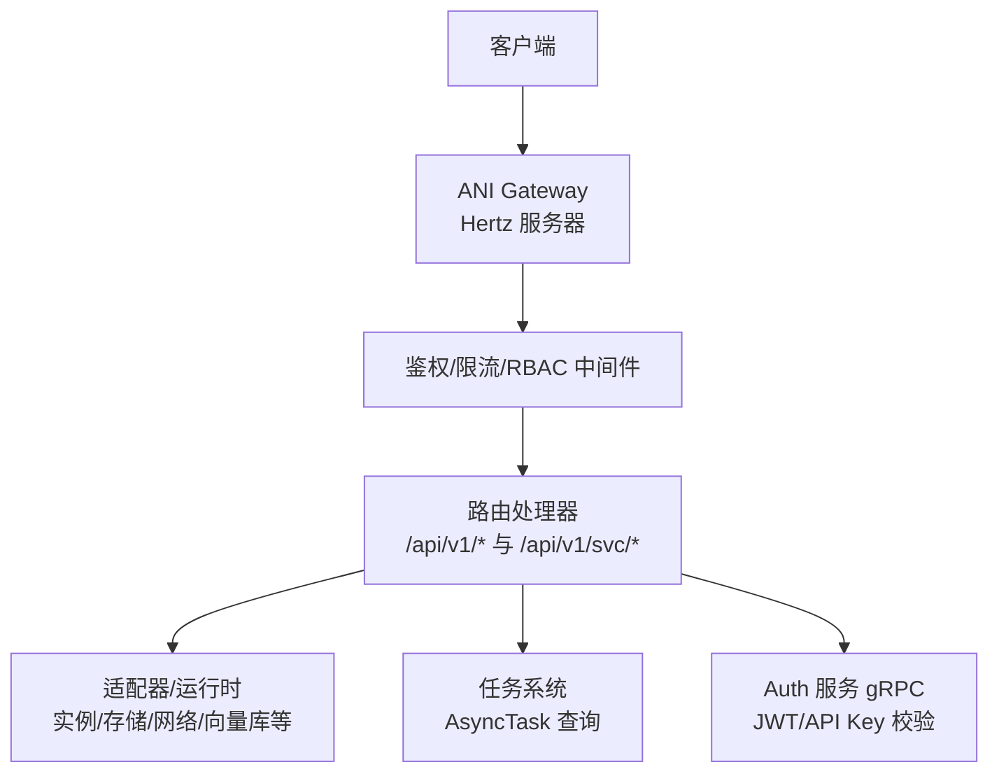
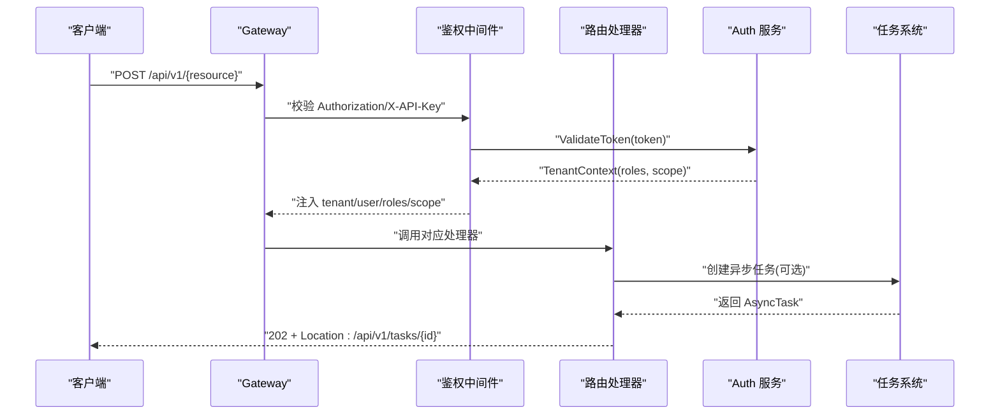
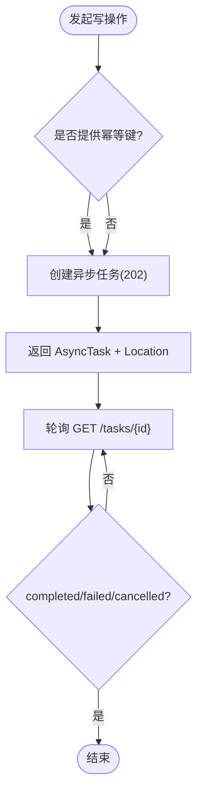
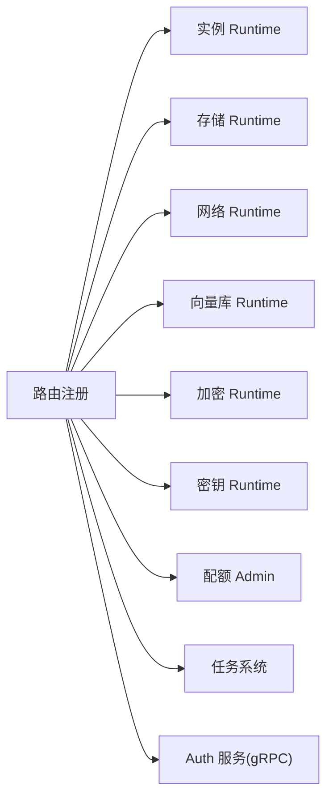

# REST API

<cite>
**本文引用的文件**
- [v1.yaml](file://repo/api/openapi/v1.yaml)
- [services/v1.yaml](file://repo/api/openapi/services/v1.yaml)
- [dev.yaml](file://repo/api/openapi/dev.yaml)
- [core-v1-compatibility-baseline.yaml](file://repo/api/core-v1-compatibility-baseline.yaml)
- [auth_service.proto](file://repo/api/proto/auth/v1/auth_service.proto)
- [common.proto](file://repo/api/proto/common/v1/common.proto)
- [gateway main.go](file://repo/services/ani-gateway/main.go)
- [router.go](file://repo/services/ani-gateway/internal/router/router.go)
- [auth 中间件](file://repo/services/ani-gateway/internal/middleware/auth.go)
</cite>

## 目录
1. [简介](#简介)
2. [项目结构](#项目结构)
3. [核心组件](#核心组件)
4. [架构总览](#架构总览)
5. [详细组件分析](#详细组件分析)
6. [依赖关系分析](#依赖关系分析)
7. [性能考虑](#性能考虑)
8. [故障排查指南](#故障排查指南)
9. [结论](#结论)
10. [附录](#附录)

## 简介
本文件为 KuberCloud ANI 平台的 REST API 完整技术文档，覆盖以下范围：
- 统一基础路径与版本策略：/api/v1（Core）与 /api/v1/svc（Services），以及 OpenAI 兼容前缀 /v1。
- 认证方式：Bearer JWT 与 X-API-Key；平台/租户作用域隔离；沙箱令牌支持。
- 错误处理：统一 ErrorResponse 格式与标准错误码。
- 分页机制：cursor 分页，统一 CursorPage。
- 异步操作：202 + AsyncTask，任务查询与 Webhook 能力。
- 端点清单：按资源域组织，列出方法、路径、请求体/响应体 schema、状态码与权限要求。
- 版本管理与向后兼容：基于 OpenAPI 契约的兼容性基线与规则。

## 项目结构
ANI 的 API 契约以 OpenAPI 为核心真实来源，服务实现通过 Gateway 路由注册到 Hertz 服务器，鉴权与 RBAC 由中间件完成，业务逻辑由各 Runtime 适配层承载。

图表来源
- [gateway main.go:20-220](file://repo/services/ani-gateway/main.go#L20-L220)
- [router.go:42-102](file://repo/services/ani-gateway/internal/router/router.go#L42-L102)
- [auth 中间件:22-141](file://repo/services/ani-gateway/internal/middleware/auth.go#L22-L141)

章节来源
- [gateway main.go:20-220](file://repo/services/ani-gateway/main.go#L20-L220)
- [router.go:42-102](file://repo/services/ani-gateway/internal/router/router.go#L42-L102)

## 核心组件
- 网关入口：Hertz 服务器启动并注册所有路由组。
- 路由注册：/api/v1（Core）、/api/v1/svc（Services）、/v1（OpenAI 兼容）。
- 鉴权中间件：支持 Bearer JWT、X-API-Key、沙箱令牌、开发模式透传。
- 适配器/运行时：将 HTTP 请求映射到具体领域服务（实例、存储、网络、向量库、加密、密钥、配额等）。
- 任务系统：异步操作返回 AsyncTask，支持轮询与结果查询。
- 协议定义：OpenAPI v1.yaml（Core）、services/v1.yaml（Services）、proto（内部 gRPC 契约）。

章节来源
- [v1.yaml:1-46](file://repo/api/openapi/v1.yaml#L1-L46)
- [services/v1.yaml:1-21](file://repo/api/openapi/services/v1.yaml#L1-L21)
- [auth_service.proto:11-30](file://repo/api/proto/auth/v1/auth_service.proto#L11-L30)
- [common.proto:9-36](file://repo/api/proto/common/v1/common.proto#L9-L36)

## 架构总览
Gateway 作为统一入口，负责：
- 路由分发到 Core/Services 处理器。
- 鉴权（JWT/API Key/沙箱令牌）与作用域控制（tenant/platform/sandbox）。
- 幂等键与限流。
- 审计日志与请求 ID。
- 将写操作转换为异步任务（AsyncTask），读操作直接返回数据或游标分页。

图表来源
- [auth 中间件:22-141](file://repo/services/ani-gateway/internal/middleware/auth.go#L22-L141)
- [router.go:42-102](file://repo/services/ani-gateway/internal/router/router.go#L42-L102)
- [common.proto:30-36](file://repo/api/proto/common/v1/common.proto#L30-L36)

## 详细组件分析

### 认证与安全
- 支持的认证方式
  - Bearer JWT：通过 Authorization: Bearer <token> 传递，有效期与签发由 Auth 服务管理。
  - X-API-Key：长期 API Key，用于程序化访问，默认租户作用域。
  - 沙箱令牌：短生命周期 HMAC 签名令牌，仅允许访问沙箱子资源。
- 作用域隔离
  - tenant：普通租户用户与 API Key 默认作用域。
  - platform：平台/管理接口（/auth/platform/*、/platform/*、/admin/*）仅接受 platform 作用域。
  - sandbox：仅允许访问 /api/v1/instances/{id}/sandbox/*。
- 开发模式
  - 设置环境变量可跳过鉴权，通过 X-Dev-Tenant-ID 注入上下文。

章节来源
- [v1.yaml:24-63](file://repo/api/openapi/v1.yaml#L24-L63)
- [services/v1.yaml:17-21](file://repo/api/openapi/services/v1.yaml#L17-L21)
- [auth 中间件:22-141](file://repo/services/ani-gateway/internal/middleware/auth.go#L22-L141)
- [auth 中间件:199-229](file://repo/services/ani-gateway/internal/middleware/auth.go#L199-L229)

### 通用错误格式与状态码
- 统一错误体
  - code：字符串错误码（如 UNAUTHORIZED、FORBIDDEN、NOT_FOUND、CONFLICT、BAD_REQUEST、RATE_LIMIT_EXCEEDED、NOT_IMPLEMENTED、INTERNAL_ERROR）。
  - message：人类可读信息。
  - request_id：请求追踪 ID。
  - details：可选扩展字段。
- 常见状态码
  - 200/201：成功。
  - 202：已接受（异步任务）。
  - 400/401/403/404/409/422/429/5xx：参数/认证/权限/不存在/冲突/未处理/限流/服务端错误。

章节来源
- [v1.yaml:28-39](file://repo/api/openapi/v1.yaml#L28-L39)
- [v1.yaml:333-350](file://repo/api/openapi/v1.yaml#L333-L350)
- [services/v1.yaml:22-95](file://repo/api/openapi/services/v1.yaml#L22-L95)

### 分页机制
- 游标分页
  - 请求参数：limit（最大限制）、cursor（上一页 next_cursor）。
  - 响应体：items、total、next_cursor（null 表示末页）。
- 适用范围：所有列表接口统一使用此格式。

章节来源
- [v1.yaml:33-35](file://repo/api/openapi/v1.yaml#L33-L35)
- [v1.yaml:343-350](file://repo/api/openapi/v1.yaml#L343-L350)
- [common.proto:18-28](file://repo/api/proto/common/v1/common.proto#L18-L28)

### 异步操作
- 触发方式：部分写操作返回 202，响应体为 AsyncTask，Location 头包含任务 URL。
- 任务查询：GET /api/v1/tasks/{task_id} 获取进度与结果。
- 任务类型：涵盖模型导入、知识库解析/索引、推理部署、工作负载生命周期、卷快照/扩容/挂载、文件系统扩容/挂载、向量库重建/插入、沙箱检查点/代码运行等。
- 重试与幂等：通过 idempotency_key 保证重复提交不产生副作用。

图表来源
- [v1.yaml:351-373](file://repo/api/openapi/v1.yaml#L351-L373)
- [common.proto:30-36](file://repo/api/proto/common/v1/common.proto#L30-L36)

章节来源
- [v1.yaml:351-373](file://repo/api/openapi/v1.yaml#L351-L373)
- [common.proto:30-36](file://repo/api/proto/common/v1/common.proto#L30-L36)

### Core API 端点（/api/v1）
说明：以下为按资源域组织的端点摘要，完整 schema 请参考 OpenAPI 文件。

- 认证与令牌
  - POST /api/v1/auth/password/login
  - POST /api/v1/auth/platform/password/login
  - POST /api/v1/auth/oidc/begin
  - POST /api/v1/auth/token
  - POST /api/v1/auth/refresh
  - POST /api/v1/auth/logout
  - GET/POST/DELETE /api/v1/auth/api-keys
  权限：公开或租户/平台作用域；返回 TokenPair 或操作结果。

- 品牌与健康
  - GET /api/v1/branding
  - GET /health, /ready, /healthz, /readyz

- 实例与观测
  - 实例 CRUD 与生命周期（create/start/stop/restart/delete）
  - 实例观测（Prometheus 代理、指标查询）
  - GPU 库存与调度队列

- 存储与对象
  - 桶 CRUD、ACL、生命周期规则、对象上传/下载（预签名 URL）

- 加密与密钥
  - 密钥创建/旋转/吊销/封缄/解封令牌

- 网络与向量库
  - 网络资源管理
  - 向量库集合/文档/索引重建

- 元数据与配额
  - 配额元数据、租户配额管理

- 任务
  - GET /api/v1/tasks/{task_id}

注意：以上端点的请求体/响应体 schema、必填字段、枚举值与状态码详见 v1.yaml 与 core-v1-compatibility-baseline.yaml。

章节来源
- [core-v1-compatibility-baseline.yaml:19-800](file://repo/api/core-v1-compatibility-baseline.yaml#L19-L800)
- [v1.yaml:67-800](file://repo/api/openapi/v1.yaml#L67-L800)

### Services API 端点（/api/v1/svc）
- 模型与推理服务
  - 模型版本、镜像选择、推理服务创建/更新/生命周期
  - 推理测试、日志、策略（速率限制、并发、租户白名单、鉴权模式）
- 知识库
  - 知识库配置、文档上传（预签名）、解析通知、检索问答、会话与引用
- GPU 容器与沙箱
  - GPU 容器生命周期、指标、版本
  - 沙箱生命周期、安全事件、扩展过期时间
- 租户与会成员
  - 邀请成员、角色与权限、SSO 配置
- Webhook 与集成
  - Webhook 创建/投递记录、第三方集成（钉钉/企微/飞书/Slack/邮件/通用 Webhook）

章节来源
- [services/v1.yaml:129-800](file://repo/api/openapi/services/v1.yaml#L129-L800)

### OpenAI 兼容端点（/v1）
- POST /v1/chat/completions
- GET /v1/inference/stream
用途：对外暴露 OpenAI 兼容的聊天补全与流式推理入口，由 Gateway 转发至推理服务。

章节来源
- [router.go:99-102](file://repo/services/ani-gateway/internal/router/router.go#L99-L102)

### 示例与最佳实践
- 请求头
  - Authorization: Bearer <jwt> 或 X-API-Key: <key>
  - Idempotency-Key: <uuid>（写操作建议携带）
- 分页
  - GET /api/v1/{list}?limit=20&cursor=<token>
- 异步
  - 收到 202 后读取 Location 头，轮询任务状态直至 completed/failed/cancelled

[本节为通用指导，不直接分析具体文件]

## 依赖关系分析
- 路由与服务绑定
  - Gateway 在启动时根据环境变量装配各 Runtime（实例、存储、网络、向量库、加密、密钥、配额等），并通过 RegisterWithOptions 注册路由。
  - KB 相关路由通过 gRPC 客户端连接 kb-service，若未配置则降级返回 503。
- 中间件链
  - 鉴权 -> RBAC -> 幂等 -> 限流 -> 审计 -> 请求 ID
- 外部依赖
  - Auth 服务（gRPC）：JWT/API Key 校验、权限检查、令牌撤销。
  - Redis：共享缓存/锁/限流。
  - 存储/网络/向量库/镜像仓库：通过适配器接入。

图表来源
- [gateway main.go:20-220](file://repo/services/ani-gateway/main.go#L20-L220)
- [router.go:42-102](file://repo/services/ani-gateway/internal/router/router.go#L42-L102)

章节来源
- [gateway main.go:20-220](file://repo/services/ani-gateway/main.go#L20-L220)
- [router.go:42-102](file://repo/services/ani-gateway/internal/router/router.go#L42-L102)

## 性能考虑
- 游标分页避免深翻页开销。
- 异步写操作降低请求延迟，提高吞吐。
- 鉴权与 RBAC 前置拦截减少无效请求进入业务层。
- 适配器层对后端依赖进行超时与熔断保护（由运行时实现保障）。
- 合理设置 limit 与 cursor，避免一次性拉取大量数据。

[本节为通用指导，不直接分析具体文件]

## 故障排查指南
- 认证失败
  - 401 UNAUTHORIZED：JWT 过期/无效、API Key 无效、缺少认证头。
  - 403 FORBIDDEN：作用域不允许（如 API Key 访问平台接口）、RBAC 拒绝。
- 参数错误
  - 400 BAD_REQUEST：请求体缺失必填字段、枚举值非法。
  - 422 UNPROCESSABLE_ENTITY：前置条件不满足（如配额未注册、套餐非 active）。
- 资源与冲突
  - 404 NOT_FOUND：资源不存在。
  - 409 CONFLICT：名称/幂等键/活动操作冲突。
- 限流与不可用
  - 429 RATE_LIMIT_EXCEEDED：达到速率限制。
  - 503 SERVICE_UNAVAILABLE：依赖暂时不可用（如 kb-service 未配置）。
- 调试建议
  - 查看 request_id 定位日志。
  - 开启开发模式（ANI_AUTH_MODE=dev）临时绕过鉴权验证流程。
  - 检查幂等键是否重复使用且语义一致。

章节来源
- [auth 中间件:22-141](file://repo/services/ani-gateway/internal/middleware/auth.go#L22-L141)
- [services/v1.yaml:22-95](file://repo/api/openapi/services/v1.yaml#L22-L95)
- [core-v1-compatibility-baseline.yaml:19-800](file://repo/api/core-v1-compatibility-baseline.yaml#L19-L800)

## 结论
本 API 体系以 OpenAPI 契约为中心，通过 Gateway 统一暴露 Core 与 Services 能力，采用 Bearer JWT 与 X-API-Key 双通道认证，结合作用域隔离与 RBAC 确保多租户安全。所有列表接口采用游标分页，写操作普遍支持异步任务与幂等键，便于构建高可用与可扩展的客户端。版本管理通过兼容性基线约束变更，保障向后兼容。

[本节为总结性内容，不直接分析具体文件]

## 附录

### 版本管理与向后兼容
- 版本策略
  - Core API 基础路径 /api/v1，新增版本以新 spec 文件形式维护（如 v2.yaml），路径稳定。
  - Services API 基础路径 /api/v1/svc。
- 兼容性规则
  - 允许：新增可选请求字段、新增响应字段、新增端点、新增枚举值。
  - 禁止：删除路径或 HTTP 方法、更改 operationId、删除现有参数或必填字段、删除响应字段、修改已有字段签名。
- 基线文件
  - core-v1-compatibility-baseline.yaml 记录了当前版本的兼容基线与路径级契约。

章节来源
- [v1.yaml:9-18](file://repo/api/openapi/v1.yaml#L9-L18)
- [core-v1-compatibility-baseline.yaml:1-18](file://repo/api/core-v1-compatibility-baseline.yaml#L1-L18)

### 端点速查表（节选）
- 认证
  - POST /api/v1/auth/password/login
  - POST /api/v1/auth/platform/password/login
  - POST /api/v1/auth/oidc/begin
  - POST /api/v1/auth/token
  - POST /api/v1/auth/refresh
  - POST /api/v1/auth/logout
  - GET/POST/DELETE /api/v1/auth/api-keys
- 实例
  - CRUD 与生命周期（create/start/stop/restart/delete）
- 存储
  - 桶 CRUD、ACL、生命周期规则、对象上传/下载
- 加密与密钥
  - 密钥创建/旋转/吊销/封缄/解封令牌
- 任务
  - GET /api/v1/tasks/{task_id}
- Services
  - 模型/推理服务/Knowledge Base/GPU 容器/沙箱/租户/Webhook/集成

章节来源
- [core-v1-compatibility-baseline.yaml:19-800](file://repo/api/core-v1-compatibility-baseline.yaml#L19-L800)
- [services/v1.yaml:129-800](file://repo/api/openapi/services/v1.yaml#L129-L800)

### 开发演示端点（/demo/*）
- 仅供开发阶段演示，不参与生产 spec 与 SDK 生成。
- 提供实例 CRUD、生命周期动作、操作历史查询等模拟接口。

章节来源
- [dev.yaml:1-218](file://repo/api/openapi/dev.yaml#L1-L218)