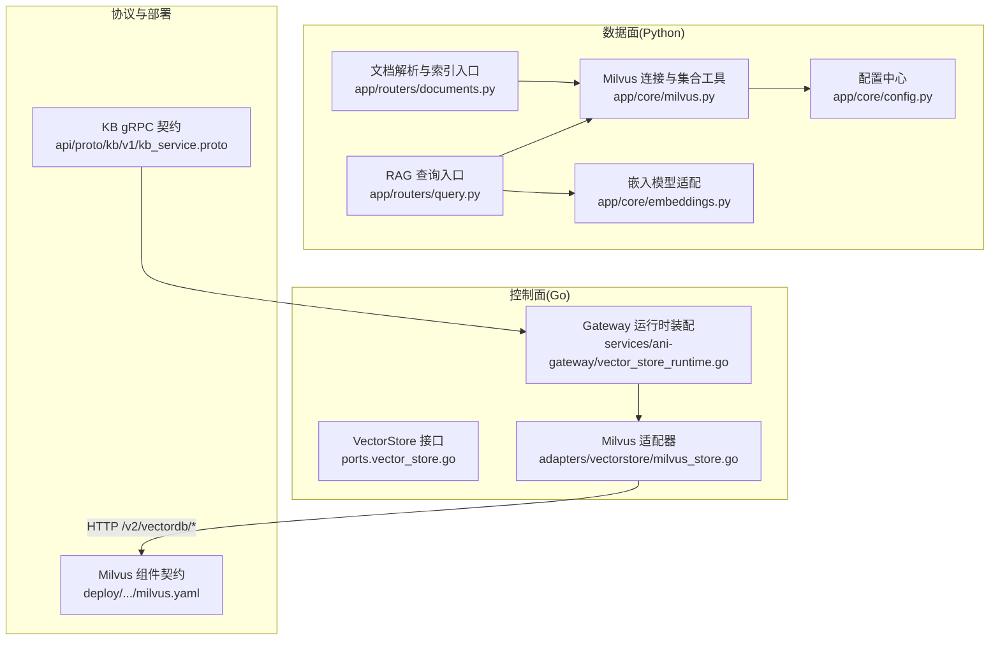
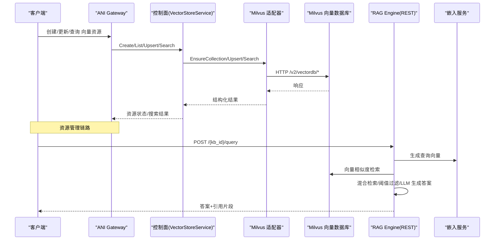
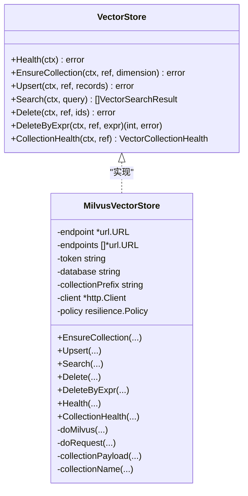
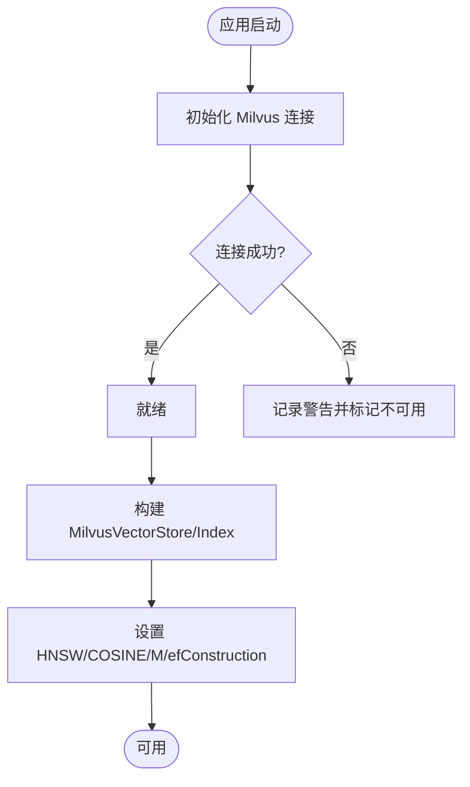
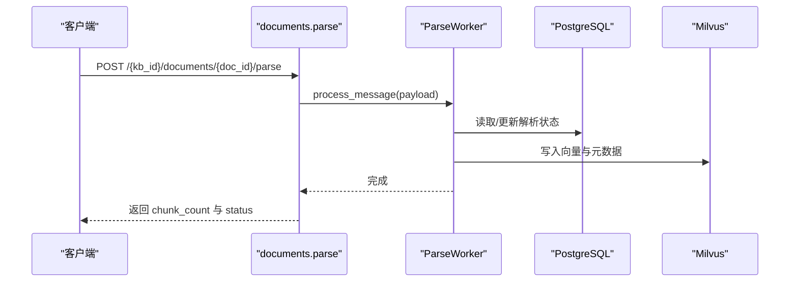
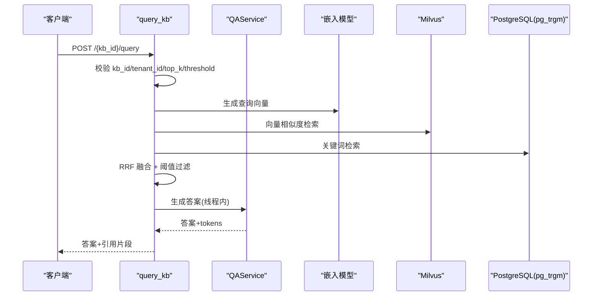
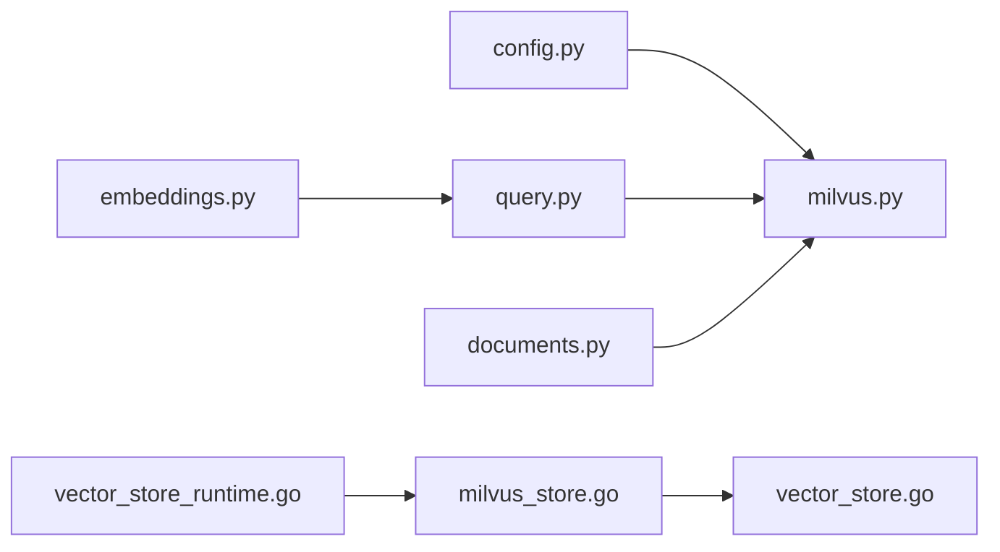

# 向量存储 API

<cite>
**本文引用的文件**
- [milvus.py](file://repo/ai/rag-engine/app/core/milvus.py)
- [documents.py](file://repo/ai/rag-engine/app/routers/documents.py)
- [query.py](file://repo/ai/rag-engine/app/routers/query.py)
- [config.py](file://repo/ai/rag-engine/app/core/config.py)
- [embeddings.py](file://repo/ai/rag-engine/app/core/embeddings.py)
- [vector_store.go](file://repo/pkg/ports/vector_store.go)
- [milvus_store.go](file://repo/pkg/adapters/vectorstore/milvus_store.go)
- [vector_store_runtime.go](file://repo/services/ani-gateway/vector_store_runtime.go)
- [kb_service.proto](file://repo/api/proto/kb/v1/kb_service.proto)
- [milvus.yaml](file://repo/deploy/helm/ani-platform/component-contracts/milvus.yaml)
</cite>

## 目录
1. [简介](#简介)
2. [项目结构](#项目结构)
3. [核心组件](#核心组件)
4. [架构总览](#架构总览)
5. [详细组件分析](#详细组件分析)
6. [依赖关系分析](#依赖关系分析)
7. [性能与调优](#性能与调优)
8. [故障排查指南](#故障排查指南)
9. [结论](#结论)
10. [附录：API 参考与使用示例](#附录api-参考与使用示例)

## 简介
本文件面向“向量存储 API”，系统性说明 ANI 平台中基于 Milvus 的向量数据库集成接口，覆盖集合管理、向量索引创建、相似度搜索、批量导入、实时更新、查询优化等能力；并结合知识库构建、语义检索、推荐系统等 AI 应用场景提供端到端的使用指引。同时给出企业级特性（分片、副本、健康检查、重试与超时）在代码中的体现与配置建议。

## 项目结构
本项目围绕向量存储分为三层：
- 控制面（Go）：定义统一的 VectorStore 接口与资源元数据管理，适配 Milvus HTTP 客户端，负责集合生命周期、Upsert/Search/Delete、健康检查等。
- 数据面（Python RAG Engine）：提供文档解析入库、RAG 查询 REST 接口，封装 LlamaIndex + Milvus 的写入与检索流程，并统一嵌入模型调用。
- 网关与服务编排（Go）：ANI Gateway 将外部请求路由到向量存储实现，组合控制面与数据面能力，对外暴露稳定契约（gRPC/REST）。

图表来源
- [vector_store.go:157-179](file://repo/pkg/ports/vector_store.go#L157-L179)
- [milvus_store.go:69-178](file://repo/pkg/adapters/vectorstore/milvus_store.go#L69-L178)
- [vector_store_runtime.go:42-70](file://repo/services/ani-gateway/vector_store_runtime.go#L42-L70)
- [milvus.py:36-187](file://repo/ai/rag-engine/app/core/milvus.py#L36-L187)
- [documents.py:28-115](file://repo/ai/rag-engine/app/routers/documents.py#L28-L115)
- [query.py:112-167](file://repo/ai/rag-engine/app/routers/query.py#L112-L167)
- [embeddings.py:50-203](file://repo/ai/rag-engine/app/core/embeddings.py#L50-L203)
- [config.py:5-102](file://repo/ai/rag-engine/app/core/config.py#L5-L102)
- [kb_service.proto:11-53](file://repo/api/proto/kb/v1/kb_service.proto#L11-L53)
- [milvus.yaml:1-24](file://repo/deploy/helm/ani-platform/component-contracts/milvus.yaml#L1-L24)

章节来源
- [vector_store.go:157-179](file://repo/pkg/ports/vector_store.go#L157-L179)
- [milvus_store.go:69-178](file://repo/pkg/adapters/vectorstore/milvus_store.go#L69-L178)
- [vector_store_runtime.go:42-70](file://repo/services/ani-gateway/vector_store_runtime.go#L42-L70)
- [milvus.py:36-187](file://repo/ai/rag-engine/app/core/milvus.py#L36-L187)
- [documents.py:28-115](file://repo/ai/rag-engine/app/routers/documents.py#L28-L115)
- [query.py:112-167](file://repo/ai/rag-engine/app/routers/query.py#L112-L167)
- [embeddings.py:50-203](file://repo/ai/rag-engine/app/core/embeddings.py#L50-L203)
- [config.py:5-102](file://repo/ai/rag-engine/app/core/config.py#L5-L102)
- [kb_service.proto:11-53](file://repo/api/proto/kb/v1/kb_service.proto#L11-L53)
- [milvus.yaml:1-24](file://repo/deploy/helm/ani-platform/component-contracts/milvus.yaml#L1-L24)

## 核心组件
- 控制面接口 VectorStore 与 VectorStoreService：定义集合确保、Upsert、Search、Delete、健康检查及资源管理（创建/列表/删除/重建索引/关联知识库/文档增删）。
- Milvus 适配器：通过 HTTP 调用 Milvus v2 向量数据库接口，支持多端点、重试、错误映射、过滤表达式构造、结果解析。
- RAG Engine（Python）：
  - Milvus 连接与集合工具：启动时建立连接、按 KB 生成集合名、构建 MilvusVectorStore 与 VectorStoreIndex。
  - 文档解析与索引：同步/异步解析文档，落库并写入 Milvus。
  - RAG 查询：混合检索（向量+关键词），阈值过滤，返回答案与引用片段。
  - 嵌入模型：统一远程 OpenAI 兼容嵌入服务，保证读写一致。
- 配置：Milvus 地址、嵌入模型、PG/Redis/NATS 等运行时参数。
- 部署契约：默认维度、度量类型、离线/集群模式校验。

章节来源
- [vector_store.go:18-179](file://repo/pkg/ports/vector_store.go#L18-L179)
- [milvus_store.go:26-178](file://repo/pkg/adapters/vectorstore/milvus_store.go#L26-L178)
- [milvus.py:36-187](file://repo/ai/rag-engine/app/core/milvus.py#L36-L187)
- [documents.py:28-115](file://repo/ai/rag-engine/app/routers/documents.py#L28-L115)
- [query.py:26-167](file://repo/ai/rag-engine/app/routers/query.py#L26-L167)
- [embeddings.py:50-203](file://repo/ai/rag-engine/app/core/embeddings.py#L50-L203)
- [config.py:5-102](file://repo/ai/rag-engine/app/core/config.py#L5-L102)
- [milvus.yaml:1-24](file://repo/deploy/helm/ani-platform/component-contracts/milvus.yaml#L1-L24)

## 架构总览
整体采用“控制面 + 数据面”解耦设计：
- 控制面（Go）通过 VectorStore 抽象屏蔽底层差异，当前实现为 Milvus HTTP 客户端，提供集合管理、向量增删改查与健康检查。
- 数据面（Python）专注 RAG 工作流：文档解析、向量化、写入 Milvus、混合检索与 LLM 回答。
- 网关（Go）根据环境变量选择后端（如 milvus），组装本地服务与资源存储，对外暴露稳定接口。

图表来源
- [vector_store_runtime.go:42-70](file://repo/services/ani-gateway/vector_store_runtime.go#L42-L70)
- [milvus_store.go:69-178](file://repo/pkg/adapters/vectorstore/milvus_store.go#L69-L178)
- [query.py:112-167](file://repo/ai/rag-engine/app/routers/query.py#L112-L167)
- [embeddings.py:147-203](file://repo/ai/rag-engine/app/core/embeddings.py#L147-L203)

## 详细组件分析

### 控制面：VectorStore 接口与 Milvus 适配器
- 接口职责
  - Health/EnsureCollection：健康检查与集合创建（维度、度量类型、主键字段、向量字段）。
  - Upsert/Search/Delete/DeleteByExpr：向量数据的批量写入、相似度检索、按 ID 或表达式删除。
  - CollectionHealth：集合级健康检查。
- Milvus 适配器实现要点
  - 多端点与重试：支持主备端点与可重试状态码，提升可用性。
  - 错误映射：将 HTTP 状态与 Milvus 业务码转换为标准错误类型。
  - 过滤表达式：安全转义与排序拼接，避免注入风险。
  - 结果解析：统一 score/distance 字段，提取 metadata/content。

图表来源
- [vector_store.go:157-179](file://repo/pkg/ports/vector_store.go#L157-L179)
- [milvus_store.go:26-178](file://repo/pkg/adapters/vectorstore/milvus_store.go#L26-L178)

章节来源
- [vector_store.go:157-179](file://repo/pkg/ports/vector_store.go#L157-L179)
- [milvus_store.go:69-178](file://repo/pkg/adapters/vectorstore/milvus_store.go#L69-L178)

### 数据面：Milvus 连接、集合与索引
- 连接初始化：启动时建立 Milvus 连接，失败则降级记录日志，后续调用可优雅处理。
- 集合命名：按 KB ID 生成稳定集合名（去除横杠），满足 Milvus 命名规范。
- 索引参数：HNSW + COSINE，M=16，efConstruction=200，符合规范。
- 向量存储构建：通过 LlamaIndex 的 MilvusVectorStore 与 VectorStoreIndex，自动完成嵌入与写入。

图表来源
- [milvus.py:36-187](file://repo/ai/rag-engine/app/core/milvus.py#L36-L187)

章节来源
- [milvus.py:36-187](file://repo/ai/rag-engine/app/core/milvus.py#L36-L187)

### 数据面：文档解析与索引（批量导入/实时更新）
- 同步解析端点：接收文档信息（KB、文档 ID、租户、存储路径、文件类型、幂等键），执行下载→解析→分块→嵌入→写入 Milvus 的全流程。
- 幂等性：同一 doc_id 重复调用不会重复解析。
- 删除索引：按 doc_id 表达式删除对应向量，幂等。

图表来源
- [documents.py:28-115](file://repo/ai/rag-engine/app/routers/documents.py#L28-L115)

章节来源
- [documents.py:28-115](file://repo/ai/rag-engine/app/routers/documents.py#L28-L115)

### 数据面：RAG 查询（相似度搜索/阈值过滤/LLM 回答）
- 查询入口：POST /{kb_id}/query，支持 top_k、score_threshold、retrieval_mode（vector/hybrid/keyword）、会话上下文、推理服务选择。
- 前置校验：验证 kb_id 与 tenant_id，检查知识库是否存在。
- 检索流程：向量检索（Milvus）+ 关键词检索（pg_trgm）→ RRF 融合 → 阈值过滤 → LLM 生成答案。
- 线程隔离：阻塞式 chat 调用放入线程池，避免阻塞事件循环。

图表来源
- [query.py:112-167](file://repo/ai/rag-engine/app/routers/query.py#L112-L167)
- [embeddings.py:147-203](file://repo/ai/rag-engine/app/core/embeddings.py#L147-L203)

章节来源
- [query.py:112-167](file://repo/ai/rag-engine/app/routers/query.py#L112-L167)
- [embeddings.py:147-203](file://repo/ai/rag-engine/app/core/embeddings.py#L147-L203)

### 控制面：向量资源管理与知识库关联
- 资源模型：包含租户、名称、维度、度量、嵌入模型、向量计数、索引状态、时间戳、幂等键等。
- 资源操作：创建、列表、获取、删除、重建索引、关联/解除知识库、预检查删除。
- 文档操作：批量插入、按表达式删除。
- 健康检查：集合存在性与描述。

章节来源
- [vector_store.go:18-179](file://repo/pkg/ports/vector_store.go#L18-L179)

### 网关：向量存储运行时装配
- 环境变量驱动：VECTOR_STORE_PROVIDER、ENDPOINT/TOKEN/DATABASE/PREFIX/TIMEOUT 等。
- 提供者选择：当前支持 milvus，其他值返回不支持错误。
- 服务装配：连接控制面存储（元数据）与 Milvus 后端，包装成本地服务供上层调用。

章节来源
- [vector_store_runtime.go:16-75](file://repo/services/ani-gateway/vector_store_runtime.go#L16-L75)

### 协议：KB gRPC 契约
- 知识库管理：创建、获取、列表、删除。
- 文档管理：获取上传 URL、通知上传完成、获取/列表/删除文档。
- 检索：同步 Query 与流式 Retrieve（SSE 透传）。
- 扩展：引用、会话、权限等 Phase A P1 声明。

章节来源
- [kb_service.proto:11-53](file://repo/api/proto/kb/v1/kb_service.proto#L11-L53)
- [kb_service.proto:57-294](file://repo/api/proto/kb/v1/kb_service.proto#L57-L294)

### 部署：Milvus 组件契约
- 默认维度与度量：1024 维、COSINE。
- 模式选项：external/managed，dev/attachK8s/offline 模式。
- 校验项：离线 YAML 解析、集群模式下的集合创建干跑与向量插入/搜索冒烟测试。

章节来源
- [milvus.yaml:1-24](file://repo/deploy/helm/ani-platform/component-contracts/milvus.yaml#L1-L24)

## 依赖关系分析
- 控制面与数据面解耦：Go 控制面通过 HTTP 访问 Milvus，Python 数据面通过 LlamaIndex + pymilvus 直接访问 Milvus，两者职责清晰。
- 嵌入模型统一：读写共用同一远程嵌入服务，避免不一致。
- 配置集中化：Python 侧通过 Settings 集中管理 Milvus、嵌入、PG、Redis、NATS、MinIO 等。
- 网关聚合：根据环境变量选择后端并装配服务，屏蔽底层差异。

图表来源
- [config.py:5-102](file://repo/ai/rag-engine/app/core/config.py#L5-L102)
- [milvus.py:36-187](file://repo/ai/rag-engine/app/core/milvus.py#L36-L187)
- [embeddings.py:50-203](file://repo/ai/rag-engine/app/core/embeddings.py#L50-L203)
- [query.py:112-167](file://repo/ai/rag-engine/app/routers/query.py#L112-L167)
- [documents.py:28-115](file://repo/ai/rag-engine/app/routers/documents.py#L28-L115)
- [vector_store_runtime.go:42-70](file://repo/services/ani-gateway/vector_store_runtime.go#L42-L70)
- [milvus_store.go:69-178](file://repo/pkg/adapters/vectorstore/milvus_store.go#L69-L178)
- [vector_store.go:157-179](file://repo/pkg/ports/vector_store.go#L157-L179)

章节来源
- [config.py:5-102](file://repo/ai/rag-engine/app/core/config.py#L5-L102)
- [milvus.py:36-187](file://repo/ai/rag-engine/app/core/milvus.py#L36-L187)
- [embeddings.py:50-203](file://repo/ai/rag-engine/app/core/embeddings.py#L50-L203)
- [query.py:112-167](file://repo/ai/rag-engine/app/routers/query.py#L112-L167)
- [documents.py:28-115](file://repo/ai/rag-engine/app/routers/documents.py#L28-L115)
- [vector_store_runtime.go:42-70](file://repo/services/ani-gateway/vector_store_runtime.go#L42-L70)
- [milvus_store.go:69-178](file://repo/pkg/adapters/vectorstore/milvus_store.go#L69-L178)
- [vector_store.go:157-179](file://repo/pkg/ports/vector_store.go#L157-L179)

## 性能与调优
- 索引参数
  - HNSW + COSINE，M=16，efConstruction=200，适合高维向量相似度检索，兼顾召回与延迟。
- 批量写入
  - 控制面支持批量 Upsert；数据面解析阶段按批次嵌入与写入，减少网络往返。
- 检索优化
  - 混合检索（向量+关键词）+ RRF 融合，提高召回质量。
  - 可配置 score_threshold 过滤低相关片段，降低噪声。
  - top_k 可调以平衡延迟与召回。
- 并发与阻塞
  - 将阻塞式 LLM 调用放入线程池，避免阻塞 FastAPI 事件循环。
- 连接与超时
  - Milvus 连接带超时；适配器支持多端点与重试策略；可配置请求超时。
- 部署与规模
  - 支持 external/managed/cluster 模式；默认维度 1024，度量 COSINE；集群模式支持集合创建干跑与冒烟测试。

[本节为通用指导，不直接分析具体文件]

## 故障排查指南
- 连接失败
  - Python 侧：启动时连接失败会记录警告并标记不可用，后续调用需处理 NotConnected 异常。
  - Go 侧：适配器对 HTTP 状态码与 Milvus 业务码进行映射，常见 NotFound/Invalid/Unavailable 等。
- 集合不存在
  - 查询前检查知识库是否存在；集合健康检查可提前发现未创建集合。
- 解析失败
  - 文档解析端点返回最终状态与 chunk_count；若无法读取状态，降级为 unknown。
- 检索无结果
  - 调整 score_threshold 与 top_k；确认嵌入模型与维度一致；检查集合是否已创建且数据已写入。
- 超时与限流
  - 适配器对 429/5xx 进行重试；可调整 VECTOR_STORE_REQUEST_TIMEOUT 与 LLM 超时。

章节来源
- [milvus.py:36-107](file://repo/ai/rag-engine/app/core/milvus.py#L36-L107)
- [documents.py:28-115](file://repo/ai/rag-engine/app/routers/documents.py#L28-L115)
- [query.py:112-167](file://repo/ai/rag-engine/app/routers/query.py#L112-L167)
- [milvus_store.go:180-221](file://repo/pkg/adapters/vectorstore/milvus_store.go#L180-L221)
- [milvus_store.go:383-400](file://repo/pkg/adapters/vectorstore/milvus_store.go#L383-L400)

## 结论
本方案通过控制面与数据面的解耦设计，结合 Milvus 的高性能向量检索与 LlamaIndex 的统一嵌入管线，实现了从文档入库、向量化、混合检索到 LLM 回答的完整 RAG 流程。控制面提供稳定的资源管理能力与健壮的 Milvus 适配器，数据面聚焦 RAG 工作流与用户体验，网关层聚合并提供可扩展的后端选择。配合部署契约与环境变量，可在不同模式下快速落地企业级向量存储能力。

[本节为总结，不直接分析具体文件]

## 附录：API 参考与使用示例

### 控制面 API（Go 控制面）
- 集合管理
  - EnsureCollection：创建集合（维度、度量类型、主键/向量字段）。
  - CollectionHealth：检查集合健康。
- 向量操作
  - Upsert：批量写入向量与元数据。
  - Search：相似度检索，支持过滤表达式。
  - Delete/DeleteByExpr：按 ID 或表达式删除。
- 资源管理
  - Create/List/Get/Delete：向量资源生命周期。
  - RebuildIndex：重建索引。
  - SetKnowledgeBaseLink/ClearKnowledgeBaseLink：与知识库关联。
  - PrecheckVectorStoreDelete：删除前检查。
  - InsertDocuments/DeleteDocuments：文档级增删。

章节来源
- [vector_store.go:18-179](file://repo/pkg/ports/vector_store.go#L18-L179)
- [milvus_store.go:69-178](file://repo/pkg/adapters/vectorstore/milvus_store.go#L69-L178)

### 数据面 API（Python RAG Engine）
- 文档解析与索引
  - POST /{kb_id}/documents/{doc_id}/parse：同步解析并写入 Milvus。
  - DELETE /{kb_id}/documents/{doc_id}/index：按 doc_id 删除向量。
- RAG 查询
  - POST /{kb_id}/query：混合检索 + LLM 回答，返回答案与引用片段。

章节来源
- [documents.py:28-115](file://repo/ai/rag-engine/app/routers/documents.py#L28-L115)
- [query.py:112-167](file://repo/ai/rag-engine/app/routers/query.py#L112-L167)

### 协议 API（KB gRPC）
- 知识库：CreateKB/GetKB/ListKBs/DeleteKB
- 文档：GetDocumentUploadURL/NotifyDocumentUploaded/GetDocument/ListDocuments/DeleteDocument
- 检索：Query（同步）/Retrieve（流式）
- 扩展：ListKBCitations/ListKBSessions/UpdateKBPermissions

章节来源
- [kb_service.proto:11-53](file://repo/api/proto/kb/v1/kb_service.proto#L11-L53)
- [kb_service.proto:57-294](file://repo/api/proto/kb/v1/kb_service.proto#L57-L294)

### 使用示例（场景化）
- 知识库构建
  - 通过 KB gRPC 创建知识库，配置 embedding_model/chunk_size/top_k/score_threshold/retrieval_mode。
  - 上传文档至 MinIO，调用 NotifyDocumentUploaded 触发解析与索引。
- 语义检索
  - 调用 RAG 查询接口，传入 question/top_k/score_threshold/retrieval_mode，获取答案与引用片段。
- 推荐系统
  - 使用控制面 Upsert 批量写入用户/物品向量，Search 进行相似度推荐；结合元数据进行过滤（如类别、标签）。
- 企业级功能
  - 分片/副本：由 Milvus 集群模式提供；可通过部署契约与运维配置启用。
  - 性能调优：调整 HNSW 参数、top_k、score_threshold、批大小与超时。

[本节为概念性示例，不直接分析具体文件]