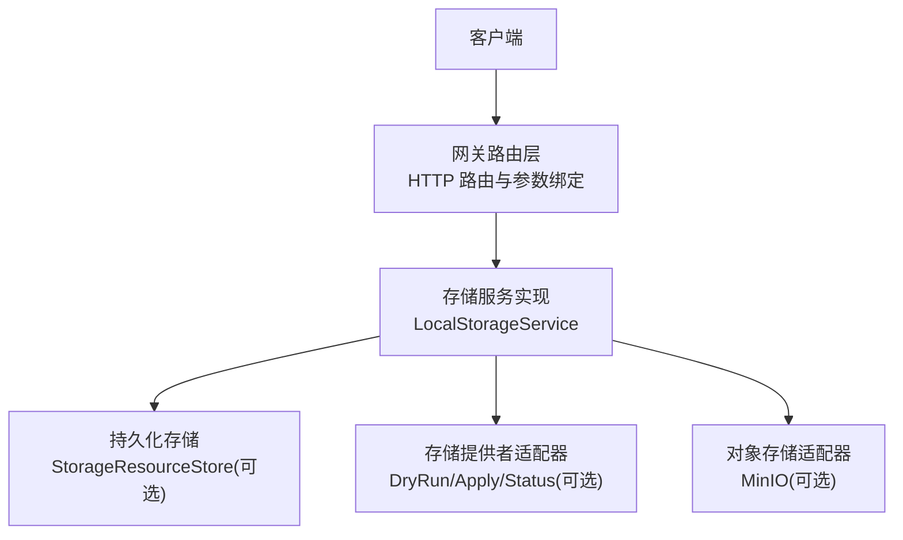
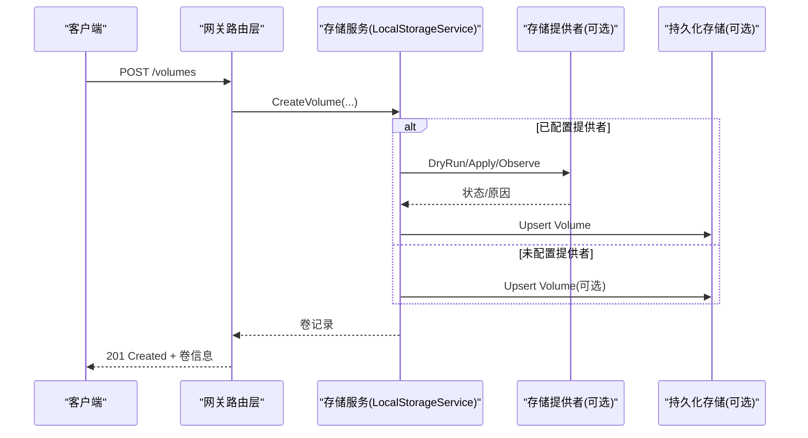
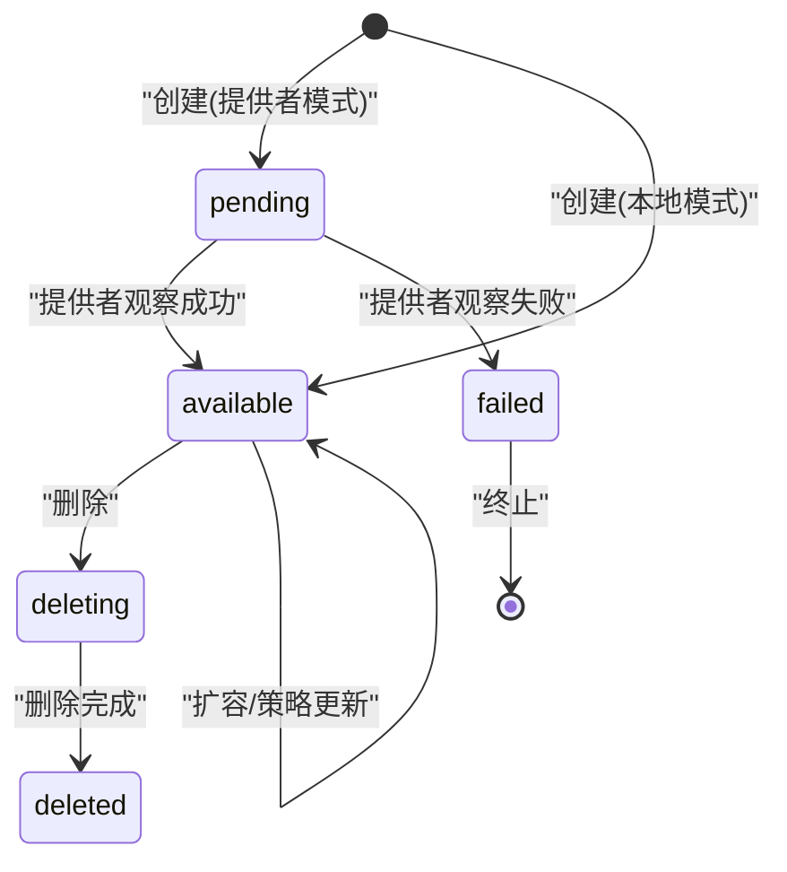
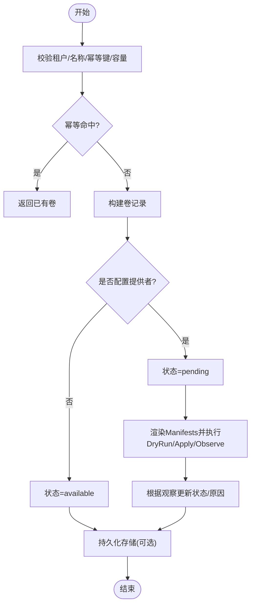
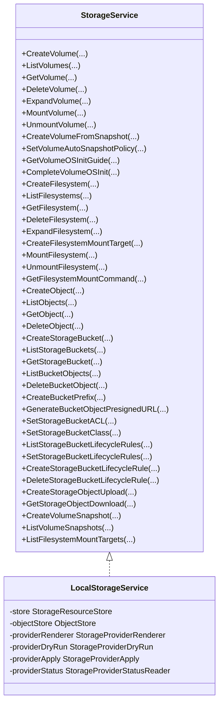

# 块存储 API

<cite>
**本文引用的文件**
- [storage_resources.go](file://services/ani-gateway/internal/router/storage_resources.go)
- [storage_service.go](file://pkg/adapters/runtime/storage_service.go)
- [storage_resources.go（端口定义）](file://pkg/ports/storage_resources.go)
- [storage_runtime.go](file://services/ani-gateway/storage_runtime.go)
</cite>

## 目录
1. [简介](#简介)
2. [项目结构](#项目结构)
3. [核心组件](#核心组件)
4. [架构总览](#架构总览)
5. [详细组件分析](#详细组件分析)
6. [依赖关系分析](#依赖关系分析)
7. [性能与一致性](#性能与一致性)
8. [故障排查指南](#故障排查指南)
9. [结论](#结论)
10. [附录：API 参考与示例](#附录api-参考与示例)

## 简介
本文件为“块存储 API”的权威技术文档，覆盖存储卷的生命周期管理、状态机与转换规则、快照能力、自动快照策略、OS 初始化引导、挂载历史与企业级特性。文档基于网关路由层、运行时服务实现与端口接口三层代码进行梳理，提供端到端调用流程、错误处理与最佳实践建议。

## 项目结构
- 网关路由层：负责 HTTP 路由注册、请求绑定、响应封装与任务接受态返回。
- 运行时服务：本地内存实现与可选持久化存储、对象存储、Kubernetes 提供者适配的统一服务实现。
- 端口接口：对外暴露的 StorageService 接口与数据模型，定义卷、文件系统、对象、快照等资源的统一契约。

图表来源
- [storage_resources.go:414-465](file://services/ani-gateway/internal/router/storage_resources.go#L414-L465)
- [storage_service.go:93-119](file://pkg/adapters/runtime/storage_service.go#L93-L119)
- [storage_runtime.go:75-157](file://services/ani-gateway/storage_runtime.go#L75-L157)

章节来源
- [storage_resources.go:414-465](file://services/ani-gateway/internal/router/storage_resources.go#L414-L465)
- [storage_service.go:93-119](file://pkg/adapters/runtime/storage_service.go#L93-L119)
- [storage_runtime.go:75-157](file://services/ani-gateway/storage_runtime.go#L75-L157)

## 核心组件
- 存储卷（Volume）：支持创建、扩容、挂载/卸载、从快照恢复、自动快照策略、OS 初始化引导、挂载历史。
- 文件系统（Filesystem）：支持创建、扩容、挂载目标创建、挂载/卸载、获取挂载命令。
- 对象存储（Object/Bucket）：支持桶生命周期、ACL、预签名上传/下载、对象列表与删除。
- 快照（Snapshot）：支持创建、列表、从快照恢复为新卷。
- 提供者适配：可选 Kubernetes REST 模式，渲染工作负载清单并执行 DryRun/Apply/Status 观察。

章节来源
- [storage_resources.go（端口定义）:317-428](file://pkg/ports/storage_resources.go#L317-L428)
- [storage_resources.go（端口定义）:487-534](file://pkg/ports/storage_resources.go#L487-L534)
- [storage_service.go:121-224](file://pkg/adapters/runtime/storage_service.go#L121-L224)

## 架构总览
- 请求进入网关路由层后，解析 JSON 并转换为端口请求对象，调用 StorageService。
- LocalStorageService 在内存中维护资源，若配置了持久化存储则同步 Upsert；若配置了存储提供者，则渲染 Manifests 并执行 DryRun/Apply/Status 观察，更新资源状态。
- 对象存储相关操作通过可插拔的对象存储适配器完成（如 MinIO）。

图表来源
- [storage_resources.go:467-485](file://services/ani-gateway/internal/router/storage_resources.go#L467-L485)
- [storage_service.go:121-224](file://pkg/adapters/runtime/storage_service.go#L121-L224)
- [storage_runtime.go:110-152](file://services/ani-gateway/storage_runtime.go#L110-L152)

## 详细组件分析

### 存储卷生命周期与状态机
- 状态集合：pending、available、failed、deleting、deleted。
- 典型转换：
  - 创建：
    - 未配置提供者：直接 available。
    - 配置提供者：pending -> 由提供者观察结果决定 available 或 failed。
  - 删除：标记为 deleted。
  - 扩容：不改变状态，仅更新大小。
  - 挂载：设置挂载信息与 OSInitStatus 为 pending，记录挂载历史。
  - 卸载：清空挂载信息，记录卸载历史。
  - 从快照恢复：新建卷，继承源卷属性，初始状态 available。
  - 自动快照策略：更新策略字段，不影响当前卷状态。
  - OS 初始化：查询引导步骤；完成后标记 done/skipped。

图表来源
- [storage_resources.go（端口定义）:8-16](file://pkg/ports/storage_resources.go#L8-L16)
- [storage_service.go:121-224](file://pkg/adapters/runtime/storage_service.go#L121-L224)
- [storage_service.go:268-300](file://pkg/adapters/runtime/storage_service.go#L268-L300)

章节来源
- [storage_resources.go（端口定义）:8-16](file://pkg/ports/storage_resources.go#L8-L16)
- [storage_service.go:121-224](file://pkg/adapters/runtime/storage_service.go#L121-L224)
- [storage_service.go:268-300](file://pkg/adapters/runtime/storage_service.go#L268-L300)

### 创建卷（CreateVolume）
- 入口：POST /volumes
- 行为：
  - 校验租户与名称、幂等键、容量大于零。
  - 生成唯一卷 ID，填充默认类型/IOPS/加密/自动快照策略/OS 初始化设备。
  - 若配置提供者：状态设为 pending，渲染 Manifests 并执行 DryRun/Apply/Status 观察。
  - 若同时传入挂载实例：立即记录一次 mount 历史。
  - 持久化存储：Upsert 卷记录。
- 响应：201 Created + 卷信息。

图表来源
- [storage_resources.go:467-485](file://services/ani-gateway/internal/router/storage_resources.go#L467-L485)
- [storage_service.go:121-224](file://pkg/adapters/runtime/storage_service.go#L121-L224)

章节来源
- [storage_resources.go:467-485](file://services/ani-gateway/internal/router/storage_resources.go#L467-L485)
- [storage_service.go:121-224](file://pkg/adapters/runtime/storage_service.go#L121-L224)

### 扩容卷（ExpandVolume）
- 入口：POST /volumes/:volume_id/expand
- 行为：幂等保护、校验新容量必须大于当前容量、更新大小与原因、持久化。
- 响应：202 Accepted + 任务信息（异步任务接受态）。

章节来源
- [storage_resources.go:518-535](file://services/ani-gateway/internal/router/storage_resources.go#L518-L535)
- [storage_service.go:302-328](file://pkg/adapters/runtime/storage_service.go#L302-L328)

### 挂载/卸载卷（Mount/Unmount）
- 挂载：
  - 入口：POST /volumes/:volume_id/mount
  - 行为：校验实例ID与路由、幂等保护、写入挂载信息、设置 OSInitStatus=pending、追加挂载历史、持久化。
  - 响应：202 Accepted + 任务信息。
- 卸载：
  - 入口：POST /volumes/:volume_id/unmount
  - 行为：清空挂载信息、追加卸载历史、幂等保护、持久化。
  - 响应：202 Accepted + 任务信息。

章节来源
- [storage_resources.go:537-574](file://services/ani-gateway/internal/router/storage_resources.go#L537-L574)
- [storage_service.go:330-394](file://pkg/adapters/runtime/storage_service.go#L330-L394)

### 从快照恢复卷（CreateVolumeFromSnapshot）
- 入口：POST /volumes/:volume_id/snapshots/:snapshot_id/create-volume
- 行为：校验源卷与快照存在且同租户、新容量不小于源卷容量、继承源卷属性、记录来源快照信息、初始状态 available。
- 响应：202 Accepted + 任务信息。

章节来源
- [storage_resources.go:576-596](file://services/ani-gateway/internal/router/storage_resources.go#L576-L596)
- [storage_service.go:396-450](file://pkg/adapters/runtime/storage_service.go#L396-L450)

### 自动快照策略（SetVolumeAutoSnapshotPolicy）
- 入口：PUT /volumes/:volume_id/auto-snapshot-policy
- 行为：校验保留天数与调度表达式、幂等保护、更新策略字段、持久化。
- 响应：200 OK + 卷信息。

章节来源
- [storage_resources.go:598-617](file://services/ani-gateway/internal/router/storage_resources.go#L598-L617)
- [storage_service.go:452-478](file://pkg/adapters/runtime/storage_service.go#L452-L478)

### OS 初始化引导（Get/Complete）
- 获取引导：GET /volumes/:volume_id/os-init-guide
  - 返回设备路径、步骤（查看设备、创建文件系统、挂载）、提示。
- 完成引导：POST /volumes/:volume_id/os-init-complete
  - 支持 mode=done 或 skipped，记录历史并更新状态。

章节来源
- [storage_resources.go:619-645](file://services/ani-gateway/internal/router/storage_resources.go#L619-L645)
- [storage_service.go:480-528](file://pkg/adapters/runtime/storage_service.go#L480-L528)

### 快照功能（Create/List）
- 创建快照：POST /volumes/:volume_id/snapshots
  - 行为：校验租户/名称/幂等键/卷存在、生成快照 ID、计算大小、若配置提供者则状态为 creating 并执行 DryRun/Apply/Observe。
  - 响应：202 Accepted + 任务信息。
- 列出快照：GET /volumes/:volume_id/snapshots
  - 行为：按卷过滤、按创建时间倒序。

章节来源
- [storage_resources.go:1144-1180](file://services/ani-gateway/internal/router/storage_resources.go#L1144-L1180)
- [storage_service.go:1753-1864](file://pkg/adapters/runtime/storage_service.go#L1753-L1864)

### 文件系统（Filesystem）
- 创建：POST /filesystems
  - 协议支持 nfs/cephfs，默认标准性能模式，生成挂载命令。
- 扩容：POST /filesystems/:filesystem_id/expand
- 挂载目标：POST /filesystems/:filesystem_id/mount-targets
- 挂载/卸载：POST /filesystems/:filesystem_id/{mount,unmount}
- 获取挂载命令：GET /filesystems/:filesystem_id/mount-command

章节来源
- [storage_resources.go:647-787](file://services/ani-gateway/internal/router/storage_resources.go#L647-L787)
- [storage_service.go:530-901](file://pkg/adapters/runtime/storage_service.go#L530-L901)

### 对象存储（Bucket/Object）
- 桶：创建、列表、ACL、存储类别、生命周期规则增删改查。
- 对象：创建元数据、预签名上传/下载、列表（支持前缀与分页游标）、删除。
- 前缀：创建虚拟前缀以组织对象视图。

章节来源
- [storage_resources.go:810-1142](file://services/ani-gateway/internal/router/storage_resources.go#L810-L1142)
- [storage_service.go:903-1704](file://pkg/adapters/runtime/storage_service.go#L903-L1704)

## 依赖关系分析
- 网关路由层依赖端口接口 StorageService，解耦具体实现。
- LocalStorageService 依赖：
  - StorageResourceStore（可选）：用于持久化卷、文件系统、对象、桶、快照、挂载目标。
  - ObjectStore（可选）：MinIO 等对象存储适配器。
  - ProviderRenderer/DryRun/Apply/Status（可选）：Kubernetes REST 提供者，渲染并应用工作负载清单。
- 运行时装配：通过环境变量配置提供者模式、对象存储、数据库连接等。

图表来源
- [storage_resources.go（端口定义）:487-534](file://pkg/ports/storage_resources.go#L487-L534)
- [storage_service.go:18-48](file://pkg/adapters/runtime/storage_service.go#L18-L48)

章节来源
- [storage_resources.go（端口定义）:487-534](file://pkg/ports/storage_resources.go#L487-L534)
- [storage_service.go:18-48](file://pkg/adapters/runtime/storage_service.go#L18-L48)

## 性能与一致性
- 幂等性：所有写操作均支持 idempotency_key，避免重复提交导致的状态不一致。
- 并发安全：服务内部使用读写锁保护内存数据结构；对关键路径采用细粒度锁。
- 观察者模式：提供者模式下，通过 DryRun/Apply/Status 三阶段确保最终一致性与可观测性。
- 分页与限制：对象列表支持 cursor 与 limit，防止大表扫描。
- 推荐实践：
  - 为所有写操作提供稳定的幂等键。
  - 在提供者模式下关注 observe 返回的状态与原因，必要时重试或人工介入。
  - 合理设置对象列表 limit，避免过大响应。

章节来源
- [storage_service.go:121-224](file://pkg/adapters/runtime/storage_service.go#L121-L224)
- [storage_service.go:1230-1354](file://pkg/adapters/runtime/storage_service.go#L1230-L1354)

## 故障排查指南
- 常见错误码与含义：
  - ErrInvalid：参数非法（如容量不大于零、必填字段缺失、不支持的值）。
  - ErrNotFound：资源不存在（卷、快照、桶、对象等）。
  - ErrConflict：冲突（如桶名重复、前缀已存在）。
  - ErrUnsupported：不支持的功能或值（如协议、访问模式、存储类别）。
  - ErrFailedPrecondition：前置条件不满足（如文件系统挂载需存在可用挂载目标）。
  - ErrNotConfigured：未配置必要的提供者或存储组件。
- 定位方法：
  - 检查请求体字段是否符合规范。
  - 确认幂等键是否重复且指向不同资源。
  - 在提供者模式下，查看 DryRun/Apply/Status 返回的原因与警告。
  - 对于对象存储，检查桶是否存在、ACL 与存储类别是否合法。

章节来源
- [storage_resources.go（端口定义）:8-16](file://pkg/ports/storage_resources.go#L8-L16)
- [storage_service.go:121-224](file://pkg/adapters/runtime/storage_service.go#L121-L224)
- [storage_service.go:1753-1864](file://pkg/adapters/runtime/storage_service.go#L1753-L1864)

## 结论
本 API 以清晰的端口接口与可插拔实现为核心，提供了完整的块存储生命周期管理能力。通过幂等性、观察者模式与持久化存储，确保了高可靠与可扩展的企业级特性。建议在生产环境启用提供者模式与持久化存储，并结合监控与告警机制保障稳定性。

## 附录：API 参考与示例

### 卷相关
- 创建卷
  - 方法：POST /volumes
  - 请求体关键字段：idempotency_key、name、size_gib、storage_class、zone、volume_type、encrypted、mount_instance_id、mount_route
  - 响应：201 Created + 卷信息
- 扩容卷
  - 方法：POST /volumes/:volume_id/expand
  - 请求体关键字段：idempotency_key、size_gib
  - 响应：202 Accepted + 任务信息
- 挂载卷
  - 方法：POST /volumes/:volume_id/mount
  - 请求体关键字段：idempotency_key、instance_id、instance_route、mount_name
  - 响应：202 Accepted + 任务信息
- 卸载卷
  - 方法：POST /volumes/:volume_id/unmount
  - 请求体关键字段：idempotency_key
  - 响应：202 Accepted + 任务信息
- 从快照恢复卷
  - 方法：POST /volumes/:volume_id/snapshots/:snapshot_id/create-volume
  - 请求体关键字段：idempotency_key、name、size_gib、zone
  - 响应：202 Accepted + 任务信息
- 设置自动快照策略
  - 方法：PUT /volumes/:volume_id/auto-snapshot-policy
  - 请求体关键字段：idempotency_key、enabled、retain_days、schedule
  - 响应：200 OK + 卷信息
- OS 初始化
  - 获取引导：GET /volumes/:volume_id/os-init-guide
  - 完成引导：POST /volumes/:volume_id/os-init-complete（mode=done|skipped）

章节来源
- [storage_resources.go:467-645](file://services/ani-gateway/internal/router/storage_resources.go#L467-L645)
- [storage_service.go:121-528](file://pkg/adapters/runtime/storage_service.go#L121-L528)

### 快照相关
- 创建快照
  - 方法：POST /volumes/:volume_id/snapshots
  - 请求体关键字段：idempotency_key、name、description
  - 响应：202 Accepted + 任务信息
- 列出快照
  - 方法：GET /volumes/:volume_id/snapshots
  - 响应：200 OK + 快照列表

章节来源
- [storage_resources.go:1144-1180](file://services/ani-gateway/internal/router/storage_resources.go#L1144-L1180)
- [storage_service.go:1753-1864](file://pkg/adapters/runtime/storage_service.go#L1753-L1864)

### 文件系统相关
- 创建文件系统
  - 方法：POST /filesystems
  - 请求体关键字段：idempotency_key、name、protocol、size_gib、zone、performance_mode
  - 响应：201 Created + 文件系统信息
- 扩容文件系统
  - 方法：POST /filesystems/:filesystem_id/expand
  - 请求体关键字段：idempotency_key、size_gib
  - 响应：202 Accepted + 任务信息
- 创建挂载目标
  - 方法：POST /filesystems/:filesystem_id/mount-targets
  - 请求体关键字段：idempotency_key、subnet_id、vpc_id
  - 响应：202 Accepted + 任务信息
- 挂载/卸载
  - 挂载：POST /filesystems/:filesystem_id/mount（instance_id、instance_route、mount_path、auto_mount）
  - 卸载：POST /filesystems/:filesystem_id/unmount（instance_id）
  - 响应：202 Accepted + 任务信息
- 获取挂载命令
  - 方法：GET /filesystems/:filesystem_id/mount-command
  - 响应：200 OK + 命令信息

章节来源
- [storage_resources.go:647-787](file://services/ani-gateway/internal/router/storage_resources.go#L647-L787)
- [storage_service.go:530-901](file://pkg/adapters/runtime/storage_service.go#L530-L901)

### 对象存储相关
- 桶
  - 创建：POST /buckets（name、region、access_mode）
  - 列表：GET /buckets（limit、cursor）
  - ACL：PUT /buckets/:bucket_id/acl（acl）
  - 存储类别：PUT /buckets/:bucket_id/storage-class（storage_class）
  - 生命周期规则：增删改查
- 对象
  - 创建元数据：POST /objects（bucket、key、size_bytes、content_type）
  - 预签名上传：POST /buckets/:bucket_id/objects/upload（key、content_type、size_bytes、storage_class）
  - 预签名下载：POST /buckets/:bucket_id/objects/presigned-url（key、method、expires_hours）
  - 列表：GET /buckets/:bucket_id/objects（prefix、limit、cursor）
  - 删除：DELETE /buckets/:bucket_id/objects?key=...

章节来源
- [storage_resources.go:810-1142](file://services/ani-gateway/internal/router/storage_resources.go#L810-L1142)
- [storage_service.go:903-1704](file://pkg/adapters/runtime/storage_service.go#L903-L1704)

### 错误处理要点
- 参数校验失败：返回 BAD_REQUEST，检查必填字段与取值范围。
- 资源不存在：返回 NOT_FOUND，确认租户与资源 ID。
- 冲突：返回 CONFLICT，检查命名与唯一性约束。
- 不支持：返回 UNSUPPORTED，检查协议、访问模式、存储类别等。
- 前置条件不满足：返回 FAILED_PRECONDITION，例如文件系统挂载需存在可用挂载目标。
- 未配置：返回 NOT_CONFIGURED，检查提供者与存储组件的环境变量配置。

章节来源
- [storage_resources.go（端口定义）:8-16](file://pkg/ports/storage_resources.go#L8-L16)
- [storage_service.go:121-224](file://pkg/adapters/runtime/storage_service.go#L121-L224)
- [storage_service.go:1753-1864](file://pkg/adapters/runtime/storage_service.go#L1753-L1864)