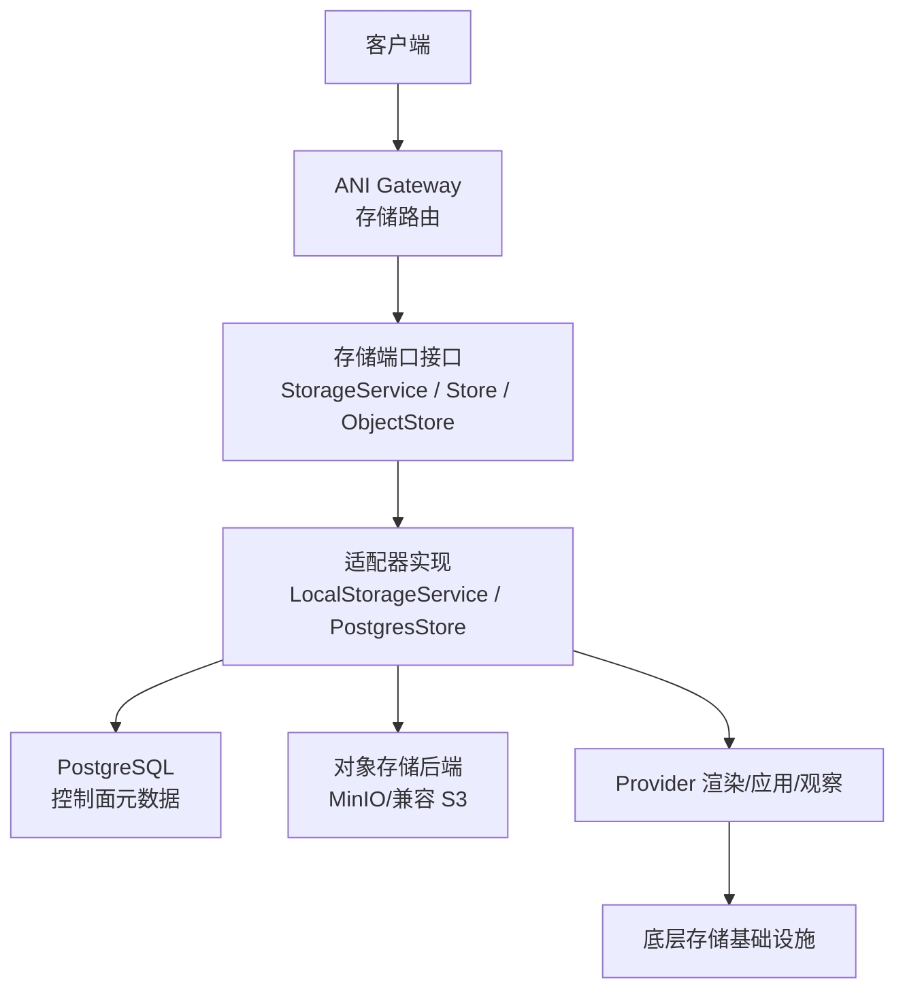
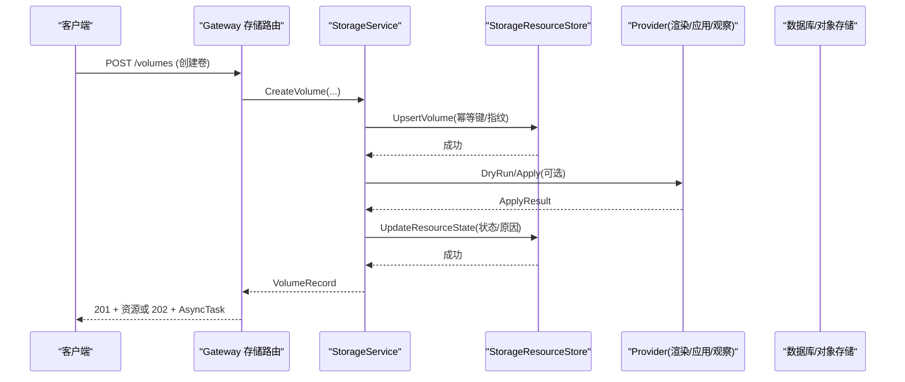
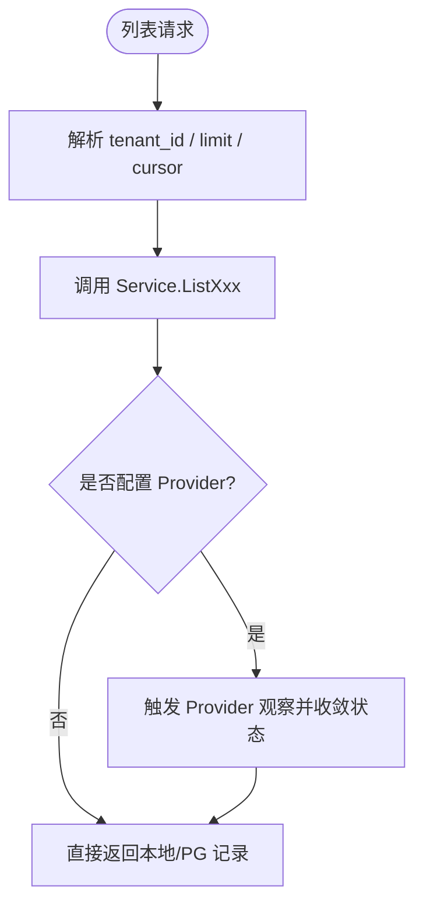
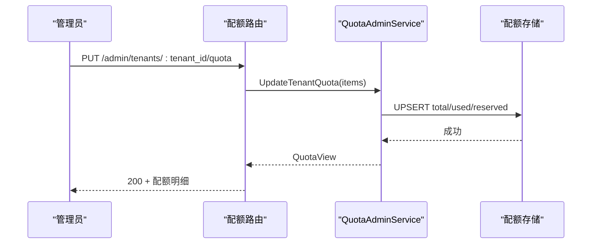
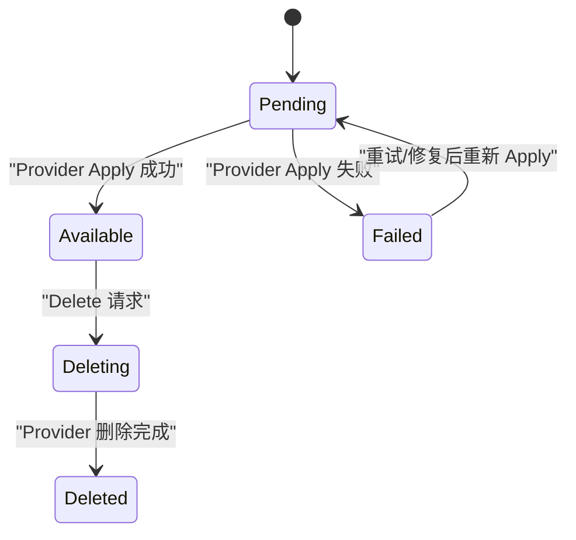
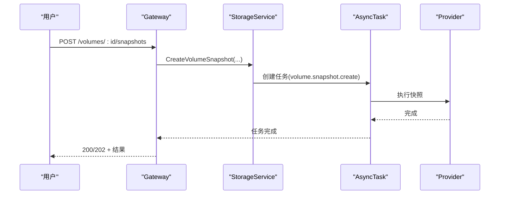
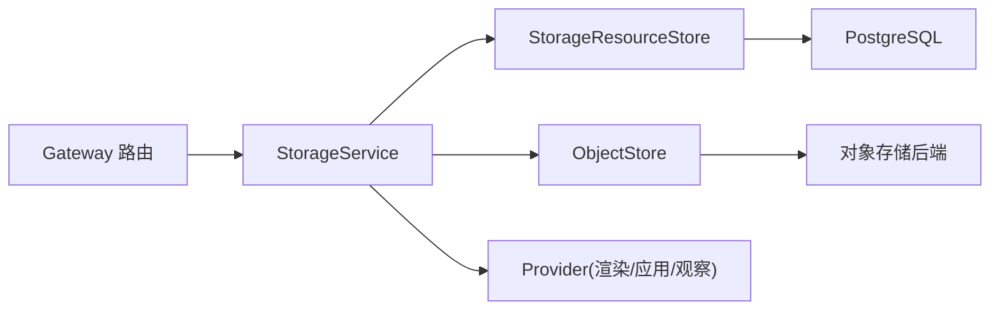

# 存储管理 API

<cite>
**本文引用的文件**
- [v1.yaml](file://repo/api/openapi/v1.yaml)
- [storage_resources.go](file://repo/services/ani-gateway/internal/router/storage_resources.go)
- [quota_resources.go](file://repo/services/ani-gateway/internal/router/quota_resources.go)
- [storage_resources.go](file://repo/pkg/ports/storage_resources.go)
- [storage_service.go](file://repo/pkg/adapters/runtime/storage_service.go)
- [storage_store.go](file://repo/pkg/adapters/runtime/storage_store.go)
- [object_store.go](file://repo/pkg/ports/object_store.go)
- [prometheus_instance_observability_test.go](file://repo/pkg/adapters/runtime/prometheus_instance_observability_test.go)
- [probes_test.go](file://repo/pkg/bootstrap/probes_test.go)
- [README.md](file://repo/development-records/README.md)
</cite>

## 目录
1. [简介](#简介)
2. [项目结构](#项目结构)
3. [核心组件](#核心组件)
4. [架构总览](#架构总览)
5. [详细组件分析](#详细组件分析)
6. [依赖关系分析](#依赖关系分析)
7. [性能与可观测性](#性能与可观测性)
8. [故障排查指南](#故障排查指南)
9. [结论](#结论)
10. [附录：API 清单与运维能力](#附录api-清单与运维能力)

## 简介
本文件面向“存储管理 API”，覆盖存储资源的统一查询、列表与过滤；存储配额管理、容量监控与使用统计等运维接口；状态同步、健康检查与故障转移等企业级管理能力；以及迁移、复制、跨可用区同步等高级场景的 API 支持。同时提供审计、合规与成本分析的落地指引，帮助平台与租户在块存储（卷）、文件系统、对象存储三大类资源上实现一致、幂等、可观测、可治理的存储生命周期管理。

## 项目结构
存储管理 API 由三层构成：
- 网关路由层：负责 HTTP 路由、请求校验、异步任务编排与错误映射。
- 服务端口层：定义统一的 StorageService、StorageResourceStore、ObjectStore、QuotaService 等接口契约。
- 适配器与持久化层：本地内存实现、PostgreSQL 控制面存储、对象存储后端、Provider 渲染/应用/观察与 Reconciler。

图表来源
- [storage_resources.go:414-465](file://repo/services/ani-gateway/internal/router/storage_resources.go#L414-L465)
- [storage_resources.go:487-800](file://repo/services/ani-gateway/internal/router/storage_resources.go#L487-L800)
- [storage_resources.go:487-800](file://repo/pkg/ports/storage_resources.go#L487-L559)
- [storage_service.go:18-119](file://repo/pkg/adapters/runtime/storage_service.go#L18-L119)
- [object_store.go:47-56](file://repo/pkg/ports/object_store.go#L47-L56)

章节来源
- [storage_resources.go:414-465](file://repo/services/ani-gateway/internal/router/storage_resources.go#L414-L465)
- [storage_resources.go:487-800](file://repo/services/ani-gateway/internal/router/storage_resources.go#L487-L800)
- [storage_resources.go:487-800](file://repo/pkg/ports/storage_resources.go#L487-L559)
- [storage_service.go:18-119](file://repo/pkg/adapters/runtime/storage_service.go#L18-L119)
- [object_store.go:47-56](file://repo/pkg/ports/object_store.go#L47-L56)

## 核心组件
- 存储资源模型与操作
  - 块存储卷：创建、扩容、挂载/卸载、快照、从快照恢复、自动快照策略、OS 初始化引导。
  - 文件系统：创建、扩容、挂载目标、挂载/卸载、获取挂载命令。
  - 对象存储：桶 CRUD、对象上传/下载、预签名 URL、ACL/存储类/生命周期规则。
- 存储配额管理
  - 租户维度配额配置、查询、删除；资源类型注册元信息；Try-Confirm-Cancel/Release 预留扣减。
- 控制面持久化与幂等
  - 通过 Upsert/FindByCreateIdempotency 保证幂等；状态机驱动更新。
- Provider 抽象
  - Render/DryRun/Apply/Observe 四段式，配合 Reconcile 将期望态收敛为实际态。
- 对象存储后端
  - Health、EnsureBucket、Put/Get/Delete/Stat、SignedURL。

章节来源
- [storage_resources.go:487-559](file://repo/pkg/ports/storage_resources.go#L487-L559)
- [storage_resources.go:536-559](file://repo/pkg/ports/storage_resources.go#L536-L559)
- [storage_resources.go:561-683](file://repo/pkg/ports/storage_resources.go#L561-L683)
- [object_store.go:47-56](file://repo/pkg/ports/object_store.go#L47-L56)
- [quota_resources.go:21-28](file://repo/services/ani-gateway/internal/router/quota_resources.go#L21-L28)
- [quota_resources.go:85-165](file://repo/services/ani-gateway/internal/router/quota_resources.go#L85-L165)

## 架构总览
存储管理采用“网关路由 + 端口契约 + 适配器实现”的分层设计。Gateway 暴露 REST 端点，调用 StorageService 完成业务编排；存储服务通过 StorageResourceStore 持久化控制面元数据，并通过 Provider 抽象对接真实存储后端；对象存储通过 ObjectStore 抽象屏蔽具体实现差异。

图表来源
- [storage_resources.go:467-535](file://repo/services/ani-gateway/internal/router/storage_resources.go#L467-L535)
- [storage_resources.go:121-200](file://repo/pkg/adapters/runtime/storage_service.go#L121-L200)
- [storage_store.go:234-256](file://repo/pkg/adapters/runtime/storage_store.go#L234-L256)

## 详细组件分析

### 存储资源统一查询、列表与过滤
- 统一入口
  - 卷：GET/POST/DELETE /volumes/{id}，GET /volumes，快照相关子资源。
  - 文件系统：GET/POST/DELETE /filesystems/{id}，GET /filesystems，挂载目标、扩容、挂载/卸载。
  - 对象：GET/POST/DELETE /objects/{id}，GET /objects，上传/下载、桶对象列表、生命周期规则。
- 分页与游标
  - 列表返回 items、total、next_cursor；对象桶对象列表支持 prefix、limit、cursor。
- 过滤与上下文
  - 所有列表按 tenant_id 隔离；部分列表支持按父资源 ID 过滤（如快照按 volume_id）。

图表来源
- [storage_resources.go:487-535](file://repo/services/ani-gateway/internal/router/storage_resources.go#L487-L535)
- [storage_resources.go:669-717](file://repo/services/ani-gateway/internal/router/storage_resources.go#L669-L717)
- [storage_resources.go:789-800](file://repo/services/ani-gateway/internal/router/storage_resources.go#L789-L800)

章节来源
- [storage_resources.go:414-465](file://repo/services/ani-gateway/internal/router/storage_resources.go#L414-L465)
- [storage_resources.go:487-800](file://repo/services/ani-gateway/internal/router/storage_resources.go#L487-L800)
- [storage_resources.go:467-471](file://repo/pkg/ports/storage_resources.go#L467-L471)

### 存储配额管理、容量监控与使用统计
- 配额管理端点
  - 创建/更新/查询/删除租户配额；列出配额元信息（资源类型、单位、默认值、是否离散）。
- 配额维度
  - 包含 storage_gb 等维度，结合 Try/TryMany/Tx 进行原子预留与确认/取消/释放。
- 容量与使用统计
  - 通过对象存储 Stat/List 聚合桶大小与对象计数；卷/文件系统通过控制面字段（size_gib、object_count）呈现容量视图。

图表来源
- [quota_resources.go:21-28](file://repo/services/ani-gateway/internal/router/quota_resources.go#L21-L28)
- [quota_resources.go:85-165](file://repo/services/ani-gateway/internal/router/quota_resources.go#L85-L165)
- [quota.go:70-101](file://repo/pkg/ports/quota.go#L70-L101)

章节来源
- [quota_resources.go:21-28](file://repo/services/ani-gateway/internal/router/quota_resources.go#L21-L28)
- [quota_resources.go:85-165](file://repo/services/ani-gateway/internal/router/quota_resources.go#L85-L165)
- [quota.go:70-101](file://repo/pkg/ports/quota.go#L70-L101)

### 状态同步、健康检查与故障转移
- 状态同步
  - 通过 Provider StatusReader 观察实际状态，Reconciler 将期望态收敛到稳定态（pending/available/failed/deleting/deleted）。
- 健康检查
  - 对象存储健康检查作为弱依赖，降级时 readyz 仍 200，但标记 degraded。
- 故障转移
  - 多端点健康探测失败时回退至备用端点（向量存储示例），存储适配层具备重试与降级语义。

图表来源
- [storage_resources.go:641-683](file://repo/pkg/ports/storage_resources.go#L641-L683)
- [probes_test.go:52-89](file://repo/pkg/bootstrap/probes_test.go#L52-L89)

章节来源
- [storage_resources.go:641-683](file://repo/pkg/ports/storage_resources.go#L641-L683)
- [probes_test.go:52-89](file://repo/pkg/bootstrap/probes_test.go#L52-L89)

### 迁移工具、数据复制与跨可用区同步
- 迁移与复制
  - 卷快照与从快照恢复：支持跨可用区恢复（zone 参数），用于迁移与容灾。
  - 对象存储：预签名上传/下载、桶对象列表与生命周期规则，便于批量迁移与归档。
- 跨可用区
  - 卷/文件系统支持 zone 字段；快照可指定 zone 创建新卷，实现跨区复制。
- 自动化流程
  - 扩容、挂载/卸载、快照创建等操作均通过异步任务（AsyncTask）编排，支持轮询与回调。

图表来源
- [storage_resources.go:576-596](file://repo/services/ani-gateway/internal/router/storage_resources.go#L576-L596)
- [v1.yaml:351-372](file://repo/api/openapi/v1.yaml#L351-L372)

章节来源
- [storage_resources.go:576-596](file://repo/services/ani-gateway/internal/router/storage_resources.go#L576-L596)
- [v1.yaml:351-372](file://repo/api/openapi/v1.yaml#L351-L372)

### 审计、合规与成本分析
- 审计
  - 控制面记录 create_request_fingerprint、updated_at、reason 等，便于审计追踪与问题定位。
- 合规
  - 幂等键与请求指纹确保重复提交安全；对象存储 ACL/存储类/生命周期规则满足合规策略。
- 成本分析
  - 通过对象存储对象计数与大小、卷 size_gib、文件系统 size_gib 汇总用量；配额 used/reserved 辅助成本核算。

章节来源
- [storage_resources.go:18-67](file://repo/pkg/ports/storage_resources.go#L18-L67)
- [storage_resources.go:69-133](file://repo/pkg/ports/storage_resources.go#L69-L133)
- [storage_resources.go:85-116](file://repo/pkg/ports/storage_resources.go#L85-L116)

## 依赖关系分析
- Gateway 路由依赖 StorageService 与 AsyncTaskStore。
- StorageService 依赖 StorageResourceStore、ObjectStore、ProviderRenderer/DryRun/Apply/StatusReader。
- StorageResourceStore 依赖 PostgreSQL（控制面元数据）。
- ObjectStore 依赖对象存储后端（如 MinIO/S3）。

图表来源
- [storage_resources.go:414-465](file://repo/services/ani-gateway/internal/router/storage_resources.go#L414-L465)
- [storage_service.go:18-119](file://repo/pkg/adapters/runtime/storage_service.go#L18-L119)
- [object_store.go:47-56](file://repo/pkg/ports/object_store.go#L47-L56)

章节来源
- [storage_resources.go:414-465](file://repo/services/ani-gateway/internal/router/storage_resources.go#L414-L465)
- [storage_service.go:18-119](file://repo/pkg/adapters/runtime/storage_service.go#L18-L119)
- [object_store.go:47-56](file://repo/pkg/ports/object_store.go#L47-L56)

## 性能与可观测性
- 性能
  - 列表接口支持 cursor 分页，避免全量拉取；对象桶对象列表支持 prefix 与 limit 优化扫描。
  - 幂等键与并发保护减少重复执行与竞争条件。
- 可观测性
  - 指标采集：实例观测适配器支持 Prometheus/KubeVirt 指标，测试覆盖 CPU/内存/网络等维度。
  - 日志：通过 LogStore 抽象（Loki/ES/K8s）统一查询，支持 level 过滤与 cursor 翻页。
  - 健康检查：弱依赖降级不阻断服务，readyz 返回 degraded。

章节来源
- [prometheus_instance_observability_test.go:102-130](file://repo/pkg/adapters/runtime/prometheus_instance_observability_test.go#L102-L130)
- [prometheus_instance_observability_test.go:794-824](file://repo/pkg/adapters/runtime/prometheus_instance_observability_test.go#L794-L824)
- [probes_test.go:52-89](file://repo/pkg/bootstrap/probes_test.go#L52-L89)
- [README.md:73-89](file://repo/development-records/README.md#L73-L89)

## 故障排查指南
- 常见错误码
  - 400 BAD_REQUEST：请求体无效或参数缺失。
  - 404 NOT_FOUND：资源不存在或租户不存在。
  - 409 CONFLICT：幂等冲突或配额已存在。
  - 422 UNPROCESSABLE_ENTITY：资源未注册或校验失败。
  - 500 INTERNAL_ERROR：内部异常。
- 排查步骤
  - 检查幂等键与请求指纹是否重复。
  - 查看 Provider 观察结果与 reason 字段。
  - 核对对象存储健康与权限（ACL/存储类/生命周期）。
  - 对异步任务通过 task_id 轮询进度与错误消息。

章节来源
- [quota_resources.go:186-201](file://repo/services/ani-gateway/internal/router/quota_resources.go#L186-L201)
- [storage_resources.go:467-535](file://repo/services/ani-gateway/internal/router/storage_resources.go#L467-L535)

## 结论
本存储管理 API 以统一端口契约为核心，结合 Gateway 路由、适配器与 Provider 抽象，实现了块存储、文件系统与对象存储的一致化管理。通过幂等、异步任务、状态机与健康检查，提供了企业级的可靠性与可观测性。配额管理与审计能力支撑合规与成本分析；快照与跨可用区恢复满足迁移与容灾需求。建议在生产环境启用 Provider 模式与真实后端，并结合 Prometheus/Loki 完善监控与告警。

## 附录：API 清单与运维能力
- 存储资源
  - 卷：创建、列表、详情、删除、扩容、挂载/卸载、快照、从快照恢复、自动快照策略、OS 初始化。
  - 文件系统：创建、列表、详情、删除、扩容、挂载目标、挂载/卸载、挂载命令。
  - 对象：桶 CRUD、对象上传/下载、预签名 URL、ACL/存储类/生命周期规则。
- 配额管理
  - 创建/更新/查询/删除租户配额；列出配额元信息。
- 运维能力
  - 健康检查：对象存储健康作为弱依赖。
  - 状态同步：Provider 观察与 Reconcile 收敛。
  - 异步任务：202 响应 + Location 头，轮询任务状态。

章节来源
- [storage_resources.go:414-465](file://repo/services/ani-gateway/internal/router/storage_resources.go#L414-L465)
- [quota_resources.go:21-28](file://repo/services/ani-gateway/internal/router/quota_resources.go#L21-L28)
- [v1.yaml:351-372](file://repo/api/openapi/v1.yaml#L351-L372)
- [probes_test.go:52-89](file://repo/pkg/bootstrap/probes_test.go#L52-L89)