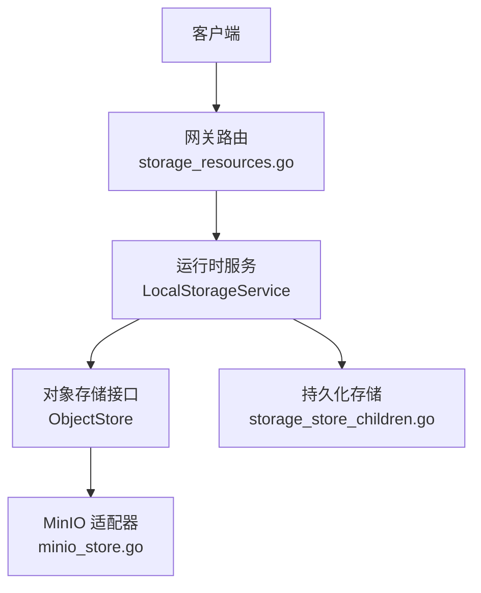
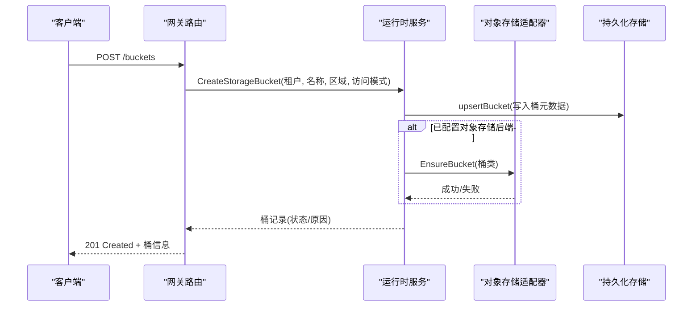
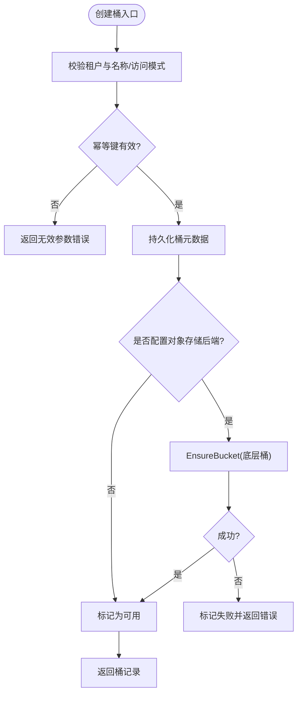
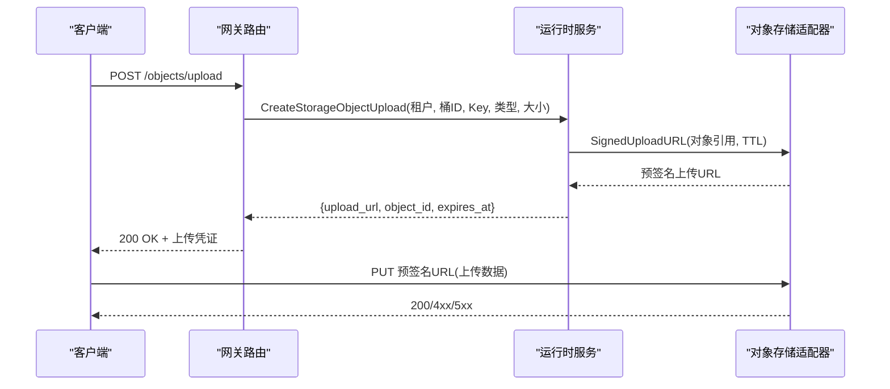
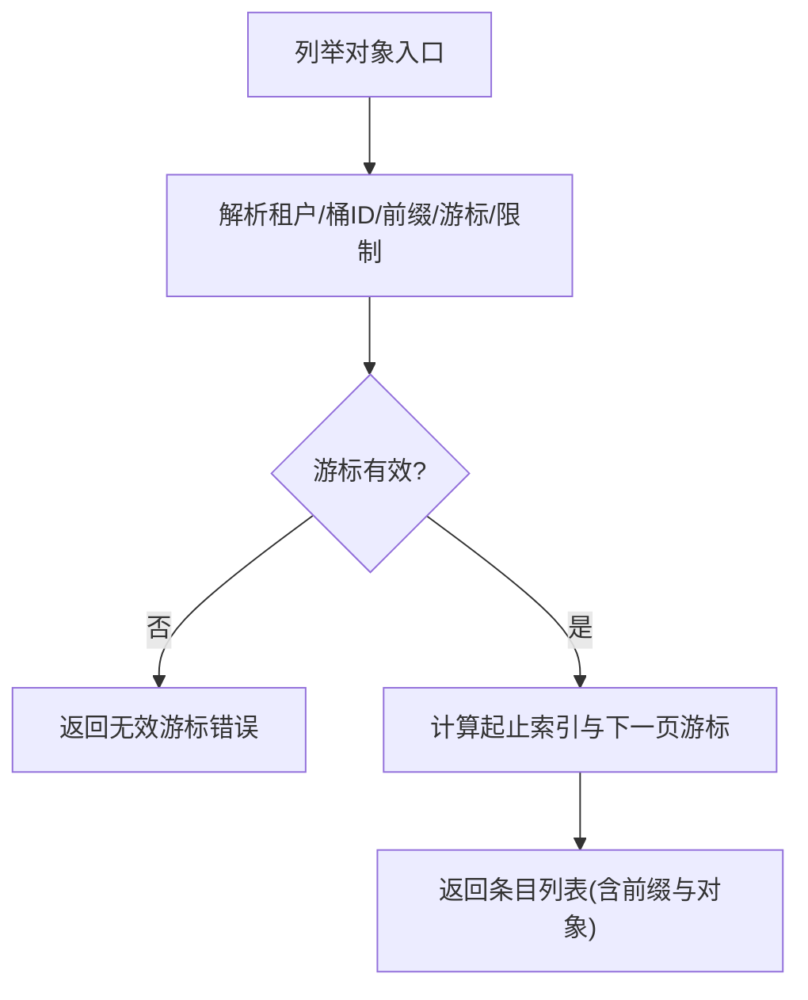
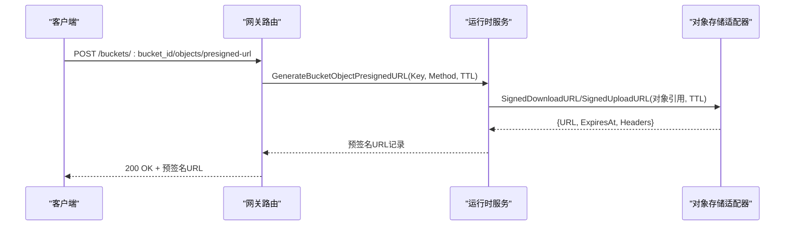
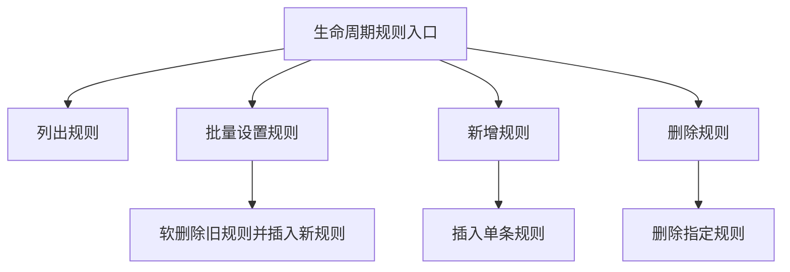
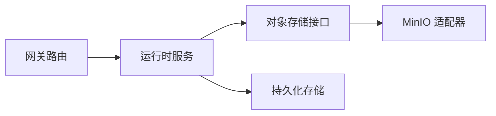

# 对象存储 API

<cite>
**本文引用的文件**
- [storage_resources.go](file://services/ani-gateway/internal/router/storage_resources.go)
- [storage_service.go](file://pkg/adapters/runtime/storage_service.go)
- [minio_store.go](file://pkg/adapters/objectstore/minio_store.go)
- [object_store.go](file://pkg/ports/object_store.go)
- [storage_runtime.go](file://services/ani-gateway/storage_runtime.go)
- [storage_store_children.go](file://pkg/adapters/runtime/storage_store_children.go)
</cite>

## 目录
1. [简介](#简介)
2. [项目结构](#项目结构)
3. [核心组件](#核心组件)
4. [架构总览](#架构总览)
5. [详细组件分析](#详细组件分析)
6. [依赖关系分析](#依赖关系分析)
7. [性能与可靠性](#性能与可靠性)
8. [故障排查指南](#故障排查指南)
9. [结论](#结论)
10. [附录：API 参考与最佳实践](#附录api-参考与最佳实践)

## 简介
本文件面向使用本平台对象存储能力的开发者，系统化说明存储桶（Bucket）的创建、配置与生命周期管理；对象的上传、下载、删除操作；预签名 URL 生成；访问控制列表（ACL）、存储类（Storage Class）、版本控制等安全与管理特性；以及文件前缀管理、对象元数据操作、大文件分片上传等企业级能力。文档同时提供调用流程示意与最佳实践建议，帮助快速集成并稳定运行。

## 项目结构
对象存储能力由网关路由层、运行时服务层、对象存储适配器三层组成：
- 网关路由层：暴露 RESTful API，负责参数校验、租户隔离、错误映射与响应封装。
- 运行时服务层：实现业务编排、幂等性、状态持久化、对象元数据与生命周期规则管理。
- 对象存储适配器：对接底层对象存储（如 MinIO），完成鉴权签名、请求重试、健康检查与桶/对象操作。

**图表来源**
- [storage_resources.go:414-465](file://services/ani-gateway/internal/router/storage_resources.go#L414-L465)
- [storage_service.go:1014-1102](file://pkg/adapters/runtime/storage_service.go#L1014-L1102)
- [minio_store.go:127-161](file://pkg/adapters/objectstore/minio_store.go#L127-L161)
- [storage_store_children.go:41-70](file://pkg/adapters/runtime/storage_store_children.go#L41-L70)

**章节来源**
- [storage_resources.go:414-465](file://services/ani-gateway/internal/router/storage_resources.go#L414-L465)
- [storage_service.go:18-48](file://pkg/adapters/runtime/storage_service.go#L18-L48)
- [minio_store.go:31-58](file://pkg/adapters/objectstore/minio_store.go#L31-L58)
- [storage_store_children.go:41-70](file://pkg/adapters/runtime/storage_store_children.go#L41-L70)

## 核心组件
- 网关存储路由：注册并处理存储相关 HTTP 端点，包括桶、对象、前缀、ACL、存储类、生命周期规则等。
- 运行时存储服务：维护桶、对象、快照、挂载目标等资源的内存或数据库状态，提供幂等性与一致性保障，协调对象存储适配器执行实际读写。
- 对象存储适配器：实现 S3 兼容协议签名、桶存在性检查、对象上传/下载/删除/统计、预签名 URL 生成等。
- 端口定义：抽象对象存储能力（桶类、对象引用、元数据、预签名 URL 等），解耦上层服务与底层实现。

**章节来源**
- [object_store.go:9-56](file://pkg/ports/object_store.go#L9-L56)
- [storage_service.go:18-48](file://pkg/adapters/runtime/storage_service.go#L18-L48)
- [minio_store.go:46-58](file://pkg/adapters/objectstore/minio_store.go#L46-L58)
- [storage_resources.go:16-18](file://services/ani-gateway/internal/router/storage_resources.go#L16-L18)

## 架构总览
下图展示一次“创建桶”的端到端调用链：网关路由接收请求，调用运行时服务创建桶记录，必要时通过对象存储适配器确保底层桶存在，最终返回桶信息。

**图表来源**
- [storage_resources.go:445-447](file://services/ani-gateway/internal/router/storage_resources.go#L445-L447)
- [storage_service.go:1014-1102](file://pkg/adapters/runtime/storage_service.go#L1014-L1102)
- [minio_store.go:127-161](file://pkg/adapters/objectstore/minio_store.go#L127-L161)
- [storage_store_children.go:41-70](file://pkg/adapters/runtime/storage_store_children.go#L41-L70)

## 详细组件分析

### 存储桶（Bucket）管理
- 创建桶：支持指定名称、区域、访问模式；若配置了对象存储后端，会调用 EnsureBucket 确保底层桶存在；未配置时以本地模式直接可用。
- 列出桶：按租户过滤，返回桶列表及分页游标。
- 获取桶：根据桶 ID 查询桶详情。
- ACL 设置：支持私有与租户内读两种模式，并在响应中附带可读标签。
- 存储类设置：为桶设置存储类，影响对象默认存储策略。
- 版本控制：桶记录包含版本控制字段，用于标识是否启用版本控制。

**图表来源**
- [storage_service.go:1014-1102](file://pkg/adapters/runtime/storage_service.go#L1014-L1102)
- [minio_store.go:127-161](file://pkg/adapters/objectstore/minio_store.go#L127-L161)

**章节来源**
- [storage_resources.go:445-457](file://services/ani-gateway/internal/router/storage_resources.go#L445-L457)
- [storage_service.go:1014-1102](file://pkg/adapters/runtime/storage_service.go#L1014-L1102)
- [storage_service.go:1513-1546](file://pkg/adapters/runtime/storage_service.go#L1513-L1546)
- [storage_service.go:2279-2298](file://pkg/adapters/runtime/storage_service.go#L2279-L2298)

### 对象上传与下载
- 上传入口：通过 /objects/upload 或 /buckets/:bucket_id/objects/upload 发起上传准备，返回预签名上传 URL、对象 ID 与过期时间。
- 下载入口：通过 /objects/:object_id/download 获取预签名下载 URL，附带内容类型与大小信息。
- 直传流程：客户端使用预签名 URL 直接与对象存储后端交互，减少网关负载。

**图表来源**
- [storage_resources.go:459-464](file://services/ani-gateway/internal/router/storage_resources.go#L459-L464)
- [storage_service.go:1130-1190](file://pkg/adapters/runtime/storage_service.go#L1130-L1190)
- [minio_store.go:266-313](file://pkg/adapters/objectstore/minio_store.go#L266-L313)

**章节来源**
- [storage_resources.go:459-464](file://services/ani-gateway/internal/router/storage_resources.go#L459-L464)
- [storage_service.go:1130-1190](file://pkg/adapters/runtime/storage_service.go#L1130-L1190)
- [minio_store.go:266-313](file://pkg/adapters/objectstore/minio_store.go#L266-L313)

### 对象删除与列举
- 删除对象：支持按桶与 Key 删除对象，返回删除结果。
- 列举对象：支持按前缀过滤、分页游标、返回条目类型（prefix/object）、大小与更新时间等。

**图表来源**
- [storage_service.go:1230-1354](file://pkg/adapters/runtime/storage_service.go#L1230-L1354)

**章节来源**
- [storage_resources.go:447-449](file://services/ani-gateway/internal/router/storage_resources.go#L447-L449)
- [storage_service.go:1230-1354](file://pkg/adapters/runtime/storage_service.go#L1230-L1354)

### 预签名 URL 与下载
- 预签名上传：服务端生成带签名的上传 URL，客户端可直接将数据写入对象存储后端。
- 预签名下载：服务端生成带签名的下载 URL，支持指定过期时间与额外头部。

**图表来源**
- [storage_resources.go:451-452](file://services/ani-gateway/internal/router/storage_resources.go#L451-L452)
- [storage_service.go:1448-1513](file://pkg/adapters/runtime/storage_service.go#L1448-L1513)
- [minio_store.go:266-313](file://pkg/adapters/objectstore/minio_store.go#L266-L313)

**章节来源**
- [storage_resources.go:451-452](file://services/ani-gateway/internal/router/storage_resources.go#L451-L452)
- [storage_service.go:1448-1513](file://pkg/adapters/runtime/storage_service.go#L1448-L1513)
- [minio_store.go:266-313](file://pkg/adapters/objectstore/minio_store.go#L266-L313)

### 访问控制列表（ACL）与存储类
- ACL：支持私有与租户内读，响应中包含人类可读的 ACL 标签。
- 存储类：为桶设置存储类，影响对象默认存储策略。

**章节来源**
- [storage_resources.go:452-453](file://services/ani-gateway/internal/router/storage_resources.go#L452-L453)
- [storage_service.go:1513-1546](file://pkg/adapters/runtime/storage_service.go#L1513-L1546)
- [storage_service.go:2284-2291](file://pkg/adapters/runtime/storage_service.go#L2284-L2291)

### 生命周期规则
- 规则列表：列出桶的生命周期规则。
- 批量设置：替换桶的所有生命周期规则。
- 单条规则：新增或删除特定规则。
- 规则字段：名称、前缀、过期天数、低频归档天数、启用状态。

**图表来源**
- [storage_resources.go:454-457](file://services/ani-gateway/internal/router/storage_resources.go#L454-L457)
- [storage_service.go:1573-1679](file://pkg/adapters/runtime/storage_service.go#L1573-L1679)
- [storage_store_children.go:463-516](file://pkg/adapters/runtime/storage_store_children.go#L463-L516)

**章节来源**
- [storage_resources.go:454-457](file://services/ani-gateway/internal/router/storage_resources.go#L454-L457)
- [storage_service.go:1573-1679](file://pkg/adapters/runtime/storage_service.go#L1573-L1679)
- [storage_store_children.go:463-516](file://pkg/adapters/runtime/storage_store_children.go#L463-L516)

### 文件前缀管理
- 创建前缀：在桶内创建逻辑前缀，便于组织对象命名空间。
- 列举对象：支持按前缀过滤，返回前缀与对象混合列表，便于前端渲染目录树。

**章节来源**
- [storage_resources.go:450-451](file://services/ani-gateway/internal/router/storage_resources.go#L450-L451)
- [storage_service.go:1404-1448](file://pkg/adapters/runtime/storage_service.go#L1404-L1448)
- [storage_service.go:1230-1354](file://pkg/adapters/runtime/storage_service.go#L1230-L1354)

### 对象元数据操作
- 对象元数据：包含内容类型、大小、校验和、更新时间等。
- 统计对象：通过 HEAD 请求获取对象元数据。
- 健康检查：对象存储适配器提供健康检查方法，用于探测后端可用性。

**章节来源**
- [object_store.go:18-37](file://pkg/ports/object_store.go#L18-L37)
- [minio_store.go:107-125](file://pkg/adapters/objectstore/minio_store.go#L107-L125)
- [minio_store.go:243-264](file://pkg/adapters/objectstore/minio_store.go#L243-L264)

### 大文件分片上传（企业级能力）
- 当前实现：网关与服务层提供预签名上传 URL，客户端可基于该 URL 进行分片上传（由客户端自行实现分片与合并）。
- 建议实践：结合对象存储后端的分片上传能力（如 S3 兼容的分片 API），在服务端仅负责签发预签名 URL 与记录对象元数据。

**章节来源**
- [storage_resources.go:459-464](file://services/ani-gateway/internal/router/storage_resources.go#L459-L464)
- [storage_service.go:1130-1190](file://pkg/adapters/runtime/storage_service.go#L1130-L1190)
- [minio_store.go:266-313](file://pkg/adapters/objectstore/minio_store.go#L266-L313)

## 依赖关系分析
- 网关路由依赖运行时服务接口，不直接访问对象存储。
- 运行时服务可选择注入对象存储适配器与持久化存储，支持本地模式与 Kubernetes/Rook-Ceph 等 provider 模式。
- 对象存储适配器实现 S3 兼容签名与请求重试，屏蔽底层差异。

**图表来源**
- [storage_resources.go:414-465](file://services/ani-gateway/internal/router/storage_resources.go#L414-L465)
- [storage_service.go:18-48](file://pkg/adapters/runtime/storage_service.go#L18-L48)
- [minio_store.go:46-58](file://pkg/adapters/objectstore/minio_store.go#L46-L58)
- [storage_store_children.go:41-70](file://pkg/adapters/runtime/storage_store_children.go#L41-L70)

**章节来源**
- [storage_runtime.go:110-157](file://services/ani-gateway/storage_runtime.go#L110-L157)
- [storage_service.go:71-91](file://pkg/adapters/runtime/storage_service.go#L71-L91)

## 性能与可靠性
- 请求重试：对象存储适配器对可重试状态码（如 429、5xx）进行自动重试，提升稳定性。
- 多端点支持：支持配置多个后端端点，按顺序尝试，提高容错能力。
- 超时与限流：可通过 HTTP 客户端与请求超时配置控制资源占用。
- 分页与游标：列举对象支持游标分页，限制最大页大小，避免大结果集拖慢响应。
- 幂等性：创建桶、对象上传等操作支持幂等键，防止重复提交导致的数据不一致。

**章节来源**
- [minio_store.go:333-356](file://pkg/adapters/objectstore/minio_store.go#L333-L356)
- [minio_store.go:579-581](file://pkg/adapters/objectstore/minio_store.go#L579-L581)
- [storage_service.go:1230-1354](file://pkg/adapters/runtime/storage_service.go#L1230-L1354)
- [storage_service.go:1014-1102](file://pkg/adapters/runtime/storage_service.go#L1014-L1102)
- [storage_service.go:1130-1190](file://pkg/adapters/runtime/storage_service.go#L1130-L1190)

## 故障排查指南
- 桶创建失败：检查 AccessKey/SecretKey、Endpoint、Region 配置是否正确；查看返回的状态与原因字段。
- 预签名 URL 失效：确认 TTL 设置合理；检查客户端时间同步；核对签名算法与头部。
- 对象删除失败：确认对象是否存在；检查权限与网络连通性；关注 404/403/4xx 错误。
- 列举对象异常：校验前缀格式与游标有效性；注意分页限制与排序规则。
- 生命周期规则更新：确认规则字段合法；注意批量替换会软删除旧规则。

**章节来源**
- [minio_store.go:566-577](file://pkg/adapters/objectstore/minio_store.go#L566-L577)
- [storage_service.go:1014-1102](file://pkg/adapters/runtime/storage_service.go#L1014-L1102)
- [storage_service.go:1230-1354](file://pkg/adapters/runtime/storage_service.go#L1230-L1354)
- [storage_store_children.go:463-516](file://pkg/adapters/runtime/storage_store_children.go#L463-L516)

## 结论
本对象存储 API 通过网关路由、运行时服务与对象存储适配器的分层设计，提供了完整的桶与对象管理能力，涵盖创建、配置、生命周期、ACL、存储类、版本控制、前缀管理、元数据操作与预签名 URL 等关键功能。配合幂等性、重试机制与分页游标，能够满足企业级场景的稳定与性能需求。建议在集成时遵循最佳实践，合理设置 TTL、分页与重试策略，并结合后端能力实现分片上传以提升大文件传输效率。

## 附录：API 参考与最佳实践

### 主要端点一览
- 桶管理
  - GET /buckets
  - POST /buckets
  - PUT /buckets/:bucket_id/acl
  - PUT /buckets/:bucket_id/storage-class
  - GET /buckets/:bucket_id/lifecycle-rules
  - PUT /buckets/:bucket_id/lifecycle-rules
  - POST /buckets/:bucket_id/lifecycle-rules
  - DELETE /buckets/:bucket_id/lifecycle-rules/:rule_id
- 对象管理
  - GET /buckets/:bucket_id/objects
  - DELETE /buckets/:bucket_id/objects?key=...
  - POST /buckets/:bucket_id/objects/upload
  - POST /buckets/:bucket_id/prefixes
  - POST /buckets/:bucket_id/objects/presigned-url
  - GET /objects
  - POST /objects
  - POST /objects/upload
  - GET /objects/:object_id
  - DELETE /objects/:object_id
  - GET /objects/:object_id/download

**章节来源**
- [storage_resources.go:445-464](file://services/ani-gateway/internal/router/storage_resources.go#L445-L464)

### 典型调用示例（路径指引）
- 创建桶：参见 [storage_resources.go:1082-1102](file://services/ani-gateway/internal/router/storage_resources.go#L1082-L1102)
- 上传准备（预签名 URL）：参见 [storage_resources.go:862-876](file://services/ani-gateway/internal/router/storage_resources.go#L862-L876)
- 下载预签名 URL：参见 [storage_resources.go:459-464](file://services/ani-gateway/internal/router/storage_resources.go#L459-L464)
- 设置 ACL 与存储类：参见 [storage_resources.go:917-953](file://services/ani-gateway/internal/router/storage_resources.go#L917-L953)
- 生命周期规则批量设置：参见 [storage_resources.go:971-1003](file://services/ani-gateway/internal/router/storage_resources.go#L971-L1003)

### 最佳实践
- 使用幂等键：所有写操作均支持幂等键，避免重复提交。
- 合理设置 TTL：预签名 URL 的过期时间应匹配客户端上传/下载耗时。
- 分页与游标：列举对象时使用游标分页，限制每页大小，避免大结果集。
- 前缀组织：使用清晰的前缀规范组织对象，便于管理与检索。
- 重试与超时：利用对象存储适配器的重试机制，合理设置超时与重试次数。
- 分片上传：对于大文件，建议使用客户端分片上传，结合预签名 URL 直接写入后端。

**章节来源**
- [storage_service.go:1014-1102](file://pkg/adapters/runtime/storage_service.go#L1014-L1102)
- [storage_service.go:1130-1190](file://pkg/adapters/runtime/storage_service.go#L1130-L1190)
- [storage_service.go:1230-1354](file://pkg/adapters/runtime/storage_service.go#L1230-L1354)
- [minio_store.go:333-356](file://pkg/adapters/objectstore/minio_store.go#L333-L356)