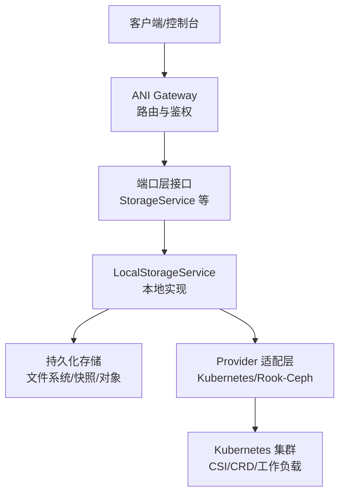
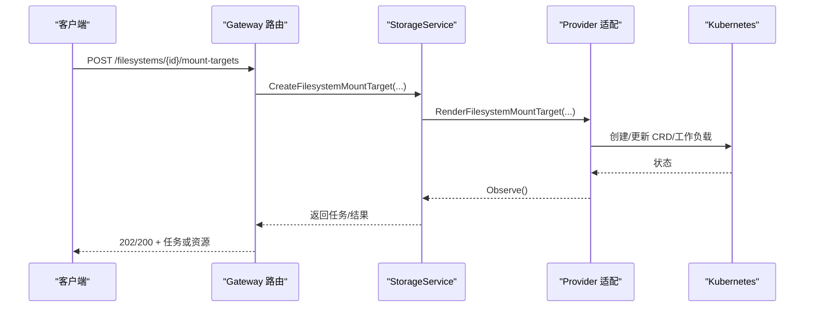
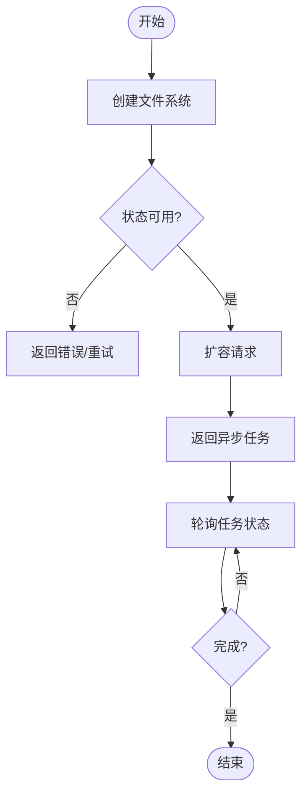
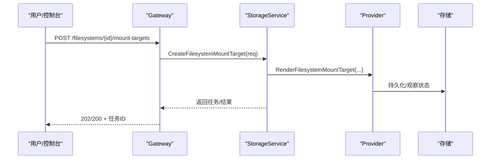
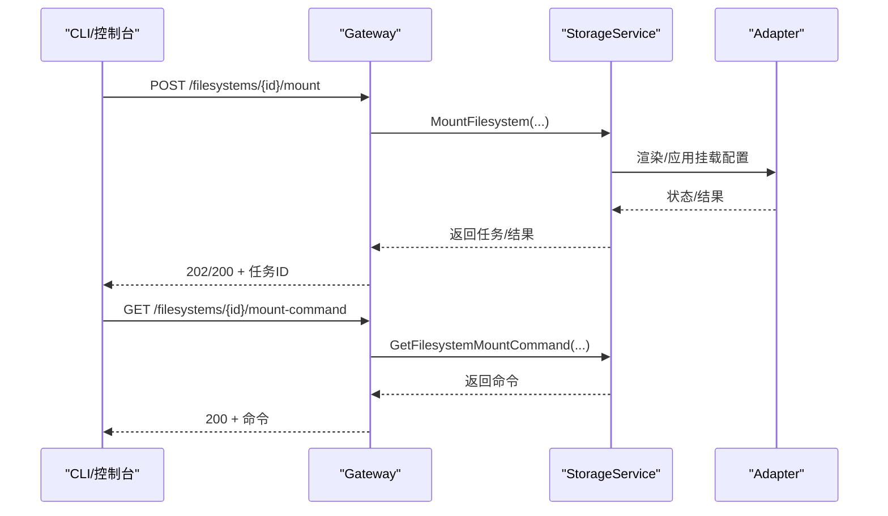
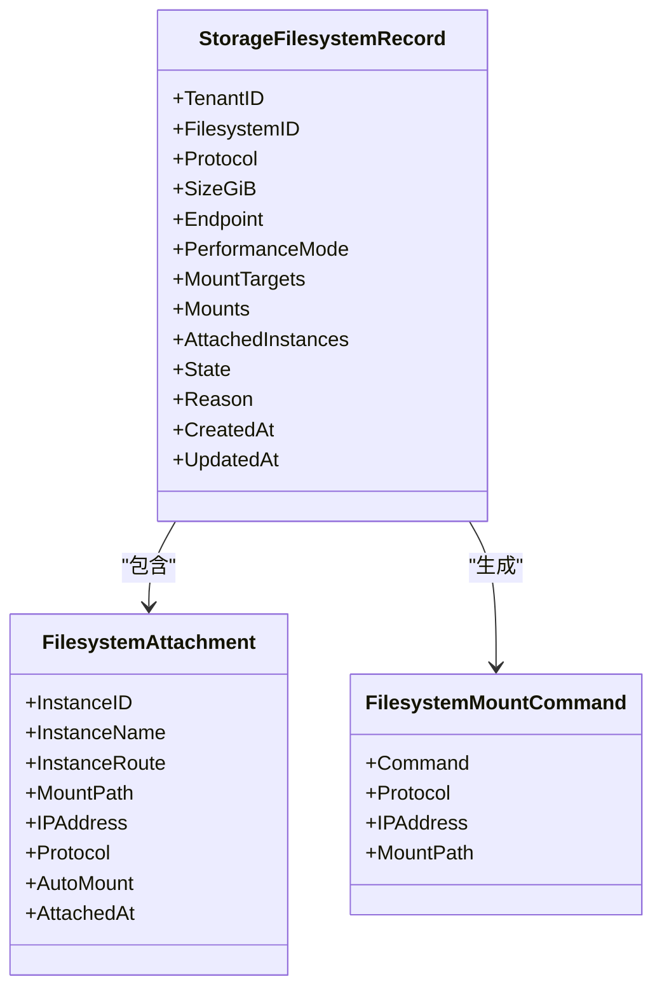
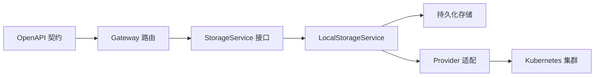

# 文件存储 API

<cite>
**本文引用的文件**
- [v1.yaml](file://repo/api/openapi/v1.yaml)
- [core-v1-compatibility-baseline.yaml](file://repo/api/core-v1-compatibility-baseline.yaml)
- [storage_resources.go（路由）](file://repo/services/ani-gateway/internal/router/storage_resources.go)
- [storage_runtime.go（运行时装配）](file://repo/services/ani-gateway/storage_runtime.go)
- [storage_resources.go（端口定义）](file://repo/pkg/ports/storage_resources.go)
- [storage_service.go（本地实现与命令生成）](file://repo/pkg/adapters/runtime/storage_service.go)
- [validate_storage_control_plane_state_live_gate.py（集成验证脚本）](file://repo/scripts/validate_storage_control_plane_state_live_gate.py)
</cite>

## 目录
1. [简介](#简介)
2. [项目结构](#项目结构)
3. [核心组件](#核心组件)
4. [架构总览](#架构总览)
5. [详细组件分析](#详细组件分析)
6. [依赖关系分析](#依赖关系分析)
7. [性能考虑](#性能考虑)
8. [故障排查指南](#故障排查指南)
9. [结论](#结论)
10. [附录](#附录)

## 简介
本文件面向“文件存储 API”，聚焦网络文件系统（NFS/CephFS）的创建、配置与管理，覆盖挂载目标（Mount Target）的创建、管理与状态监控；说明文件系统与实例的挂载、卸载操作，包括自动挂载配置与多实例共享访问；并给出性能模式、容量扩展、网络隔离等企业级特性的使用要点。同时提供挂载命令生成、故障排查指南与性能优化建议，帮助使用者高效、安全地管理 NFS/CephFS 资源。

## 项目结构
- API 契约：OpenAPI 规范定义了文件系统相关端点、请求/响应结构与权限范围。
- Gateway 路由：将 HTTP 请求映射到存储服务接口，处理参数绑定、错误封装与异步任务返回。
- 端口层（Ports）：定义文件系统、挂载目标、挂载命令等数据模型与服务接口。
- 适配器（Adapter）：本地实现与 Provider 适配（如 Kubernetes/Rook-Ceph），负责渲染、应用与状态观察。
- 集成验证：通过 Live Gate 脚本对控制面进行端到端验证，涵盖 Mount Target 创建与后续流程。

图表来源
- [storage_resources.go（路由）:700-787](file://repo/services/ani-gateway/internal/router/storage_resources.go#L700-L787)
- [storage_resources.go（端口定义）:487-534](file://repo/pkg/ports/storage_resources.go#L487-L534)
- [storage_service.go（本地实现与命令生成）:2203-2216](file://repo/pkg/adapters/runtime/storage_service.go#L2203-L2216)
- [storage_runtime.go（运行时装配）:110-141](file://repo/services/ani-gateway/storage_runtime.go#L110-L141)

章节来源
- [v1.yaml:1-39](file://repo/api/openapi/v1.yaml#L1-L39)
- [core-v1-compatibility-baseline.yaml:800-999](file://repo/api/core-v1-compatibility-baseline.yaml#L800-L999)

## 核心组件
- 文件系统（Filesystem）
  - 支持协议：nfs、cephfs
  - 能力：创建、删除、扩容、挂载/卸载、获取挂载命令、列出挂载目标
- 挂载目标（Mount Target）
  - 关联 VPC/子网，分配 IP，状态机：creating → available → deleting/error
- 挂载/卸载（Mount/Unmount）
  - 支持指定实例、路径、是否自动挂载；记录附加实例列表
- 挂载命令（Mount Command）
  - 根据协议自动生成 mount 命令，便于在实例中执行

章节来源
- [storage_resources.go（端口定义）:47-67](file://repo/pkg/ports/storage_resources.go#L47-L67)
- [storage_resources.go（端口定义）:250-272](file://repo/pkg/ports/storage_resources.go#L250-L272)
- [storage_resources.go（端口定义）:330-338](file://repo/pkg/ports/storage_resources.go#L330-L338)
- [storage_resources.go（端口定义）:437-460](file://repo/pkg/ports/storage_resources.go#L437-L460)
- [storage_resources.go（端口定义）:310-315](file://repo/pkg/ports/storage_resources.go#L310-L315)

## 架构总览
Gateway 暴露 REST 端点，调用 StorageService 接口；本地实现维护文件系统与挂载目标的内存/持久化状态，并在配置了 Provider 时渲染并应用到 Kubernetes（例如 Rook-Ceph CSI）。挂载命令由本地实现根据协议与 IP 动态生成。

图表来源
- [storage_resources.go（路由）:719-737](file://repo/services/ani-gateway/internal/router/storage_resources.go#L719-L737)
- [storage_service.go（本地实现与命令生成）:1897-1922](file://repo/pkg/adapters/runtime/storage_service.go#L1897-L1922)
- [storage_runtime.go（运行时装配）:110-141](file://repo/services/ani-gateway/storage_runtime.go#L110-L141)

## 详细组件分析

### 文件系统生命周期与扩容
- 创建：POST /filesystems，请求体包含名称、协议、大小、可用区、性能模式等。
- 查询/删除：GET/DELETE /filesystems/{filesystem_id}
- 扩容：POST /filesystems/{filesystem_id}/expand，提交新容量，返回异步任务。

图表来源
- [core-v1-compatibility-baseline.yaml:800-906](file://repo/api/core-v1-compatibility-baseline.yaml#L800-L906)
- [storage_resources.go（路由）:700-717](file://repo/services/ani-gateway/internal/router/storage_resources.go#L700-L717)

章节来源
- [core-v1-compatibility-baseline.yaml:800-906](file://repo/api/core-v1-compatibility-baseline.yaml#L800-L906)
- [storage_resources.go（路由）:700-717](file://repo/services/ani-gateway/internal/router/storage_resources.go#L700-L717)

### 挂载目标（Mount Target）管理
- 创建：POST /filesystems/{filesystem_id}/mount-targets，需传入幂等键、子网 ID、VPC ID。
- 列表：GET /filesystems/{filesystem_id}/mount-targets，分页返回。
- 状态：creating → available → deleting/error，可通过列表或观察接口查看。

图表来源
- [core-v1-compatibility-baseline.yaml:955-999](file://repo/api/core-v1-compatibility-baseline.yaml#L955-L999)
- [storage_resources.go（路由）:719-737](file://repo/services/ani-gateway/internal/router/storage_resources.go#L719-L737)
- [storage_service.go（本地实现与命令生成）:1897-1922](file://repo/pkg/adapters/runtime/storage_service.go#L1897-L1922)

章节来源
- [core-v1-compatibility-baseline.yaml:955-999](file://repo/api/core-v1-compatibility-baseline.yaml#L955-L999)
- [storage_resources.go（路由）:719-737](file://repo/services/ani-gateway/internal/router/storage_resources.go#L719-L737)
- [storage_service.go（本地实现与命令生成）:1897-1922](file://repo/pkg/adapters/runtime/storage_service.go#L1897-L1922)

### 文件系统挂载与卸载
- 挂载：POST /filesystems/{filesystem_id}/mount，支持实例 ID、实例路由、挂载路径、是否自动挂载。
- 卸载：POST /filesystems/{filesystem_id}/unmount，指定实例以移除挂载关系。
- 挂载命令：GET /filesystems/{filesystem_id}/mount-command，返回可在实例内执行的命令。

图表来源
- [core-v1-compatibility-baseline.yaml:907-948](file://repo/api/core-v1-compatibility-baseline.yaml#L907-L948)
- [storage_resources.go（路由）:739-787](file://repo/services/ani-gateway/internal/router/storage_resources.go#L739-L787)
- [storage_service.go（本地实现与命令生成）:2203-2216](file://repo/pkg/adapters/runtime/storage_service.go#L2203-L2216)

章节来源
- [core-v1-compatibility-baseline.yaml:907-948](file://repo/api/core-v1-compatibility-baseline.yaml#L907-L948)
- [storage_resources.go（路由）:739-787](file://repo/services/ani-gateway/internal/router/storage_resources.go#L739-L787)
- [storage_service.go（本地实现与命令生成）:2203-2216](file://repo/pkg/adapters/runtime/storage_service.go#L2203-L2216)

### 多实例共享访问与自动挂载
- 多实例共享：同一文件系统可被多个实例挂载，服务会维护 AttachedInstances 列表与挂载计数。
- 自动挂载：挂载请求支持 AutoMount 标志，用于在实例启动时自动执行挂载命令。
- 命令生成：根据协议（nfs/cephfs）与 IP 自动生成 mount 命令，便于自动化部署。

图表来源
- [storage_resources.go（端口定义）:47-67](file://repo/pkg/ports/storage_resources.go#L47-L67)
- [storage_resources.go（端口定义）:300-315](file://repo/pkg/ports/storage_resources.go#L300-L315)
- [storage_service.go（本地实现与命令生成）:2203-2216](file://repo/pkg/adapters/runtime/storage_service.go#L2203-L2216)

章节来源
- [storage_resources.go（端口定义）:47-67](file://repo/pkg/ports/storage_resources.go#L47-L67)
- [storage_resources.go（端口定义）:300-315](file://repo/pkg/ports/storage_resources.go#L300-L315)
- [storage_service.go（本地实现与命令生成）:2203-2216](file://repo/pkg/adapters/runtime/storage_service.go#L2203-L2216)

### 企业级特性：性能模式、容量扩展、网络隔离
- 性能模式：创建文件系统时可指定性能模式，影响底层存储行为（例如 IOPS/吞吐策略）。
- 容量扩展：通过扩容接口在线调整文件系统大小，避免停机。
- 网络隔离：Mount Target 创建需指定 VPC/子网，确保存储流量在租户网络平面内隔离。

章节来源
- [storage_resources.go（端口定义）:330-338](file://repo/pkg/ports/storage_resources.go#L330-L338)
- [core-v1-compatibility-baseline.yaml:882-906](file://repo/api/core-v1-compatibility-baseline.yaml#L882-L906)
- [core-v1-compatibility-baseline.yaml:955-999](file://repo/api/core-v1-compatibility-baseline.yaml#L955-L999)

## 依赖关系分析
- Gateway 路由依赖 StorageService 接口，解耦具体实现。
- StorageService 本地实现依赖持久化存储与 Provider 适配层。
- Provider 适配层对接 Kubernetes，渲染并应用 CSI/CRD 等资源。
- OpenAPI 契约约束了所有对外端点的行为与权限范围。

图表来源
- [v1.yaml:1-39](file://repo/api/openapi/v1.yaml#L1-L39)
- [storage_resources.go（路由）:700-787](file://repo/services/ani-gateway/internal/router/storage_resources.go#L700-L787)
- [storage_resources.go（端口定义）:487-534](file://repo/pkg/ports/storage_resources.go#L487-L534)
- [storage_runtime.go（运行时装配）:110-141](file://repo/services/ani-gateway/storage_runtime.go#L110-L141)

章节来源
- [v1.yaml:1-39](file://repo/api/openapi/v1.yaml#L1-L39)
- [storage_resources.go（路由）:700-787](file://repo/services/ani-gateway/internal/router/storage_resources.go#L700-L787)
- [storage_resources.go（端口定义）:487-534](file://repo/pkg/ports/storage_resources.go#L487-L534)
- [storage_runtime.go（运行时装配）:110-141](file://repo/services/ani-gateway/storage_runtime.go#L110-L141)

## 性能考虑
- 选择合适性能模式：根据业务 I/O 特征选择高性能或高吞吐模式，避免过度配置或不足。
- 合理规划容量：提前评估增长趋势，利用扩容接口平滑扩展，减少停机风险。
- 网络隔离与带宽：为存储流量划分独立网络平面，限制跨网段访问，降低延迟与抖动。
- 多实例共享：谨慎设计挂载拓扑，避免热点集中导致单点瓶颈。
- 监控与告警：结合平台观测能力，关注挂载目标状态、I/O 指标与错误率。

[本节为通用指导，不直接分析具体文件]

## 故障排查指南
- 常见错误码：400/401/403/404/409/422，分别对应参数错误、未授权、禁止、不存在、冲突、校验失败。
- 幂等性：所有写操作均支持 idempotency_key，重复请求不会造成副作用。
- 任务状态：扩容、挂载等操作返回异步任务，需轮询任务状态直至完成。
- 日志与证据：可使用 Live Gate 脚本复现问题并收集证据，辅助定位。

章节来源
- [core-v1-compatibility-baseline.yaml:800-999](file://repo/api/core-v1-compatibility-baseline.yaml#L800-L999)
- [validate_storage_control_plane_state_live_gate.py:402-436](file://repo/scripts/validate_storage_control_plane_state_live_gate.py#L402-L436)

## 结论
文件存储 API 提供了完整的 NFS/CephFS 管理能力，涵盖文件系统创建、扩容、挂载目标管理、挂载/卸载与命令生成。通过 Provider 适配层与 Kubernetes 集成，实现了企业级的网络隔离、性能模式与容量扩展。配合幂等性与异步任务机制，保障操作的可靠性与可观测性。建议在生产环境中结合监控与自动化脚本，持续优化性能与稳定性。

[本节为总结，不直接分析具体文件]

## 附录
- 常用端点速查
  - 文件系统列表/创建：GET/POST /filesystems
  - 文件系统详情/删除：GET/DELETE /filesystems/{filesystem_id}
  - 扩容：POST /filesystems/{filesystem_id}/expand
  - 挂载/卸载：POST /filesystems/{filesystem_id}/mount, POST /filesystems/{filesystem_id}/unmount
  - 挂载命令：GET /filesystems/{filesystem_id}/mount-command
  - 挂载目标：POST/GET /filesystems/{filesystem_id}/mount-targets

章节来源
- [core-v1-compatibility-baseline.yaml:800-999](file://repo/api/core-v1-compatibility-baseline.yaml#L800-L999)