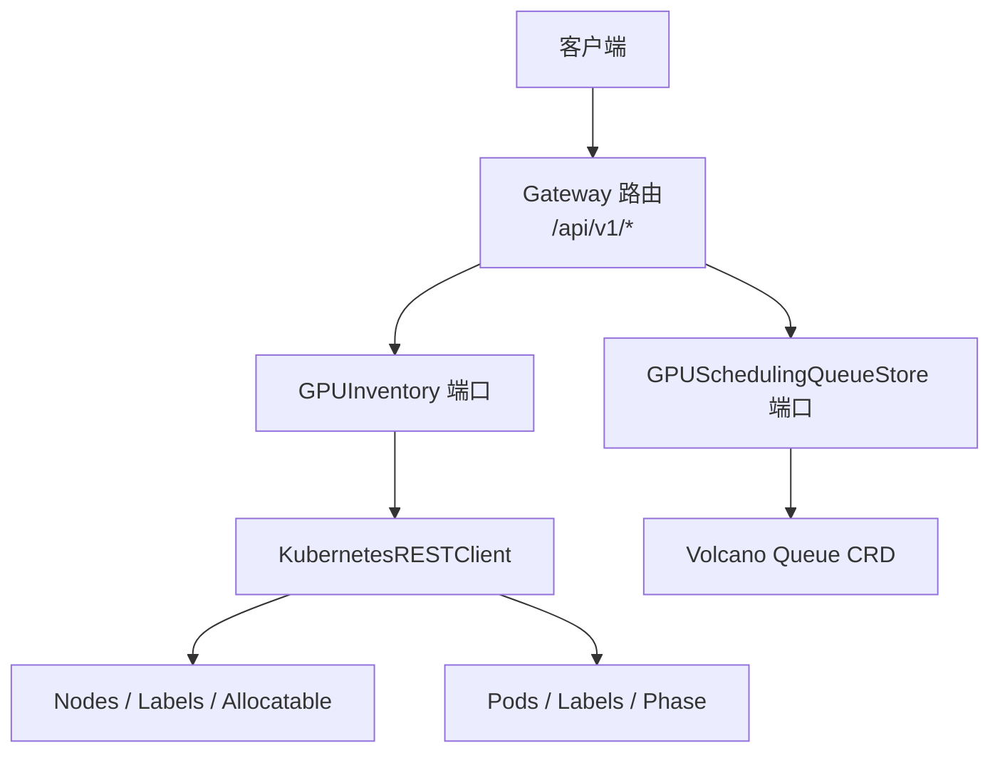
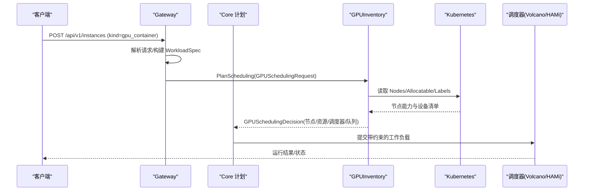
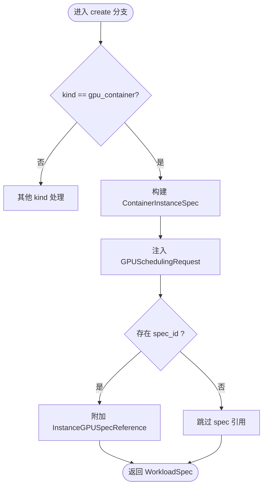
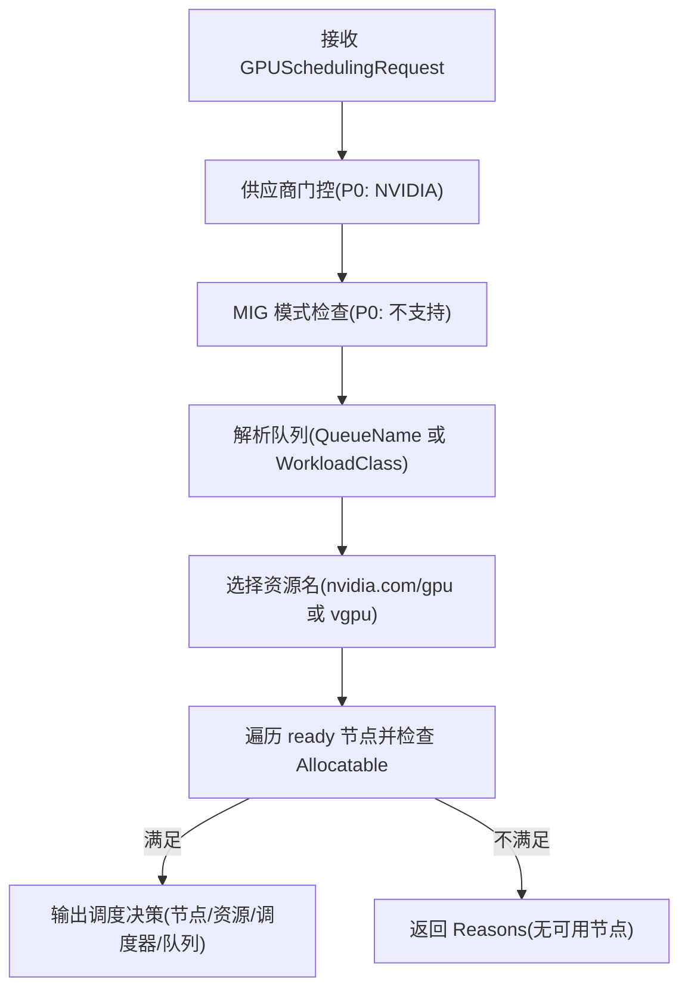
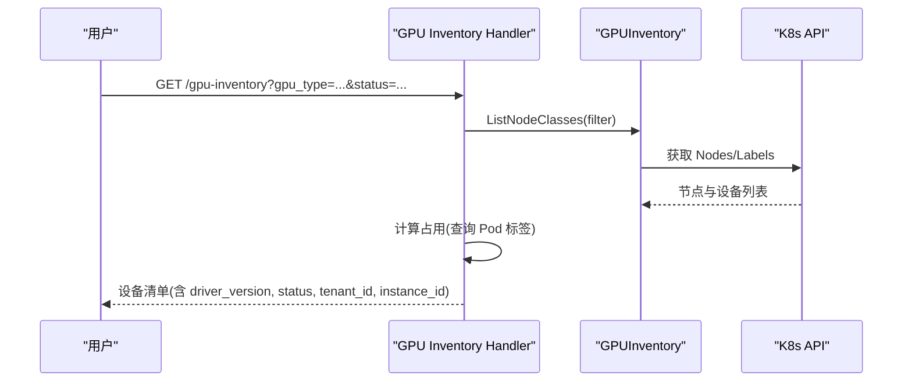
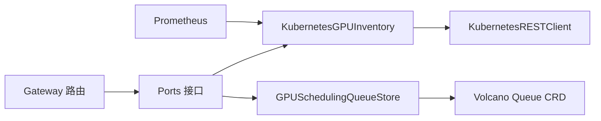

# GPU 实例 API

<cite>
**本文引用的文件**
- [v1.yaml](file://repo/api/openapi/v1.yaml)
- [gpu_inventory.go](file://repo/pkg/ports/gpu_inventory.go)
- [gpu_scheduling.go](file://repo/pkg/ports/gpu_scheduling.go)
- [kubernetes_gpu_inventory.go](file://repo/pkg/adapters/runtime/kubernetes_gpu_inventory.go)
- [instances.go](file://services/ani-gateway/internal/router/instances.go)
- [gpu_inventory_resources.go](file://services/ani-gateway/internal/router/gpu_inventory_resources.go)
- [gpu_scheduling_resources.go](file://services/ani-gateway/internal/router/gpu_scheduling_resources.go)
- [prd-k8s-gpu-hami-volcano-scheduling.md](file://repo/services/tasks/modules/prd/console/gpu-inventory/prd-k8s-gpu-hami-volcano-scheduling.md)
- [plan-instance-observability.md](file://repo/services/tasks/modules/plan/plan-instance-observability.md)
</cite>

## 目录
1. [简介](#简介)
2. [项目结构](#项目结构)
3. [核心组件](#核心组件)
4. [架构总览](#架构总览)
5. [详细组件分析](#详细组件分析)
6. [依赖关系分析](#依赖关系分析)
7. [性能与调度特性](#性能与调度特性)
8. [故障排查指南](#故障排查指南)
9. [结论](#结论)
10. [附录：API 参考](#附录api-参考)

## 简介
本文件面向“GPU 实例管理”的对外 API，覆盖两类支持 GPU 加速的实例类型：VM + GPU、Container + GPU。文档聚焦以下能力：
- 实例创建与管理（含 GPU 规格选择、显存配置、多卡绑定）
- 调度与队列（Volcano/HAMi 集成、工作负载分类）
- NUMA/拓扑优化（节点标签、调度器选择、运行时类）
- 监控指标（DCGM/Prometheus）、驱动版本、CUDA 环境信息
- 故障检测、热插拔与共享策略（MIG/vGPU）

说明：本仓库中 VM 实例管理已具备基础生命周期；GPU 相关能力以 Container + GPU 为主，并通过调度层抽象为统一的 GPU 资源请求。VM + GPU 在调度层可复用相同 GPU 规划接口，但具体 Provider 适配不在本仓库实现范围内。

## 项目结构
围绕 GPU 实例管理的代码主要分布在如下位置：
- OpenAPI 契约：定义实例、GPU 规格、调度队列等数据结构与错误格式
- Ports 接口：定义 GPU 发现、调度决策、队列存储等跨服务边界
- Gateway Router：暴露 REST 端点，处理鉴权、参数校验、错误映射
- Adapter：对接 Kubernetes（Node、Pod、Label、Scheduler、RuntimeClass）
- PRD/Plan：描述产品目标、验收标准与观测方案

图示来源
- [gpu_inventory_resources.go:153-159](file://services/ani-gateway/internal/router/gpu_inventory_resources.go#L153-L159)
- [gpu_scheduling_resources.go:57-64](file://services/ani-gateway/internal/router/gpu_scheduling_resources.go#L57-L64)
- [kubernetes_gpu_inventory.go:54-73](file://repo/pkg/adapters/runtime/kubernetes_gpu_inventory.go#L54-L73)

章节来源
- [v1.yaml:1-40](file://repo/api/openapi/v1.yaml#L1-L40)
- [gpu_inventory_resources.go:153-159](file://services/ani-gateway/internal/router/gpu_inventory_resources.go#L153-L159)
- [gpu_scheduling_resources.go:57-64](file://services/ani-gateway/internal/router/gpu_scheduling_resources.go#L57-L64)

## 核心组件
- GPU 设备与节点抽象
  - GPUDeviceClass/GPUNodeClass：描述厂商、型号、显存、虚拟化模式、驱动版本、能力、节点标签/污点/就绪状态等
  - GPUDiscoveryFilter：按厂商、池、标签过滤节点
- GPU 规格与可用性
  - GPUSpec/GPUSpecAvailability：规格 ID、名称、显存总量、切片数、每片大小、可用性与空闲设备计数
- GPU 调度请求与决策
  - GPUSchedulingRequest：租户/工作负载标识、偏好厂商/型号、所需显存/数量、虚拟化模式、能力、池、队列与工作负载分类
  - GPUSchedulingDecision：节点选择器、容忍、资源名/数量、运行时类、调度器、队列、原因、实际选中节点型号
- 队列存储
  - GPUSchedulingQueueStore：队列 CRUD、幂等、平台默认保护、租户隔离

章节来源
- [gpu_inventory.go:22-172](file://repo/pkg/ports/gpu_inventory.go#L22-L172)
- [gpu_scheduling.go:18-83](file://repo/pkg/ports/gpu_scheduling.go#L18-L83)

## 架构总览
GPU 实例创建与调度的端到端流程：
- 客户端通过 /api/v1/instances 提交 kind=gpu_container 的请求
- Gateway 将请求转换为 WorkloadSpec，并填充 Resources.GPU（GPUSchedulingRequest）
- Core 调用 GPUInventory.PlanScheduling 进行调度规划
- Adapter 读取 Kubernetes Node/Allocatable/Labels，结合 Volcano/HAMi 规则输出调度约束
- Provider 根据决策生成 Pod 等资源并调度到目标节点

图示来源
- [instances.go:2693-2712](file://services/ani-gateway/internal/router/instances.go#L2693-L2712)
- [kubernetes_gpu_inventory.go:92-173](file://repo/pkg/adapters/runtime/kubernetes_gpu_inventory.go#L92-L173)

章节来源
- [instances.go:2693-2712](file://services/ani-gateway/internal/router/instances.go#L2693-L2712)
- [kubernetes_gpu_inventory.go:92-173](file://repo/pkg/adapters/runtime/kubernetes_gpu_inventory.go#L92-L173)

## 详细组件分析

### 实例创建与 GPU 资源注入
- 当 kind=gpu_container 时，Gateway 会构造容器规格，并在 Resources.GPU 中注入调度请求：
  - PreferredVendors：默认 nvidia
  - PreferredModels：默认 A100
  - RequiredCount：至少 1
  - 若存在 spec_id，则写入 InstanceGPUSpecReference（包含 GPUType、Shares、MBPerShare）
- 未提供命令时默认 sleep infinity，便于调试

图示来源
- [instances.go:2693-2712](file://services/ani-gateway/internal/router/instances.go#L2693-L2712)

章节来源
- [instances.go:2693-2712](file://services/ani-gateway/internal/router/instances.go#L2693-L2712)

### GPU 调度算法与队列选择
- 供应商门控：P0 仅 NVIDIA；昇腾/海光拒绝并返回 Reasons
- MIG 模式：P0 不支持，拒绝并返回 Reasons
- 队列解析：
  - 显式 QueueName：校验属于当前租户
  - 空 QueueName：按 WorkloadClass 选择默认队列（inference→ani-inference；training/batch→ani-training）
- 资源名选择：
  - vGPU 模式：优先 nvidia.com/vgpu；若节点由 HAMi 管理且报告 vGPU 切片，则使用 nvidia.com/gpu
  - 整卡模式：nvidia.com/gpu
- 节点匹配：遍历 ready 节点，检查 Allocatable 是否满足 RequiredCount
- 调度器选择：HAMi 节点使用 hami-scheduler，否则 volcano
- 无可用节点：返回 Decision 并携带 Reasons，上层映射为 422

图示来源
- [kubernetes_gpu_inventory.go:92-173](file://repo/pkg/adapters/runtime/kubernetes_gpu_inventory.go#L92-L173)
- [kubernetes_gpu_inventory.go:175-194](file://repo/pkg/adapters/runtime/kubernetes_gpu_inventory.go#L175-L194)

章节来源
- [kubernetes_gpu_inventory.go:92-173](file://repo/pkg/adapters/runtime/kubernetes_gpu_inventory.go#L92-L173)
- [kubernetes_gpu_inventory.go:175-194](file://repo/pkg/adapters/runtime/kubernetes_gpu_inventory.go#L175-L194)

### GPU 清单与占用视图
- GET /gpu-inventory：列出节点与设备，支持按 gpu_type/status/node_name 过滤
- GET /gpu-inventory/occupancy：汇总 total/in_use/available/fault，并按 GPU 类型分桶
- 占用归属：基于 K8s Pod 标签 ani.kubercloud.io/instance 与 nodeName 反查，标记 in_use 并回填 tenant_id/instance_id
- 驱动版本：从设备元数据读取 DriverVersion（如 nvidia.com/cuda.driver.major）

图示来源
- [gpu_inventory_resources.go:193-211](file://services/ani-gateway/internal/router/gpu_inventory_resources.go#L193-L211)
- [gpu_inventory_resources.go:325-357](file://services/ani-gateway/internal/router/gpu_inventory_resources.go#L325-L357)
- [gpu_inventory_resources.go:379-435](file://services/ani-gateway/internal/router/gpu_inventory_resources.go#L379-L435)

章节来源
- [gpu_inventory_resources.go:193-211](file://services/ani-gateway/internal/router/gpu_inventory_resources.go#L193-L211)
- [gpu_inventory_resources.go:325-357](file://services/ani-gateway/internal/router/gpu_inventory_resources.go#L325-L357)
- [gpu_inventory_resources.go:379-435](file://services/ani-gateway/internal/router/gpu_inventory_resources.go#L379-L435)

### GPU 规格与切片
- 规格生成：基于节点设备聚合出规格 ID、名称、显存总量、切片数、每片大小
- 可用性：结合节点 Ready 状态与空闲设备计数，给出 available/full/device_full/unavailable
- 切片场景：vGPU 模式下按 Shares/MBPerShare 表达切分粒度

章节来源
- [gpu_inventory.go:70-90](file://repo/pkg/ports/gpu_inventory.go#L70-L90)
- [gpu_inventory.go:128-172](file://repo/pkg/ports/gpu_inventory.go#L128-L172)
- [gpu_spec_service.go:54-83](file://repo/pkg/adapters/runtime/gpu_spec_service.go#L54-L83)

### GPU 队列管理 API
- GET /gpu-scheduling/queues：列出租户队列
- POST /gpu-scheduling/queues：创建队列（需 Idempotency-Key）
- GET /gpu-scheduling/queues/:id：获取队列
- PATCH /gpu-scheduling/queues/:id：更新队列（需 Idempotency-Key）
- DELETE /gpu-scheduling/queues/:id：删除队列（平台默认队列受保护）

章节来源
- [gpu_scheduling_resources.go:57-64](file://services/ani-gateway/internal/router/gpu_scheduling_resources.go#L57-L64)
- [gpu_scheduling_resources.go:66-225](file://services/ani-gateway/internal/router/gpu_scheduling_resources.go#L66-L225)
- [gpu_scheduling.go:18-83](file://repo/pkg/ports/gpu_scheduling.go#L18-L83)

### 监控指标、驱动版本与 CUDA 环境
- 指标来源：DCGM Exporter 暴露 DCGM_FI_DEV_GPU_UTIL、DCGM_FI_DEV_FB_USED、DCGM_FI_DEV_FB_FREE
- Prometheus scrape：新增 dcgm-exporter job，采集指标供 adapter 查询
- 指标换算：真实 DCGM 不暴露 FB_TOTAL，adapter 使用 FB_FREE + FB_USED 推导总显存（单位 MiB）
- 驱动/CUDA：设备元数据中包含 DriverVersion；RuntimeVersion 来自 Kubelet 版本
- 观测路径：handler 透传 Kind=gpu_container，adapter 走 GPU 分支拉取指标

章节来源
- [plan-instance-observability.md:62-104](file://repo/services/tasks/modules/plan/plan-instance-observability.md#L62-L104)
- [plan-instance-observability.md:106-118](file://repo/services/tasks/modules/plan/plan-instance-observability.md#L106-L118)

### NUMA 拓扑与多卡绑定
- 节点级拓扑：通过 Node 标签与 Allocatable 反映 GPU 能力；Adapter 识别整卡与 vGPU
- 多卡绑定：RequiredCount > 1 时，调度器尝试在同一节点分配多张卡（或 vGPU 切片）
- 拓扑优化：
  - 节点选择器：固定 nodeName 与自定义标签
  - 容忍：Tolerations 用于亲和/排异
  - 运行时类：根据节点是否由 HAMi 管理选择 runtimeClassName
  - 调度器：volcano 或 hami-scheduler

章节来源
- [kubernetes_gpu_inventory.go:127-159](file://repo/pkg/adapters/runtime/kubernetes_gpu_inventory.go#L127-L159)
- [kubernetes_gpu_inventory.go:175-194](file://repo/pkg/adapters/runtime/kubernetes_gpu_inventory.go#L175-L194)

### 故障检测、热插拔与共享策略
- 故障检测：
  - 节点 Ready=false → 设备状态 fault
  - 队列不存在/不可用 → 明确错误码
  - 无可用节点 → 返回 Reasons，上层 422
- 热插拔：
  - 节点状态变化会被 ListNodeClasses 感知；调度决策基于最新 Allocatable
  - 设备状态随节点/设备元数据更新而刷新
- 共享策略：
  - vGPU 模式：HAMi 切片，同一物理卡可承载多个 vGPU 实例
  - MIG：P0 不支持，拒绝并返回 Reasons
  - 共享策略字段：GPUSharingSpec/GPUSharingPolicy 可从节点标签派生（只读）

章节来源
- [gpu_inventory_resources.go:325-357](file://services/ani-gateway/internal/router/gpu_inventory_resources.go#L325-L357)
- [kubernetes_gpu_inventory.go:92-173](file://repo/pkg/adapters/runtime/kubernetes_gpu_inventory.go#L92-L173)
- [gpu_inventory.go:33-62](file://repo/pkg/ports/gpu_inventory.go#L33-L62)

## 依赖关系分析
- Gateway 路由依赖 ports 接口，解耦具体实现
- Adapter 依赖 KubernetesRESTClient 访问 Node/Pod/Label
- 队列存储依赖 Volcano Queue CRD（或通过本地 store 模拟）
- 观测依赖 Prometheus + DCGM Exporter

图示来源
- [gpu_inventory_resources.go:153-159](file://services/ani-gateway/internal/router/gpu_inventory_resources.go#L153-L159)
- [gpu_scheduling_resources.go:57-64](file://services/ani-gateway/internal/router/gpu_scheduling_resources.go#L57-L64)
- [kubernetes_gpu_inventory.go:54-73](file://repo/pkg/adapters/runtime/kubernetes_gpu_inventory.go#L54-L73)

章节来源
- [gpu_inventory_resources.go:153-159](file://services/ani-gateway/internal/router/gpu_inventory_resources.go#L153-L159)
- [gpu_scheduling_resources.go:57-64](file://services/ani-gateway/internal/router/gpu_scheduling_resources.go#L57-L64)
- [kubernetes_gpu_inventory.go:54-73](file://repo/pkg/adapters/runtime/kubernetes_gpu_inventory.go#L54-L73)

## 性能与调度特性
- 调度复杂度：遍历节点并检查 Allocatable，时间复杂度 O(N)，N 为节点数
- 缓存与分页：GPU 规格列表支持 limit/cursor；库存列表支持过滤与分页
- 队列优先级：inference 默认高优先级；training/batch 默认可 reclaim
- 多卡与 vGPU：RequiredCount 控制多卡；vGPU 模式提升资源利用率
- 指标采集：DCGM 指标采样频率影响监控延迟；Prometheus scrape 间隔需合理配置

[本节为通用指导，无需特定文件引用]

## 故障排查指南
- 创建失败 422：
  - 检查 PreferredModels/RequiredCount 是否满足节点 Allocatable
  - 检查队列是否存在且属于当前租户
  - 查看 Decision.Reasons 定位原因（供应商不支持、MIG 不支持、无可用节点）
- 设备状态异常：
  - 节点 Ready=false → 设备 fault；检查节点健康与驱动
  - 队列不可用 → 检查 Volcano Queue 状态
- 指标为空：
  - 确认 Prometheus 已配置 dcgm-exporter scrape
  - 确认 DCGM Exporter 可达且指标正常
  - 确认 handler 透传 Kind=gpu_container，adapter 走 GPU 分支

章节来源
- [gpu_scheduling_resources.go:246-261](file://services/ani-gateway/internal/router/gpu_scheduling_resources.go#L246-L261)
- [plan-instance-observability.md:62-104](file://repo/services/tasks/modules/plan/plan-instance-observability.md#L62-L104)

## 结论
本仓库实现了以 Kubernetes 为核心的 GPU 实例调度与观测体系：
- 通过统一端口抽象，屏蔽底层异构差异
- 以 Volcano/HAMi 实现队列与 vGPU 切片，支持推理/训练差异化调度
- 通过 DCGM+Prometheus 提供 GPU 利用率与显存指标
- 提供完整的 GPU 清单、占用视图与规格查询
- 对 MIG/非 NVIDIA 供应商进行 P0 限制，保留 P1 扩展空间

[本节为总结性内容，无需特定文件引用]

## 附录：API 参考

### 实例相关
- POST /api/v1/instances
  - 支持 kind=gpu_container
  - 请求体包含 GPU 规格引用或 legacy 字段（vendor/model/count）
  - 响应：202 AsyncTask（异步创建），Location 指向任务 URL
- GET /api/v1/instances/{id}
  - 返回实例详情，包含 GPU 摘要（spec_id、GPUType、Shares、MBPerShare）
- GET /api/v1/instances
  - 列表过滤/排序/cursor 分页

章节来源
- [v1.yaml:1-40](file://repo/api/openapi/v1.yaml#L1-L40)
- [instances.go:2693-2712](file://services/ani-gateway/internal/router/instances.go#L2693-L2712)

### GPU 清单与规格
- GET /api/v1/gpu-inventory
  - 查询参数：gpu_type、status、node_name
  - 返回：items（设备清单）、total、next_cursor
- GET /api/v1/gpu-inventory/occupancy
  - 返回：total、in_use、available、fault、by_gpu_type
- GET /api/v1/gpu-specs
  - 查询参数：gpu_type、available、limit、cursor
  - 返回：规格列表（ID、Name、GPUType、MemoryTotalMB、Shares、MBPerShare、Available）
- GET /api/v1/gpu-specs/{spec_id}
  - 返回：单个规格详情

章节来源
- [gpu_inventory_resources.go:153-159](file://services/ani-gateway/internal/router/gpu_inventory_resources.go#L153-L159)
- [gpu_inventory_resources.go:162-211](file://services/ani-gateway/internal/router/gpu_inventory_resources.go#L162-L211)

### GPU 队列管理
- GET /api/v1/gpu-scheduling/queues
  - 返回：租户队列列表
- POST /api/v1/gpu-scheduling/queues
  - 请求头：Idempotency-Key
  - 请求体：name、weight、reclaimable、workload_class、project_id
  - 响应：201 Created 或 409 Conflict（幂等回放）
- GET /api/v1/gpu-scheduling/queues/{id}
  - 返回：队列详情
- PATCH /api/v1/gpu-scheduling/queues/{id}
  - 请求头：Idempotency-Key
  - 请求体：可选字段 weight、reclaimable、workload_class、project_id
  - 响应：200 OK 或 409 Conflict（幂等回放）
- DELETE /api/v1/gpu-scheduling/queues/{id}
  - 响应：204 No Content（平台默认队列禁止删除）

章节来源
- [gpu_scheduling_resources.go:57-64](file://services/ani-gateway/internal/router/gpu_scheduling_resources.go#L57-L64)
- [gpu_scheduling_resources.go:88-225](file://services/ani-gateway/internal/router/gpu_scheduling_resources.go#L88-L225)

### 错误码与语义
- BAD_REQUEST：参数校验失败（缺少必填字段、非法值）
- NOT_FOUND：队列/规格不存在
- CONFLICT：队列名称冲突或幂等回放
- FORBIDDEN：缺失租户上下文或操作权限不足
- UNSUPPORTED：供应商/MIG 模式不支持（P0）
- INTERNAL_ERROR：内部错误

章节来源
- [gpu_scheduling_resources.go:246-261](file://services/ani-gateway/internal/router/gpu_scheduling_resources.go#L246-L261)
- [gpu_inventory_resources.go:487-500](file://services/ani-gateway/internal/router/gpu_inventory_resources.go#L487-L500)

### 监控与观测
- 指标：DCGM_FI_DEV_GPU_UTIL、DCGM_FI_DEV_FB_USED、DCGM_FI_DEV_FB_FREE
- 总显存：FB_FREE + FB_USED（MiB）
- 驱动版本：DriverVersion（来自节点/设备元数据）
- 运行时版本：RuntimeVersion（Kubelet 版本）

章节来源
- [plan-instance-observability.md:106-118](file://repo/services/tasks/modules/plan/plan-instance-observability.md#L106-L118)