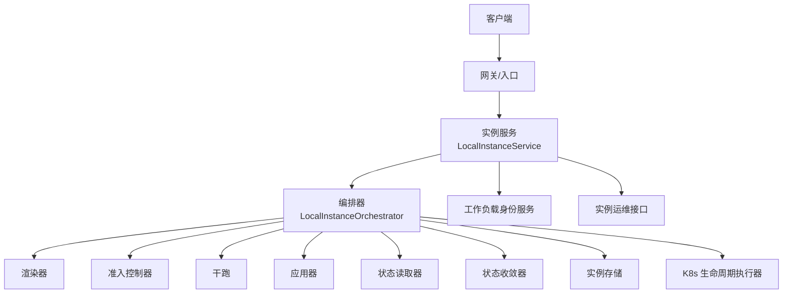
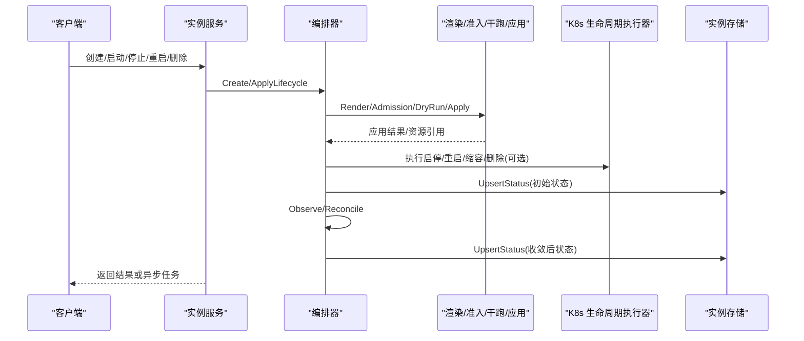
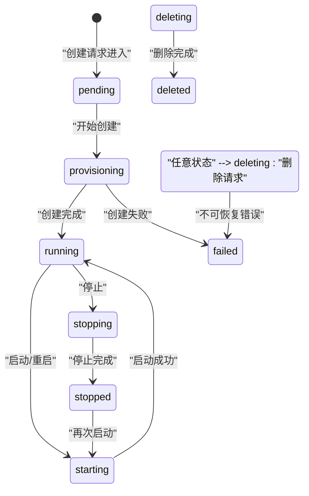
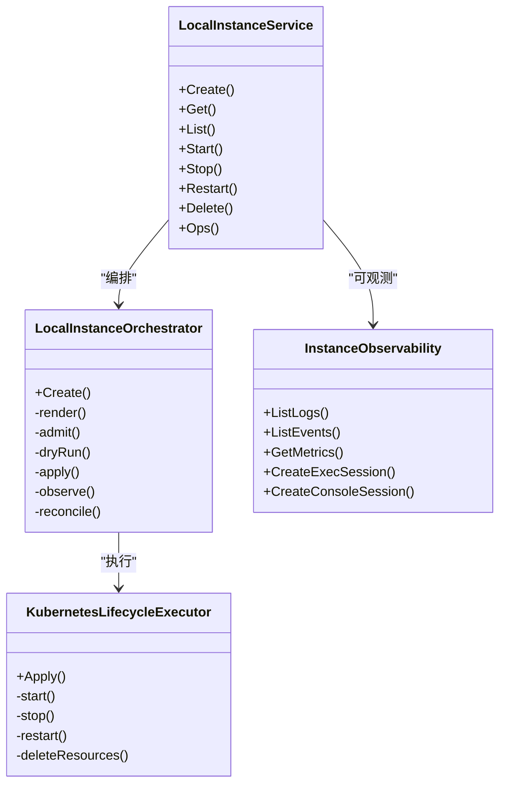

# 实例生命周期管理

<cite>
**本文引用的文件**
- [v1.yaml](file://repo/api/openapi/v1.yaml)
- [services v1.yaml](file://repo/api/openapi/services/v1.yaml)
- [instance_service.go](file://repo/pkg/adapters/runtime/instance_service.go)
- [instance_orchestrator.go](file://repo/pkg/adapters/runtime/instance_orchestrator.go)
- [kubernetes_lifecycle_executor.go](file://repo/pkg/adapters/runtime/kubernetes_lifecycle_executor.go)
- [instance_observability.go](file://repo/pkg/ports/instance_observability.go)
- [errors.go](file://repo/pkg/ports/errors.go)
</cite>

## 目录
1. [简介](#简介)
2. [项目结构](#项目结构)
3. [核心组件](#核心组件)
4. [架构总览](#架构总览)
5. [详细组件分析](#详细组件分析)
6. [依赖关系分析](#依赖关系分析)
7. [性能考虑](#性能考虑)
8. [故障排查指南](#故障排查指南)
9. [结论](#结论)
10. [附录](#附录)

## 简介
本文件面向“设备实例”的通用生命周期管理 API，覆盖所有实例类型（虚拟机、容器、GPU 容器、沙箱等）共用的状态机与转换规则，并说明批量操作接口、实例查询过滤、状态同步机制、健康检查、自动恢复、优雅停机、元数据与标签、命名空间隔离等能力。文档以仓库中的 OpenAPI 契约与运行时实现为依据，确保与系统实际行为一致。

## 项目结构
- API 契约层
  - Core 基础设施 API：定义异步任务、分页、错误格式、平台工作负载等通用模型与约束。
  - Services 业务 API：定义推理服务、知识库等业务资源的生命周期与状态。
- 运行时适配层
  - 实例服务：负责创建、查询、生命周期动作编排、存储绑定、身份绑定、审计记录。
  - 编排器：渲染期望、准入校验、干跑、应用、观察、收敛，持久化实例状态。
  - Kubernetes 生命周期执行器：对 K8s/KubeVirt 资源执行启停重启、缩容扩容、删除等。
  - 可观测性端口：日志、事件、指标、安全事件、Exec/Console 会话。
- 错误与边界
  - 统一错误码与语义，保障跨组件一致性。

**图表来源**
- [instance_service.go:90-294](file://repo/pkg/adapters/runtime/instance_service.go#L90-L294)
- [instance_orchestrator.go:76-206](file://repo/pkg/adapters/runtime/instance_orchestrator.go#L76-L206)
- [kubernetes_lifecycle_executor.go:46-87](file://repo/pkg/adapters/runtime/kubernetes_lifecycle_executor.go#L46-L87)

**章节来源**
- [v1.yaml:1-39](file://repo/api/openapi/v1.yaml#L1-L39)
- [services v1.yaml:1-128](file://repo/api/openapi/services/v1.yaml#L1-L128)

## 核心组件
- LocalInstanceService：统一的实例生命周期入口，封装创建、启动、停止、重启、调整规格、删除、快照、卷挂载/卸载、回滚等操作；支持幂等键、审计、身份绑定、存储绑定。
- LocalInstanceOrchestrator：将用户意图转换为 Provider 资源，执行渲染、准入、干跑、应用、观察与收敛，最终写入实例状态。
- KubernetesLifecycleExecutor：针对 K8s/KubeVirt 的具体生命周期执行，包括启停、重启、缩容扩容、删除资源。
- InstanceObservability：提供日志、事件、指标、安全事件、Exec/Console 会话的统一访问接口。

**章节来源**
- [instance_service.go:90-294](file://repo/pkg/adapters/runtime/instance_service.go#L90-L294)
- [instance_orchestrator.go:76-206](file://repo/pkg/adapters/runtime/instance_orchestrator.go#L76-L206)
- [kubernetes_lifecycle_executor.go:46-87](file://repo/pkg/adapters/runtime/kubernetes_lifecycle_executor.go#L46-L87)
- [instance_observability.go:127-136](file://repo/pkg/ports/instance_observability.go#L127-L136)

## 架构总览
实例生命周期由“请求→服务→编排→执行→观察→收敛→存储”的闭环构成。对外暴露的 REST API 通过 OpenAPI 契约进行版本化管理，内部通过 ports 接口解耦不同 Provider 的实现。

**图表来源**
- [instance_service.go:90-294](file://repo/pkg/adapters/runtime/instance_service.go#L90-L294)
- [instance_orchestrator.go:76-206](file://repo/pkg/adapters/runtime/instance_orchestrator.go#L76-L206)
- [kubernetes_lifecycle_executor.go:46-87](file://repo/pkg/adapters/runtime/kubernetes_lifecycle_executor.go#L46-L87)

## 详细组件分析

### 实例状态机与转换规则
- 通用状态集合
  - pending：等待调度或前置准备
  - provisioning：正在创建/配置资源
  - starting：正在启动
  - running：运行中
  - stopping：正在停止
  - stopped：已停止
  - failed：失败
  - deleting：正在删除
  - deleted：已删除
- 典型转换路径
  - 创建：pending → provisioning → running（或 failing → failed）
  - 启动：stopping/stopped/pending → starting → running
  - 停止：running → stopping → stopped
  - 重启：running → stopping → started → running
  - 删除：任意非 terminal → deleting → deleted
  - 异常：任何中间态 → failed（需人工或自动恢复）
- 状态来源
  - 编排器在应用后调用观察器获取 Provider 真实状态，再经收敛器计算最终状态并落库。
  - 容器类实例的健康就绪映射到 rollout 状态（healthy/progressing/degraded/pending）。

**图表来源**
- [instance_orchestrator.go:421-432](file://repo/pkg/adapters/runtime/instance_orchestrator.go#L421-L432)
- [instance_orchestrator.go:474-487](file://repo/pkg/adapters/runtime/instance_orchestrator.go#L474-L487)

**章节来源**
- [instance_orchestrator.go:421-432](file://repo/pkg/adapters/runtime/instance_orchestrator.go#L421-L432)
- [instance_orchestrator.go:474-487](file://repo/pkg/adapters/runtime/instance_orchestrator.go#L474-L487)

### 批量操作接口
- 异步任务模型
  - 所有长耗时操作返回 AsyncTask，包含 idempotency_key、task_type、status、progress_pct、result/error_message 等字段。
  - 支持轮询 GET /api/v1/tasks/{task_id} 或配置 Webhook 回调。
- 支持的 task_type
  - 涵盖模型导入、知识库解析/索引、推理部署、平台工作负载扩缩容/启停/删除、卷/文件系统/向量库相关操作、沙箱检查点等。
- 使用建议
  - 客户端应基于 idempotency_key 重试，避免重复执行。
  - 通过 status 与 progress_pct 监控进度，completed/failed/cancelled/dead_letter 为终态。

**章节来源**
- [v1.yaml:351-373](file://repo/api/openapi/v1.yaml#L351-L373)

### 实例查询与过滤
- 列表接口
  - 支持按租户、实例类型、状态、关键词、创建时间范围、规格 ID、镜像 ID、节点名、容器滚动状态、GPU 型号/队列/调度状态、模板 ID、会话状态等过滤。
  - 排序支持 created_at_asc/desc、name_asc/desc。
  - 当前服务层未实现 cursor 分页，限制 limit 在 1–100。
- 单实例查询
  - 按 tenant_id + instance_id 精确获取，并附加工作负载身份信息。

**章节来源**
- [instance_service.go:518-625](file://repo/pkg/adapters/runtime/instance_service.go#L518-L625)

### 状态同步机制
- 观察与收敛
  - 编排器在应用成功后调用 Provider 状态读取器获取观察结果，交由收敛器结合期望与实际计算最终状态。
  - 最终状态写入实例存储，供查询与外部系统消费。
- 健康与就绪
  - 容器类实例根据运行状态映射 rollout 状态，辅助上层判断是否 ready。

**章节来源**
- [instance_orchestrator.go:176-206](file://repo/pkg/adapters/runtime/instance_orchestrator.go#L176-L206)
- [instance_orchestrator.go:421-432](file://repo/pkg/adapters/runtime/instance_orchestrator.go#L421-L432)

### 健康检查、自动恢复与优雅停机
- 健康检查
  - 平台工作负载可通过 health_check 指定 HTTP 路径与端口名称，用于判定 runtime 就绪。
- 自动恢复
  - 当实例处于 failed 或异常时，可通过重新触发生命周期动作（如 start/restart）或依赖外部控制器进行自愈。
- 优雅停机
  - 停止流程先置 stopping，待 Provider 确认后再转为 stopped；对于 K8s 资源通过缩容至 0 或调用 KubeVirt stop 子资源实现。

**章节来源**
- [v1.yaml:599-608](file://repo/api/openapi/v1.yaml#L599-L608)
- [kubernetes_lifecycle_executor.go:123-139](file://repo/pkg/adapters/runtime/kubernetes_lifecycle_executor.go#L123-L139)

### 实例元数据管理、标签系统与命名空间隔离
- 元数据与标签
  - 实例记录包含 name、description、labels、image、compute、network、access、storage_attachments、lifecycle、identity 等元信息。
  - labels 会被克隆保存，便于后续筛选与展示。
- 命名空间隔离
  - 生命周期执行器在删除资源时使用 tenantNamespace(record.TenantID) 作为目标命名空间，确保多租户隔离。
  - 工作负载身份绑定也携带 tenant_id，保证权限与作用域隔离。

**章节来源**
- [instance_orchestrator.go:238-264](file://repo/pkg/adapters/runtime/instance_orchestrator.go#L238-L264)
- [kubernetes_lifecycle_executor.go:89-106](file://repo/pkg/adapters/runtime/kubernetes_lifecycle_executor.go#L89-L106)

### 生命周期动作与执行细节
- 统一入口
  - Start/Stop/Restart/Resize/Delete/Snapshot/AttachVolume/DetachVolume/Rollback 均委托给 applyLifecycle。
- K8s 执行策略
  - 启动：VirtualMachine 调用 start 子资源；其他资源通过 scale 扩至 1。
  - 停止：VirtualMachine 调用 stop 子资源；其他资源缩容至 0。
  - 重启：VirtualMachine 先 stop 再 start；其他资源通过 Patch 注入重启标记。
  - 删除：遍历 ResourceRefs 逐个删除，忽略 NotFound。
- 幂等与冲突处理
  - 对 KubeVirt 启停冲突（already running/not running/halted）进行静默忽略，提升幂等性。

**章节来源**
- [instance_service.go:655-711](file://repo/pkg/adapters/runtime/instance_service.go#L655-L711)
- [kubernetes_lifecycle_executor.go:46-87](file://repo/pkg/adapters/runtime/kubernetes_lifecycle_executor.go#L46-L87)
- [kubernetes_lifecycle_executor.go:123-168](file://repo/pkg/adapters/runtime/kubernetes_lifecycle_executor.go#L123-L168)
- [kubernetes_lifecycle_executor.go:141-156](file://repo/pkg/adapters/runtime/kubernetes_lifecycle_executor.go#L141-L156)

### 可观测性与运维操作
- 日志、事件、指标与安全事件
  - 通过 InstanceObservability 接口统一获取，支持分页与过滤。
- Exec/Console 会话
  - 支持为容器/GPU 容器/沙箱创建 exec 会话，为 VM 创建 console 会话，返回连接信息与过期时间。
- 运维动作审计
  - 会话类操作会记录 Operation 步骤，便于追踪与审计。

**章节来源**
- [instance_observability.go:26-136](file://repo/pkg/ports/instance_observability.go#L26-L136)
- [instance_service.go:713-773](file://repo/pkg/adapters/runtime/instance_service.go#L713-L773)

## 依赖关系分析
- 组件耦合
  - 实例服务依赖编排器、存储、身份服务、资源解析、存储绑定、沙箱运行时、运维接口。
  - 编排器依赖运行时、渲染器、准入、审计、干跑、应用、状态读取、收敛器、存储、身份服务。
  - K8s 生命周期执行器依赖 REST 客户端与开关控制。
- 外部依赖
  - OpenAPI 契约定义异步任务、分页、错误格式，驱动上层 SDK 与前端交互。
  - 多租户通过 tenant_id 贯穿请求与存储，确保隔离。

**图表来源**
- [instance_service.go:23-80](file://repo/pkg/adapters/runtime/instance_service.go#L23-L80)
- [instance_orchestrator.go:12-74](file://repo/pkg/adapters/runtime/instance_orchestrator.go#L12-L74)
- [kubernetes_lifecycle_executor.go:16-44](file://repo/pkg/adapters/runtime/kubernetes_lifecycle_executor.go#L16-L44)
- [instance_observability.go:127-136](file://repo/pkg/ports/instance_observability.go#L127-L136)

**章节来源**
- [instance_service.go:23-80](file://repo/pkg/adapters/runtime/instance_service.go#L23-L80)
- [instance_orchestrator.go:12-74](file://repo/pkg/adapters/runtime/instance_orchestrator.go#L12-L74)
- [kubernetes_lifecycle_executor.go:16-44](file://repo/pkg/adapters/runtime/kubernetes_lifecycle_executor.go#L16-L44)
- [instance_observability.go:127-136](file://repo/pkg/ports/instance_observability.go#L127-L136)

## 性能考虑
- 批量化与异步化
  - 长耗时操作统一走 AsyncTask，降低请求阻塞，提高吞吐。
- 限流与分页
  - 列表接口限制 limit≤100，避免大结果集拖垮后端。
- 幂等与重试
  - 通过 idempotency_key 与任务状态，支持客户端安全重试。
- 资源收敛
  - 观察+收敛模式减少频繁写库，仅在状态变化时持久化。

[本节为通用指导，不直接分析具体文件]

## 故障排查指南
- 常见错误码
  - UNAUTHORIZED/FORBIDDEN/NOT_FOUND/CONFLICT/BAD_REQUEST/RATE_LIMIT_EXCEEDED/NOT_IMPLEMENTED/INTERNAL_ERROR。
  - 预检失败、配额超限、依赖不可用等专用错误。
- 定位步骤
  - 查看 AsyncTask 的 status、error_message、progress_pct。
  - 检查实例状态与 reason/message，确认是否卡在 provisioning/starting/stopping。
  - 通过可观测性接口拉取日志、事件、指标，定位底层 Provider 问题。
  - 若为 K8s 生命周期冲突（如 already running），确认执行器是否正确忽略冲突。
- 恢复建议
  - 对 failed 实例尝试 restart/start；对 stuck 的删除操作检查 ResourceRefs 是否全部清理。

**章节来源**
- [v1.yaml:28-31](file://repo/api/openapi/v1.yaml#L28-L31)
- [errors.go:5-24](file://repo/pkg/ports/errors.go#L5-L24)
- [kubernetes_lifecycle_executor.go:141-156](file://repo/pkg/adapters/runtime/kubernetes_lifecycle_executor.go#L141-L156)

## 结论
本方案以 OpenAPI 契约为基础，结合运行时服务、编排器与 K8s 生命周期执行器，提供了跨实例类型的统一生命周期管理能力。通过状态机、异步任务、可观测性与多租户隔离，满足批量操作、查询过滤、健康检查、自动恢复与优雅停机等关键需求。建议在集成时严格遵循幂等键、任务轮询与错误码约定，以获得稳定一致的体验。

## 附录
- 术语
  - 实例：VM/Container/GPU Container/Sandbox 等可被编排的资源实体。
  - 任务：异步执行的逻辑单元，承载进度与结果。
  - 收敛：将 Provider 观察到的真实状态与期望状态合并得到最终状态的过程。
- 参考
  - 平台工作负载健康检查、生命周期动作、日志与分页均在 OpenAPI 中有明确定义。

[本节为概念性补充，不直接分析具体文件]