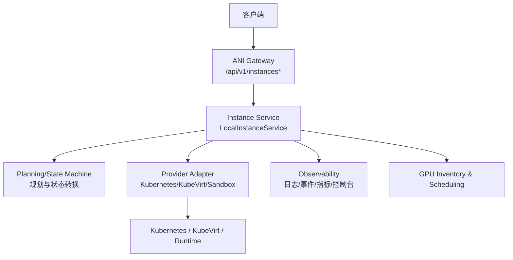
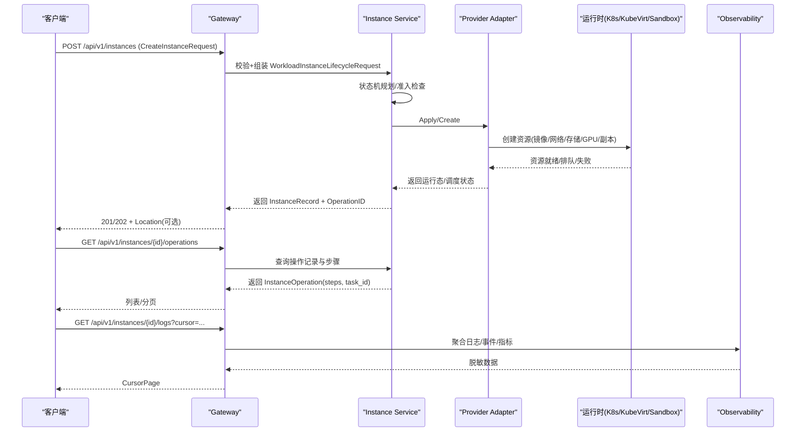
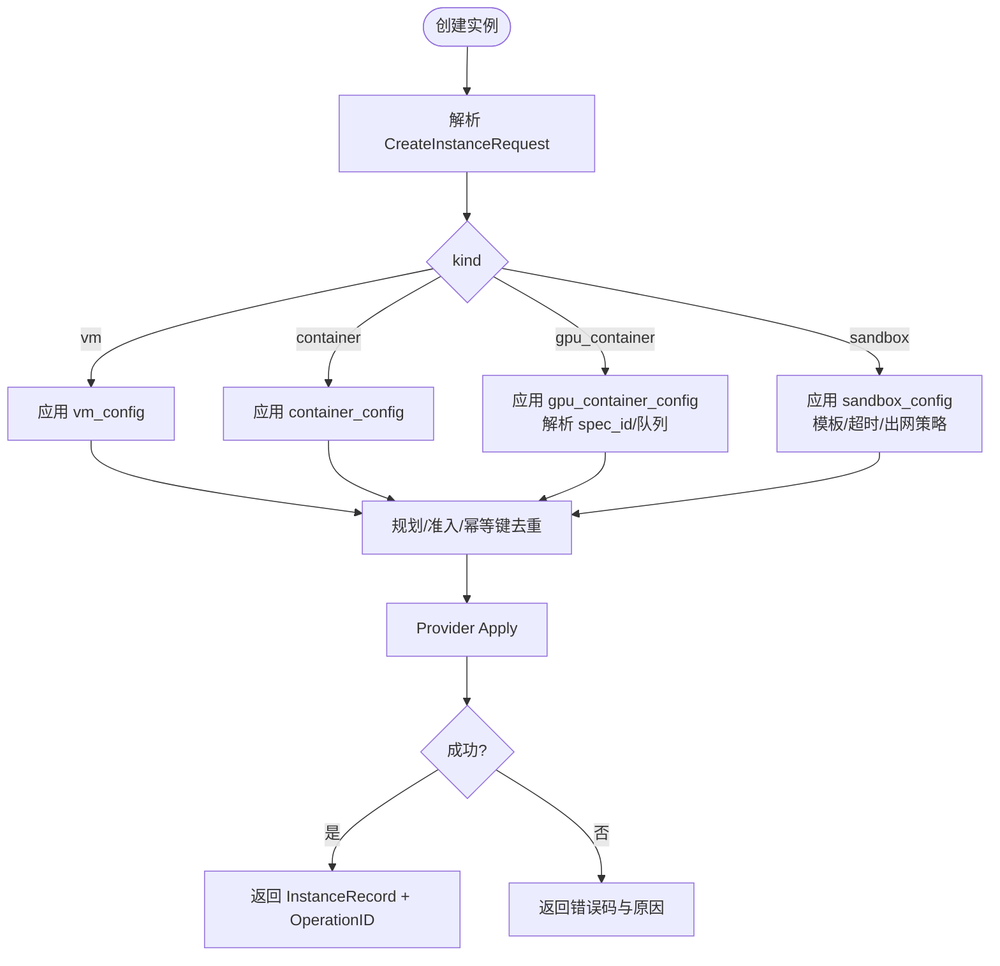
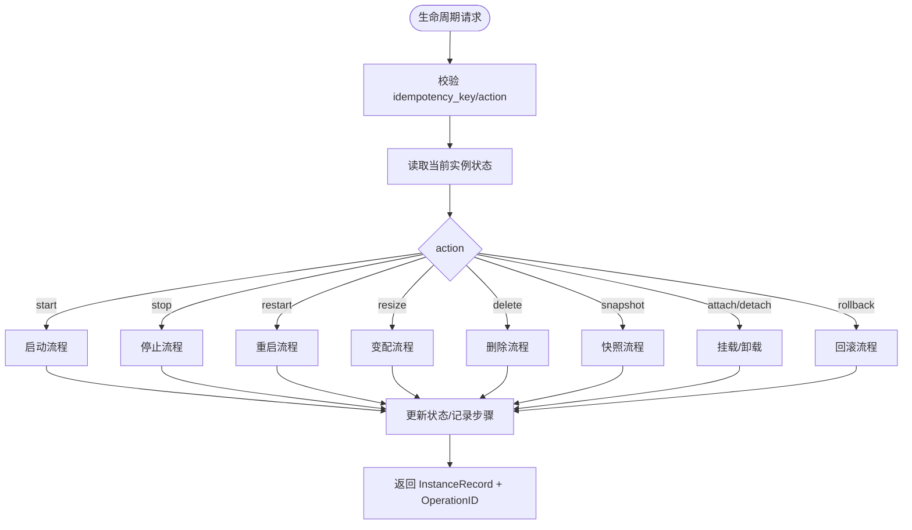
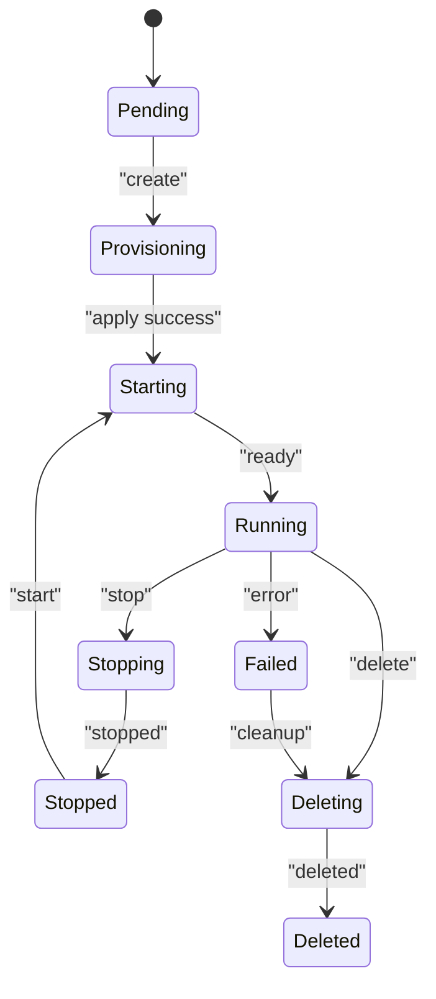
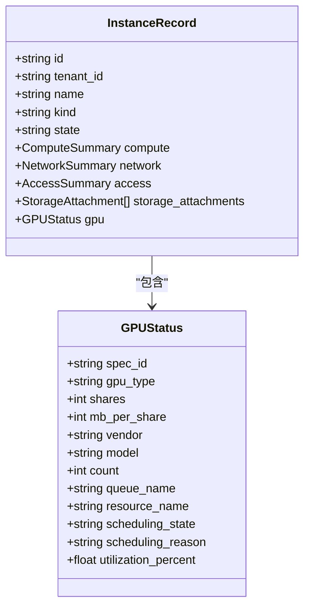
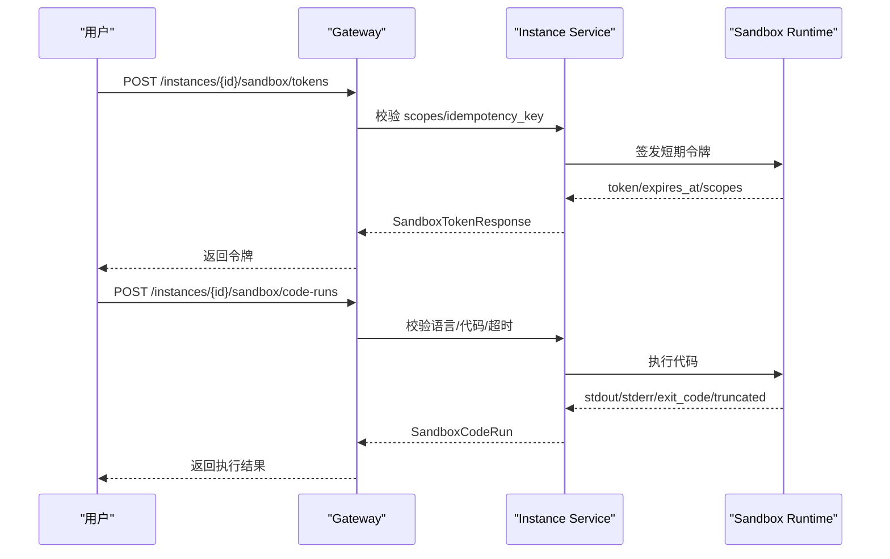
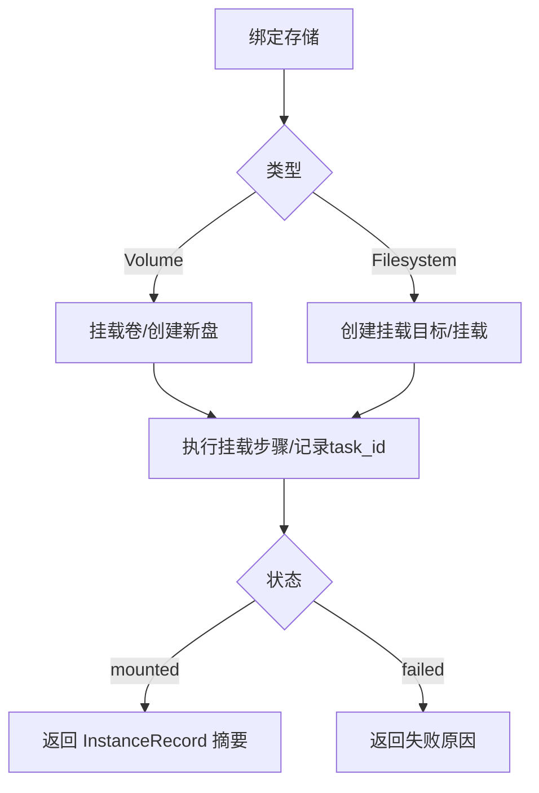
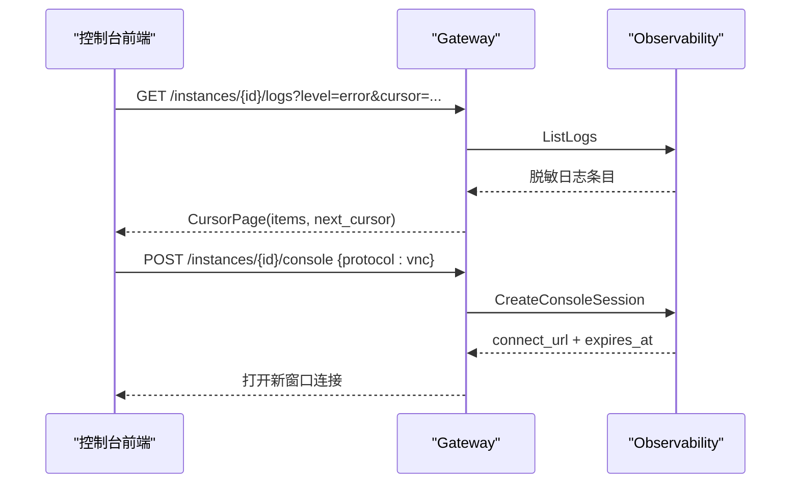
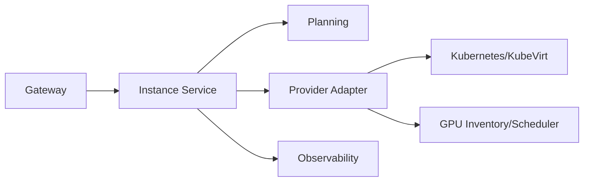

# 实例管理 API

<cite>
**本文引用的文件**
- [v1.yaml](file://repo/api/openapi/v1.yaml)
- [services_v1.yaml](file://repo/api/openapi/services/v1.yaml)
- [instances.go](file://repo/services/ani-gateway/internal/router/instances.go)
- [instance_service.go](file://repo/pkg/adapters/runtime/instance_service.go)
- [planning.go](file://repo/pkg/adapters/runtime/planning.go)
- [instance_observability.go](file://repo/pkg/ports/instance_observability.go)
- [kubernetes_gpu_inventory.go](file://repo/pkg/adapters/runtime/kubernetes_gpu_inventory.go)
- [test_backend_apis.py](file://repo/scripts/test_backend_apis.py)
- [console-instance-observability-console-a.md](file://repo/development-records/console-instance-observability-console-a.md)
</cite>

## 目录
1. [简介](#简介)
2. [项目结构](#项目结构)
3. [核心组件](#核心组件)
4. [架构总览](#架构总览)
5. [详细组件分析](#详细组件分析)
6. [依赖关系分析](#依赖关系分析)
7. [性能与可用性](#性能与可用性)
8. [故障排查指南](#故障排查指南)
9. [结论](#结论)
10. [附录：API 速查与示例](#附录api-速查与示例)

## 简介
本文件面向“设备实例管理”的对外 REST API，覆盖虚拟机、容器、GPU 实例、沙箱实例的全生命周期管理，包括创建、启动、停止、删除、重启、变配、挂载存储、快照/回滚、控制台访问、日志与指标观测等。所有接口遵循统一的幂等键、异步任务（AsyncTask）与游标分页约定，并通过 Gateway 路由到内部 Instance Service 与 Provider Adapter，最终落地到 Kubernetes/KubeVirt/Sandbox 等运行时。

## 项目结构
- OpenAPI 契约位于 repo/api/openapi/v1.yaml，定义实例主资源、Sandbox 子资源、网络/存储/镜像/向量库等基础设施资源，以及统一错误、分页、异步任务模型。
- Services 层 API 位于 repo/api/openapi/services/v1.yaml，承载业务服务（推理服务、知识库等），与 Core 实例 API 解耦。
- Gateway 路由实现位于 repo/services/ani-gateway/internal/router/instances.go，负责请求解析、鉴权、参数校验、调用 Instance Service、返回统一响应。
- 运行时适配与服务编排位于 repo/pkg/adapters/runtime/*，包含实例服务、计划与状态机、GPU 库存与调度、可观测性接口等。

**图表来源**
- [instances.go:787-811](file://repo/services/ani-gateway/internal/router/instances.go#L787-L811)
- [instance_service.go:669-696](file://repo/pkg/adapters/runtime/instance_service.go#L669-L696)
- [planning.go:413-452](file://repo/pkg/adapters/runtime/planning.go#L413-L452)
- [instance_observability.go:127-136](file://repo/pkg/ports/instance_observability.go#L127-L136)
- [kubernetes_gpu_inventory.go:1-40](file://repo/pkg/adapters/runtime/kubernetes_gpu_inventory.go#L1-L40)

**章节来源**
- [v1.yaml:1-39](file://repo/api/openapi/v1.yaml#L1-L39)
- [services_v1.yaml:1-20](file://repo/api/openapi/services/v1.yaml#L1-L20)
- [instances.go:787-811](file://repo/services/ani-gateway/internal/router/instances.go#L787-L811)

## 核心组件
- 实例资源与配置
  - 统一实例记录 InstanceRecord，包含 kind、state、compute/network/access/storage_attachments 等摘要信息。
  - 四类实例专用配置：vm_config、container_config、gpu_container_config、sandbox_config。
  - 通用网络/存储/端口/环境变量/工作负载身份等抽象。
- 生命周期与操作
  - 统一生命周期动作 start/stop/restart/resize/delete/snapshot/attach/detach volume/filesystem/rollback/scale/update_image/bind/unbind secret/change_security_groups/set_termination_protection/pause/resume/extend/touch_idle。
  - 操作记录 InstanceOperation，包含步骤 steps、任务关联 task_id、失败原因等。
- 异步任务
  - AsyncTask 统一表示 202 响应中的后台任务，支持轮询或 Webhook。
- 可观测性与运维
  - 日志、事件、指标、安全事件、控制台会话、执行会话等通过 InstanceObservability 暴露。
- GPU 与调度
  - GPUSpec 引用、队列选择、利用率与调度状态投影到 InstanceRecord.gpu。

**章节来源**
- [v1.yaml:979-1144](file://repo/api/openapi/v1.yaml#L979-L1144)
- [v1.yaml:1156-1359](file://repo/api/openapi/v1.yaml#L1156-L1359)
- [v1.yaml:1361-1566](file://repo/api/openapi/v1.yaml#L1361-L1566)
- [v1.yaml:351-373](file://repo/api/openapi/v1.yaml#L351-L373)
- [instance_observability.go:127-136](file://repo/pkg/ports/instance_observability.go#L127-L136)
- [kubernetes_gpu_inventory.go:1-40](file://repo/pkg/adapters/runtime/kubernetes_gpu_inventory.go#L1-L40)

## 架构总览
Gateway 接收 /api/v1/instances 系列请求，解析并校验请求体（含 idempotency_key），将动作分派到 Instance Service；Service 进行前置检查、状态机规划、持久化操作记录，再调用 Provider Adapter 完成实际资源编排；完成后更新实例状态，并通过 Observability 提供日志/事件/指标/控制台等能力。GPU 相关实例在创建时解析 spec_id 与队列，调度结果反映在实例详情中。

**图表来源**
- [instances.go:787-811](file://repo/services/ani-gateway/internal/router/instances.go#L787-L811)
- [instance_service.go:669-696](file://repo/pkg/adapters/runtime/instance_service.go#L669-L696)
- [planning.go:413-452](file://repo/pkg/adapters/runtime/planning.go#L413-L452)
- [instance_observability.go:127-136](file://repo/pkg/ports/instance_observability.go#L127-L136)

## 详细组件分析

### 实例创建与配置模板
- 统一入口：POST /api/v1/instances，请求体为 CreateInstanceRequest，按 kind 选择 vm_config/container_config/gpu_container_config/sandbox_config。
- 推荐字段：image_id/image_ref、cpu/memory、auto_start、network_config、replicas、ports、env、secret_ids、volume_mounts、filesystem_mounts、workload_identity、gpu.spec_id 等。
- Sandbox 模板：可通过 sandbox_config.template_id 指定模板；模板不可用则创建失败。
- 兼容字段：顶层扁平字段保留 v1 兼容别名，但 *_config 优先。

**图表来源**
- [v1.yaml:1156-1359](file://repo/api/openapi/v1.yaml#L1156-L1359)
- [instances.go:787-811](file://repo/services/ani-gateway/internal/router/instances.go#L787-L811)

**章节来源**
- [v1.yaml:1156-1359](file://repo/api/openapi/v1.yaml#L1156-L1359)
- [v1.yaml:1325-1359](file://repo/api/openapi/v1.yaml#L1325-L1359)

### 生命周期管理：启动/停止/重启/删除/变配/快照/挂载/回滚
- 统一入口：POST /api/v1/instances/{instance_id}/lifecycle，请求体包含 idempotency_key 与 action。
- 支持动作：start/stop/restart/resize/delete/snapshot/attach_volume/detach_volume/attach_filesystem/detach_filesystem/rollback/scale/update_image/bind_secret/unbind_secret/change_security_groups/set_termination_protection/pause/resume/extend/touch_idle。
- 状态机约束：例如 pause 要求 running，resume 要求 stopped；delete 后不可再执行其他动作。
- 返回：当前 InstanceRecord 与 OperationID，便于后续查询操作进度。

**图表来源**
- [instances.go:1520-1576](file://repo/services/ani-gateway/internal/router/instances.go#L1520-L1576)
- [planning.go:413-452](file://repo/pkg/adapters/runtime/planning.go#L413-L452)
- [instance_service.go:669-696](file://repo/pkg/adapters/runtime/instance_service.go#L669-L696)

**章节来源**
- [instances.go:1520-1576](file://repo/services/ani-gateway/internal/router/instances.go#L1520-L1576)
- [planning.go:413-452](file://repo/pkg/adapters/runtime/planning.go#L413-L452)
- [instance_service.go:669-696](file://repo/pkg/adapters/runtime/instance_service.go#L669-L696)

### 实例状态机与异步任务
- 实例状态：pending/provisioning/starting/running/stopping/stopped/failed/deleting/deleted。
- 操作状态：accepted/in_progress/succeeded/failed/cancelled。
- 异步任务：202 响应返回 AsyncTask，Location 指向任务 URL；支持轮询或 Webhook。
- 步骤追踪：InstanceOperation.steps 记录每个阶段的状态、任务 ID、资源类型与时间戳。

**图表来源**
- [v1.yaml:979-1144](file://repo/api/openapi/v1.yaml#L979-L1144)
- [v1.yaml:351-373](file://repo/api/openapi/v1.yaml#L351-L373)

**章节来源**
- [v1.yaml:979-1144](file://repo/api/openapi/v1.yaml#L979-L1144)
- [v1.yaml:351-373](file://repo/api/openapi/v1.yaml#L351-L373)

### GPU 实例与调度
- 规格引用：gpu_container_config.gpu.spec_id 指向 Core GPUSpec；旧字段 vendor/model/count/allocation_mode/workload_class 保留兼容。
- 调度队列：支持 queue_name 指定 Volcano Queue；未指定时按 workload_class 选择默认队列。
- 状态投影：InstanceRecord.gpu 包含 scheduling_state、utilization_percent、queue_name、resource_name 等。
- 库存发现：KubernetesGPUInventory 从节点标签/注解解析 GPU 能力与调度器（Volcano/HAMI）。

**图表来源**
- [v1.yaml:1057-1074](file://repo/api/openapi/v1.yaml#L1057-L1074)
- [kubernetes_gpu_inventory.go:1-40](file://repo/pkg/adapters/runtime/kubernetes_gpu_inventory.go#L1-L40)

**章节来源**
- [v1.yaml:1277-1319](file://repo/api/openapi/v1.yaml#L1277-L1319)
- [v1.yaml:1057-1074](file://repo/api/openapi/v1.yaml#L1057-L1074)
- [kubernetes_gpu_inventory.go:1-40](file://repo/pkg/adapters/runtime/kubernetes_gpu_inventory.go#L1-L40)

### 沙箱实例与子资源
- 配置：template_id、runtime_class、session_timeout、idle_timeout、on_timeout、network_egress_policy、egress_allowlist、env、initial_ports。
- 子资源：
  - Token：短期令牌，scopes 控制 connect/exec/files/ports。
  - Ports：预览端口，status 包含 opening/available/closing/failed，preview_url 用于浏览器访问。
  - Files：/workspace 读写/删除，带安全限制（拒绝多硬链接、跨文件系统写入等）。
  - Checkpoints：创建/恢复/克隆，状态 managing/available/restoring/failed/deleted。
  - Code Run：python/javascript 代码执行，输出截断与审计约束。
- 状态：session_state（pending/running/paused/expired/stopped）、agent_ref、stop_reason、connectivity。

**图表来源**
- [v1.yaml:1423-1566](file://repo/api/openapi/v1.yaml#L1423-L1566)
- [instances.go:787-811](file://repo/services/ani-gateway/internal/router/instances.go#L787-L811)

**章节来源**
- [v1.yaml:1325-1359](file://repo/api/openapi/v1.yaml#L1325-L1359)
- [v1.yaml:1423-1566](file://repo/api/openapi/v1.yaml#L1423-L1566)
- [instances.go:787-811](file://repo/services/ani-gateway/internal/router/instances.go#L787-L811)

### 网络与存储绑定
- 网络：InstanceNetworkConfig 支持 vpc/subnet/security_group/private_ip；端口映射 InstancePortSpec。
- 存储：
  - VolumeMount/VolumeSpec：挂载卷、创建新盘、加密、删除策略。
  - FilesystemMount：NFS/CephFS 挂载点与命令。
  - 扩展/扩容：VolumeExpand/FilesystemExpand 仅支持扩容。
- 绑定：attach/detach volume/filesystem 通过 lifecycle action 完成，并在 InstanceRecord.storage_attachments 中体现状态与任务。

**图表来源**
- [v1.yaml:834-875](file://repo/api/openapi/v1.yaml#L834-L875)
- [v1.yaml:2304-2435](file://repo/api/openapi/v1.yaml#L2304-L2435)
- [v1.yaml:1109-1144](file://repo/api/openapi/v1.yaml#L1109-L1144)

**章节来源**
- [v1.yaml:834-875](file://repo/api/openapi/v1.yaml#L834-L875)
- [v1.yaml:2304-2435](file://repo/api/openapi/v1.yaml#L2304-L2435)
- [v1.yaml:1109-1144](file://repo/api/openapi/v1.yaml#L1109-L1144)

### 监控、日志与控制台访问
- 日志：GET /instances/{id}/logs，CursorPage 分页，level 过滤。
- 事件：GET /instances/{id}/events，type/severity 过滤。
- 指标：GET /instances/{id}/metrics，PromQL 代理查询。
- 控制台：POST /instances/{id}/console，返回 connect_url，浏览器打开 VNC/Serial/Console。
- 执行会话：POST /instances/{id}/exec，返回 ws_url，前端使用 WebSocket 交互。

**图表来源**
- [instance_observability.go:127-136](file://repo/pkg/ports/instance_observability.go#L127-L136)
- [instances.go:787-811](file://repo/services/ani-gateway/internal/router/instances.go#L787-L811)

**章节来源**
- [instance_observability.go:127-136](file://repo/pkg/ports/instance_observability.go#L127-L136)
- [instances.go:787-811](file://repo/services/ani-gateway/internal/router/instances.go#L787-L811)
- [console-instance-observability-console-a.md:1-19](file://repo/development-records/console-instance-observability-console-a.md#L1-L19)

## 依赖关系分析
- Gateway 依赖 Instance Service 与 Observability 接口；Instance Service 依赖 Planning/State Machine、Provider Adapter、GPU Inventory。
- 外部依赖：Kubernetes/KubeVirt、Volcano/HAMI 调度器、对象存储、向量库、镜像仓库等。
- 耦合点：
  - 状态机与动作矩阵强约束，避免非法转换。
  - GPU 调度依赖队列与库存，失败原因需透传至前端。
  - 可观测性聚合需脱敏敏感信息，不泄露 provider SDK 对象。

**图表来源**
- [instances.go:787-811](file://repo/services/ani-gateway/internal/router/instances.go#L787-L811)
- [planning.go:413-452](file://repo/pkg/adapters/runtime/planning.go#L413-L452)
- [kubernetes_gpu_inventory.go:1-40](file://repo/pkg/adapters/runtime/kubernetes_gpu_inventory.go#L1-L40)

**章节来源**
- [instances.go:787-811](file://repo/services/ani-gateway/internal/router/instances.go#L787-L811)
- [planning.go:413-452](file://repo/pkg/adapters/runtime/planning.go#L413-L452)
- [kubernetes_gpu_inventory.go:1-40](file://repo/pkg/adapters/runtime/kubernetes_gpu_inventory.go#L1-L40)

## 性能与可用性
- 幂等性：所有写操作必须携带 idempotency_key，服务端在同一租户内短时间窗口去重。
- 异步处理：长耗时操作返回 202 + AsyncTask，支持轮询或 Webhook，降低请求超时风险。
- 分页：列表接口统一 CursorPage，避免大数据量一次性加载。
- 降级：当依赖不可用时（如 Prometheus/K8s API），返回明确错误码与重试建议。
- 观察性：通过 metrics/logs/events 快速定位瓶颈与异常。

[本节为通用指导，无需特定文件来源]

## 故障排查指南
- 常见错误码：UNAUTHORIZED/FORBIDDEN/NOT_FOUND/CONFLICT/BAD_REQUEST/RATE_LIMIT_EXCEEDED/NOT_IMPLEMENTED/INTERNAL_ERROR。
- 状态失败：查看 InstanceOperation.steps 与 failure_reason/failure_message；必要时结合 logs/events/metrics。
- GPU 调度失败：检查 scheduling_state、scheduling_reason、queue_name 与可用库存；确认 spec_id 与队列匹配。
- 沙箱问题：检查 session_state、stop_reason、token/port 状态；验证文件安全限制与 code-run 输出截断。
- 控制台/终端：确认协议与权限；若连接失败，检查 connect_url/ws_url 是否过期或被拒绝。

**章节来源**
- [v1.yaml:24-31](file://repo/api/openapi/v1.yaml#L24-L31)
- [v1.yaml:1109-1144](file://repo/api/openapi/v1.yaml#L1109-L1144)
- [v1.yaml:1361-1422](file://repo/api/openapi/v1.yaml#L1361-L1422)

## 结论
本 API 以统一契约与状态机为核心，覆盖 VM/Container/GPU/Sandbox 四类实例的全生命周期管理，并提供丰富的运维能力（日志/事件/指标/控制台/执行会话）。通过幂等键、异步任务与游标分页，确保高可用与可扩展性。GPU 调度与沙箱子资源进一步增强了平台对 AI 工作负载的支持。建议客户端严格遵循契约，合理使用异步任务与观测接口，提升稳定性与可维护性。

[本节为总结，无需特定文件来源]

## 附录：API 速查与示例
- 实例列表与详情
  - GET /api/v1/instances
  - GET /api/v1/instances/{instance_id}
- 实例创建
  - POST /api/v1/instances
  - 参考：CreateInstanceRequest、vm_config/container_config/gpu_container_config/sandbox_config
- 生命周期
  - POST /api/v1/instances/{instance_id}/lifecycle
  - 动作：start/stop/restart/resize/delete/snapshot/attach/detach/rollback/scale/update_image/bind/unbind secret/change_security_groups/set_termination_protection/pause/resume/extend/touch_idle
- 操作记录
  - GET /api/v1/instance-operations/{operation_id}
  - GET /api/v1/instances/{instance_id}/operations
- 可观测性
  - GET /api/v1/instances/{instance_id}/logs
  - GET /api/v1/instances/{instance_id}/events
  - GET /api/v1/instances/{instance_id}/metrics
  - POST /api/v1/instances/{instance_id}/console
  - POST /api/v1/instances/{instance_id}/exec
- 沙箱子资源
  - POST /api/v1/instances/{instance_id}/sandbox/tokens
  - POST /api/v1/instances/{instance_id}/sandbox/ports
  - DELETE /api/v1/instances/{instance_id}/sandbox/ports/{port}
  - GET /api/v1/instances/{instance_id}/sandbox/files
  - POST /api/v1/instances/{instance_id}/sandbox/files
  - DELETE /api/v1/instances/{instance_id}/sandbox/files
  - GET /api/v1/instances/{instance_id}/sandbox/checkpoints
  - POST /api/v1/instances/{instance_id}/sandbox/checkpoints
  - POST /api/v1/instances/{instance_id}/sandbox/checkpoints/{checkpoint_id}/restore
  - POST /api/v1/instances/{instance_id}/sandbox/checkpoints/{checkpoint_id}/clone
  - POST /api/v1/instances/{instance_id}/sandbox/code-runs
- GPU 调度
  - GET /api/v1/gpu-scheduling/queues
  - 参考：test_backend_apis.py 中对队列 CRUD 的调用示例

**章节来源**
- [instances.go:787-811](file://repo/services/ani-gateway/internal/router/instances.go#L787-L811)
- [test_backend_apis.py:295-321](file://repo/scripts/test_backend_apis.py#L295-L321)
- [v1.yaml:1156-1566](file://repo/api/openapi/v1.yaml#L1156-L1566)