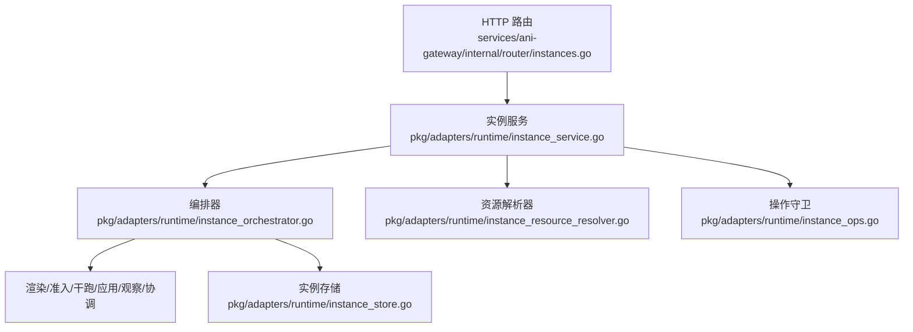
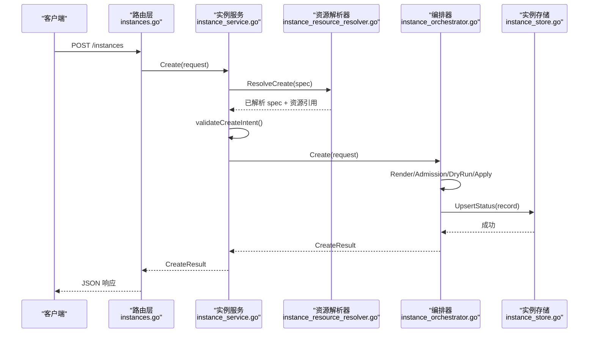
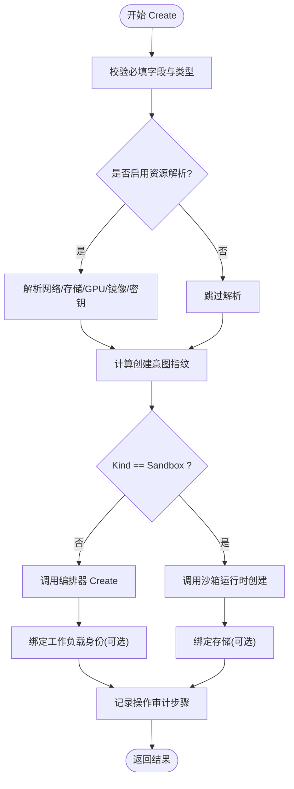
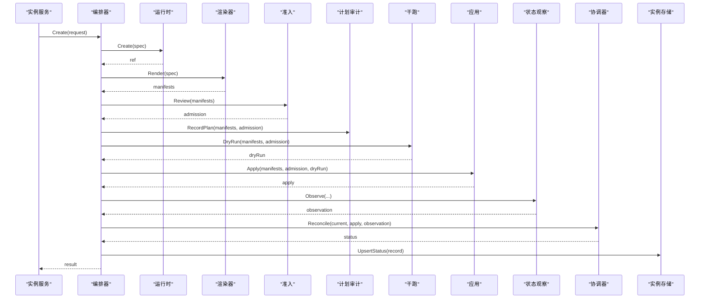
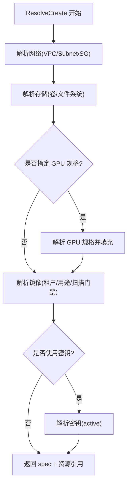
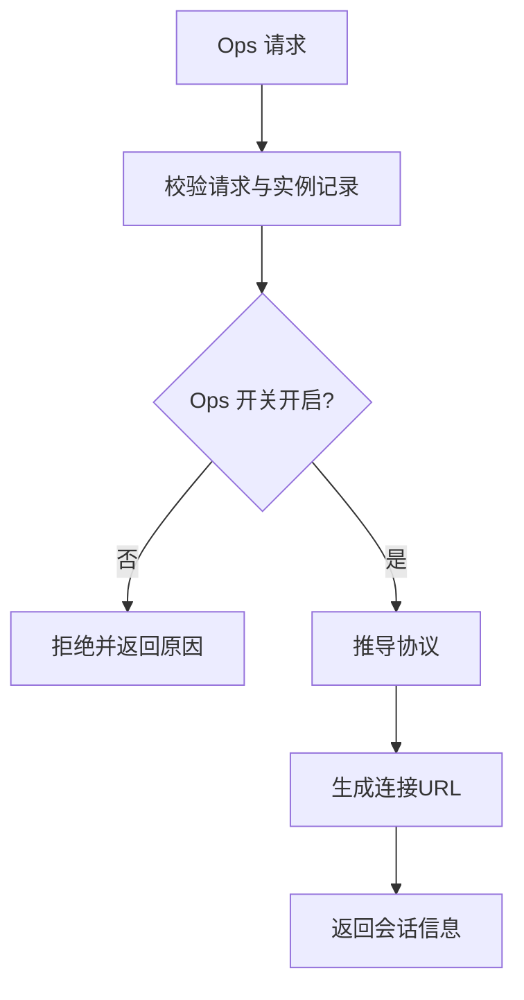
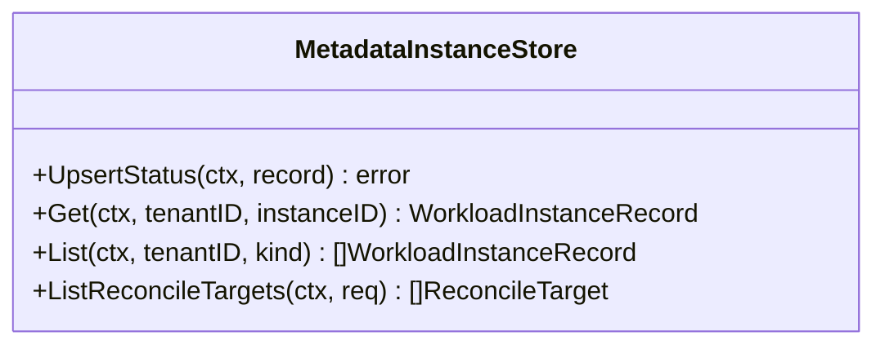
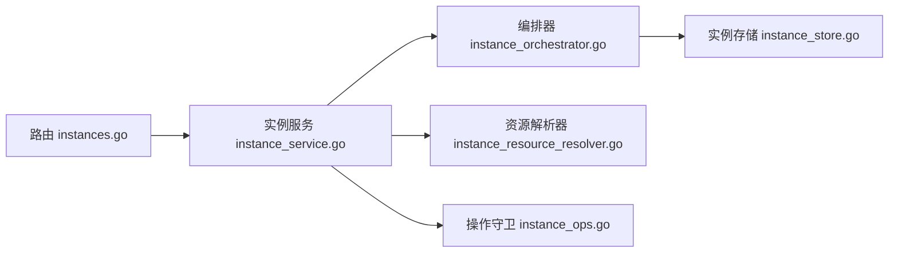

# 实例配置管理

<cite>
**本文引用的文件**
- [instance_service.go](file://repo/pkg/adapters/runtime/instance_service.go)
- [instance_orchestrator.go](file://repo/pkg/adapters/runtime/instance_orchestrator.go)
- [instance_resource_resolver.go](file://repo/pkg/adapters/runtime/instance_resource_resolver.go)
- [instances.go](file://repo/services/ani-gateway/internal/router/instances.go)
- [instance_ops.go](file://repo/pkg/adapters/runtime/instance_ops.go)
- [instance_store.go](file://repo/pkg/adapters/runtime/instance_store.go)
</cite>

## 目录
1. [简介](#简介)
2. [项目结构](#项目结构)
3. [核心组件](#核心组件)
4. [架构总览](#架构总览)
5. [详细组件分析](#详细组件分析)
6. [依赖关系分析](#依赖关系分析)
7. [性能与一致性](#性能与一致性)
8. [故障排查指南](#故障排查指南)
9. [结论](#结论)
10. [附录：API 契约与字段说明](#附录api-契约与字段说明)

## 简介
本文件面向“实例配置管理”的 API 与实现，覆盖以下主题：
- 实例规格模板与资源配置方案（镜像、网络、存储、GPU 规格）
- 自定义配置项（环境变量注入、配置文件挂载、密钥注入）
- 实例启动参数、初始化流程与依赖服务配置
- 配置验证、版本管理与继承机制
- 实例启动脚本、初始化流程、依赖服务配置

该文档以代码为依据，提供端到端的调用链路、数据流与校验规则，帮助开发者快速理解并正确使用实例创建与生命周期管理的配置能力。

## 项目结构
围绕实例配置管理的关键路径如下：
- API 路由层：接收请求、组装请求体、注册路由
- 服务编排层：资源解析、渲染、准入、干跑、应用、状态观察与协调
- 运行时适配器：具体工作负载的创建、身份绑定、操作守卫
- 存储层：实例元数据的持久化与查询

**图表来源**
- [instances.go:759-800](file://repo/services/ani-gateway/internal/router/instances.go#L759-L800)
- [instance_service.go:73-88](file://repo/pkg/adapters/runtime/instance_service.go#L73-L88)
- [instance_orchestrator.go:48-74](file://repo/pkg/adapters/runtime/instance_orchestrator.go#L48-L74)
- [instance_resource_resolver.go:43-57](file://repo/pkg/adapters/runtime/instance_resource_resolver.go#L43-L57)
- [instance_ops.go:32-38](file://repo/pkg/adapters/runtime/instance_ops.go#L32-L38)
- [instance_store.go:28-37](file://repo/pkg/adapters/runtime/instance_store.go#L28-L37)

**章节来源**
- [instances.go:759-800](file://repo/services/ani-gateway/internal/router/instances.go#L759-L800)
- [instance_service.go:73-88](file://repo/pkg/adapters/runtime/instance_service.go#L73-L88)
- [instance_orchestrator.go:48-74](file://repo/pkg/adapters/runtime/instance_orchestrator.go#L48-L74)
- [instance_resource_resolver.go:43-57](file://repo/pkg/adapters/runtime/instance_resource_resolver.go#L43-L57)
- [instance_ops.go:32-38](file://repo/pkg/adapters/runtime/instance_ops.go#L32-L38)
- [instance_store.go:28-37](file://repo/pkg/adapters/runtime/instance_store.go#L28-L37)

## 核心组件
- 实例服务（LocalInstanceService）
  - 负责创建、获取、列表、生命周期操作、快照、卷挂载/卸载、回滚、运维会话等
  - 内置创建意图指纹与幂等重放、操作审计步骤记录、身份绑定、存储绑定
- 编排器（LocalInstanceOrchestrator）
  - 串联工作负载运行时、渲染器、准入、计划审计、干跑、应用、状态读取、协调器
  - 生成实例记录、写入存储、返回最终状态
- 资源解析器（LocalInstanceResourceResolver）
  - 解析并校验网络、存储、GPU 规格、镜像与密钥引用
  - 将抽象的资源引用转换为可被后续渲染/应用使用的具体信息
- 操作守卫（LocalInstanceOpsGuard）
  - 对终端、执行、控制台等运维操作进行开关控制与协议协商
- 实例存储（MetadataInstanceStore）
  - 将实例状态、网络、存储、容器/GPU/Sandbox 状态、标签、镜像摘要等持久化到数据库

**章节来源**
- [instance_service.go:90-294](file://repo/pkg/adapters/runtime/instance_service.go#L90-L294)
- [instance_orchestrator.go:76-206](file://repo/pkg/adapters/runtime/instance_orchestrator.go#L76-L206)
- [instance_resource_resolver.go:68-153](file://repo/pkg/adapters/runtime/instance_resource_resolver.go#L68-L153)
- [instance_ops.go:40-64](file://repo/pkg/adapters/runtime/instance_ops.go#L40-L64)
- [instance_store.go:39-177](file://repo/pkg/adapters/runtime/instance_store.go#L39-L177)

## 架构总览
下图展示了从 HTTP 请求到实例落库的完整链路，包括配置解析、校验、渲染、应用与状态协调。

**图表来源**
- [instances.go:759-800](file://repo/services/ani-gateway/internal/router/instances.go#L759-L800)
- [instance_service.go:90-294](file://repo/pkg/adapters/runtime/instance_service.go#L90-L294)
- [instance_resource_resolver.go:68-153](file://repo/pkg/adapters/runtime/instance_resource_resolver.go#L68-L153)
- [instance_orchestrator.go:76-206](file://repo/pkg/adapters/runtime/instance_orchestrator.go#L76-L206)
- [instance_store.go:39-177](file://repo/pkg/adapters/runtime/instance_store.go#L39-L177)

## 详细组件分析

### 实例服务（创建与生命周期）
- 创建流程要点
  - 必填校验：租户ID、幂等键、用户ID、权限证明、实例类型
  - 可选资源解析：网络/VPC/子网/安全组、存储卷/文件系统、GPU 规格、镜像与扫描门禁、密钥引用
  - 创建意图指纹：基于 spec 计算哈希，用于幂等重放与审计
  - 沙箱分支：若类型为 sandbox，走本地沙箱运行时创建并落库
  - 身份绑定：为实例绑定 scoped API Key（可选）
  - 存储绑定：在 VM/容器场景下，创建后挂载系统盘/数据盘或文件系统
  - 操作审计：记录步骤（如 storage_mount、workload_identity_bind），失败时标记重试资格
- 生命周期操作
  - 统一入口 applyLifecycle：支持 start/stop/restart/resize/delete/snapshot/attach/detach/rollback
  - 通过 store.Get 获取当前实例记录，再校验意图并进入编排器或具体执行器

**图表来源**
- [instance_service.go:90-294](file://repo/pkg/adapters/runtime/instance_service.go#L90-L294)
- [instance_service.go:408-516](file://repo/pkg/adapters/runtime/instance_service.go#L408-L516)

**章节来源**
- [instance_service.go:90-294](file://repo/pkg/adapters/runtime/instance_service.go#L90-L294)
- [instance_service.go:408-516](file://repo/pkg/adapters/runtime/instance_service.go#L408-L516)
- [instance_service.go:655-711](file://repo/pkg/adapters/runtime/instance_service.go#L655-L711)

### 编排器（渲染、准入、干跑、应用、协调）
- 职责
  - 调用工作负载运行时创建基础引用
  - 渲染 manifests、准入审查、计划审计
  - 执行干跑与实际应用
  - 观察提供者状态并协调至期望状态
  - 将最终状态写入实例存储
- 关键数据
  - 审计 ID、提供者、manifests、干跑结果、应用结果、最终状态、资源引用

**图表来源**
- [instance_orchestrator.go:76-206](file://repo/pkg/adapters/runtime/instance_orchestrator.go#L76-L206)

**章节来源**
- [instance_orchestrator.go:76-206](file://repo/pkg/adapters/runtime/instance_orchestrator.go#L76-L206)

### 资源解析器（镜像、网络、存储、GPU、密钥）
- 镜像解析
  - 按租户隔离解析镜像，推断用途（system/container/gpu/sandbox）
  - 扫描门禁：根据环境变量决定是否放行未扫描/高风险镜像
  - 将扫描结果写入注解以便审计
- 网络解析
  - VPC/子网/安全组存在性与归属校验
- 存储解析
  - 卷/文件系统状态校验；容器挂载自动补全存储附件
- GPU 规格
  - 通过规格服务解析 GPU 型号、共享数、每共享内存，并与旧版选择器冲突检查
- 密钥解析
  - 校验密钥存在且处于 active 状态

**图表来源**
- [instance_resource_resolver.go:68-153](file://repo/pkg/adapters/runtime/instance_resource_resolver.go#L68-L153)
- [instance_resource_resolver.go:173-227](file://repo/pkg/adapters/runtime/instance_resource_resolver.go#L173-L227)
- [instance_resource_resolver.go:289-439](file://repo/pkg/adapters/runtime/instance_resource_resolver.go#L289-L439)
- [instance_resource_resolver.go:454-476](file://repo/pkg/adapters/runtime/instance_resource_resolver.go#L454-L476)

**章节来源**
- [instance_resource_resolver.go:68-153](file://repo/pkg/adapters/runtime/instance_resource_resolver.go#L68-L153)
- [instance_resource_resolver.go:173-227](file://repo/pkg/adapters/runtime/instance_resource_resolver.go#L173-L227)
- [instance_resource_resolver.go:289-439](file://repo/pkg/adapters/runtime/instance_resource_resolver.go#L289-L439)
- [instance_resource_resolver.go:454-476](file://repo/pkg/adapters/runtime/instance_resource_resolver.go#L454-L476)

### 操作守卫（运维会话与访问控制）
- 支持动作：日志、事件、指标、终端、执行、VM 控制台/VNC/串口
- 校验：租户/实例匹配、运行态要求、类型限制（VM 仅控制台类）
- 协议协商：根据动作推导默认协议
- 连接 URL：生成临时会话连接地址，带签发时间

**图表来源**
- [instance_ops.go:40-64](file://repo/pkg/adapters/runtime/instance_ops.go#L40-L64)
- [instance_ops.go:66-98](file://repo/pkg/adapters/runtime/instance_ops.go#L66-L98)
- [instance_ops.go:100-136](file://repo/pkg/adapters/runtime/instance_ops.go#L100-L136)

**章节来源**
- [instance_ops.go:40-64](file://repo/pkg/adapters/runtime/instance_ops.go#L40-L64)
- [instance_ops.go:66-98](file://repo/pkg/adapters/runtime/instance_ops.go#L66-L98)
- [instance_ops.go:100-136](file://repo/pkg/adapters/runtime/instance_ops.go#L100-L136)

### 实例存储（持久化与查询）
- 写入字段：租户、实例ID、名称、类型、提供者、审计ID、状态、端点、节点名、原因、网络、存储、生命周期策略、SSH 连接、快照、容器/GPU/Sandbox 状态、描述、标签、镜像摘要、计算/网络/访问摘要、存储附件、时间戳
- 查询：按租户+实例ID精确查询；按租户+类型列表查询；协调目标筛选（非删除态、超时未更新）

**图表来源**
- [instance_store.go:39-177](file://repo/pkg/adapters/runtime/instance_store.go#L39-L177)
- [instance_store.go:179-245](file://repo/pkg/adapters/runtime/instance_store.go#L179-L245)
- [instance_store.go:247-291](file://repo/pkg/adapters/runtime/instance_store.go#L247-L291)

**章节来源**
- [instance_store.go:39-177](file://repo/pkg/adapters/runtime/instance_store.go#L39-L177)
- [instance_store.go:179-245](file://repo/pkg/adapters/runtime/instance_store.go#L179-L245)
- [instance_store.go:247-291](file://repo/pkg/adapters/runtime/instance_store.go#L247-L291)

## 依赖关系分析
- 路由层依赖实例服务、操作存储、可观测性、GPU 清单、K8s REST 客户端、沙箱运行时、任务存储
- 实例服务依赖编排器、存储、操作存储、生命周期执行器、身份服务、资源解析器、沙箱运行时、运维操作
- 编排器依赖运行时、渲染器、准入、计划审计、干跑、应用、状态读取、协调器、实例存储、身份服务
- 资源解析器依赖网络服务、存储服务、GPU 规格服务、镜像仓库、密钥服务
- 操作守卫依赖实例记录与时间源
- 实例存储依赖元数据存储接口

**图表来源**
- [instances.go:759-800](file://repo/services/ani-gateway/internal/router/instances.go#L759-L800)
- [instance_service.go:73-88](file://repo/pkg/adapters/runtime/instance_service.go#L73-L88)
- [instance_orchestrator.go:48-74](file://repo/pkg/adapters/runtime/instance_orchestrator.go#L48-L74)
- [instance_resource_resolver.go:43-57](file://repo/pkg/adapters/runtime/instance_resource_resolver.go#L43-L57)
- [instance_ops.go:32-38](file://repo/pkg/adapters/runtime/instance_ops.go#L32-L38)
- [instance_store.go:28-37](file://repo/pkg/adapters/runtime/instance_store.go#L28-L37)

**章节来源**
- [instances.go:759-800](file://repo/services/ani-gateway/internal/router/instances.go#L759-L800)
- [instance_service.go:73-88](file://repo/pkg/adapters/runtime/instance_service.go#L73-L88)
- [instance_orchestrator.go:48-74](file://repo/pkg/adapters/runtime/instance_orchestrator.go#L48-L74)
- [instance_resource_resolver.go:43-57](file://repo/pkg/adapters/runtime/instance_resource_resolver.go#L43-L57)
- [instance_ops.go:32-38](file://repo/pkg/adapters/runtime/instance_ops.go#L32-L38)
- [instance_store.go:28-37](file://repo/pkg/adapters/runtime/instance_store.go#L28-L37)

## 性能与一致性
- 幂等与重放
  - 创建请求携带幂等键，服务会记录操作并支持指纹比对重放，避免重复创建
- 事务与落库
  - 实例状态写入使用租户事务，保证多字段原子性
- 资源预检
  - 网络/存储/GPU/镜像/密钥在创建前集中校验，减少下游失败成本
- 可观测与审计
  - 计划审计、干跑结果、应用结果、协调状态均参与最终记录，便于问题定位
- 并发与限流
  - 路由层内存实例存储在测试/演示场景使用读写锁保护；生产环境应替换为持久化存储

[本节为通用指导，不直接分析具体文件]

## 故障排查指南
- 常见错误分类
  - 参数无效：缺少必填字段、类型不合法、环境变量命名/取值非法
  - 资源冲突：VPC/子网/安全组不可用、卷/文件系统状态异常、镜像用途不匹配
  - 前置条件失败：镜像扫描未完成或存在高危漏洞（受门禁模式影响）
  - 权限不足：缺少用户ID或权限证明
  - 运行时错误：渲染/准入/干跑/应用/观察/协调任一阶段失败
- 定位建议
  - 查看操作审计步骤与失败原因（storage_mount_failed、workload_identity_bind_failed 等）
  - 核对资源解析结果与引用（vpc/subnet/security_group/volume/filesystem/image/secret）
  - 检查实例状态与协调结果（running/provisioning/failed/pending）
  - 确认操作守卫开关与协议选择是否正确

**章节来源**
- [instance_service.go:296-398](file://repo/pkg/adapters/runtime/instance_service.go#L296-L398)
- [instance_resource_resolver.go:173-227](file://repo/pkg/adapters/runtime/instance_resource_resolver.go#L173-L227)
- [instance_resource_resolver.go:289-439](file://repo/pkg/adapters/runtime/instance_resource_resolver.go#L289-L439)
- [instance_ops.go:66-98](file://repo/pkg/adapters/runtime/instance_ops.go#L66-L98)

## 结论
本实现通过“服务-编排-解析-存储”的分层设计，提供了完整的实例配置管理能力：
- 统一的创建与生命周期入口，支持多种实例类型
- 严格的配置校验与资源预检，保障创建成功率
- 完善的审计与可观测能力，便于排障与合规
- 可扩展的适配器与存储接口，便于接入不同后端

## 附录：API 契约与字段说明
- 创建实例请求关键字段
  - 基本信息：kind、name、description、labels、tenant_id、user_id、permission_proof、idempotency_key
  - 镜像：image、image_id、image_ref、boot_image（VM）
  - 计算：cpu、memory、replicas（容器）、gpu（vendor/model/count/spec_id/allocation_mode/workload_class）
  - 网络：vpc_id、subnet_id、security_group_ids、assign_private_ip、private_ip
  - 存储：system_disk、data_disks、volume_mounts、filesystem_mounts
  - 环境变量：env（name/value 或 secret_ref）
  - 密钥绑定：secret_bindings（secret_id、mount_path、env_prefix）
  - 生命周期：auto_start、termination_protection
  - 类型特定配置：vm_config、container_config、gpu_container_config、sandbox_config
- 环境变量注入
  - 每个 env 必须包含 name，且 value 与 secret_ref 二选一
  - 密钥引用会在资源解析阶段校验 active 状态
- 配置文件挂载
  - 通过 volume_mounts 与 filesystem_mounts 将卷/文件系统挂载到容器
  - 解析阶段会补全存储附件并校验资源可用
- 启动参数与初始化
  - VM 可通过 boot_image、ssh_username、ssh_key_ref、password_secret_ref、cloud_init_secret、user_data、os_type、firmware、machine_type 等配置
  - 容器可通过 replicas、ports、env、secret_ids、volume_mounts、filesystem_mounts 配置
  - 沙箱可通过 runtime_class、template_id、session_timeout、idle_timeout、on_timeout、network_egress_policy、egress_allowlist、env、initial_ports 配置
- 配置验证
  - 创建意图校验确保各类型互斥、磁盘/环境变量/GPU 规格合法
  - 镜像用途与实例类型匹配，扫描门禁按环境变量控制
  - 网络/存储/GPU/密钥引用均做存在性与状态校验
- 配置版本管理
  - 容器实例维护 revision 与 rollout_status，历史变更记录 image 与创建时间
  - 计划审计记录 manifest 与准入结果，便于回溯
- 配置继承机制
  - 资源解析器将抽象引用解析为具体资源，并在 spec 中回填（如镜像 digest、GPU 规格详情）
  - 编排器将运行时状态汇总为实例记录，供上层查询与展示

**章节来源**
- [instances.go:103-267](file://repo/services/ani-gateway/internal/router/instances.go#L103-L267)
- [instance_service.go:296-398](file://repo/pkg/adapters/runtime/instance_service.go#L296-L398)
- [instance_resource_resolver.go:68-153](file://repo/pkg/adapters/runtime/instance_resource_resolver.go#L68-L153)
- [instance_orchestrator.go:393-445](file://repo/pkg/adapters/runtime/instance_orchestrator.go#L393-L445)