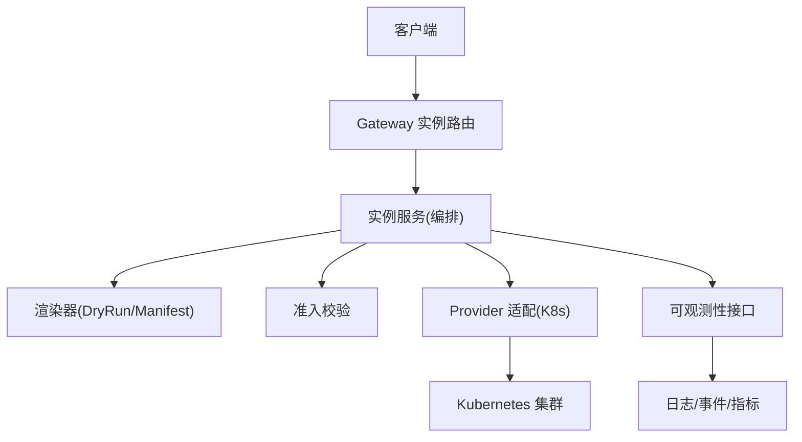
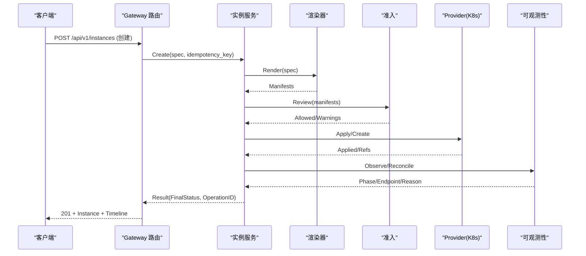
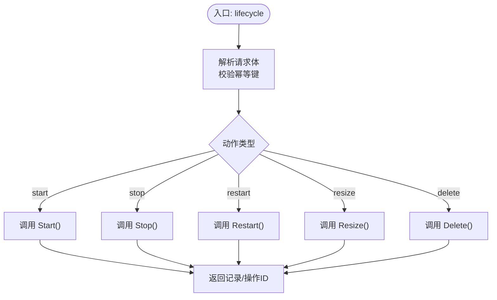
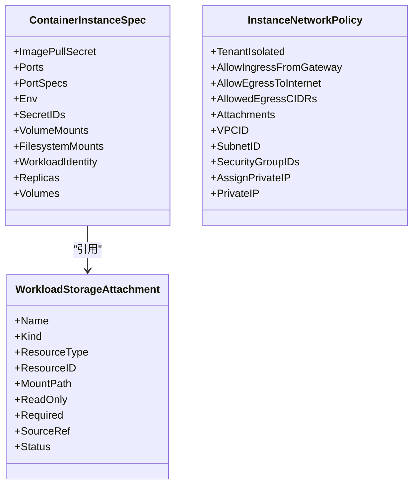
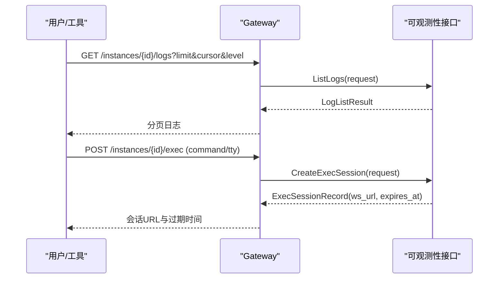
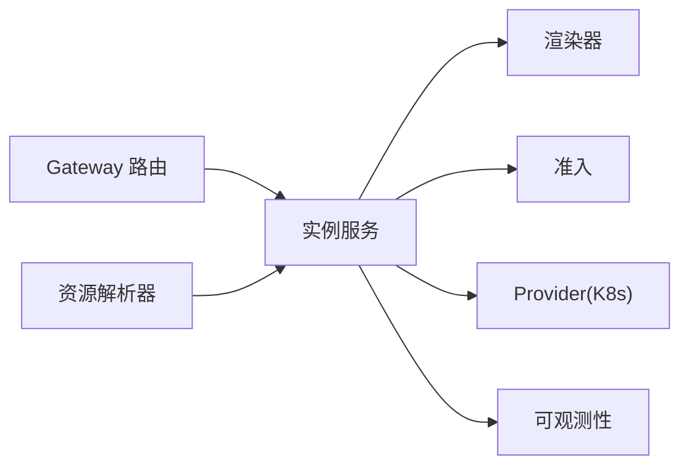

# 容器实例 API

<cite>
**本文引用的文件**
- [v1.yaml](file://repo/api/openapi/v1.yaml)
- [workload_runtime.go](file://repo/pkg/ports/workload_runtime.go)
- [instances.go](file://repo/services/ani-gateway/internal/router/instances.go)
- [instance_service.go](file://repo/pkg/adapters/runtime/instance_service.go)
- [instance_resource_resolver.go](file://repo/pkg/adapters/runtime/instance_resource_resolver.go)
- [dryrun_renderer.go](file://repo/pkg/adapters/runtime/dryrun_renderer.go)
- [instance_observability.go](file://repo/pkg/ports/instance_observability.go)
- [validate_instance_orchestration_live_gate.py](file://repo/scripts/validate_instance_orchestration_live_gate.py)
</cite>

## 目录
1. [简介](#简介)
2. [项目结构](#项目结构)
3. [核心组件](#核心组件)
4. [架构总览](#架构总览)
5. [详细组件分析](#详细组件分析)
6. [依赖关系分析](#依赖关系分析)
7. [性能与可靠性](#性能与可靠性)
8. [故障排查指南](#故障排查指南)
9. [结论](#结论)
10. [附录：API 参考](#附录api-参考)

## 简介
本文件面向“容器实例”（Kubernetes Pod 级别）的生命周期管理与运维能力，覆盖创建、启动、停止、重启、删除、扩缩容、镜像更新、滚动策略、资源限制、网络端口暴露、存储卷挂载、环境变量注入、健康检查、日志/事件/指标查询、命令执行与会话等。文档以仓库中的 OpenAPI 契约、Gateway 路由实现、运行时端口定义与适配器逻辑为依据，提供从接口到实现的端到端说明。

## 项目结构
- API 契约：OpenAPI v1 定义了实例、工作负载、异步任务、错误格式、认证方式等通用契约，并包含实例相关标签分组。
- Gateway 路由：负责将 HTTP 请求映射为内部服务调用，处理幂等键、鉴权上下文、状态刷新与响应封装。
- 运行时端口：统一抽象 WorkloadRuntime/WorkloadRenderer/Admission 等接口，描述实例生命周期动作、操作记录、观察结果等。
- 适配器与服务：LocalInstanceService 编排计划、渲染、准入、应用、观测、对账；资源解析器负责镜像、存储、网络、Secrets 引用解析；DryRun 渲染器生成 Provider 清单片段用于预览。
- 可观测性：统一的 InstanceObservability 接口暴露日志、事件、指标、安全事件、Exec/Console 会话创建。

图表来源
- [instances.go:1398-1427](file://repo/services/ani-gateway/internal/router/instances.go#L1398-L1427)
- [instance_service.go:896-936](file://repo/pkg/adapters/runtime/instance_service.go#L896-L936)
- [workload_runtime.go:775-786](file://repo/pkg/ports/workload_runtime.go#L775-L786)

章节来源
- [v1.yaml:1-39](file://repo/api/openapi/v1.yaml#L1-L39)
- [instances.go:1398-1427](file://repo/services/ani-gateway/internal/router/instances.go#L1398-L1427)

## 核心组件
- 实例生命周期动作：create/start/stop/restart/resize/delete/snapshot/attach/detach/rollback/scale/update_image/bind/unbind_secret/pause/resume/extend/touch_idle/console_session/exec 等。
- 实例规格与配置：镜像、命令/参数、CPU/内存/GPU 规格、网络平面与安全组、存储卷/文件系统挂载、环境变量与 Secret 注入、工作负载身份、TTL、调度器/运行类/服务账号等。
- 操作与审计：幂等键、操作步骤、失败原因、重试标记、Before/After Spec、Provider 引用、审计 ID。
- 可观测性：日志、事件、指标、安全事件、Exec/Console 会话。

章节来源
- [workload_runtime.go:35-62](file://repo/pkg/ports/workload_runtime.go#L35-L62)
- [workload_runtime.go:353-381](file://repo/pkg/ports/workload_runtime.go#L353-L381)
- [workload_runtime.go:555-582](file://repo/pkg/ports/workload_runtime.go#L555-L582)
- [workload_runtime.go:603-643](file://repo/pkg/ports/workload_runtime.go#L603-L643)
- [instance_observability.go:127-136](file://repo/pkg/ports/instance_observability.go#L127-L136)

## 架构总览
容器实例在 Gateway 层接收请求后，进入实例服务进行编排：先渲染 Provider 清单，再经准入校验与 DryRun 验证，随后提交给 Provider 实际创建或变更，最后通过观测与对账收敛状态。列表接口会按需刷新真实集群状态，合并孤儿资源，保证返回稳定。

图表来源
- [instance_service.go:1494-1513](file://repo/pkg/adapters/runtime/instance_service.go#L1494-L1513)
- [instances.go:848-866](file://repo/services/ani-gateway/internal/router/instances.go#L848-L866)

章节来源
- [instance_service.go:1494-1513](file://repo/pkg/adapters/runtime/instance_service.go#L1494-L1513)
- [instances.go:848-866](file://repo/services/ani-gateway/internal/router/instances.go#L848-L866)

## 详细组件分析

### 生命周期管理：创建、启动、停止、重启、删除、扩缩容、镜像更新
- 创建：POST /api/v1/instances，支持幂等键，返回实例、操作 ID、审计 ID、清单、时间线与运行时提示。
- 生命周期：POST /api/v1/instances/{id}/lifecycle，支持 start/stop/restart/resize/delete 等动作，由 Gateway 路由分发至服务层。
- 扩缩容：resize 动作携带资源请求，仅适用于容器/GPU 容器类型。
- 镜像更新：update_image 动作仅适用于容器/GPU 容器，当前策略限定为 rolling。
- 删除：delete 动作触发 Provider 清理，状态收敛为 deleted。

图表来源
- [instances.go:1520-1556](file://repo/services/ani-gateway/internal/router/instances.go#L1520-L1556)

章节来源
- [instances.go:1520-1556](file://repo/services/ani-gateway/internal/router/instances.go#L1520-L1556)
- [workload_runtime.go:35-62](file://repo/pkg/ports/workload_runtime.go#L35-L62)
- [instance_service.go:1177-1222](file://repo/pkg/adapters/runtime/instance_service.go#L1177-L1222)

### 容器镜像与环境变量、存储卷挂载、网络配置
- 镜像：支持 image_id/image_ref，按 kind 校验镜像用途（container/gpu/sandbox/system）。
- 环境变量：支持直接值与 SecretRef 注入；支持 SecretIDs 批量注入。
- 存储：支持 VolumeMounts 与 FilesystemMounts，自动解析为共享 PVC 挂载，支持只读标志与路径。
- 网络：支持 VPC/Subnet/安全组、私有 IP 分配与端口暴露；列表时刷新真实集群状态并合并孤儿 Deployment。

图表来源
- [workload_runtime.go:294-305](file://repo/pkg/ports/workload_runtime.go#L294-L305)
- [workload_runtime.go:136-152](file://repo/pkg/ports/workload_runtime.go#L136-L152)
- [workload_runtime.go:123-134](file://repo/pkg/ports/workload_runtime.go#L123-L134)

章节来源
- [instance_resource_resolver.go:129-152](file://repo/pkg/adapters/runtime/instance_resource_resolver.go#L129-L152)
- [instance_resource_resolver.go:399-439](file://repo/pkg/adapters/runtime/instance_resource_resolver.go#L399-L439)
- [dryrun_renderer.go:541-600](file://repo/pkg/adapters/runtime/dryrun_renderer.go#L541-L600)
- [instances.go:148-168](file://repo/services/ani-gateway/internal/router/instances.go#L148-L168)
- [instances.go:1398-1427](file://repo/services/ani-gateway/internal/router/instances.go#L1398-L1427)

### 健康检查与滚动更新
- 健康检查：平台工作负载支持 HTTP 健康检查，指定协议、路径与端口名；容器实例通过 Provider 的 Deployment/Service 暴露端口并配合就绪探针。
- 滚动更新：update_image 动作仅支持 rolling 策略，结合副本数与就绪状态实现无中断升级。

章节来源
- [workload_runtime.go:599-608](file://repo/pkg/ports/workload_runtime.go#L599-L608)
- [instance_service.go:1201-1210](file://repo/pkg/adapters/runtime/instance_service.go#L1201-L1210)

### 运维接口：日志、事件、指标、命令执行、控制台
- 日志/事件/指标：通过 InstanceObservability 接口提供 ListLogs/ListEvents/GetMetrics/ListSecurityEvents。
- 命令执行：CreateExecSession 返回 WebSocket 连接信息，供前端建立交互式终端。
- 控制台：CreateConsoleSession 返回 connect_url，支持 VM console/VNC/Serial 等协议。

图表来源
- [instance_observability.go:127-136](file://repo/pkg/ports/instance_observability.go#L127-L136)
- [instances_test.go:612-644](file://repo/services/ani-gateway/internal/router/instances_test.go#L612-L644)

章节来源
- [instance_observability.go:127-136](file://repo/pkg/ports/instance_observability.go#L127-L136)
- [instances_test.go:612-644](file://repo/services/ani-gateway/internal/router/instances_test.go#L612-L644)

### 资源限制与配额
- 资源限制：ContainerInstanceSpec 中 CPU/Memory/GPU 规格通过 WorkloadResourceRequest 与 GPUSpecReference 表达；Provider 侧映射为 Pod/Deployment 资源请求。
- 配额：平台级配额管理接口位于独立标签下，实例创建前可通过规格可用性接口辅助选择；具体配额扣减/释放由后续批次实现。

章节来源
- [workload_runtime.go:104-110](file://repo/pkg/ports/workload_runtime.go#L104-L110)
- [workload_runtime.go:164-180](file://repo/pkg/ports/workload_runtime.go#L164-L180)
- [v1.yaml:8532-8752](file://repo/api/openapi/v1.yaml#L8532-L8752)

### 生命周期与操作记录
- 操作记录：每次生命周期动作产生 WorkloadOperationRecord，包含步骤、失败原因、重试资格、Before/After Spec 快照等。
- 步骤：plan/render/admission/dry_run/apply/observe/reconcile 等阶段均落库，便于追踪与排障。

章节来源
- [workload_runtime.go:711-742](file://repo/pkg/ports/workload_runtime.go#L711-L742)
- [instance_service.go:1494-1513](file://repo/pkg/adapters/runtime/instance_service.go#L1494-L1513)

## 依赖关系分析
- Gateway 路由依赖实例服务接口，负责请求解析、鉴权上下文注入与响应封装。
- 实例服务依赖渲染器、准入、Provider 适配与可观测性接口，完成端到端编排。
- 资源解析器依赖 Secret、存储、网络等外部资源，确保创建前引用有效。
- 测试与 Live Gate 脚本验证容器编排链路（镜像、网络、存储、启停、删除、reconcile 终态）。

图表来源
- [instances.go:1398-1427](file://repo/services/ani-gateway/internal/router/instances.go#L1398-L1427)
- [instance_service.go:896-936](file://repo/pkg/adapters/runtime/instance_service.go#L896-L936)
- [instance_resource_resolver.go:129-152](file://repo/pkg/adapters/runtime/instance_resource_resolver.go#L129-L152)

章节来源
- [validate_instance_orchestration_live_gate.py:21-39](file://repo/scripts/validate_instance_orchestration_live_gate.py#L21-L39)

## 性能与可靠性
- 幂等性：所有写操作要求幂等键，重复提交返回相同结果或冲突码，避免重复创建。
- 状态收敛：列表接口按需刷新真实集群状态，合并孤儿资源，减少不一致窗口。
- 滚动更新：rolling 策略结合副本与就绪探针，降低升级风险。
- 可观测性：操作全链路步骤记录，失败原因与重试标记便于快速定位问题。

[本节为通用指导，不直接分析具体文件]

## 故障排查指南
- 常见错误码：UNAUTHORIZED/FORBIDDEN/NOT_FOUND/CONFLICT/BAD_REQUEST/RATE_LIMIT_EXCEEDED/NOT_IMPLEMENTED/INTERNAL_ERROR。
- 生命周期失败：查看操作记录的 FailureReason/FailureMessage 与 Steps，确认 plan/render/admission/dry_run/apply/observe/reconcile 哪一步失败。
- 资源未就绪：检查健康检查端口与路径，确认 Service/Endpoint 是否指向 Pod 且 Pod 处于 Ready。
- 存储/网络绑定：确认 Volume/Filesystem 存在且权限正确，网络策略允许入站/出站。

章节来源
- [v1.yaml:24-39](file://repo/api/openapi/v1.yaml#L24-L39)
- [workload_runtime.go:711-742](file://repo/pkg/ports/workload_runtime.go#L711-L742)

## 结论
本 API 围绕容器实例的全生命周期与运维能力，提供了从创建到删除、从配置到观测的完整闭环。通过幂等、滚动、可观测与审计机制，保障生产环境的稳定性与可追溯性。建议在实际使用中严格遵循幂等键、健康检查与滚动策略，并结合日志/事件/指标进行持续监控与排障。

[本节为总结，不直接分析具体文件]

## 附录：API 参考
- 基础约定：
  - 服务器地址：https://{host}/api/v1
  - 认证：Bearer JWT 或 X-API-Key
  - 错误格式：{ code, message, request_id, details? }
  - 分页：cursor 分页
  - 异步：202 返回 AsyncTask，Location 附任务 URL

- 实例相关端点（节选）：
  - POST /api/v1/instances：创建实例（VM/Container/GPU/Sandbox/BM/K8s集群）
  - GET /api/v1/instances：列出实例（支持 kind/state/keyword/sort/cursor）
  - GET /api/v1/instances/{instance_id}：获取实例详情
  - POST /api/v1/instances/{instance_id}/lifecycle：生命周期动作（start/stop/restart/resize/delete）
  - GET /api/v1/instances/{instance_id}/logs：日志查询
  - GET /api/v1/instances/{instance_id}/events：事件查询
  - GET /api/v1/instances/{instance_id}/metrics：指标查询
  - POST /api/v1/instances/{instance_id}/exec：命令执行会话
  - POST /api/v1/instances/{instance_id}/console：控制台会话

- 其他相关端点：
  - /gpu-specs：GPU 规格查询与管理
  - /quotas/*：配额管理
  - /notifications/email/*：邮件通知

章节来源
- [v1.yaml:1-39](file://repo/api/openapi/v1.yaml#L1-L39)
- [v1.yaml:8532-8752](file://repo/api/openapi/v1.yaml#L8532-L8752)
- [v1.yaml:8753-8780](file://repo/api/openapi/v1.yaml#L8753-L8780)