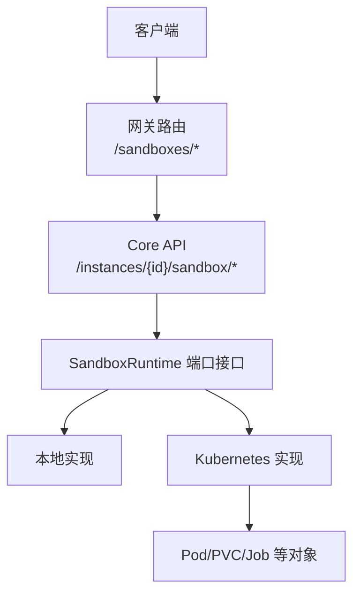
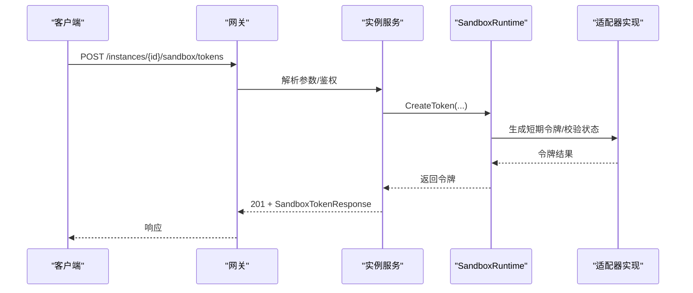
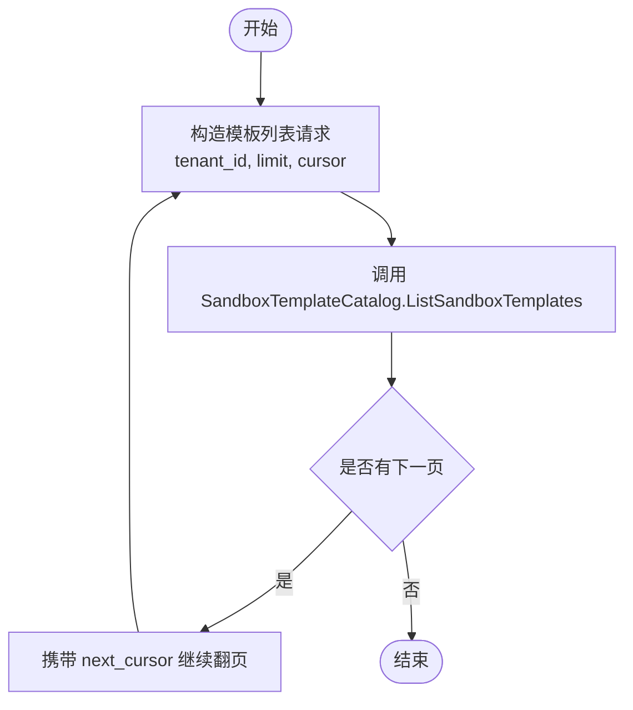
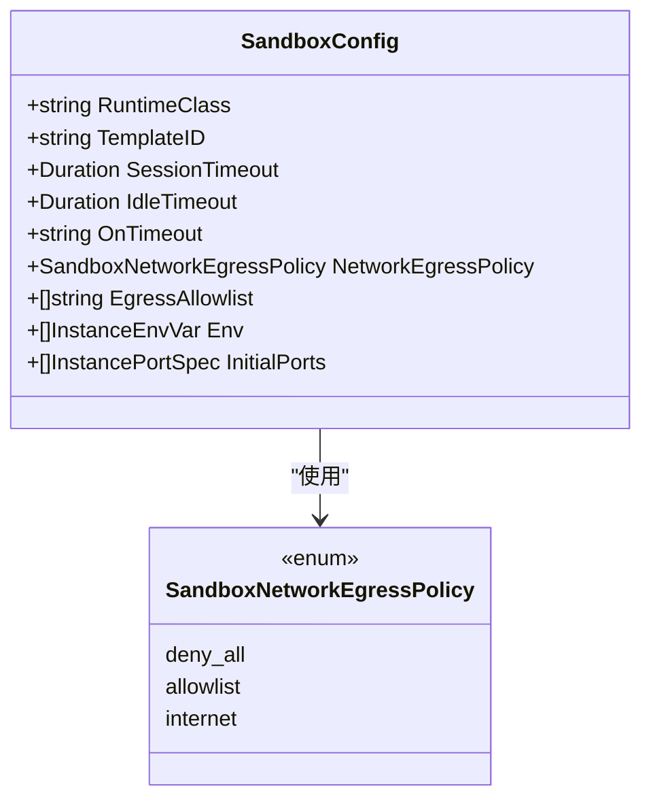
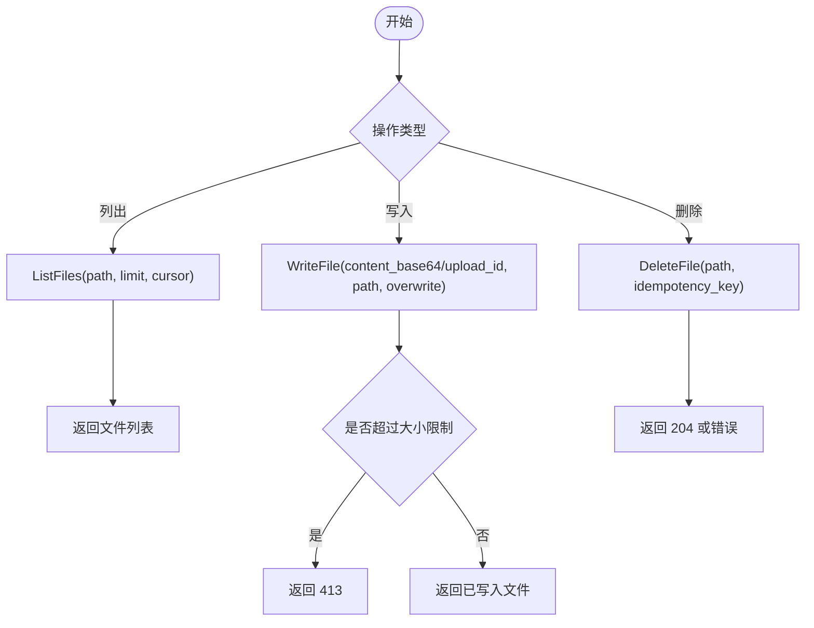
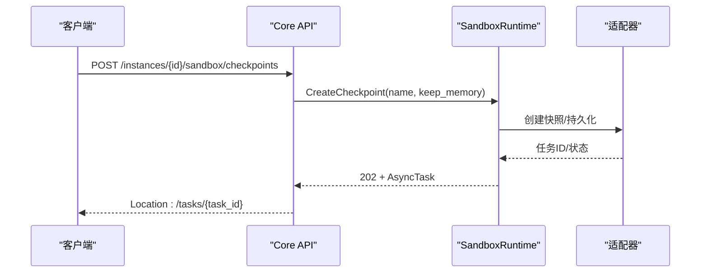
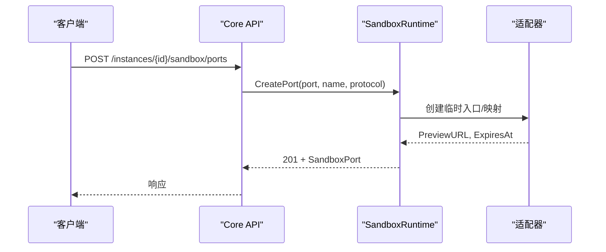
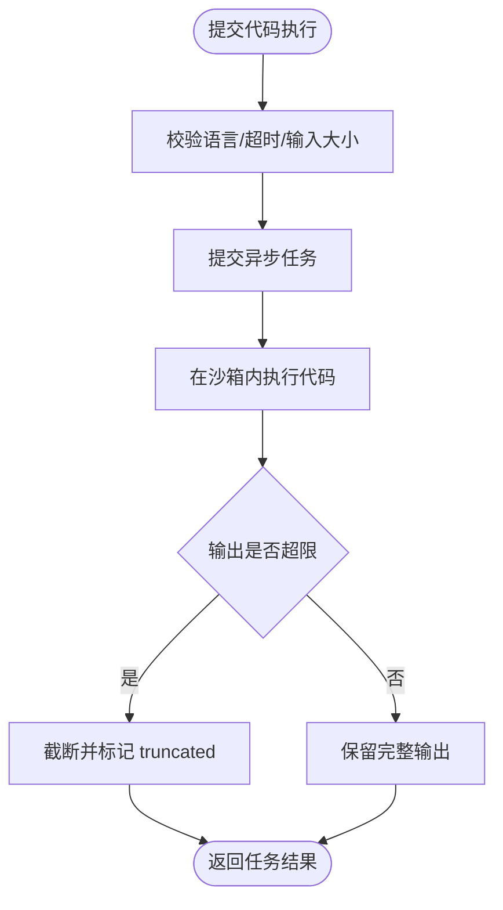
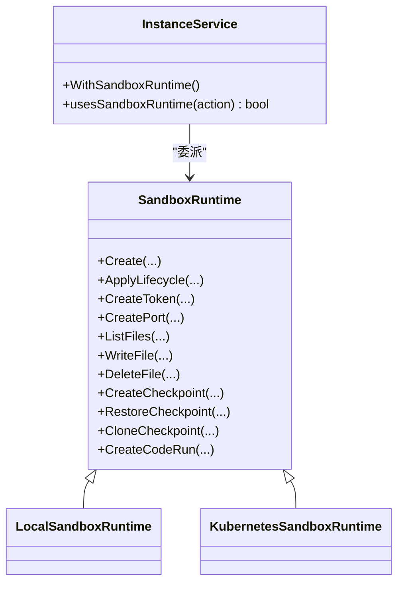
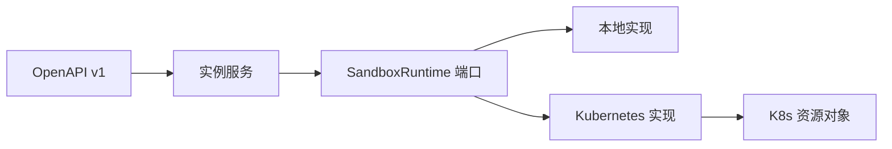

# 沙箱实例 API

<cite>
**本文引用的文件**
- [v1.yaml](file://repo/api/openapi/v1.yaml)
- [sandbox_runtime.go](file://repo/pkg/ports/sandbox_runtime.go)
- [sandbox_template_catalog.go](file://repo/pkg/ports/sandbox_template_catalog.go)
- [kubernetes_sandbox_runtime.go](file://repo/pkg/adapters/runtime/kubernetes_sandbox_runtime.go)
- [local_sandbox_runtime.go](file://repo/pkg/adapters/runtime/local_sandbox_runtime.go)
- [kubernetes_sandbox_checkpoints.go](file://repo/pkg/adapters/runtime/kubernetes_sandbox_checkpoints.go)
- [kubernetes_sandbox_files.go](file://repo/pkg/adapters/runtime/kubernetes_sandbox_files.go)
- [kubernetes_sandbox_ports.go](file://repo/pkg/adapters/runtime/kubernetes_sandbox_ports.go)
- [kubernetes_sandbox_pod_exec.go](file://repo/pkg/adapters/runtime/kubernetes_sandbox_pod_exec.go)
- [instance_service.go](file://repo/pkg/adapters/runtime/instance_service.go)
- [sandbox_resources.go](file://repo/services/ani-gateway/internal/router/sandbox_resources.go)
</cite>

## 目录
1. [简介](#简介)
2. [项目结构](#项目结构)
3. [核心组件](#核心组件)
4. [架构总览](#架构总览)
5. [详细组件分析](#详细组件分析)
6. [依赖关系分析](#依赖关系分析)
7. [性能与容量建议](#性能与容量建议)
8. [故障排查指南](#故障排查指南)
9. [结论](#结论)
10. [附录：API 参考](#附录api-参考)

## 简介
本文件面向“轻量级沙箱实例”的创建与管理，覆盖 AI 模型推理、数据处理等场景。文档聚焦以下能力：
- 沙箱模板管理：列出可用模板、按资源规格筛选。
- 隔离策略：网络出口策略（禁止全部/白名单/互联网）、进程与命名空间隔离。
- 资源配额控制：CPU、内存、存储及临时工作区大小限制。
- 数据持久化与临时存储：工作目录、快照/克隆、文件上传下载、清理策略。
- 安全策略：短期令牌、端口预览、代码执行、审计事件。
- 生命周期：创建、扩展、暂停、恢复、删除；异步任务与幂等键。

该 API 以 OpenAPI v1 为唯一契约来源，并通过运行时适配器对接具体实现（本地或 Kubernetes）。

## 项目结构
从仓库视角看，沙箱相关能力由三层组成：
- API 契约层：OpenAPI 定义沙箱相关的 REST 端点、请求/响应结构与错误码。
- 端口接口层：定义 SandboxRuntime 与 SandboxTemplateCatalog 抽象，屏蔽底层实现差异。
- 适配器实现层：提供本地与 Kubernetes 两种运行时实现，分别处理文件、端口、检查点、代码执行等。

图表来源
- [sandbox_resources.go:12-22](file://repo/services/ani-gateway/internal/router/sandbox_resources.go#L12-L22)
- [v1.yaml:4849-5156](file://repo/api/openapi/v1.yaml#L4849-L5156)
- [sandbox_runtime.go:278-296](file://repo/pkg/ports/sandbox_runtime.go#L278-L296)

章节来源
- [v1.yaml:4849-5156](file://repo/api/openapi/v1.yaml#L4849-L5156)
- [sandbox_runtime.go:278-296](file://repo/pkg/ports/sandbox_runtime.go#L278-L296)
- [sandbox_resources.go:12-22](file://repo/services/ani-gateway/internal/router/sandbox_resources.go#L12-L22)

## 核心组件
- SandboxRuntime 端口接口：统一封装沙箱实例的生命周期、令牌、端口、文件、检查点、代码执行等操作。
- SandboxTemplateCatalog 端口接口：提供沙箱模板列表查询，用于选择镜像与资源规格。
- 适配器实现：
  - 本地实现：适合开发调试，使用本地文件系统与进程模拟。
  - Kubernetes 实现：生产环境，基于 Pod、PVC、Job 等对象实现隔离与调度。

关键职责划分：
- 网关路由：暴露 /sandboxes/* 占位路由，实际业务通过 /instances/{id}/sandbox/* 完成。
- 实例服务：根据实例 kind 与动作路由到 SandboxRuntime。
- 运行时适配器：负责与底层资源交互，保证幂等、超时、错误映射。

章节来源
- [sandbox_runtime.go:15-296](file://repo/pkg/ports/sandbox_runtime.go#L15-L296)
- [sandbox_template_catalog.go:8-39](file://repo/pkg/ports/sandbox_template_catalog.go#L8-L39)
- [instance_service.go:31-88](file://repo/pkg/adapters/runtime/instance_service.go#L31-L88)
- [instance_service.go:884-1139](file://repo/pkg/adapters/runtime/instance_service.go#L884-L1139)
- [instance_service.go:1346-1360](file://repo/pkg/adapters/runtime/instance_service.go#L1346-L1360)

## 架构总览
沙箱实例管理的调用链如下：
- 客户端通过 Core API 访问沙箱子资源（令牌、端口、文件、检查点、代码执行）。
- 网关进行鉴权与租户隔离。
- 实例服务识别实例 kind 为 sandbox，并委派给 SandboxRuntime。
- 运行时适配器根据配置选择本地或 Kubernetes 实现，完成具体操作。

图表来源
- [v1.yaml:4849-4877](file://repo/api/openapi/v1.yaml#L4849-L4877)
- [sandbox_runtime.go:91-105](file://repo/pkg/ports/sandbox_runtime.go#L91-L105)
- [instance_service.go:884-1139](file://repo/pkg/adapters/runtime/instance_service.go#L884-L1139)

## 详细组件分析

### 沙箱模板管理
- 能力：列出平台提供的沙箱模板，包含镜像、描述、CPU/内存/存储规格、是否内置等元信息。
- 用途：在创建沙箱时选择合适的基础镜像与资源规格。
- 分页：支持 limit 与 cursor 游标分页。

图表来源
- [sandbox_template_catalog.go:8-39](file://repo/pkg/ports/sandbox_template_catalog.go#L8-L39)
- [v1.yaml:8323-8339](file://repo/api/openapi/v1.yaml#L8323-L8339)

章节来源
- [sandbox_template_catalog.go:8-39](file://repo/pkg/ports/sandbox_template_catalog.go#L8-L39)
- [v1.yaml:8323-8339](file://repo/api/openapi/v1.yaml#L8323-L8339)

### 隔离策略与资源配额
- 网络出口策略：
  - deny_all：禁止所有出站流量。
  - allowlist：仅允许白名单域名/IP。
  - internet：允许互联网访问。
- 会话与空闲超时：SessionTimeout、IdleTimeout，以及超时后的行为 OnTimeout。
- 初始端口：InitialPorts 声明沙箱启动时开放的内部端口。
- 环境变量：Env 注入运行所需的环境变量。
- 资源规格：模板中声明 CPU、内存、存储上限，结合运行时约束形成配额。

图表来源
- [sandbox_runtime.go:15-43](file://repo/pkg/ports/sandbox_runtime.go#L15-L43)

章节来源
- [sandbox_runtime.go:15-43](file://repo/pkg/ports/sandbox_runtime.go#L15-L43)

### 文件上传下载与临时存储
- 文件列表：按路径分页列出目录项，支持 limit/cursor。
- 写入文件：content_base64 或 upload_id 二选一；支持 overwrite 控制；超过 provider 限制返回 413。
- 删除文件：需 Idempotency-Key 保证幂等。
- 临时存储：工作目录与 PVC 绑定，检查点可持久化快照；清理策略受模板与运行时配置影响。

图表来源
- [v1.yaml:4932-5004](file://repo/api/openapi/v1.yaml#L4932-L5004)
- [sandbox_runtime.go:136-177](file://repo/pkg/ports/sandbox_runtime.go#L136-L177)

章节来源
- [v1.yaml:4932-5004](file://repo/api/openapi/v1.yaml#L4932-L5004)
- [sandbox_runtime.go:136-177](file://repo/pkg/ports/sandbox_runtime.go#L136-L177)

### 检查点与克隆
- 创建检查点：异步任务，支持 keep_memory；不支持内存快照时返回 422。
- 恢复检查点：将指定 checkpoint 恢复到原实例，返回异步任务。
- 克隆检查点：基于 checkpoint 创建新的独立沙箱实例，需独立的 idempotency_key 与 name。

图表来源
- [v1.yaml:5006-5058](file://repo/api/openapi/v1.yaml#L5006-L5058)
- [sandbox_runtime.go:179-233](file://repo/pkg/ports/sandbox_runtime.go#L179-L233)
- [kubernetes_sandbox_checkpoints.go:45-235](file://repo/pkg/adapters/runtime/kubernetes_sandbox_checkpoints.go#L45-L235)

章节来源
- [v1.yaml:5006-5122](file://repo/api/openapi/v1.yaml#L5006-L5122)
- [sandbox_runtime.go:179-233](file://repo/pkg/ports/sandbox_runtime.go#L179-L233)
- [kubernetes_sandbox_checkpoints.go:45-235](file://repo/pkg/adapters/runtime/kubernetes_sandbox_checkpoints.go#L45-L235)

### 端口预览与安全访问
- 开放端口：创建短期预览入口，不创建产品语义 Ingress；跨租户按 404；非 sandbox 或能力不足返回 422。
- 关闭端口：需 Idempotency-Key；返回预览端口状态。
- 短期令牌：为 running 状态的 sandbox 签发短期访问令牌，支持 scopes 与过期时间；重放保护。

图表来源
- [v1.yaml:4879-4930](file://repo/api/openapi/v1.yaml#L4879-L4930)
- [sandbox_runtime.go:107-134](file://repo/pkg/ports/sandbox_runtime.go#L107-L134)
- [kubernetes_sandbox_ports.go:1-200](file://repo/pkg/adapters/runtime/kubernetes_sandbox_ports.go#L1-L200)

章节来源
- [v1.yaml:4879-4930](file://repo/api/openapi/v1.yaml#L4879-L4930)
- [sandbox_runtime.go:107-134](file://repo/pkg/ports/sandbox_runtime.go#L107-L134)

### 代码执行
- 在 sandbox 内执行一次代码，返回异步任务；stdout/stderr 必须截断与标记 truncated；输入输出不得进入普通日志或审计。
- 适用于数据处理、模型推理脚本等短时任务。

图表来源
- [v1.yaml:5124-5156](file://repo/api/openapi/v1.yaml#L5124-L5156)
- [sandbox_runtime.go:235-257](file://repo/pkg/ports/sandbox_runtime.go#L235-L257)
- [kubernetes_sandbox_pod_exec.go:1-200](file://repo/pkg/adapters/runtime/kubernetes_sandbox_pod_exec.go#L1-L200)

章节来源
- [v1.yaml:5124-5156](file://repo/api/openapi/v1.yaml#L5124-L5156)
- [sandbox_runtime.go:235-257](file://repo/pkg/ports/sandbox_runtime.go#L235-L257)

### 生命周期与路由
- 网关路由：/sandboxes/* 作为占位路由，当前返回空态或示例响应。
- 实例服务：根据实例 kind 与动作判断是否走 SandboxRuntime；对 sandbox 专用动作进行路由。
- 适配器：本地与 Kubernetes 实现均遵循同一端口接口，便于切换与测试。

图表来源
- [instance_service.go:31-88](file://repo/pkg/adapters/runtime/instance_service.go#L31-L88)
- [instance_service.go:884-1139](file://repo/pkg/adapters/runtime/instance_service.go#L884-L1139)
- [instance_service.go:1346-1360](file://repo/pkg/adapters/runtime/instance_service.go#L1346-L1360)
- [sandbox_runtime.go:278-296](file://repo/pkg/ports/sandbox_runtime.go#L278-L296)
- [local_sandbox_runtime.go:1-200](file://repo/pkg/adapters/runtime/local_sandbox_runtime.go#L1-L200)
- [kubernetes_sandbox_runtime.go:1-200](file://repo/pkg/adapters/runtime/kubernetes_sandbox_runtime.go#L1-L200)

章节来源
- [sandbox_resources.go:12-22](file://repo/services/ani-gateway/internal/router/sandbox_resources.go#L12-L22)
- [instance_service.go:884-1139](file://repo/pkg/adapters/runtime/instance_service.go#L884-L1139)
- [instance_service.go:1346-1360](file://repo/pkg/adapters/runtime/instance_service.go#L1346-L1360)

## 依赖关系分析
- 对外契约：OpenAPI v1 定义沙箱子资源的端点、请求/响应、错误码与 RBAC scope。
- 内部接口：SandboxRuntime 与 SandboxTemplateCatalog 解耦上层 API 与下层实现。
- 适配器依赖：
  - 本地实现：依赖本地文件系统、进程管理与时钟模拟。
  - Kubernetes 实现：依赖 Pod、PVC、Job、REST 客户端等对象。
- 实例服务：依据实例 kind 与动作路由到对应运行时，确保 sandbox 专属逻辑不被误用。

图表来源
- [v1.yaml:4849-5156](file://repo/api/openapi/v1.yaml#L4849-L5156)
- [sandbox_runtime.go:278-296](file://repo/pkg/ports/sandbox_runtime.go#L278-L296)
- [instance_service.go:884-1139](file://repo/pkg/adapters/runtime/instance_service.go#L884-L1139)

章节来源
- [v1.yaml:4849-5156](file://repo/api/openapi/v1.yaml#L4849-L5156)
- [sandbox_runtime.go:278-296](file://repo/pkg/ports/sandbox_runtime.go#L278-L296)
- [instance_service.go:884-1139](file://repo/pkg/adapters/runtime/instance_service.go#L884-L1139)

## 性能与容量建议
- 异步任务：创建检查点、代码执行等采用异步模式，客户端应轮询任务状态或配置 Webhook。
- 幂等键：写操作（文件删除、端口关闭、检查点恢复）必须携带 Idempotency-Key，避免重复执行。
- 超时与限流：合理设置 SessionTimeout、IdleTimeout；对大文件上传与代码执行设置超时与大小限制。
- 分页：文件列表、检查点列表使用 limit/cursor，避免一次性拉取大量数据。
- 资源配额：通过模板与运行时配置限制 CPU/内存/存储，防止单实例占用过多资源。

[本节为通用指导，不直接分析具体文件]

## 故障排查指南
- 401/403：认证失败或权限不足，检查 JWT/API Key 与 RBAC scope。
- 404：跨租户访问或实例不存在，确认 tenant_id 与 instance_id。
- 409：冲突，如文件已存在且 overwrite=false、令牌重放过期。
- 413：文件大小超过 provider 限制，调整上传策略或分片。
- 422：前置条件失败，如非 sandbox kind、状态不满足、provider 能力不足。
- 异步任务：通过 Location 头获取任务 URL，轮询任务状态直至 completed/failed。

章节来源
- [v1.yaml:4849-5156](file://repo/api/openapi/v1.yaml#L4849-L5156)

## 结论
本 API 围绕沙箱实例提供了完整的生命周期管理能力，涵盖模板选择、隔离策略、资源配额、文件与检查点、端口预览与代码执行。通过统一的端口接口与适配器实现，既支持本地开发调试，也适配生产环境的 Kubernetes 部署。建议在集成时严格遵循幂等键、分页与异步任务模式，并结合 RBAC 与租户隔离保障安全性。

[本节为总结性内容，不直接分析具体文件]

## 附录：API 参考
- 令牌
  - POST /instances/{instance_id}/sandbox/tokens：签发短期访问令牌。
  - 响应：SandboxTokenResponse；错误：400/401/403/404/409/422。
- 端口
  - POST /instances/{instance_id}/sandbox/ports：开放临时预览端口。
  - DELETE /instances/{instance_id}/sandbox/ports/{port}：关闭预览端口。
  - 响应：SandboxPort；错误：400/401/403/404/409/422。
- 文件
  - GET /instances/{instance_id}/sandbox/files：列出文件。
  - POST /instances/{instance_id}/sandbox/files：写入文件。
  - DELETE /instances/{instance_id}/sandbox/files：删除文件。
  - 响应：SandboxFile/SandboxFileListResponse；错误：400/401/403/404/409/413/422。
- 检查点
  - POST /instances/{instance_id}/sandbox/checkpoints：创建检查点（异步）。
  - POST /instances/{instance_id}/sandbox/checkpoints/{checkpoint_id}/restore：恢复检查点（异步）。
  - POST /instances/{instance_id}/sandbox/checkpoints/{checkpoint_id}/clone：克隆检查点为新实例。
  - 响应：AsyncTask/CreateInstanceResponse；错误：400/401/403/404/409/422。
- 代码执行
  - POST /instances/{instance_id}/sandbox/code-runs：执行代码（异步）。
  - 响应：AsyncTask；错误：400/401/403/404/409/422。
- 模板
  - GET /sandbox-templates：列出沙箱模板。
  - 响应：SandboxTemplateListResponse；错误：401/403。

章节来源
- [v1.yaml:4849-5156](file://repo/api/openapi/v1.yaml#L4849-L5156)
- [v1.yaml:8323-8339](file://repo/api/openapi/v1.yaml#L8323-L8339)