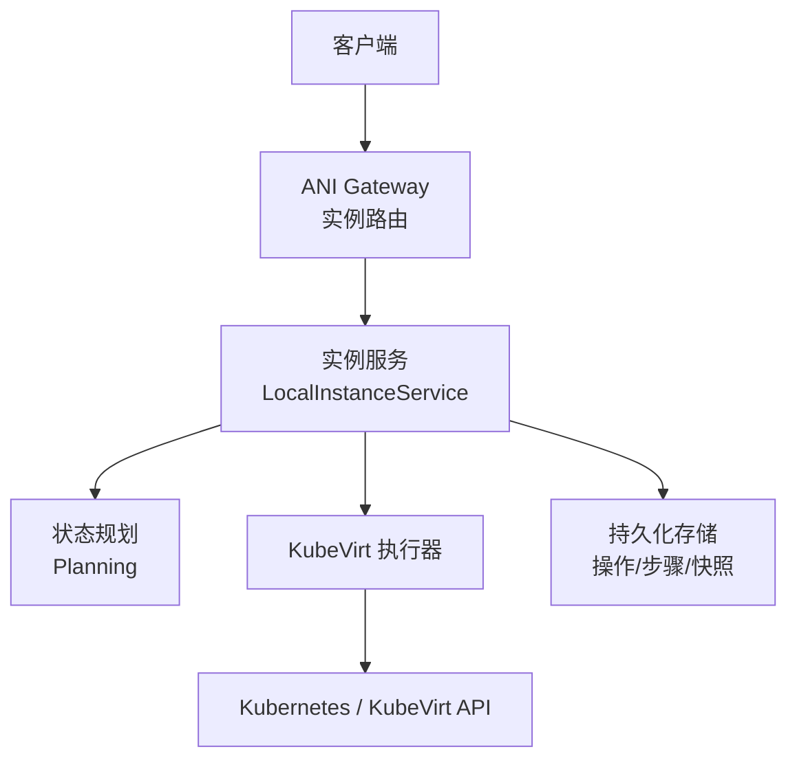
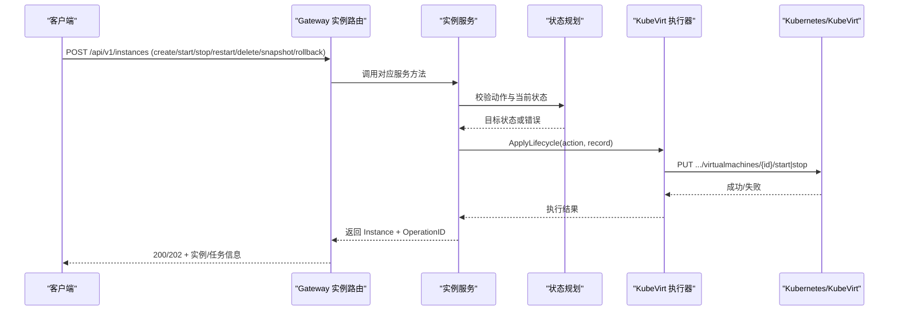
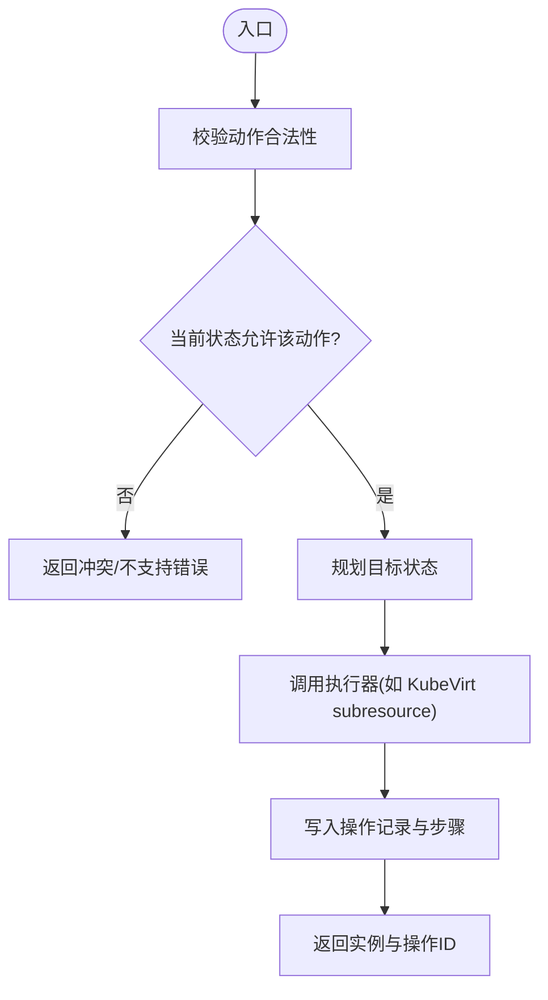
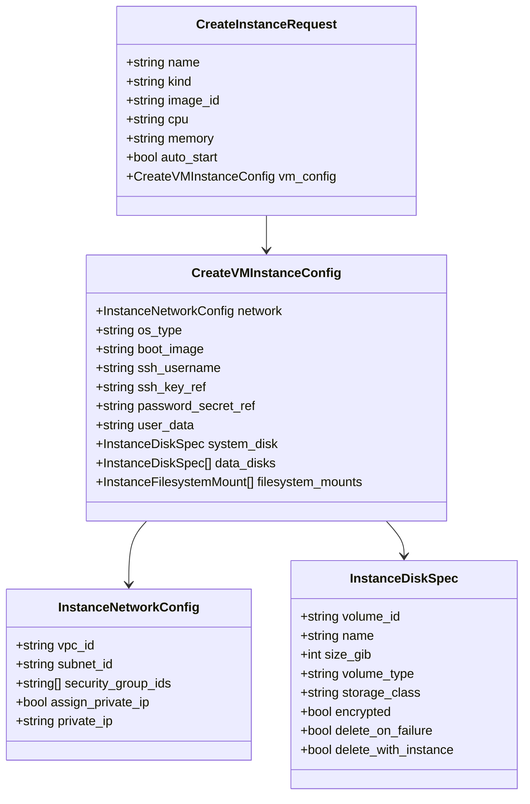
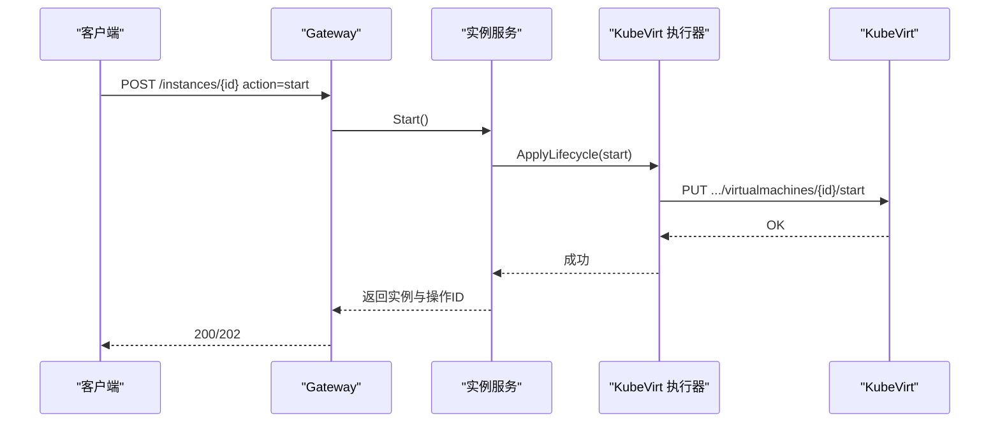
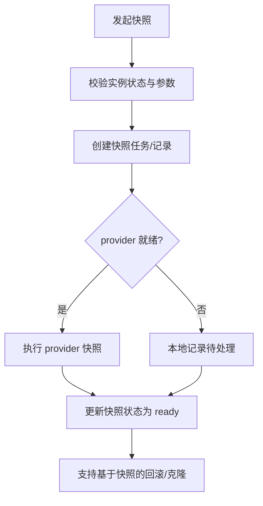
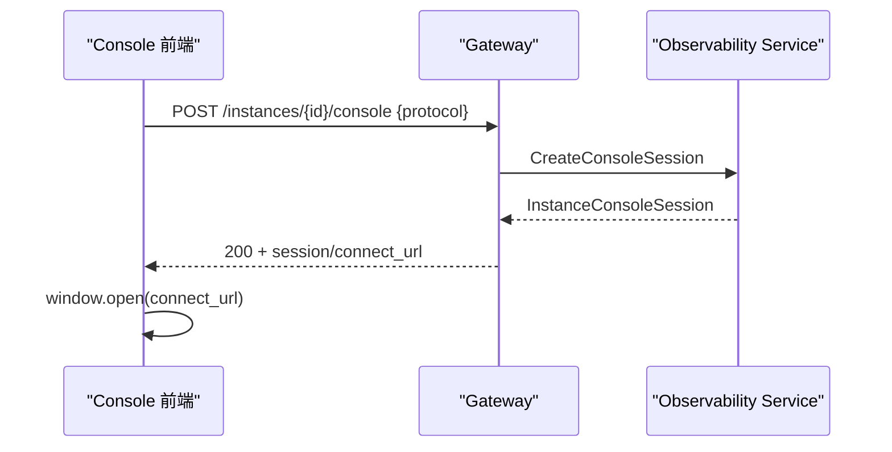
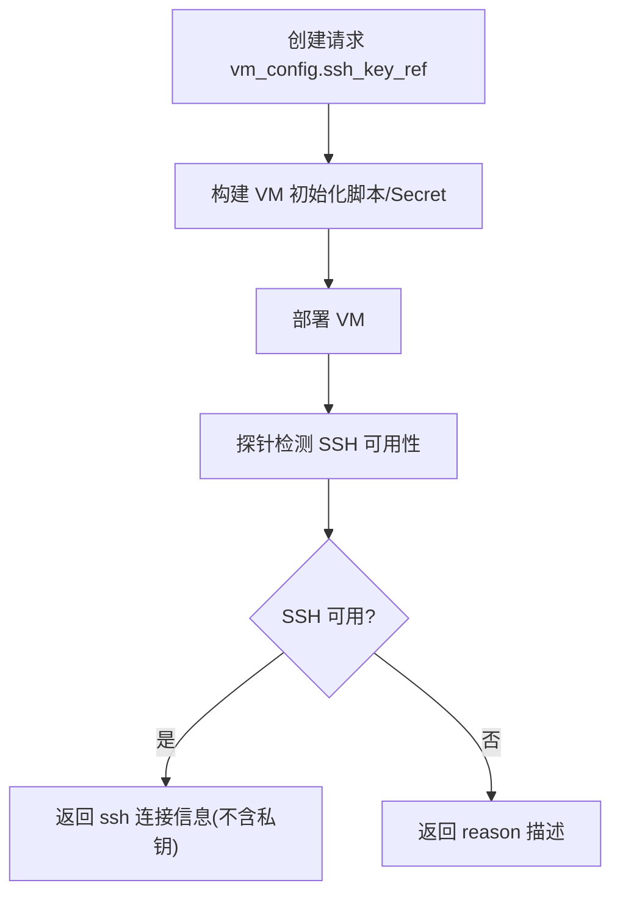
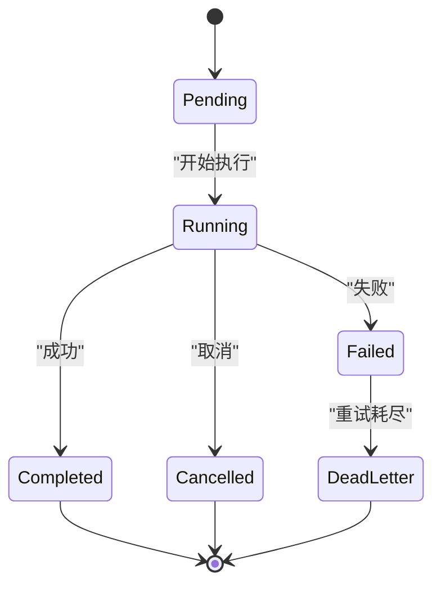
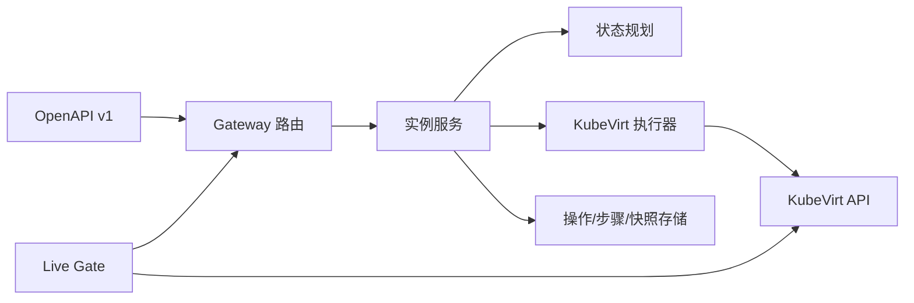

# 虚拟机实例 API

<cite>
**本文引用的文件**
- [v1.yaml](file://repo/api/openapi/v1.yaml)
- [instances.go](file://repo/services/ani-gateway/internal/router/instances.go)
- [planning.go](file://repo/pkg/adapters/runtime/planning.go)
- [instance_service.go](file://repo/pkg/adapters/runtime/instance_service.go)
- [kubernetes_lifecycle_executor_test.go](file://repo/pkg/adapters/runtime/kubernetes_lifecycle_executor_test.go)
- [validate_instance_management_live_gate.py](file://repo/scripts/validate_instance_management_live_gate.py)
- [ConsoleTab.tsx](file://repo/frontends/console/src/features/instance-observability/ConsoleTab.tsx)
- [issue-001-core-console-session-handler.md](file://repo/development-records/console-instance-observability-console-a.md)
- [prd-console-vm-snapshot-restore.md](file://repo/services/tasks/modules/prd/console/compute/prd-console-vm-snapshot-restore.md)
- [async_task_store.go](file://repo/pkg/adapters/runtime/async_task_store.go)
</cite>

## 目录
1. [简介](#简介)
2. [项目结构](#项目结构)
3. [核心组件](#核心组件)
4. [架构总览](#架构总览)
5. [详细组件分析](#详细组件分析)
6. [依赖关系分析](#依赖关系分析)
7. [性能考虑](#性能考虑)
8. [故障排查指南](#故障排查指南)
9. [结论](#结论)
10. [附录](#附录)

## 简介
本文件面向使用 KubeVirt 的虚拟机（VM）实例管理，提供端到端 API 文档与实现说明。覆盖 VM 完整生命周期（创建、启动、停止、重启、删除）、配置参数（CPU、内存、磁盘、网络、GPU 直通/切片、快照与回滚）、运维接口（控制台/VNC/串口、SSH 信息注入）、状态机转换、异步任务处理与错误处理机制。所有行为以 Core OpenAPI v1 契约为准，Gateway 路由将请求转发至实例服务与底层 Kubernetes/KubeVirt 资源。

## 项目结构
- API 契约：OpenAPI v1 定义实例、操作、快照等模型与统一错误格式。
- Gateway 路由：解析请求体、校验参数、调用实例服务并返回统一响应。
- 实例服务：编排生命周期动作、校验状态机、持久化操作记录与步骤。
- 执行器：通过 KubeVirt subresource 调用 start/stop/restart 等。
- 观测与门禁：Live Gate 验证 create/start/stop/delete 及 console/VNC/serial 能力。

图表来源
- [instances.go:103-1576](file://repo/services/ani-gateway/internal/router/instances.go#L103-L1576)
- [instance_service.go:669-696](file://repo/pkg/adapters/runtime/instance_service.go#L669-L696)
- [planning.go:413-452](file://repo/pkg/adapters/runtime/planning.go#L413-L452)
- [kubernetes_lifecycle_executor_test.go:40-69](file://repo/pkg/adapters/runtime/kubernetes_lifecycle_executor_test.go#L40-L69)

章节来源
- [v1.yaml:1-39](file://repo/api/openapi/v1.yaml#L1-L39)
- [instances.go:103-1576](file://repo/services/ani-gateway/internal/router/instances.go#L103-L1576)

## 核心组件
- OpenAPI 契约：定义实例、操作、快照、错误、分页、异步任务等模型。
- Gateway 实例路由：接收创建/生命周期/快照/卷挂载等操作，映射到实例服务方法。
- 实例服务：封装 Create/Start/Stop/Restart/Delete/Snapshot/Rollback/AttachVolume/DetachVolume 等。
- 状态规划：根据当前实例状态与期望动作，判定是否允许并计算目标状态。
- KubeVirt 执行器：通过 subresource 调用 VirtualMachine 的 start/stop。
- 异步任务与操作记录：统一 AsyncTask 与 InstanceOperation/Steps 追踪进度。

章节来源
- [v1.yaml:351-373](file://repo/api/openapi/v1.yaml#L351-L373)
- [v1.yaml:1109-1144](file://repo/api/openapi/v1.yaml#L1109-L1144)
- [instance_service.go:669-696](file://repo/pkg/adapters/runtime/instance_service.go#L669-L696)
- [planning.go:413-452](file://repo/pkg/adapters/runtime/planning.go#L413-L452)
- [kubernetes_lifecycle_executor_test.go:40-69](file://repo/pkg/adapters/runtime/kubernetes_lifecycle_executor_test.go#L40-L69)

## 架构总览
下图展示 VM 生命周期从 API 到 KubeVirt 的关键路径：Gateway 路由解析请求并调用实例服务；实例服务进行状态规划与权限检查；执行器调用 KubeVirt subresource；结果写入操作记录与步骤，并通过异步任务对外暴露进度。

图表来源
- [instances.go:1553-1576](file://repo/services/ani-gateway/internal/router/instances.go#L1553-L1576)
- [instance_service.go:669-696](file://repo/pkg/adapters/runtime/instance_service.go#L669-L696)
- [kubernetes_lifecycle_executor_test.go:40-69](file://repo/pkg/adapters/runtime/kubernetes_lifecycle_executor_test.go#L40-L69)

## 详细组件分析

### 生命周期 API 与状态机
- 支持的动作：create、start、stop、restart、delete、snapshot、rollback、attach/detach volume/filesystem、scale、update_image、pause/resume、extend、touch_idle、console_session。
- 状态机约束：
  - pause 仅允许 running → stopped；resume 仅允许 stopped → running。
  - snapshot/attach/detach/rollback 等不允许在 deleted/deleting 状态执行。
  - rollback 对 VM 要求提供 snapshot_id；容器类要求 revision。
- 执行路径：
  - Gateway 路由根据 action 分发到 service.Start/Stop/Restart/Delete/Snapshot/Rollback 等。
  - 实例服务调用 planning 校验并生成目标状态。
  - 执行器通过 KubeVirt subresource 完成 start/stop。

图表来源
- [planning.go:413-452](file://repo/pkg/adapters/runtime/planning.go#L413-L452)
- [instance_service.go:669-696](file://repo/pkg/adapters/runtime/instance_service.go#L669-L696)
- [instances.go:1553-1576](file://repo/services/ani-gateway/internal/router/instances.go#L1553-L1576)

章节来源
- [v1.yaml:1109-1144](file://repo/api/openapi/v1.yaml#L1109-L1144)
- [planning.go:413-452](file://repo/pkg/adapters/runtime/planning.go#L413-L452)
- [instance_service.go:1154-1201](file://repo/pkg/adapters/runtime/instance_service.go#L1154-L1201)
- [kubernetes_lifecycle_executor_test.go:40-69](file://repo/pkg/adapters/runtime/kubernetes_lifecycle_executor_test.go#L40-L69)

### 创建 VM 的配置参数
- 共享字段：name、kind=vm、image/image_id/image_ref、cpu、memory、auto_start、termination_protection、network_config。
- VM 专用配置 vm_config：
  - os_type、boot_image、ssh_username、ssh_key_ref、password_secret_ref、user_data/cloud_init_secret。
  - system_disk、data_disks、filesystem_mounts。
- 网络：vpc/subnet/security_group/private_ip。
- 存储：系统盘作为 root disk，数据盘可多块；文件系统挂载支持只读/读写。
- GPU：VM 本身不直接声明 GPU 调度；GPU 相关能力由 gpu_container 规格与调度模块承担。

图表来源
- [v1.yaml:1156-1247](file://repo/api/openapi/v1.yaml#L1156-L1247)
- [instances.go:103-1576](file://repo/services/ani-gateway/internal/router/instances.go#L103-L1576)

章节来源
- [v1.yaml:1156-1247](file://repo/api/openapi/v1.yaml#L1156-L1247)
- [instances.go:2680-2709](file://repo/services/ani-gateway/internal/router/instances.go#L2680-L2709)

### 启动/停止/重启/删除
- 启动：调用 KubeVirt VirtualMachine start subresource。
- 停止：调用 KubeVirt VirtualMachine stop subresource。
- 重启：通过实例服务的 Restart 包装为 restart 动作。
- 删除：进入 deleting→deleted 流程，清理资源并更新状态。

图表来源
- [kubernetes_lifecycle_executor_test.go:40-69](file://repo/pkg/adapters/runtime/kubernetes_lifecycle_executor_test.go#L40-L69)
- [instance_service.go:669-696](file://repo/pkg/adapters/runtime/instance_service.go#L669-L696)
- [instances.go:1553-1576](file://repo/services/ani-gateway/internal/router/instances.go#L1553-L1576)

章节来源
- [kubernetes_lifecycle_executor_test.go:40-69](file://repo/pkg/adapters/runtime/kubernetes_lifecycle_executor_test.go#L40-L69)
- [instance_service.go:669-696](file://repo/pkg/adapters/runtime/instance_service.go#L669-L696)

### 快照与回滚（克隆）
- 快照：通过 lifecycle snapshot 触发 provider-native 快照；实例记录中维护 snapshots 元数据。
- 回滚：VM 回滚需指定 snapshot_id；容器类回滚需 revision。
- 克隆：快照可作为克隆源，结合创建流程复用镜像/卷。

图表来源
- [v1.yaml:1078-1093](file://repo/api/openapi/v1.yaml#L1078-L1093)
- [instance_service.go:1154-1201](file://repo/pkg/adapters/runtime/instance_service.go#L1154-L1201)
- [prd-console-vm-snapshot-restore.md:1-22](file://repo/services/tasks/modules/prd/console/compute/prd-console-vm-snapshot-restore.md#L1-L22)

章节来源
- [v1.yaml:1078-1093](file://repo/api/openapi/v1.yaml#L1078-L1093)
- [instance_service.go:1154-1201](file://repo/pkg/adapters/runtime/instance_service.go#L1154-L1201)
- [prd-console-vm-snapshot-restore.md:1-22](file://repo/services/tasks/modules/prd/console/compute/prd-console-vm-snapshot-restore.md#L1-L22)

### 控制台访问（VNC/Serial/Console）
- 协议白名单：console、vnc、novnc、serial。
- 条件：仅 kind=vm 且 state=running 可创建会话；无权限返回 403；非法协议返回 400；非 running 返回 422。
- 返回：session_id、protocol、connect_url、url、expires_at；前端在新窗口打开 connect_url。

图表来源
- [issue-001-core-console-session-handler.md:18-54](file://repo/development-records/console-instance-observability-console-a.md#L18-L54)
- [ConsoleTab.tsx:1-60](file://repo/frontends/console/src/features/instance-observability/ConsoleTab.tsx#L1-L60)

章节来源
- [issue-001-core-console-session-handler.md:18-54](file://repo/development-records/console-instance-observability-console-a.md#L18-L54)
- [ConsoleTab.tsx:1-60](file://repo/frontends/console/src/features/instance-observability/ConsoleTab.tsx#L1-L60)

### SSH 密钥注入与连接信息
- 创建时可通过 vm_config.ssh_key_ref 注入公钥；也可使用 password_secret_ref。
- 实例详情返回 ssh 对象：username、host、port、key_ref、ready、reason；不包含私钥明文。
- Live Gate 会探测 console 与 serial 通道，间接验证 VM 可达性。

图表来源
- [v1.yaml:1227-1247](file://repo/api/openapi/v1.yaml#L1227-L1247)
- [v1.yaml:1015-1027](file://repo/api/openapi/v1.yaml#L1015-L1027)
- [validate_instance_management_live_gate.py:330-398](file://repo/scripts/validate_instance_management_live_gate.py#L330-L398)

章节来源
- [v1.yaml:1227-1247](file://repo/api/openapi/v1.yaml#L1227-L1247)
- [v1.yaml:1015-1027](file://repo/api/openapi/v1.yaml#L1015-L1027)
- [validate_instance_management_live_gate.py:330-398](file://repo/scripts/validate_instance_management_live_gate.py#L330-L398)

### GPU 直通与切片（与 VM 的关系）
- VM 本身不直接声明 GPU 调度；GPU 能力通过 gpu_container 规格与调度模块实现。
- 调度策略支持整卡 nvidia.com/gpu 与 vGPU 切片 nvidia.com/vgpu；队列由 Volcano 管理。
- VM 若需 GPU，通常通过驱动/设备插件方式在 Guest OS 内使用宿主 GPU；平台侧以容器/GPU 容器为主。

章节来源
- [v1.yaml:1277-1319](file://repo/api/openapi/v1.yaml#L1277-L1319)
- [instances.go:2680-2709](file://repo/services/ani-gateway/internal/router/instances.go#L2680-L2709)

### 异步任务与操作记录
- 所有长耗时操作返回 AsyncTask，支持轮询或 Webhook。
- InstanceOperation 包含 steps，记录每个子步骤的状态与时间戳。
- 异步任务状态包括 pending、running、completed、failed、cancelled、dead_letter。

图表来源
- [v1.yaml:351-373](file://repo/api/openapi/v1.yaml#L351-L373)
- [async_task_store.go:278-337](file://repo/pkg/adapters/runtime/async_task_store.go#L278-L337)

章节来源
- [v1.yaml:351-373](file://repo/api/openapi/v1.yaml#L351-L373)
- [async_task_store.go:278-337](file://repo/pkg/adapters/runtime/async_task_store.go#L278-L337)

## 依赖关系分析
- Gateway 路由依赖 OpenAPI 契约与实例服务接口。
- 实例服务依赖状态规划、执行器与存储。
- 执行器依赖 KubeVirt subresource API。
- Live Gate 依赖真实集群与 KubeVirt，用于端到端验证。

图表来源
- [v1.yaml:1-39](file://repo/api/openapi/v1.yaml#L1-L39)
- [instances.go:103-1576](file://repo/services/ani-gateway/internal/router/instances.go#L103-L1576)
- [kubernetes_lifecycle_executor_test.go:40-69](file://repo/pkg/adapters/runtime/kubernetes_lifecycle_executor_test.go#L40-L69)
- [validate_instance_management_live_gate.py:330-398](file://repo/scripts/validate_instance_management_live_gate.py#L330-L398)

章节来源
- [v1.yaml:1-39](file://repo/api/openapi/v1.yaml#L1-L39)
- [instances.go:103-1576](file://repo/services/ani-gateway/internal/router/instances.go#L103-L1576)

## 性能考虑
- 幂等键：创建与生命周期操作均支持 idempotency_key，避免重复提交导致资源抖动。
- 短路径优化：start/stop 通过 subresource 直接操作，减少中间层开销。
- 异步化：长耗时操作（快照、卷挂载）通过 AsyncTask 与 Steps 解耦，提升吞吐。
- 观察收敛：reconcile 与状态同步采用退避与去重，降低频繁查询压力。

[本节为通用指导，不直接分析具体文件]

## 故障排查指南
- 常见错误码：UNAUTHORIZED、FORBIDDEN、NOT_FOUND、CONFLICT、BAD_REQUEST、RATE_LIMIT_EXCEEDED、NOT_IMPLEMENTED、INTERNAL_ERROR。
- 状态冲突：在非运行态尝试 pause 或在已删除态执行其他操作会返回冲突错误。
- 权限问题：控制台会话需要 scope:instances:console；无权限返回 403。
- Provider 不可用：KubeVirt 不可达或 subresource 失败时，执行器返回错误，上层转为业务错误码。
- 日志与审计：InstanceOperation.steps 记录每步状态与消息，便于定位失败点。

章节来源
- [v1.yaml:28-31](file://repo/api/openapi/v1.yaml#L28-L31)
- [planning.go:413-452](file://repo/pkg/adapters/runtime/planning.go#L413-L452)
- [issue-001-core-console-session-handler.md:18-54](file://repo/development-records/console-instance-observability-console-a.md#L18-L54)

## 结论
本 API 以 OpenAPI v1 为唯一契约，Gateway 路由与实例服务共同实现 VM 全生命周期管理。通过状态规划与 KubeVirt subresource 执行器，确保启停等关键操作的可靠性；快照与回滚提供数据保护与快速恢复；控制台/VNC/串口与会话机制满足运维需求；异步任务与操作记录保障可观测性与可追溯性。建议在生产环境结合 Live Gate 持续验证端到端能力。

[本节为总结，不直接分析具体文件]

## 附录
- 常用端点参考：
  - 创建实例：POST /api/v1/instances
  - 生命周期：POST /api/v1/instances/{instance_id}（action=start|stop|restart|delete|snapshot|rollback|...）
  - 控制台会话：POST /api/v1/instances/{instance_id}/console
  - 任务查询：GET /api/v1/tasks/{task_id}
- 建议实践：
  - 始终传递 idempotency_key 保证幂等。
  - 使用 vm_config 而非扁平别名，避免歧义。
  - 通过 InstanceOperation.steps 跟踪长耗时操作进度。
  - 控制台会话仅在 running 状态申请，注意过期时间。

[本节为补充信息，不直接分析具体文件]