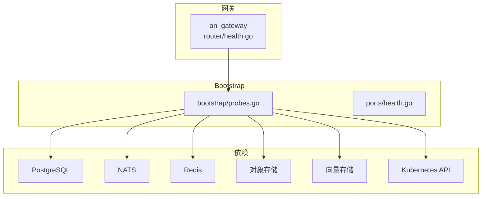
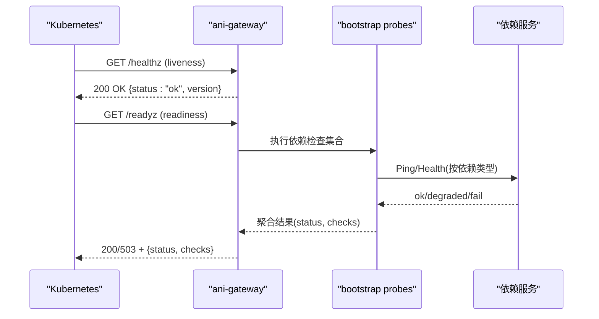
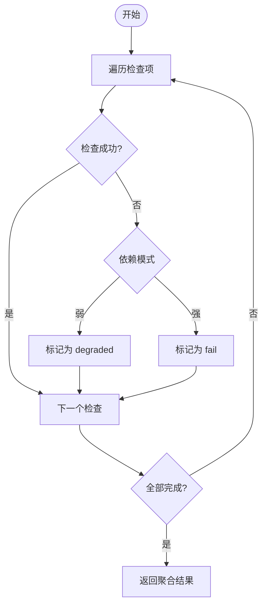
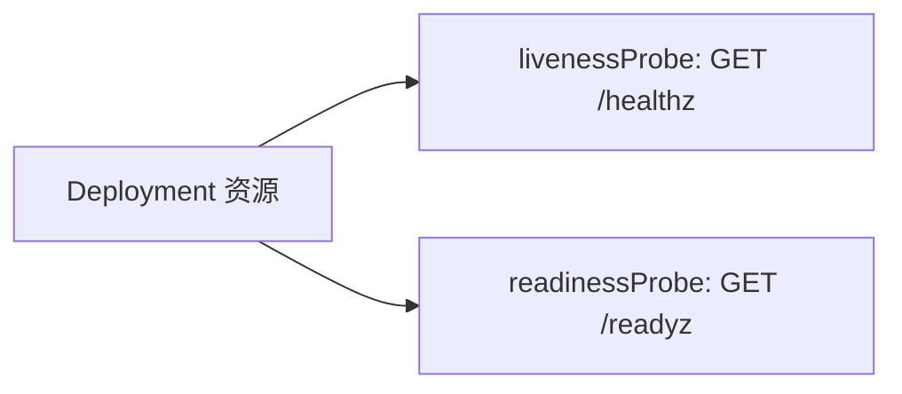
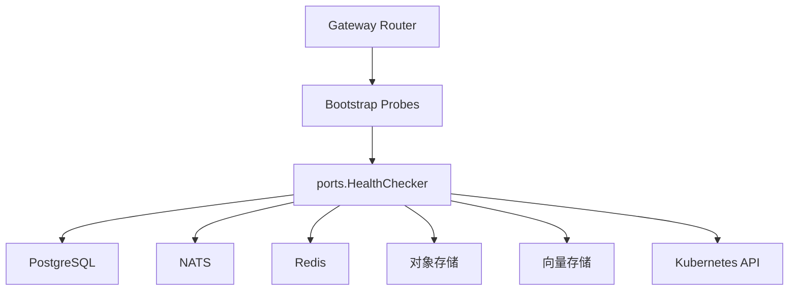

# 健康检查接口

<cite>
**本文引用的文件**
- [probes.go](file://repo/pkg/bootstrap/probes.go)
- [health.go](file://repo/services/ani-gateway/internal/router/health.go)
- [health.go](file://repo/pkg/ports/health.go)
- [deps.go](file://repo/pkg/bootstrap/deps.go)
- [sprint13-production-shaped-gateway-deployment.yaml](file://repo/deploy/real-k8s-lab/sprint13-production-shaped-gateway-deployment.yaml)
- [metering-service-live-deps.yaml](file://repo/deploy/real-k8s-lab/metering-service-live-deps.yaml)
- [sprint13-instance-observability-loki-live.yaml](file://repo/deploy/real-k8s-lab/sprint13-instance-observability-loki-live.yaml)
- [sprint13-objectstore-minio-live.yaml](file://repo/deploy/real-k8s-lab/sprint13-objectstore-minio-live.yaml)
- [sprint13-vectorstore-milvus-live.yaml](file://repo/deploy/real-k8s-lab/sprint13-vectorstore-milvus-live.yaml)
- [test_backend_apis.py](file://repo/scripts/test_backend_apis.py)
</cite>

## 目录
1. [简介](#简介)
2. [项目结构](#项目结构)
3. [核心组件](#核心组件)
4. [架构总览](#架构总览)
5. [详细组件分析](#详细组件分析)
6. [依赖关系分析](#依赖关系分析)
7. [性能与可用性考虑](#性能与可用性考虑)
8. [故障排查指南](#故障排查指南)
9. [结论](#结论)
10. [附录](#附录)

## 简介
本文件面向 ANI 平台的健康检查能力，覆盖以下主题：
- 系统就绪探针（readiness）与存活探针（liveness）端点
- 服务依赖状态检查（数据库、消息队列、缓存、对象存储、向量库、Kubernetes API）
- Kubernetes liveness/readiness 探针配置示例
- 自定义健康检查逻辑与扩展方式
- 标准化健康检查结果格式与错误处理机制
- 高级能力：外部服务可用性检测、依赖强弱模式对就绪态的影响

该文档既适合运维人员配置 K8s 探针，也适合开发者扩展新的健康检查项。

## 项目结构
健康检查在两个层面实现：
- Gateway 层：提供 /healthz、/readyz、/health、/ready 四个 HTTP 端点，用于对外暴露进程级与健康聚合结果。
- Bootstrap 层：提供可复用的健康检查框架，统一组装依赖检查项、度量输出和响应格式。

图表来源
- [health.go:25-37](file://repo/services/ani-gateway/internal/router/health.go#L25-L37)
- [probes.go:37-57](file://repo/pkg/bootstrap/probes.go#L37-L57)
- [health.go:5-7](file://repo/pkg/ports/health.go#L5-L7)

章节来源
- [health.go:25-37](file://repo/services/ani-gateway/internal/router/health.go#L25-L37)
- [probes.go:37-57](file://repo/pkg/bootstrap/probes.go#L37-L57)

## 核心组件
- 健康检查处理器
  - 提供 /healthz、/readyz、/metrics 等端点，统一封装响应体结构与状态码。
  - 支持将多个依赖检查项组合为一次就绪检查，按“强/弱”依赖策略决定整体状态。
- 依赖检查清单
  - 内置检查项：postgres、nats、redis、object-store、vector-store、kubernetes-api。
  - 未配置的可选依赖（如对象存储、向量存储、Kubernetes API）不会导致失败；已配置则必须通过。
- 端口契约
  - HealthChecker 接口定义统一的 Health(ctx) 方法，便于各适配器实现健康探测。
- 网关健康路由
  - ani-gateway 暴露 /healthz、/readyz、/health、/ready，其中 /health 与 /healthz 语义等价，/ready 与 /readyz 语义等价。

章节来源
- [probes.go:19-35](file://repo/pkg/bootstrap/probes.go#L19-L35)
- [probes.go:144-218](file://repo/pkg/bootstrap/probes.go#L144-L218)
- [health.go:5-7](file://repo/pkg/ports/health.go#L5-L7)
- [health.go:25-57](file://repo/services/ani-gateway/internal/router/health.go#L25-L57)

## 架构总览
下图展示从 K8s 到服务的健康检查调用链路与依赖探测过程。

图表来源
- [health.go:25-37](file://repo/services/ani-gateway/internal/router/health.go#L25-L37)
- [probes.go:37-57](file://repo/pkg/bootstrap/probes.go#L37-L57)
- [probes.go:102-136](file://repo/pkg/bootstrap/probes.go#L102-L136)

## 详细组件分析

### 存活探针（/healthz 与 /health）
- 行为
  - 返回进程是否存活，不检查任何依赖。
  - 响应包含 status 与版本信息。
- 适用场景
  - K8s livenessProbe 使用，用于快速发现进程崩溃或死锁。
- 状态码
  - 始终返回 200。

章节来源
- [health.go:25-44](file://repo/services/ani-gateway/internal/router/health.go#L25-L44)

### 就绪探针（/readyz 与 /ready）
- 行为
  - 执行一组依赖检查，汇总为 checks 列表。
  - 任一强依赖失败 → 整体 fail，HTTP 503。
  - 仅弱依赖失败 → 整体 degraded，HTTP 200。
- 默认检查项
  - 若未显式注册检查项，会包含一个 process 检查，保证至少有一个条目。
- 适用场景
  - K8s readinessProbe 使用，控制流量进入。

章节来源
- [probes.go:45-52](file://repo/pkg/bootstrap/probes.go#L45-L52)
- [probes.go:102-136](file://repo/pkg/bootstrap/probes.go#L102-L136)

### 依赖检查清单与强弱模式
- 内置依赖检查
  - postgres：连接池 Ping
  - nats：连接状态 IsConnected
  - redis：Ping
  - object-store：Health（未配置时视为通过）
  - vector-store：Health（未配置时视为通过）
  - kubernetes-api：Health（未配置时视为通过）
- 强弱依赖判定
  - 通过依赖名称映射为 DependencyMode，区分强/弱。
  - 弱依赖失败标记为 degraded，不影响整体就绪。
  - 强依赖失败直接标记为 fail。

图表来源
- [probes.go:102-136](file://repo/pkg/bootstrap/probes.go#L102-L136)
- [probes.go:144-218](file://repo/pkg/bootstrap/probes.go#L144-L218)

章节来源
- [probes.go:144-218](file://repo/pkg/bootstrap/probes.go#L144-L218)

### 指标端点（/metrics）
- 行为
  - 输出 reconciler 相关 Prometheus 指标（ticks、successes、failures、backoff skips）。
  - 当存在 metrics reader 时注入对应指标，否则输出空集。
- 用途
  - 供 Prometheus 抓取，观察控制器运行状况。

章节来源
- [probes.go:53-87](file://repo/pkg/bootstrap/probes.go#L53-L87)

### 标准响应格式
- 通用字段
  - status：字符串，取值包括 ok、degraded、fail。
  - version：可选，当前健康检查协议版本。
  - checks：键值映射，key 为检查名，value 包含 status、latency_ms、error。
- 状态码
  - liveness：总是 200。
  - readiness：根据聚合结果返回 200 或 503。

章节来源
- [probes.go:25-35](file://repo/pkg/bootstrap/probes.go#L25-L35)
- [probes.go:138-142](file://repo/pkg/bootstrap/probes.go#L138-L142)
- [health.go:13-23](file://repo/services/ani-gateway/internal/router/health.go#L13-L23)

### 扩展：新增自定义健康检查
- 步骤
  1) 实现 ports.HealthChecker 接口（Health(ctx) error）。
  2) 在 bootstrap 中注册为依赖检查项，或通过服务启动流程挂载到 probes 检查集合。
  3) 如需影响就绪态，确保依赖名称正确以匹配强弱模式。
- 建议
  - 对网络 I/O 增加超时与上下文取消。
  - 对可降级依赖使用弱模式，避免误杀 Pod。

章节来源
- [health.go:5-7](file://repo/pkg/ports/health.go#L5-L7)
- [probes.go:144-218](file://repo/pkg/bootstrap/probes.go#L144-L218)

### 数据库连接检查
- 检查项：postgres
- 行为：调用连接池 Ping，失败则强依赖失败。
- 建议：确保连接池参数合理，避免探针风暴导致连接耗尽。

章节来源
- [probes.go:148-157](file://repo/pkg/bootstrap/probes.go#L148-L157)

### 消息队列状态验证
- 检查项：nats
- 行为：检查 NATS 客户端是否已连接。
- 建议：结合重试与退避，避免瞬时抖动导致频繁重启。

章节来源
- [probes.go:158-168](file://repo/pkg/bootstrap/probes.go#L158-L168)

### 缓存服务可用性检测
- 检查项：redis
- 行为：调用 Redis Ping。
- 建议：对只读路径可降级为弱依赖，避免缓存不可用阻断业务。

章节来源
- [probes.go:169-178](file://repo/pkg/bootstrap/probes.go#L169-L178)

### 对象存储可用性检测
- 检查项：object-store
- 行为：调用 ObjectStore.Health；未配置时视为通过。
- 建议：根据业务关键性选择强弱模式。

章节来源
- [probes.go:179-191](file://repo/pkg/bootstrap/probes.go#L179-L191)

### 向量存储可用性检测
- 检查项：vector-store
- 行为：调用 VectorStore.Health；未配置时视为通过。
- 建议：向量库不可用时可按需降级查询路径。

章节来源
- [probes.go:192-204](file://repo/pkg/bootstrap/probes.go#L192-L204)

### Kubernetes API 可用性检测
- 检查项：kubernetes-api
- 行为：调用 KubernetesAPI.Health；未配置时视为通过。
- 建议：控制面不可达时应尽快让 Pod 退出就绪，避免调度流量。

章节来源
- [probes.go:205-218](file://repo/pkg/bootstrap/probes.go#L205-L218)

### Kubernetes 探针配置示例
- Gateway 部署示例
  - 使用 /healthz 作为 livenessProbe
  - 使用 /readyz 作为 readinessProbe
- 其他服务示例
  - metering-service、Loki、MinIO、Milvus 等均展示了 readiness/liveness 的 YAML 片段

图表来源
- [sprint13-production-shaped-gateway-deployment.yaml:162-168](file://repo/deploy/real-k8s-lab/sprint13-production-shaped-gateway-deployment.yaml#L162-L168)
- [metering-service-live-deps.yaml:83-88](file://repo/deploy/real-k8s-lab/metering-service-live-deps.yaml#L83-L88)
- [sprint13-instance-observability-loki-live.yaml:210-216](file://repo/deploy/real-k8s-lab/sprint13-instance-observability-loki-live.yaml#L210-L216)
- [sprint13-objectstore-minio-live.yaml:61-67](file://repo/deploy/real-k8s-lab/sprint13-objectstore-minio-live.yaml#L61-L67)
- [sprint13-vectorstore-milvus-live.yaml:183](file://repo/deploy/real-k8s-lab/sprint13-vectorstore-milvus-live.yaml#L183)

章节来源
- [sprint13-production-shaped-gateway-deployment.yaml:162-168](file://repo/deploy/real-k8s-lab/sprint13-production-shaped-gateway-deployment.yaml#L162-L168)
- [metering-service-live-deps.yaml:83-88](file://repo/deploy/real-k8s-lab/metering-service-live-deps.yaml#L83-L88)
- [sprint13-instance-observability-loki-live.yaml:210-216](file://repo/deploy/real-k8s-lab/sprint13-instance-observability-loki-live.yaml#L210-L216)
- [sprint13-objectstore-minio-live.yaml:61-67](file://repo/deploy/real-k8s-lab/sprint13-objectstore-minio-live.yaml#L61-L67)
- [sprint13-vectorstore-milvus-live.yaml:183](file://repo/deploy/real-k8s-lab/sprint13-vectorstore-milvus-live.yaml#L183)

### 端到端验证脚本
- 脚本位置：test_backend_apis.py
- 覆盖范围：Gateway 的 /healthz、/readyz、/health、/ready 均被测试调用，可用于冒烟验证。

章节来源
- [test_backend_apis.py:174-178](file://repo/scripts/test_backend_apis.py#L174-L178)

## 依赖关系分析
- 组件耦合
  - Gateway 仅负责路由与响应格式化，健康检查逻辑集中在 bootstrap。
  - 依赖检查通过 ports 抽象解耦具体实现，便于替换与扩展。
- 直接依赖
  - PostgreSQL、NATS、Redis、对象存储、向量存储、Kubernetes API。
- 间接依赖
  - 通过 Capabilities 注入运行时能力，健康检查可复用这些能力进行更深层探测。

图表来源
- [health.go:25-37](file://repo/services/ani-gateway/internal/router/health.go#L25-L37)
- [probes.go:144-218](file://repo/pkg/bootstrap/probes.go#L144-L218)
- [health.go:5-7](file://repo/pkg/ports/health.go#L5-L7)
- [deps.go:25-87](file://repo/pkg/bootstrap/deps.go#L25-L87)

章节来源
- [deps.go:25-87](file://repo/pkg/bootstrap/deps.go#L25-L87)
- [probes.go:144-218](file://repo/pkg/bootstrap/probes.go#L144-L218)

## 性能与可用性考虑
- 探针频率与超时
  - 建议 liveness 间隔略大于 readiness，避免频繁重启。
  - 为每个依赖检查设置合理的超时，防止探针阻塞。
- 依赖强弱
  - 非关键依赖（如缓存、对象存储）建议使用弱模式，避免误伤就绪态。
- 指标采集
  - /metrics 仅在需要时启用，避免额外开销。
- 并发与限流
  - 高并发下避免同时触发大量依赖检查，必要时在网关层做节流。

[本节为通用指导，不直接分析具体文件]

## 故障排查指南
- 常见症状
  - /readyz 返回 503：检查 checks 中哪个依赖失败，定位强依赖问题。
  - /readyz 返回 200 但状态为 degraded：弱依赖异常，需评估是否影响业务。
- 排查步骤
  1) 查看 /readyz 响应中的 checks 列表，确认失败项与错误信息。
  2) 检查对应依赖的连接配置与网络可达性。
  3) 若为可选依赖未配置，确认是否为预期行为。
  4) 调整依赖强弱模式，避免误判。
- 日志与指标
  - 结合 /metrics 与业务日志定位瓶颈。
  - 关注 reconcile 控制器指标，判断是否存在持续失败。

章节来源
- [probes.go:102-136](file://repo/pkg/bootstrap/probes.go#L102-L136)
- [probes.go:53-87](file://repo/pkg/bootstrap/probes.go#L53-L87)

## 结论
ANI 平台提供了标准化的健康检查能力：
- 明确的 liveness/readiness 端点，便于 K8s 编排。
- 可组合的依赖检查清单，支持强弱依赖策略。
- 统一的响应格式与指标输出，利于监控与告警。
- 可扩展的 HealthChecker 接口，便于接入新依赖。

建议在生产环境：
- 为关键依赖配置强模式，为非关键依赖配置弱模式。
- 合理设置探针间隔与超时，避免探针风暴。
- 定期演练依赖故障，验证就绪态切换是否符合预期。

[本节为总结性内容，不直接分析具体文件]

## 附录
- 常用命令
  - 验证 Gateway 健康：curl http://<gateway>/healthz 与 curl http://<gateway>/readyz
  - 参考脚本：test_backend_apis.py 中已包含对 /healthz、/readyz、/health、/ready 的调用
- 参考部署
  - Gateway、metering-service、Loki、MinIO、Milvus 的 readiness/liveness 配置示例见 deploy/real-k8s-lab 下的 YAML

章节来源
- [test_backend_apis.py:174-178](file://repo/scripts/test_backend_apis.py#L174-L178)
- [sprint13-production-shaped-gateway-deployment.yaml:162-168](file://repo/deploy/real-k8s-lab/sprint13-production-shaped-gateway-deployment.yaml#L162-L168)
- [metering-service-live-deps.yaml:83-88](file://repo/deploy/real-k8s-lab/metering-service-live-deps.yaml#L83-L88)
- [sprint13-instance-observability-loki-live.yaml:210-216](file://repo/deploy/real-k8s-lab/sprint13-instance-observability-loki-live.yaml#L210-L216)
- [sprint13-objectstore-minio-live.yaml:61-67](file://repo/deploy/real-k8s-lab/sprint13-objectstore-minio-live.yaml#L61-L67)
- [sprint13-vectorstore-milvus-live.yaml:183](file://repo/deploy/real-k8s-lab/sprint13-vectorstore-milvus-live.yaml#L183)