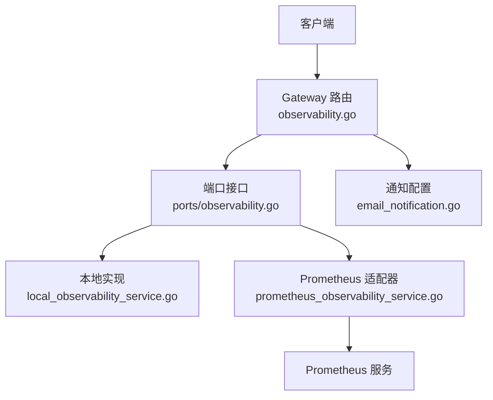
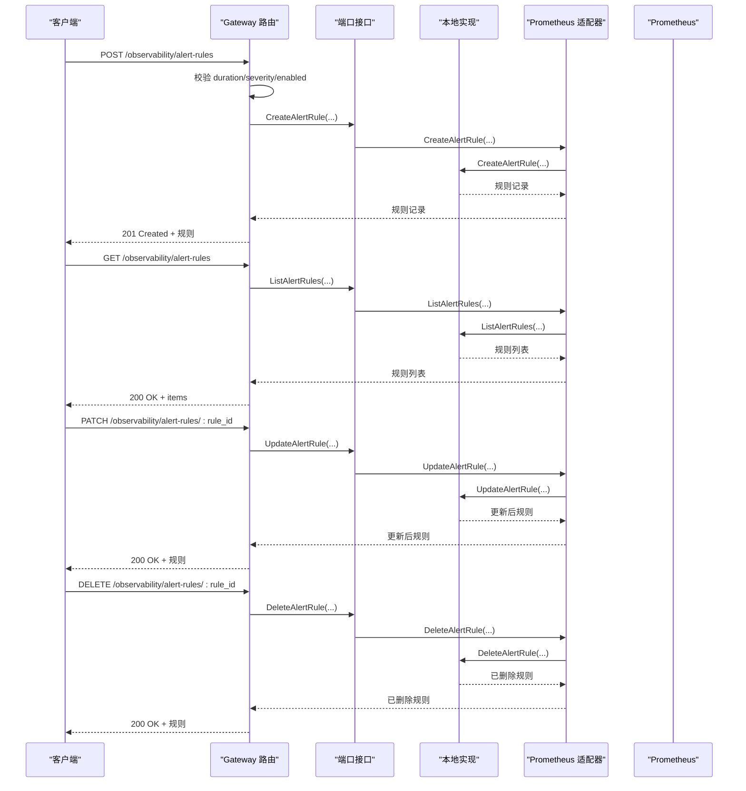
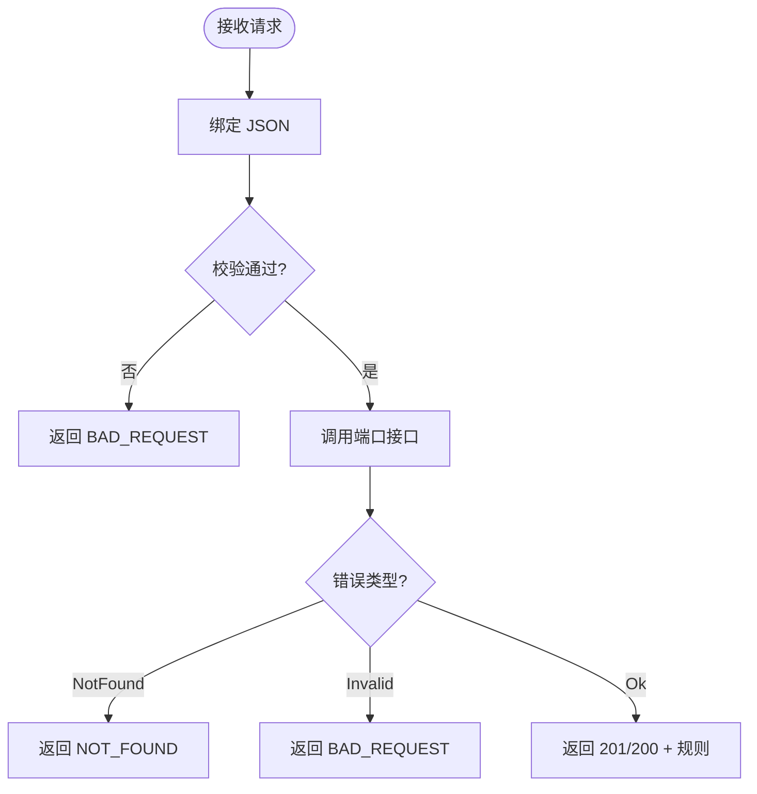
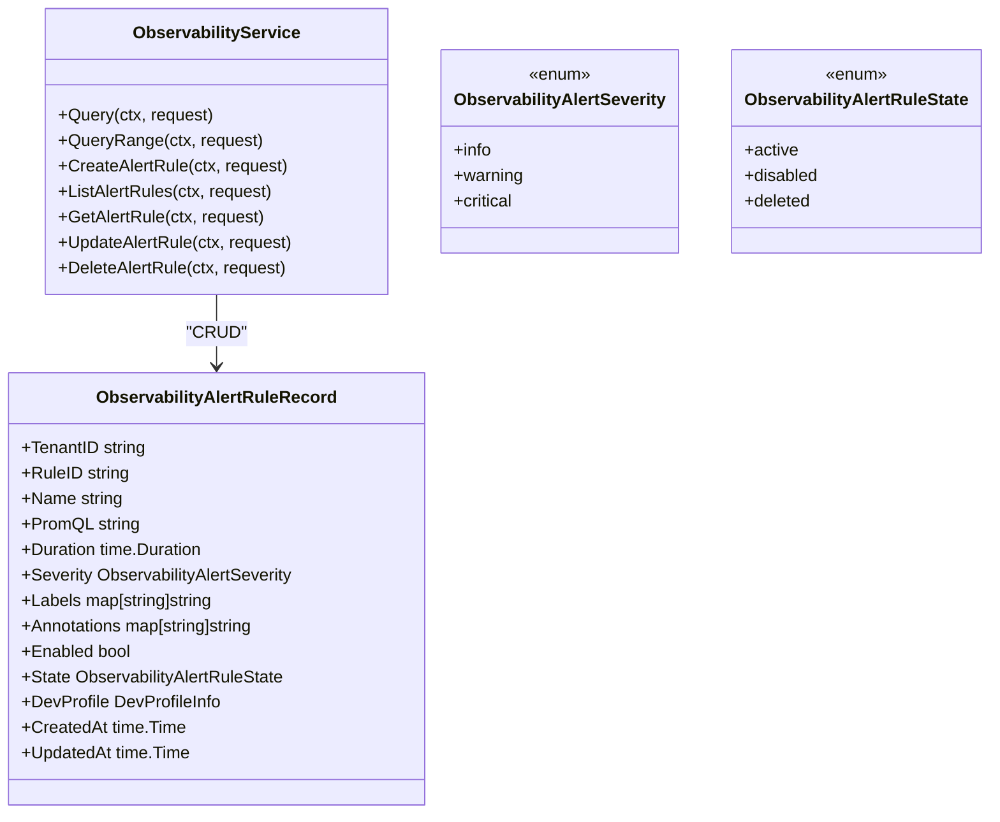
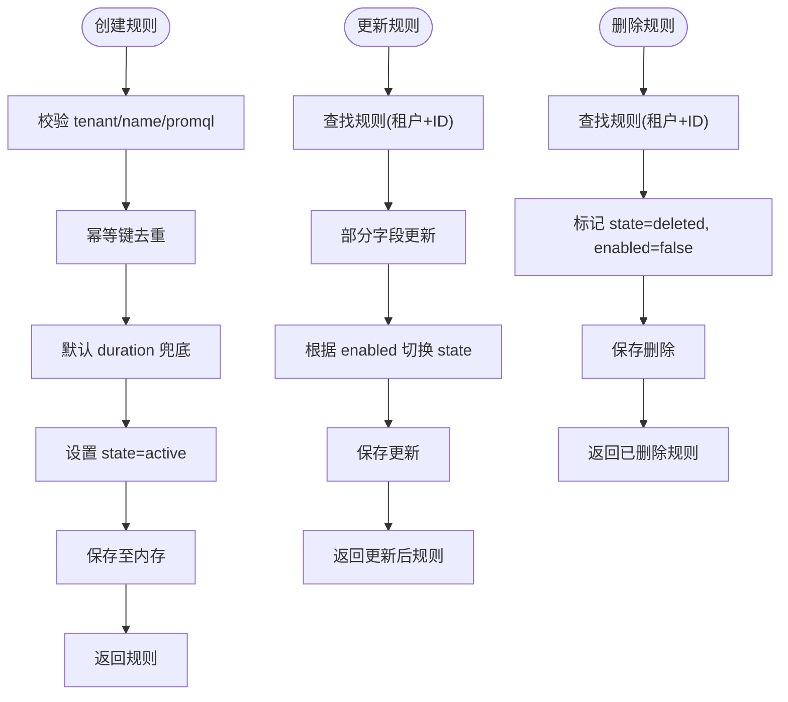
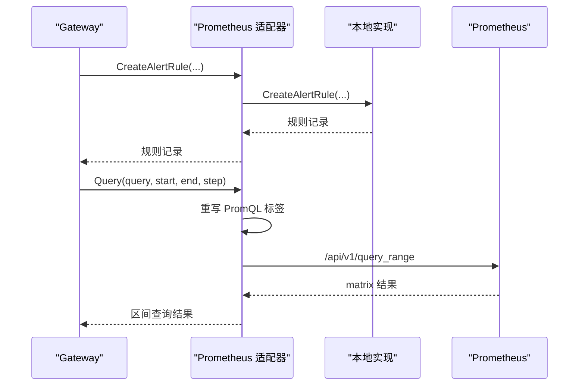
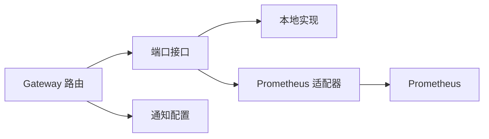

# 告警规则管理

<cite>
**本文引用的文件**
- [observability.go](file://repo/services/ani-gateway/internal/router/observability.go)
- [prometheus_observability_service.go](file://repo/pkg/adapters/runtime/prometheus_observability_service.go)
- [local_observability_service.go](file://repo/pkg/adapters/runtime/local_observability_service.go)
- [observability.go](file://repo/pkg/ports/observability.go)
- [core-v1-compatibility-baseline.yaml](file://repo/api/core-v1-compatibility-baseline.yaml)
- [email_notification.go](file://repo/pkg/ports/email_notification.go)
- [local_email_notification_store.go](file://repo/pkg/adapters/runtime/local_email_notification_store.go)
</cite>

## 目录
1. [简介](#简介)
2. [项目结构](#项目结构)
3. [核心组件](#核心组件)
4. [架构总览](#架构总览)
5. [详细组件分析](#详细组件分析)
6. [依赖关系分析](#依赖关系分析)
7. [性能与可用性](#性能与可用性)
8. [故障排查指南](#故障排查指南)
9. [结论](#结论)
10. [附录：API 参考](#附录api-参考)

## 简介
本章节面向“告警规则管理”能力，覆盖告警规则的创建、更新、删除、查询等 CRUD 操作；说明 PromQL 表达式编写、阈值配置（通过 duration 与 PromQL）、严重级别设置；并介绍本地实现、Prometheus 代理、通知配置、规则测试验证与历史查询等配套能力。当前仓库实现了基于内存的本地告警规则存储与 Prometheus 可观测性查询代理，并通过 Gateway 暴露 REST API。

## 项目结构
与告警规则管理直接相关的代码分布在以下位置：
- 网关路由层：定义 /observability/alert-rules 的 REST 接口，负责请求校验、参数转换与响应序列化。
- 端口抽象层：定义 ObservabilityService 接口与告警规则相关的数据模型、枚举与错误语义。
- 运行时适配器：
  - 本地实现：提供内存中的告警规则 CRUD、幂等键去重、状态机（active/disabled/deleted）。
  - Prometheus 适配器：将查询转发到真实 Prometheus，并将告警规则 CRUD 委托给本地实现。
- API 契约：OpenAPI 规范中定义了 CreateObservabilityAlertRuleRequest 等数据结构。
- 通知子系统：邮件 SMTP 配置与收件人管理，为后续告警通知提供通道。

图表来源
- [observability.go:95-103](file://repo/services/ani-gateway/internal/router/observability.go#L95-L103)
- [observability.go:135-143](file://repo/pkg/ports/observability.go#L135-L143)
- [prometheus_observability_service.go:18-36](file://repo/pkg/adapters/runtime/prometheus_observability_service.go#L18-L36)

章节来源
- [observability.go:95-103](file://repo/services/ani-gateway/internal/router/observability.go#L95-L103)
- [observability.go:135-143](file://repo/pkg/ports/observability.go#L135-L143)

## 核心组件
- 网关路由 observability.go
  - 注册 /observability/alert-rules 的 GET/POST/PATCH/DELETE 接口。
  - 解析请求体，校验 duration、severity、enabled 等字段，调用端口接口完成 CRUD。
  - 统一错误映射：NOT_FOUND、BAD_REQUEST。
- 端口接口 ports/observability.go
  - 定义 ObservabilityService 接口，包含 Query、QueryRange 以及告警规则 CRUD。
  - 定义告警严重级别（info/warning/critical）与规则状态（active/disabled/deleted）。
  - 定义规则记录结构与请求/响应类型。
- 本地实现 local_observability_service.go
  - 内存存储规则，支持幂等键防重、默认 duration 兜底、状态机转换、软删除。
  - 列表按更新时间倒序返回，过滤已删除规则。
- Prometheus 适配器 prometheus_observability_service.go
  - 将 Query/QueryRange 转发到真实 Prometheus，重写 PromQL 标签以适配实例命名空间与 Pod 名。
  - 将告警规则 CRUD 委托给本地实现，不直接写入 Prometheus。
- 通知配置 email_notification.go
  - 平台级 SMTP 配置与收件人管理，用于后续告警通知发送。

章节来源
- [observability.go:20-40](file://repo/services/ani-gateway/internal/router/observability.go#L20-L40)
- [observability.go:156-254](file://repo/services/ani-gateway/internal/router/observability.go#L156-L254)
- [observability.go:135-143](file://repo/pkg/ports/observability.go#L135-L143)
- [local_observability_service.go:77-204](file://repo/pkg/adapters/runtime/local_observability_service.go#L77-L204)
- [prometheus_observability_service.go:388-411](file://repo/pkg/adapters/runtime/prometheus_observability_service.go#L388-L411)
- [email_notification.go:9-55](file://repo/pkg/ports/email_notification.go#L9-L55)

## 架构总览
告警规则管理的整体流程如下：
- 客户端通过 Gateway 的 /observability/alert-rules 接口进行 CRUD。
- Gateway 校验请求参数，调用 ports.ObservabilityService。
- 在开发/本地环境，使用 LocalObservabilityService 在内存中持久化规则。
- 在生产环境，PrometheusObservabilityService 将查询转发至 Prometheus，但告警规则仍由本地实现管理（元数据与执行解耦）。
- 通知系统通过邮件 SMTP 配置，为后续告警事件提供发送通道。

图表来源
- [observability.go:95-103](file://repo/services/ani-gateway/internal/router/observability.go#L95-L103)
- [observability.go:156-254](file://repo/services/ani-gateway/internal/router/observability.go#L156-L254)
- [prometheus_observability_service.go:388-411](file://repo/pkg/adapters/runtime/prometheus_observability_service.go#L388-L411)
- [local_observability_service.go:77-204](file://repo/pkg/adapters/runtime/local_observability_service.go#L77-L204)

## 详细组件分析

### 网关路由层：告警规则 REST 接口
- 路由注册：GET/POST/PATCH/DELETE /observability/alert-rules。
- 请求校验：
  - duration：必须为正数 Go duration 字符串。
  - severity：必须为 info/warning/critical。
  - enabled：可选布尔，默认启用。
  - idempotency_key：用于幂等创建/更新。
- 响应结构：包含 id、tenant_id、name、promql、duration、severity、labels、annotations、enabled、state、dev_profile、created_at、updated_at。
- 错误处理：统一映射 NOT_FOUND、BAD_REQUEST。

图表来源
- [observability.go:156-254](file://repo/services/ani-gateway/internal/router/observability.go#L156-L254)
- [observability.go:338-347](file://repo/services/ani-gateway/internal/router/observability.go#L338-L347)

章节来源
- [observability.go:95-103](file://repo/services/ani-gateway/internal/router/observability.go#L95-L103)
- [observability.go:156-254](file://repo/services/ani-gateway/internal/router/observability.go#L156-L254)
- [observability.go:338-347](file://repo/services/ani-gateway/internal/router/observability.go#L338-L347)

### 端口接口与数据模型
- ObservabilityService 接口：
  - Query、QueryRange：指标查询。
  - CreateAlertRule、ListAlertRules、GetAlertRule、UpdateAlertRule、DeleteAlertRule：告警规则 CRUD。
- 告警严重级别：info、warning、critical。
- 规则状态：active、disabled、deleted。
- 规则记录：包含租户、规则ID、名称、PromQL、持续时间、严重级别、标签、注解、启用状态、状态、开发配置文件、创建/更新时间。

图表来源
- [observability.go:135-143](file://repo/pkg/ports/observability.go#L135-L143)
- [observability.go:83-133](file://repo/pkg/ports/observability.go#L83-L133)

章节来源
- [observability.go:135-143](file://repo/pkg/ports/observability.go#L135-L143)
- [observability.go:83-133](file://repo/pkg/ports/observability.go#L83-L133)

### 本地实现：内存中的告警规则管理
- 创建规则：
  - 校验 tenant_id、name、promql。
  - 使用 idempotency_key 去重，避免重复创建。
  - 默认 duration 兜底（若未提供则使用默认值）。
  - 生成 RuleID，设置 state=active，记录时间戳。
- 列表查询：
  - 过滤已删除规则，按更新时间倒序返回。
- 获取规则：
  - 校验 tenant_id 与 rule_id，不存在或已删除返回 NOT_FOUND。
- 更新规则：
  - 支持部分更新 name、promql、duration、severity、labels、annotations、enabled。
  - 根据 enabled 切换 state（active/disabled）。
- 删除规则：
  - 软删除：标记 state=deleted，同时 disabled。

图表来源
- [local_observability_service.go:77-204](file://repo/pkg/adapters/runtime/local_observability_service.go#L77-L204)

章节来源
- [local_observability_service.go:77-204](file://repo/pkg/adapters/runtime/local_observability_service.go#L77-L204)

### Prometheus 适配器：查询与规则委托
- 查询功能：
  - 重写 PromQL 中的 namespace/pod/name 标签，匹配真实租户命名空间与 Pod 名前缀。
  - 转发到 Prometheus /api/v1/query 与 /api/v1/query_range。
  - 对 NaN/Inf 采样点进行过滤，保证结果可用。
- 告警规则功能：
  - 所有 CRUD 操作均委托给本地实现，不直接写入 Prometheus。
  - 确保规则作为元数据独立于指标查询链路。

图表来源
- [prometheus_observability_service.go:94-176](file://repo/pkg/adapters/runtime/prometheus_observability_service.go#L94-L176)
- [prometheus_observability_service.go:388-411](file://repo/pkg/adapters/runtime/prometheus_observability_service.go#L388-L411)

章节来源
- [prometheus_observability_service.go:94-176](file://repo/pkg/adapters/runtime/prometheus_observability_service.go#L94-L176)
- [prometheus_observability_service.go:388-411](file://repo/pkg/adapters/runtime/prometheus_observability_service.go#L388-L411)

### 通知配置：邮件 SMTP 与收件人
- 平台级 SMTP 配置：
  - 支持主机、端口、加密方式、发件人地址、用户名、密码/授权码。
  - 密码与授权码以安全方式存储，仅暴露是否设置的标志位。
- 收件人管理：
  - 支持创建、更新、删除收件人，标记启用/禁用。
- 订阅与批量更新：
  - 支持批量更新订阅开关，便于集中管理告警通知策略。

章节来源
- [email_notification.go:9-55](file://repo/pkg/ports/email_notification.go#L9-L55)
- [local_email_notification_store.go:140-191](file://repo/pkg/adapters/runtime/local_email_notification_store.go#L140-L191)

## 依赖关系分析
- Gateway 路由依赖端口接口，屏蔽具体实现差异。
- 本地实现与 Prometheus 适配器共同实现端口接口，前者用于规则元数据，后者用于指标查询。
- OpenAPI 契约约束请求结构，确保前后端一致性。
- 通知子系统与告警规则解耦，可在未来接入规则触发后的通知流程。

图表来源
- [observability.go:95-103](file://repo/services/ani-gateway/internal/router/observability.go#L95-L103)
- [observability.go:135-143](file://repo/pkg/ports/observability.go#L135-L143)
- [prometheus_observability_service.go:18-36](file://repo/pkg/adapters/runtime/prometheus_observability_service.go#L18-L36)

章节来源
- [observability.go:95-103](file://repo/services/ani-gateway/internal/router/observability.go#L95-L103)
- [observability.go:135-143](file://repo/pkg/ports/observability.go#L135-L143)

## 性能与可用性
- 本地实现：内存存储，适合开发与测试；无外部依赖，延迟低。
- Prometheus 适配器：
  - 查询超时与连接复用可通过 HTTPClient 配置。
  - 对 NaN/Inf 采样点过滤，避免无效数据影响前端渲染。
  - 实例查找失败时降级为空结果，并附带 DevProfile.Reason，便于诊断。
- 幂等键：
  - 创建与更新均支持 idempotency_key，防止重复提交导致的状态不一致。
- 列表分页：
  - 当前列表返回全部非删除规则，可按需扩展 cursor 分页。

[本节为通用指导，无需特定文件引用]

## 故障排查指南
- 常见错误：
  - BAD_REQUEST：duration 格式不正确、severity 不支持、请求体缺失必填字段。
  - NOT_FOUND：规则不存在或已被删除。
- 诊断要点：
  - 检查 DevProfile.Reason，区分真实无数据与查询链路降级。
  - 确认 Prometheus URL 配置与网络连通性。
  - 核对租户隔离：跨租户访问将被拒绝。
- 通知问题：
  - 检查 SMTP 配置是否正确，密码/授权码是否设置。
  - 确认收件人启用状态与订阅开关。

章节来源
- [observability.go:338-347](file://repo/services/ani-gateway/internal/router/observability.go#L338-L347)
- [prometheus_observability_service.go:131-140](file://repo/pkg/adapters/runtime/prometheus_observability_service.go#L131-L140)
- [local_email_notification_store.go:140-191](file://repo/pkg/adapters/runtime/local_email_notification_store.go#L140-L191)

## 结论
当前仓库实现了完整的告警规则管理基础能力：通过 Gateway 暴露 REST 接口，使用端口接口解耦实现，本地实现提供内存存储与幂等控制，Prometheus 适配器负责指标查询并将规则 CRUD 委托给本地实现。通知子系统提供了邮件 SMTP 配置与收件人管理能力，为后续告警通知打下基础。建议在后续迭代中引入持久化存储、版本控制、模板管理与批量操作，以提升可维护性与可扩展性。

[本节为总结性内容，无需特定文件引用]

## 附录：API 参考
- 接口路径
  - GET /observability/alert-rules：列出告警规则。
  - POST /observability/alert-rules：创建告警规则。
  - GET /observability/alert-rules/:rule_id：获取单个规则。
  - PATCH /observability/alert-rules/:rule_id：更新规则。
  - DELETE /observability/alert-rules/:rule_id：删除规则。
- 请求体关键字段
  - idempotency_key：幂等键，用于防重。
  - name：规则名称。
  - promql：PromQL 表达式。
  - duration：持续时间（Go duration 字符串）。
  - severity：严重级别（info/warning/critical）。
  - labels：自定义标签。
  - annotations：自定义注解。
  - enabled：是否启用。
- 响应体关键字段
  - id、tenant_id、name、promql、duration、severity、labels、annotations、enabled、state、dev_profile、created_at、updated_at。

章节来源
- [observability.go:95-103](file://repo/services/ani-gateway/internal/router/observability.go#L95-L103)
- [observability.go:72-86](file://repo/services/ani-gateway/internal/router/observability.go#L72-L86)
- [core-v1-compatibility-baseline.yaml:6090-6141](file://repo/api/core-v1-compatibility-baseline.yaml#L6090-L6141)