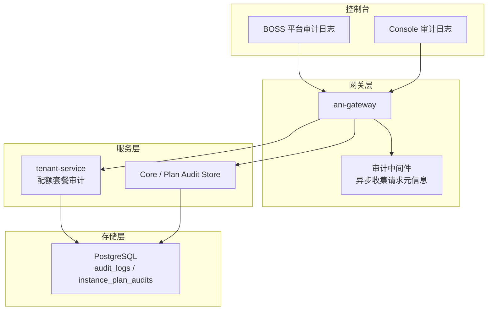
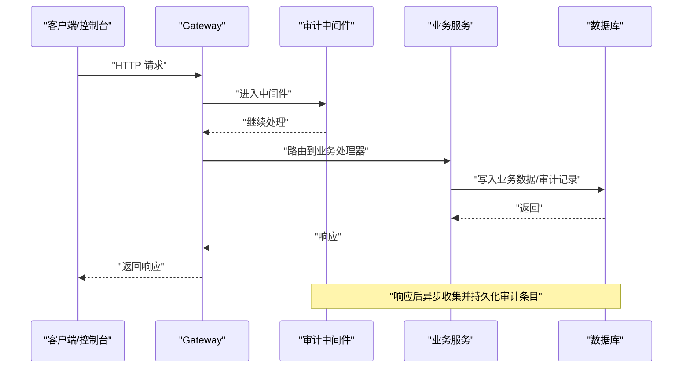
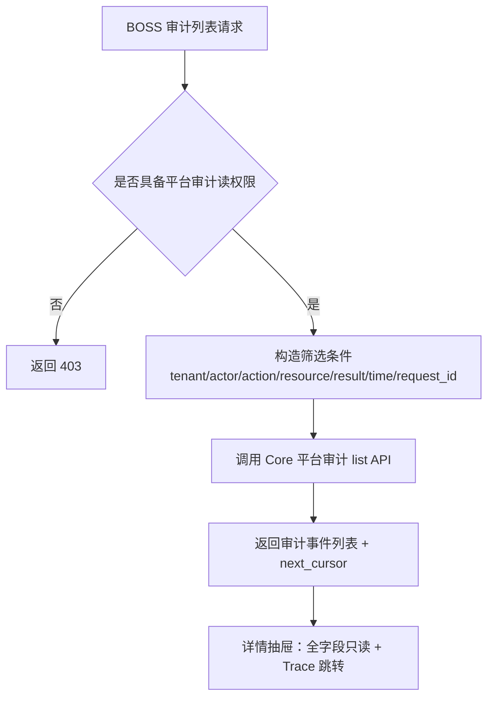
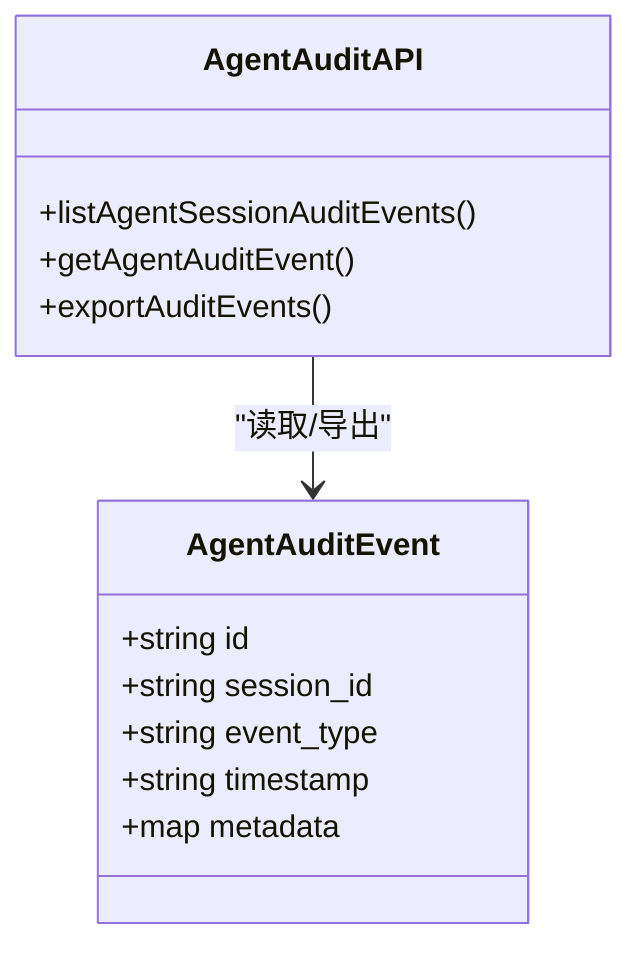
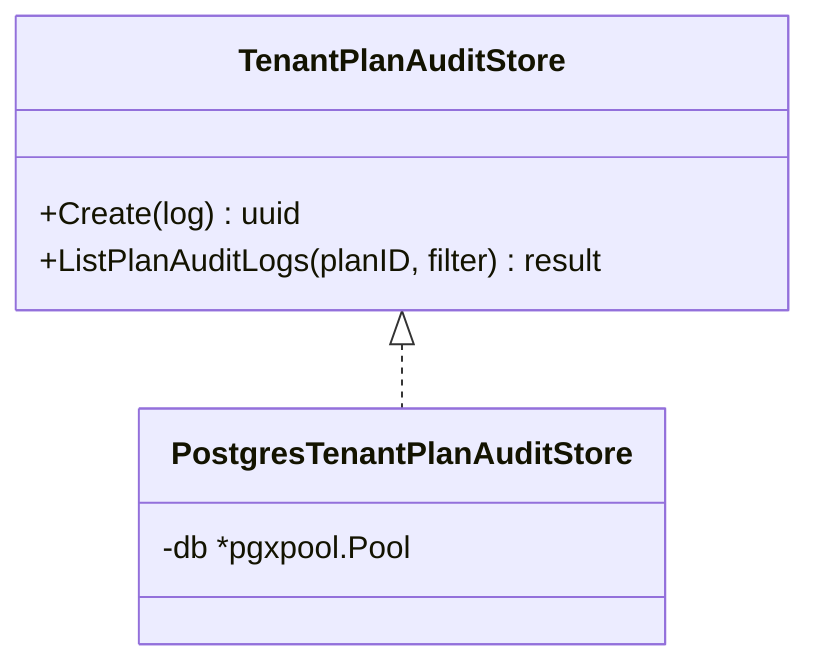
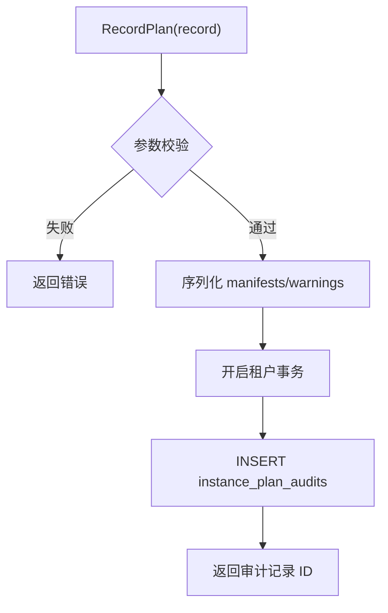
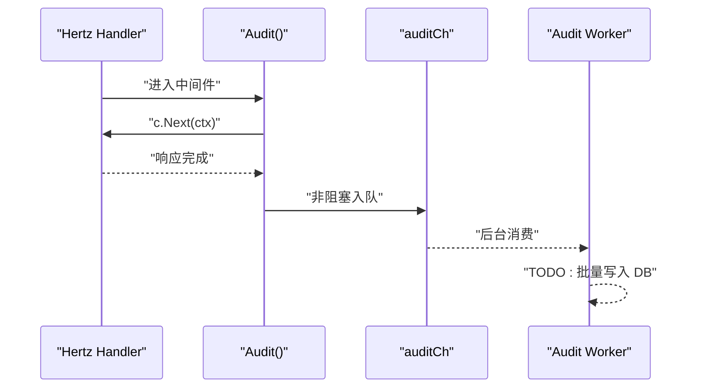
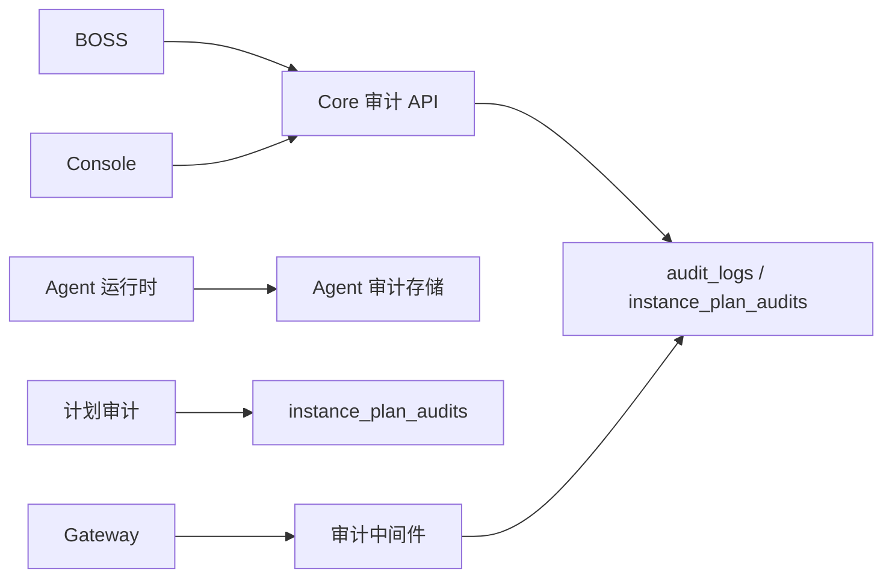

# 审计日志接口

<cite>
**本文引用的文件**
- [platform-audit-log.md](file://repo/services/docs/boss-modules/audit/platform-audit-log.md)
- [spec-console-audit-log.md](file://repo/services/tasks/modules/spec/console/security/spec-console-audit-log.md)
- [openapi-phase3-agent-audit-draft.md](file://repo/services/docs/console-modules/openapi-drafts/phase3/openapi-phase3-agent-audit-draft.md)
- [tenant_plan.proto](file://repo/api/proto/tenant/v1/tenant_plan.proto)
- [tenant_plan_audit_store.go](file://repo/services/tenant-service/internal/repo/adapters/postgres/tenant_plan_audit_store.go)
- [tenant_plan_audit_store_port.go](file://repo/services/tenant-service/internal/repo/ports/tenant_plan_audit_store.go)
- [plan_audit_store.go](file://repo/pkg/adapters/runtime/plan_audit_store.go)
- [observability.go](file://repo/services/ani-gateway/internal/router/observability.go)
- [audit_middleware.go](file://repo/services/ani-gateway/internal/middleware/audit.go)
</cite>

## 目录
1. [简介](#简介)
2. [项目结构](#项目结构)
3. [核心组件](#核心组件)
4. [架构总览](#架构总览)
5. [详细组件分析](#详细组件分析)
6. [依赖关系分析](#依赖关系分析)
7. [性能与可靠性](#性能与可靠性)
8. [故障排查指南](#故障排查指南)
9. [结论](#结论)
10. [附录：接口规范与字段定义](#附录接口规范与字段定义)

## 简介
本文件面向“审计日志”能力，覆盖用户操作审计、API 调用日志、系统事件记录、Agent 行为审计、配额套餐域审计、实例安全事件等。文档说明日志格式规范、查询过滤、分页检索、敏感操作追踪、合规报告、归档清理策略建议，以及日志分析工具、异常行为检测与安全告警的集成思路。

## 项目结构
仓库中与审计日志相关的能力分布在以下位置：
- 平台审计日志（BOSS）：跨租户平台级审计事件列表与详情规划、字段口径与边界约束
- Console 审计日志：单租户只读审计检索页的规格与边界
- Agent 审计：Agent 会话与工具调用的审计事件草案
- 配额套餐域审计：gRPC 契约与 PG 存储端口/适配器占位实现
- 计划审计：实例计划审批/渲染审计写入
- Gateway 审计中间件：非阻塞式 API 调用日志采集
- 可观测性路由：明确 observability query 不是审计数据源

**图表来源**
- [platform-audit-log.md:55-108](file://repo/services/docs/boss-modules/audit/platform-audit-log.md#L55-L108)
- [audit_middleware.go:10-55](file://repo/services/ani-gateway/internal/middleware/audit.go#L10-L55)
- [tenant_plan_audit_store_port.go:10-66](file://repo/services/tenant-service/internal/repo/ports/tenant_plan_audit_store.go#L10-L66)
- [plan_audit_store.go:40-92](file://repo/pkg/adapters/runtime/plan_audit_store.go#L40-L92)

**章节来源**
- [platform-audit-log.md:55-108](file://repo/services/docs/boss-modules/audit/platform-audit-log.md#L55-L108)
- [spec-console-audit-log.md:17-56](file://repo/services/tasks/modules/spec/console/security/spec-console-audit-log.md#L17-L56)

## 核心组件
- 平台审计日志（BOSS）：提供跨租户平台操作审计检索与详情，强调不得用 observability query 替代审计数据源；定义 list/get 目标路径与字段口径。
- Console 审计日志：单租户只读审计检索页，对齐当前 OpenAPI 冻结能力，不自行设计新路径。
- Agent 审计：针对 tool_call、llm_request/response、policy_hit/denied 等事件，提供会话级与全局审计列表。
- 配额套餐域审计：通过 gRPC 暴露 ListTenantPlanAuditLogs，PG 存储端口/适配器已定义（占位实现）。
- 计划审计：将工作负载计划的渲染清单、准入结果等写入审计表。
- Gateway 审计中间件：在响应后异步收集请求方法、路径、状态码、耗时等元信息，落盘由后台任务完成。

**章节来源**
- [platform-audit-log.md:20-108](file://repo/services/docs/boss-modules/audit/platform-audit-log.md#L20-L108)
- [spec-console-audit-log.md:29-56](file://repo/services/tasks/modules/spec/console/security/spec-console-audit-log.md#L29-L56)
- [openapi-phase3-agent-audit-draft.md:24-128](file://repo/services/docs/console-modules/openapi-drafts/phase3/openapi-phase3-agent-audit-draft.md#L24-L128)
- [tenant_plan.proto:12-36](file://repo/api/proto/tenant/v1/tenant_plan.proto#L12-L36)
- [tenant_plan_audit_store_port.go:10-66](file://repo/services/tenant-service/internal/repo/ports/tenant_plan_audit_store.go#L10-L66)
- [plan_audit_store.go:40-92](file://repo/pkg/adapters/runtime/plan_audit_store.go#L40-L92)
- [audit_middleware.go:10-55](file://repo/services/ani-gateway/internal/middleware/audit.go#L10-L55)

## 架构总览
审计日志体系分为“采集—聚合—存储—展示/导出”四层：
- 采集：Gateway 审计中间件对每次 API 调用进行非阻塞采集；业务服务在关键写操作处写入领域审计（如配额套餐、计划审计）。
- 聚合：按域拆分 store 接口，统一审计 schema（action/resource/result/details 等），支持后续扩展。
- 存储：复用现有 audit_logs 分区表或专用审计表（如 instance_plan_audits）。
- 展示/导出：BOSS 提供跨租户审计列表与详情；Console 提供单租户审计检索；未来支持合规导出与归档。

**图表来源**
- [audit_middleware.go:10-55](file://repo/services/ani-gateway/internal/middleware/audit.go#L10-L55)
- [tenant_plan_audit_store_port.go:57-66](file://repo/services/tenant-service/internal/repo/ports/tenant_plan_audit_store.go#L57-L66)
- [plan_audit_store.go:68-92](file://repo/pkg/adapters/runtime/plan_audit_store.go#L68-L92)

## 详细组件分析

### 平台审计日志（BOSS）
- 职责：跨租户平台操作审计检索与详情，支持多维筛选（租户、主体、动作、资源类型、结果、时间范围、request_id）、详情抽屉、Trace 跳转、合规导出入口。
- 边界：不得使用 observability query 作为审计数据源；list/get 路径已在 YAML 中标记为新增；导出/写操作待 YAML。
- 字段口径：timestamp、tenant_id、actor、source_ip、action、resource_type、resource_id、result、request_id、duration_ms、metadata。
- 权限：平台 RBAC 鉴权；禁止越权 tenant_id 筛选。

**图表来源**
- [platform-audit-log.md:55-108](file://repo/services/docs/boss-modules/audit/platform-audit-log.md#L55-L108)
- [platform-audit-log.md:123-188](file://repo/services/docs/boss-modules/audit/platform-audit-log.md#L123-L188)

**章节来源**
- [platform-audit-log.md:20-108](file://repo/services/docs/boss-modules/audit/platform-audit-log.md#L20-L108)
- [platform-audit-log.md:123-188](file://repo/services/docs/boss-modules/audit/platform-audit-log.md#L123-L188)

### Console 审计日志
- 职责：单租户只读审计检索页，对齐当前 OpenAPI 冻结能力，不自行设计新路径。
- 现状：当前无本模块冻结路径，待 Core 提供 list API 后接入。

**章节来源**
- [spec-console-audit-log.md:17-56](file://repo/services/tasks/modules/spec/console/security/spec-console-audit-log.md#L17-L56)

### Agent 审计
- 事件来源：tool_call、tool_result、policy_denied、policy_hit、llm_request、llm_response。
- 接口：全局审计列表与会话内审计列表；可选单条详情与导出。
- 安全：必须脱敏 prompt/response 正文；Console 不得合并三类事件为单一 list。

**图表来源**
- [openapi-phase3-agent-audit-draft.md:85-128](file://repo/services/docs/console-modules/openapi-drafts/phase3/openapi-phase3-agent-audit-draft.md#L85-L128)

**章节来源**
- [openapi-phase3-agent-audit-draft.md:10-128](file://repo/services/docs/console-modules/openapi-drafts/phase3/openapi-phase3-agent-audit-draft.md#L10-L128)

### 配额套餐域审计
- 契约：gRPC TenantPlanService.ListTenantPlanAuditLogs，支持 action/result 过滤与游标分页。
- 存储：复用 audit_logs 分区表；port 定义 AuditLog/AuditLogFilter/AuditLogListResult；PG 适配器为占位实现。
- 使用：用于 GET /tenant-plans/{planId}/audit-logs。

**图表来源**
- [tenant_plan_audit_store_port.go:19-66](file://repo/services/tenant-service/internal/repo/ports/tenant_plan_audit_store.go#L19-L66)
- [tenant_plan_audit_store.go:11-34](file://repo/services/tenant-service/internal/repo/adapters/postgres/tenant_plan_audit_store.go#L11-L34)
- [tenant_plan.proto:106-117](file://repo/api/proto/tenant/v1/tenant_plan.proto#L106-L117)

**章节来源**
- [tenant_plan.proto:12-36](file://repo/api/proto/tenant/v1/tenant_plan.proto#L12-L36)
- [tenant_plan.proto:106-117](file://repo/api/proto/tenant/v1/tenant_plan.proto#L106-L117)
- [tenant_plan_audit_store_port.go:10-66](file://repo/services/tenant-service/internal/repo/ports/tenant_plan_audit_store.go#L10-L66)
- [tenant_plan_audit_store.go:11-34](file://repo/services/tenant-service/internal/repo/adapters/postgres/tenant_plan_audit_store.go#L11-L34)

### 计划审计（Workload Plan Audit）
- 功能：将工作负载计划的渲染清单、准入结果写入审计表 instance_plan_audits。
- 校验：必填字段校验（tenantID、instanceName、workloadKind），JSON 序列化 manifests 与 warnings。
- 事务：在租户事务中执行插入。

**图表来源**
- [plan_audit_store.go:40-92](file://repo/pkg/adapters/runtime/plan_audit_store.go#L40-L92)

**章节来源**
- [plan_audit_store.go:40-92](file://repo/pkg/adapters/runtime/plan_audit_store.go#L40-L92)

### Gateway 审计中间件
- 机制：在响应发送后异步收集 RequestID、TenantID、Method、Path、StatusCode、DurationMs，放入缓冲通道，后台 goroutine 消费并落库（TODO：批量写入）。
- 影响：不阻塞请求路径；通道满时丢弃（审计非强一致场景可接受）。

**图表来源**
- [audit_middleware.go:10-55](file://repo/services/ani-gateway/internal/middleware/audit.go#L10-L55)

**章节来源**
- [audit_middleware.go:10-55](file://repo/services/ani-gateway/internal/middleware/audit.go#L10-L55)

### 可观测性与审计的边界
- 明确：GET /api/v1/observability/query 是 PromQL 指标代理，不是审计事件数据源。
- 用途：仅用于指标查询；审计列表需走独立 audit events 接口。

**章节来源**
- [platform-audit-log.md:20-31](file://repo/services/docs/boss-modules/audit/platform-audit-log.md#L20-L31)
- [observability.go:72-93](file://repo/services/ani-gateway/internal/router/observability.go#L72-L93)

## 依赖关系分析
- 平台审计日志依赖 Core 提供的跨租户审计 list/get 接口（YAML 已标记新增），BOSS 负责 RBAC 与 UI。
- Console 审计日志依赖 Core 单租户审计 list 接口（待 YAML 合入）。
- Agent 审计依赖运行时产生的 agent 事件流与存储。
- 配额套餐审计依赖 gRPC 契约与 PG 存储（port/adapter 已定义，PG 实现占位）。
- 计划审计依赖 MetadataStore 的事务能力与审计表。
- Gateway 审计中间件依赖 Hertz 上下文与后台 worker。

**图表来源**
- [platform-audit-log.md:55-108](file://repo/services/docs/boss-modules/audit/platform-audit-log.md#L55-L108)
- [tenant_plan.proto:12-36](file://repo/api/proto/tenant/v1/tenant_plan.proto#L12-L36)
- [plan_audit_store.go:68-92](file://repo/pkg/adapters/runtime/plan_audit_store.go#L68-L92)
- [audit_middleware.go:10-55](file://repo/services/ani-gateway/internal/middleware/audit.go#L10-L55)

**章节来源**
- [platform-audit-log.md:55-108](file://repo/services/docs/boss-modules/audit/platform-audit-log.md#L55-L108)
- [tenant_plan.proto:12-36](file://repo/api/proto/tenant/v1/tenant_plan.proto#L12-L36)
- [plan_audit_store.go:68-92](file://repo/pkg/adapters/runtime/plan_audit_store.go#L68-L92)
- [audit_middleware.go:10-55](file://repo/services/ani-gateway/internal/middleware/audit.go#L10-L55)

## 性能与可靠性
- 非阻塞采集：Gateway 审计中间件使用缓冲通道，避免阻塞请求路径；通道满时丢弃，适合审计场景。
- 批量写入：后台 worker 应实现批量写入以降低 DB 压力（当前为 TODO）。
- 幂等与去重：配额套餐审计写入建议使用 ON CONFLICT DO NOTHING 或幂等键，避免重复。
- 降级与容错：当后端不可达时，审计写入失败不应影响主流程；可记录本地队列或延迟重试。
- 分页与限流：所有 list 接口采用 cursor 分页，限制 limit 上限，防止大结果集拖垮系统。

[本节为通用指导，无需特定文件引用]

## 故障排查指南
- 平台审计 list 未就绪：若 Core 审计 list 尚未合入，BOSS 应显示“待 Core 合入”，不得使用 observability query 替代。
- 权限问题：平台审计读权限缺失将返回 403；确保 RBAC scope 已配置。
- 时间范围非法：start_time ≥ end_time 时返回 400；前端应在提交前校验。
- 审计写入失败：检查后台 worker 是否启动、DB 连接是否正常、通道是否长期满导致丢弃。
- Agent 审计脱敏：确认 prompt/response 正文已脱敏，避免 PII 泄露。
- 配额套餐审计：PG 适配器目前为占位实现，调用会触发未实现错误；需后续补齐 SQL。

**章节来源**
- [platform-audit-log.md:214-284](file://repo/services/docs/boss-modules/audit/platform-audit-log.md#L214-L284)
- [audit_middleware.go:43-55](file://repo/services/ani-gateway/internal/middleware/audit.go#L43-L55)
- [tenant_plan_audit_store.go:27-34](file://repo/services/tenant-service/internal/repo/adapters/postgres/tenant_plan_audit_store.go#L27-L34)

## 结论
本项目已具备审计日志的基础能力与清晰的边界定义：
- 平台审计日志与 Console 审计日志的职责与数据来源明确，禁止混用 observability query。
- Agent 审计与配额套餐审计已定义契约与存储端口，部分实现仍在推进。
- Gateway 审计中间件提供非阻塞采集，后续需完善批量写入与监控告警。
建议下一步：补齐 Core 审计 list/get 实现、完善 PG 审计写入、引入合规导出与归档策略、建立异常行为检测与安全告警。

[本节为总结，无需特定文件引用]

## 附录：接口规范与字段定义

### 平台审计日志（目标）
- 列表：GET /api/v1/audit/events（YAML 已标记新增）
- 详情：GET /api/v1/audit/events/{event_id}（YAML 已标记新增）
- 导出：POST /api/v1/audit/exports（待 YAML）
- 查询参数：tenant_id、actor、action、resource_type、result、start_time、end_time、request_id、limit、cursor
- 返回字段：id、timestamp、tenant_id、actor、source_ip、action、resource_type、resource_id、result、request_id、duration_ms、metadata

**章节来源**
- [platform-audit-log.md:94-188](file://repo/services/docs/boss-modules/audit/platform-audit-log.md#L94-L188)

### Console 审计日志（当前）
- 当前无冻结路径；待 Core 提供 list API 后接入。

**章节来源**
- [spec-console-audit-log.md:17-56](file://repo/services/tasks/modules/spec/console/security/spec-console-audit-log.md#L17-L56)

### Agent 审计（草案）
- 列表：GET /api/v1/svc/agent/audit-events
- 会话内列表：GET /api/v1/svc/agent/sessions/{session_id}/audit-events
- 详情：GET /api/v1/svc/agent/audit-events/{event_id}（可选）
- 导出：POST /api/v1/svc/agent/audit-events/export（可选）
- 事件类型：tool_call、tool_result、policy_denied、policy_hit、llm_request、llm_response

**章节来源**
- [openapi-phase3-agent-audit-draft.md:85-128](file://repo/services/docs/console-modules/openapi-drafts/phase3/openapi-phase3-agent-audit-draft.md#L85-L128)

### 配额套餐域审计（gRPC）
- RPC：ListTenantPlanAuditLogs(ListTenantPlanAuditLogsRequest) returns (ListTenantPlanAuditLogsResponse)
- 请求字段：plan_id、action、result、page
- 返回字段：items、total、next_cursor
- 存储：复用 audit_logs 分区表；port 定义完整；PG 适配器为占位实现

**章节来源**
- [tenant_plan.proto:12-36](file://repo/api/proto/tenant/v1/tenant_plan.proto#L12-L36)
- [tenant_plan.proto:106-117](file://repo/api/proto/tenant/v1/tenant_plan.proto#L106-L117)
- [tenant_plan_audit_store_port.go:10-66](file://repo/services/tenant-service/internal/repo/ports/tenant_plan_audit_store.go#L10-L66)
- [tenant_plan_audit_store.go:11-34](file://repo/services/tenant-service/internal/repo/adapters/postgres/tenant_plan_audit_store.go#L11-L34)

### 计划审计（写入）
- 写入表：instance_plan_audits
- 关键字段：tenant_id、user_id、instance_id、instance_name、workload_kind、provider、manifest_count、rendered_manifests、admission_allowed、admission_reason、admission_warnings、created_at

**章节来源**
- [plan_audit_store.go:68-92](file://repo/pkg/adapters/runtime/plan_audit_store.go#L68-L92)

### Gateway 审计中间件（采集）
- 采集字段：RequestID、TenantID、Method、Path、StatusCode、DurationMs
- 机制：响应后非阻塞入队，后台 worker 消费并落库（TODO：批量写入）

**章节来源**
- [audit_middleware.go:10-55](file://repo/services/ani-gateway/internal/middleware/audit.go#L10-L55)