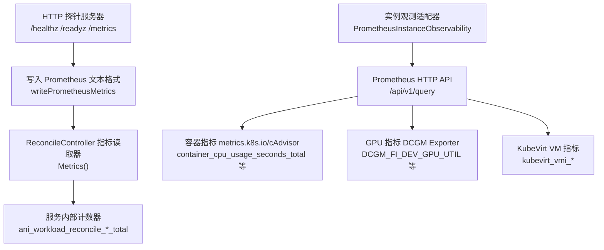
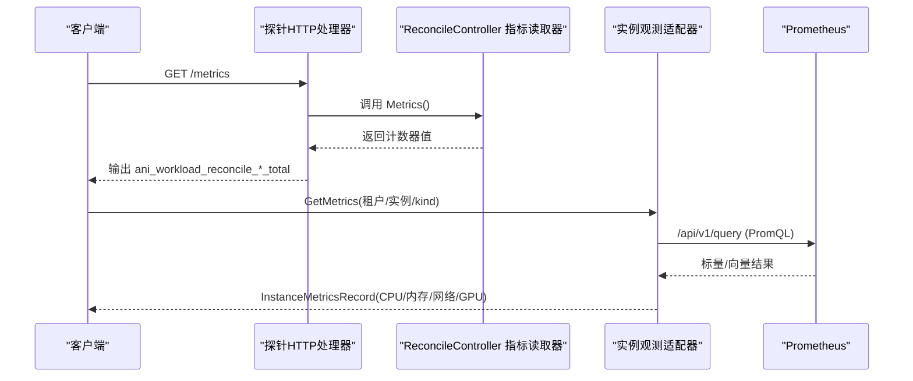
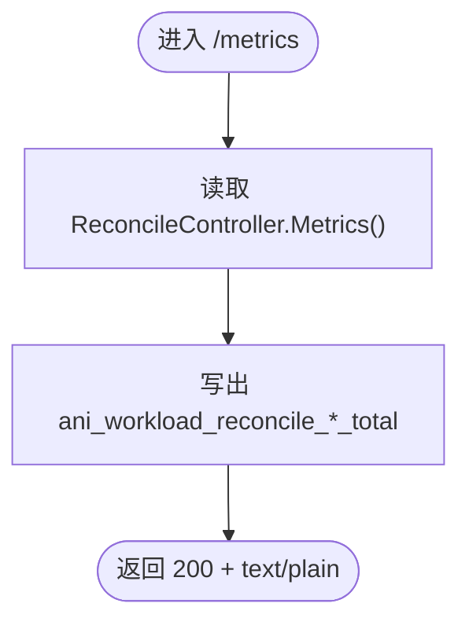
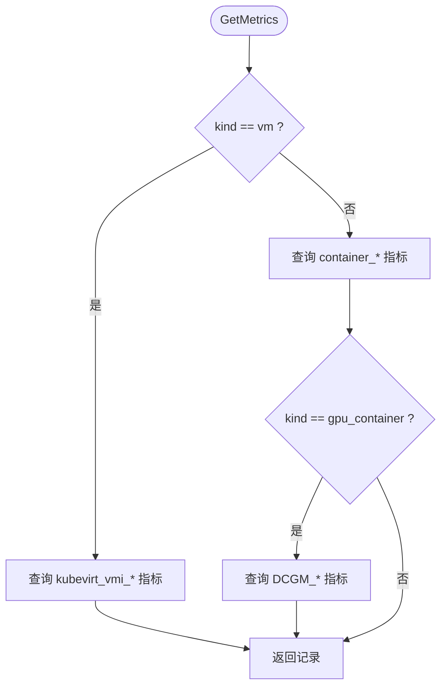
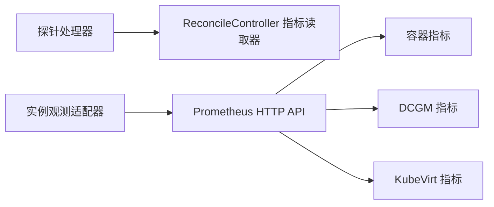

# Prometheus 指标暴露

<cite>
**本文引用的文件**
- [server.go](file://repo/pkg/bootstrap/server.go)
- [probes.go](file://repo/pkg/bootstrap/probes.go)
- [prometheus_instance_observability.go](file://repo/pkg/adapters/runtime/prometheus_instance_observability.go)
- [prometheus_instance_observability_test.go](file://repo/pkg/adapters/runtime/prometheus_instance_observability_test.go)
- [probes_test.go](file://repo/pkg/bootstrap/probes_test.go)
- [reconcile_controller.go](file://repo/pkg/adapters/runtime/reconcile_controller.go)
- [observability.go](file://repo/pkg/ports/observability.go)
- [metering.go](file://repo/pkg/ports/metering.go)
- [prd-console-instance-observability-completion.md](file://repo/services/tasks/modules/prd/console/compute/prd-console-instance-observability-completion.md)
- [console-instance-observability-metrics-a.md](file://repo/development-records/console-instance-observability-metrics-a.md)
</cite>

## 目录
1. [简介](#简介)
2. [项目结构](#项目结构)
3. [核心组件](#核心组件)
4. [架构总览](#架构总览)
5. [详细组件分析](#详细组件分析)
6. [依赖关系分析](#依赖关系分析)
7. [性能考量](#性能考量)
8. [故障排查指南](#故障排查指南)
9. [结论](#结论)
10. [附录](#附录)

## 简介
本文件系统性说明系统如何以标准 Prometheus 格式暴露监控指标，包括：
- HTTP 指标端点配置与实现位置
- 自定义指标注册机制（服务内部计数器）
- 指标命名规范与标签体系设计
- 核心业务指标（实例 CPU/内存/网络、GPU、错误率等）
- 基础设施指标（容器/VM 资源使用、DCGM GPU 指标）
- 指标查询示例与 Grafana 仪表板集成建议

## 项目结构
系统在“健康探针”HTTP 服务器中统一暴露 /metrics，并通过可插拔的 ReconcileController 指标读取器输出服务级计数器。同时，实例观测能力通过 Prometheus Adapter 从 Prometheus 拉取容器/VM/GPU 指标并聚合为统一的 InstanceMetricsRecord。

图表来源
- [probes.go:37-87](file://repo/pkg/bootstrap/probes.go#L37-L87)
- [prometheus_instance_observability.go:155-324](file://repo/pkg/adapters/runtime/prometheus_instance_observability.go#L155-L324)

章节来源
- [server.go:387-445](file://repo/pkg/bootstrap/server.go#L387-L445)
- [probes.go:37-87](file://repo/pkg/bootstrap/probes.go#L37-L87)

## 核心组件
- HTTP 探针与指标端点：在健康探针处理器中挂载 /metrics，并以 text/plain; version=0.0.4 输出 Prometheus 文本格式。
- 自定义指标注册：通过 ReconcileController 的 Metrics() 暴露服务内部计数器，由探针处理器统一写出。
- 实例观测适配器：根据 workload kind（container/gpu_container/vm）从 Prometheus 查询不同指标集，聚合为 InstanceMetricsRecord。
- 指标类型与查询接口：定义 ObservabilityService 的即时与区间查询接口，供上层消费 PromQL 结果。

章节来源
- [probes.go:53-87](file://repo/pkg/bootstrap/probes.go#L53-L87)
- [reconcile_controller.go:60-86](file://repo/pkg/adapters/runtime/reconcile_controller.go#L60-L86)
- [prometheus_instance_observability.go:155-324](file://repo/pkg/adapters/runtime/prometheus_instance_observability.go#L155-L324)
- [observability.go:33-81](file://repo/pkg/ports/observability.go#L33-L81)

## 架构总览
下图展示了从 HTTP 请求到指标输出的完整链路，以及实例观测数据流。

图表来源
- [probes.go:53-87](file://repo/pkg/bootstrap/probes.go#L53-L87)
- [prometheus_instance_observability.go:155-324](file://repo/pkg/adapters/runtime/prometheus_instance_observability.go#L155-L324)

## 详细组件分析

### HTTP 指标端点与自定义指标注册
- 端点路径：/metrics
- Content-Type：text/plain; version=0.0.4
- 指标族：
  - ani_workload_reconcile_ticks_total{service="..."}
  - ani_workload_reconcile_successes_total{service="..."}
  - ani_workload_reconcile_failures_total{service="..."}
  - ani_workload_reconcile_backoff_skips_total{service="..."}
- 标签体系：
  - service：服务名，来自探针初始化参数，经 sanitizePrometheusLabel 处理
- 注册方式：
  - 通过 newProbeHandler 挂载 /metrics
  - writePrometheusMetrics 读取 ReconcileController.Metrics() 并写出计数器

图表来源
- [probes.go:53-87](file://repo/pkg/bootstrap/probes.go#L53-L87)

章节来源
- [probes.go:53-87](file://repo/pkg/bootstrap/probes.go#L53-L87)
- [probes_test.go:171-189](file://repo/pkg/bootstrap/probes_test.go#L171-L189)

### 实例观测适配器与指标采集
- 入口方法：GetMetrics(request)
- 分支逻辑：
  - kind=vm：查询 KubeVirt kubevirt_vmi_* 指标，CPU/内存/网络按 guest OS 真实使用计算
  - kind=container/gpu_container：查询 metrics.k8s.io/cAdvisor 指标；当 kind=gpu_container 时额外查询 DCGM 指标
- 关键指标与来源：
  - CPU 利用率：container_cpu_usage_seconds_total（容器），rate(kubevirt_vmi_cpu_usage_seconds_total[5m])（VM）
  - 内存已用：container_memory_working_set_bytes（容器），kubevirt_vmi_memory_domain_bytes - kubevirt_vmi_memory_usable_bytes（VM）
  - 内存总量：container_spec_memory_limit_bytes（容器），kubevirt_vmi_memory_domain_bytes（VM）
  - 网络 RX/TX：container_network_receive_bytes_total/transmit_bytes_total（容器），rate(kubevirt_vmi_network_*_bytes_total[5m])（VM）
  - GPU 利用率/显存：DCGM_FI_DEV_GPU_UTIL、DCGM_FI_DEV_FB_USED/FREE（仅 gpu_container）
- 降级策略：单个 exporter 不可用时不阻塞其他字段，缺失字段为 nil，避免伪造 0
- 时间戳：优先使用样本时间戳，否则回退到当前时间

图表来源
- [prometheus_instance_observability.go:155-324](file://repo/pkg/adapters/runtime/prometheus_instance_observability.go#L155-L324)

章节来源
- [prometheus_instance_observability.go:155-324](file://repo/pkg/adapters/runtime/prometheus_instance_observability.go#L155-L324)
- [prometheus_instance_observability_test.go:102-130](file://repo/pkg/adapters/runtime/prometheus_instance_observability_test.go#L102-L130)
- [prometheus_instance_observability_test.go:277-297](file://repo/pkg/adapters/runtime/prometheus_instance_observability_test.go#L277-L297)
- [prometheus_instance_observability_test.go:794-827](file://repo/pkg/adapters/runtime/prometheus_instance_observability_test.go#L794-L827)

### 指标命名规范与标签体系
- 指标前缀：
  - 服务内部计数器：ani_workload_reconcile_*_total
  - 实例观测：基于上游指标名（container_*、kubevirt_vmi_*、DCGM_*），适配器层不重命名
- 标签：
  - service：服务名（探针写出）
  - namespace/pod/name：PromQL 过滤条件，非最终指标标签
- 命名约定：
  - 计数器使用 _total 后缀
  - 名称语义清晰，便于分组与告警

章节来源
- [probes.go:77-87](file://repo/pkg/bootstrap/probes.go#L77-L87)
- [prometheus_instance_observability.go:182-248](file://repo/pkg/adapters/runtime/prometheus_instance_observability.go#L182-L248)

### 指标查询接口与范围查询
- 即时查询：ObservabilityQueryRequest -> ObservabilityQueryResult
- 区间查询：ObservabilityRangeQueryRequest -> ObservabilityRangeQueryResult（matrix）
- 用途：前端时序图渲染、批量指标拉取、PromQL 模板执行

章节来源
- [observability.go:33-81](file://repo/pkg/ports/observability.go#L33-L81)

### 计量维度与资源用量
- 资源类型：instance_cpu_seconds、instance_memory_gib_seconds、instance_gpu_seconds、token_input/output/total
- 采集规格：CollectionSpec 描述资源引用、工作负载信息、维度集合、采集间隔等
- 用途：计费与用量统计，与运行时指标解耦

章节来源
- [metering.go:8-17](file://repo/pkg/ports/metering.go#L8-L17)
- [metering.go:89-111](file://repo/pkg/ports/metering.go#L89-L111)

## 依赖关系分析
- 探针处理器依赖 ReconcileController 指标读取器，用于输出服务内部计数器
- 实例观测适配器依赖 Prometheus HTTP API，按 kind 选择不同指标源
- 测试覆盖：
  - 探针 /metrics 输出校验
  - 容器/VM/GPU 指标分支与降级行为
  - 多 exporter 场景下的部分可用性与 nil 字段策略

图表来源
- [probes.go:53-87](file://repo/pkg/bootstrap/probes.go#L53-L87)
- [prometheus_instance_observability.go:155-324](file://repo/pkg/adapters/runtime/prometheus_instance_observability.go#L155-L324)

章节来源
- [probes_test.go:171-189](file://repo/pkg/bootstrap/probes_test.go#L171-L189)
- [prometheus_instance_observability_test.go:102-130](file://repo/pkg/adapters/runtime/prometheus_instance_observability_test.go#L102-L130)

## 性能考量
- 单 exporter 降级：任一指标源不可用时不影响其他字段采集，避免级联失败
- 聚合与去抖：对多 series 使用 sum() 聚合，消除非确定性
- 时间窗口：VM 指标使用 rate(...[5m]) 计算瞬时速率，平衡精度与开销
- NaN/Inf 防护：过滤非法数值，防止序列化异常
- 连接复用：HTTP 客户端可复用，减少握手开销

章节来源
- [prometheus_instance_observability.go:182-248](file://repo/pkg/adapters/runtime/prometheus_instance_observability.go#L182-L248)
- [prometheus_instance_observability.go:613-618](file://repo/pkg/adapters/runtime/prometheus_instance_observability.go#L613-L618)

## 故障排查指南
- /metrics 无响应或内容类型不正确：检查探针处理器是否挂载 /metrics 且返回 text/plain
- 指标缺失：确认对应 exporter 是否可用（metrics.k8s.io、DCGM、KubeVirt virt-handler）
- VM 指标为空：检查 kubevirt_vmi_* 指标是否存在，name 标签是否为精确匹配
- GPU 指标为空：确认 DCGM Exporter scrape 配置是否正确
- 前端展示“暂不可用”：表示后端返回 null 字段，需检查下游指标源

章节来源
- [probes_test.go:171-189](file://repo/pkg/bootstrap/probes_test.go#L171-L189)
- [prometheus_instance_observability_test.go:277-297](file://repo/pkg/adapters/runtime/prometheus_instance_observability_test.go#L277-L297)
- [prometheus_instance_observability_test.go:794-827](file://repo/pkg/adapters/runtime/prometheus_instance_observability_test.go#L794-L827)
- [prd-console-instance-observability-completion.md:47-56](file://repo/services/tasks/modules/prd/console/compute/prd-console-instance-observability-completion.md#L47-L56)

## 结论
系统通过统一的 /metrics 端点暴露服务内部计数器，并通过实例观测适配器将容器/VM/GPU 指标聚合为标准化的 InstanceMetricsRecord。该设计具备强降级能力、清晰的指标命名与标签体系，便于在 Prometheus 与 Grafana 中进行可视化与告警。

## 附录

### 指标清单与含义
- 服务内部计数器
  - ani_workload_reconcile_ticks_total：调度循环次数
  - ani_workload_reconcile_successes_total：成功 reconcile 次数
  - ani_workload_reconcile_failures_total：失败 reconcile 次数
  - ani_workload_reconcile_backoff_skips_total：因 backoff 跳过的目标数
- 实例观测指标（来源于上游）
  - 容器：container_cpu_usage_seconds_total、container_memory_working_set_bytes、container_spec_memory_limit_bytes、container_network_receive_bytes_total、container_network_transmit_bytes_total
  - VM：kubevirt_vmi_cpu_usage_seconds_total、kubevirt_vmi_memory_domain_bytes、kubevirt_vmi_memory_usable_bytes、kubevirt_vmi_network_receive_bytes_total、kubevirt_vmi_network_transmit_bytes_total
  - GPU：DCGM_FI_DEV_GPU_UTIL、DCGM_FI_DEV_FB_USED、DCGM_FI_DEV_FB_FREE

章节来源
- [probes.go:77-87](file://repo/pkg/bootstrap/probes.go#L77-L87)
- [prometheus_instance_observability.go:182-324](file://repo/pkg/adapters/runtime/prometheus_instance_observability.go#L182-L324)

### 指标查询示例
- 容器 CPU 利用率（瞬时）
  - sum(container_cpu_usage_seconds_total{namespace="tenant-ns",pod=~"^pod-name(-.*)?$"})
- 容器内存已用（MB）
  - sum(container_memory_working_set_bytes{namespace="tenant-ns",pod=~"^pod-name(-.*)?$"}) / 1024 / 1024
- VM CPU 利用率（瞬时）
  - rate(kubevirt_vmi_cpu_usage_seconds_total{namespace="tenant-ns",name="vmi-name"}[5m])
- VM 内存已用（MB）
  - (kubevirt_vmi_memory_domain_bytes{namespace="tenant-ns",name="vmi-name"} - kubevirt_vmi_memory_usable_bytes{namespace="tenant-ns",name="vmi-name"}) / 1024 / 1024
- GPU 利用率
  - sum(DCGM_FI_DEV_GPU_UTIL{namespace="tenant-ns",pod=~"^pod-name(-.*)?$"})

章节来源
- [prometheus_instance_observability.go:182-324](file://repo/pkg/adapters/runtime/prometheus_instance_observability.go#L182-L324)

### Grafana 仪表板集成建议
- 数据源：添加 Prometheus 数据源，指向集群内 Prometheus Service
- 面板：
  - 服务内部计数器：使用 ani_workload_reconcile_*_total 创建折线图/仪表盘
  - 实例观测：基于 PromQL 模板构建 CPU/内存/网络/GPU 曲线
- 变量：
  - namespace、pod/vmi-name、instance_id 作为下拉变量，支持动态筛选
- 刷新与保留：
  - 建议设置合理的查询步长与时间范围，避免过大负载

章节来源
- [console-instance-observability-metrics-a.md:11-49](file://repo/development-records/console-instance-observability-metrics-a.md#L11-L49)