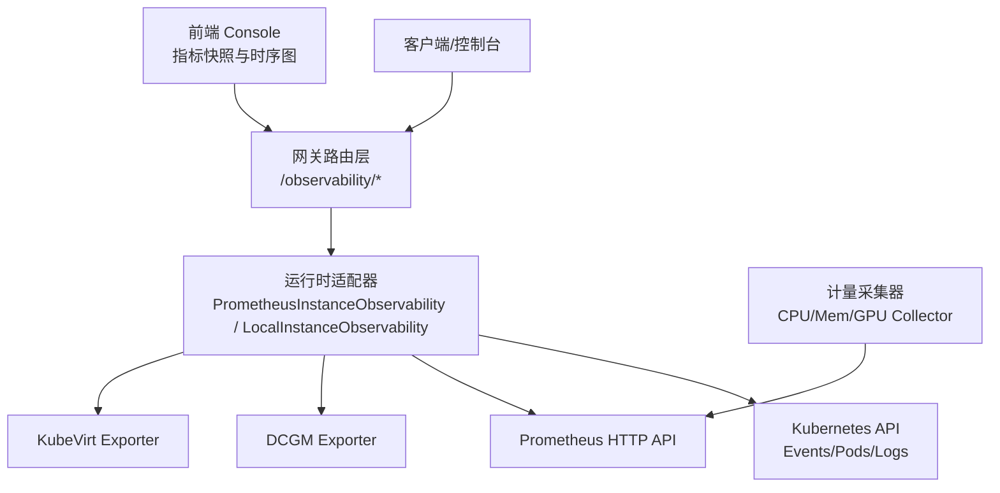
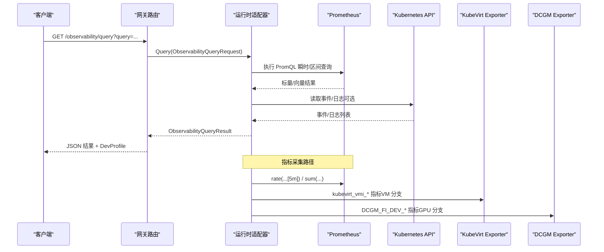
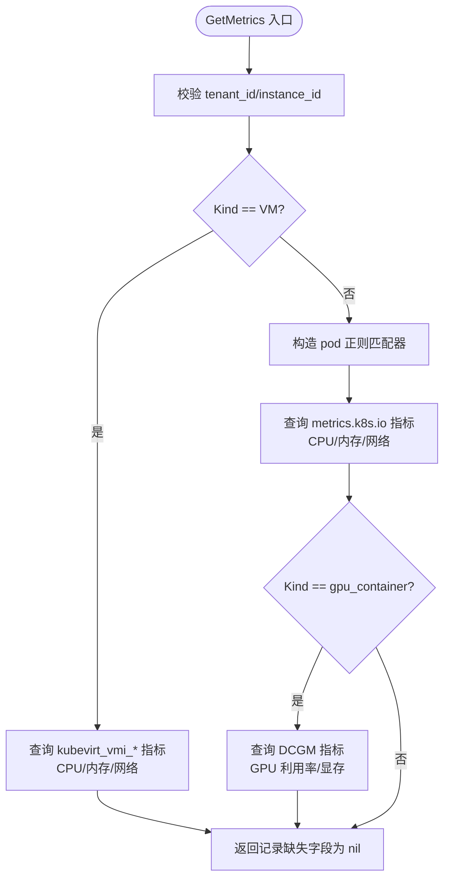
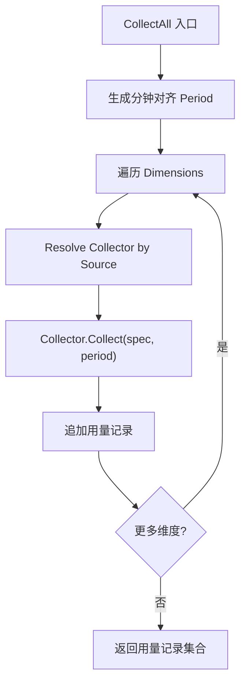
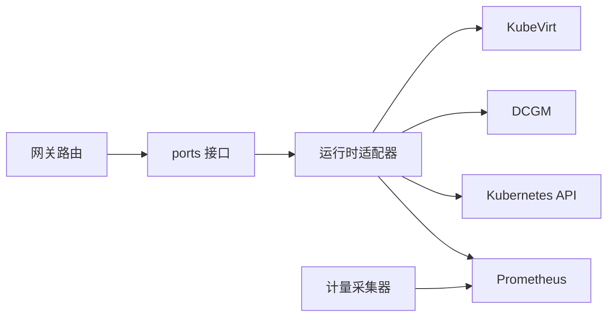

# 性能指标采集

<cite>
**本文引用的文件**
- [prometheus_instance_observability.go](file://repo/pkg/adapters/runtime/prometheus_instance_observability.go)
- [local_instance_observability_service.go](file://repo/pkg/adapters/runtime/local_instance_observability_service.go)
- [instance_observability.go](file://repo/pkg/ports/instance_observability.go)
- [collectors.go](file://repo/pkg/adapters/metering/collectors.go)
- [observability.go](file://repo/services/ani-gateway/internal/router/observability.go)
- [instance_observability_runtime.go](file://repo/services/ani-gateway/instance_observability_runtime.go)
- [instances.go](file://repo/services/ani-gateway/internal/router/instances.go)
- [MetricsSnapshot.tsx](file://repo/frontends/console/src/features/instance-observability/MetricsSnapshot.tsx)
- [issue-009-getmetrics-vm-branch.md](file://repo/services/tasks/modules/spec/console/compute/spec-console-instance-observability-completion.md)
- [prd-console-instance-observability-completion.md](file://repo/services/tasks/modules/prd/console/compute/prd-console-instance-observability-completion.md)
</cite>

## 目录
1. [简介](#简介)
2. [项目结构](#项目结构)
3. [核心组件](#核心组件)
4. [架构总览](#架构总览)
5. [详细组件分析](#详细组件分析)
6. [依赖关系分析](#依赖关系分析)
7. [性能考量](#性能考量)
8. [故障排查指南](#故障排查指南)
9. [结论](#结论)
10. [附录](#附录)

## 简介
本文件系统性说明 ANI 平台如何采集与分析应用性能指标，覆盖响应时间分布、吞吐量统计、资源使用效率等关键指标。文档聚焦以下方面：
- 数据采集点与来源（Prometheus、Kubernetes Events、DCGM、KubeVirt）
- 采样策略与聚合方法（rate、sum、区间查询、窗口计算）
- 指标口径与字段映射（CPU、内存、网络、GPU、VM guest OS）
- 性能基准与假设（日志首屏、快照刷新、Loki 资源占用）
- 工具使用与调优建议（PromQL 优化、限流与降级、前端展示）

## 项目结构
ANI 的性能指标采集由网关路由层、运行时适配器层、计量采集器与前端展示层共同构成：
- 网关路由层：暴露 /observability/query、/observability/query_range 等接口，转发 PromQL 查询并返回结果；同时承载实例观测相关 API。
- 运行时适配器层：实现 InstanceObservability 接口，提供 Prometheus/Kubernetes 真实数据或本地模拟数据。
- 计量采集器：按周期从 Prometheus 采集 CPU、内存、GPU 用量，产出计费/用量记录。
- 前端展示层：Console 页面渲染指标快照与时序图，支持 VM/GPU/容器三类工作负载。

**图表来源**
- [observability.go:95-104](file://repo/services/ani-gateway/internal/router/observability.go#L95-L104)
- [prometheus_instance_observability.go:155-251](file://repo/pkg/adapters/runtime/prometheus_instance_observability.go#L155-L251)
- [collectors.go:244-266](file://repo/pkg/adapters/metering/collectors.go#L244-L266)
- [instances.go:603-631](file://repo/services/ani-gateway/internal/router/instances.go#L603-L631)

**章节来源**
- [observability.go:95-104](file://repo/services/ani-gateway/internal/router/observability.go#L95-L104)
- [prometheus_instance_observability.go:155-251](file://repo/pkg/adapters/runtime/prometheus_instance_observability.go#L155-L251)
- [collectors.go:244-266](file://repo/pkg/adapters/metering/collectors.go#L244-L266)
- [instances.go:603-631](file://repo/services/ani-gateway/internal/router/instances.go#L603-L631)

## 核心组件
- InstanceObservability 接口：统一抽象实例观测能力，包括日志、事件、指标、安全事件、exec/console 会话创建。
- PrometheusInstanceObservability：基于 Prometheus 与 Kubernetes API 的真实采集实现，支持 container、gpu_container、VM 三类工作负载。
- LocalInstanceObservabilityService：本地模拟实现，用于开发/测试环境快速验证。
- 计量采集器（Collectors）：按周期采集 CPU、内存、GPU 用量，输出标准化用量记录。
- 网关路由：将外部请求转换为内部服务调用，并处理错误与 DevProfile 信息。

**章节来源**
- [instance_observability.go:8-137](file://repo/pkg/ports/instance_observability.go#L8-L137)
- [prometheus_instance_observability.go:19-86](file://repo/pkg/adapters/runtime/prometheus_instance_observability.go#L19-L86)
- [local_instance_observability_service.go:14-97](file://repo/pkg/adapters/runtime/local_instance_observability_service.go#L14-L97)
- [collectors.go:19-43](file://repo/pkg/adapters/metering/collectors.go#L19-L43)

## 架构总览
下图展示了从请求到指标落地的完整链路，包括 PromQL 查询、Kubernetes 事件读取、VM 分支与 GPU 分支分流、以及前端展示。

**图表来源**
- [observability.go:106-154](file://repo/services/ani-gateway/internal/router/observability.go#L106-L154)
- [prometheus_instance_observability.go:155-324](file://repo/pkg/adapters/runtime/prometheus_instance_observability.go#L155-L324)

## 详细组件分析

### Prometheus 实例观测适配器
- 职责：实现 GetMetrics/ListLogs/ListEvents/ListSecurityEvents/CreateExecSession/CreateConsoleSession。
- 关键逻辑：
  - VM 分支：当 Kind=VM 时，查询 KubeVirt 指标（CPU、内存、网络），内存已用采用 domain_bytes - usable_bytes 公式。
  - Container/GPU 分支：通过 metrics.k8s.io exporter 与 DCGM exporter 获取 CPU、内存、网络、GPU 利用率与显存。
  - 租户隔离：所有查询均带 namespace 过滤，避免跨租户误匹配。
  - 容错与降级：单个 exporter 不可用时对应字段为 nil，不伪造 0；NaN/Inf 被过滤并返回错误以便上层降级。
  - 日志持久化：可注入 LogStore（如 Loki），未注入则 fallback 到 K8s pod log API。

**图表来源**
- [prometheus_instance_observability.go:155-324](file://repo/pkg/adapters/runtime/prometheus_instance_observability.go#L155-L324)

**章节来源**
- [prometheus_instance_observability.go:155-324](file://repo/pkg/adapters/runtime/prometheus_instance_observability.go#L155-L324)
- [prometheus_instance_observability.go:459-490](file://repo/pkg/adapters/runtime/prometheus_instance_observability.go#L459-L490)
- [prometheus_instance_observability.go:574-619](file://repo/pkg/adapters/runtime/prometheus_instance_observability.go#L574-L619)

### 本地实例观测适配器
- 职责：在本地/开发环境提供模拟的日志、事件、指标与安全事件，便于功能验证。
- 特点：固定样本数据，DevProfile 标记 local profile；支持限流与过滤。

**章节来源**
- [local_instance_observability_service.go:43-97](file://repo/pkg/adapters/runtime/local_instance_observability_service.go#L43-L97)
- [local_instance_observability_service.go:201-218](file://repo/pkg/adapters/runtime/local_instance_observability_service.go#L201-L218)

### 计量采集器（CPU/内存/GPU）
- 职责：按周期采集资源用量，生成标准化用量记录（cpu_second、gib_second、gpu_second）。
- 采样策略：
  - CPU：rate(container_cpu_usage_seconds_total[IntervalSec]) × IntervalSec，得到累计 CPU 秒数。
  - 内存：container_memory_working_set_bytes 瞬时值 × IntervalSec，换算为 GiB-秒。
  - GPU：持有时长 = Count × IntervalSec，单位 gpu_second。
- 聚合方式：对多副本 pod 使用 sum() 聚合，避免非确定性 series。

**图表来源**
- [collectors.go:244-266](file://repo/pkg/adapters/metering/collectors.go#L244-L266)

**章节来源**
- [collectors.go:45-87](file://repo/pkg/adapters/metering/collectors.go#L45-L87)
- [collectors.go:89-129](file://repo/pkg/adapters/metering/collectors.go#L89-L129)
- [collectors.go:209-239](file://repo/pkg/adapters/metering/collectors.go#L209-L239)

### 网关路由与观测接口
- 路由：注册 /observability/query、/observability/query_range、告警规则 CRUD。
- 参数校验：start/end/step 必须合法；duration 必须为正时长字符串。
- 错误处理：统一写回业务错误码与消息，附带 DevProfile。

**章节来源**
- [observability.go:95-154](file://repo/services/ani-gateway/internal/router/observability.go#L95-L154)
- [observability.go:156-254](file://repo/services/ani-gateway/internal/router/observability.go#L156-L254)
- [observability.go:338-348](file://repo/services/ani-gateway/internal/router/observability.go#L338-L348)

### 前端指标展示
- 指标快照：展示 CPU 利用率、内存 used/total、网络 RX/TX、GPU 利用率与显存。
- 数据来源：后端 InstanceObservability.GetMetrics 返回的 InstanceMetricsRecord。
- 行为：kind=vm 时展示 guest OS 真实数据；kind=gpu_container 时展示 DCGM 数据；其他类型不回归。

**章节来源**
- [instances.go:603-631](file://repo/services/ani-gateway/internal/router/instances.go#L603-L631)
- [MetricsSnapshot.tsx:129-168](file://repo/frontends/console/src/features/instance-observability/MetricsSnapshot.tsx#L129-L168)

## 依赖关系分析
- 运行时适配器依赖：
  - Prometheus HTTP API：瞬时/区间查询，PromQL 表达式需带 namespace/pod 标签过滤。
  - Kubernetes API：读取事件与日志（fallback）。
  - DCGM/KubeVirt Exporter：分别提供 GPU 与 VM guest OS 指标。
- 计量采集器依赖：
  - Prometheus：CPU/内存用量采集。
  - 无外部依赖：GPU 用量基于持有时长计算。
- 网关路由依赖：
  - ports.ObservabilityService：统一服务接口。
  - 配置与环境变量：Provider、PrometheusURL、LogStoreType、LokiURL 等。

**图表来源**
- [observability.go:95-104](file://repo/services/ani-gateway/internal/router/observability.go#L95-L104)
- [prometheus_instance_observability.go:155-324](file://repo/pkg/adapters/runtime/prometheus_instance_observability.go#L155-L324)
- [collectors.go:244-266](file://repo/pkg/adapters/metering/collectors.go#L244-L266)

**章节来源**
- [instance_observability_runtime.go:51-82](file://repo/services/ani-gateway/instance_observability_runtime.go#L51-L82)
- [instance_observability_runtime.go:84-117](file://repo/services/ani-gateway/instance_observability_runtime.go#L84-L117)

## 性能考量
- 采样与聚合：
  - 使用 rate(...[5m]) 将 Counter 转为瞬时速率，适合快照展示。
  - 使用 sum() 聚合多 series，消除非确定性 Result[0] 问题。
  - 对 VM 使用 name 精确匹配，避免正则误匹配 virt-launcher pod。
- 容错与降级：
  - 单 exporter 不可用时对应字段为 nil，不伪造 0。
  - NaN/Inf 被过滤，避免序列化异常。
- 资源与成本：
  - Loki 单体模式资源：requests cpu 100m / memory 256Mi，limits cpu 1 / memory 1Gi。
  - Fluent Bit 每节点一份，需限制 limits。
- 基准假设：
  - 日志首屏 ≤ 2s（100 条，Loki 单体模式）。
  - 快照刷新 ≤ 1s（local profile 基准）。

**章节来源**
- [prometheus_instance_observability.go:175-251](file://repo/pkg/adapters/runtime/prometheus_instance_observability.go#L175-L251)
- [prometheus_instance_observability.go:253-324](file://repo/pkg/adapters/runtime/prometheus_instance_observability.go#L253-L324)
- [prometheus_instance_observability.go:613-619](file://repo/pkg/adapters/runtime/prometheus_instance_observability.go#L613-L619)
- [prd-console-instance-observability-completion.md:325-345](file://repo/services/tasks/modules/prd/console/compute/prd-console-instance-observability-completion.md#L325-L345)

## 故障排查指南
- Prometheus 查询失败：
  - 检查 query 是否包含正确的 namespace/pod 标签。
  - 确认 exporter 可用（DCGM/KubeVirt/metrics.k8s.io）。
  - 关注 NaN/Inf 过滤导致的空结果。
- VM 指标为空：
  - 确认 virt-handler 可用；不可用时字段为 nil。
  - 使用 name 精确匹配 VMI metadata.name。
- 日志无法分页：
  - 检查 cursor 传递与 limit 上限（默认 500）。
  - 未注入 LogStore 时 fallback 到 K8s pod log API。
- 前端展示异常：
  - 确认后端返回字段非 null（VM/GPU 场景）。
  - 校验 kind 参数是否正确传递至后端。

**章节来源**
- [prometheus_instance_observability.go:142-153](file://repo/pkg/adapters/runtime/prometheus_instance_observability.go#L142-L153)
- [prometheus_instance_observability.go:350-376](file://repo/pkg/adapters/runtime/prometheus_instance_observability.go#L350-L376)
- [prometheus_instance_observability.go:459-490](file://repo/pkg/adapters/runtime/prometheus_instance_observability.go#L459-L490)
- [prometheus_instance_observability.go:574-619](file://repo/pkg/adapters/runtime/prometheus_instance_observability.go#L574-L619)

## 结论
ANI 平台的性能指标采集以 Prometheus 为核心，结合 Kubernetes Events、DCGM 与 KubeVirt Exporter，形成覆盖容器、GPU 容器与 VM 的全栈观测能力。通过严格的租户隔离、合理的采样与聚合策略、以及健壮的降级机制，确保指标数据的准确性与可用性。前端展示层直观呈现关键性能指标，支撑运维与开发的高效排障与调优。

## 附录
- 指标口径速查：
  - CPU 利用率：rate(container_cpu_usage_seconds_total[5m]) 或 rate(kubevirt_vmi_cpu_usage_seconds_total[5m])
  - 内存使用：container_memory_working_set_bytes 或 kubevirt_vmi_memory_domain_bytes - kubevirt_vmi_memory_usable_bytes
  - 网络流量：container_network_receive/transmit_bytes_total 或 kubevirt_vmi_network_*_bytes_total
  - GPU 利用率：DCGM_FI_DEV_GPU_UTIL；显存：DCGM_FI_DEV_FB_USED/FREE
- 工具使用建议：
  - 使用 /observability/query_range 进行区间查询，构建时序图。
  - 合理设置 step 与 window，避免过大查询导致 Prometheus 压力。
  - 在生产环境部署高可用 Loki，并限制 Fluent Bit 资源。

**章节来源**
- [prometheus_instance_observability.go:175-324](file://repo/pkg/adapters/runtime/prometheus_instance_observability.go#L175-L324)
- [observability.go:118-154](file://repo/services/ani-gateway/internal/router/observability.go#L118-L154)
- [prd-console-instance-observability-completion.md:325-345](file://repo/services/tasks/modules/prd/console/compute/prd-console-instance-observability-completion.md#L325-L345)