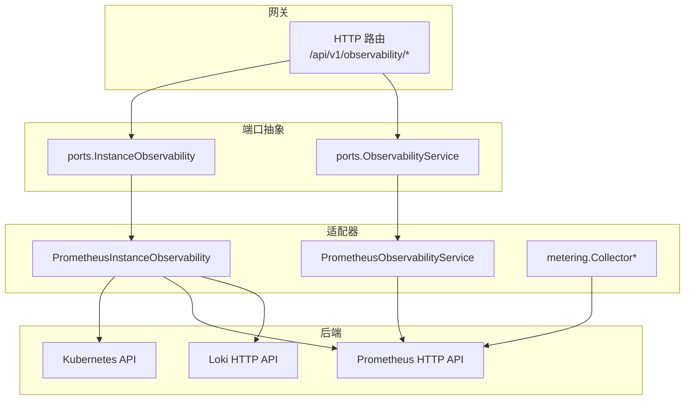
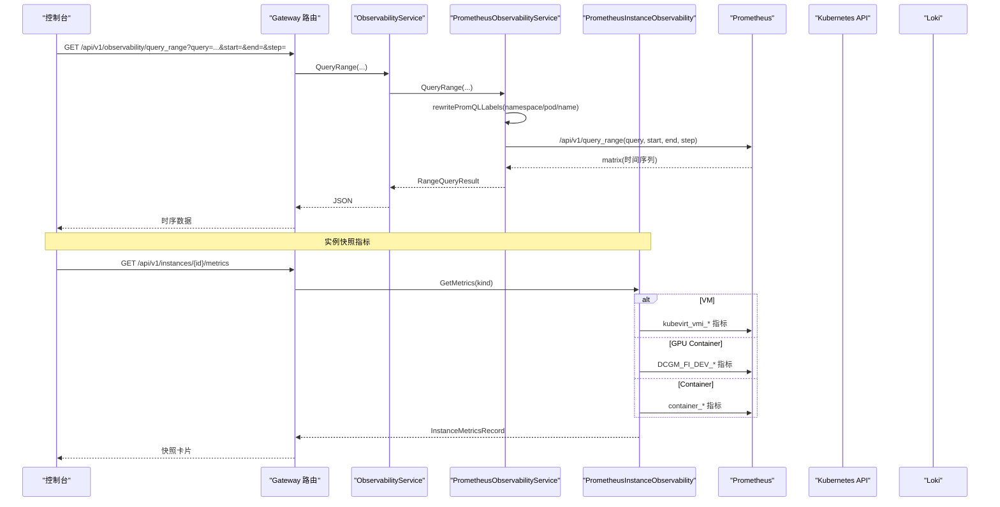
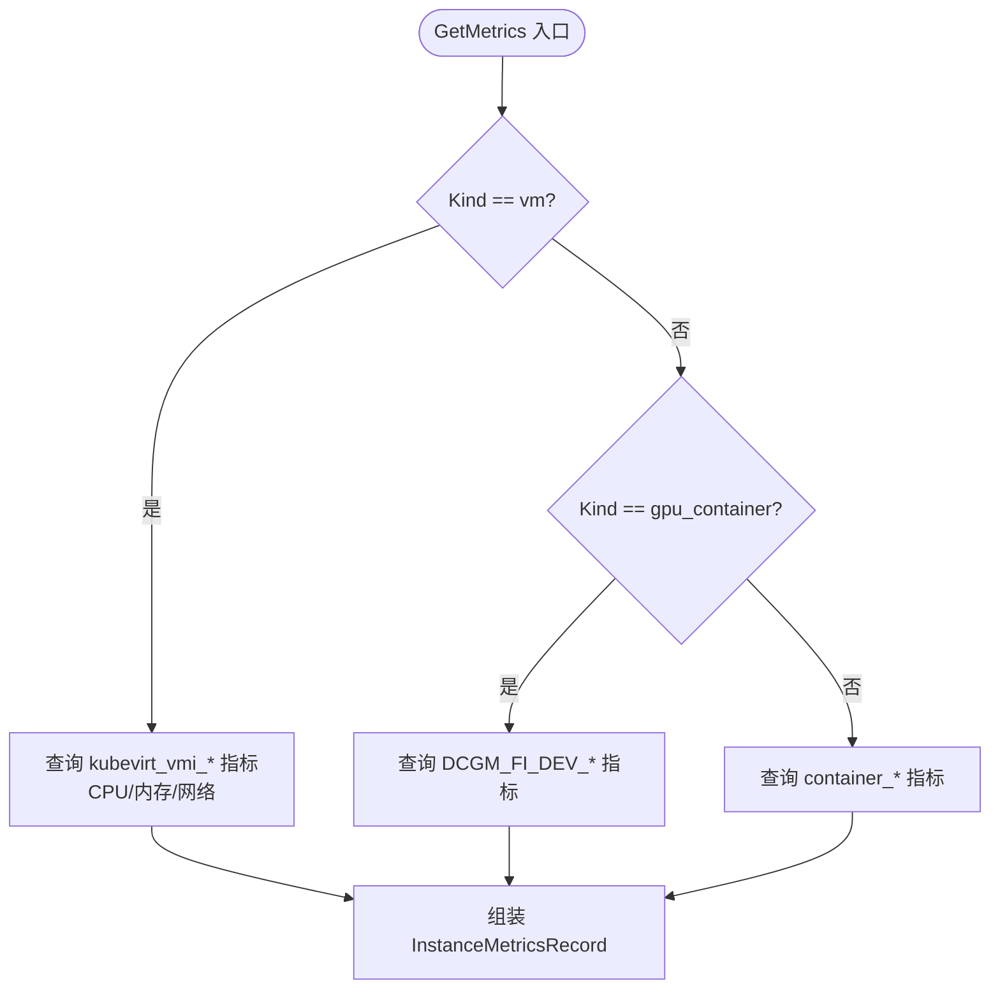
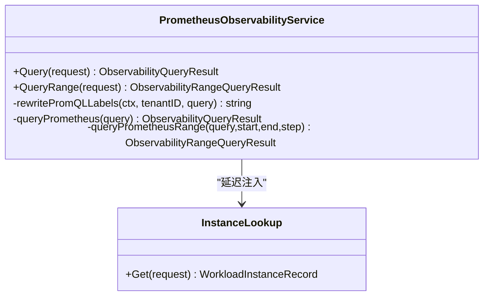
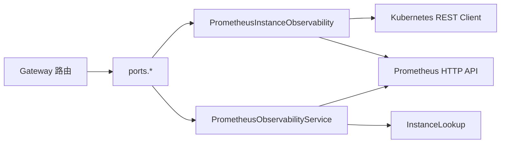

# 指标收集接口

<cite>
**本文引用的文件**
- [repo/pkg/ports/instance_observability.go](file://repo/pkg/ports/instance_observability.go)
- [repo/pkg/ports/observability.go](file://repo/pkg/ports/observability.go)
- [repo/pkg/adapters/runtime/prometheus_instance_observability.go](file://repo/pkg/adapters/runtime/prometheus_instance_observability.go)
- [repo/pkg/adapters/runtime/prometheus_observability_service.go](file://repo/pkg/adapters/runtime/prometheus_observability_service.go)
- [repo/services/ani-gateway/internal/router/observability.go](file://repo/services/ani-gateway/internal/router/observability.go)
- [repo/services/ani-gateway/instance_observability_runtime.go](file://repo/services/ani-gateway/instance_observability_runtime.go)
- [repo/pkg/adapters/metering/collectors.go](file://repo/pkg/adapters/metering/collectors.go)
</cite>

## 目录
1. [简介](#简介)
2. [项目结构](#项目结构)
3. [核心组件](#核心组件)
4. [架构总览](#架构总览)
5. [详细组件分析](#详细组件分析)
6. [依赖关系分析](#依赖关系分析)
7. [性能与可用性](#性能与可用性)
8. [故障排查指南](#故障排查指南)
9. [结论](#结论)
10. [附录：接口规范](#附录接口规范)

## 简介
本文件面向“指标收集接口”的完整说明，覆盖 Prometheus 指标暴露、自定义业务指标上报、性能指标采集等监控能力；记录指标定义规范、标签体系设计、指标聚合计算等功能；并给出系统资源使用统计、应用性能指标、业务关键指标等监控维度。同时提供指标查询 API、时序数据获取、批量指标上报等接口规范，帮助使用者快速接入与集成。

## 项目结构
本项目将“实例可观测性”和“通用可观测性（PromQL 代理）”分层实现：
- 端口层（ports）：统一抽象 InstanceObservability 与 ObservabilityService，屏蔽底层 Kubernetes/Prometheus/Loki 细节。
- 适配器层（adapters/runtime）：PrometheusInstanceObservability 负责实例级指标/日志/事件采集；PrometheusObservabilityService 负责 PromQL 查询重写与转发。
- 网关路由（services/ani-gateway）：注册 /api/v1/observability/* 等 HTTP 端点，承载查询与告警规则管理。
- 计量采集（adapters/metering）：Collector 接口与实现用于周期化采集用量（GPU/CPU/内存），供计量服务持久化。

**图表来源**
- [repo/services/ani-gateway/internal/router/observability.go:95-104](file://repo/services/ani-gateway/internal/router/observability.go#L95-L104)
- [repo/pkg/ports/instance_observability.go:127-136](file://repo/pkg/ports/instance_observability.go#L127-L136)
- [repo/pkg/ports/observability.go:135-143](file://repo/pkg/ports/observability.go#L135-L143)
- [repo/pkg/adapters/runtime/prometheus_instance_observability.go:155-250](file://repo/pkg/adapters/runtime/prometheus_instance_observability.go#L155-L250)
- [repo/pkg/adapters/runtime/prometheus_observability_service.go:94-176](file://repo/pkg/adapters/runtime/prometheus_observability_service.go#L94-L176)

**章节来源**
- [repo/pkg/ports/instance_observability.go:8-136](file://repo/pkg/ports/instance_observability.go#L8-L136)
- [repo/pkg/ports/observability.go:8-143](file://repo/pkg/ports/observability.go#L8-L143)
- [repo/services/ani-gateway/internal/router/observability.go:95-104](file://repo/services/ani-gateway/internal/router/observability.go#L95-L104)

## 核心组件
- InstanceObservability 接口：封装实例维度的日志、事件、指标、安全事件、exec/console 会话等能力。
- ObservabilityService 接口：封装通用可观测性能力，包括即时查询、区间查询、告警规则 CRUD。
- PrometheusInstanceObservability：基于 Prometheus/Kubernetes/Loki 的实例可观测性实现，支持容器/GPU/VM 三类工作负载。
- PrometheusObservabilityService：对前端冻结 PromQL 进行 label 重写（namespace/pod/name），再转发到真实 Prometheus。
- metering.Collector：周期化采集 GPU/CPU/内存用量，写入计量存储。

**章节来源**
- [repo/pkg/ports/instance_observability.go:8-136](file://repo/pkg/ports/instance_observability.go#L8-L136)
- [repo/pkg/ports/observability.go:8-143](file://repo/pkg/ports/observability.go#L8-L143)
- [repo/pkg/adapters/runtime/prometheus_instance_observability.go:19-86](file://repo/pkg/adapters/runtime/prometheus_instance_observability.go#L19-L86)
- [repo/pkg/adapters/runtime/prometheus_observability_service.go:18-77](file://repo/pkg/adapters/runtime/prometheus_observability_service.go#L18-L77)
- [repo/pkg/adapters/metering/collectors.go:19-43](file://repo/pkg/adapters/metering/collectors.go#L19-L43)

## 架构总览
下图展示从 Console 到后端存储的端到端调用链：Console 通过 Gateway 暴露的 /api/v1/observability/query_range 获取时序数据；Gateway 路由到 ObservabilityService；PrometheusObservabilityService 重写 PromQL 中的 namespace/pod/name 后转发至 Prometheus；实例快照指标由 PrometheusInstanceObservability 根据 Kind 选择不同采集路径（container/gpu_container/vm）。

**图表来源**
- [repo/services/ani-gateway/internal/router/observability.go:95-154](file://repo/services/ani-gateway/internal/router/observability.go#L95-L154)
- [repo/pkg/adapters/runtime/prometheus_observability_service.go:142-176](file://repo/pkg/adapters/runtime/prometheus_observability_service.go#L142-L176)
- [repo/pkg/adapters/runtime/prometheus_instance_observability.go:155-324](file://repo/pkg/adapters/runtime/prometheus_instance_observability.go#L155-L324)

## 详细组件分析

### 组件一：实例指标采集（PrometheusInstanceObservability）
- 职责：按 Kind 区分采集路径，返回统一的 InstanceMetricsRecord。
- 关键逻辑：
  - VM：查询 kubevirt_vmi_* 指标，CPU 使用率用 rate(...[5m])，网络 RX/TX 同理；内存已用采用 domain_bytes - usable_bytes 公式；总量来自 domain_bytes。
  - GPU Container：仅当 Kind 为 gpu_container 时查询 DCGM 指标，显存 total 由 FB_FREE + FB_USED 计算。
  - 其他容器：通过 metrics.k8s.io/cAdvisor 系列指标采集 CPU/内存/网络。
  - 单 exporter 降级：任一指标不可用时字段为 nil，不伪造 0。
  - 租户隔离：通过 tenantNamespace 过滤，避免跨租户误匹配。
  - Pod 匹配：使用正则 pod=~"^name(-.*)?$" 兼容控制器生成的带 hash 后缀的 Pod。

**图表来源**
- [repo/pkg/adapters/runtime/prometheus_instance_observability.go:155-324](file://repo/pkg/adapters/runtime/prometheus_instance_observability.go#L155-L324)

**章节来源**
- [repo/pkg/adapters/runtime/prometheus_instance_observability.go:155-324](file://repo/pkg/adapters/runtime/prometheus_instance_observability.go#L155-L324)

### 组件二：PromQL 代理与标签重写（PrometheusObservabilityService）
- 职责：接收前端冻结模板渲染的 PromQL，重写其中的 namespace/pod/name 为真实值，再转发到 Prometheus。
- 关键点：
  - 支持 name label 精确匹配（VM 场景）。
  - 若实例查找失败或 Prometheus 查询失败，返回空结果并在 DevProfile 中记录降级原因。
  - 区间查询返回矩阵类型，过滤 NaN/Inf 采样点。

**图表来源**
- [repo/pkg/adapters/runtime/prometheus_observability_service.go:18-77](file://repo/pkg/adapters/runtime/prometheus_observability_service.go#L18-L77)
- [repo/pkg/adapters/runtime/prometheus_observability_service.go:242-312](file://repo/pkg/adapters/runtime/prometheus_observability_service.go#L242-L312)

**章节来源**
- [repo/pkg/adapters/runtime/prometheus_observability_service.go:94-176](file://repo/pkg/adapters/runtime/prometheus_observability_service.go#L94-L176)
- [repo/pkg/adapters/runtime/prometheus_observability_service.go:242-312](file://repo/pkg/adapters/runtime/prometheus_observability_service.go#L242-L312)

### 组件三：Gateway 路由与响应映射
- 职责：注册 /api/v1/observability/query、/query_range、告警规则管理等端点，解析参数并调用服务层。
- 关键点：
  - query_range 要求 start/end/step 必填且格式正确。
  - 错误统一映射为 BAD_REQUEST/NOT_FOUND 等。
  - 响应包含 dev_profile 以标识数据来源与降级原因。

**章节来源**
- [repo/services/ani-gateway/internal/router/observability.go:95-154](file://repo/services/ani-gateway/internal/router/observability.go#L95-L154)
- [repo/services/ani-gateway/internal/router/observability.go:156-254](file://repo/services/ani-gateway/internal/router/observability.go#L156-L254)
- [repo/services/ani-gateway/internal/router/observability.go:338-348](file://repo/services/ani-gateway/internal/router/observability.go#L338-L348)

### 组件四：运行时装配与日志存储注入
- 职责：根据环境变量选择 InstanceObservability 提供者与 LogStore 实现。
- 关键点：
  - Provider=prometheus_kubernetes 时创建 PrometheusInstanceObservability。
  - LogStoreType=loki 时注入 LokiLogStore；否则 fallback 到 K8s pod log API。
  - 未知值或未配置不会阻塞启动，走降级路径。

**章节来源**
- [repo/services/ani-gateway/instance_observability_runtime.go:34-82](file://repo/services/ani-gateway/instance_observability_runtime.go#L34-L82)
- [repo/services/ani-gateway/instance_observability_runtime.go:84-118](file://repo/services/ani-gateway/instance_observability_runtime.go#L84-L118)

### 组件五：计量采集（Collector）
- 职责：按周期采集 GPU/CPU/内存用量，生成 MeteringUsageRecord 供计量服务持久化。
- 关键点：
  - GPU 采集为纯时长（Count × IntervalSec），不直接查 DCGM。
  - CPU/内存采集通过 Prometheus HTTP API 查询。
  - CollectAll 路由聚合多个 Collector 的结果。

**章节来源**
- [repo/pkg/adapters/metering/collectors.go:19-43](file://repo/pkg/adapters/metering/collectors.go#L19-L43)

## 依赖关系分析
- ports 层解耦了具体实现，使 Gateway 仅依赖接口。
- PrometheusInstanceObservability 依赖 KubernetesRESTClient 访问 K8s API，依赖 Prometheus HTTP API 获取指标。
- PrometheusObservabilityService 依赖 InstanceLookup 解析真实 namespace/pod/name，再转发到 Prometheus。
- Gateway 路由依赖 ports 接口，运行时装配决定具体实现。

**图表来源**
- [repo/pkg/adapters/runtime/prometheus_instance_observability.go:19-86](file://repo/pkg/adapters/runtime/prometheus_instance_observability.go#L19-L86)
- [repo/pkg/adapters/runtime/prometheus_observability_service.go:18-77](file://repo/pkg/adapters/runtime/prometheus_observability_service.go#L18-L77)
- [repo/services/ani-gateway/internal/router/observability.go:95-104](file://repo/services/ani-gateway/internal/router/observability.go#L95-L104)

**章节来源**
- [repo/pkg/adapters/runtime/prometheus_instance_observability.go:19-86](file://repo/pkg/adapters/runtime/prometheus_instance_observability.go#L19-L86)
- [repo/pkg/adapters/runtime/prometheus_observability_service.go:18-77](file://repo/pkg/adapters/runtime/prometheus_observability_service.go#L18-L77)
- [repo/services/ani-gateway/internal/router/observability.go:95-104](file://repo/services/ani-gateway/internal/router/observability.go#L95-L104)

## 性能与可用性
- 多 exporter 聚合：每个指标独立查询，单个 exporter 不可用时不影响其他字段，缺失字段为 nil。
- 超时与错误处理：Prometheus 查询失败返回空结果并标记降级原因，避免级联失败。
- 标签正则匹配：pod 匹配使用正则兼容控制器生成的 hash 后缀，减少误匹配。
- 日志分页：支持 cursor 翻页，Loki 路径下方向 backward，首屏最新 limit 条。

[本节为通用指导，无需特定文件引用]

## 故障排查指南
- 指标无数据：检查 Prometheus scrape job 是否就绪（DCGM/kubevirt-virt-handler），确认 label 值是否正确重写。
- 查询失败：查看 DevProfile.Reason 中的降级原因（如 instance lookup failed、prometheus query failed）。
- 日志不可用：确认 LogStore 是否注入（INSTANCE_OBSERVABILITY_LOG_STORE），未配置则回退到 K8s pod log API。
- VM 指标异常：确认 virt-handler 可被 Prometheus 抓取，label name 精确匹配 VMI metadata.name。

**章节来源**
- [repo/pkg/adapters/runtime/prometheus_observability_service.go:107-127](file://repo/pkg/adapters/runtime/prometheus_observability_service.go#L107-L127)
- [repo/pkg/adapters/runtime/prometheus_instance_observability.go:253-324](file://repo/pkg/adapters/runtime/prometheus_instance_observability.go#L253-L324)
- [repo/services/ani-gateway/instance_observability_runtime.go:84-118](file://repo/services/ani-gateway/instance_observability_runtime.go#L84-L118)

## 结论
本方案通过 ports 抽象与适配器模式，实现了实例级指标采集与通用 PromQL 代理的统一入口；支持容器/GPU/VM 多种工作负载，具备健壮的错误降级与租户隔离能力；结合日志持久化与计量采集，形成完整的可观测性与用量闭环。建议在生产环境部署 Prometheus scrape job（DCGM/kubevirt-virt-handler）并启用 Loki 日志持久化以获得最佳体验。

[本节为总结，无需特定文件引用]

## 附录：接口规范

### 指标查询 API（PromQL 代理）
- 端点
  - GET /api/v1/observability/query
  - GET /api/v1/observability/query_range
- 请求参数
  - query: 冻结后的 PromQL（前端模板渲染）
  - start/end/step: 区间查询必需（RFC3339 时间戳与正 duration）
  - tenant_id: 由上下文注入
- 响应
  - results: vector/matrix/scalar/string
  - dev_profile: 标识数据来源与降级原因

**章节来源**
- [repo/services/ani-gateway/internal/router/observability.go:95-154](file://repo/services/ani-gateway/internal/router/observability.go#L95-L154)
- [repo/pkg/ports/observability.go:33-81](file://repo/pkg/ports/observability.go#L33-L81)

### 实例指标快照 API
- 端点
  - GET /api/v1/instances/{id}/metrics
- 请求体
  - tenant_id: 由上下文注入
  - kind: vm | gpu_container | 其他容器
- 响应
  - cpu_utilization_pct, memory_used_mb, memory_total_mb
  - network_rx_bytes, network_tx_bytes
  - gpu_utilization_pct, gpu_memory_used_mb, gpu_memory_total_mb（仅 gpu_container）
  - timestamp, dev_profile

**章节来源**
- [repo/pkg/ports/instance_observability.go:18-70](file://repo/pkg/ports/instance_observability.go#L18-L70)
- [repo/pkg/adapters/runtime/prometheus_instance_observability.go:155-324](file://repo/pkg/adapters/runtime/prometheus_instance_observability.go#L155-L324)

### 日志查询 API（持久化与回退）
- 端点
  - GET /api/v1/instances/{id}/logs
- 行为
  - 若注入 LogStore（如 Loki），走持久化路径；否则回退到 K8s pod log API
  - 支持 limit、cursor、level 过滤

**章节来源**
- [repo/pkg/adapters/runtime/prometheus_instance_observability.go:88-140](file://repo/pkg/adapters/runtime/prometheus_instance_observability.go#L88-L140)
- [repo/services/ani-gateway/instance_observability_runtime.go:84-118](file://repo/services/ani-gateway/instance_observability_runtime.go#L84-L118)

### 批量指标上报（计量采集）
- 机制
  - Collector 接口按周期采集 GPU/CPU/内存用量，生成 MeteringUsageRecord
  - 通过计量服务持久化（不在本仓库公开 HTTP 接口）
- 采集源
  - GPU：时长采集（Count × IntervalSec）
  - CPU/内存：Prometheus HTTP API

**章节来源**
- [repo/pkg/adapters/metering/collectors.go:19-43](file://repo/pkg/adapters/metering/collectors.go#L19-L43)