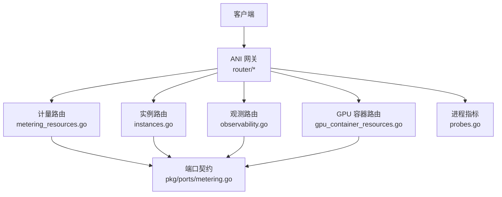
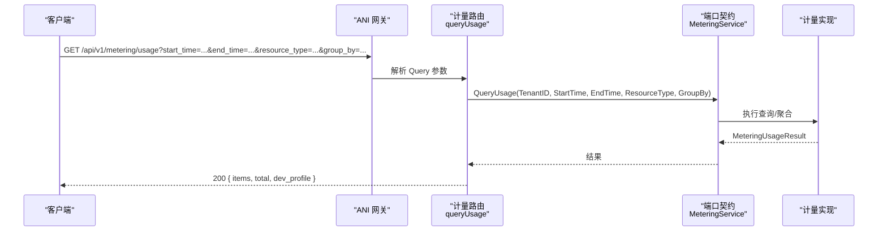
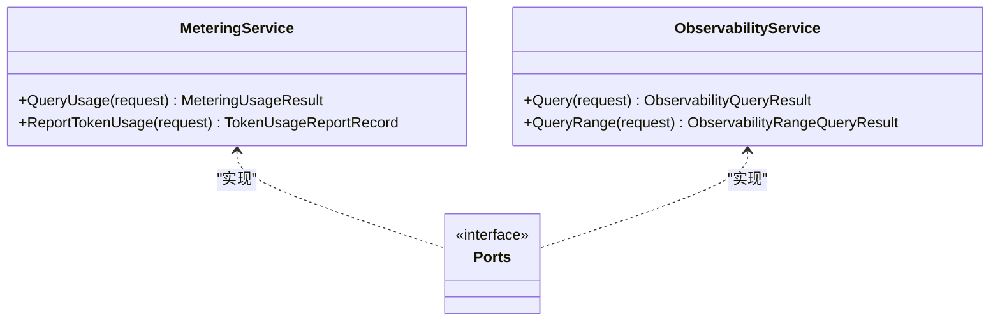

# 指标查询 API

<cite>
**本文引用的文件**
- [v1.yaml](file://repo/api/openapi/v1.yaml)
- [metering_resources.go](file://repo/services/ani-gateway/internal/router/metering_resources.go)
- [instances.go](file://repo/services/ani-gateway/internal/router/instances.go)
- [observability.go](file://repo/services/ani-gateway/internal/router/observability.go)
- [gpu_container_resources.go](file://repo/services/ani-gateway/internal/router/gpu_container_resources.go)
- [metering_service.proto](file://repo/api/proto/metering/v1/metering_service.proto)
- [metering.go](file://repo/pkg/ports/metering.go)
- [probes.go](file://repo/pkg/bootstrap/probes.go)
</cite>

## 目录
1. [简介](#简介)
2. [项目结构](#项目结构)
3. [核心组件](#核心组件)
4. [架构总览](#架构总览)
5. [详细接口说明](#详细接口说明)
6. [依赖关系分析](#依赖关系分析)
7. [性能与可用性](#性能与可用性)
8. [故障排查指南](#故障排查指南)
9. [结论](#结论)
10. [附录：版本兼容性与迁移](#附录版本兼容性与迁移)

## 简介
本文件面向“指标查询”相关 REST API，覆盖资源计量用量查询、实例观测指标获取、PromQL 时序查询以及进程级 /metrics 暴露等能力。文档基于仓库中的网关路由、端口契约与 OpenAPI 规范整理，提供请求参数、响应格式、认证方式、错误码与调用示例，并给出常见使用场景（时序数据查询、指标聚合过滤、批量指标获取）和版本兼容性建议。

## 项目结构
- 网关层负责将 HTTP 请求路由到具体业务处理器，并在必要时转换为内部端口调用。
- 计量与观测能力通过 ports 接口抽象，由不同实现（本地模拟、Prometheus/Kubernetes 等）提供。
- OpenAPI 规范定义统一的前缀、认证、错误与分页约定。

图表来源
- [metering_resources.go:65-69](file://repo/services/ani-gateway/internal/router/metering_resources.go#L65-L69)
- [instances.go:780-788](file://repo/services/ani-gateway/internal/router/instances.go#L780-L788)
- [observability.go:95-104](file://repo/services/ani-gateway/internal/router/observability.go#L95-L104)
- [gpu_container_resources.go:12-24](file://repo/services/ani-gateway/internal/router/gpu_container_resources.go#L12-L24)
- [probes.go:53-53](file://repo/pkg/bootstrap/probes.go#L53-L53)

章节来源
- [v1.yaml:1-39](file://repo/api/openapi/v1.yaml#L1-L39)
- [metering_resources.go:65-69](file://repo/services/ani-gateway/internal/router/metering_resources.go#L65-L69)
- [instances.go:780-788](file://repo/services/ani-gateway/internal/router/instances.go#L780-L788)
- [observability.go:95-104](file://repo/services/ani-gateway/internal/router/observability.go#L95-L104)
- [gpu_container_resources.go:12-24](file://repo/services/ani-gateway/internal/router/gpu_container_resources.go#L12-L24)
- [probes.go:53-53](file://repo/pkg/bootstrap/probes.go#L53-L53)

## 核心组件
- 计量用量查询：GET /metering/usage，支持按时间范围、资源类型与分组维度聚合。
- 令牌用量上报：POST /metering/token-usage，幂等上报模型调用的输入/输出 token 用量。
- 实例指标快照：GET /instances/{instance_id}/metrics，返回 CPU/内存/网络/GPU 等当前或最近快照。
- 观测时序查询：GET /observability/query 与 GET /observability/query_range，支持 PromQL 单点与区间查询。
- 进程指标：GET /metrics，以 Prometheus text/plain 格式暴露服务自身指标。

章节来源
- [metering_resources.go:65-94](file://repo/services/ani-gateway/internal/router/metering_resources.go#L65-L94)
- [instances.go:780-788](file://repo/services/ani-gateway/internal/router/instances.go#L780-L788)
- [observability.go:106-154](file://repo/services/ani-gateway/internal/router/observability.go#L106-L154)
- [probes.go:53-53](file://repo/pkg/bootstrap/probes.go#L53-L53)

## 架构总览
以下序列图展示一次计量用量查询的端到端流程：客户端发起请求，网关解析参数并调用计量服务端口，最终返回聚合结果。

图表来源
- [metering_resources.go:71-94](file://repo/services/ani-gateway/internal/router/metering_resources.go#L71-L94)
- [metering.go:78-81](file://repo/pkg/ports/metering.go#L78-L81)

## 详细接口说明

### 通用约定
- URL 前缀：/api/v1（OpenAPI 中定义）。
- 认证：Bearer JWT 或 X-API-Key；tenant_id 从认证上下文提取，请求体中的 tenant_id 字段将被忽略。
- 错误格式：{ code, message, request_id, details? }；标准错误码包括 UNAUTHORIZED、FORBIDDEN、NOT_FOUND、CONFLICT、BAD_REQUEST、RATE_LIMIT_EXCEEDED、NOT_IMPLEMENTED、INTERNAL_ERROR。
- 分页：cursor 分页，返回 { items, next_cursor }。

章节来源
- [v1.yaml:16-39](file://repo/api/openapi/v1.yaml#L16-L39)

### GET /api/v1/metering/usage
- 功能：查询租户在指定时间范围内的资源用量，支持按资源类型与分组维度聚合。
- 路径：/api/v1/metering/usage
- 方法：GET
- 认证：Bearer JWT 或 X-API-Key
- 查询参数
  - start_time：RFC3339 时间戳，可选
  - end_time：RFC3339 时间戳，可选
  - resource_type：枚举值之一，如 instance_cpu_seconds、instance_memory_gib_seconds、instance_gpu_seconds、token_input、token_output、token_total
  - group_by：聚合维度，如 resource_type、az、day、hour
- 成功响应（200）
  - items：数组，每项包含 tenant_id、resource_type、total_quantity、unit、period
  - total：条目数
  - dev_profile：开发环境标识（mode/provider/real_provider/reason）
- 错误
  - 400 BAD_REQUEST：start_time/end_time 非 RFC3339 或参数非法
  - 500 INTERNAL_ERROR：内部错误

调用示例
- 查询某租户过去 24 小时的 CPU 秒用量并按天聚合：
  - GET /api/v1/metering/usage?start_time=2026-01-01T00:00:00Z&end_time=2026-01-02T00:00:00Z&resource_type=instance_cpu_seconds&group_by=day
- 查询 token 总量并按资源类型聚合：
  - GET /api/v1/metering/usage?start_time=...&end_time=...&resource_type=token_total&group_by=resource_type

章节来源
- [metering_resources.go:65-94](file://repo/services/ani-gateway/internal/router/metering_resources.go#L65-L94)
- [metering_resources.go:126-142](file://repo/services/ani-gateway/internal/router/metering_resources.go#L126-L142)
- [metering.go:8-32](file://repo/pkg/ports/metering.go#L8-L32)

### POST /api/v1/metering/token-usage
- 功能：幂等上报模型调用的 token 用量（输入/输出），用于计费与统计。
- 路径：/api/v1/metering/token-usage
- 方法：POST
- 认证：Bearer JWT 或 X-API-Key
- 请求体字段
  - idempotency_key：幂等键，必填
  - source：来源服务名，必填
  - model：模型名，必填
  - input_tokens：输入 token 数，必填
  - output_tokens：输出 token 数，必填
  - request_id：可选
  - instance_id：可选
  - occurred_at：RFC3339 时间戳，可选
  - labels：键值标签，可选
- 成功响应（202 Accepted）
  - id：上报记录 ID
  - tenant_id、source、model、input_tokens、output_tokens、total_tokens
  - request_id、instance_id
  - state：accepted 或 duplicate
  - created_at：创建时间
  - dev_profile：开发环境标识
- 错误
  - 400 BAD_REQUEST：JSON 无效或 occurred_at 非 RFC3339
  - 500 INTERNAL_ERROR：内部错误

调用示例
- 上报一次推理请求的 token 用量：
  - POST /api/v1/metering/token-usage
  - Body: { idempotency_key: "req-123", source: "model-service", model: "qwen2.5", input_tokens: 7, output_tokens: 11, request_id: "r-1", occurred_at: "2026-01-01T12:00:00Z" }

章节来源
- [metering_resources.go:96-124](file://repo/services/ani-gateway/internal/router/metering_resources.go#L96-L124)
- [metering_resources.go:144-159](file://repo/services/ani-gateway/internal/router/metering_resources.go#L144-L159)
- [metering.go:50-76](file://repo/pkg/ports/metering.go#L50-L76)

### GET /api/v1/instances/{instance_id}/metrics
- 功能：获取实例的观测指标快照（CPU/内存/网络/GPU 等）。
- 路径：/api/v1/instances/{instance_id}/metrics
- 方法：GET
- 认证：Bearer JWT 或 X-API-Key
- 路径参数
  - instance_id：实例 ID
- 查询参数
  - start/end/step：可选（部分实现支持历史区间）
- 成功响应（200）
  - 指标字段根据实例类型填充：cpu_utilization_pct、memory_used_mb、memory_total_mb、network_rx_bytes、network_tx_bytes、gpu_utilization_pct、gpu_memory_used_mb、gpu_memory_total_mb
  - timestamp：指标时间戳
  - dev_profile：开发环境标识
- 错误
  - 404 NOT_FOUND：实例不存在
  - 400 BAD_REQUEST：参数非法
  - 500 INTERNAL_ERROR：内部错误

调用示例
- 获取实例最新指标快照：
  - GET /api/v1/instances/{instance_id}/metrics
- 获取 VM 类型的 CPU/内存/网络指标（后端根据 kind 选择数据源）：
  - GET /api/v1/instances/{vm_instance_id}/metrics

章节来源
- [instances.go:780-788](file://repo/services/ani-gateway/internal/router/instances.go#L780-L788)
- [spec-console-instance-observability-completion.md:464-494](file://repo/services/tasks/modules/spec/console/compute/spec-console-instance-observability-completion.md#L464-L494)

### GET /api/v1/observability/query
- 功能：执行 PromQL 单点查询，返回样本集合。
- 路径：/api/v1/observability/query
- 方法：GET
- 认证：Bearer JWT 或 X-API-Key
- 查询参数
  - query：PromQL 表达式，必填
- 成功响应（200）
  - query：原始查询
  - result_type：结果类型（如 matrix/vector）
  - results：样本数组，每项含 metric、value、timestamp（可选）
  - dev_profile：开发环境标识
- 错误
  - 400 BAD_REQUEST：参数非法
  - 5xx：下游不可用或查询失败

调用示例
- 查询容器 CPU 使用率：
  - GET /api/v1/observability/query?query=container_cpu_usage_seconds_total

章节来源
- [observability.go:106-116](file://repo/services/ani-gateway/internal/router/observability.go#L106-L116)
- [observability.go:256-271](file://repo/services/ani-gateway/internal/router/observability.go#L256-L271)

### GET /api/v1/observability/query_range
- 功能：执行 PromQL 区间查询，返回时间序列。
- 路径：/api/v1/observability/query_range
- 方法：GET
- 认证：Bearer JWT 或 X-API-Key
- 查询参数
  - query：PromQL 表达式，必填
  - start：RFC3339 起始时间，必填
  - end：RFC3339 结束时间，必填
  - step：Go duration 字符串（如 1m、5s），必填且必须为正
- 成功响应（200）
  - query：原始查询
  - result_type：结果类型
  - results：系列数组，每项含 metric、values（时间戳+数值）
  - dev_profile：开发环境标识
- 错误
  - 400 BAD_REQUEST：start/end/step 缺失或非法
  - 5xx：下游不可用或查询失败

调用示例
- 查询过去 1 小时 CPU 使用率曲线：
  - GET /api/v1/observability/query_range?query=rate(container_cpu_usage_seconds_total[5m])&start=2026-01-01T00:00:00Z&end=2026-01-01T01:00:00Z&step=1m

章节来源
- [observability.go:118-154](file://repo/services/ani-gateway/internal/router/observability.go#L118-L154)
- [observability.go:273-291](file://repo/services/ani-gateway/internal/router/observability.go#L273-L291)

### GET /api/v1/gpu-containers/{container_id}/metrics
- 功能：获取 GPU 容器指标（当前为占位实现）。
- 路径：/api/v1/gpu-containers/{container_id}/metrics
- 方法：GET
- 认证：Bearer JWT 或 X-API-Key
- 成功响应（200）
  - container_id：容器 ID
  - metrics：空数组（占位）
- 备注：该端点当前未接入真实数据源，后续可替换为 DCGM/Prometheus 等实现。

章节来源
- [gpu_container_resources.go:20-20](file://repo/services/ani-gateway/internal/router/gpu_container_resources.go#L20-L20)
- [gpu_container_resources.go:62-66](file://repo/services/ani-gateway/internal/router/gpu_container_resources.go#L62-L66)

### GET /metrics（进程指标）
- 功能：以 Prometheus text/plain 格式暴露服务自身指标（如 reconcile 计数）。
- 路径：/metrics
- 方法：GET
- 认证：通常不鉴权（仅用于监控采集）
- 成功响应（200）
  - Content-Type: text/plain; version=0.0.4
  - 指标样例：ani_workload_reconcile_ticks_total、ani_workload_reconcile_successes_total 等

章节来源
- [probes.go:53-53](file://repo/pkg/bootstrap/probes.go#L53-L53)
- [probes_test.go:171-189](file://repo/pkg/bootstrap/probes_test.go#L171-L189)

## 依赖关系分析
- 计量用量查询依赖 ports.MeteringService 接口，实际实现可为本地模拟或持久化存储（DB/NATS/Prometheus 集成）。
- 观测查询依赖 ports.ObservabilityService，底层对接 Prometheus/Kubernetes 等。
- 实例指标快照根据实例 kind 选择不同数据源（VM 走 KubeVirt，容器/GPU 走 Prometheus/DCGM）。

图表来源
- [metering.go:78-81](file://repo/pkg/ports/metering.go#L78-L81)

章节来源
- [metering.go:78-81](file://repo/pkg/ports/metering.go#L78-L81)
- [observability.go:88-93](file://repo/services/ani-gateway/internal/router/observability.go#L88-L93)

## 性能与可用性
- 计量查询支持 group_by 聚合，建议在大数据量时选择合适的维度（如 day/hour）以减少响应体积。
- 观测区间查询需合理设置 step，避免过细粒度导致大量数据。
- 实例指标快照为近实时数据，前端可缓存（例如 30 秒）以降低重复请求压力。
- 进程指标 /metrics 供监控系统拉取，注意采集频率与服务负载平衡。

## 故障排查指南
- 400 BAD_REQUEST
  - 检查 start_time/end_time 是否为 RFC3339。
  - 检查 query_range 的 start/end/step 是否齐全且合法。
- 404 NOT_FOUND
  - 确认 instance_id 是否存在且属于当前租户。
- 5xx 错误
  - 观测查询可能因下游 Prometheus/Kubernetes 不可用而失败，检查服务健康与网络连通性。
  - 计量上报失败时，检查 idempotency_key 是否重复、occurred_at 格式是否正确。

章节来源
- [metering_resources.go:172-179](file://repo/services/ani-gateway/internal/router/metering_resources.go#L172-L179)
- [observability.go:338-347](file://repo/services/ani-gateway/internal/router/observability.go#L338-L347)

## 结论
本 API 集提供了完整的指标查询能力：计量用量聚合、实例指标快照、PromQL 时序查询与进程指标暴露。通过统一的认证、错误与分页约定，结合 ports 抽象与多实现策略，既满足开发调试也支撑生产观测与计费需求。建议在生产环境中启用真实的观测与计量后端，并根据业务规模优化查询粒度与聚合维度。

## 附录：版本兼容性与迁移
- 版本前缀：所有 API 位于 /api/v1，升级时新建 v2 并保持 v1 稳定。
- 向后兼容：新增字段应为可选，删除字段需废弃过渡期。
- 迁移建议
  - 将旧版自定义指标端点迁移至 /observability/query_range，使用 PromQL 表达相同语义。
  - 对计量用量查询，优先使用 group_by 进行聚合，减少客户端计算负担。
  - 对于 token 用量上报，确保 idempotency_key 唯一，避免重复计费。

章节来源
- [v1.yaml:16-39](file://repo/api/openapi/v1.yaml#L16-L39)
- [metering_service.proto:11-22](file://repo/api/proto/metering/v1/metering_service.proto#L11-L22)