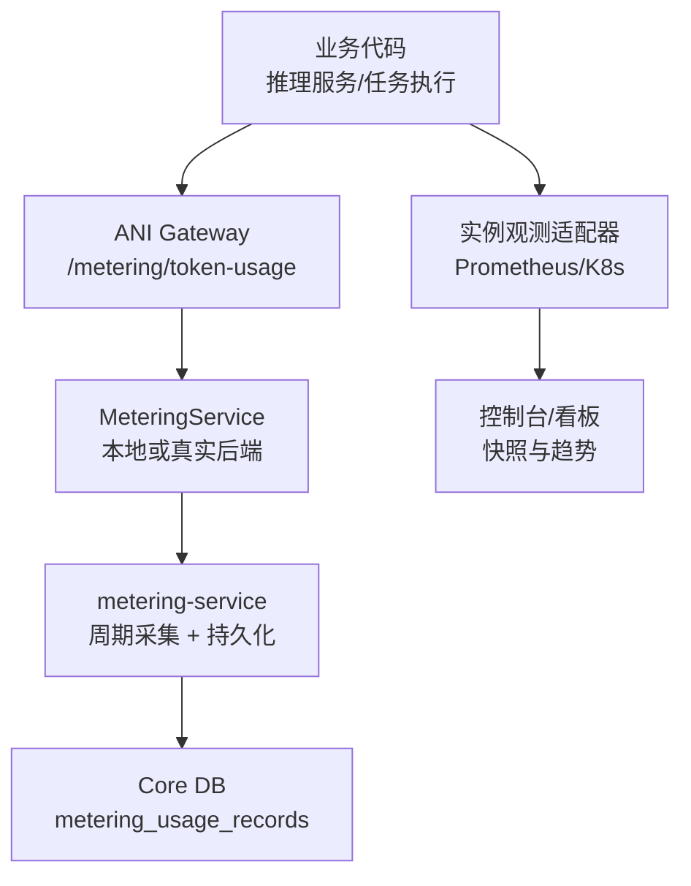
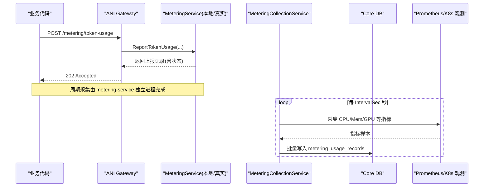
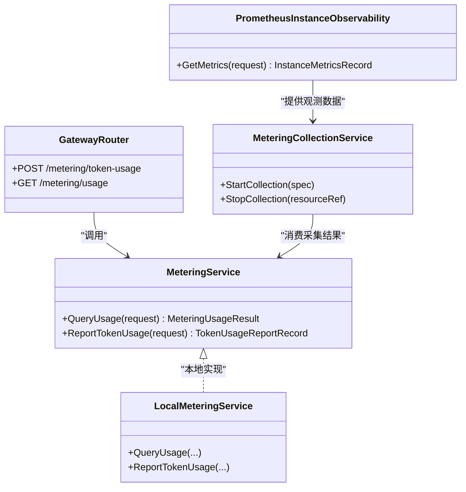

# 自定义业务指标上报

<cite>
**本文引用的文件**
- [pkg/ports/metering.go](file://repo/pkg/ports/metering.go)
- [services/ani-gateway/internal/router/metering_resources.go](file://repo/services/ani-gateway/internal/router/metering_resources.go)
- [pkg/adapters/runtime/local_metering_service.go](file://repo/pkg/adapters/runtime/local_metering_service.go)
- [services/metering-service/internal/service/metering_collection_service.go](file://repo/services/metering-service/internal/service/metering_collection_service.go)
- [pkg/adapters/runtime/prometheus_instance_observability.go](file://repo/pkg/adapters/runtime/prometheus_instance_observability.go)
- [pkg/adapters/runtime/local_instance_observability_service.go](file://repo/pkg/adapters/runtime/local_instance_observability_service.go)
- [sdks/core/go/anisdk/client.go](file://repo/sdks/core/go/anisdk/client.go)
- [services/tasks/modules/prd/console/inference/prd-console-model-usage-stats.md](file://repo/services/tasks/modules/prd/console/inference/prd-console-model-usage-stats.md)
- [development-records/pr-m1-metering-consumer.md](file://repo/development-records/pr-m1-metering-consumer.md)
- [development-records/instance-observability-completion-b5-getmetrics-vm-branch.md](file://repo/development-records/instance-observability-completion-b5-getmetrics-vm-branch.md)
</cite>

## 目录
1. [简介](#简介)
2. [项目结构](#项目结构)
3. [核心组件](#核心组件)
4. [架构总览](#架构总览)
5. [详细组件分析](#详细组件分析)
6. [依赖关系分析](#依赖关系分析)
7. [性能与批量上报优化](#性能与批量上报优化)
8. [故障排查指南](#故障排查指南)
9. [结论](#结论)
10. [附录：SDK 使用示例与最佳实践](#附录sdk-使用示例与最佳实践)

## 简介
本文件面向在业务代码中采集并上报“自定义业务指标”的开发者，覆盖以下目标：
- 指标类型定义与口径：计数器、直方图（以 Prometheus 时序为主）、仪表盘（快照与趋势）。
- 指标上下文绑定：租户、实例、模型、来源等维度。
- 批量上报与幂等：通过网关接口与计量服务实现去重与批写。
- 关键业务指标度量方法：模型调用次数、Token 用量、推理延迟、GPU/CPU/内存等资源占用。
- SDK 使用与接入步骤：如何在业务侧调用上报接口，如何查询用量。

## 项目结构
本项目将“指标上报”拆分为三层：
- 网关层：暴露 HTTP API，负责鉴权、参数校验、请求路由。
- 计量服务层：周期采集、持久化、保底补采、用量查询。
- 适配器层：对接运行时观测数据源（Prometheus/Kubernetes），提供实例级指标快照。

图表来源
- [services/ani-gateway/internal/router/metering_resources.go:65-69](file://repo/services/ani-gateway/internal/router/metering_resources.go#L65-L69)
- [services/metering-service/internal/service/metering_collection_service.go:195-236](file://repo/services/metering-service/internal/service/metering_collection_service.go#L195-L236)
- [pkg/adapters/runtime/prometheus_instance_observability.go:182-202](file://repo/pkg/adapters/runtime/prometheus_instance_observability.go#L182-L202)

章节来源
- [services/ani-gateway/internal/router/metering_resources.go:65-69](file://repo/services/ani-gateway/internal/router/metering_resources.go#L65-L69)
- [services/metering-service/internal/service/metering_collection_service.go:195-236](file://repo/services/metering-service/internal/service/metering_collection_service.go#L195-L236)
- [pkg/adapters/runtime/prometheus_instance_observability.go:182-202](file://repo/pkg/adapters/runtime/prometheus_instance_observability.go#L182-L202)

## 核心组件
- 计量端口与数据类型：定义资源类型、上报请求/记录、用量查询请求/结果、采集规格与生命周期控制接口。
- 网关路由：提供用量查询与 Token 用量上报两个端点。
- 本地计量服务：用于开发与测试，支持幂等上报与聚合查询。
- 周期采集服务：按实例维度启动 ticker，周期采集并批量写入数据库；停止时进行保底补采。
- 实例观测适配器：从 Prometheus/Kubernetes 拉取 CPU/内存/网络/GPU 等指标，形成快照与趋势。

章节来源
- [pkg/ports/metering.go:8-112](file://repo/pkg/ports/metering.go#L8-L112)
- [services/ani-gateway/internal/router/metering_resources.go:65-124](file://repo/services/ani-gateway/internal/router/metering_resources.go#L65-L124)
- [pkg/adapters/runtime/local_metering_service.go:43-124](file://repo/pkg/adapters/runtime/local_metering_service.go#L43-L124)
- [services/metering-service/internal/service/metering_collection_service.go:51-157](file://repo/services/metering-service/internal/service/metering_collection_service.go#L51-L157)
- [pkg/adapters/runtime/prometheus_instance_observability.go:155-202](file://repo/pkg/adapters/runtime/prometheus_instance_observability.go#L155-L202)

## 架构总览
下图展示一次“Token 用量上报”的端到端流程，以及“实例指标快照/趋势”的数据来源。

图表来源
- [services/ani-gateway/internal/router/metering_resources.go:96-124](file://repo/services/ani-gateway/internal/router/metering_resources.go#L96-L124)
- [services/metering-service/internal/service/metering_collection_service.go:79-115](file://repo/services/metering-service/internal/service/metering_collection_service.go#L79-L115)
- [pkg/adapters/runtime/prometheus_instance_observability.go:182-202](file://repo/pkg/adapters/runtime/prometheus_instance_observability.go#L182-L202)

## 详细组件分析

### 指标类型与口径
- 计数器（Counter）：如 CPU 累计秒，通过 rate 计算瞬时速率。
- 仪表盘（Gauge）：如 GPU 利用率、内存驻留字节，直接反映瞬时值。
- 直方图（Histogram）：可用于延迟分布（例如推理耗时分桶），在 Prometheus 中通过直方图指标表达。
- 资源维度：
  - instance_cpu_seconds：CPU 累计增量 × 时间窗口。
  - instance_memory_gib_seconds：瞬时内存占用 × 时间权重。
  - instance_gpu_seconds：GPU 持有卡数 × 时长（不查 DCGM 利用率）。
  - token_input / token_output / token_total：模型输入/输出/总计 Token。

章节来源
- [pkg/ports/metering.go:8-17](file://repo/pkg/ports/metering.go#L8-L17)
- [development-records/pr-m1-metering-consumer.md:701-714](file://repo/development-records/pr-m1-metering-consumer.md#L701-L714)

### 指标上下文绑定
- 租户隔离：所有上报与查询均携带 tenant_id，读侧受 RLS 保护，写侧使用专用角色绕过 RLS。
- 资源引用：resource_ref 通常对应 instance_id，用于区分不同工作负载。
- 业务维度：source、model、request_id、instance_id、labels 等字段用于多维统计与归因。
- 开发标识：DevProfile 标记当前为 local/profile 还是真实生产后端。

章节来源
- [pkg/ports/metering.go:26-81](file://repo/pkg/ports/metering.go#L26-L81)
- [services/metering-service/internal/service/metering_collection_service.go:195-236](file://repo/services/metering-service/internal/service/metering_collection_service.go#L195-L236)
- [pkg/adapters/runtime/local_metering_service.go:126-133](file://repo/pkg/adapters/runtime/local_metering_service.go#L126-L133)

### 批量上报与幂等
- 幂等键：idempotency_key 保证重复上报不重复计费。
- 批量写入：周期采集将多条记录放入事务，逐条 INSERT，利用 UNIQUE 约束 + ON CONFLICT DO NOTHING 实现幂等。
- 保底补采：StopCollection 时若从未产出周期记录，则按 Start→Stop 时长一次性补采（如 GPU 持有时长）。

章节来源
- [pkg/adapters/runtime/local_metering_service.go:79-124](file://repo/pkg/adapters/runtime/local_metering_service.go#L79-L124)
- [services/metering-service/internal/service/metering_collection_service.go:117-193](file://repo/services/metering-service/internal/service/metering_collection_service.go#L117-L193)
- [services/metering-service/internal/service/metering_collection_service.go:195-236](file://repo/services/metering-service/internal/service/metering_collection_service.go#L195-L236)

### 实例观测与指标快照/趋势
- 快照：GetMetrics 根据 workload kind（container/gpu_container/vm）选择不同 PromQL，返回 CPU%、内存 used/total、网络 RX/TX、GPU 利用率等。
- 趋势：前端通过 PromQL 模板渲染 range query，ECharts 绘制折线图；至少包含 CPU/内存曲线，gpu_container 额外包含 GPU/显存曲线。
- 降级策略：单个 exporter 不可用时不影响其他字段采集，缺失字段为 null。

章节来源
- [pkg/adapters/runtime/prometheus_instance_observability.go:155-202](file://repo/pkg/adapters/runtime/prometheus_instance_observability.go#L155-L202)
- [development-records/instance-observability-completion-b5-getmetrics-vm-branch.md:42-61](file://repo/development-records/instance-observability-completion-b5-getmetrics-vm-branch.md#L42-L61)

### 关键业务指标度量方法
- 模型调用次数：可通过 source/model/request_id 维度聚合上报记录，或使用 group_by 扩展查询。
- Token 使用量：input_tokens、output_tokens、total_tokens，支持按 model、inference_service_id 分组。
- 推理延迟：建议以直方图指标记录单次推理耗时（P50/P90/P99），结合 PromQL 计算分位。
- 资源占用：CPU/内存/GPU 通过 Prometheus 指标采集，VM 场景使用 KubeVirt 指标。

章节来源
- [services/tasks/modules/prd/console/inference/prd-console-model-usage-stats.md:7-23](file://repo/services/tasks/modules/prd/console/inference/prd-console-model-usage-stats.md#L7-L23)
- [pkg/adapters/runtime/prometheus_instance_observability.go:182-202](file://repo/pkg/adapters/runtime/prometheus_instance_observability.go#L182-L202)

## 依赖关系分析

图表来源
- [pkg/ports/metering.go:78-112](file://repo/pkg/ports/metering.go#L78-L112)
- [pkg/adapters/runtime/local_metering_service.go:43-124](file://repo/pkg/adapters/runtime/local_metering_service.go#L43-L124)
- [services/metering-service/internal/service/metering_collection_service.go:51-157](file://repo/services/metering-service/internal/service/metering_collection_service.go#L51-L157)
- [pkg/adapters/runtime/prometheus_instance_observability.go:155-202](file://repo/pkg/adapters/runtime/prometheus_instance_observability.go#L155-L202)
- [services/ani-gateway/internal/router/metering_resources.go:65-124](file://repo/services/ani-gateway/internal/router/metering_resources.go#L65-L124)

## 性能与批量上报优化
- 周期采集间隔：IntervalSec 默认 60s，可按负载调整。
- 批量写入：单周期最多 2-3 条记录，逐行 INSERT 已足够；如需更高吞吐可考虑 CopyFrom。
- 幂等与去重：UNIQUE 约束 + ON CONFLICT DO NOTHING 避免重复写入。
- 降级与容错：单个指标源不可用不影响其他字段；采集失败记日志并继续下一周期。
- 保底补采：StopCollection 时若从未产出记录，按存活时长一次性补采（如 GPU 持有时长）。

章节来源
- [services/metering-service/internal/service/metering_collection_service.go:51-77](file://repo/services/metering-service/internal/service/metering_collection_service.go#L51-L77)
- [services/metering-service/internal/service/metering_collection_service.go:195-236](file://repo/services/metering-service/internal/service/metering_collection_service.go#L195-L236)
- [development-records/pr-m1-metering-consumer.md:240-250](file://repo/development-records/pr-m1-metering-consumer.md#L240-L250)

## 故障排查指南
- 上报失败：检查 idempotency_key 是否唯一、occurred_at 是否为 RFC3339、tenant_id/source/model 是否必填。
- 用量为空：确认业务侧是否正确上报；查询时过滤条件是否过严；本地模式下需确保有上报记录。
- 指标缺失：Prometheus exporter 不可用时对应字段为 null；检查 container/kubevirt 指标是否存在。
- 重复上报：同一 idempotency_key 会返回 duplicate；请确保每次上报生成新的幂等键。

章节来源
- [services/ani-gateway/internal/router/metering_resources.go:96-124](file://repo/services/ani-gateway/internal/router/metering_resources.go#L96-L124)
- [pkg/adapters/runtime/local_metering_service.go:79-124](file://repo/pkg/adapters/runtime/local_metering_service.go#L79-L124)
- [pkg/adapters/runtime/prometheus_instance_observability.go:182-202](file://repo/pkg/adapters/runtime/prometheus_instance_observability.go#L182-L202)

## 结论
本项目提供了完整的自定义业务指标上报能力：通过网关暴露标准化接口，计量服务负责周期采集与持久化，适配器层对接 Prometheus/Kubernetes 提供实例观测数据。借助幂等键、批量写入与保底补采，系统在高并发与异常场景下仍具备良好稳定性。结合模型维度与资源维度，可满足 Token 用量、推理延迟、GPU/CPU/内存等关键指标的采集与分析需求。

## 附录：SDK 使用示例与最佳实践

### 上报 Token 用量（业务侧）
- 调用路径：POST /metering/token-usage
- 关键字段：tenant_id、idempotency_key、source、model、input_tokens、output_tokens、request_id、instance_id、occurred_at、labels
- 响应：202 Accepted，返回上报记录与状态（accepted/duplicate）

章节来源
- [services/ani-gateway/internal/router/metering_resources.go:96-124](file://repo/services/ani-gateway/internal/router/metering_resources.go#L96-L124)
- [pkg/ports/metering.go:50-81](file://repo/pkg/ports/metering.go#L50-L81)

### 查询用量（业务侧）
- 调用路径：GET /metering/usage
- 查询参数：start_time、end_time、resource_type、group_by
- 返回：items（资源类型、总量、单位、周期）、dev_profile

章节来源
- [services/ani-gateway/internal/router/metering_resources.go:71-94](file://repo/services/ani-gateway/internal/router/metering_resources.go#L71-L94)
- [pkg/ports/metering.go:26-48](file://repo/pkg/ports/metering.go#L26-L48)

### SDK 客户端（Go）
- 入口：anisdk client 暴露上报与查询方法，便于在 Go 业务中集成。
- 典型用法：构造上报请求（含幂等键与业务维度），调用 ReportTokenUsage；查询时指定 resource_type 与 group_by。

章节来源
- [sdks/core/go/anisdk/client.go:656-660](file://repo/sdks/core/go/anisdk/client.go#L656-L660)

### 最佳实践
- 幂等性：每次上报必须提供唯一的 idempotency_key，避免重试导致重复计费。
- 维度完整：尽量填充 source、model、request_id、instance_id、labels，便于后续多维分析。
- 时间戳：occurred_at 使用 RFC3339，有助于精确对齐周期与补偿。
- 指标粒度：高频上报建议合并为批次（如每秒汇总一次），减少网关压力。
- 观测补充：对延迟等分布型指标，优先采用直方图指标，配合 PromQL 计算分位。
- 降级处理：当某个指标源不可用时，允许部分字段为空，不影响整体可用性。