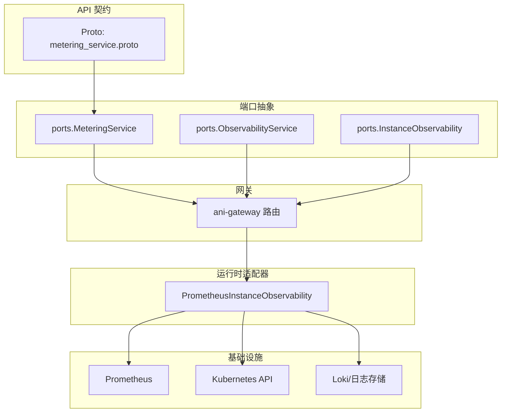
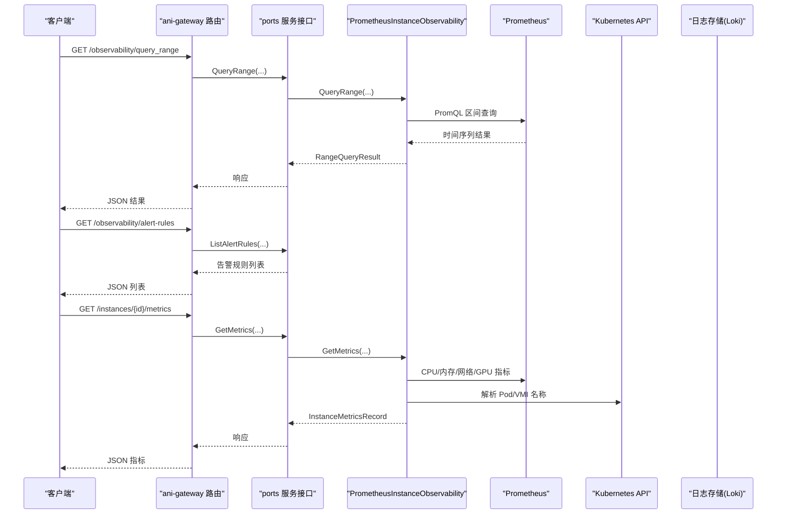
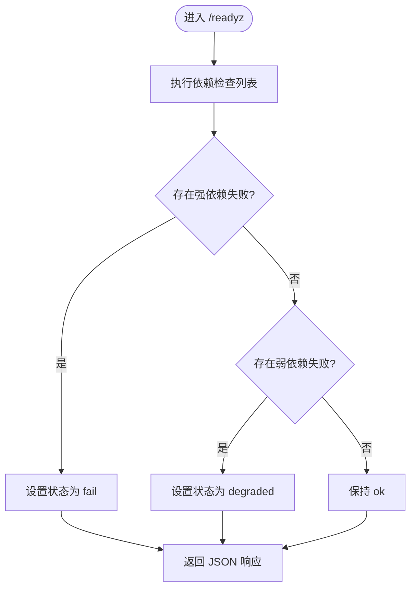
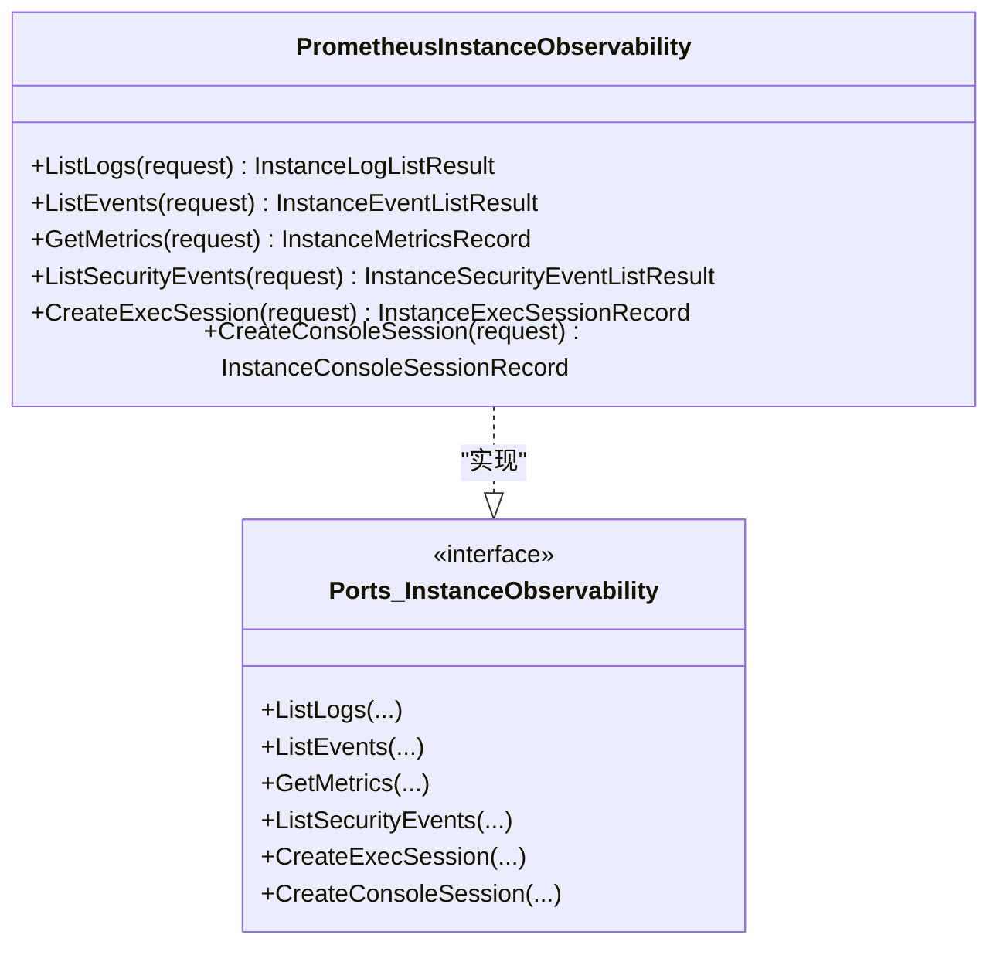
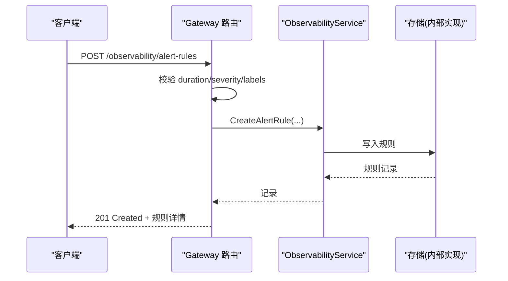
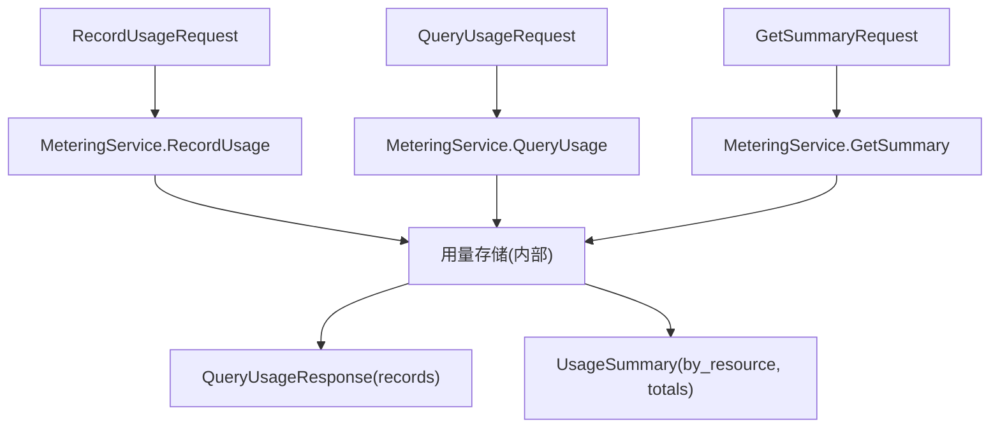
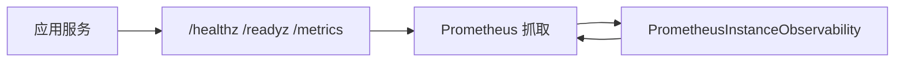
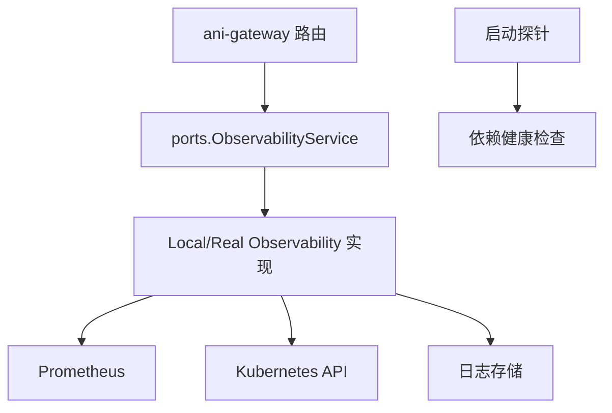

# 监控计量 API

<cite>
**本文引用的文件**
- [metering_service.proto](file://repo/api/proto/metering/v1/metering_service.proto)
- [metering.go](file://repo/pkg/ports/metering.go)
- [observability.go](file://repo/pkg/ports/observability.go)
- [instance_observability.go](file://repo/pkg/ports/instance_observability.go)
- [probes.go](file://repo/pkg/bootstrap/probes.go)
- [prometheus_instance_observability.go](file://repo/pkg/adapters/runtime/prometheus_instance_observability.go)
- [observability.go（网关路由）](file://repo/services/ani-gateway/internal/router/observability.go)
- [test_backend_apis.py](file://repo/scripts/test_backend_apis.py)
</cite>

## 目录
1. [简介](#简介)
2. [项目结构](#项目结构)
3. [核心组件](#核心组件)
4. [架构总览](#架构总览)
5. [详细组件分析](#详细组件分析)
6. [依赖关系分析](#依赖关系分析)
7. [性能与可观测性](#性能与可观测性)
8. [故障排查指南](#故障排查指南)
9. [结论](#结论)
10. [附录：接口清单与用法](#附录接口清单与用法)

## 简介
本文件面向“监控计量 API”，覆盖系统健康检查、性能指标采集、资源使用统计、告警规则管理、事件与安全事件查询、审计日志能力，以及 Prometheus 集成、自定义指标上报、成本计量、资源配额与容量规划等运营分析能力。文档以代码仓库中的端口定义、网关路由、适配器实现和启动探针为依据，提供从入口到存储的端到端说明与图示。

## 项目结构
- 协议与契约
  - Proto 定义计量服务接口与消息类型，用于跨服务调用与 SDK 生成。
- 端口抽象
  - 在 ports 层定义统一的计量、可观测性与实例观测接口，屏蔽底层实现差异。
- 网关路由
  - ani-gateway 暴露 HTTP 接口，将请求转发至对应 service 实现。
- 运行时适配器
  - 通过 Prometheus、Kubernetes API、Loki 等后端采集指标、日志与事件。
- 启动探针与指标导出
  - 提供 /healthz、/readyz、/metrics 等标准探针与 Prometheus 指标输出。

图表来源
- [metering_service.proto:1-70](file://repo/api/proto/metering/v1/metering_service.proto#L1-L70)
- [metering.go:1-112](file://repo/pkg/ports/metering.go#L1-L112)
- [observability.go:1-144](file://repo/pkg/ports/observability.go#L1-L144)
- [instance_observability.go:1-137](file://repo/pkg/ports/instance_observability.go#L1-L137)
- [prometheus_instance_observability.go:1-200](file://repo/pkg/adapters/runtime/prometheus_instance_observability.go#L1-L200)
- [observability.go（网关路由）:1-200](file://repo/services/ani-gateway/internal/router/observability.go#L1-L200)

章节来源
- [metering_service.proto:1-70](file://repo/api/proto/metering/v1/metering_service.proto#L1-L70)
- [metering.go:1-112](file://repo/pkg/ports/metering.go#L1-L112)
- [observability.go:1-144](file://repo/pkg/ports/observability.go#L1-L144)
- [instance_observability.go:1-137](file://repo/pkg/ports/instance_observability.go#L1-L137)
- [prometheus_instance_observability.go:1-200](file://repo/pkg/adapters/runtime/prometheus_instance_observability.go#L1-L200)
- [observability.go（网关路由）:1-200](file://repo/services/ani-gateway/internal/router/observability.go#L1-L200)

## 核心组件
- 计量服务（MeteringService）
  - 记录用量、查询时序用量、获取周期汇总，支撑计费与成本分析。
- 可观测性服务（ObservabilityService）
  - 支持 PromQL 即时查询与区间查询，提供告警规则的创建、列表、读取、更新、删除。
- 实例可观测性（InstanceObservability）
  - 提供实例日志、事件、安全事件、指标与执行/控制台会话能力。
- 启动探针与指标导出
  - 提供进程健康、依赖就绪与 Prometheus 指标输出。

章节来源
- [metering_service.proto:11-22](file://repo/api/proto/metering/v1/metering_service.proto#L11-L22)
- [metering.go:78-112](file://repo/pkg/ports/metering.go#L78-L112)
- [observability.go:135-143](file://repo/pkg/ports/observability.go#L135-L143)
- [instance_observability.go:127-136](file://repo/pkg/ports/instance_observability.go#L127-L136)
- [probes.go:37-57](file://repo/pkg/bootstrap/probes.go#L37-L57)

## 架构总览
下图展示从客户端到后端适配器与数据源的调用链，涵盖健康检查、指标查询、告警规则管理与实例观测。

图表来源
- [observability.go（网关路由）:95-154](file://repo/services/ani-gateway/internal/router/observability.go#L95-L154)
- [prometheus_instance_observability.go:155-202](file://repo/pkg/adapters/runtime/prometheus_instance_observability.go#L155-L202)
- [observability.go:135-143](file://repo/pkg/ports/observability.go#L135-L143)

## 详细组件分析

### 健康检查与就绪探针
- 提供 /healthz 返回版本与健康状态；/readyz 执行依赖检查并返回整体状态；/metrics 输出 Prometheus 格式指标。
- 依赖检查包括数据库、消息总线、缓存、对象存储、向量存储、Kubernetes API 等，弱依赖失败降级为 degraded，强依赖失败标记 fail。

图表来源
- [probes.go:37-57](file://repo/pkg/bootstrap/probes.go#L37-L57)
- [probes.go:102-136](file://repo/pkg/bootstrap/probes.go#L102-L136)
- [probes.go:144-219](file://repo/pkg/bootstrap/probes.go#L144-L219)

章节来源
- [probes.go:37-57](file://repo/pkg/bootstrap/probes.go#L37-L57)
- [probes.go:102-136](file://repo/pkg/bootstrap/probes.go#L102-L136)
- [probes.go:144-219](file://repo/pkg/bootstrap/probes.go#L144-L219)

### 性能指标收集与实例观测
- 实例指标采集支持容器与 VM 两种工作负载：
  - 容器：通过 metrics.k8s.io exporter 采集 CPU、内存、网络等指标，过滤 pause 容器与聚合 series，确保业务容器数据。
  - VM：通过 KubeVirt 指标采集 CPU、内存、网络等 guest OS 真实资源数据。
- 日志支持注入式 LogStore（如 Loki），未注入时回退到 Kubernetes Pod 日志 API。
- 事件与安全事件通过 Kubernetes Events 与适配器过滤、分页返回。

图表来源
- [instance_observability.go:127-136](file://repo/pkg/ports/instance_observability.go#L127-L136)
- [prometheus_instance_observability.go:88-153](file://repo/pkg/adapters/runtime/prometheus_instance_observability.go#L88-L153)
- [prometheus_instance_observability.go:155-202](file://repo/pkg/adapters/runtime/prometheus_instance_observability.go#L155-L202)

章节来源
- [prometheus_instance_observability.go:88-153](file://repo/pkg/adapters/runtime/prometheus_instance_observability.go#L88-L153)
- [prometheus_instance_observability.go:155-202](file://repo/pkg/adapters/runtime/prometheus_instance_observability.go#L155-L202)
- [instance_observability.go:8-86](file://repo/pkg/ports/instance_observability.go#L8-L86)

### 告警规则配置与管理
- 通过网关路由暴露告警规则 CRUD 接口，支持按租户隔离、幂等键、持续时间、严重级别、标签与注解。
- 路由层负责参数校验、错误处理与响应转换，服务层负责持久化与状态管理。

图表来源
- [observability.go（网关路由）:156-183](file://repo/services/ani-gateway/internal/router/observability.go#L156-L183)
- [observability.go:99-103](file://repo/services/ani-gateway/internal/router/observability.go#L99-L103)
- [observability.go:135-143](file://repo/pkg/ports/observability.go#L135-L143)

章节来源
- [observability.go（网关路由）:156-254](file://repo/services/ani-gateway/internal/router/observability.go#L156-L254)
- [observability.go:17-31](file://repo/pkg/ports/observability.go#L17-L31)
- [observability.go:83-143](file://repo/pkg/ports/observability.go#L83-L143)

### 成本计量与资源使用统计
- 计量服务提供用量上报、时序查询与周期汇总，支持按资源类型、可用区、时间粒度分组。
- 内置资源类型包含实例 CPU/内存/GPU 秒级用量、Token 输入/输出/总量等，便于成本核算与账单报表。

图表来源
- [metering_service.proto:11-22](file://repo/api/proto/metering/v1/metering_service.proto#L11-L22)
- [metering_service.proto:24-70](file://repo/api/proto/metering/v1/metering_service.proto#L24-L70)
- [metering.go:26-81](file://repo/pkg/ports/metering.go#L26-L81)

章节来源
- [metering_service.proto:11-70](file://repo/api/proto/metering/v1/metering_service.proto#L11-L70)
- [metering.go:26-81](file://repo/pkg/ports/metering.go#L26-L81)

### Prometheus 集成与自定义指标上报
- 启动探针模块提供 /metrics 输出，包含 reconcile 控制器相关计数器指标，供 Prometheus 抓取。
- 实例观测适配器通过 PromQL 查询 Prometheus 指标，支持容器与 VM 两类工作负载。

图表来源
- [probes.go:53-87](file://repo/pkg/bootstrap/probes.go#L53-L87)
- [prometheus_instance_observability.go:182-202](file://repo/pkg/adapters/runtime/prometheus_instance_observability.go#L182-L202)

章节来源
- [probes.go:53-87](file://repo/pkg/bootstrap/probes.go#L53-L87)
- [prometheus_instance_observability.go:182-202](file://repo/pkg/adapters/runtime/prometheus_instance_observability.go#L182-L202)

### 资源配额监控与容量规划
- 配额服务提供扣减、配置查询与租户生命周期管理能力，基于 PostgreSQL 表 resource_quota/resource_reservations 进行事务性操作。
- 支持多种资源维度（GPU、CPU、内存、存储、Token、KB 查询、成员数、推理服务等），可用于容量规划与预算控制。

章节来源
- [spec-quota-service.md:44-75](file://repo/services/tasks/modules/spec/core/quota/spec-quota-service.md#L44-L75)
- [spec-quota-service.md:160-195](file://repo/services/tasks/modules/spec/core/quota/spec-quota-service.md#L160-L195)
- [spec-quota-service.md:231-289](file://repo/services/tasks/modules/spec/core/quota/spec-quota-service.md#L231-L289)

### 审计日志查询
- 当前仓库中定义了 Agent 审计 OpenAPI 草案，明确与平台审计、实例安全事件的边界，建议独立路径与 RBAC 控制。
- 该能力处于规划详化阶段，尚未纳入主分支冻结事实。

章节来源
- [openapi-phase3-agent-audit-draft.md:10-31](file://repo/services/docs/console-modules/openapi-drafts/phase3/openapi-phase3-agent-audit-draft.md#L10-L31)
- [openapi-phase3-agent-audit-draft.md:132-165](file://repo/services/docs/console-modules/openapi-drafts/phase3/openapi-phase3-agent-audit-draft.md#L132-L165)

## 依赖关系分析
- 网关路由依赖 ports 服务接口，默认情况下若未注入服务则使用本地可观测性服务实现。
- 实例观测适配器依赖 Prometheus、Kubernetes API 与可选的日志存储（Loki）。
- 启动探针依赖各子系统健康检查器，按强弱依赖策略组合最终就绪状态。

图表来源
- [observability.go（网关路由）:88-104](file://repo/services/ani-gateway/internal/router/observability.go#L88-L104)
- [prometheus_instance_observability.go:19-45](file://repo/pkg/adapters/runtime/prometheus_instance_observability.go#L19-L45)
- [probes.go:144-219](file://repo/pkg/bootstrap/probes.go#L144-L219)

章节来源
- [observability.go（网关路由）:88-104](file://repo/services/ani-gateway/internal/router/observability.go#L88-L104)
- [prometheus_instance_observability.go:19-45](file://repo/pkg/adapters/runtime/prometheus_instance_observability.go#L19-L45)
- [probes.go:144-219](file://repo/pkg/bootstrap/probes.go#L144-L219)

## 性能与可观测性
- 指标采集采用 sum() 聚合消除多 series 非确定性，避免 Result[0] 取值不稳定。
- 单个 exporter 不可用时不阻塞其他字段采集，缺失字段以 nil 表示，禁止伪造 0。
- 启动探针将依赖失败分为强/弱两类，弱依赖降级不影响整体可用性。
- 可通过 /metrics 暴露 reconcile 控制器指标，便于外部监控系统采集。

章节来源
- [prometheus_instance_observability.go:175-202](file://repo/pkg/adapters/runtime/prometheus_instance_observability.go#L175-L202)
- [probes.go:102-136](file://repo/pkg/bootstrap/probes.go#L102-L136)
- [probes.go:53-87](file://repo/pkg/bootstrap/probes.go#L53-L87)

## 故障排查指南
- 健康检查
  - 访问 /healthz 确认服务版本与健康；访问 /readyz 查看依赖检查结果与延迟。
  - 若出现 fail/degraded，根据 checks 中的错误信息定位具体依赖（Postgres、NATS、Redis、对象存储、向量存储、Kubernetes API）。
- 指标查询
  - 使用 /observability/query_range 进行区间查询，确保 start/end/step 参数合法。
  - 若返回空或字段为 nil，检查对应 exporter 是否可用、PromQL 是否正确、命名空间与实例名匹配。
- 告警规则
  - 创建/更新规则时注意 duration 格式与 severity 枚举；错误会返回 BAD_REQUEST。
  - 列表接口支持 limit/cursor 分页，便于大规模规则管理。
- 实例观测
  - 日志：若未注入 LogStore，将回退到 Kubernetes Pod 日志 API；注入后可切换至 Loki。
  - 事件：通过 Kubernetes Events 获取，支持类型过滤与限制条数。
  - 指标：VM 与容器分支不同，确保传入正确的 Kind。

章节来源
- [probes.go:37-57](file://repo/pkg/bootstrap/probes.go#L37-L57)
- [probes.go:102-136](file://repo/pkg/bootstrap/probes.go#L102-L136)
- [probes.go:144-219](file://repo/pkg/bootstrap/probes.go#L144-L219)
- [observability.go（网关路由）:118-154](file://repo/services/ani-gateway/internal/router/observability.go#L118-L154)
- [observability.go（网关路由）:156-254](file://repo/services/ani-gateway/internal/router/observability.go#L156-L254)
- [prometheus_instance_observability.go:88-153](file://repo/pkg/adapters/runtime/prometheus_instance_observability.go#L88-L153)
- [prometheus_instance_observability.go:155-202](file://repo/pkg/adapters/runtime/prometheus_instance_observability.go#L155-L202)

## 结论
本监控计量 API 以端口抽象为核心，结合网关路由与运行时适配器，提供了完整的健康检查、指标采集、告警规则管理与实例观测能力。通过 Prometheus 集成与启动探针，系统具备标准的可观测性出口；通过计量服务与配额服务，支持成本计量、资源配额与容量规划。建议在部署中启用日志存储注入、完善告警规则与指标采集，并结合健康探针与指标导出建立闭环运维体系。

## 附录：接口清单与用法
- 健康与就绪
  - GET /healthz：返回服务版本与健康状态。
  - GET /readyz：返回依赖检查结果与整体就绪状态。
  - GET /metrics：输出 Prometheus 格式指标。
- 可观测性查询
  - GET /observability/query：PromQL 即时查询。
  - GET /observability/query_range：PromQL 区间查询（需 start、end、step）。
- 告警规则
  - GET /observability/alert-rules：列出告警规则。
  - POST /observability/alert-rules：创建告警规则。
  - GET /observability/alert-rules/:rule_id：获取单条规则。
  - PATCH /observability/alert-rules/:rule_id：更新规则。
  - DELETE /observability/alert-rules/:rule_id：删除规则。
- 实例观测
  - GET /instances/{id}/logs：实例日志列表。
  - GET /instances/{id}/events：实例事件列表。
  - GET /instances/{id}/security-events：安全事件列表。
  - GET /instances/{id}/metrics：实例指标（支持容器与 VM）。
  - POST /instances/{id}/exec：创建执行会话。
  - POST /instances/{id}/console：创建控制台会话。
- 计量服务（内部 RPC）
  - RecordUsage：记录用量（fire-and-forget）。
  - QueryUsage：查询时序用量。
  - GetSummary：获取周期汇总。

章节来源
- [probes.go:37-57](file://repo/pkg/bootstrap/probes.go#L37-L57)
- [observability.go（网关路由）:95-154](file://repo/services/ani-gateway/internal/router/observability.go#L95-L154)
- [observability.go（网关路由）:156-254](file://repo/services/ani-gateway/internal/router/observability.go#L156-L254)
- [instance_observability.go:8-136](file://repo/pkg/ports/instance_observability.go#L8-L136)
- [metering_service.proto:11-70](file://repo/api/proto/metering/v1/metering_service.proto#L11-L70)
- [test_backend_apis.py:174-178](file://repo/scripts/test_backend_apis.py#L174-L178)