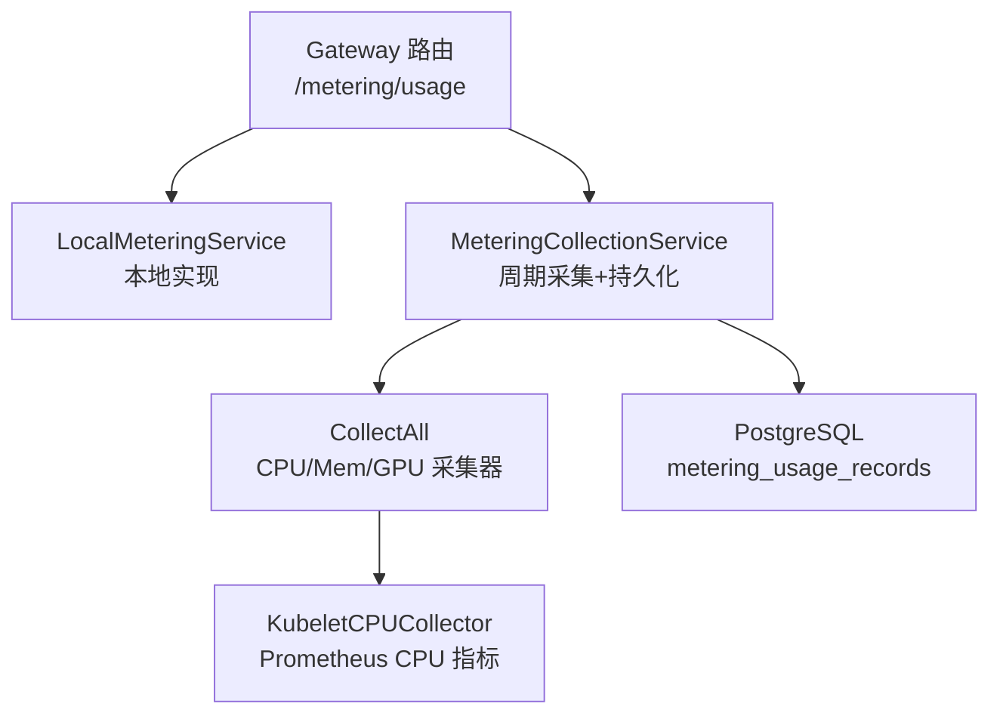
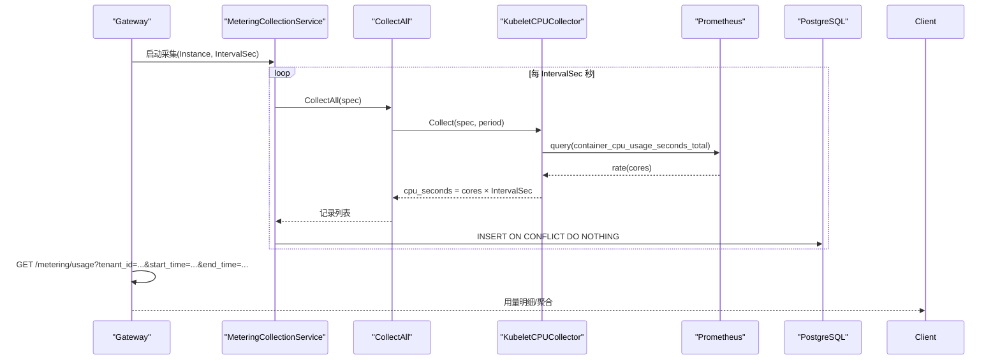
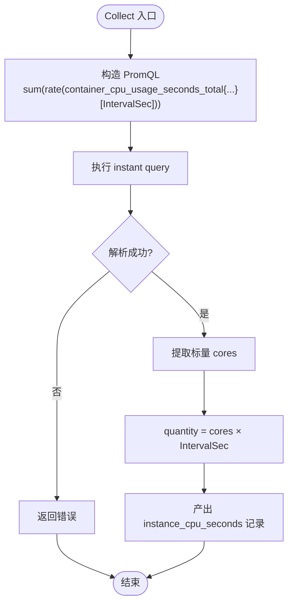
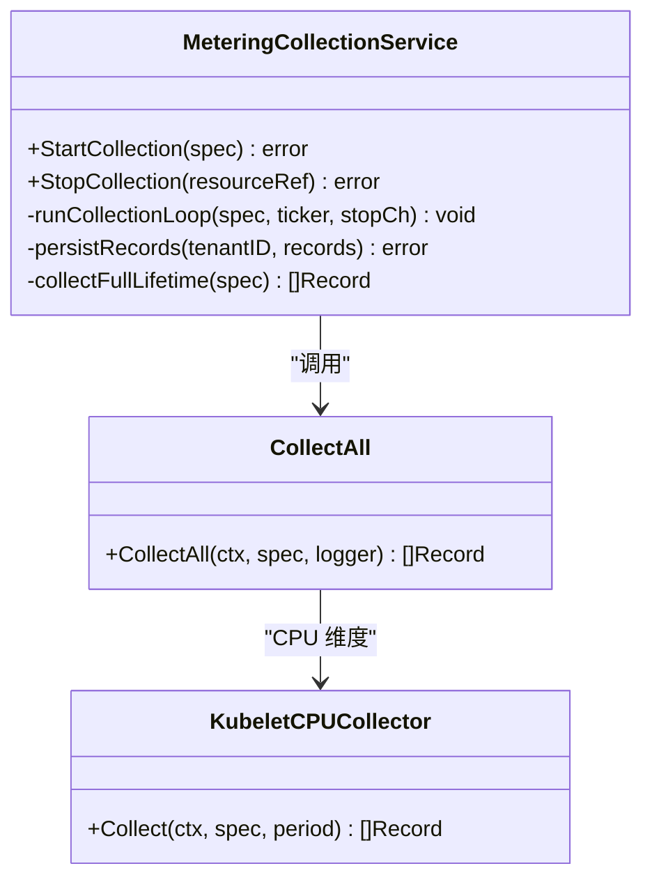
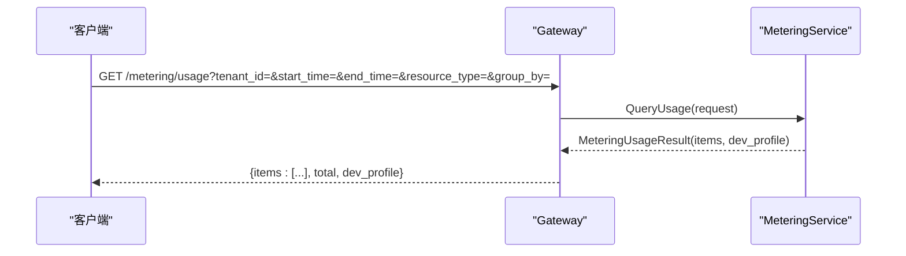
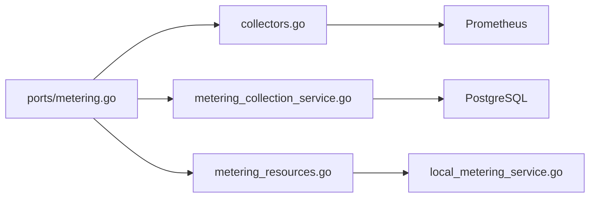

# CPU 计量接口

<cite>
**本文引用的文件**
- [metering_service.proto](file://repo/api/proto/metering/v1/metering_service.proto)
- [ports/metering.go](file://repo/pkg/ports/metering.go)
- [collectors.go](file://repo/pkg/adapters/metering/collectors.go)
- [metering_collection_service.go](file://repo/services/metering-service/internal/service/metering_collection_service.go)
- [metering_resources.go](file://repo/services/ani-gateway/internal/router/metering_resources.go)
- [local_metering_service.go](file://repo/pkg/adapters/runtime/local_metering_service.go)
- [plan-metering-consumer-v2.md](file://repo/services/tasks/modules/plan/plan-metering-consumer-v2.md)
</cite>

## 目录
1. [简介](#简介)
2. [项目结构](#项目结构)
3. [核心组件](#核心组件)
4. [架构总览](#架构总览)
5. [详细组件分析](#详细组件分析)
6. [依赖关系分析](#依赖关系分析)
7. [性能考量](#性能考量)
8. [故障排查指南](#故障排查指南)
9. [结论](#结论)
10. [附录：API 调用示例与错误处理](#附录api-调用示例与错误处理)

## 简介
本文件面向“实例 CPU 使用量”的采集、统计与查询能力，聚焦资源类型 instance_cpu_seconds 的计量逻辑。内容覆盖：
- CPU 秒数的计算方法、时间粒度与聚合方式
- 按租户、时间范围、实例维度的用量查询接口
- 与配额管理、用量预警、历史趋势分析的集成点
- API 调用示例与常见错误处理方案

## 项目结构
围绕 CPU 计量的关键代码分布在以下位置：
- 协议定义：API 契约（gRPC）描述 RecordUsage、QueryUsage、GetSummary
- 端口抽象：内部接口定义资源类型、采集规格、查询请求/结果
- 采集适配器：从 Prometheus 拉取 CPU 指标并产出 instance_cpu_seconds 记录
- 采集服务：周期调度、幂等持久化、短生命周期保底采集
- Gateway 路由：HTTP 暴露 QueryUsage 与 Token 上报
- 本地实现：开发/测试环境下的内存态计量服务

图表来源
- [metering_resources.go:65-94](file://repo/services/ani-gateway/internal/router/metering_resources.go#L65-L94)
- [local_metering_service.go:43-77](file://repo/pkg/adapters/runtime/local_metering_service.go#L43-L77)
- [metering_collection_service.go:51-115](file://repo/services/metering-service/internal/service/metering_collection_service.go#L51-L115)
- [collectors.go:45-87](file://repo/pkg/adapters/metering/collectors.go#L45-L87)

章节来源
- [metering_service.proto:11-22](file://repo/api/proto/metering/v1/metering_service.proto#L11-L22)
- [ports/metering.go:8-48](file://repo/pkg/ports/metering.go#L8-L48)
- [collectors.go:19-87](file://repo/pkg/adapters/metering/collectors.go#L19-L87)
- [metering_collection_service.go:21-115](file://repo/services/metering-service/internal/service/metering_collection_service.go#L21-L115)
- [metering_resources.go:65-94](file://repo/services/ani-gateway/internal/router/metering_resources.go#L65-L94)
- [local_metering_service.go:14-77](file://repo/pkg/adapters/runtime/local_metering_service.go#L14-L77)

## 核心组件
- 资源类型与数据模型
  - instance_cpu_seconds：表示实例在指定周期内累计消耗的 CPU 秒数
  - 单位：cpu_second
  - 周期标识：分钟对齐字符串（如 "2026-07-31T10:00"）
- 采集器
  - KubeletCPUCollector：通过 Prometheus 查询 container_cpu_usage_seconds_total 的 rate，乘以 IntervalSec 得到周期 CPU 秒数
- 采集服务
  - MeteringCollectionService：按 spec.IntervalSec 定时触发 CollectAll，写入 metering_usage_records；支持 Stop 时短生命周期保底采集
- Gateway 查询
  - GET /metering/usage：按租户、时间范围、资源类型分组查询用量

章节来源
- [ports/metering.go:8-48](file://repo/pkg/ports/metering.go#L8-L48)
- [collectors.go:45-87](file://repo/pkg/adapters/metering/collectors.go#L45-L87)
- [metering_collection_service.go:51-115](file://repo/services/metering-service/internal/service/metering_collection_service.go#L51-L115)
- [metering_resources.go:71-94](file://repo/services/ani-gateway/internal/router/metering_resources.go#L71-L94)

## 架构总览
CPU 计量端到端流程：
- 启动阶段注册采集器（GPU/CPU/Mem），注入 Prometheus URL
- 实例运行后，MeteringCollectionService 为每个 ResourceRef 启动 ticker
- 每 IntervalSec 秒触发 CollectAll，按维度路由到对应 Collector
- CPU 维度由 KubeletCPUCollector 查询 Prometheus 计算 CPU 核速率，乘以 IntervalSec 得到 cpu_seconds
- 记录以分钟为 period 写入 metering_usage_records，具备 UNIQUE 约束保证幂等
- Gateway 提供 HTTP 查询接口，按租户、时间范围、资源类型返回聚合结果

图表来源
- [collectors.go:66-87](file://repo/pkg/adapters/metering/collectors.go#L66-L87)
- [metering_collection_service.go:79-115](file://repo/services/metering-service/internal/service/metering_collection_service.go#L79-L115)
- [metering_resources.go:71-94](file://repo/services/ani-gateway/internal/router/metering_resources.go#L71-L94)

## 详细组件分析

### CPU 计量采集器（KubeletCPUCollector）
- 数据来源：Prometheus 指标 container_cpu_usage_seconds_total
- PromQL 策略：sum(rate(...[IntervalSec]))，先对每条序列求速率，再聚合多副本 Pod 的 CPU 核数
- 计算逻辑：cores × IntervalSec = 周期内 CPU 秒数
- 输出字段：resource_type=instance_cpu_seconds，unit=cpu_second，period=分钟对齐
- 容错：Prometheus 不可达或无样本时返回错误；NaN/Inf 被过滤

图表来源
- [collectors.go:66-87](file://repo/pkg/adapters/metering/collectors.go#L66-L87)
- [collectors.go:141-173](file://repo/pkg/adapters/metering/collectors.go#L141-L173)

章节来源
- [collectors.go:45-87](file://repo/pkg/adapters/metering/collectors.go#L45-L87)
- [collectors.go:141-173](file://repo/pkg/adapters/metering/collectors.go#L141-L173)

### 周期采集与持久化（MeteringCollectionService）
- 启动采集：StartCollection 为每个 ResourceRef 创建 ticker，默认 IntervalSec=60s
- 采集循环：runCollectionLoop 周期性调用 CollectAll → persistRecords
- 幂等写入：INSERT ... ON CONFLICT (tenant_id, resource_ref, resource_type, period) DO NOTHING
- 短生命周期保底：StopCollection 若从未产出记录，则按存活时长一次性补采
- 角色隔离：写侧使用 ani_metering_writer（BYPASSRLS）绕过行级安全

图表来源
- [metering_collection_service.go:51-115](file://repo/services/metering-service/internal/service/metering_collection_service.go#L51-L115)
- [metering_collection_service.go:159-193](file://repo/services/metering-service/internal/service/metering_collection_service.go#L159-L193)
- [collectors.go:241-266](file://repo/pkg/adapters/metering/collectors.go#L241-L266)

章节来源
- [metering_collection_service.go:51-115](file://repo/services/metering-service/internal/service/metering_collection_service.go#L51-L115)
- [metering_collection_service.go:159-193](file://repo/services/metering-service/internal/service/metering_collection_service.go#L159-L193)
- [metering_collection_service.go:195-237](file://repo/services/metering-service/internal/service/metering_collection_service.go#L195-L237)

### 用量查询接口（Gateway）
- 路径：GET /metering/usage
- 参数：
  - tenant_id：必填
  - start_time/end_time：RFC3339 可选
  - resource_type：可选，过滤 instance_cpu_seconds 等
  - group_by：可选，按 day/hour/resource_type/az 聚合
- 响应：items 数组包含 tenant_id、resource_type、total_quantity、unit、period；dev_profile 指示实现模式

图表来源
- [metering_resources.go:65-94](file://repo/services/ani-gateway/internal/router/metering_resources.go#L65-L94)
- [local_metering_service.go:43-77](file://repo/pkg/adapters/runtime/local_metering_service.go#L43-L77)

章节来源
- [metering_resources.go:71-94](file://repo/services/ani-gateway/internal/router/metering_resources.go#L71-L94)
- [local_metering_service.go:43-77](file://repo/pkg/adapters/runtime/local_metering_service.go#L43-L77)

### 数据模型与存储
- 表：metering_usage_records
- 关键字段：tenant_id、resource_ref、resource_type、period、quantity、unit
- 唯一约束：(tenant_id, resource_ref, resource_type, period) 保证同一实例同一维度同一周期仅一条记录
- 索引：idx_meter_tenant_type_time 加速按租户、类型、时间的查询

章节来源
- [plan-metering-consumer-v2.md:277-316](file://repo/services/tasks/modules/plan/plan-metering-consumer-v2.md#L277-L316)

## 依赖关系分析
- 采集器依赖 Prometheus HTTP API
- 采集服务依赖 PostgreSQL（metering_usage_records）
- Gateway 依赖 LocalMeteringService（开发/测试）或真实后端（生产）
- 资源类型枚举统一在 ports 层定义，确保跨模块一致

图表来源
- [ports/metering.go:8-48](file://repo/pkg/ports/metering.go#L8-L48)
- [collectors.go:241-266](file://repo/pkg/adapters/metering/collectors.go#L241-L266)
- [metering_collection_service.go:195-237](file://repo/services/metering-service/internal/service/metering_collection_service.go#L195-L237)
- [metering_resources.go:65-94](file://repo/services/ani-gateway/internal/router/metering_resources.go#L65-L94)
- [local_metering_service.go:43-77](file://repo/pkg/adapters/runtime/local_metering_service.go#L43-L77)

章节来源
- [ports/metering.go:8-48](file://repo/pkg/ports/metering.go#L8-L48)
- [collectors.go:241-266](file://repo/pkg/adapters/metering/collectors.go#L241-L266)
- [metering_collection_service.go:195-237](file://repo/services/metering-service/internal/service/metering_collection_service.go#L195-L237)
- [metering_resources.go:65-94](file://repo/services/ani-gateway/internal/router/metering_resources.go#L65-L94)
- [local_metering_service.go:43-77](file://repo/pkg/adapters/runtime/local_metering_service.go#L43-L77)

## 性能考量
- 采集间隔：默认 60 秒，可根据负载调整 IntervalSec
- 聚合窗口：PromQL 使用 [IntervalSec] 窗口计算速率，避免高频采样抖动
- 去重机制：DB UNIQUE 约束防止重复写入，降低存储压力
- 降级策略：Prometheus 不可达时记录错误日志并继续下一周期，不阻塞 ticker
- 短生命周期补偿：Stop 时若从未产出记录，按存活时长一次性补采，减少漏记

## 故障排查指南
- Prometheus 查询失败
  - 现象：CPU 采集器返回错误，日志包含 prometheus query returned ...
  - 排查：检查 Prometheus 可达性、指标是否存在、标签匹配是否正确
- 无样本返回
  - 现象：prometheus sample value is incomplete 或 no samples
  - 排查：确认 namespace/pod 标签正确，容器未处于冷启动导致无计数
- 重复写入
  - 现象：相同 period 多条记录
  - 排查：确认 UNIQUE 约束生效，检查并发写入是否绕过 RLS（写侧应使用 ani_metering_writer）
- 查询为空
  - 现象：GET /metering/usage 返回空 items
  - 排查：确认 tenant_id 正确、时间范围合理、resource_type 过滤条件

章节来源
- [collectors.go:141-173](file://repo/pkg/adapters/metering/collectors.go#L141-L173)
- [metering_collection_service.go:195-237](file://repo/services/metering-service/internal/service/metering_collection_service.go#L195-L237)
- [metering_resources.go:172-179](file://repo/services/ani-gateway/internal/router/metering_resources.go#L172-L179)

## 结论
本系统实现了实例 CPU 使用量的稳定采集与查询：
- 通过 Prometheus 指标 rate(container_cpu_usage_seconds_total) 计算 CPU 核速率，乘以 IntervalSec 得到 cpu_seconds
- 以分钟为粒度聚合，写入 metering_usage_records，具备幂等与短生命周期补偿
- 提供统一的 HTTP 查询接口，支持按租户、时间范围、资源类型过滤与分组
- 与配额管理、预警、趋势分析形成良好集成基础

## 附录：API 调用示例与错误处理

### 查询用量
- 方法：GET
- 路径：/api/v1/metering/usage
- 参数：
  - tenant_id：必填
  - start_time：可选，RFC3339
  - end_time：可选，RFC3339
  - resource_type：可选，如 instance_cpu_seconds
  - group_by：可选，day/hour/resource_type/az
- 成功响应：
  - 200 OK，包含 items 数组与 dev_profile
- 错误响应：
  - 400 BAD_REQUEST：参数格式错误（如 start_time 非 RFC3339）
  - 500 INTERNAL_ERROR：内部错误

章节来源
- [metering_resources.go:71-94](file://repo/services/ani-gateway/internal/router/metering_resources.go#L71-L94)
- [metering_resources.go:172-179](file://repo/services/ani-gateway/internal/router/metering_resources.go#L172-L179)

### 上报 Token 用量（参考）
- 方法：POST
- 路径：/api/v1/metering/token-usage
- 用途：上报 token 输入/输出用量，用于 token 维度计量
- 成功响应：202 Accepted

章节来源
- [metering_resources.go:96-124](file://repo/services/ani-gateway/internal/router/metering_resources.go#L96-L124)

### gRPC 契约（参考）
- Service：MeteringService
- RPC：
  - RecordUsage：内部服务上报用量（fire-and-forget）
  - QueryUsage：按租户和时间范围查询时序用量
  - GetSummary：按计费周期汇总用量

章节来源
- [metering_service.proto:11-22](file://repo/api/proto/metering/v1/metering_service.proto#L11-L22)
- [metering_service.proto:24-69](file://repo/api/proto/metering/v1/metering_service.proto#L24-L69)