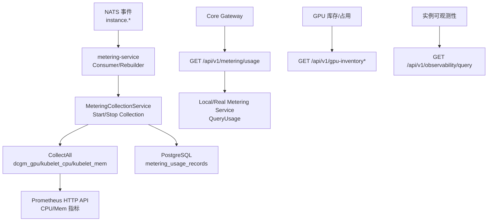
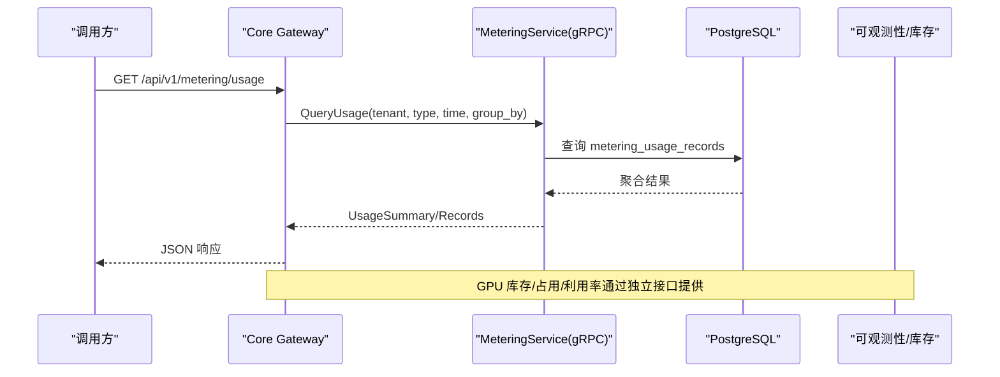
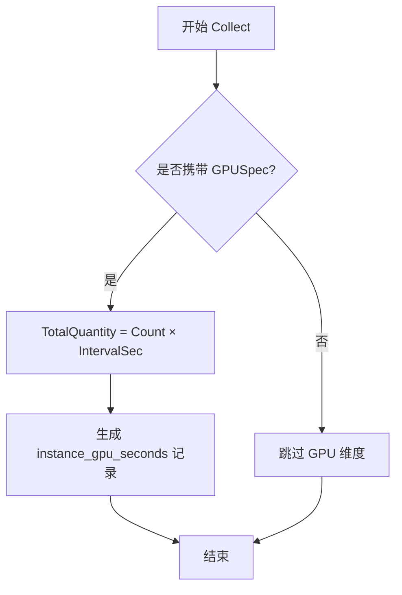
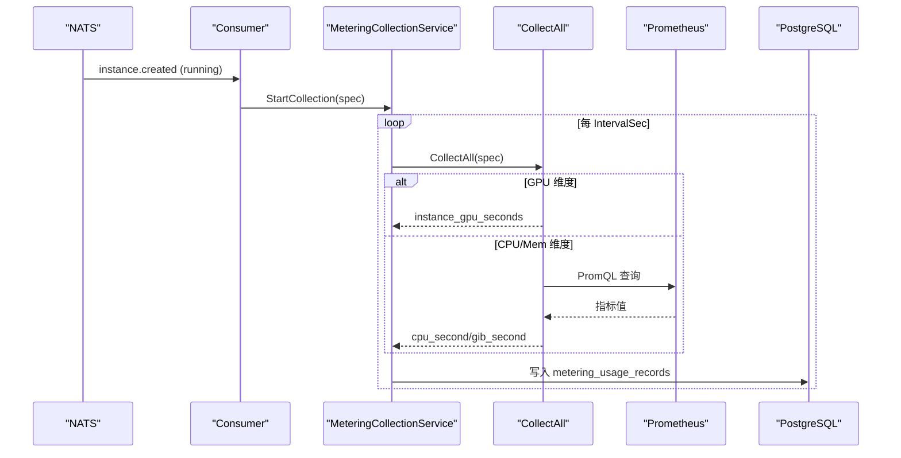
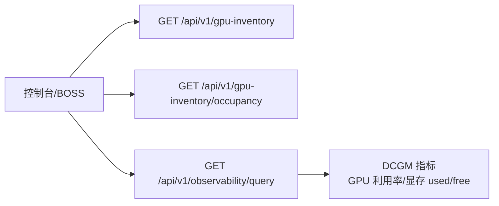
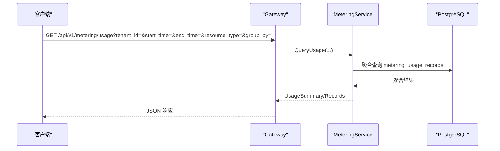
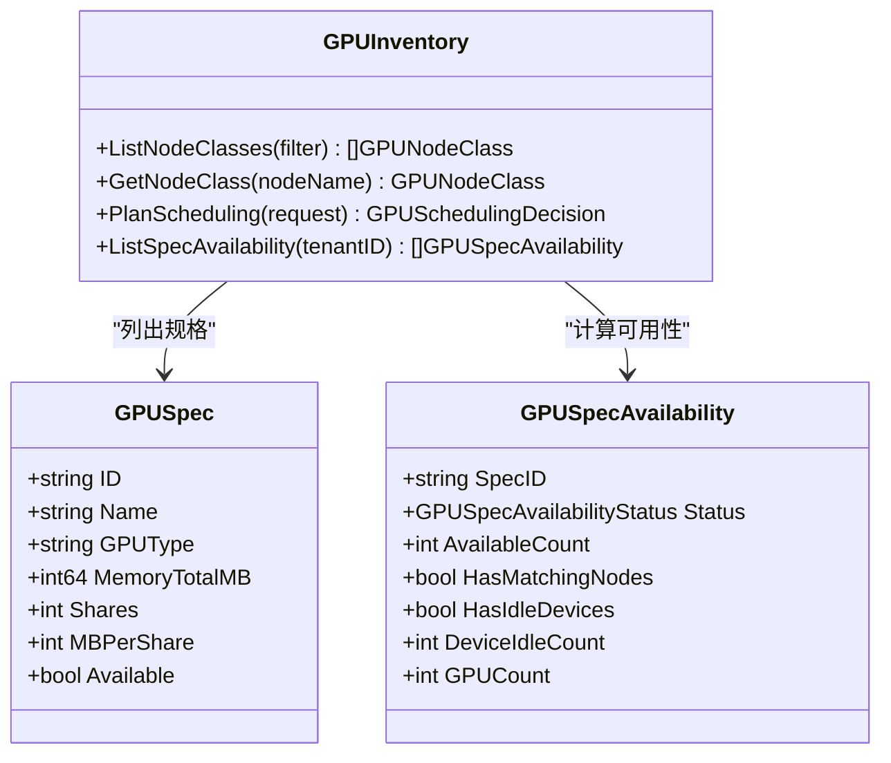
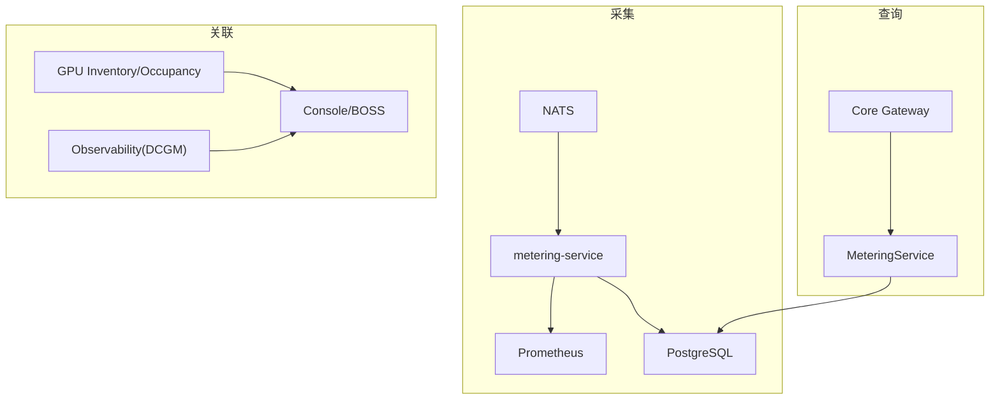

# GPU 计量接口

<cite>
**本文引用的文件**
- [metering_service.proto](file://repo/api/proto/metering/v1/metering_service.proto)
- [v1.yaml](file://repo/api/openapi/v1.yaml)
- [metering.go](file://repo/pkg/ports/metering.go)
- [collectors.go](file://repo/pkg/adapters/metering/collectors.go)
- [gpu_inventory_resources.go](file://repo/services/ani-gateway/internal/router/gpu_inventory_resources.go)
- [gpu_inventory_runtime.go](file://repo/services/ani-gateway/gpu_inventory_runtime.go)
- [gpu_inventory.go](file://repo/pkg/ports/gpu_inventory.go)
- [plan-metering-consumer-v2.md](file://repo/services/tasks/modules/plan/plan-metering-consumer-v2.md)
- [prometheus_instance_observability_test.go](file://repo/pkg/adapters/runtime/prometheus_instance_observability_test.go)
- [test_backend_apis.py](file://repo/scripts/test_backend_apis.py)
</cite>

## 目录
1. [简介](#简介)
2. [项目结构](#项目结构)
3. [核心组件](#核心组件)
4. [架构总览](#架构总览)
5. [详细组件分析](#详细组件分析)
6. [依赖关系分析](#依赖关系分析)
7. [性能与可靠性](#性能与可靠性)
8. [故障排查指南](#故障排查指南)
9. [结论](#结论)
10. [附录：API 参考与集成示例](#附录api-参考与集成示例)

## 简介
本文件面向“实例 GPU 使用量”的采集、统计与查询能力，聚焦 instance_gpu_seconds 资源类型的计量逻辑。内容覆盖：
- GPU 秒数的计算方式与多卡场景处理
- GPU 类型区分（型号、显存大小、虚拟化模式等）
- 用量采集流水线（事件驱动 + Collector 路由）
- 用量查询接口（按租户、时间段、资源类型、分组维度）
- 与 GPU 库存/占用、利用率观测的关联
- 配额管理、利用率监控、成本优化建议
- API 文档与集成示例

## 项目结构
GPU 计量涉及三层：
- 协议与契约层：gRPC 服务定义与 OpenAPI 模型
- 采集与聚合层：Collector 接口与实现、周期采集调度
- 网关与查询层：Gateway 暴露的用量查询与 GPU 库存/占用接口

图表来源
- [plan-metering-consumer-v2.md:84-112](file://repo/services/tasks/modules/plan/plan-metering-consumer-v2.md#L84-L112)
- [collectors.go:241-266](file://repo/pkg/adapters/metering/collectors.go#L241-L266)
- [metering.go:78-111](file://repo/pkg/ports/metering.go#L78-L111)
- [gpu_inventory_resources.go:153-159](file://repo/services/ani-gateway/internal/router/gpu_inventory_resources.go#L153-L159)

章节来源
- [plan-metering-consumer-v2.md:84-112](file://repo/services/tasks/modules/plan/plan-metering-consumer-v2.md#L84-L112)
- [collectors.go:241-266](file://repo/pkg/adapters/metering/collectors.go#L241-L266)
- [metering.go:78-111](file://repo/pkg/ports/metering.go#L78-L111)
- [gpu_inventory_resources.go:153-159](file://repo/services/ani-gateway/internal/router/gpu_inventory_resources.go#L153-L159)

## 核心组件
- 计量资源类型与记录模型
  - 资源类型枚举包含 instance_gpu_seconds、instance_cpu_seconds、instance_memory_gib_seconds 等
  - 一条用量记录包含租户、资源引用、资源类型、总量、单位、周期
- 采集规格与生命周期
  - CollectionSpec 描述单个资源的周期采集规格（租户、工作负载、维度、间隔、GPU 规格等）
  - MeteringCollectionService 提供 StartCollection/StopCollection 幂等控制
- Collector 抽象与实现
  - DCGMGPUCollector：基于持有 GPU 数量 × 周期秒数计算 gpu_second
  - KubeletCPUCollector/KubeletMemCollector：通过 Prometheus HTTP API 查询 CPU/Mem 指标并换算为 cpu_second/gib_second
- 路由与聚合
  - CollectAll 根据 spec.Dimensions 路由到对应 Collector，产出分钟对齐的 Period 记录
- 查询与上报
  - gRPC MeteringService：RecordUsage、QueryUsage、GetSummary
  - OpenAPI MeteringUsageRecord：resource_type 枚举包含 instance_gpu_seconds

章节来源
- [metering.go:8-43](file://repo/pkg/ports/metering.go#L8-L43)
- [metering.go:78-111](file://repo/pkg/ports/metering.go#L78-L111)
- [collectors.go:19-43](file://repo/pkg/adapters/metering/collectors.go#L19-L43)
- [collectors.go:45-129](file://repo/pkg/adapters/metering/collectors.go#L45-L129)
- [collectors.go:241-266](file://repo/pkg/adapters/metering/collectors.go#L241-L266)
- [metering_service.proto:11-22](file://repo/api/proto/metering/v1/metering_service.proto#L11-L22)
- [v1.yaml:1684-1703](file://repo/api/openapi/v1.yaml#L1684-L1703)

## 架构总览
计量系统由“事件驱动采集 + 周期轮询重建 + 持久化存储 + 查询服务”组成。GPU 计量采用“持有时长”语义：只要实例持有 N 张 GPU 运行 IntervalSec 秒，即产生 N×IntervalSec 的 gpu_second。

图表来源
- [metering_service.proto:11-22](file://repo/api/proto/metering/v1/metering_service.proto#L11-L22)
- [v1.yaml:1684-1703](file://repo/api/openapi/v1.yaml#L1684-L1703)
- [gpu_inventory_resources.go:153-159](file://repo/services/ani-gateway/internal/router/gpu_inventory_resources.go#L153-L159)

## 详细组件分析

### GPU 秒数计量逻辑（instance_gpu_seconds）
- 计算方式
  - 当实例持有 GPU 时，每个采集周期产生一条 instance_gpu_seconds 记录
  - TotalQuantity = Count × IntervalSec，Unit = "gpu_second"
  - 若未获取到 GPU 卡数（GPUSpec == nil），则跳过该维度，避免写入 0 错值
- 多卡场景
  - Count 为实例持有的 GPU 总数；多卡直接线性叠加
- GPU 类型区分
  - 计量本身不区分 GPU 型号/显存；如需按型号/显存维度分析，需结合 GPU 库存/占用数据或上层聚合
- 周期对齐
  - Period 为分钟对齐的时间戳，用于 UNIQUE 约束去重

图表来源
- [collectors.go:24-43](file://repo/pkg/adapters/metering/collectors.go#L24-L43)
- [plan-metering-consumer-v2.md:716-758](file://repo/services/tasks/modules/plan/plan-metering-consumer-v2.md#L716-L758)

章节来源
- [collectors.go:24-43](file://repo/pkg/adapters/metering/collectors.go#L24-L43)
- [plan-metering-consumer-v2.md:716-758](file://repo/services/tasks/modules/plan/plan-metering-consumer-v2.md#L716-L758)

### 采集流水线与事件驱动
- 事件来源
  - instance.created/stopped/failed/deleted 事件触发 Start/Stop Collection
- 重建机制
  - 启动时扫描 running 实例，补齐缺失的 ticker
- 单副本串行
  - MaxInflight=1，保证同一实例事件串行处理，避免重复采集
- 维度路由
  - buildSpec 将 workload_kind 映射为 Dimensions（如 dcgm_gpu/kubelet_cpu/kubelet_mem）
  - CollectAll 遍历 Dimensions，逐个 Resolve + Collect

图表来源
- [plan-metering-consumer-v2.md:84-112](file://repo/services/tasks/modules/plan/plan-metering-consumer-v2.md#L84-L112)
- [collectors.go:241-266](file://repo/pkg/adapters/metering/collectors.go#L241-L266)
- [collectors.go:45-129](file://repo/pkg/adapters/metering/collectors.go#L45-L129)

章节来源
- [plan-metering-consumer-v2.md:84-112](file://repo/services/tasks/modules/plan/plan-metering-consumer-v2.md#L84-L112)
- [collectors.go:241-266](file://repo/pkg/adapters/metering/collectors.go#L241-L266)

### GPU 库存、占用与利用率观测
- 库存与占用
  - GET /api/v1/gpu-inventory：节点/设备列表，支持按 gpu_type、status、node_name 过滤
  - GET /api/v1/gpu-inventory/occupancy：集群级占用摘要（total/in_use/available/fault），按 GPU 型号分桶
- 利用率观测
  - 通过 observability 查询 DCGM 指标：DCGM_FI_DEV_GPU_UTIL、FB_USED、FB_FREE
  - 非 gpu_container 类型不返回 GPU 字段

图表来源
- [gpu_inventory_resources.go:153-159](file://repo/services/ani-gateway/internal/router/gpu_inventory_resources.go#L153-L159)
- [gpu_inventory_resources.go:193-211](file://repo/services/ani-gateway/internal/router/gpu_inventory_resources.go#L193-L211)
- [prometheus_instance_observability_test.go:299-308](file://repo/pkg/adapters/runtime/prometheus_instance_observability_test.go#L299-L308)

章节来源
- [gpu_inventory_resources.go:193-211](file://repo/services/ani-gateway/internal/router/gpu_inventory_resources.go#L193-L211)
- [prometheus_instance_observability_test.go:299-308](file://repo/pkg/adapters/runtime/prometheus_instance_observability_test.go#L299-L308)

### 用量查询接口（OpenAPI）
- 端点
  - GET /api/v1/metering/usage：按租户、时间段、资源类型查询用量聚合
- 请求参数
  - tenant_id、start_time、end_time、resource_type、group_by（resource_type/az/day/hour）
- 响应
  - items：MeteringUsageRecord 数组（resource_type、total_quantity、unit、period、tenant_id）
  - total：记录条数
  - dev_profile：开发/真实提供者信息

图表来源
- [metering_service.proto:11-22](file://repo/api/proto/metering/v1/metering_service.proto#L11-L22)
- [v1.yaml:1684-1703](file://repo/api/openapi/v1.yaml#L1684-L1703)

章节来源
- [metering_service.proto:11-22](file://repo/api/proto/metering/v1/metering_service.proto#L11-L22)
- [v1.yaml:1684-1703](file://repo/api/openapi/v1.yaml#L1684-L1703)

### GPU 配额管理与可用性
- 规格与可用性
  - GPUSpec 描述 GPU 型号、显存、共享策略等
  - ListSpecAvailability 返回 per-spec 的可用状态（available/full/device_full/unavailable）
- 配额剩余
  - QuotaRemaining 为租户级共享值，由处理器单独查询配额服务后回填至响应顶层
- 调度决策
  - PlanScheduling 输出 NodeSelector/Tolerations/SchedulerName/QueueName 等调度约束

图表来源
- [gpu_inventory.go:70-90](file://repo/pkg/ports/gpu_inventory.go#L70-L90)
- [gpu_inventory.go:128-171](file://repo/pkg/ports/gpu_inventory.go#L128-L171)

章节来源
- [gpu_inventory.go:70-90](file://repo/pkg/ports/gpu_inventory.go#L70-L90)
- [gpu_inventory.go:128-171](file://repo/pkg/ports/gpu_inventory.go#L128-L171)

## 依赖关系分析
- 采集侧依赖
  - NATS：事件订阅与消息消费
  - Prometheus：CPU/Mem 指标查询（GPU 时长不依赖 Prometheus）
  - PostgreSQL：持久化 metering_usage_records
- 查询侧依赖
  - Core Gateway：对外暴露 OpenAPI 端点
  - MeteringService：gRPC 查询/汇总
- 关联依赖
  - GPU 库存/占用：独立接口，供 Console/BOSS 展示
  - 实例可观测性：DCGM 指标用于利用率可视化

图表来源
- [plan-metering-consumer-v2.md:84-112](file://repo/services/tasks/modules/plan/plan-metering-consumer-v2.md#L84-L112)
- [collectors.go:45-129](file://repo/pkg/adapters/metering/collectors.go#L45-L129)
- [gpu_inventory_resources.go:153-159](file://repo/services/ani-gateway/internal/router/gpu_inventory_resources.go#L153-L159)

章节来源
- [plan-metering-consumer-v2.md:84-112](file://repo/services/tasks/modules/plan/plan-metering-consumer-v2.md#L84-L112)
- [collectors.go:45-129](file://repo/pkg/adapters/metering/collectors.go#L45-L129)
- [gpu_inventory_resources.go:153-159](file://repo/services/ani-gateway/internal/router/gpu_inventory_resources.go#L153-L159)

## 性能与可靠性
- 采集性能
  - GPU 维度无外部 IO，仅内存计算；CPU/Mem 维度通过 Prometheus HTTP API 瞬时查询
  - CollectAll 对未知 collector 或单维度失败进行日志记录并跳过，不影响其他维度
- 可靠性
  - 单副本串行消费，避免重复采集
  - DB UNIQUE 约束兜底重复写入
  - 启动重建确保 running 实例的采集连续性
- 可扩展性
  - Collector 接口便于新增维度（如 vGPU、MIG 切片）
  - 维度路由通过注册表扩展

章节来源
- [collectors.go:241-266](file://repo/pkg/adapters/metering/collectors.go#L241-L266)
- [plan-metering-consumer-v2.md:84-112](file://repo/services/tasks/modules/plan/plan-metering-consumer-v2.md#L84-L112)

## 故障排查指南
- GPU 指标为空或非零
  - 确认传入 Kind=gpu_container，否则不会进入 GPU 分支
  - 检查 DCGM 指标名是否正确（DCGM_FI_DEV_GPU_UTIL、FB_USED、FB_FREE）
- 用量记录缺失
  - 检查事件是否到达（NATS subject ani.events.instance.*）
  - 检查 Consumer 是否成功 StartCollection（进程内 map 去重、DB UNIQUE 约束）
- 利用率显示异常
  - 非 gpu_container 类型不应展示 GPU 卡片
  - DCGM 未就绪时应显示“监控未就绪”，不得伪造数据

章节来源
- [prometheus_instance_observability_test.go:299-308](file://repo/pkg/adapters/runtime/prometheus_instance_observability_test.go#L299-L308)
- [plan-metering-consumer-v2.md:84-112](file://repo/services/tasks/modules/plan/plan-metering-consumer-v2.md#L84-L112)

## 结论
- instance_gpu_seconds 采用“持有时长”计量，简单可靠，适合计费与成本归因
- 多卡场景通过 Count 线性叠加，无需复杂利用率折算
- 如需按 GPU 型号/显存/利用率分析，应结合 GPU 库存/占用与可观测性接口
- 计量系统具备事件驱动、周期重建、幂等写入与可扩展 Collector 架构

## 附录：API 参考与集成示例

### 用量查询（OpenAPI）
- 端点
  - GET /api/v1/metering/usage
- 参数
  - tenant_id、start_time、end_time、resource_type（含 instance_gpu_seconds）、group_by
- 响应
  - items：MeteringUsageRecord[]（resource_type、total_quantity、unit、period、tenant_id）
  - total、dev_profile

章节来源
- [v1.yaml:1684-1703](file://repo/api/openapi/v1.yaml#L1684-L1703)

### GPU 库存与占用（OpenAPI）
- 端点
  - GET /api/v1/gpu-inventory
  - GET /api/v1/gpu-inventory/occupancy
- 用途
  - 设备列表、占用摘要、按 GPU 型号分桶统计

章节来源
- [gpu_inventory_resources.go:153-159](file://repo/services/ani-gateway/internal/router/gpu_inventory_resources.go#L153-L159)
- [gpu_inventory_resources.go:193-211](file://repo/services/ani-gateway/internal/router/gpu_inventory_resources.go#L193-L211)

### 实例可观测性（DCGM）
- 指标
  - DCGM_FI_DEV_GPU_UTIL（GPU 利用率）
  - DCGM_FI_DEV_FB_USED/FB_FREE（显存 used/free，total=used+free）
- 注意
  - 仅 Kind=gpu_container 时返回 GPU 字段

章节来源
- [prometheus_instance_observability_test.go:299-308](file://repo/pkg/adapters/runtime/prometheus_instance_observability_test.go#L299-L308)

### 集成示例（脚本调用）
- 测试脚本中已包含对 GPU 库存/占用与计量接口的调用示例，可用于验证连通性与基本流程

章节来源
- [test_backend_apis.py:295-321](file://repo/scripts/test_backend_apis.py#L295-L321)

### 成本优化建议
- 基于 instance_gpu_seconds 与 GPU 库存/占用数据，识别长期低利用率实例
- 结合 GPU 规格可用性（GPUSpecAvailability）调整实例规格或迁移至更合适机型
- 利用队列与调度策略（QueueName/SchedulerName）优化排队与分配效率

[本节为通用指导，不直接分析具体文件]