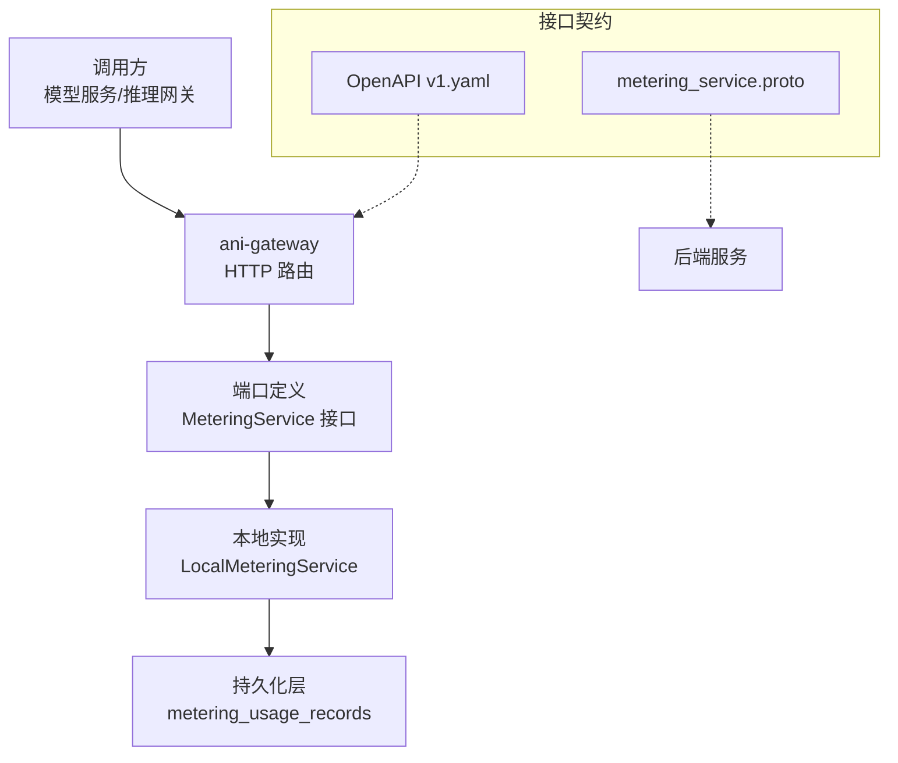
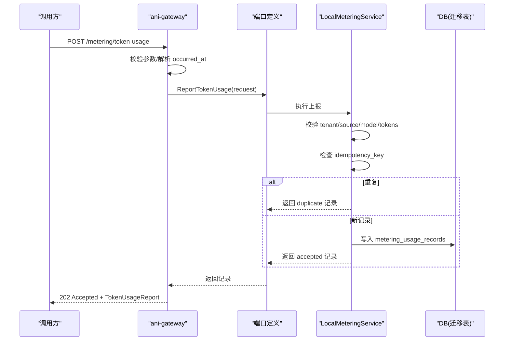
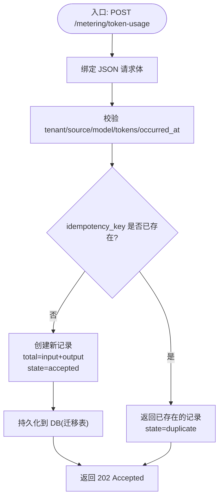
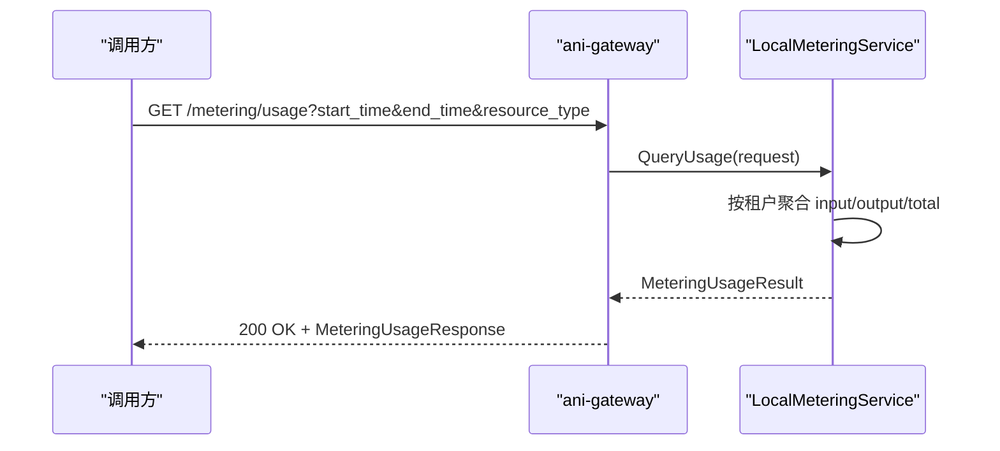
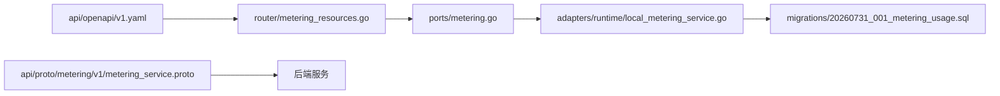

# Token 计量接口

<cite>
**本文引用的文件**
- [metering_resources.go](file://repo/services/ani-gateway/internal/router/metering_resources.go)
- [local_metering_service.go](file://repo/pkg/adapters/runtime/local_metering_service.go)
- [metering.go](file://repo/pkg/ports/metering.go)
- [v1.yaml](file://repo/api/openapi/v1.yaml)
- [metering_service.proto](file://repo/api/proto/metering/v1/metering_service.proto)
- [20260731_001_metering_usage.sql](file://repo/deploy/migrations/20260731_001_metering_usage.sql)
- [plan-metering-consumer-v2.md](file://repo/services/tasks/modules/plan/plan-metering-consumer-v2.md)
- [issue-004-metering-collection-service.md](file://repo/services/tasks/modules/issue/core/metering-consumer/issue-004-metering-collection-service.md)
</cite>

## 目录
1. [简介](#简介)
2. [项目结构](#项目结构)
3. [核心组件](#核心组件)
4. [架构总览](#架构总览)
5. [详细组件分析](#详细组件分析)
6. [依赖关系分析](#依赖关系分析)
7. [性能与扩展性](#性能与扩展性)
8. [故障排查指南](#故障排查指南)
9. [结论](#结论)
10. [附录：接口规范与最佳实践](#附录接口规范与最佳实践)

## 简介
本文件面向 AI 模型推理过程中的 Token 计量能力，覆盖输入、输出与总量三类资源（token_input、token_output、token_total）的计量逻辑与上报流程。重点说明：
- Token 计数规则与幂等保证
- 重复请求处理与去重机制
- Token 用量上报接口 ReportTokenUsage 的批量与状态跟踪能力
- 用量查询、成本核算与模型性能分析的运营支撑
- 完整接口规范与最佳实践

## 项目结构
Token 计量在网关层暴露 HTTP API，通过本地适配器实现当前开发态的内存存储；未来由 metering-service 消费事件并持久化到数据库。关键路径如下：
- 网关路由：注册 /metering/token-usage 与 /metering/usage
- 端口定义：统一抽象 MeteringService 接口与数据模型
- 本地实现：LocalMeteringService 提供进程内统计与幂等
- OpenAPI/Proto：对外契约与内部 gRPC 契约
- 数据库迁移：metering_usage_records 表及角色权限

**图表来源**
- [metering_resources.go:65-69](file://repo/services/ani-gateway/internal/router/metering_resources.go#L65-L69)
- [local_metering_service.go:14-19](file://repo/pkg/adapters/runtime/local_metering_service.go#L14-L19)
- [metering.go:78-81](file://repo/pkg/ports/metering.go#L78-L81)
- [v1.yaml:1684-1737](file://repo/api/openapi/v1.yaml#L1684-L1737)
- [metering_service.proto:11-22](file://repo/api/proto/metering/v1/metering_service.proto#L11-L22)

**章节来源**
- [metering_resources.go:65-69](file://repo/services/ani-gateway/internal/router/metering_resources.go#L65-L69)
- [v1.yaml:1684-1737](file://repo/api/openapi/v1.yaml#L1684-L1737)

## 核心组件
- 网关路由层
  - 负责解析请求参数、校验时间格式、绑定租户上下文，并调用 MeteringService
  - 暴露两个端点：POST /metering/token-usage（上报）、GET /metering/usage（查询）
- 端口定义层
  - 定义资源类型枚举（包含 token_input、token_output、token_total）
  - 定义上报请求/记录、查询请求/结果、采集规格等数据结构
- 本地实现层
  - 进程内维护上报记录与幂等键映射
  - 计算 total_tokens = input + output，支持重复请求返回 duplicate 状态
  - 查询时按租户聚合三类资源数量
- 契约层
  - OpenAPI 定义上报与查询的数据结构、字段约束与枚举
  - Proto 定义内部 gRPC 计量服务（RecordUsage、QueryUsage、GetSummary）
- 数据持久化层
  - 使用 metering_usage_records 表承载周期计量记录
  - 通过专用角色 ani_metering_writer（BYPASSRLS）写入，读侧走 RLS 隔离

**章节来源**
- [metering_resources.go:20-69](file://repo/services/ani-gateway/internal/router/metering_resources.go#L20-L69)
- [metering.go:8-81](file://repo/pkg/ports/metering.go#L8-L81)
- [local_metering_service.go:43-124](file://repo/pkg/adapters/runtime/local_metering_service.go#L43-L124)
- [v1.yaml:1684-1737](file://repo/api/openapi/v1.yaml#L1684-L1737)
- [metering_service.proto:11-69](file://repo/api/proto/metering/v1/metering_service.proto#L11-L69)
- [20260731_001_metering_usage.sql:21-50](file://repo/deploy/migrations/20260731_001_metering_usage.sql#L21-L50)

## 架构总览
Token 计量从“上报”和“查询”两条主线展开：
- 上报链路：客户端提交 idempotency_key、source、model、input_tokens、output_tokens 等字段；网关校验后调用本地服务；本地服务进行幂等判断与记录；返回 accepted/duplicate 状态
- 查询链路：客户端按租户、时间范围、资源类型查询；本地服务聚合 input/output/total 三类资源并返回

**图表来源**
- [metering_resources.go:96-124](file://repo/services/ani-gateway/internal/router/metering_resources.go#L96-L124)
- [local_metering_service.go:79-124](file://repo/pkg/adapters/runtime/local_metering_service.go#L79-L124)
- [20260731_001_metering_usage.sql:21-50](file://repo/deploy/migrations/20260731_001_metering_usage.sql#L21-L50)

## 详细组件分析

### 上报接口 ReportTokenUsage
- 功能
  - 接收 Token 用量上报请求，包含幂等键、来源、模型、输入/输出 Token 数、可选的请求 ID、实例 ID、发生时间与标签
  - 幂等保证：基于 (tenant_id, idempotency_key) 维度去重，重复请求返回 duplicate 状态与原记录
  - 状态跟踪：accepted（首次接受）或 duplicate（重复）
  - 总量计算：total_tokens = input_tokens + output_tokens
- 错误处理
  - 必填字段缺失或非法（如负数 Token）返回 BAD_REQUEST
  - 其他异常返回 INTERNAL_ERROR
- 响应
  - 202 Accepted，返回 TokenUsageReport，包含 id、tenant_id、source、model、input_tokens、output_tokens、total_tokens、state、created_at 等

**图表来源**
- [metering_resources.go:96-124](file://repo/services/ani-gateway/internal/router/metering_resources.go#L96-L124)
- [local_metering_service.go:79-124](file://repo/pkg/adapters/runtime/local_metering_service.go#L79-L124)
- [20260731_001_metering_usage.sql:21-50](file://repo/deploy/migrations/20260731_001_metering_usage.sql#L21-L50)

**章节来源**
- [metering_resources.go:96-124](file://repo/services/ani-gateway/internal/router/metering_resources.go#L96-L124)
- [local_metering_service.go:79-124](file://repo/pkg/adapters/runtime/local_metering_service.go#L79-L124)
- [v1.yaml:1705-1737](file://repo/api/openapi/v1.yaml#L1705-L1737)

### 查询接口 QueryUsage
- 功能
  - 按租户、时间范围、资源类型分组查询计量数据
  - 支持过滤 resource_type（token_input、token_output、token_total）
  - 返回 items 列表与 dev_profile（标识本地/真实提供者）
- 行为
  - 本地实现按租户聚合 input/output/total 三类资源数量
  - 若指定 resource_type，仅返回对应项
- 响应
  - 200 OK，返回 MeteringUsageResponse，包含 items、total、dev_profile

**图表来源**
- [metering_resources.go:71-94](file://repo/services/ani-gateway/internal/router/metering_resources.go#L71-L94)
- [local_metering_service.go:43-77](file://repo/pkg/adapters/runtime/local_metering_service.go#L43-L77)

**章节来源**
- [metering_resources.go:71-94](file://repo/services/ani-gateway/internal/router/metering_resources.go#L71-L94)
- [local_metering_service.go:43-77](file://repo/pkg/adapters/runtime/local_metering_service.go#L43-L77)
- [v1.yaml:1684-1703](file://repo/api/openapi/v1.yaml#L1684-L1703)

### 数据模型与资源类型
- 资源类型
  - instance_cpu_seconds、instance_memory_gib_seconds、instance_gpu_seconds
  - token_input、token_output、token_total
- 上报记录
  - 包含租户、来源、模型、输入/输出/总量、请求 ID、实例 ID、状态、创建时间
- 查询记录
  - 包含租户、资源类型、总量、单位、周期

**章节来源**
- [metering.go:8-81](file://repo/pkg/ports/metering.go#L8-L81)
- [v1.yaml:1684-1737](file://repo/api/openapi/v1.yaml#L1684-L1737)

### 幂等性与重复请求处理
- 幂等键
  - 要求 idempotency_key 非空且长度受限
  - 以 (tenant_id, idempotency_key) 为维度进行去重
- 重复处理
  - 重复请求直接返回已存在的记录，state=duplicate
  - 避免重复写入与重复计费
- 并发保护
  - 进程内使用互斥锁保护 map 访问
  - 生产环境通过 DB UNIQUE 约束与 ON CONFLICT DO NOTHING 兜底

**章节来源**
- [local_metering_service.go:79-124](file://repo/pkg/adapters/runtime/local_metering_service.go#L79-L124)
- [issue-004-metering-collection-service.md:17-29](file://repo/services/tasks/modules/issue/core/metering-consumer/issue-004-metering-collection-service.md#L17-L29)
- [20260731_001_metering_usage.sql:21-50](file://repo/deploy/migrations/20260731_001_metering_usage.sql#L21-L50)

### 批量上报与去重机制
- 当前网关接口为单条上报
- 批量能力可通过多次调用同一接口实现，结合 idempotency_key 确保每条幂等
- 去重机制
  - 网关层：校验必填字段与格式
  - 服务层：基于 idempotency_key 去重
  - 持久化层：UNIQUE 约束与 ON CONFLICT DO NOTHING 防止重复写入

**章节来源**
- [metering_resources.go:96-124](file://repo/services/ani-gateway/internal/router/metering_resources.go#L96-L124)
- [local_metering_service.go:79-124](file://repo/pkg/adapters/runtime/local_metering_service.go#L79-L124)
- [issue-004-metering-collection-service.md:17-29](file://repo/services/tasks/modules/issue/core/metering-consumer/issue-004-metering-collection-service.md#L17-L29)

### 状态跟踪与运营能力
- 状态字段
  - accepted：首次接受
  - duplicate：重复请求
- 运营能力
  - 用量查询：按租户、时间、资源类型聚合
  - 成本核算：基于 token_input、token_output、token_total 统计
  - 模型性能分析：结合 source、model、request_id、instance_id 等维度分析

**章节来源**
- [metering.go:19-24](file://repo/pkg/ports/metering.go#L19-L24)
- [metering_resources.go:144-159](file://repo/services/ani-gateway/internal/router/metering_resources.go#L144-L159)
- [local_metering_service.go:43-77](file://repo/pkg/adapters/runtime/local_metering_service.go#L43-L77)

## 依赖关系分析
- 网关依赖端口定义，端口定义抽象出 MeteringService 接口
- 本地实现实现该接口，并在测试/开发环境中使用
- 生产环境将替换为 metering-service，消费事件并写入 DB
- 数据库迁移提供 metering_usage_records 表与角色权限

**图表来源**
- [metering_resources.go:1-18](file://repo/services/ani-gateway/internal/router/metering_resources.go#L1-L18)
- [metering.go:78-81](file://repo/pkg/ports/metering.go#L78-L81)
- [local_metering_service.go:14-19](file://repo/pkg/adapters/runtime/local_metering_service.go#L14-L19)
- [20260731_001_metering_usage.sql:21-50](file://repo/deploy/migrations/20260731_001_metering_usage.sql#L21-L50)
- [v1.yaml:1684-1737](file://repo/api/openapi/v1.yaml#L1684-L1737)
- [metering_service.proto:11-22](file://repo/api/proto/metering/v1/metering_service.proto#L11-L22)

**章节来源**
- [metering_resources.go:1-18](file://repo/services/ani-gateway/internal/router/metering_resources.go#L1-L18)
- [metering.go:78-81](file://repo/pkg/ports/metering.go#L78-L81)
- [local_metering_service.go:14-19](file://repo/pkg/adapters/runtime/local_metering_service.go#L14-L19)
- [20260731_001_metering_usage.sql:21-50](file://repo/deploy/migrations/20260731_001_metering_usage.sql#L21-L50)

## 性能与扩展性
- 本地实现
  - 进程内 map 存储，适合开发与测试
  - 使用互斥锁保证并发安全
- 生产扩展
  - 通过 metering-service 消费事件并持久化
  - 使用专用角色 ani_metering_writer 跨租户写入，读侧 RLS 隔离
  - 使用 UNIQUE 约束与 ON CONFLICT DO NOTHING 保证幂等写入
- 建议
  - 高吞吐场景下，上报接口应支持异步批处理
  - 查询接口可引入缓存与分页优化
  - 监控与告警：关注重复率、失败率、延迟

[本节为通用指导，不直接分析具体文件]

## 故障排查指南
- 常见错误
  - 必填字段缺失：检查 tenant_id、source、model、input_tokens、output_tokens
  - 时间格式错误：occurred_at 必须为 RFC3339
  - 负数 Token：input_tokens、output_tokens 必须非负
- 排查步骤
  - 确认 idempotency_key 唯一性
  - 检查重复请求是否返回 duplicate
  - 查看日志中的错误码与消息
  - 验证数据库写入是否成功（迁移表）

**章节来源**
- [metering_resources.go:96-124](file://repo/services/ani-gateway/internal/router/metering_resources.go#L96-L124)
- [local_metering_service.go:79-124](file://repo/pkg/adapters/runtime/local_metering_service.go#L79-L124)
- [20260731_001_metering_usage.sql:21-50](file://repo/deploy/migrations/20260731_001_metering_usage.sql#L21-L50)

## 结论
Token 计量接口提供了完整的上报与查询能力，支持幂等、去重、状态跟踪与多维度运营分析。通过网关、端口、本地实现与数据库迁移的分层设计，既满足开发测试需求，也为生产环境的扩展与优化奠定基础。

[本节为总结，不直接分析具体文件]

## 附录：接口规范与最佳实践

### 接口规范
- 上报接口
  - 方法：POST
  - 路径：/metering/token-usage
  - 请求体：ReportTokenUsageRequest
  - 响应：TokenUsageReport
- 查询接口
  - 方法：GET
  - 路径：/metering/usage
  - 查询参数：start_time、end_time、resource_type、group_by
  - 响应：MeteringUsageResponse

**章节来源**
- [v1.yaml:1684-1737](file://repo/api/openapi/v1.yaml#L1684-L1737)

### 最佳实践
- 幂等键
  - 生成全局唯一的 idempotency_key，避免重复上报
- 时间戳
  - 使用 RFC3339 格式的 occurred_at，便于审计与排序
- 标签
  - 使用 labels 附加业务维度信息，便于分析
- 批量上报
  - 多次调用同一接口，结合 idempotency_key 确保幂等
- 查询优化
  - 明确 resource_type 与时间范围，减少不必要的数据传输
- 监控与告警
  - 监控上报成功率、重复率、延迟
  - 对异常错误进行告警与追踪

[本节为通用指导，不直接分析具体文件]