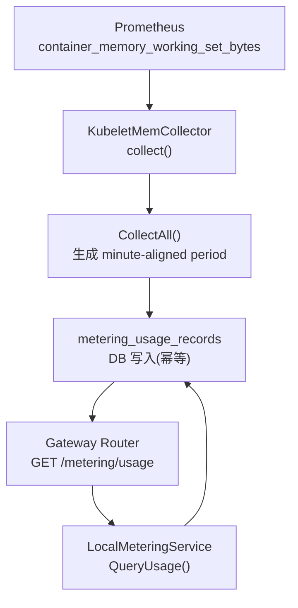
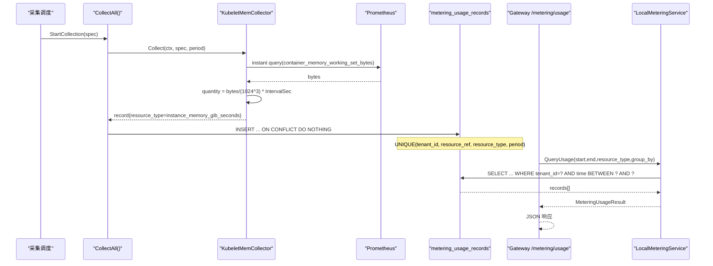
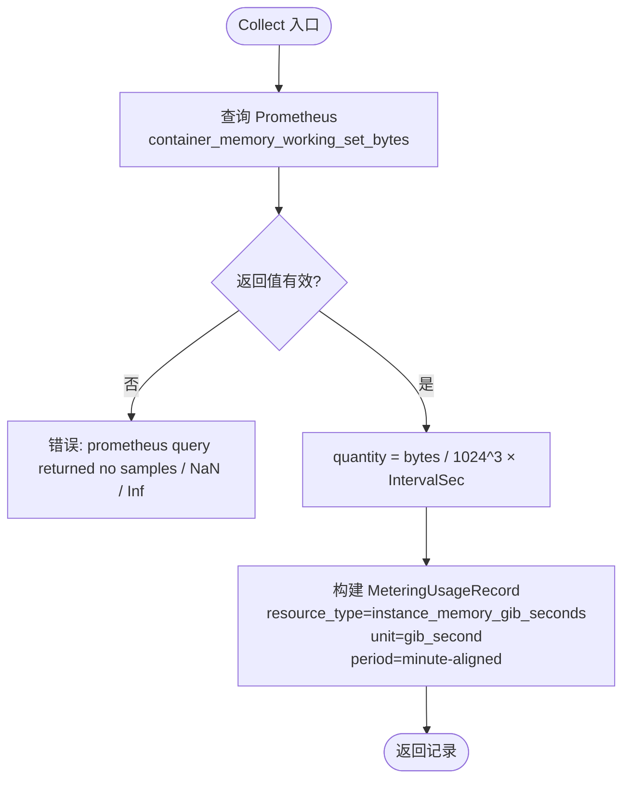
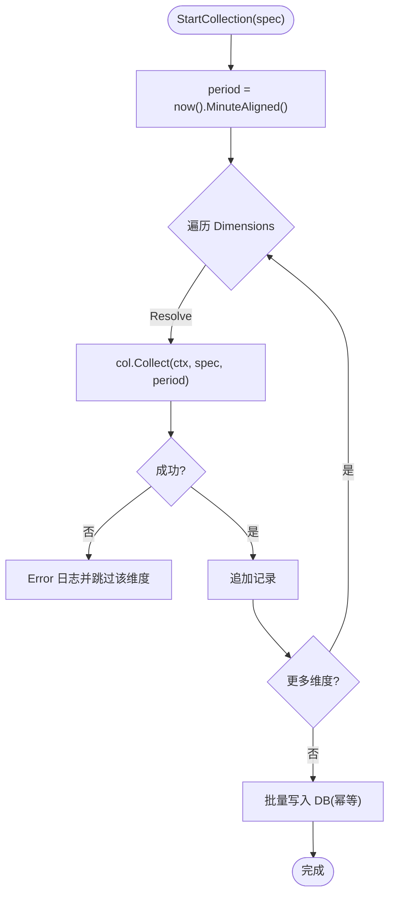
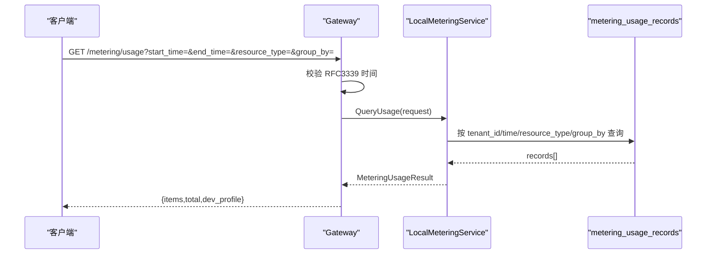
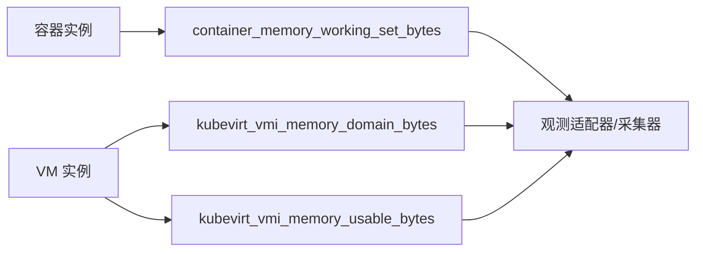
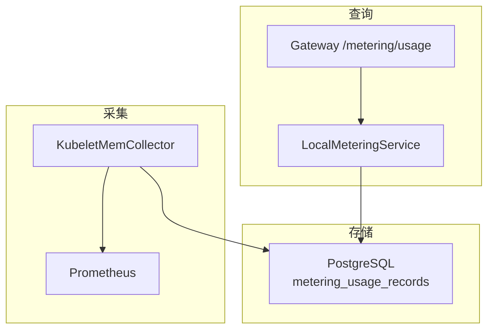
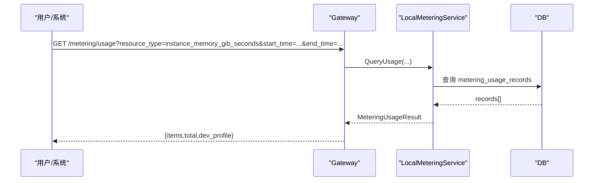

# 内存计量接口

<cite>
**本文引用的文件**
- [pkg/ports/metering.go](file://repo/pkg/ports/metering.go)
- [pkg/adapters/metering/collectors.go](file://repo/pkg/adapters/metering/collectors.go)
- [pkg/adapters/metering/collectors_test.go](file://repo/pkg/adapters/metering/collectors_test.go)
- [services/ani-gateway/internal/router/metering_resources.go](file://repo/services/ani-gateway/internal/router/metering_resources.go)
- [api/proto/metering/v1/metering_service.proto](file://repo/api/proto/metering/v1/metering_service.proto)
- [pkg/adapters/runtime/local_metering_service.go](file://repo/pkg/adapters/runtime/local_metering_service.go)
- [pkg/adapters/runtime/prometheus_instance_observability_test.go](file://repo/pkg/adapters/runtime/prometheus_instance_observability_test.go)
- [services/tasks/modules/plan/plan-metering-consumer-v2.md](file://repo/services/tasks/modules/plan/plan-metering-consumer-v2.md)
- [services/tasks/modules/plan/plan-instance-observability.md](file://repo/services/tasks/modules/plan/plan-instance-observability.md)
- [scripts/serve_core_mock.py](file://repo/scripts/serve_core_mock.py)
</cite>

## 目录
1. [简介](#简介)
2. [项目结构](#项目结构)
3. [核心组件](#核心组件)
4. [架构总览](#架构总览)
5. [详细组件分析](#详细组件分析)
6. [依赖关系分析](#依赖关系分析)
7. [性能与精度](#性能与精度)
8. [故障排查指南](#故障排查指南)
9. [结论](#结论)
10. [附录：API 参考与使用示例](#附录api-参考与使用示例)

## 简介
本文件面向“实例内存用量”的采集、统计与查询能力，聚焦资源类型 instance_memory_gib_seconds 的计量逻辑。内容涵盖：
- 内存 GB·秒（GiB-秒）的计算方法、采样频率、数据精度与聚合周期
- 内存用量查询接口（多租户、多维度、按时间范围与分组）
- 与实例观测（Prometheus/Kubernetes）的对接方式
- 运维特性建议：配额监控、峰值告警、容量规划
- 完整 API 参考与调用示例

## 项目结构
围绕内存计量的关键路径包括：
- 采集侧：KubeletMemCollector 通过 Prometheus 获取容器工作集内存，计算 GiB-秒并产出计量记录
- 存储侧：metering_usage_records 表以分钟级 period 维度落库，支持幂等写入与 RLS 隔离
- 查询侧：Gateway 暴露 /metering/usage 接口，封装 ports.MeteringService.QueryUsage
- 契约层：Proto 定义 QueryUsage 语义；Ports 定义资源类型、请求/响应模型与采集规格

**图表来源**
- [pkg/adapters/metering/collectors.go:89-129](file://repo/pkg/adapters/metering/collectors.go#L89-L129)
- [services/tasks/modules/plan/plan-metering-consumer-v2.md:277-316](file://repo/services/tasks/modules/plan/plan-metering-consumer-v2.md#L277-L316)
- [services/ani-gateway/internal/router/metering_resources.go:65-94](file://repo/services/ani-gateway/internal/router/metering_resources.go#L65-L94)
- [pkg/adapters/runtime/local_metering_service.go:43-60](file://repo/pkg/adapters/runtime/local_metering_service.go#L43-L60)

**章节来源**
- [pkg/adapters/metering/collectors.go:89-129](file://repo/pkg/adapters/metering/collectors.go#L89-L129)
- [services/tasks/modules/plan/plan-metering-consumer-v2.md:277-316](file://repo/services/tasks/modules/plan/plan-metering-consumer-v2.md#L277-L316)
- [services/ani-gateway/internal/router/metering_resources.go:65-94](file://repo/services/ani-gateway/internal/router/metering_resources.go#L65-L94)
- [pkg/adapters/runtime/local_metering_service.go:43-60](file://repo/pkg/adapters/runtime/local_metering_service.go#L43-L60)

## 核心组件
- 资源类型与数据模型
  - 资源类型：instance_memory_gib_seconds
  - 计量记录字段：tenant_id、resource_ref（如 instance_id）、resource_type、total_quantity、unit（gib_second）、period（分钟对齐）
- 采集器
  - KubeletMemCollector：从 Prometheus 拉取 container_memory_working_set_bytes，转换为 GiB-秒
- 采集编排
  - CollectAll：按 CollectionSpec.Dimensions 路由到具体 Collector，生成 minute-aligned period 并聚合结果
- 查询服务
  - Gateway 路由 GET /metering/usage → LocalMeteringService.QueryUsage → 返回 MeteringUsageResult
- Proto 契约
  - QueryUsageRequest/Response 用于跨服务查询用量

**章节来源**
- [pkg/ports/metering.go:8-48](file://repo/pkg/ports/metering.go#L8-L48)
- [pkg/adapters/metering/collectors.go:89-129](file://repo/pkg/adapters/metering/collectors.go#L89-L129)
- [pkg/adapters/metering/collectors.go:241-266](file://repo/pkg/adapters/metering/collectors.go#L241-L266)
- [services/ani-gateway/internal/router/metering_resources.go:65-94](file://repo/services/ani-gateway/internal/router/metering_resources.go#L65-L94)
- [api/proto/metering/v1/metering_service.proto:11-52](file://repo/api/proto/metering/v1/metering_service.proto#L11-L52)

## 架构总览
内存计量端到端流程如下：
- 采集：定时触发（由 consumer/rebuilder 驱动），读取 CollectionSpec（含 IntervalSec、Dimensions），对每个维度调用对应 Collector
- 计算：KubeletMemCollector 查询 Prometheus 瞬时值，乘以 IntervalSec 得到 GiB-秒
- 持久化：写入 metering_usage_records，按 (tenant_id, resource_ref, resource_type, period) 唯一约束保证幂等
- 查询：Gateway 接收查询参数，调用 QueryUsage，返回聚合后的用量条目

**图表来源**
- [pkg/adapters/metering/collectors.go:241-266](file://repo/pkg/adapters/metering/collectors.go#L241-L266)
- [pkg/adapters/metering/collectors.go:110-129](file://repo/pkg/adapters/metering/collectors.go#L110-L129)
- [services/tasks/modules/plan/plan-metering-consumer-v2.md:277-316](file://repo/services/tasks/modules/plan/plan-metering-consumer-v2.md#L277-L316)
- [services/ani-gateway/internal/router/metering_resources.go:71-94](file://repo/services/ani-gateway/internal/router/metering_resources.go#L71-L94)
- [pkg/adapters/runtime/local_metering_service.go:43-60](file://repo/pkg/adapters/runtime/local_metering_service.go#L43-L60)

## 详细组件分析

### 内存计量采集器（KubeletMemCollector）
- 输入
  - CollectionSpec：包含 ResourceRef、TenantID、WorkloadName、IntervalSec、Dimensions
- 处理
  - 构造 PromQL：sum(container_memory_working_set_bytes{namespace, pod=~...})
  - 执行瞬时查询，解析标量值，过滤 NaN/Inf
  - 计算：quantity = bytes / (1024^3) × IntervalSec
- 输出
  - MeteringUsageRecord：resource_type=instance_memory_gib_seconds，unit=gib_second，period=当前分钟对齐字符串

**图表来源**
- [pkg/adapters/metering/collectors.go:110-129](file://repo/pkg/adapters/metering/collectors.go#L110-L129)
- [pkg/adapters/metering/collectors.go:141-173](file://repo/pkg/adapters/metering/collectors.go#L141-L173)
- [pkg/adapters/metering/collectors.go:190-207](file://repo/pkg/adapters/metering/collectors.go#L190-L207)

**章节来源**
- [pkg/adapters/metering/collectors.go:89-129](file://repo/pkg/adapters/metering/collectors.go#L89-L129)
- [pkg/adapters/metering/collectors.go:141-173](file://repo/pkg/adapters/metering/collectors.go#L141-L173)
- [pkg/adapters/metering/collectors.go:190-207](file://repo/pkg/adapters/metering/collectors.go#L190-L207)

### 采集编排与幂等落地（CollectAll + DB）
- 周期对齐：period 使用当前时间的分钟对齐字符串（例如 2026-08-13T10:00）
- 维度遍历：按 spec.Dimensions 逐个 Resolve 并 Collect，失败维度记录日志并跳过
- 幂等写入：DB 层 UNIQUE(tenant_id, resource_ref, resource_type, period) 保证重复采集不重复计数

**图表来源**
- [pkg/adapters/metering/collectors.go:241-266](file://repo/pkg/adapters/metering/collectors.go#L241-L266)
- [services/tasks/modules/plan/plan-metering-consumer-v2.md:277-316](file://repo/services/tasks/modules/plan/plan-metering-consumer-v2.md#L277-L316)

**章节来源**
- [pkg/adapters/metering/collectors.go:241-266](file://repo/pkg/adapters/metering/collectors.go#L241-L266)
- [services/tasks/modules/plan/plan-metering-consumer-v2.md:277-316](file://repo/services/tasks/modules/plan/plan-metering-consumer-v2.md#L277-L316)

### 查询接口（Gateway + LocalMeteringService）
- 路由：GET /metering/usage
- 参数：start_time、end_time、resource_type、group_by（可选）
- 行为：调用 LocalMeteringService.QueryUsage，返回 items[] 与 DevProfile
- 错误：非法参数返回 BAD_REQUEST；内部错误返回 INTERNAL_ERROR

**图表来源**
- [services/ani-gateway/internal/router/metering_resources.go:65-94](file://repo/services/ani-gateway/internal/router/metering_resources.go#L65-L94)
- [pkg/adapters/runtime/local_metering_service.go:43-60](file://repo/pkg/adapters/runtime/local_metering_service.go#L43-L60)

**章节来源**
- [services/ani-gateway/internal/router/metering_resources.go:65-94](file://repo/services/ani-gateway/internal/router/metering_resources.go#L65-L94)
- [pkg/adapters/runtime/local_metering_service.go:43-60](file://repo/pkg/adapters/runtime/local_metering_service.go#L43-L60)

### 实例观测与内存指标（Prometheus/Kubernetes）
- 容器场景：使用 container_memory_working_set_bytes 作为工作集内存
- VM 场景：使用 kubevirt_vmi_memory_* 系列指标，官方推荐内存使用率公式为 domain_bytes - usable_bytes
- 观测快照：测试用例验证 memory_used_mb、memory_total_mb、timestamp 等字段映射

**图表来源**
- [services/tasks/modules/plan/plan-instance-observability.md:742-759](file://repo/services/tasks/modules/plan/plan-instance-observability.md#L742-L759)
- [pkg/adapters/runtime/prometheus_instance_observability_test.go:102-130](file://repo/pkg/adapters/runtime/prometheus_instance_observability_test.go#L102-L130)

**章节来源**
- [services/tasks/modules/plan/plan-instance-observability.md:742-759](file://repo/services/tasks/modules/plan/plan-instance-observability.md#L742-L759)
- [pkg/adapters/runtime/prometheus_instance_observability_test.go:102-130](file://repo/pkg/adapters/runtime/prometheus_instance_observability_test.go#L102-L130)

## 依赖关系分析
- 外部依赖
  - Prometheus HTTP API：instant query 获取内存字节数
  - PostgreSQL：metering_usage_records 表及 RLS 策略
- 内部依赖
  - Ports 层：资源类型、请求/响应、采集规格
  - Gateway：HTTP 路由与参数校验
  - LocalMeteringService：查询实现（本地适配）
- 耦合点
  - 采集器与 Prometheus 的协议与超时配置
  - DB 唯一键与 RLS 策略保障多租户隔离与幂等

**图表来源**
- [pkg/adapters/metering/collectors.go:141-173](file://repo/pkg/adapters/metering/collectors.go#L141-L173)
- [services/tasks/modules/plan/plan-metering-consumer-v2.md:277-316](file://repo/services/tasks/modules/plan/plan-metering-consumer-v2.md#L277-L316)
- [services/ani-gateway/internal/router/metering_resources.go:65-94](file://repo/services/ani-gateway/internal/router/metering_resources.go#L65-L94)
- [pkg/adapters/runtime/local_metering_service.go:43-60](file://repo/pkg/adapters/runtime/local_metering_service.go#L43-L60)

**章节来源**
- [pkg/adapters/metering/collectors.go:141-173](file://repo/pkg/adapters/metering/collectors.go#L141-L173)
- [services/tasks/modules/plan/plan-metering-consumer-v2.md:277-316](file://repo/services/tasks/modules/plan/plan-metering-consumer-v2.md#L277-L316)
- [services/ani-gateway/internal/router/metering_resources.go:65-94](file://repo/services/ani-gateway/internal/router/metering_resources.go#L65-L94)
- [pkg/adapters/runtime/local_metering_service.go:43-60](file://repo/pkg/adapters/runtime/local_metering_service.go#L43-L60)

## 性能与精度
- 采样频率
  - 采集间隔由 CollectionSpec.IntervalSec 决定；CPU 采用 rate(...[IntervalSec])，内存采用瞬时 Gauge 加权
- 数据精度
  - 内存：bytes 来自 Prometheus 标量值，转换为 GiB（除以 1024^3），再乘以 IntervalSec 得到 GiB-秒
  - 周期粒度：period 为分钟对齐，DB 唯一键保证同一周期内去重
- 聚合与分组
  - group_by 支持按 resource_type、az、day、hour 等维度聚合（Proto 定义）
- 容错
  - Prometheus 返回 NaN/Inf 或无样本时直接报错，避免污染计量数据
  - 单维度采集失败仅记录错误日志并跳过，不影响其他维度

**章节来源**
- [pkg/adapters/metering/collectors.go:110-129](file://repo/pkg/adapters/metering/collectors.go#L110-L129)
- [pkg/adapters/metering/collectors.go:190-207](file://repo/pkg/adapters/metering/collectors.go#L190-L207)
- [api/proto/metering/v1/metering_service.proto:34-52](file://repo/api/proto/metering/v1/metering_service.proto#L34-L52)
- [services/tasks/modules/plan/plan-metering-consumer-v2.md:277-316](file://repo/services/tasks/modules/plan/plan-metering-consumer-v2.md#L277-L316)

## 故障排查指南
- Prometheus 查询失败
  - 现象：collect 返回错误，错误信息带前缀 kubelet_mem
  - 排查：检查 Prometheus 可达性、指标是否存在、标签匹配是否正确
- NaN/Inf 值
  - 现象：scalar() 拒绝 NaN/Inf，返回错误
  - 排查：确认上游指标健康，必要时增加重试或降级策略
- 重复采集
  - 现象：相同 period 多次写入
  - 排查：DB 唯一键会阻止重复计数；检查采集调度是否重复触发
- 查询参数错误
  - 现象：start_time/end_time 非 RFC3339 格式导致 BAD_REQUEST
  - 排查：修正时间格式或留空（可选）

**章节来源**
- [pkg/adapters/metering/collectors_test.go:298-315](file://repo/pkg/adapters/metering/collectors_test.go#L298-L315)
- [pkg/adapters/metering/collectors.go:190-207](file://repo/pkg/adapters/metering/collectors.go#L190-L207)
- [services/ani-gateway/internal/router/metering_resources.go:71-94](file://repo/services/ani-gateway/internal/router/metering_resources.go#L71-L94)

## 结论
- 内存计量以 Prometheus 的容器工作集内存为基础，结合 IntervalSec 计算 GiB-秒，并以分钟粒度落库
- 通过统一资源类型 instance_memory_gib_seconds 与标准查询接口，支撑多维度聚合与报表
- 建议在运营侧补充配额监控、峰值告警与容量规划能力，形成闭环

## 附录：API 参考与使用示例

### 查询用量接口
- 方法：GET
- 路径：/metering/usage
- 查询参数
  - start_time：RFC3339 时间（可选）
  - end_time：RFC3339 时间（可选）
  - resource_type：枚举值之一，如 instance_memory_gib_seconds
  - group_by：resource_type | az | day | hour（可选）
- 响应
  - items：计量条目数组，包含 tenant_id、resource_type、total_quantity、unit、period
  - total：条目数量
  - dev_profile：开发/运行环境标识

**图表来源**
- [services/ani-gateway/internal/router/metering_resources.go:65-94](file://repo/services/ani-gateway/internal/router/metering_resources.go#L65-L94)
- [pkg/adapters/runtime/local_metering_service.go:43-60](file://repo/pkg/adapters/runtime/local_metering_service.go#L43-L60)

**章节来源**
- [services/ani-gateway/internal/router/metering_resources.go:65-94](file://repo/services/ani-gateway/internal/router/metering_resources.go#L65-L94)
- [api/proto/metering/v1/metering_service.proto:34-52](file://repo/api/proto/metering/v1/metering_service.proto#L34-L52)

### 使用示例
- 查询某租户在指定时间段内的内存用量（GiB-秒）
  - GET /metering/usage?resource_type=instance_memory_gib_seconds&start_time=2026-08-13T10:00:00Z&end_time=2026-08-13T11:00:00Z
- 按小时聚合
  - GET /metering/usage?resource_type=instance_memory_gib_seconds&group_by=hour&start_time=...&end_time=...

### 运维特性建议
- 配额监控
  - 基于历史用量趋势设置阈值，当接近配额上限时预警
- 峰值告警
  - 对短时尖峰（如突发扩容）设置告警规则，避免误报
- 容量规划
  - 结合 group_by=day/hour 的聚合结果，评估集群内存容量与弹性策略

[本节为通用指导，无需特定源码引用]