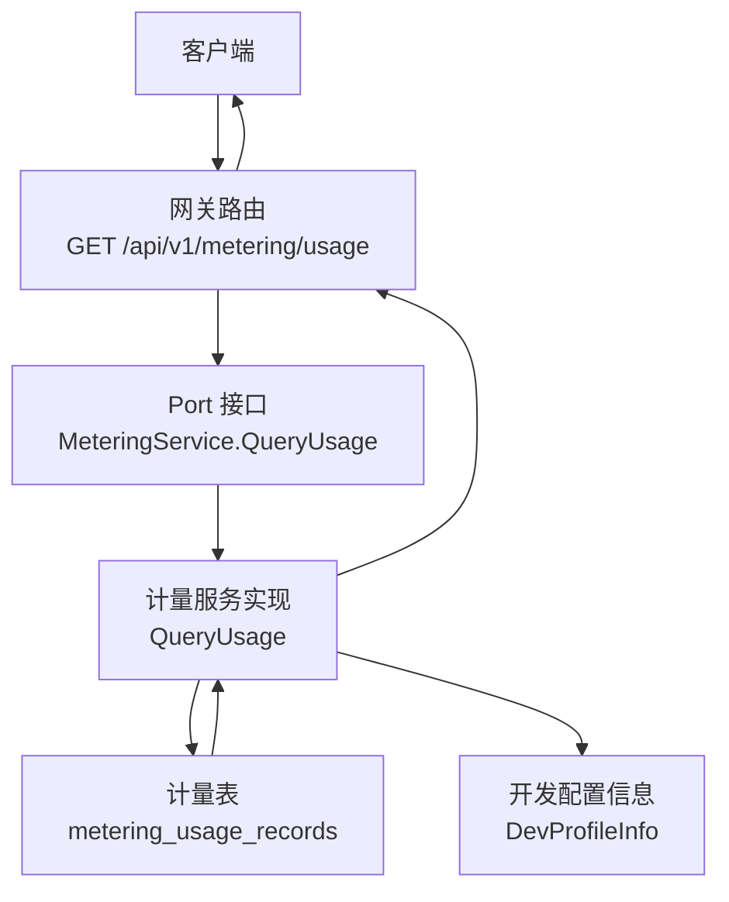
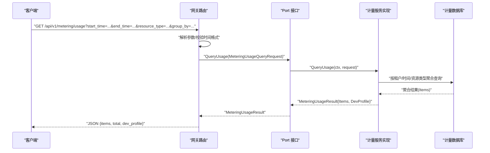
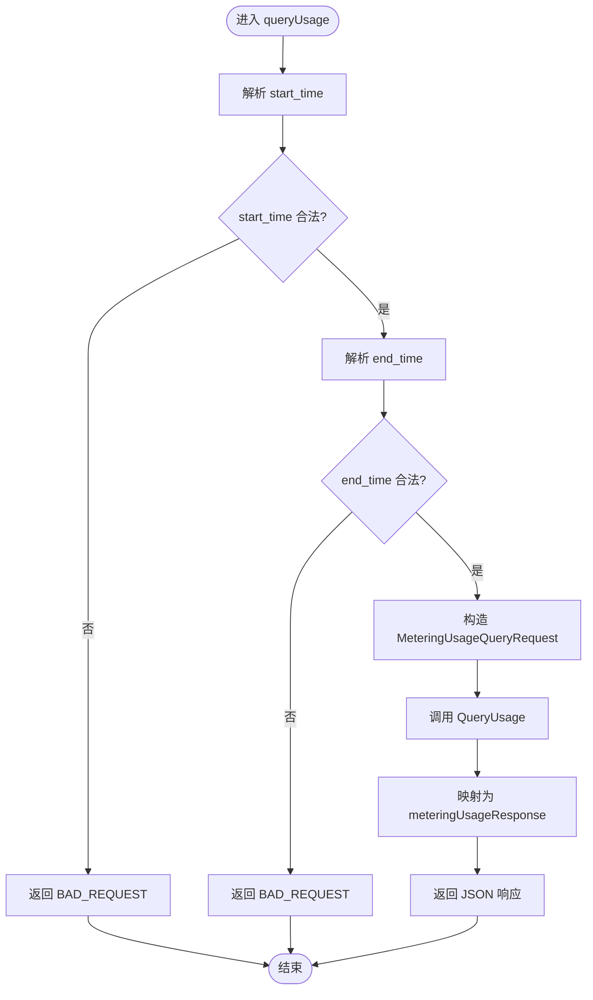
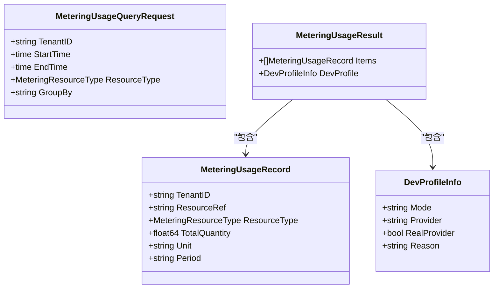
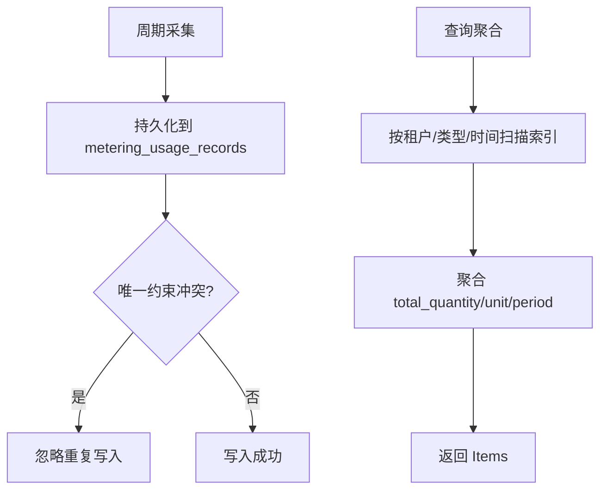
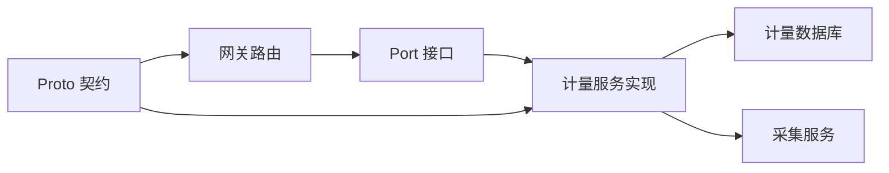

# 用量查询接口

<cite>
**本文引用的文件**
- [metering_resources.go](file://repo/services/ani-gateway/internal/router/metering_resources.go)
- [metering.go](file://repo/pkg/ports/metering.go)
- [core_dev_profile.go](file://repo/services/ani-gateway/internal/router/core_dev_profile.go)
- [metering_service.proto](file://repo/api/proto/metering/v1/metering_service.proto)
- [metering_collection_service.go](file://repo/services/metering-service/internal/service/metering_collection_service.go)
- [20260731_001_metering_usage.sql](file://repo/deploy/migrations/20260731_001_metering_usage.sql)
</cite>

## 目录
1. [简介](#简介)
2. [项目结构](#项目结构)
3. [核心组件](#核心组件)
4. [架构总览](#架构总览)
5. [详细组件分析](#详细组件分析)
6. [依赖关系分析](#依赖关系分析)
7. [性能考虑](#性能考虑)
8. [故障排查指南](#故障排查指南)
9. [结论](#结论)
10. [附录](#附录)

## 简介
本接口提供统一的资源用量查询能力，支持按租户、时间范围与资源类型进行历史用量查询，并返回聚合后的时间序列数据。接口同时附带开发配置信息（DevProfile），便于在本地或真实环境中调试与定位问题。当前实现覆盖 CPU、内存、GPU 等实例维度的秒级计量，以及 Token 输入/输出/总计的计量维度。

## 项目结构
- HTTP 网关层：负责路由注册、请求参数解析、错误处理与响应序列化。
- Port 契约层：定义统一的数据结构与接口，屏蔽具体实现差异。
- 采集与存储：通过采集服务周期拉取指标并写入计量表，查询侧从该表聚合返回。
- 协议定义：Proto 定义了跨语言的服务契约，便于 SDK 生成与多语言集成。

**图表来源**
- [metering_resources.go:65-94](file://repo/services/ani-gateway/internal/router/metering_resources.go#L65-L94)
- [metering.go:26-48](file://repo/pkg/ports/metering.go#L26-L48)
- [metering_collection_service.go](file://repo/services/metering-service/internal/service/metering_collection_service.go)
- [20260731_001_metering_usage.sql](file://repo/deploy/migrations/20260731_001_metering_usage.sql)

**章节来源**
- [metering_resources.go:65-94](file://repo/services/ani-gateway/internal/router/metering_resources.go#L65-L94)
- [metering.go:26-48](file://repo/pkg/ports/metering.go#L26-L48)

## 核心组件
- 查询请求对象 MeteringUsageQueryRequest：包含租户 ID、起止时间、资源类型、分组维度等。
- 查询结果对象 MeteringUsageResult：包含 Items（用量记录列表）与 DevProfile（开发配置信息）。
- 用量记录 MeteringUsageRecord：包含租户、资源引用、资源类型、总量、单位、周期标识。
- 网关路由 GET /api/v1/metering/usage：解析查询参数并调用 Port 接口，返回 JSON 响应。
- Proto 契约 QueryUsageRequest/QueryUsageResponse：用于跨语言服务定义与 SDK 生成。

**章节来源**
- [metering.go:26-48](file://repo/pkg/ports/metering.go#L26-L48)
- [metering_resources.go:65-94](file://repo/services/ani-gateway/internal/router/metering_resources.go#L65-L94)
- [metering_service.proto:34-44](file://repo/api/proto/metering/v1/metering_service.proto#L34-L44)

## 架构总览
用量查询的整体流程如下：
- 客户端发起 GET /api/v1/metering/usage，携带 start_time、end_time、resource_type、group_by 等查询参数。
- 网关解析参数，构造 MeteringUsageQueryRequest，调用 MeteringService.QueryUsage。
- 计量服务根据租户、时间范围与资源类型，从 metering_usage_records 表聚合数据，并附加 DevProfile。
- 网关将结果序列化为 meteringUsageResponse，包含 items、total、dev_profile。

**图表来源**
- [metering_resources.go:71-94](file://repo/services/ani-gateway/internal/router/metering_resources.go#L71-L94)
- [metering.go:78-81](file://repo/pkg/ports/metering.go#L78-L81)
- [20260731_001_metering_usage.sql](file://repo/deploy/migrations/20260731_001_metering_usage.sql)

## 详细组件分析

### 网关路由与参数解析
- 路由注册：GET /api/v1/metering/usage 映射到 queryUsage 处理器。
- 参数解析：
  - start_time、end_time：RFC3339 时间字符串，可选；非法时返回 BAD_REQUEST。
  - resource_type：过滤资源类型，为空表示全部。
  - group_by：分组维度，如 resource_type、az、day、hour。
- 错误处理：对无效参数返回 BAD_REQUEST；内部错误返回 INTERNAL_ERROR。
- 响应结构：
  - items：用量记录数组，每条包含 tenant_id、resource_type、total_quantity、unit、period。
  - total：items 数量。
  - dev_profile：开发配置信息，包含 mode、provider、real_provider、reason。

**图表来源**
- [metering_resources.go:71-94](file://repo/services/ani-gateway/internal/router/metering_resources.go#L71-L94)
- [metering_resources.go:161-179](file://repo/services/ani-gateway/internal/router/metering_resources.go#L161-L179)

**章节来源**
- [metering_resources.go:65-94](file://repo/services/ani-gateway/internal/router/metering_resources.go#L65-L94)
- [metering_resources.go:161-179](file://repo/services/ani-gateway/internal/router/metering_resources.go#L161-L179)

### Port 契约与数据结构
- MeteringResourceType：枚举值包括 instance_cpu_seconds、instance_memory_gib_seconds、instance_gpu_seconds、token_input、token_output、token_total。
- MeteringUsageQueryRequest：字段包括 TenantID、StartTime、EndTime、ResourceType、GroupBy。
- MeteringUsageRecord：字段包括 TenantID、ResourceRef、ResourceType、TotalQuantity、Unit、Period。
- MeteringUsageResult：字段包括 Items（[]MeteringUsageRecord）、DevProfile（DevProfileInfo）。
- DevProfileInfo：字段包括 Mode、Provider、RealProvider、Reason。

**图表来源**
- [metering.go:8-48](file://repo/pkg/ports/metering.go#L8-L48)
- [core_dev_profile.go:3-8](file://repo/services/ani-gateway/internal/router/core_dev_profile.go#L3-L8)

**章节来源**
- [metering.go:8-48](file://repo/pkg/ports/metering.go#L8-L48)
- [core_dev_profile.go:3-8](file://repo/services/ani-gateway/internal/router/core_dev_profile.go#L3-L8)

### 数据存储与聚合
- 计量表 metering_usage_records：
  - 主键 id、租户 tenant_id、资源引用 resource_ref、资源类型 resource_type、周期 period、数量 quantity、单位 unit、记录时间 recorded_at。
  - 唯一约束 (tenant_id, resource_ref, resource_type, period) 保证幂等写入。
  - 索引 idx_meter_tenant_type_time 优化按租户、类型、时间的查询。
- 采集服务 meteringCollectionService：
  - 管理 per-instance ticker，周期性采集指标并持久化。
  - 使用 ON CONFLICT DO NOTHING 避免重复写入。
  - 支持保底采集 collectFullLifetime，确保资源生命周期内的完整用量。

**图表来源**
- [20260731_001_metering_usage.sql](file://repo/deploy/migrations/20260731_001_metering_usage.sql)
- [metering_collection_service.go](file://repo/services/metering-service/internal/service/metering_collection_service.go)

**章节来源**
- [20260731_001_metering_usage.sql](file://repo/deploy/migrations/20260731_001_metering_usage.sql)
- [metering_collection_service.go](file://repo/services/metering-service/internal/service/metering_collection_service.go)

### Proto 契约与跨语言支持
- QueryUsageRequest：包含 tenant_id、resource_type、start_time、end_time、group_by。
- QueryUsageResponse：包含 records（UsageRecord 列表）。
- UsageRecord：包含 resource_type、az_name、total、unit、period。
- 该契约可用于生成多语言 SDK，便于在不同平台调用计量服务。

**章节来源**
- [metering_service.proto:34-52](file://repo/api/proto/metering/v1/metering_service.proto#L34-L52)

## 依赖关系分析
- 网关路由依赖 Port 接口，解耦具体实现。
- Port 接口定义数据结构，被网关与计量服务共同遵循。
- 计量服务依赖数据库表结构与采集服务，确保数据一致性与完整性。
- Proto 契约作为跨语言边界，保障 API 一致性。

**图表来源**
- [metering_resources.go:65-94](file://repo/services/ani-gateway/internal/router/metering_resources.go#L65-L94)
- [metering.go:78-81](file://repo/pkg/ports/metering.go#L78-L81)
- [metering_service.proto:11-22](file://repo/api/proto/metering/v1/metering_service.proto#L11-L22)

**章节来源**
- [metering_resources.go:65-94](file://repo/services/ani-gateway/internal/router/metering_resources.go#L65-L94)
- [metering.go:78-81](file://repo/pkg/ports/metering.go#L78-L81)
- [metering_service.proto:11-22](file://repo/api/proto/metering/v1/metering_service.proto#L11-L22)

## 性能考虑
- 时间范围限制：建议合理设置 start_time 与 end_time，避免过大时间窗口导致聚合开销增加。
- 资源类型过滤：明确 resource_type 可减少不必要的数据扫描。
- 分组维度选择：group_by 为 resource_type、az、day、hour 时，注意不同粒度对聚合性能的影响。
- 索引利用：查询依赖 idx_meter_tenant_type_time，确保按租户、类型、时间条件查询。
- 幂等写入：DB 唯一约束与 ON CONFLICT DO NOTHING 避免重复计算与写入开销。
- 采集间隔：调整采集服务的 IntervalSec 以平衡实时性与负载。

[本节为通用性能指导，不直接分析具体文件]

## 故障排查指南
- 参数错误：start_time 或 end_time 非 RFC3339 格式会返回 BAD_REQUEST，检查时间字符串格式。
- 内部错误：若发生未预期异常，返回 INTERNAL_ERROR，需查看服务端日志。
- 数据缺失：确认采集服务是否正常运行，ticker 是否启动，DB 是否有对应租户与类型的记录。
- 权限问题：写侧使用 BYPASSRLS 角色绕过行级安全策略，读侧受 RLS 保护，确保租户隔离。

**章节来源**
- [metering_resources.go:172-179](file://repo/services/ani-gateway/internal/router/metering_resources.go#L172-L179)
- [20260731_001_metering_usage.sql](file://repo/deploy/migrations/20260731_001_metering_usage.sql)

## 结论
用量查询接口通过统一的 Port 契约与网关路由，提供了灵活且可扩展的历史用量查询能力。结合采集服务与数据库索引，能够高效地聚合多种资源类型的用量数据，并附带开发配置信息便于调试。建议在生产环境中合理设置查询参数与采集间隔，以获得最佳性能与准确性。

[本节为总结性内容，不直接分析具体文件]

## 附录
- 常用资源类型：
  - instance_cpu_seconds：CPU 秒数
  - instance_memory_gib_seconds：内存 GiB·秒
  - instance_gpu_seconds：GPU 秒数
  - token_input/token_output/token_total：Token 输入/输出/总计
- 分组维度：
  - resource_type：按资源类型分组
  - az：按可用区分组
  - day/hour：按天/小时分组
- 开发配置信息 DevProfile：
  - mode：运行模式（如 local）
  - provider：提供者名称
  - real_provider：是否真实提供者
  - reason：原因说明

[本节为补充说明，不直接分析具体文件]