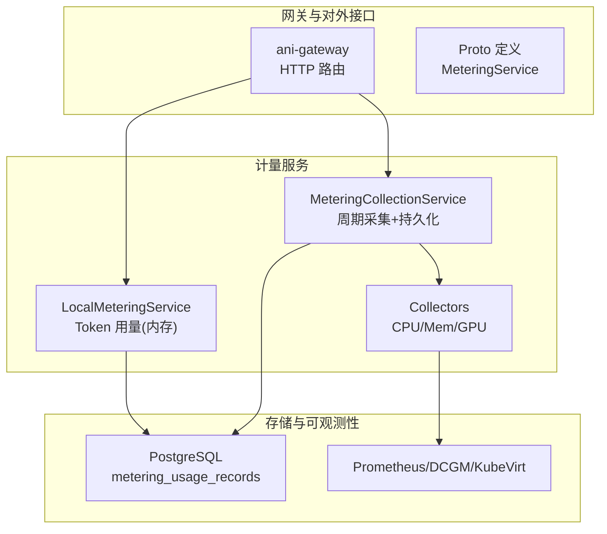
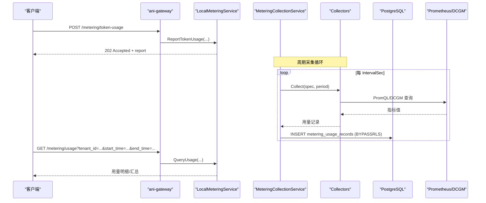
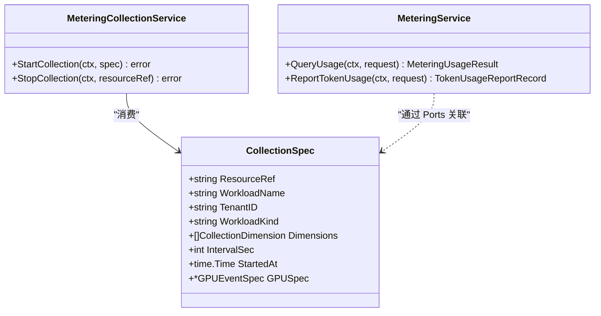
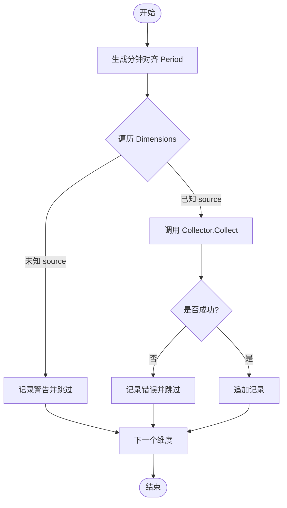
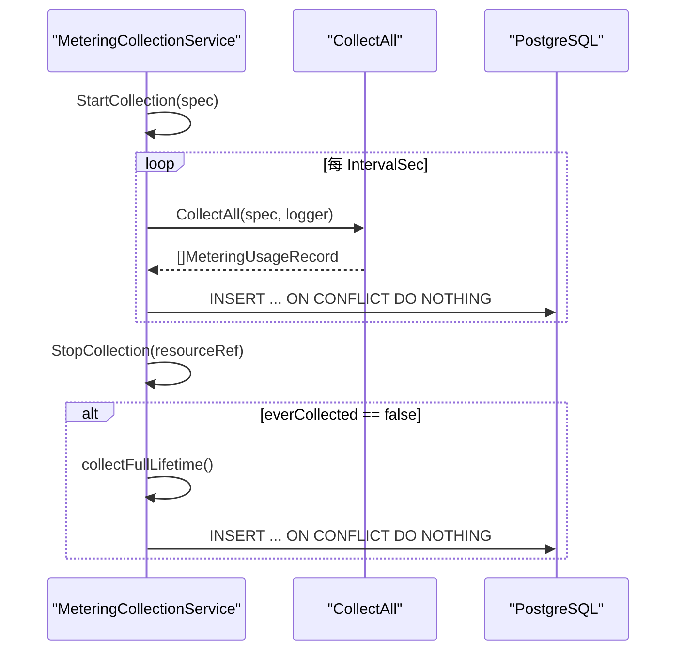
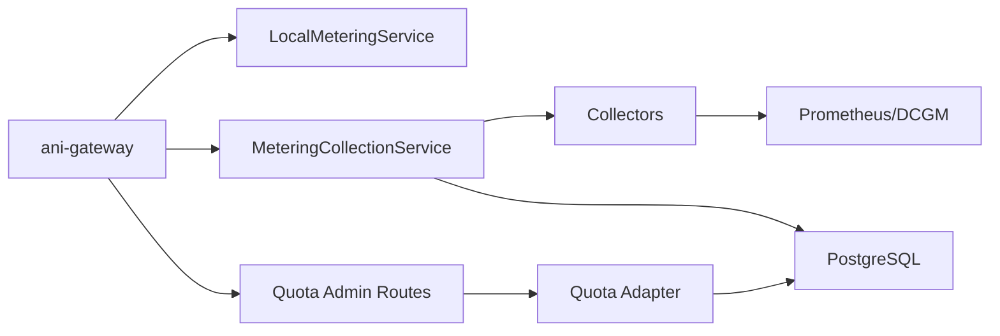

# 资源计量接口

<cite>
**本文引用的文件**
- [metering_service.proto](file://repo/api/proto/metering/v1/metering_service.proto)
- [metering.go](file://repo/pkg/ports/metering.go)
- [collectors.go](file://repo/pkg/adapters/metering/collectors.go)
- [metering_collection_service.go](file://repo/services/metering-service/internal/service/metering_collection_service.go)
- [local_metering_service.go](file://repo/pkg/adapters/runtime/local_metering_service.go)
- [metering_resources.go](file://repo/services/ani-gateway/internal/router/metering_resources.go)
- [20260731_001_metering_usage.sql](file://repo/deploy/migrations/20260731_001_metering_usage.sql)
- [quota.go](file://repo/pkg/ports/quota.go)
- [quota_resources.go](file://repo/services/ani-gateway/internal/router/quota_resources.go)
- [prometheus_instance_observability.go](file://repo/pkg/adapters/runtime/prometheus_instance_observability.go)
- [plan-metering-consumer-v2.md](file://repo/services/tasks/modules/plan/plan-metering-consumer-v2.md)
</cite>

## 目录
1. [简介](#简介)
2. [项目结构](#项目结构)
3. [核心组件](#核心组件)
4. [架构总览](#架构总览)
5. [详细组件分析](#详细组件分析)
6. [依赖关系分析](#依赖关系分析)
7. [性能与可靠性](#性能与可靠性)
8. [故障排查指南](#故障排查指南)
9. [结论](#结论)
10. [附录](#附录)

## 简介
本文件面向“资源计量”能力，覆盖 CPU、内存、GPU、存储等资源的用量采集、统计、查询与管理。当前仓库已实现：
- 计量数据模型与外部 API（gRPC Proto）定义
- 周期采集服务（按实例维度定时采集并落库）
- 采集器（CPU/Mem/GPU 三种维度）
- 本地令牌用量上报与查询（用于 Token 计费）
- 配额管理（创建/更新/查询租户配额元数据与配额项）
- 可观测性指标采集（Prometheus/DCGM/KubeVirt），为实时与历史查询提供数据源

尚未在代码中实现的运营分析能力（如成本计算、报表导出、容量规划）在本文档中以“设计建议”形式给出，便于后续扩展。

## 项目结构
计量相关代码分布在以下位置：
- 协议与端口定义：API Proto、Ports 接口
- 采集层：Collector 抽象与具体实现（CPU/Mem/GPU）
- 采集调度：MeteringCollectionService（周期采集、持久化、补采）
- 查询与上报：LocalMeteringService（内存态 Token 用量）、Gateway Router（HTTP 路由）
- 存储：PostgreSQL 表 metering_usage_records 及 RLS 策略
- 配额：QuotaService/Store/Admin 接口与 Gateway 路由
- 可观测性：PrometheusInstanceObservability（容器/VM/GPU 指标）

**图表来源**
- [metering_resources.go:65-69](file://repo/services/ani-gateway/internal/router/metering_resources.go#L65-L69)
- [metering_collection_service.go:21-49](file://repo/services/metering-service/internal/service/metering_collection_service.go#L21-L49)
- [collectors.go:19-43](file://repo/pkg/adapters/metering/collectors.go#L19-L43)
- [20260731_001_metering_usage.sql:21-31](file://repo/deploy/migrations/20260731_001_metering_usage.sql#L21-L31)

**章节来源**
- [metering_service.proto:11-22](file://repo/api/proto/metering/v1/metering_service.proto#L11-L22)
- [metering.go:8-48](file://repo/pkg/ports/metering.go#L8-L48)
- [metering_collection_service.go:21-49](file://repo/services/metering-service/internal/service/metering_collection_service.go#L21-L49)
- [collectors.go:19-43](file://repo/pkg/adapters/metering/collectors.go#L19-L43)
- [20260731_001_metering_usage.sql:21-31](file://repo/deploy/migrations/20260731_001_metering_usage.sql#L21-L31)

## 核心组件
- 计量数据模型与接口
  - 资源类型：instance_cpu_seconds、instance_memory_gib_seconds、instance_gpu_seconds、token_input/output/total
  - 采集规格 CollectionSpec：包含 ResourceRef、WorkloadName、TenantID、Dimensions、IntervalSec、GPUSpec 等
  - 采集服务接口 MeteringCollectionService：StartCollection/StopCollection
  - 查询接口 MeteringService：QueryUsage、ReportTokenUsage
- 采集器
  - DCGMGPUCollector：基于 GPU 持有时长（Count × IntervalSec）
  - KubeletCPUCollector：PromQL rate(container_cpu_usage_seconds_total) × IntervalSec
  - KubeletMemCollector：PromQL container_memory_working_set_bytes → GiB-秒
- 周期采集服务
  - 维护 per-instance ticker，周期调用 CollectAll 聚合各维度记录
  - 写入 metering_usage_records，使用 BYPASSRLS 角色跨租户写入
  - StopCollection 时若从未产出记录，则补采一次全生命周期量
- 本地 Token 用量服务
  - 内存态保存 Token 用量报告，支持去重与查询
- 配额管理
  - QuotaService/Try/Confirm/Cancel/Release 预占与确认
  - QuotaAdminService 管理租户配额配置与元数据
  - Gateway 暴露管理端点

**章节来源**
- [metering.go:8-112](file://repo/pkg/ports/metering.go#L8-L112)
- [collectors.go:19-294](file://repo/pkg/adapters/metering/collectors.go#L19-L294)
- [metering_collection_service.go:51-193](file://repo/services/metering-service/internal/service/metering_collection_service.go#L51-L193)
- [local_metering_service.go:14-136](file://repo/pkg/adapters/runtime/local_metering_service.go#L14-L136)
- [quota.go:8-102](file://repo/pkg/ports/quota.go#L8-L102)
- [quota_resources.go:18-28](file://repo/services/ani-gateway/internal/router/quota_resources.go#L18-L28)

## 架构总览
计量系统由“采集—持久化—查询—管理”四层构成：
- 采集层：按实例维度周期性采集 CPU/Mem/GPU 用量，或上报 Token 用量
- 持久化层：metering_usage_records 表承载周期用量；RLS 保证读侧租户隔离
- 查询层：Gateway HTTP 暴露 /metering/usage 与 /metering/token-usage
- 管理层：配额管理与元数据查询，支撑配额预警与容量规划

**图表来源**
- [metering_resources.go:65-124](file://repo/services/ani-gateway/internal/router/metering_resources.go#L65-L124)
- [metering_collection_service.go:79-115](file://repo/services/metering-service/internal/service/metering_collection_service.go#L79-L115)
- [collectors.go:66-129](file://repo/pkg/adapters/metering/collectors.go#L66-L129)
- [20260731_001_metering_usage.sql:21-31](file://repo/deploy/migrations/20260731_001_metering_usage.sql#L21-L31)

## 详细组件分析

### 计量数据模型与接口
- 资源类型枚举：instance_cpu_seconds、instance_memory_gib_seconds、instance_gpu_seconds、token_input/output/total
- 采集规格：ResourceRef、WorkloadName、TenantID、Dimensions[]、IntervalSec、GPUSpec
- 采集服务：StartCollection/StopCollection 幂等控制
- 查询服务：QueryUsage（时间范围、分组）、ReportTokenUsage（幂等键、来源、模型、输入输出 token）

**图表来源**
- [metering.go:26-112](file://repo/pkg/ports/metering.go#L26-L112)

**章节来源**
- [metering.go:8-112](file://repo/pkg/ports/metering.go#L8-L112)

### 采集器（CPU/Mem/GPU）
- GPU：不查 DCGM/Prometheus，直接以 Count×IntervalSec 计算 gpu_second
- CPU：PromQL rate(container_cpu_usage_seconds_total[IntervalSec]) 聚合后乘以 IntervalSec
- 内存：PromQL container_memory_working_set_bytes 转换为 GiB-秒
- 统一入口 CollectAll：按 Dimensions 路由到对应 Collector，失败维度跳过并记录日志

**图表来源**
- [collectors.go:241-266](file://repo/pkg/adapters/metering/collectors.go#L241-L266)

**章节来源**
- [collectors.go:19-294](file://repo/pkg/adapters/metering/collectors.go#L19-L294)

### 周期采集服务（MeteringCollectionService）
- 启动：按 ResourceRef 创建 ticker，默认间隔 60s
- 循环：周期调用 CollectAll，写入 metering_usage_records（BYPASSRLS 角色）
- 停止：关闭 ticker，若从未产出记录则补采一次全生命周期量
- 持久化：批量插入，ON CONFLICT DO NOTHING 保证幂等

**图表来源**
- [metering_collection_service.go:51-193](file://repo/services/metering-service/internal/service/metering_collection_service.go#L51-L193)
- [20260731_001_metering_usage.sql:21-31](file://repo/deploy/migrations/20260731_001_metering_usage.sql#L21-L31)

**章节来源**
- [metering_collection_service.go:51-193](file://repo/services/metering-service/internal/service/metering_collection_service.go#L51-L193)

### 本地 Token 用量服务（LocalMeteringService）
- 上报：校验必填字段、幂等键、非负 token 数，生成 report ID 并缓存
- 查询：按 tenant_id 过滤，聚合 input/output/total tokens
- 开发模式：DevProfile 标记 local 模式

**章节来源**
- [local_metering_service.go:14-136](file://repo/pkg/adapters/runtime/local_metering_service.go#L14-L136)

### 网关路由（HTTP）
- GET /api/v1/metering/usage：查询用量（支持 start_time/end_time/resource_type/group_by）
- POST /api/v1/metering/token-usage：上报 Token 用量（idempotency_key/source/model/input_tokens/output_tokens/request_id/instance_id/occurred_at/labels）

**章节来源**
- [metering_resources.go:65-124](file://repo/services/ani-gateway/internal/router/metering_resources.go#L65-L124)

### 配额管理
- 资源类型：gpu_count、cpu_core、memory_gb、storage_gb、token_count、kb_query_count、member_count、inference_service_count
- 管理端点：
  - POST /api/v1/admin/tenants/{tenant_id}/quota：创建租户配额
  - PUT /api/v1/admin/tenants/{tenant_id}/quota：更新租户配额
  - GET /api/v1/admin/tenants/{tenant_id}/quota：查询租户配额
  - DELETE /api/v1/admin/tenants/{tenant_id}/quota：删除租户配额
  - GET /api/v1/admin/quota-meta：列出配额元数据（enabled=true）
- 预占流程：Try/TryMany → Confirm/Cancel/Release，原子事务保障一致性

**章节来源**
- [quota.go:8-102](file://repo/pkg/ports/quota.go#L8-L102)
- [quota_resources.go:18-165](file://repo/services/ani-gateway/internal/router/quota_resources.go#L18-L165)

### 可观测性与实时指标
- Prometheus 采集容器 CPU/内存/网络，DCGM 采集 GPU 利用率与显存，KubeVirt 采集 VM 指标
- 单 exporter 不可用时不阻塞其他字段采集，缺失字段返回 nil

**章节来源**
- [prometheus_instance_observability.go:182-202](file://repo/pkg/adapters/runtime/prometheus_instance_observability.go#L182-L202)

## 依赖关系分析
- 采集器依赖 Prometheus/DCGM 指标源
- 周期采集服务依赖 PostgreSQL（metering_usage_records）
- 网关路由依赖 LocalMeteringService 与 MeteringCollectionService
- 配额管理依赖 PostgresQuota 适配器与元数据表

**图表来源**
- [metering_resources.go:65-124](file://repo/services/ani-gateway/internal/router/metering_resources.go#L65-L124)
- [metering_collection_service.go:79-115](file://repo/services/metering-service/internal/service/metering_collection_service.go#L79-L115)
- [collectors.go:66-129](file://repo/pkg/adapters/metering/collectors.go#L66-L129)
- [quota_resources.go:18-165](file://repo/services/ani-gateway/internal/router/quota_resources.go#L18-L165)

**章节来源**
- [metering_resources.go:65-124](file://repo/services/ani-gateway/internal/router/metering_resources.go#L65-L124)
- [metering_collection_service.go:79-115](file://repo/services/metering-service/internal/service/metering_collection_service.go#L79-L115)
- [collectors.go:66-129](file://repo/pkg/adapters/metering/collectors.go#L66-L129)
- [quota_resources.go:18-165](file://repo/services/ani-gateway/internal/router/quota_resources.go#L18-L165)

## 性能与可靠性
- 幂等与去重
  - 周期采集：进程内 map 去重 ticker；DB UNIQUE 约束 + ON CONFLICT DO NOTHING 兜底重复写入
  - Token 上报：idempotency_key 去重，重复请求返回 duplicate 状态
- 容错与降级
  - 采集器维度失败仅记录错误并跳过，不影响其他维度
  - Prometheus 单个 exporter 不可用不阻塞其他字段采集
- 并发与锁
  - 周期采集使用互斥锁保护 map；慢 I/O 在锁外执行
- 安全与隔离
  - 写侧使用 BYPASSRLS 角色跨租户写入；读侧启用 RLS 按租户隔离

**章节来源**
- [metering_collection_service.go:51-193](file://repo/services/metering-service/internal/service/metering_collection_service.go#L51-L193)
- [local_metering_service.go:79-124](file://repo/pkg/adapters/runtime/local_metering_service.go#L79-L124)
- [prometheus_instance_observability.go:182-202](file://repo/pkg/adapters/runtime/prometheus_instance_observability.go#L182-L202)
- [20260731_001_metering_usage.sql:45-51](file://repo/deploy/migrations/20260731_001_metering_usage.sql#L45-L51)

## 故障排查指南
- 采集失败
  - 检查 CollectAll 日志中的 unknown collector source 与 collector collect failed
  - 验证 Prometheus/DCGM 可达性与指标名
- 写入失败
  - 检查 ani_metering_writer 角色权限与数据库连接
  - 查看 INSERT 错误信息（含 resource_ref/resource_type/period）
- 查询无数据
  - 确认 StartCollection 已调用且 everCollected 为 true
  - 检查 RLS 策略与租户上下文设置
- Token 上报异常
  - 校验必填字段与 idempotency_key 唯一性
  - 确认 occurred_at 格式为 RFC3339

**章节来源**
- [collectors.go:241-266](file://repo/pkg/adapters/metering/collectors.go#L241-L266)
- [metering_collection_service.go:83-115](file://repo/services/metering-service/internal/service/metering_collection_service.go#L83-L115)
- [metering_collection_service.go:195-237](file://repo/services/metering-service/internal/service/metering_collection_service.go#L195-L237)
- [local_metering_service.go:79-124](file://repo/pkg/adapters/runtime/local_metering_service.go#L79-L124)

## 结论
当前仓库已实现资源计量的基础闭环：采集（CPU/Mem/GPU/Token）、持久化（metering_usage_records）、查询（HTTP）、配额管理（CRUD）。可观测性层为实时与历史查询提供数据源。后续可在现有基础上扩展：
- 成本计算：结合资源单价与用量记录进行费用核算
- 报表导出：按租户/时间段导出 CSV/Excel
- 容量规划：基于历史用量趋势预测资源需求
- 配额预警：当 used/reserved 接近 total 时触发告警

## 附录

### 外部 API（gRPC）
- RecordUsage：内部服务上报用量（fire-and-forget）
- QueryUsage：按租户与时间范围查询用量
- GetSummary：按计费周期汇总用量

**章节来源**
- [metering_service.proto:11-22](file://repo/api/proto/metering/v1/metering_service.proto#L11-L22)
- [metering_service.proto:24-70](file://repo/api/proto/metering/v1/metering_service.proto#L24-L70)

### 数据库迁移
- 新建 metering_usage_records 表与索引
- 创建 ani_metering_writer 角色（BYPASSRLS）
- 启用 RLS 并定义 tenant_isolation 策略

**章节来源**
- [20260731_001_metering_usage.sql:9-53](file://repo/deploy/migrations/20260731_001_metering_usage.sql#L9-L53)

### 部署与服务骨架
- metering-service 独立进程，健康端口 9210
- 环境变量：DATABASE_URL、NATS_URL、METERING_PROMETHEUS_URL、METERING_COLLECTION_INTERVAL_SECONDS

**章节来源**
- [plan-metering-consumer-v2.md:909-1020](file://repo/services/tasks/modules/plan/plan-metering-consumer-v2.md#L909-L1020)