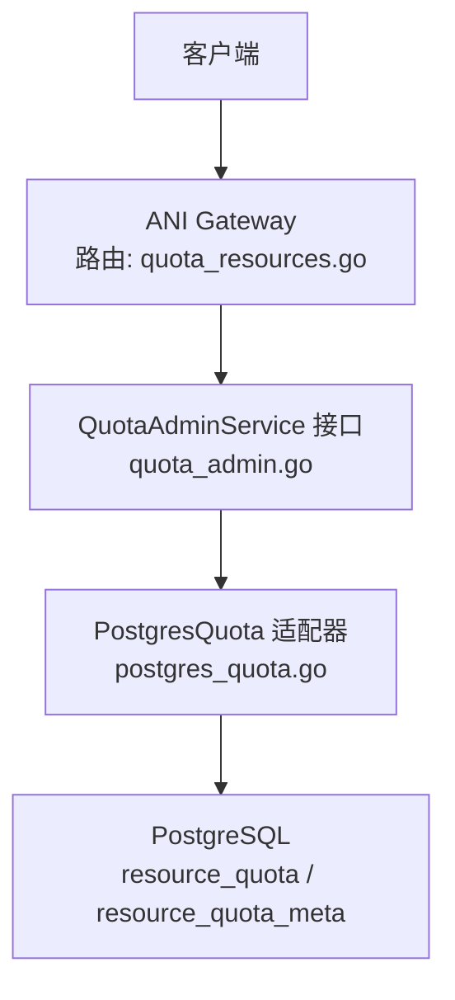
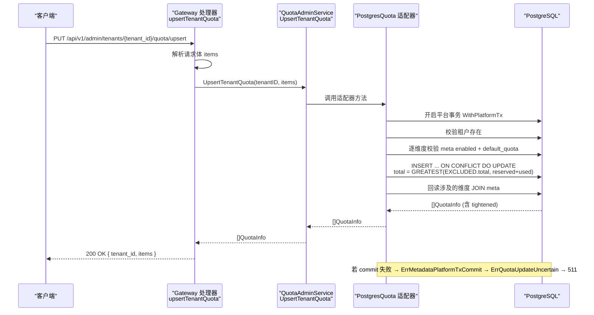
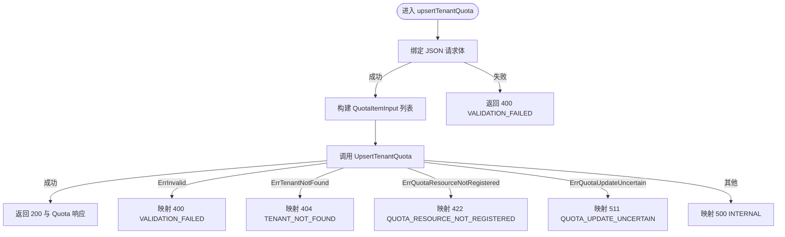
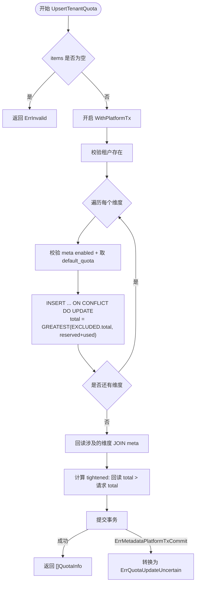
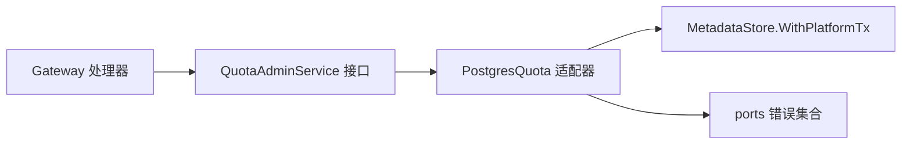

# 配额管理 Upsert API

<cite>
**本文引用的文件**
- [v1.yaml](file://repo/api/openapi/v1.yaml)
- [quota_resources.go](file://repo/services/ani-gateway/internal/router/quota_resources.go)
- [quota_admin.go](file://repo/pkg/ports/quota_admin.go)
- [postgres_quota.go](file://repo/pkg/adapters/runtime/postgres_quota.go)
- [errors.go](file://repo/pkg/ports/errors.go)
- [quota-service.md](file://repo/development-records/quota-service.md)
</cite>

## 目录
1. [简介](#简介)
2. [项目结构](#项目结构)
3. [核心组件](#核心组件)
4. [架构总览](#架构总览)
5. [详细组件分析](#详细组件分析)
6. [依赖关系分析](#依赖关系分析)
7. [性能与一致性](#性能与一致性)
8. [故障排查指南](#故障排查指南)
9. [结论](#结论)
10. [附录：API 契约要点](#附录api-契约要点)

## 简介
本文件聚焦于“配额管理 Upsert API”的端到端设计与实现，覆盖从 OpenAPI 契约、Gateway 路由与错误映射、到后端端口接口与 Postgres 适配器的事务与缩容策略。该接口用于批量为租户设置多个资源维度的配额上限：已存在维度更新 total，不存在维度新建；任一维度失败整体回滚；缩容时自动 clamp 到当前已用量（reserved+used），并通过 tightened 标记告知调用方。

## 项目结构
配额管理 Upsert API 涉及三层协作：
- 契约层：OpenAPI 定义路径、请求/响应 schema、错误码与 RBAC scope。
- Gateway 层：Hertz 路由注册、请求解析、业务调用与 HTTP 错误映射。
- 适配层：Postgres 事务、校验、写入与回读，以及平台事务边界与 RLS bypass。

图表来源
- [quota_resources.go:22-30](file://repo/services/ani-gateway/internal/router/quota_resources.go#L22-L30)
- [quota_admin.go:48-58](file://repo/pkg/ports/quota_admin.go#L48-L58)
- [postgres_quota.go:737-808](file://repo/pkg/adapters/runtime/postgres_quota.go#L737-L808)
- [v1.yaml:8697-8729](file://repo/api/openapi/v1.yaml#L8697-L8729)

章节来源
- [v1.yaml:8697-8729](file://repo/api/openapi/v1.yaml#L8697-L8729)
- [quota_resources.go:22-30](file://repo/services/ani-gateway/internal/router/quota_resources.go#L22-L30)
- [quota_admin.go:48-58](file://repo/pkg/ports/quota_admin.go#L48-L58)
- [postgres_quota.go:737-808](file://repo/pkg/adapters/runtime/postgres_quota.go#L737-L808)

## 核心组件
- OpenAPI 契约：定义 PUT /admin/tenants/{tenant_id}/quota/upsert、请求体 QuotaUpsertRequest/Item、响应 Quota、错误码 400/401/403/404/422/511。
- Gateway 处理器：解析请求、构造 QuotaItemInput、调用 QuotaAdminService.UpsertTenantQuota，并将适配器哨兵错误映射为 HTTP 三段式错误。
- 端口接口：QuotaAdminService 新增 UpsertTenantQuota，统一输入类型为 QuotaItemInput。
- 适配器实现：PostgresQuota.UpsertTenantQuota 使用 WithPlatformTx 自开平台事务，执行 INSERT ... ON CONFLICT DO UPDATE，缩容 clamp 并回读计算 tightened；commit 失败转换为 ErrQuotaUpdateUncertain。

章节来源
- [v1.yaml:8697-8729](file://repo/api/openapi/v1.yaml#L8697-L8729)
- [quota_resources.go:140-164](file://repo/services/ani-gateway/internal/router/quota_resources.go#L140-L164)
- [quota_admin.go:48-58](file://repo/pkg/ports/quota_admin.go#L48-L58)
- [postgres_quota.go:737-808](file://repo/pkg/adapters/runtime/postgres_quota.go#L737-L808)
- [errors.go:17-30](file://repo/pkg/ports/errors.go#L17-L30)

## 架构总览
下图展示一次 Upsert 请求从网关到数据库的完整调用链，包括缩容 clamp 与 tightened 标记的计算。

图表来源
- [quota_resources.go:140-164](file://repo/services/ani-gateway/internal/router/quota_resources.go#L140-L164)
- [postgres_quota.go:737-808](file://repo/pkg/adapters/runtime/postgres_quota.go#L737-L808)
- [v1.yaml:8697-8729](file://repo/api/openapi/v1.yaml#L8697-L8729)

## 详细组件分析

### Gateway 处理器：upsertTenantQuota
- 路由注册：在 v1 组下注册 PUT /admin/tenants/:tenant_id/quota/upsert。
- 请求解析：将 JSON 中的 items 转为 ports.QuotaItemInput，其中 total 可为空表示未提供。
- 业务调用：调用 admin.UpsertTenantQuota。
- 错误映射：使用 writeQuotaUpsertError 将适配器哨兵错误映射为 HTTP 状态码与三段式错误；特别处理 ErrQuotaUpdateUncertain 返回 511。

图表来源
- [quota_resources.go:140-164](file://repo/services/ani-gateway/internal/router/quota_resources.go#L140-L164)
- [quota_resources.go:241-254](file://repo/services/ani-gateway/internal/router/quota_resources.go#L241-L254)

章节来源
- [quota_resources.go:22-30](file://repo/services/ani-gateway/internal/router/quota_resources.go#L22-L30)
- [quota_resources.go:140-164](file://repo/services/ani-gateway/internal/router/quota_resources.go#L140-L164)
- [quota_resources.go:241-254](file://repo/services/ani-gateway/internal/router/quota_resources.go#L241-L254)

### 端口接口：QuotaAdminService
- 新增 UpsertTenantQuota(ctx, tenantID, items) 方法，复用 QuotaItemInput 作为输入类型。
- 所有管理方法自开平台事务，适配器需具备 RLS bypass 能力以跨租户管理。

章节来源
- [quota_admin.go:48-58](file://repo/pkg/ports/quota_admin.go#L48-L58)

### 适配器实现：PostgresQuota.UpsertTenantQuota
- 事务边界：自开 WithPlatformTx，保证跨租户访问与原子性。
- 前置校验：
  - 校验租户存在。
  - 逐维度校验 resource_type 已在 resource_quota_meta 中注册且 enabled=true。
  - total < 0 直接返回无效参数错误。
- 写入逻辑：
  - 对每个维度执行 INSERT ... ON CONFLICT DO UPDATE，更新 total 时使用 GREATEST(EXCLUDED.total, reserved+used) 进行缩容 clamp。
  - 同一事务内完成所有维度写入，任一失败整体回滚。
- 回读与 tightened：
  - 回读本次涉及的维度并 JOIN meta，得到 unit/display_name/is_discrete。
  - 若回读的 total > 请求 total，则置 tightened=true，提示调用方实际生效值被收紧。
- 提交阶段异常：
  - 捕获 ErrMetadataPlatformTxCommit 并转换为 ErrQuotaUpdateUncertain，避免调用方误重试。

图表来源
- [postgres_quota.go:737-808](file://repo/pkg/adapters/runtime/postgres_quota.go#L737-L808)
- [errors.go:17-30](file://repo/pkg/ports/errors.go#L17-L30)

章节来源
- [postgres_quota.go:737-808](file://repo/pkg/adapters/runtime/postgres_quota.go#L737-L808)
- [errors.go:17-30](file://repo/pkg/ports/errors.go#L17-L30)

### OpenAPI 契约要点
- 路径：PUT /api/v1/admin/tenants/{tenant_id}/quota/upsert
- 权限：x-ani-rbac-scope 为 scope:quota:write
- 幂等键：可选 Idempotency-Key header，相同请求最终状态一致
- 语义：
  - 已存在维度更新 total，不存在维度新建
  - total 未提供或为 0 时取 default_quota
  - 负数 total 返回 400 VALIDATION_FAILED
  - 缩容 clamp 到 used+reserved，tightened=true
- 响应：200 返回 Quota（含 items 与 tightened）
- 错误：
  - 400 VALIDATION_FAILED
  - 401/403 认证/授权
  - 404 TENANT_NOT_FOUND
  - 422 QUOTA_RESOURCE_NOT_REGISTERED
  - 511 QUOTA_UPDATE_UNCERTAIN（事务提交状态未知，不得自动重试）

章节来源
- [v1.yaml:8697-8729](file://repo/api/openapi/v1.yaml#L8697-L8729)

## 依赖关系分析
- Gateway 依赖 QuotaAdminService 接口，解耦具体存储实现。
- 适配器依赖 MetadataStore 提供的 WithPlatformTx，确保平台级事务与 RLS bypass。
- 错误体系通过 ports 包集中定义哨兵错误，便于 Gateway 统一映射。

图表来源
- [quota_resources.go:14-17](file://repo/services/ani-gateway/internal/router/quota_resources.go#L14-L17)
- [quota_admin.go:48-58](file://repo/pkg/ports/quota_admin.go#L48-L58)
- [postgres_quota.go:22-24](file://repo/pkg/adapters/runtime/postgres_quota.go#L22-L24)
- [errors.go:17-30](file://repo/pkg/ports/errors.go#L17-L30)

章节来源
- [quota_resources.go:14-17](file://repo/services/ani-gateway/internal/router/quota_resources.go#L14-L17)
- [quota_admin.go:48-58](file://repo/pkg/ports/quota_admin.go#L48-L58)
- [postgres_quota.go:22-24](file://repo/pkg/adapters/runtime/postgres_quota.go#L22-L24)
- [errors.go:17-30](file://repo/pkg/ports/errors.go#L17-L30)

## 性能与一致性
- 原子性：所有维度在同一平台事务中写入，任一失败整体回滚，避免部分成功导致的状态不一致。
- 并发安全：通过行锁与 CHECK 约束保障 total >= reserved+used，防止超卖。
- 缩容保护：SQL 层 GREATEST 保证不会低于已用量，减少应用层分支复杂度。
- 幂等性：OpenAPI 保留可选 Idempotency-Key；set-total 语义天然幂等，重复执行结果一致。
- 可扩展性：新增维度仅需配置 resource_quota_meta，无需修改代码。

[本节为通用指导，不直接分析具体文件]

## 故障排查指南
- 400 VALIDATION_FAILED：检查 items 是否为空、是否存在 total < 0、或重复 resource_type。
- 404 TENANT_NOT_FOUND：确认租户存在且传入正确的 tenant_id。
- 422 QUOTA_RESOURCE_NOT_REGISTERED：确认 resource_type 已在 resource_quota_meta 中注册且 enabled=true。
- 511 QUOTA_UPDATE_UNCERTAIN：事务提交阶段失败，无法确定是否已提交，禁止自动重试，需人工核对租户配额。
- tightened=true：说明请求的 total 小于当前 used+reserved，实际生效值为 used+reserved，后续 Try 可能因不足而失败。

章节来源
- [quota_resources.go:241-254](file://repo/services/ani-gateway/internal/router/quota_resources.go#L241-L254)
- [postgres_quota.go:737-808](file://repo/pkg/adapters/runtime/postgres_quota.go#L737-L808)
- [quota-service.md:1646-1714](file://repo/development-records/quota-service.md#L1646-L1714)

## 结论
配额管理 Upsert API 通过 OpenAPI 契约、Gateway 错误映射与 Postgres 适配器事务的组合，实现了“存在即更新、不存在即新建”的原子批量操作，并在缩容场景下提供 tightened 标记与 clamp 保护。对于事务提交阶段的异常，明确区分不确定状态并阻止自动重试，提升了系统的可观测性与健壮性。

[本节为总结，不直接分析具体文件]

## 附录：API 契约要点
- 路径与方法：PUT /api/v1/admin/tenants/{tenant_id}/quota/upsert
- 权限范围：scope:quota:write
- 请求体：QuotaUpsertRequest.items 数组，每项包含 resource_type 与可选 total
- 响应体：Quota.tenant_id 与 items 数组，每项包含 total/used/reserved/tightened/unit/display_name/is_discrete
- 错误码：
  - 400 VALIDATION_FAILED
  - 401/403 认证/授权
  - 404 TENANT_NOT_FOUND
  - 422 QUOTA_RESOURCE_NOT_REGISTERED
  - 511 QUOTA_UPDATE_UNCERTAIN

章节来源
- [v1.yaml:8697-8729](file://repo/api/openapi/v1.yaml#L8697-L8729)