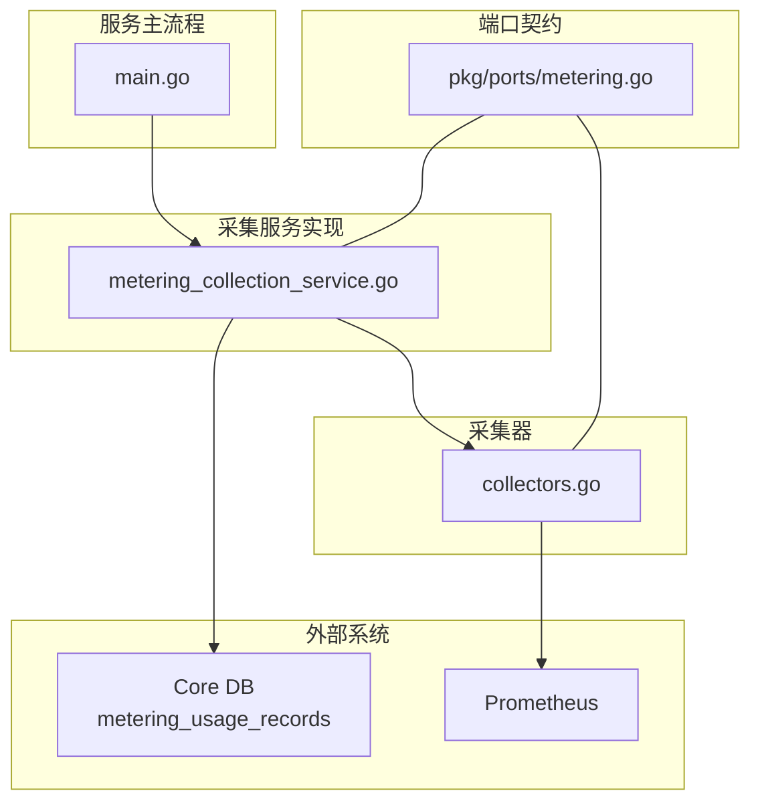
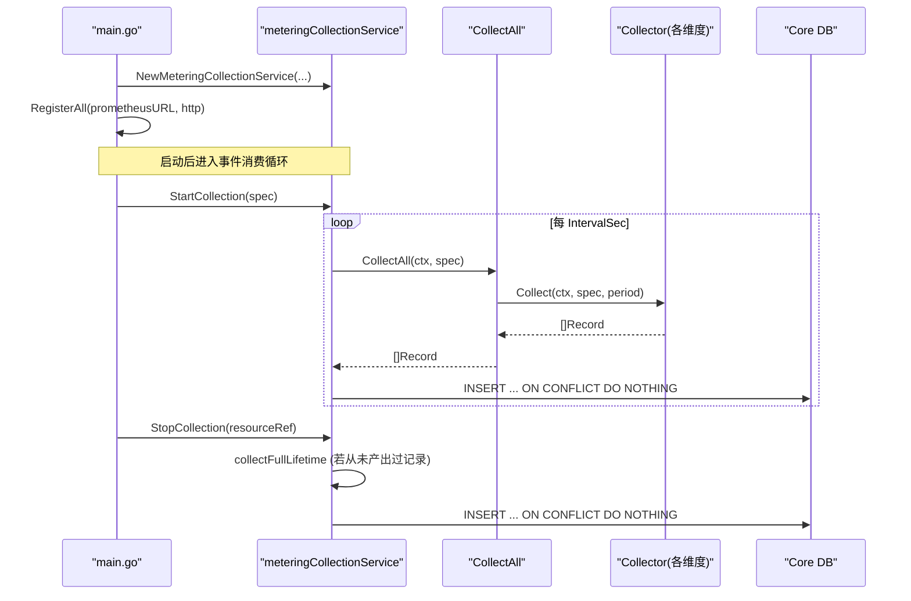
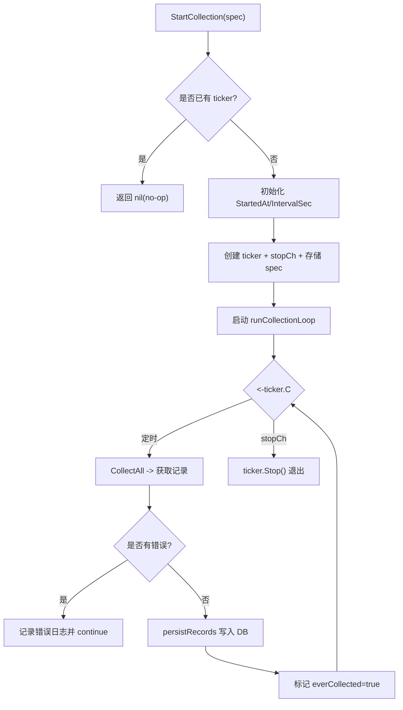
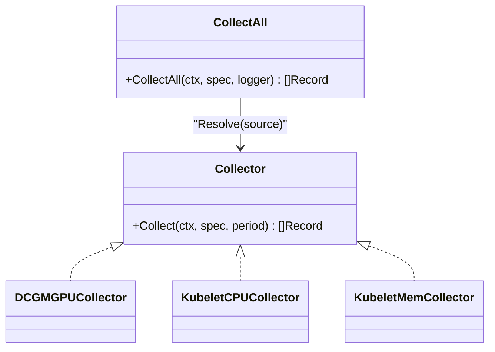
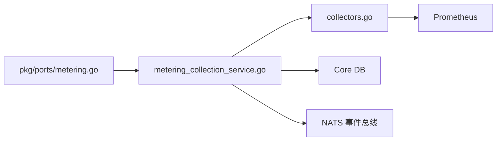

# 采集服务接口

<cite>
**本文引用的文件**
- [pkg/ports/metering.go](file://repo/pkg/ports/metering.go)
- [services/metering-service/internal/service/metering_collection_service.go](file://repo/services/metering-service/internal/service/metering_collection_service.go)
- [pkg/adapters/metering/collectors.go](file://repo/pkg/adapters/metering/collectors.go)
- [api/proto/metering/v1/metering_service.proto](file://repo/api/proto/metering/v1/metering_service.proto)
- [services/metering-service/main.go](file://repo/services/metering-service/main.go)
- [services/metering-service/internal/config/config.go](file://repo/services/metering-service/internal/config/config.go)
- [plan-metering-consumer-v2.md](file://repo/services/tasks/modules/plan/plan-metering-consumer-v2.md)
</cite>

## 目录
1. [简介](#简介)
2. [项目结构](#项目结构)
3. [核心组件](#核心组件)
4. [架构总览](#架构总览)
5. [详细组件分析](#详细组件分析)
6. [依赖关系分析](#依赖关系分析)
7. [性能与可靠性](#性能与可靠性)
8. [部署与运维指南](#部署与运维指南)
9. [故障排查](#故障排查)
10. [结论](#结论)

## 简介
本文件面向“计量采集服务”的接口与实现，重点说明 MeteringCollectionService 的生命周期管理能力（StartCollection、StopCollection），以及 CollectionSpec 采集规格与 CollectionDimension 采集维度的配置方法。文档还覆盖多资源类型组合采集、任务启动/停止/监控与管理、以及服务的部署配置与运维要点。

## 项目结构
计量采集能力由三部分构成：
- 端口契约定义：在 pkg/ports 中定义 CollectionSpec、CollectionDimension、MeteringCollectionService 等接口与数据结构。
- 采集服务实现：在 services/metering-service 中实现 meteringCollectionService，负责按周期触发采集、持久化记录、保底补采。
- 采集器集合：在 pkg/adapters/metering 中提供各维度 Collector（GPU/CPU/内存）及 CollectAll 路由入口。

图表来源
- [pkg/ports/metering.go:83-111](file://repo/pkg/ports/metering.go#L83-L111)
- [services/metering-service/internal/service/metering_collection_service.go:21-49](file://repo/services/metering-service/internal/service/metering_collection_service.go#L21-L49)
- [pkg/adapters/metering/collectors.go:19-23](file://repo/pkg/adapters/metering/collectors.go#L19-L23)
- [services/metering-service/main.go:17-33](file://repo/services/metering-service/main.go#L17-L33)

章节来源
- [pkg/ports/metering.go:83-111](file://repo/pkg/ports/metering.go#L83-L111)
- [services/metering-service/internal/service/metering_collection_service.go:21-49](file://repo/services/metering-service/internal/service/metering_collection_service.go#L21-L49)
- [pkg/adapters/metering/collectors.go:19-23](file://repo/pkg/adapters/metering/collectors.go#L19-L23)
- [services/metering-service/main.go:17-33](file://repo/services/metering-service/main.go#L17-L33)

## 核心组件
- MeteringCollectionService：定义 StartCollection(ctx, spec) 与 StopCollection(ctx, resourceRef) 两个生命周期控制接口，与查询/上报语义分离。
- CollectionSpec：描述单个资源的周期采集规格，包含资源引用、租户、工作负载信息、采集维度列表、时间间隔、起始时间与 GPU 规格等。
- CollectionDimension：描述一个采集维度，包括资源类型与数据来源（collector source）。
- CollectAll：按维度路由到具体 Collector，产出该周期的用量记录。

章节来源
- [pkg/ports/metering.go:8-17](file://repo/pkg/ports/metering.go#L8-L17)
- [pkg/ports/metering.go:83-111](file://repo/pkg/ports/metering.go#L83-L111)
- [pkg/adapters/metering/collectors.go:241-266](file://repo/pkg/adapters/metering/collectors.go#L241-L266)

## 架构总览
采集服务以事件驱动方式运行：
- 启动时注册所有 Collector（GPU/CPU/内存），构造 meteringCollectionService 并注入 CollectAll。
- 通过 NATS 订阅实例事件，消费侧根据事件创建或更新对应资源的采集任务（ticker）。
- 每个资源维护独立的 ticker，按 IntervalSec 周期调用 CollectAll 采集并持久化。
- 停止时执行保底采集，确保短生命周期资源也能产出完整存活期用量。

图表来源
- [services/metering-service/main.go:17-33](file://repo/services/metering-service/main.go#L17-L33)
- [services/metering-service/internal/service/metering_collection_service.go:51-77](file://repo/services/metering-service/internal/service/metering_collection_service.go#L51-L77)
- [services/metering-service/internal/service/metering_collection_service.go:79-115](file://repo/services/metering-service/internal/service/metering_collection_service.go#L79-L115)
- [services/metering-service/internal/service/metering_collection_service.go:117-157](file://repo/services/metering-service/internal/service/metering_collection_service.go#L117-L157)
- [pkg/adapters/metering/collectors.go:241-266](file://repo/pkg/adapters/metering/collectors.go#L241-L266)

## 详细组件分析

### MeteringCollectionService 接口与实现
- 接口职责：
  - StartCollection：为指定资源启动周期采集。幂等：进程内 map 去重，已有 ticker 则 no-op；DB UNIQUE 约束兜底重复写入。
  - StopCollection：停止指定资源的周期采集。幂等：无 ticker 则 no-op；若从未产出过记录，则执行一次全周期保底采集。
- 内部状态：
  - tickers：按 resourceRef 管理的 time.Ticker。
  - stopChs：用于停止 goroutine 的通道。
  - specs：保存每个资源的 CollectionSpec，供 Stop 时保底采集读取。
  - everCollected：标记是否已至少产出一条记录。
  - db：直连 Core DB 的连接池，使用特定角色绕过 RLS 跨租户写入。
- 关键流程：
  - runCollectionLoop：周期性调用 CollectAll，失败记错日志并继续；成功则持久化并标记 everCollected。
  - collectFullLifetime：计算从 StartedAt 到 Stop 的完整时长，生成一次性用量记录（当前对 GPU 维度支持完整，CPU/内存维度预留扩展点）。
  - persistRecords：批量插入 metering_usage_records，使用 ON CONFLICT DO NOTHING 保证幂等。

图表来源
- [services/metering-service/internal/service/metering_collection_service.go:51-77](file://repo/services/metering-service/internal/service/metering_collection_service.go#L51-L77)
- [services/metering-service/internal/service/metering_collection_service.go:79-115](file://repo/services/metering-service/internal/service/metering_collection_service.go#L79-L115)
- [services/metering-service/internal/service/metering_collection_service.go:195-237](file://repo/services/metering-service/internal/service/metering_collection_service.go#L195-L237)

章节来源
- [services/metering-service/internal/service/metering_collection_service.go:21-49](file://repo/services/metering-service/internal/service/metering_collection_service.go#L21-L49)
- [services/metering-service/internal/service/metering_collection_service.go:51-157](file://repo/services/metering-service/internal/service/metering_collection_service.go#L51-L157)
- [services/metering-service/internal/service/metering_collection_service.go:159-237](file://repo/services/metering-service/internal/service/metering_collection_service.go#L159-L237)

### CollectionSpec 与 CollectionDimension
- CollectionSpec 字段说明：
  - ResourceRef：资源唯一标识（如 instance_id），用于去重与定位。
  - WorkloadName：工作负载名称，用于 Prometheus 查询时的 pod 匹配。
  - TenantID：租户标识。
  - WorkloadKind：工作负载种类，决定采集维度选择策略。
  - Dimensions：采集维度列表，每个维度指定 ResourceType 与 Source。
  - IntervalSec：采集间隔（秒），默认 60。
  - StartedAt：采集开始时间，用于保底采集的全周期计算。
  - GPUSpec：GPU 卡数等信息，用于 GPU 维度计算。
- CollectionDimension 字段说明：
  - ResourceType：资源类型枚举（如 CPU/内存/GPU/Token 等）。
  - Source：采集器来源键（如 dcgm_gpu、kubelet_cpu、kubelet_mem），用于路由到具体 Collector。

章节来源
- [pkg/ports/metering.go:8-17](file://repo/pkg/ports/metering.go#L8-L17)
- [pkg/ports/metering.go:83-111](file://repo/pkg/ports/metering.go#L83-L111)

### 采集器与多资源类型组合采集
- 支持的维度与采集器：
  - GPU 占用时长：DCGMGPUCollector，基于持有卡数与 IntervalSec 计算 gpu_second。
  - CPU 使用量：KubeletCPUCollector，查询 Prometheus 的 CPU counter rate，得到 cpu_second。
  - 内存占用：KubeletMemCollector，查询 Prometheus 的工作集内存，得到 gib_second。
- 组合采集：
  - 通过 CollectionSpec.Dimensions 同时声明多个维度，CollectAll 会遍历并按 Source 路由到对应 Collector，聚合结果返回。
  - 未知 Source 会记录警告并跳过；单维度采集失败会记录错误并跳过，不影响其他维度。

图表来源
- [pkg/adapters/metering/collectors.go:19-23](file://repo/pkg/adapters/metering/collectors.go#L19-L23)
- [pkg/adapters/metering/collectors.go:24-43](file://repo/pkg/adapters/metering/collectors.go#L24-L43)
- [pkg/adapters/metering/collectors.go:45-87](file://repo/pkg/adapters/metering/collectors.go#L45-L87)
- [pkg/adapters/metering/collectors.go:89-129](file://repo/pkg/adapters/metering/collectors.go#L89-L129)
- [pkg/adapters/metering/collectors.go:241-266](file://repo/pkg/adapters/metering/collectors.go#L241-L266)

章节来源
- [pkg/adapters/metering/collectors.go:24-43](file://repo/pkg/adapters/metering/collectors.go#L24-L43)
- [pkg/adapters/metering/collectors.go:45-87](file://repo/pkg/adapters/metering/collectors.go#L45-L87)
- [pkg/adapters/metering/collectors.go:89-129](file://repo/pkg/adapters/metering/collectors.go#L89-L129)
- [pkg/adapters/metering/collectors.go:241-266](file://repo/pkg/adapters/metering/collectors.go#L241-L266)

### 启动、停止、监控与管理
- 启动：
  - main.go 加载配置，连接基础设施，注册全部 Collector，构造 meteringCollectionService，并启动重建与事件订阅。
- 停止：
  - StopCollection 会关闭 ticker、清理状态，并在必要时执行保底采集，确保数据完整性。
- 监控：
  - 健康探针：暴露 HEALTH_PORT（默认 9210），供 K8s readiness/liveness 探测。
  - 指标：可结合 bootstrap 提供的 metrics 端点观测服务运行状态。
- 管理：
  - 通过事件驱动（NATS）进行任务管理：消费实例事件以启动/停止采集任务；rebuilder 在启动时按运行中的 workload 重建 ticker，保证崩溃恢复。

章节来源
- [services/metering-service/main.go:17-73](file://repo/services/metering-service/main.go#L17-L73)
- [services/metering-service/internal/config/config.go:10-30](file://repo/services/metering-service/internal/config/config.go#L10-L30)
- [plan-metering-consumer-v2.md:909-1020](file://repo/services/tasks/modules/plan/plan-metering-consumer-v2.md#L909-L1020)

## 依赖关系分析
- 端口契约与实现解耦：
  - ports 层仅定义接口与数据结构，service 层实现具体逻辑，adapters 层提供采集器实现。
- 外部依赖：
  - Core DB：用于持久化计量记录，使用特定角色绕过 RLS 跨租户写入。
  - Prometheus：CPU/内存维度需要访问 Prometheus HTTP API。
  - NATS：事件总线，用于接收实例生命周期事件。
- 耦合度与内聚性：
  - 采集器之间通过统一接口与全局注册表解耦，新增维度只需实现 Collector 并注册。
  - 服务层通过函数注入（CollectAll、persistFunc）便于测试与替换。

图表来源
- [pkg/ports/metering.go:83-111](file://repo/pkg/ports/metering.go#L83-L111)
- [services/metering-service/internal/service/metering_collection_service.go:21-49](file://repo/services/metering-service/internal/service/metering_collection_service.go#L21-L49)
- [pkg/adapters/metering/collectors.go:241-266](file://repo/pkg/adapters/metering/collectors.go#L241-L266)

章节来源
- [pkg/ports/metering.go:83-111](file://repo/pkg/ports/metering.go#L83-L111)
- [services/metering-service/internal/service/metering_collection_service.go:21-49](file://repo/services/metering-service/internal/service/metering_collection_service.go#L21-L49)
- [pkg/adapters/metering/collectors.go:241-266](file://repo/pkg/adapters/metering/collectors.go#L241-L266)

## 性能与可靠性
- 幂等性与一致性：
  - 进程内 map 去重避免重复启动 ticker；DB UNIQUE 约束与 ON CONFLICT DO NOTHING 保证重复写入安全。
- 容错与重试：
  - 采集失败记录错误日志并继续下一个周期；单维度失败不影响其他维度。
- 保底采集：
  - 短生命周期资源在 Stop 时执行 collectFullLifetime，确保存活期用量不丢失。
- 资源隔离：
  - 使用专用数据库角色绕过 RLS 跨租户写入，避免权限问题影响。
- 可扩展性：
  - 新增维度仅需实现 Collector 并注册，无需改动服务主流程。

章节来源
- [services/metering-service/internal/service/metering_collection_service.go:51-77](file://repo/services/metering-service/internal/service/metering_collection_service.go#L51-L77)
- [services/metering-service/internal/service/metering_collection_service.go:117-157](file://repo/services/metering-service/internal/service/metering_collection_service.go#L117-L157)
- [services/metering-service/internal/service/metering_collection_service.go:195-237](file://repo/services/metering-service/internal/service/metering_collection_service.go#L195-L237)
- [pkg/adapters/metering/collectors.go:241-266](file://repo/pkg/adapters/metering/collectors.go#L241-L266)

## 部署与运维指南
- 环境变量配置：
  - DATABASE_URL：Core DB 连接串。
  - NATS_URL：消息总线地址。
  - METERING_PROMETHEUS_URL：Prometheus HTTP API 地址。
  - METERING_COLLECTION_INTERVAL_SECONDS：采集间隔（秒），默认 60。
  - HEALTH_PORT：健康探针端口，默认 9210。
- 容器与探针：
  - 健康探针监听 HEALTH_PORT，K8s 通过 tcpSocket 探测就绪与存活。
  - 资源限制建议 requests cpu=100m memory=128Mi，limits cpu=1 memory=512Mi。
- 安全上下文：
  - 非 root 用户运行，禁用特权升级，最小化能力集。
- 单副本运行：
  - 强制 replicas=1，避免并发竞争导致的状态不一致。
- 依赖服务：
  - 需确保 Core DB、NATS、Prometheus 可用且网络可达。

章节来源
- [services/metering-service/internal/config/config.go:10-30](file://repo/services/metering-service/internal/config/config.go#L10-L30)
- [plan-metering-consumer-v2.md:909-1020](file://repo/services/tasks/modules/plan/plan-metering-consumer-v2.md#L909-L1020)

## 故障排查
- 常见问题：
  - 未产出记录：检查是否从未触发周期采集或采集失败；确认 everCollected 标志与保底采集逻辑。
  - 重复写入：确认 DB UNIQUE 约束与 ON CONFLICT DO NOTHING 生效。
  - Prometheus 查询失败：检查 METERING_PROMETHEUS_URL 与网络连通性；查看错误日志。
  - 权限问题：确认数据库连接使用 ani_metering_writer 角色，具备写入权限。
- 诊断步骤：
  - 查看服务日志中的错误信息（如 collector collect failed、prometheus query returned...）。
  - 验证健康探针与指标端点是否正常。
  - 检查 NATS 订阅与事件消费情况。

章节来源
- [services/metering-service/internal/service/metering_collection_service.go:79-115](file://repo/services/metering-service/internal/service/metering_collection_service.go#L79-L115)
- [pkg/adapters/metering/collectors.go:141-173](file://repo/pkg/adapters/metering/collectors.go#L141-L173)
- [services/metering-service/internal/service/metering_collection_service.go:195-237](file://repo/services/metering-service/internal/service/metering_collection_service.go#L195-L237)

## 结论
MeteringCollectionService 提供了稳定、幂等的采集生命周期管理能力，配合 CollectionSpec 与 CollectionDimension 实现了灵活的多资源类型组合采集。通过事件驱动与保底采集机制，确保了数据的完整性与一致性。部署与运维方面，服务采用健康探针、资源限制与安全上下文保障稳定性与安全性。未来可通过扩展 Collector 与维度配置，持续增强采集能力。