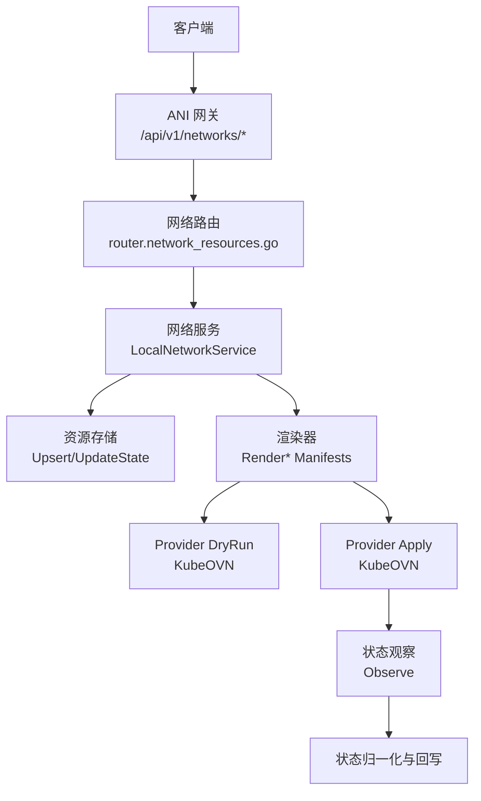
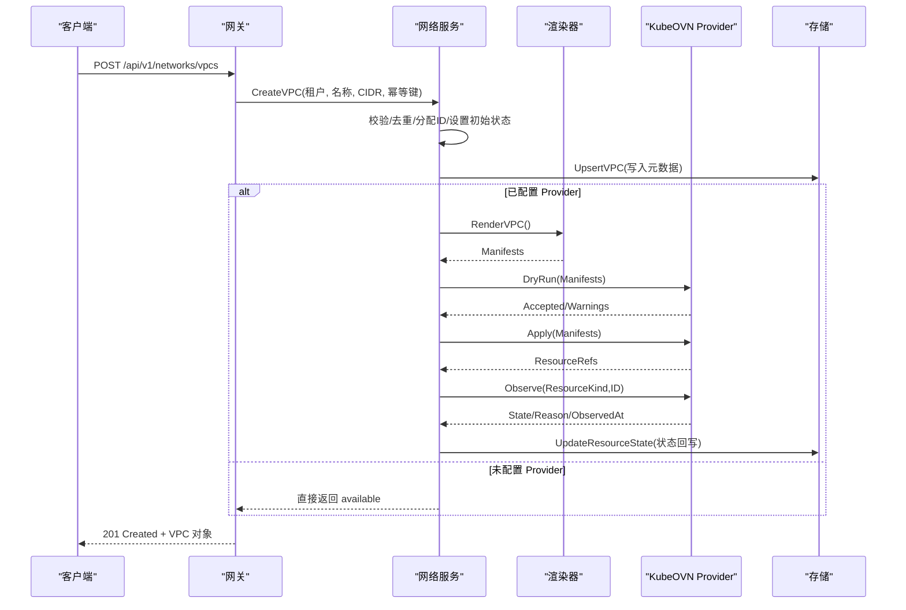
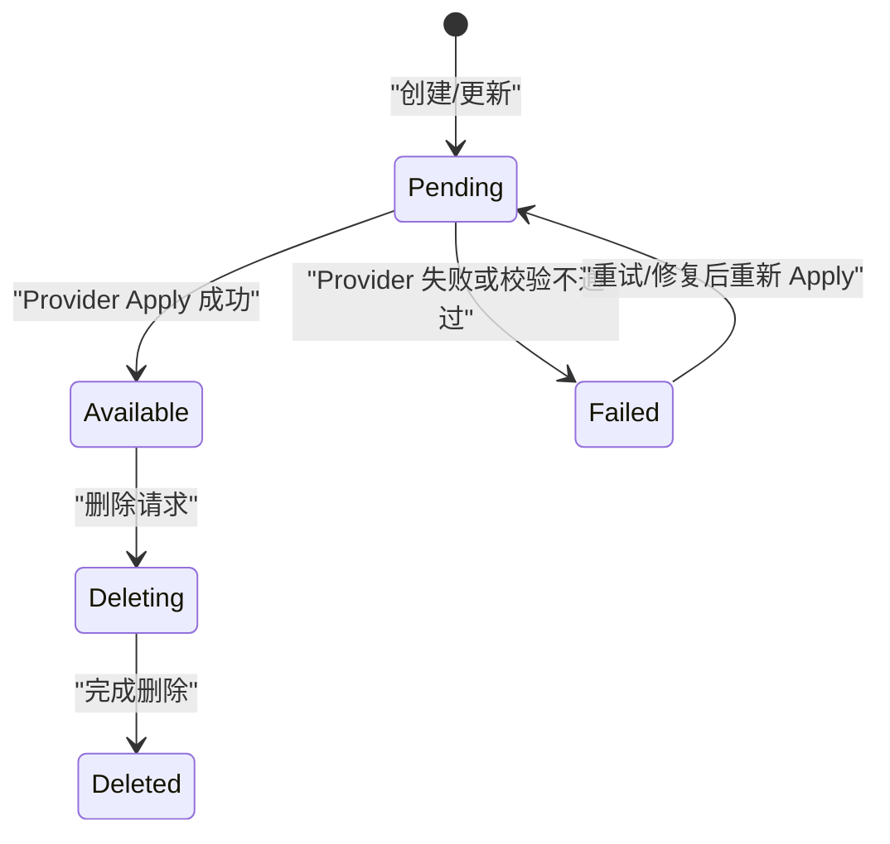
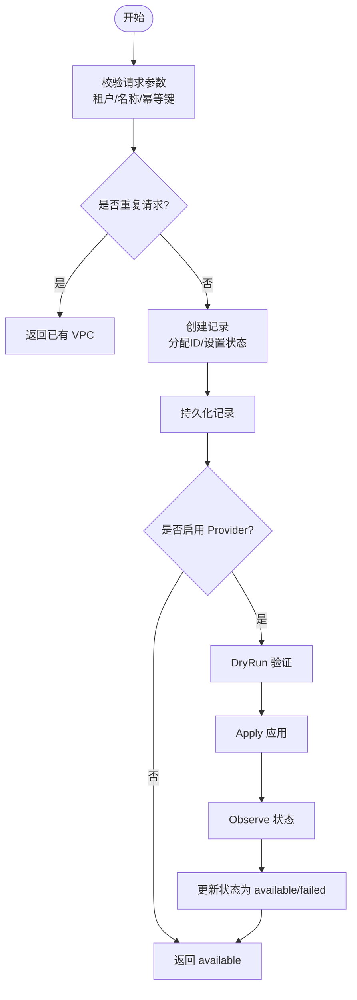
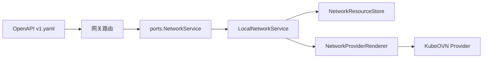

# VPC 管理 API

<cite>
**本文引用的文件**
- [v1.yaml](file://repo/api/openapi/v1.yaml)
- [network_resources.go](file://repo/services/ani-gateway/internal/router/network_resources.go)
- [network_resources.go（ports）](file://repo/pkg/ports/network_resources.go)
- [network_service.go](file://repo/pkg/adapters/runtime/network_service.go)
- [kubeovn_network_provider.go](file://repo/pkg/adapters/runtime/kubeovn_network_provider.go)
- [产品功能设计.md](file://ANI-02-产品功能设计.md)
</cite>

## 目录
1. [简介](#简介)
2. [项目结构](#项目结构)
3. [核心组件](#核心组件)
4. [架构总览](#架构总览)
5. [详细组件分析](#详细组件分析)
6. [依赖关系分析](#依赖关系分析)
7. [性能与一致性](#性能与一致性)
8. [故障诊断与排错](#故障诊断与排错)
9. [结论](#结论)
10. [附录：API 参考与示例](#附录api-参考与示例)

## 简介
本文件面向 ANI 平台的 VPC（虚拟私有云）管理 API，覆盖 VPC 的创建、查询、删除，子网划分、安全组、负载均衡、路由表等网络资源的全生命周期管理。平台基于 KubeOVN 实现 VPC 级租户网络隔离，并通过网关层暴露 RESTful API。文档同时说明多租户隔离机制、跨集群通信与 VPC 间网络连接能力、状态查询与运维接口，以及请求响应与错误处理规范。

## 项目结构
VPC 相关能力由以下层次组成：
- OpenAPI 契约：定义统一的 REST 路径、请求/响应结构与错误格式。
- 网关路由：将 HTTP 请求映射到内部服务调用。
- 领域服务：封装业务逻辑、幂等性、租户隔离、状态机与 Provider 编排。
- Provider 适配：对接底层网络能力（如 KubeOVN），支持 DryRun、Apply、状态观察。
- 持久化与存储：记录资源元数据与状态。

图表来源
- [network_resources.go:246-283](file://repo/services/ani-gateway/internal/router/network_resources.go#L246-L283)
- [network_service.go:111-163](file://repo/pkg/adapters/runtime/network_service.go#L111-L163)
- [kubeovn_network_provider.go:50-134](file://repo/pkg/adapters/runtime/kubeovn_network_provider.go#L50-L134)

章节来源
- [v1.yaml:1-39](file://repo/api/openapi/v1.yaml#L1-L39)
- [network_resources.go:246-283](file://repo/services/ani-gateway/internal/router/network_resources.go#L246-L283)

## 核心组件
- 网关路由层：注册 /api/v1/networks 下的所有资源端点，包括 VPC、子网、安全组、负载均衡、路由表与概览。
- 网络服务层：实现租户隔离、幂等创建、状态机流转、Provider 编排（DryRun/Apply/Observe）、资源关联校验。
- Provider 适配层：对接 KubeOVN，提供 DryRun 验证、Apply 应用、状态观察与结果规范化。
- 数据模型与端口：统一的数据结构定义，贯穿网关、服务与 Provider 之间。

章节来源
- [network_resources.go:246-283](file://repo/services/ani-gateway/internal/router/network_resources.go#L246-L283)
- [network_resources.go（ports）:314-350](file://repo/pkg/ports/network_resources.go#L314-L350)
- [kubeovn_network_provider.go:50-134](file://repo/pkg/adapters/runtime/kubeovn_network_provider.go#L50-L134)

## 架构总览
VPC 管理遵循“声明式 + 控制器”模式：
- 客户端通过 REST 提交资源意图（如创建 VPC）。
- 网关解析并调用网络服务。
- 网络服务进行参数校验、租户隔离、幂等控制，生成 Provider Manifest。
- Provider 先 DryRun 验证，再 Apply 实际创建，随后周期性 Observe 真实状态。
- 状态经 Reconcile 归一化为平台状态（pending/available/failed/deleting/deleted），并持久化。

图表来源
- [network_resources.go:294-311](file://repo/services/ani-gateway/internal/router/network_resources.go#L294-L311)
- [network_service.go:165-218](file://repo/pkg/adapters/runtime/network_service.go#L165-L218)
- [kubeovn_network_provider.go:50-134](file://repo/pkg/adapters/runtime/kubeovn_network_provider.go#L50-L134)

## 详细组件分析

### VPC 资源模型与状态机
- 资源字段：租户 ID、VPC ID、名称、CIDR、状态、原因、时间戳。
- 状态枚举：pending、available、failed、deleting、deleted。
- 默认行为：本地开发模式下直接可用；生产模式下进入 pending，等待 Provider 应用成功。

图表来源
- [network_resources.go（ports）:8-16](file://repo/pkg/ports/network_resources.go#L8-L16)
- [network_service.go:165-218](file://repo/pkg/adapters/runtime/network_service.go#L165-L218)

章节来源
- [network_resources.go（ports）:18-27](file://repo/pkg/ports/network_resources.go#L18-L27)
- [network_service.go:165-218](file://repo/pkg/adapters/runtime/network_service.go#L165-L218)

### VPC 创建流程（含幂等与租户隔离）
- 幂等键：同一租户下 24 小时内重复请求返回相同结果。
- 租户隔离：所有列表/获取操作按 tenant_id 过滤，禁止跨租户访问。
- CIDR 分配：若未指定则使用默认值；后续可结合子网与路由策略规划地址空间。

图表来源
- [network_service.go:165-218](file://repo/pkg/adapters/runtime/network_service.go#L165-L218)
- [kubeovn_network_provider.go:50-134](file://repo/pkg/adapters/runtime/kubeovn_network_provider.go#L50-L134)

章节来源
- [network_resources.go:294-311](file://repo/services/ani-gateway/internal/router/network_resources.go#L294-L311)
- [network_service.go:165-218](file://repo/pkg/adapters/runtime/network_service.go#L165-L218)

### 子网、安全组、负载均衡与路由表
- 子网：在 VPC 内划分更细粒度地址段，支持网关与可选可用区。
- 安全组：规则包含方向、协议、端口范围、CIDR、动作与优先级；支持绑定实例、网卡、负载均衡。
- 负载均衡：支持内外网方案与监听器映射。
- 路由表：支持网关、实例、NAT、local 路由类型；系统可能注入 local 路由，客户端不可创建。

章节来源
- [network_resources.go:348-420](file://repo/services/ani-gateway/internal/router/network_resources.go#L348-L420)
- [network_resources.go:422-735](file://repo/services/ani-gateway/internal/router/network_resources.go#L422-L735)
- [v1.yaml:3097-3135](file://repo/api/openapi/v1.yaml#L3097-L3135)

### 多租户隔离与跨集群通信
- 多租户隔离：所有网络资源按 tenant_id 隔离；列表/获取均强制租户上下文，避免越权。
- 跨集群通信：通过 VPC 与路由表组合实现跨集群互通；必要时借助 NAT 或网关路由转发。
- 网络平面：平台定义了租户业务、基础网格、存储、管理与公网入口等平面，便于策略隔离。

章节来源
- [network_resources.go:313-328](file://repo/services/ani-gateway/internal/router/network_resources.go#L313-L328)
- [product-design:209-246](file://ANI-02-产品功能设计.md#L209-L246)

### 状态查询与概览
- 概览接口：返回各资源类型的数量统计、能力清单、创建顺序、依赖关系与删除风险。
- 资源状态：通过 Provider 观察与 Reconcile 归一化，保证状态一致性与可观测性。

章节来源
- [network_service.go:111-163](file://repo/pkg/adapters/runtime/network_service.go#L111-L163)
- [network_resources.go:285-292](file://repo/services/ani-gateway/internal/router/network_resources.go#L285-L292)

## 依赖关系分析
- 网关依赖 ports 接口，屏蔽具体实现细节。
- 网络服务依赖存储与 Provider 适配器，解耦底层网络能力。
- Provider 适配器依赖 Kubernetes 客户端，执行 DryRun/Apply/Observe。
- OpenAPI 作为唯一契约，驱动 SDK 生成与兼容性校验。

图表来源
- [v1.yaml:1-39](file://repo/api/openapi/v1.yaml#L1-L39)
- [network_resources.go（ports）:314-350](file://repo/pkg/ports/network_resources.go#L314-L350)
- [network_service.go:15-38](file://repo/pkg/adapters/runtime/network_service.go#L15-L38)
- [kubeovn_network_provider.go:11-21](file://repo/pkg/adapters/runtime/kubeovn_network_provider.go#L11-L21)

章节来源
- [network_resources.go（ports）:352-484](file://repo/pkg/ports/network_resources.go#L352-L484)
- [kubeovn_network_provider.go:136-200](file://repo/pkg/adapters/runtime/kubeovn_network_provider.go#L136-L200)

## 性能与一致性
- 幂等性：通过 idempotency_key 在同一租户下 24 小时内去重，避免重复创建。
- 并发安全：服务层使用读写锁保护内存状态，确保高并发场景下的一致性。
- 状态收敛：Provider 状态观察与 Reconcile 定期归一化，减少不一致窗口。
- 分页与限流：列表接口支持 cursor 分页；建议客户端合理设置 limit 与重试退避。

章节来源
- [network_service.go:15-38](file://repo/pkg/adapters/runtime/network_service.go#L15-L38)
- [network_service.go:165-218](file://repo/pkg/adapters/runtime/network_service.go#L165-L218)
- [v1.yaml:24-38](file://repo/api/openapi/v1.yaml#L24-L38)

## 故障诊断与排错
- 常见错误码：UNAUTHORIZED、FORBIDDEN、NOT_FOUND、CONFLICT、BAD_REQUEST、RATE_LIMIT_EXCEEDED、NOT_IMPLEMENTED、INTERNAL_ERROR。
- 典型问题定位：
  - 创建失败：检查 DryRun 返回的 warnings/reason，确认权限与资源冲突。
  - 状态卡在 pending：查看 Provider Apply 是否被禁用或未配置；检查 Apply 日志与资源引用。
  - 跨租户访问：确认 JWT 中的 tenant_id 与请求上下文一致。
  - 路由异常：核对 destination_cidr 与 next_hop_type/next_hop_id 是否匹配。
- 排查步骤：
  - 调用概览接口了解当前资源状态与能力。
  - 查询具体资源详情与状态原因。
  - 检查安全组规则与绑定关系。
  - 查看路由表与关联资源依赖。

章节来源
- [v1.yaml:24-38](file://repo/api/openapi/v1.yaml#L24-L38)
- [network_service.go:111-163](file://repo/pkg/adapters/runtime/network_service.go#L111-L163)
- [kubeovn_network_provider.go:136-200](file://repo/pkg/adapters/runtime/kubeovn_network_provider.go#L136-L200)

## 结论
ANI 平台的 VPC 管理 API 提供了完整的网络资源生命周期管理能力，涵盖 VPC、子网、安全组、负载均衡与路由表。通过 KubeOVN Provider 实现底层网络能力的抽象与编排，支持 DryRun 验证、Apply 应用与状态观察。平台以 OpenAPI 为契约，保障前后端与 SDK 的一致性。多租户隔离、幂等性与状态收敛机制确保了系统的可靠性与可维护性。

## 附录：API 参考与示例

### 通用约定
- 认证：Bearer JWT 或 X-API-Key。
- 前缀：/api/v1。
- 错误格式：{ code, message, request_id, details? }。
- 分页：cursor 分页，返回 { items, total, next_cursor }。

章节来源
- [v1.yaml:24-38](file://repo/api/openapi/v1.yaml#L24-L38)

### VPC 资源
- 创建：POST /api/v1/networks/vpcs
  - 请求体：idempotency_key、name、cidr（可选，默认 10.0.0.0/16）。
  - 响应：201 Created，返回 NetworkVPC。
- 列表：GET /api/v1/networks/vpcs
  - 查询参数：name、state。
  - 响应：200 OK，返回 NetworkVPCListResponse。
- 获取：GET /api/v1/networks/vpcs/{vpc_id}
  - 响应：200 OK，返回 NetworkVPC。
- 删除：DELETE /api/v1/networks/vpcs/{vpc_id}
  - 响应：200 OK，返回 NetworkVPC。

章节来源
- [v1.yaml:2115-2133](file://repo/api/openapi/v1.yaml#L2115-L2133)
- [network_resources.go:294-346](file://repo/services/ani-gateway/internal/router/network_resources.go#L294-L346)

### 子网与安全组
- 子网：
  - 创建：POST /api/v1/networks/subnets（vpc_id、name、cidr、gateway、zone）。
  - 列表/获取/删除：对应 GET/PUT/DELETE。
- 安全组：
  - 创建：POST /api/v1/networks/security-groups（name、rules）。
  - 规则：支持 ingress/egress、tcp/udp/icmp/all、端口范围、CIDR、allow/deny、优先级。
  - 绑定：支持 instance、network_interface、load_balancer。

章节来源
- [network_resources.go:348-735](file://repo/services/ani-gateway/internal/router/network_resources.go#L348-L735)
- [v1.yaml:2016-2114](file://repo/api/openapi/v1.yaml#L2016-L2114)

### 负载均衡与路由
- 负载均衡：
  - 创建：POST /api/v1/networks/load-balancers（name、vpc_id、subnet_id、scheme、listeners）。
  - 监听器：protocol、port、target_port。
- 路由：
  - 创建：POST /api/v1/networks/routes（vpc_id、destination_cidr、next_hop_type、next_hop_id、priority、description）。
  - 路由类型：gateway、instance、nat、local（仅系统返回）。

章节来源
- [network_resources.go:622-735](file://repo/services/ani-gateway/internal/router/network_resources.go#L622-L735)
- [v1.yaml:3097-3135](file://repo/api/openapi/v1.yaml#L3097-L3135)

### 概览与能力
- 概览：GET /api/v1/networks/overview
  - 返回资源统计、能力清单、创建顺序、依赖关系与删除风险。

章节来源
- [network_resources.go:285-292](file://repo/services/ani-gateway/internal/router/network_resources.go#L285-L292)
- [network_service.go:111-163](file://repo/pkg/adapters/runtime/network_service.go#L111-L163)