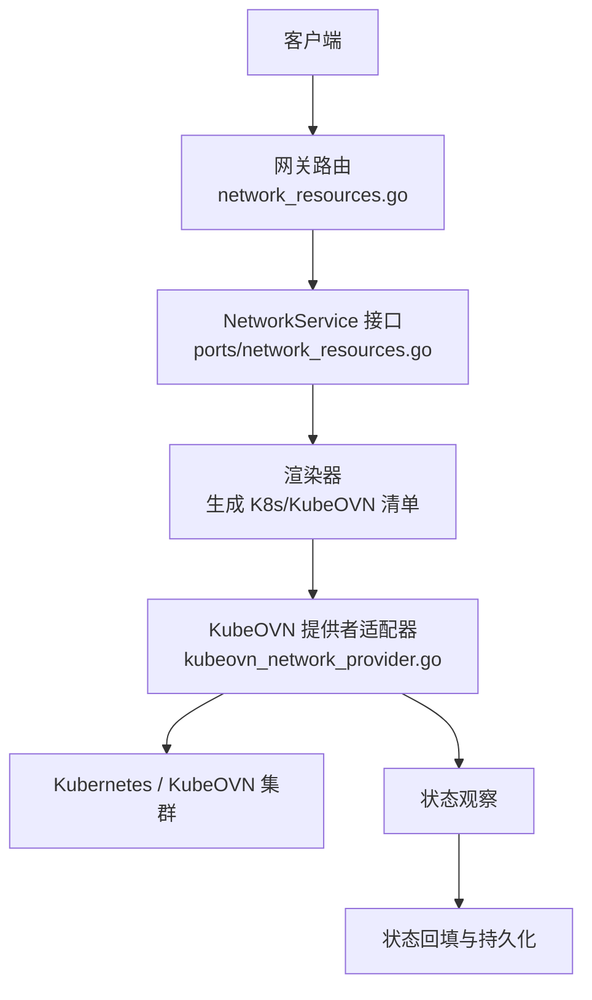
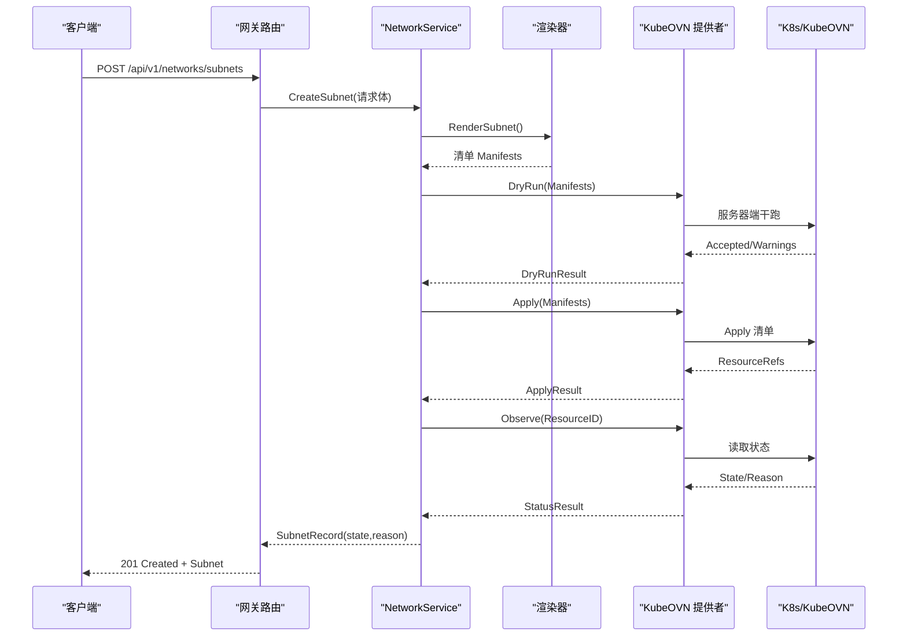
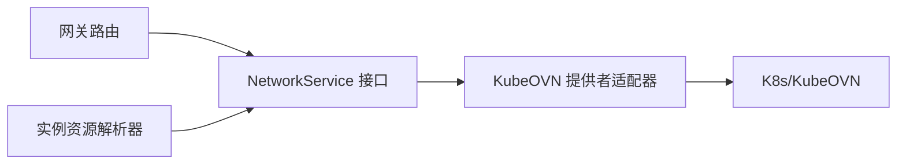

# 子网管理 API

<cite>
**本文引用的文件**
- [网络资源端口定义](file://repo/pkg/ports/network_resources.go)
- [网关网络路由实现](file://repo/services/ani-gateway/internal/router/network_resources.go)
- [OpenAPI 核心契约](file://repo/api/openapi/v1.yaml)
- [KubeOVN 网络提供者适配器](file://repo/pkg/adapters/runtime/kubeovn_network_provider.go)
- [本地网络服务测试（VPC/子网流程）](file://repo/pkg/adapters/runtime/network_service_test.go)
- [实例资源解析器（子网绑定校验）](file://repo/pkg/adapters/runtime/instance_resource_resolver.go)
- [开发记录：Sprint 3 网络能力](file://repo/development-records/README.md)
- [产品功能设计：网络层](file://ANI-02-产品功能设计.md)
</cite>

## 目录
1. [简介](#简介)
2. [项目结构](#项目结构)
3. [核心组件](#核心组件)
4. [架构总览](#架构总览)
5. [详细组件分析](#详细组件分析)
6. [依赖关系分析](#依赖关系分析)
7. [性能与可用性](#性能与可用性)
8. [故障排查指南](#故障排查指南)
9. [结论](#结论)
10. [附录](#附录)

## 简介
本文件面向 ANI 平台的“子网管理”能力，围绕子网的创建、配置、删除等接口进行系统化说明，覆盖以下主题：
- 子网 CIDR 规划与 IP 地址池管理
- 网关配置与 VPC 关联关系
- 子网间路由策略与安全组
- DHCP 相关能力的现状说明
- 子网状态监控、IP 使用率统计与网络连通性建议
- 模板化、批量操作与自动化部署实践示例

该文档以仓库中的 OpenAPI 契约、网关路由实现、端口定义与 KubeOVN 适配器为依据，确保内容与实际代码一致。

## 项目结构
子网管理涉及三层：
- 契约层：OpenAPI 定义请求/响应结构与路径
- 网关层：HTTP 路由与参数绑定，调用 NetworkService
- 适配层：通过 KubeOVN Provider 渲染并应用资源，再观察状态并回填

图表来源
- [网关网络路由实现:246-283](file://repo/services/ani-gateway/internal/router/network_resources.go#L246-L283)
- [网络资源端口定义:314-350](file://repo/pkg/ports/network_resources.go#L314-L350)
- [KubeOVN 网络提供者适配器:50-134](file://repo/pkg/adapters/runtime/kubeovn_network_provider.go#L50-L134)

章节来源
- [网关网络路由实现:246-283](file://repo/services/ani-gateway/internal/router/network_resources.go#L246-L283)
- [网络资源端口定义:314-350](file://repo/pkg/ports/network_resources.go#L314-L350)
- [KubeOVN 网络提供者适配器:50-134](file://repo/pkg/adapters/runtime/kubeovn_network_provider.go#L50-L134)

## 核心组件
- 网络资源端口定义：统一抽象 VPC、子网、安全组、负载均衡、路由等资源的数据模型、请求/响应类型与服务接口
- 网关路由：将 HTTP 请求映射到 NetworkService 方法，负责参数绑定、租户隔离、错误封装与响应转换
- KubeOVN 提供者适配器：对 KubeOVN 的干跑、应用与状态观察进行封装，提供执行开关与一致性校验
- 实例资源解析器：在创建实例时校验子网归属与状态，保证实例与子网/VPC 的一致性

章节来源
- [网络资源端口定义:18-40, 170-248, 314-350:18-40](file://repo/pkg/ports/network_resources.go#L18-L40)
- [网络资源端口定义:170-248](file://repo/pkg/ports/network_resources.go#L170-L248)
- [网络资源端口定义:314-350](file://repo/pkg/ports/network_resources.go#L314-L350)
- [网关网络路由实现:246-283](file://repo/services/ani-gateway/internal/router/network_resources.go#L246-L283)
- [KubeOVN 网络提供者适配器:50-134](file://repo/pkg/adapters/runtime/kubeovn_network_provider.go#L50-L134)
- [实例资源解析器（子网绑定校验）:301-312](file://repo/pkg/adapters/runtime/instance_resource_resolver.go#L301-L312)

## 架构总览
子网管理的端到端流程如下：
- 客户端通过 REST 调用创建/查询/删除子网
- 网关路由解析请求，调用 NetworkService
- 服务层渲染 KubeOVN 资源清单，先 DryRun 验证，再 Apply 实际创建
- 提供者适配器观察真实状态，状态回写至存储，对外暴露最新 state/reason
- 列表与详情接口返回标准化响应，包含 dev_profile 标记当前为本地/开发模式

图表来源
- [网关网络路由实现:348-367](file://repo/services/ani-gateway/internal/router/network_resources.go#L348-L367)
- [KubeOVN 网络提供者适配器:50-134](file://repo/pkg/adapters/runtime/kubeovn_network_provider.go#L50-L134)
- [网络资源端口定义:314-350](file://repo/pkg/ports/network_resources.go#L314-L350)

## 详细组件分析

### 子网生命周期接口
- 创建子网
  - 路径：POST /api/v1/networks/subnets
  - 请求关键字段：vpc_id、name、cidr、gateway（可选）、idempotency_key
  - 行为：创建后进入 pending → available；失败时 state=failed 且 reason 描述原因
- 列出子网
  - 路径：GET /api/v1/networks/subnets
  - 过滤：vpc_id、state
- 获取子网
  - 路径：GET /api/v1/networks/subnets/{subnet_id}
- 删除子网
  - 路径：DELETE /api/v1/networks/subnets/{subnet_id}
- 子网 IP 分配列表
  - 路径：GET /api/v1/networks/subnets/{subnet_id}/ip-allocations
  - 用途：查看子网内 IP 的分配情况，用于容量与使用率统计

章节来源
- [网关网络路由实现:255-259, 348-420:255-259](file://repo/services/ani-gateway/internal/router/network_resources.go#L255-L259)
- [网关网络路由实现:348-420](file://repo/services/ani-gateway/internal/router/network_resources.go#L348-L420)
- [OpenAPI 核心契约:2124-2134](file://repo/api/openapi/v1.yaml#L2124-L2134)
- [OpenAPI 核心契约:2016-2035](file://repo/api/openapi/v1.yaml#L2016-L2035)

### 子网数据模型与字段语义
- 子网记录包含：tenant_id、subnet_id、vpc_id、name、cidr、gateway、state、reason、时间戳
- 子网 IP 分配记录包含：subnet_id、ip_address、resource_type、resource_id、state、时间戳
- 资源状态枚举：pending、available、failed、deleting、deleted

章节来源
- [网络资源端口定义:29-40](file://repo/pkg/ports/network_resources.go#L29-L40)
- [网络资源端口定义:87-97](file://repo/pkg/ports/network_resources.go#L87-L97)
- [网络资源端口定义:8-16](file://repo/pkg/ports/network_resources.go#L8-L16)

### 子网与 VPC 的关联关系
- 创建子网必须指定 vpc_id，子网 CIDR 需属于对应 VPC 的 CIDR 范围
- 实例在创建时会校验其绑定的子网是否属于期望的 VPC，防止跨 VPC 误配
- 列表支持按 vpc_id 过滤，便于按 VPC 维度管理子网

章节来源
- [网关网络路由实现:348-367](file://repo/services/ani-gateway/internal/router/network_resources.go#L348-L367)
- [实例资源解析器（子网绑定校验）:301-312](file://repo/pkg/adapters/runtime/instance_resource_resolver.go#L301-L312)
- [OpenAPI 核心契约:2124-2134](file://repo/api/openapi/v1.yaml#L2124-L2134)

### 网关配置与路由策略
- 子网可配置 gateway（可选），由底层网络提供者决定具体实现
- 路由策略通过独立的路由资源管理：destination_cidr、next_hop_type（gateway/instance/nat/local）、next_hop_id、priority、description
- 系统可能返回 local 路由，客户端不得通过 create 创建 local 路由

章节来源
- [网关网络路由实现:680-735](file://repo/services/ani-gateway/internal/router/network_resources.go#L680-L735)
- [OpenAPI 核心契约:3097-3135](file://repo/api/openapi/v1.yaml#L3097-L3135)

### 安全组与访问控制
- 安全组规则支持方向（ingress/egress）、协议（tcp/udp/icmp/all）、端口范围、CIDR、动作（allow/deny）与优先级
- 安全组可绑定到实例、网络接口或负载均衡
- 子网通常与安全组配合，形成更细粒度的访问控制策略

章节来源
- [网关网络路由实现:422-620](file://repo/services/ani-gateway/internal/router/network_resources.go#L422-L620)
- [OpenAPI 核心契约:2037-2114](file://repo/api/openapi/v1.yaml#L2037-L2114)

### DHCP 服务配置说明
- 当前仓库未提供独立的 DHCP 配置接口；DHCP 行为由底层网络提供者（如 KubeOVN）管理
- 若需要自定义 DHCP 选项，应在平台侧通过 KubeOVN 能力或外部集成实现，不在 Core API 范围内

章节来源
- [网络资源端口定义:314-350](file://repo/pkg/ports/network_resources.go#L314-L350)
- [KubeOVN 网络提供者适配器:50-134](file://repo/pkg/adapters/runtime/kubeovn_network_provider.go#L50-L134)

### 子网状态监控与 IP 使用率统计
- 子网状态：通过 get/list 接口返回 state/reason，便于监控与告警
- IP 使用率：通过 ip-allocations 列表统计 allocated/reserved 数量，结合子网 CIDR 计算使用率
- 概览接口：GET /api/v1/networks/overview 提供资源汇总、能力、关系与删除风险，可用于仪表盘展示

章节来源
- [网关网络路由实现:285-292, 404-420:285-292](file://repo/services/ani-gateway/internal/router/network_resources.go#L285-L292)
- [网关网络路由实现:404-420](file://repo/services/ani-gateway/internal/router/network_resources.go#L404-L420)
- [OpenAPI 核心契约:2016-2035](file://repo/api/openapi/v1.yaml#L2016-L2035)

### 网络连通性测试建议
- 平台未提供直接的“ping/traceroute”类连通性测试接口
- 建议通过以下方式验证连通性：
  - 在子网内启动临时实例，利用实例观测接口获取网络指标（RX/TX 字节数）
  - 通过负载均衡监听流量变化判断可达性
  - 结合安全组规则与路由策略进行端到端验证

章节来源
- [产品功能设计：网络层:209-228](file://ANI-02-产品功能设计.md#L209-L228)

### 模板化、批量操作与自动化部署
- 模板化：可通过脚本或编排工具基于 OpenAPI 生成请求体，复用 vpc_id、cidr、gateway 等字段
- 批量操作：建议使用幂等键 idempotency_key 对多次重试或批量提交进行去重保护
- 自动化部署：结合 CI/CD 流水线，按环境注入不同 CIDR 与网关，调用子网/路由/安全组接口完成网络初始化

章节来源
- [OpenAPI 核心契约:2124-2134](file://repo/api/openapi/v1.yaml#L2124-L2134)
- [网关网络路由实现:348-367](file://repo/services/ani-gateway/internal/router/network_resources.go#L348-L367)

## 依赖关系分析
- 网关路由依赖 NetworkService 接口，屏蔽底层 provider 差异
- Provider 适配器负责与 KubeOVN 交互，提供 dry-run、apply、observe 三阶段能力
- 实例资源解析器在创建实例时校验子网归属，避免跨 VPC 误用
- 开发记录表明网络能力在 Sprint 3 已具备 VPC/Subnet/SecurityGroup/LB/Core API 契约与 provider 边界

图表来源
- [网关网络路由实现:246-283](file://repo/services/ani-gateway/internal/router/network_resources.go#L246-L283)
- [网络资源端口定义:314-350](file://repo/pkg/ports/network_resources.go#L314-L350)
- [KubeOVN 网络提供者适配器:50-134](file://repo/pkg/adapters/runtime/kubeovn_network_provider.go#L50-L134)
- [实例资源解析器（子网绑定校验）:301-312](file://repo/pkg/adapters/runtime/instance_resource_resolver.go#L301-L312)

章节来源
- [网关网络路由实现:246-283](file://repo/services/ani-gateway/internal/router/network_resources.go#L246-L283)
- [网络资源端口定义:314-350](file://repo/pkg/ports/network_resources.go#L314-L350)
- [KubeOVN 网络提供者适配器:50-134](file://repo/pkg/adapters/runtime/kubeovn_network_provider.go#L50-L134)
- [实例资源解析器（子网绑定校验）:301-312](file://repo/pkg/adapters/runtime/instance_resource_resolver.go#L301-L312)
- [开发记录：Sprint 3 网络能力:458-466](file://repo/development-records/README.md#L458-L466)

## 性能与可用性
- 幂等性：所有创建接口支持 idempotency_key，建议在批量或重试场景中使用
- 干跑优先：Provider 先 DryRun，减少无效 Apply 带来的开销与冲突
- 状态回填：Apply 后通过 Observe 拉取真实状态，保障最终一致性
- 默认关闭 Apply：生产环境可通过执行开关控制 Apply 启用，降低误操作风险

章节来源
- [KubeOVN 网络提供者适配器:72-104](file://repo/pkg/adapters/runtime/kubeovn_network_provider.go#L72-L104)
- [网络资源端口定义:376-418](file://repo/pkg/ports/network_resources.go#L376-L418)

## 故障排查指南
- 创建失败
  - 检查 CIDR 是否与 VPC CIDR 冲突或越界
  - 查看 state=failed 时的 reason 字段，定位具体错误原因
- 子网不可用
  - 确认 Provider 是否启用 Apply，以及 DryRun 是否通过
  - 检查 KubeOVN 资源是否成功创建，必要时查看集群事件
- 实例无法访问子网
  - 校验实例绑定的子网是否属于目标 VPC
  - 检查安全组规则与路由策略是否允许所需流量
- IP 使用率高
  - 通过 ip-allocations 列表统计 allocated/reserved 数量
  - 评估是否需要扩容子网或拆分 CIDR

章节来源
- [网关网络路由实现:348-420](file://repo/services/ani-gateway/internal/router/network_resources.go#L348-L420)
- [KubeOVN 网络提供者适配器:50-134](file://repo/pkg/adapters/runtime/kubeovn_network_provider.go#L50-L134)
- [实例资源解析器（子网绑定校验）:301-312](file://repo/pkg/adapters/runtime/instance_resource_resolver.go#L301-L312)

## 结论
子网管理 API 以 OpenAPI 契约为核心，通过网关路由与 NetworkService 抽象，结合 KubeOVN Provider 实现资源的渲染、应用与状态观察。当前版本聚焦于子网的基础生命周期、VPC 关联、路由策略与安全组能力；DHCP 由底层网络提供者管理，不在 Core API 范围。运维侧可通过状态接口与 IP 分配列表进行监控与容量管理，并通过幂等键与干跑机制提升可靠性与安全性。

## 附录
- 常用路径参考
  - 子网列表：GET /api/v1/networks/subnets
  - 创建子网：POST /api/v1/networks/subnets
  - 子网详情：GET /api/v1/networks/subnets/{subnet_id}
  - 删除子网：DELETE /api/v1/networks/subnets/{subnet_id}
  - 子网 IP 分配：GET /api/v1/networks/subnets/{subnet_id}/ip-allocations
  - 路由列表：GET /api/v1/networks/routes
  - 创建路由：POST /api/v1/networks/routes
  - 网络概览：GET /api/v1/networks/overview

章节来源
- [网关网络路由实现:246-283](file://repo/services/ani-gateway/internal/router/network_resources.go#L246-L283)
- [OpenAPI 核心契约:2124-2134](file://repo/api/openapi/v1.yaml#L2124-L2134)
- [OpenAPI 核心契约:3097-3135](file://repo/api/openapi/v1.yaml#L3097-L3135)