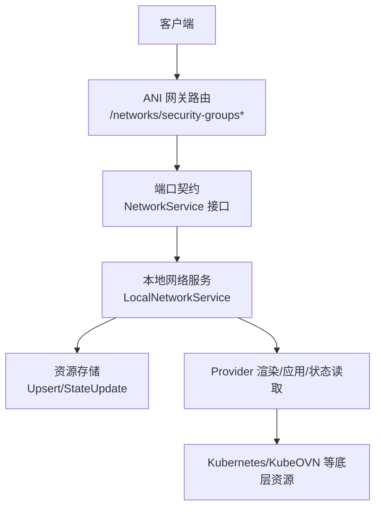
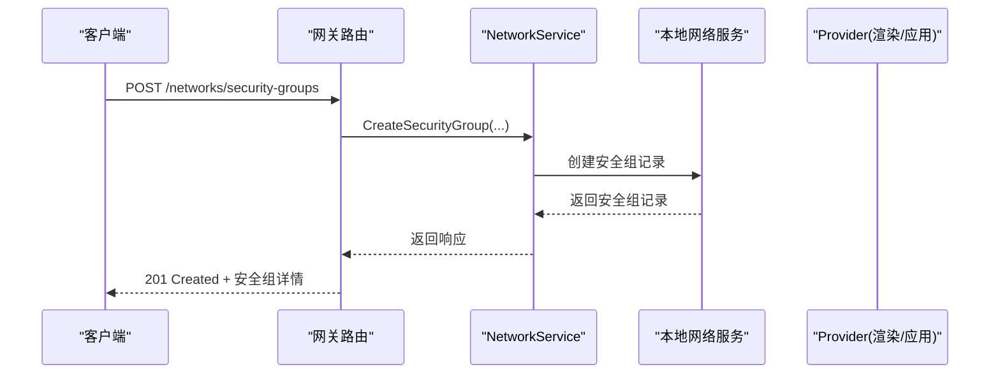
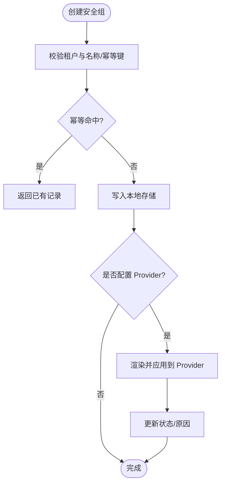
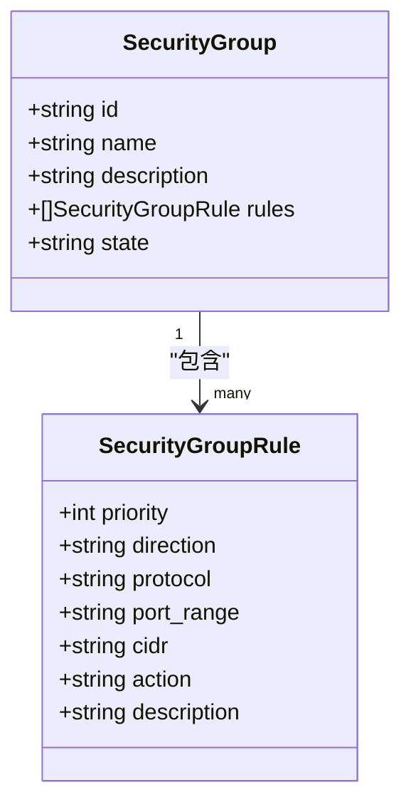
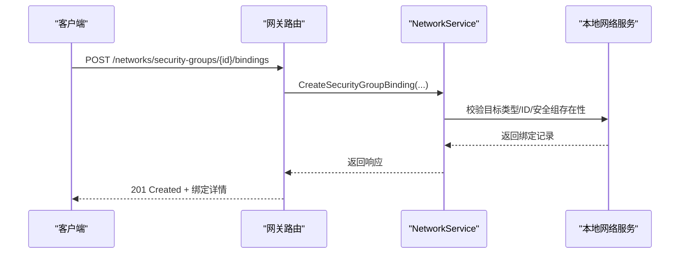
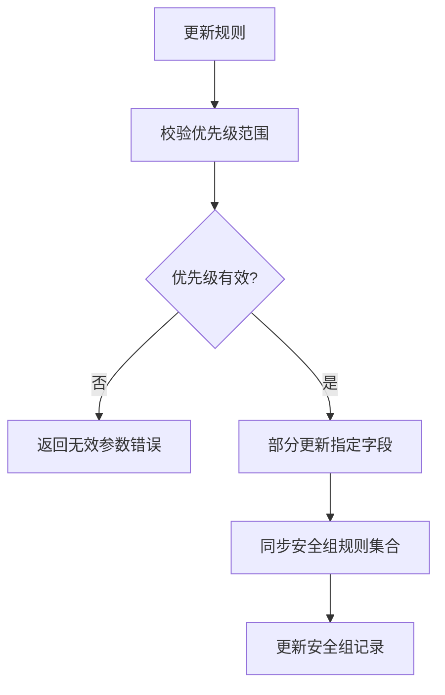
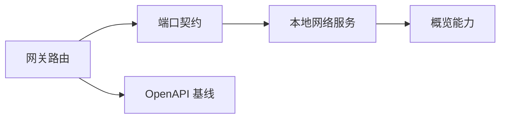

# 安全组管理 API

<cite>
**本文引用的文件**
- [network_resources.go](file://services/ani-gateway/internal/router/network_resources.go)
- [network_resources.go（端口定义）](file://pkg/ports/network_resources.go)
- [network_service.go（本地网络服务实现）](file://pkg/adapters/runtime/network_service.go)
- [network_resources_test.go（网关路由测试）](file://services/ani-gateway/internal/router/network_resources_test.go)
- [network_service_test.go（本地服务测试）](file://pkg/adapters/runtime/network_service_test.go)
- [core-v1-compatibility-baseline.yaml](file://repo/api/core-v1-compatibility-baseline.yaml)
- [instance_resource_resolver.go](file://pkg/adapters/runtime/instance_resource_resolver.go)
- [instance_service.go](file://pkg/adapters/runtime/instance_service.go)
</cite>

## 目录
1. [简介](#简介)
2. [项目结构](#项目结构)
3. [核心组件](#核心组件)
4. [架构总览](#架构总览)
5. [详细组件分析](#详细组件分析)
6. [依赖关系分析](#依赖关系分析)
7. [性能与一致性](#性能与一致性)
8. [故障排查指南](#故障排查指南)
9. [结论](#结论)
10. [附录：API 参考与最佳实践](#附录api-参考与最佳实践)

## 简介
本文件面向“安全组管理”能力，覆盖以下目标：
- 安全组的创建、查询、删除
- 规则配置：入站/出站流量控制、协议与端口范围、IP 白名单（CIDR）、动作（允许/拒绝）
- 安全组与实例的绑定关系、规则优先级、规则冲突检测机制
- 批量规则管理与合规检查思路
- 常见网络安全场景的配置示例与最佳实践

说明：当前仓库实现了安全组及其规则的完整生命周期、安全组与目标的绑定能力；模板化与批量操作通过现有接口组合实现。合规检查可通过 DryRun/Apply 流程与策略校验扩展。

## 项目结构
与安全组相关的代码主要分布在三层：
- 网关路由层：暴露 HTTP 接口，负责请求解析与响应封装
- 端口契约层：定义数据模型与服务接口
- 运行时适配器层：提供本地内存实现与 Provider 编排（渲染、应用、状态观测、重试等）

图表来源
- [network_resources.go:246-283](file://services/ani-gateway/internal/router/network_resources.go#L246-L283)
- [network_resources.go（端口定义）:314-350](file://pkg/ports/network_resources.go#L314-L350)
- [network_service.go（本地网络服务实现）:111-163](file://pkg/adapters/runtime/network_service.go#L111-L163)

章节来源
- [network_resources.go:246-283](file://services/ani-gateway/internal/router/network_resources.go#L246-L283)
- [network_resources.go（端口定义）:314-350](file://pkg/ports/network_resources.go#L314-L350)

## 核心组件
- 安全组资源对象：包含名称、描述、规则列表、状态、时间戳等
- 安全组规则对象：包含优先级、方向、协议、端口范围、CIDR、动作、描述
- 安全组绑定对象：将安全组与目标（实例、网卡、负载均衡器）进行关联
- 网络服务接口：提供安全组及规则的 CRUD、绑定管理、概览能力
- 网关路由：将 HTTP 请求映射到服务接口，并返回统一响应格式

章节来源
- [network_resources.go（端口定义）:99-133](file://pkg/ports/network_resources.go#L99-L133)
- [network_resources.go（端口定义）:250-339](file://pkg/ports/network_resources.go#L250-L339)
- [network_resources.go:126-137](file://services/ani-gateway/internal/router/network_resources.go#L126-L137)
- [network_resources.go:213-233](file://services/ani-gateway/internal/router/network_resources.go#L213-L233)

## 架构总览
安全组管理的调用链路如下：
- 客户端发起 HTTP 请求到网关路由
- 网关路由解析参数并调用 NetworkService 对应方法
- 本地网络服务执行校验、持久化、同步安全组规则、可选触发 Provider 渲染与应用
- 返回结构化响应，包含资源标识、状态、时间戳与开发调试信息

图表来源
- [network_resources.go:422-440](file://services/ani-gateway/internal/router/network_resources.go#L422-L440)
- [network_resources.go（端口定义）:328-331](file://pkg/ports/network_resources.go#L328-L331)
- [network_service.go（本地网络服务实现）:165-218](file://pkg/adapters/runtime/network_service.go#L165-L218)

## 详细组件分析

### 安全组生命周期
- 创建：支持传入名称、描述、初始规则列表；支持幂等键
- 查询：按名称、状态过滤；支持获取单个安全组
- 删除：标记为已删除并清理相关资源引用

图表来源
- [network_resources.go:422-440](file://services/ani-gateway/internal/router/network_resources.go#L422-L440)
- [network_service.go（本地网络服务实现）:165-218](file://pkg/adapters/runtime/network_service.go#L165-L218)

章节来源
- [network_resources.go:422-475](file://services/ani-gateway/internal/router/network_resources.go#L422-L475)
- [network_resources.go（端口定义）:186-192](file://pkg/ports/network_resources.go#L186-L192)

### 规则配置与管理
- 字段：优先级、方向（入站/出站）、协议、端口范围、CIDR、动作（允许/拒绝）、描述
- 优先级：支持 1-32766 范围校验；更新时仅变更指定字段，保留其他字段
- 父级约束：规则必须属于同一安全组；跨安全组访问会被拒绝
- 列表/获取/更新/删除：均受租户隔离与父级安全组校验保护

图表来源
- [network_resources.go（端口定义）:42-49](file://pkg/ports/network_resources.go#L42-L49)
- [network_resources.go（端口定义）:123-133](file://pkg/ports/network_resources.go#L123-L133)

章节来源
- [network_resources.go:495-569](file://services/ani-gateway/internal/router/network_resources.go#L495-L569)
- [network_service.go（本地网络服务实现）:600-661](file://pkg/adapters/runtime/network_service.go#L600-L661)
- [network_service_test.go:334-399](file://pkg/adapters/runtime/network_service_test.go#L334-L399)

### 安全组与实例绑定
- 绑定目标类型：实例、网络接口、负载均衡器
- 绑定创建：支持幂等键；目标类型与 ID 必填；安全组存在性校验
- 绑定查询/删除：按安全组、目标类型、目标 ID 过滤；删除需匹配租户与安全组

图表来源
- [network_resources.go:589-620](file://services/ani-gateway/internal/router/network_resources.go#L589-L620)
- [network_service.go（本地网络服务实现）:686-719](file://pkg/adapters/runtime/network_service.go#L686-L719)

章节来源
- [network_resources.go:571-620](file://services/ani-gateway/internal/router/network_resources.go#L571-L620)
- [network_service.go（本地网络服务实现）:663-733](file://pkg/adapters/runtime/network_service.go#L663-L733)

### 规则优先级与冲突检测
- 优先级：在创建/更新时校验范围；更新时仅修改指定字段，其余字段保持不变
- 父级不一致检测：当以错误的安全组上下文访问规则时，会返回未找到错误，避免越权
- 冲突检测：当前实现未内置跨规则语义冲突检测（如相同 CIDR+端口同时 allow/deny），但可通过上层策略或 DryRun/Apply 阶段进行校验

图表来源
- [network_service.go（本地网络服务实现）:600-641](file://pkg/adapters/runtime/network_service.go#L600-L641)

章节来源
- [network_service_test.go:334-399](file://pkg/adapters/runtime/network_service_test.go#L334-L399)

### 安全组与实例的关系
- 实例侧可引用安全组；在解析实例资源时会校验安全组状态与引用关系
- 若安全组不可用或与实例不兼容，会在解析阶段报错
- 实例服务中涉及安全组变更的字段集与日志摘要，便于审计与排障

章节来源
- [instance_resource_resolver.go:321-326](file://pkg/adapters/runtime/instance_resource_resolver.go#L321-L326)
- [instance_service.go:1227-1230](file://pkg/adapters/runtime/instance_service.go#L1227-L1230)
- [instance_service.go:1298-1314](file://pkg/adapters/runtime/instance_service.go#L1298-L1314)
- [instance_service.go:1524-1527](file://pkg/adapters/runtime/instance_service.go#L1524-L1527)

## 依赖关系分析
- 网关路由依赖端口契约定义的 NetworkService 接口
- 本地网络服务实现该接口，维护内存中的 VPC、子网、安全组、负载均衡、路由等资源
- 概览能力暴露安全组规则与绑定的能力项，以及资源间的关系与删除风险
- OpenAPI 基线定义了安全组相关端点的兼容性基线

图表来源
- [network_resources.go:246-283](file://services/ani-gateway/internal/router/network_resources.go#L246-L283)
- [network_service.go（本地网络服务实现）:111-163](file://pkg/adapters/runtime/network_service.go#L111-L163)
- [core-v1-compatibility-baseline.yaml:2729-2876](file://repo/api/core-v1-compatibility-baseline.yaml#L2729-L2876)

章节来源
- [core-v1-compatibility-baseline.yaml:2729-2876](file://repo/api/core-v1-compatibility-baseline.yaml#L2729-L2876)

## 性能与一致性
- 幂等性：所有写操作支持幂等键，避免重复提交导致的状态不一致
- 并发安全：本地服务使用读写锁保护共享数据结构
- 状态机：资源具备 pending/available/failed/deleting/deleted 状态，便于观察与恢复
- 提供者模式：当配置 Provider 时，创建后进入 pending，由 Provider 渲染与应用后更新状态

章节来源
- [network_service.go（本地网络服务实现）:165-218](file://pkg/adapters/runtime/network_service.go#L165-L218)
- [network_resources.go（端口定义）:8-16](file://pkg/ports/network_resources.go#L8-L16)

## 故障排查指南
- 规则父级不一致：尝试以错误的安全组上下文访问规则会返回未找到错误，确认请求路径与安全组 ID 正确
- 优先级非法：超出 1-32766 范围会返回无效参数错误，调整优先级后重试
- 绑定目标不支持：目标类型必须是实例、网络接口或负载均衡器，否则返回无效参数错误
- 安全组不存在：绑定或规则操作前需确保安全组存在且未被删除

章节来源
- [network_service_test.go:334-399](file://pkg/adapters/runtime/network_service_test.go#L334-L399)
- [network_service.go（本地网络服务实现）:686-719](file://pkg/adapters/runtime/network_service.go#L686-L719)

## 结论
本仓库提供了完整的安全组与规则管理能力，包括创建、查询、删除、规则优先级与字段级更新、安全组与目标的绑定、以及基于 Provider 的渲染与应用流程。对于模板化与批量规则管理，可通过现有接口组合实现；合规检查可在 DryRun/Apply 阶段引入策略校验。建议在生产环境中结合 Provider 能力与策略引擎，完善冲突检测与合规审计。

## 附录：API 参考与最佳实践

### 安全组 API 清单
- 列表/创建/获取/删除安全组
  - GET /networks/security-groups
  - POST /networks/security-groups
  - GET /networks/security-groups/:security_group_id
  - DELETE /networks/security-groups/:security_group_id
- 规则管理
  - GET /networks/security-groups/:security_group_id/rules
  - POST /networks/security-groups/:security_group_id/rules
  - GET /networks/security-groups/:security_group_id/rules/:rule_id
  - PUT /networks/security-groups/:security_group_id/rules/:rule_id
  - DELETE /networks/security-groups/:security_group_id/rules/:rule_id
- 绑定管理
  - GET /networks/security-groups/:security_group_id/bindings
  - POST /networks/security-groups/:security_group_id/bindings
  - DELETE /networks/security-groups/:security_group_id/bindings/:binding_id

章节来源
- [network_resources.go:261-272](file://services/ani-gateway/internal/router/network_resources.go#L261-L272)
- [core-v1-compatibility-baseline.yaml:2729-2876](file://repo/api/core-v1-compatibility-baseline.yaml#L2729-L2876)

### 规则字段与含义
- 方向：ingress（入站）/egress（出站）
- 协议：tcp/udp/icmp 等
- 端口范围：单端口或范围，例如 443 或 8000-9000
- CIDR：IP 白名单/黑名单，例如 0.0.0.0/0 或 10.0.0.0/8
- 动作：allow（允许）/deny（拒绝）
- 优先级：1-32766，越小越先匹配（具体排序策略以 Provider 为准）

章节来源
- [network_resources.go（端口定义）:42-49](file://pkg/ports/network_resources.go#L42-L49)
- [network_service.go（本地网络服务实现）:600-641](file://pkg/adapters/runtime/network_service.go#L600-L641)

### 绑定目标类型
- instance：实例
- network_interface：网络接口
- load_balancer：负载均衡器

章节来源
- [network_service.go（本地网络服务实现）:686-719](file://pkg/adapters/runtime/network_service.go#L686-L719)

### 常见网络安全场景与最佳实践
- Web 服务器对外暴露 HTTPS
  - 入站 TCP 443 允许来自 0.0.0.0/0
  - 出站允许访问后端数据库端口（如 3306）至数据库 CIDR
- 数据库内网访问
  - 入站仅允许应用 CIDR 访问数据库端口
  - 出站限制为必要服务（如备份、监控）
- 最小权限原则
  - 优先使用精确 CIDR 而非 0.0.0.0/0
  - 明确区分入站与出站，默认拒绝未知流量
- 多环境隔离
  - 不同环境使用不同安全组，避免规则交叉
  - 通过绑定将安全组与实例解耦，便于复用与迁移
- 合规与审计
  - 使用幂等键保证操作可重放
  - 结合 Provider DryRun/Apply 进行策略预检与审计

[本节为概念性指导，无需源码引用]