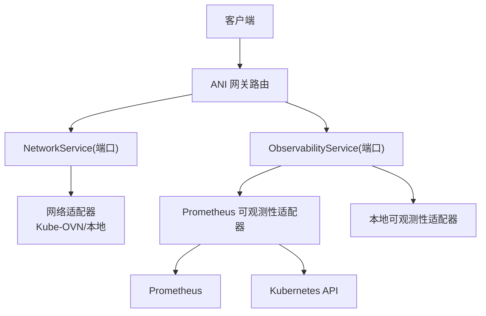
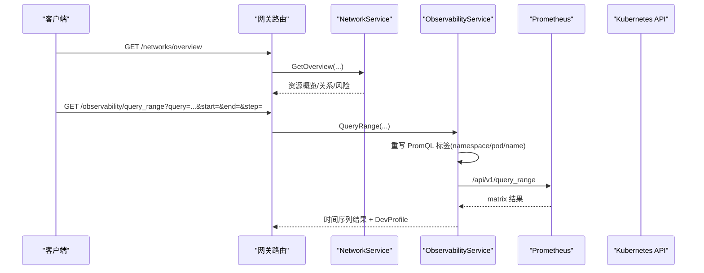
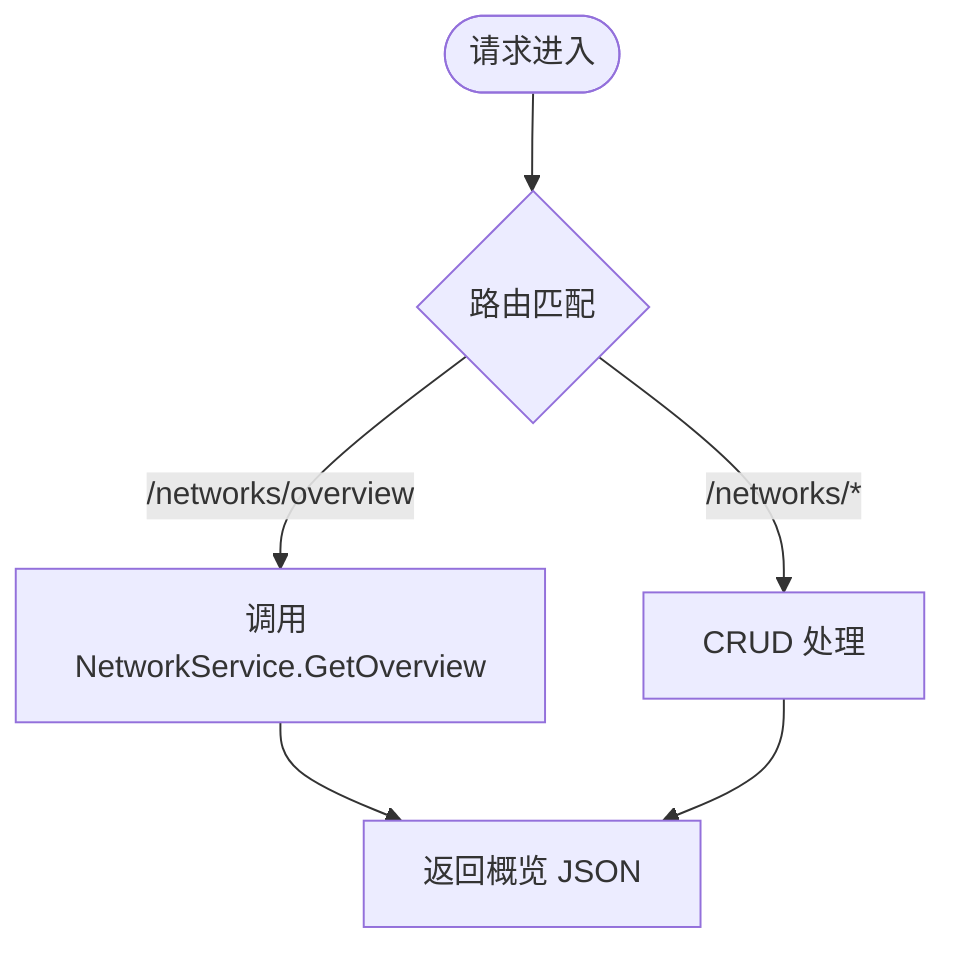
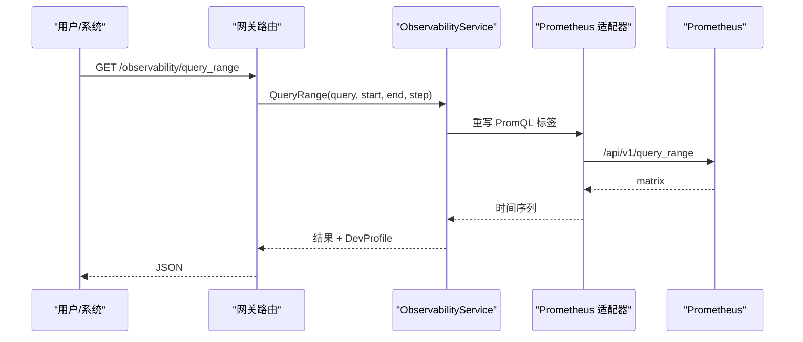
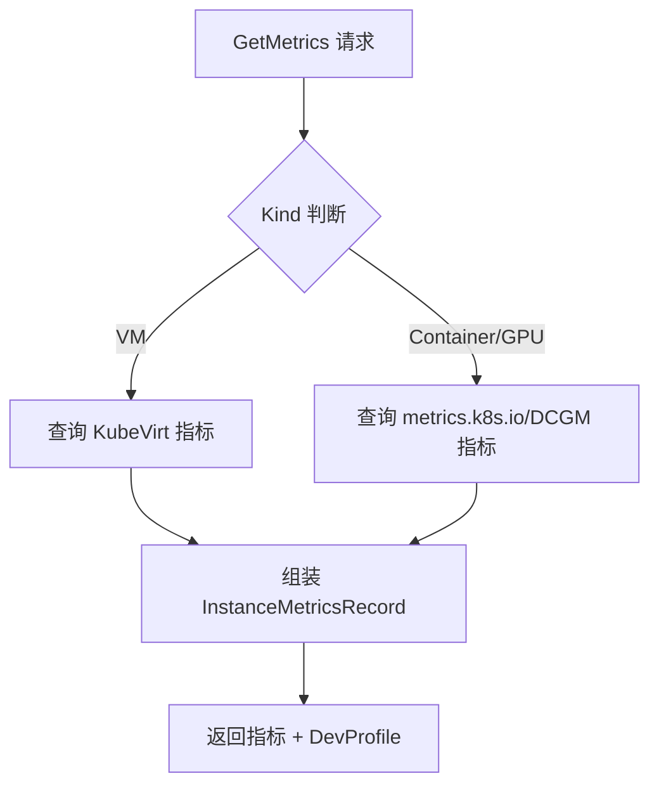

# 网络监控 API

<cite>
**本文引用的文件**
- [network_resources.go](file://repo/services/ani-gateway/internal/router/network_resources.go)
- [network_resources.go](file://repo/pkg/ports/network_resources.go)
- [observability.go](file://repo/services/ani-gateway/internal/router/observability.go)
- [observability.go](file://repo/pkg/ports/observability.go)
- [prometheus_observability_service.go](file://repo/pkg/adapters/runtime/prometheus_observability_service.go)
- [prometheus_instance_observability.go](file://repo/pkg/adapters/runtime/prometheus_instance_observability.go)
</cite>

## 目录
1. [简介](#简介)
2. [项目结构](#项目结构)
3. [核心组件](#核心组件)
4. [架构总览](#架构总览)
5. [详细组件分析](#详细组件分析)
6. [依赖关系分析](#依赖关系分析)
7. [性能与可用性](#性能与可用性)
8. [故障排查指南](#故障排查指南)
9. [结论](#结论)
10. [附录：API 参考](#附录api-参考)

## 简介
本文件面向“网络监控 API”，聚焦以下能力：
- 网络资源拓扑与状态：VPC、子网、安全组、负载均衡器、路由等资源的创建、查询、删除与概览。
- 实例可观测性：指标（CPU/内存/网络）、日志、事件、告警规则，支持 Prometheus 代理与本地降级。
- 运维能力：告警规则 CRUD、阈值与持续时间配置、结果类型与 DevProfile 标识真实/降级来源。
- 诊断与排障：通过概览接口、关系图、删除风险、IP 分配列表辅助定位瓶颈；结合指标与事件进行问题定位。

## 项目结构
本项目采用网关路由层 + 端口接口 + 适配器实现的三层结构：
- 网关路由层：暴露 HTTP 接口，负责参数校验、租户上下文注入、错误码统一。
- 端口接口层：定义服务契约（如 NetworkService、ObservabilityService），屏蔽底层实现差异。
- 适配器实现层：对接具体后端（Prometheus、Kubernetes API、本地模拟等）。



图表来源
- [network_resources.go:246-283](file://repo/services/ani-gateway/internal/router/network_resources.go#L246-L283)
- [observability.go:95-104](file://repo/services/ani-gateway/internal/router/observability.go#L95-L104)
- [prometheus_observability_service.go:18-77](file://repo/pkg/adapters/runtime/prometheus_observability_service.go#L18-L77)
- [prometheus_instance_observability.go:19-86](file://repo/pkg/adapters/runtime/prometheus_instance_observability.go#L19-L86)

章节来源
- [network_resources.go:246-283](file://repo/services/ani-gateway/internal/router/network_resources.go#L246-L283)
- [observability.go:95-104](file://repo/services/ani-gateway/internal/router/observability.go#L95-L104)

## 核心组件
- 网络资源服务（NetworkService）
  - 提供 VPC、子网、安全组、负载均衡器、路由的 CRUD 与概览能力。
  - 返回资源状态、原因、DevProfile 等信息，便于区分本地/真实提供者。
- 可观测性服务（ObservabilityService）
  - 提供指标区间查询、瞬时查询、告警规则管理。
  - Prometheus 适配器会重写 PromQL 中的 namespace/pod/name 标签，转发到真实 Prometheus，并返回 DevProfile 标记真实/降级来源。
- 实例可观测性（Instance Observability）
  - 采集 CPU/内存/网络 RX/TX、GPU 利用率与显存、VM 指标（KubeVirt）。
  - 支持日志持久化存储（如 Loki）或回退到 Kubernetes Pod 日志 API。
  - 事件与安全事件（Warning）过滤与分页。

章节来源
- [network_resources.go:16-244](file://repo/services/ani-gateway/internal/router/network_resources.go#L16-L244)
- [observability.go:135-143](file://repo/pkg/ports/observability.go#L135-L143)
- [prometheus_observability_service.go:18-77](file://repo/pkg/adapters/runtime/prometheus_observability_service.go#L18-L77)
- [prometheus_instance_observability.go:155-324](file://repo/pkg/adapters/runtime/prometheus_instance_observability.go#L155-L324)

## 架构总览
下图展示了从请求到数据源的完整链路，包括网络资源与可观测性两条主线。



图表来源
- [network_resources.go:285-292](file://repo/services/ani-gateway/internal/router/network_resources.go#L285-L292)
- [observability.go:118-154](file://repo/services/ani-gateway/internal/router/observability.go#L118-L154)
- [prometheus_observability_service.go:142-176](file://repo/pkg/adapters/runtime/prometheus_observability_service.go#L142-L176)
- [prometheus_observability_service.go:178-240](file://repo/pkg/adapters/runtime/prometheus_observability_service.go#L178-L240)

## 详细组件分析

### 网络资源 API（拓扑与连接数基础）
- 概览接口
  - 路径：GET /networks/overview
  - 作用：聚合资源数量、能力状态、创建顺序、资源关系与删除风险，用于拓扑可视化与瓶颈识别。
- 资源管理
  - VPC/子网/安全组/负载均衡器/路由：均提供 create/list/get/delete。
  - 子网 IP 分配：list 子网下的 IP 分配记录，辅助容量规划与地址使用率分析。
- 响应特征
  - 每个资源包含 state/reason/dev_profile，便于前端展示状态与来源。



图表来源
- [network_resources.go:246-283](file://repo/services/ani-gateway/internal/router/network_resources.go#L246-L283)
- [network_resources.go:285-292](file://repo/services/ani-gateway/internal/router/network_resources.go#L285-L292)

章节来源
- [network_resources.go:246-283](file://repo/services/ani-gateway/internal/router/network_resources.go#L246-L283)
- [network_resources.go:285-292](file://repo/services/ani-gateway/internal/router/network_resources.go#L285-L292)
- [network_resources.go:404-420](file://repo/services/ani-gateway/internal/router/network_resources.go#L404-L420)

### 可观测性 API（指标、延迟、丢包、带宽）
- 瞬时查询
  - 路径：GET /observability/query
  - 用途：获取单点指标值（例如当前带宽、延迟采样）。
- 区间查询
  - 路径：GET /observability/query_range
  - 用途：绘制时序曲线，计算带宽趋势、延迟分布、丢包率变化。
- 告警规则
  - 路径：/observability/alert-rules
  - 能力：create/list/get/update/delete，支持 duration/severity/labels/annotations/enabled。



图表来源
- [observability.go:118-154](file://repo/services/ani-gateway/internal/router/observability.go#L118-L154)
- [prometheus_observability_service.go:142-176](file://repo/pkg/adapters/runtime/prometheus_observability_service.go#L142-L176)
- [prometheus_observability_service.go:178-240](file://repo/pkg/adapters/runtime/prometheus_observability_service.go#L178-L240)

章节来源
- [observability.go:95-104](file://repo/services/ani-gateway/internal/router/observability.go#L95-L104)
- [observability.go:118-154](file://repo/services/ani-gateway/internal/router/observability.go#L118-L154)
- [observability.go:156-254](file://repo/services/ani-gateway/internal/router/observability.go#L156-L254)
- [observability.go:256-348](file://repo/services/ani-gateway/internal/router/observability.go#L256-L348)
- [prometheus_observability_service.go:18-77](file://repo/pkg/adapters/runtime/prometheus_observability_service.go#L18-L77)
- [prometheus_observability_service.go:142-176](file://repo/pkg/adapters/runtime/prometheus_observability_service.go#L142-L176)
- [prometheus_observability_service.go:178-240](file://repo/pkg/adapters/runtime/prometheus_observability_service.go#L178-L240)

### 实例可观测性（网络流量统计、连接质量）
- 指标采集
  - 容器/批处理：CPU 利用率、内存已用/总量、网络 RX/TX 字节数。
  - GPU 容器：GPU 利用率、显存 used/total（DCGM exporter）。
  - VM（KubeVirt）：CPU 利用率、内存 domain/usable 计算已用、网络 RX/TX。
- 日志与事件
  - 日志：优先走持久化存储（如 Loki），否则回退到 Kubernetes Pod 日志 API。
  - 事件：读取 Kubernetes Events，过滤 Warning 作为安全事件。
- 会话
  - Exec/Console 会话创建，支持幂等键与过期时间。



图表来源
- [prometheus_instance_observability.go:155-324](file://repo/pkg/adapters/runtime/prometheus_instance_observability.go#L155-L324)
- [prometheus_instance_observability.go:253-324](file://repo/pkg/adapters/runtime/prometheus_instance_observability.go#L253-L324)

章节来源
- [prometheus_instance_observability.go:155-324](file://repo/pkg/adapters/runtime/prometheus_instance_observability.go#L155-L324)
- [prometheus_instance_observability.go:88-140](file://repo/pkg/adapters/runtime/prometheus_instance_observability.go#L88-L140)
- [prometheus_instance_observability.go:350-376](file://repo/pkg/adapters/runtime/prometheus_instance_observability.go#L350-L376)

## 依赖关系分析
- 网关路由依赖端口接口，不直接耦合适配器实现。
- Prometheus 可观测性适配器依赖实例查找（InstanceLookup）以重写 PromQL 标签，确保租户隔离与精确匹配。
- 实例可观测性适配器依赖 Prometheus 与 Kubernetes API，具备多 exporter 降级策略（任一不可用不影响其他字段）。

```mermaid
classDiagram
class NetworkService {
+GetOverview()
+Create/Delete/List/Get(...)
}
class ObservabilityService {
+Query()
+QueryRange()
+AlertRule CRUD()
}
class PrometheusObservabilityService {
-prometheusURL
-instanceLookup
+QueryRange()
+rewritePromQLLabels()
}
class PrometheusInstanceObservability {
-prometheusURL
-kubeClient
+GetMetrics()
+ListLogs()
+ListEvents()
}
ObservabilityService <|.. PrometheusObservabilityService
NetworkService <.. "网关路由"
PrometheusObservabilityService --> "实例查找" : 重写标签
PrometheusInstanceObservability --> "Prometheus/K8s" : 采集指标
```

图表来源
- [network_resources.go:314-350](file://repo/pkg/ports/network_resources.go#L314-L350)
- [observability.go:135-143](file://repo/pkg/ports/observability.go#L135-L143)
- [prometheus_observability_service.go:18-77](file://repo/pkg/adapters/runtime/prometheus_observability_service.go#L18-L77)
- [prometheus_instance_observability.go:19-86](file://repo/pkg/adapters/runtime/prometheus_instance_observability.go#L19-L86)

章节来源
- [network_resources.go:314-350](file://repo/pkg/ports/network_resources.go#L314-L350)
- [observability.go:135-143](file://repo/pkg/ports/observability.go#L135-L143)
- [prometheus_observability_service.go:18-77](file://repo/pkg/adapters/runtime/prometheus_observability_service.go#L18-L77)
- [prometheus_instance_observability.go:19-86](file://repo/pkg/adapters/runtime/prometheus_instance_observability.go#L19-L86)

## 性能与可用性
- 多 exporter 降级：单个指标源不可用时，其他指标仍可返回，避免整体失败。
- 超时与限流：适配器支持每调用超时；网关中间件支持限流与幂等重放（与可观测性无关但影响整体稳定性）。
- 租户隔离：PromQL 重写时强制 tenant_id 校验，防止跨租户泄露。
- 数据清洗：过滤 NaN/Inf 与空 series，保证前端渲染稳定。

[本节为通用指导，不直接分析具体文件]

## 故障排查指南
- 指标无数据
  - 检查 DevProfile 的 Provider/RealProvider/Reason，确认是否降级。
  - 验证 Prometheus 可达性与 query_range 参数（start/end/step）。
- 告警规则无效
  - 检查 duration 是否为正时长字符串；severity/labels/annotations 是否正确。
- 网络资源异常
  - 查看概览接口的 resources/capabilities/delete_risks，定位能力缺失或删除风险。
  - 检查子网 IP 分配列表，确认地址耗尽或绑定异常。

章节来源
- [observability.go:338-348](file://repo/services/ani-gateway/internal/router/observability.go#L338-L348)
- [prometheus_observability_service.go:131-140](file://repo/pkg/adapters/runtime/prometheus_observability_service.go#L131-L140)
- [prometheus_instance_observability.go:613-618](file://repo/pkg/adapters/runtime/prometheus_instance_observability.go#L613-L618)

## 结论
本网络监控 API 通过统一的网关路由与端口接口，将网络资源管理与可观测性能力解耦，并以 Prometheus/Kubernetes 为数据源，提供稳定的指标、日志、事件与告警规则管理能力。借助概览接口与关系图，可实现拓扑可视化与瓶颈识别；通过多 exporter 降级与租户隔离，保障高可用与安全性。

[本节为总结，不直接分析具体文件]

## 附录：API 参考

### 网络资源
- GET /networks/overview
  - 返回：资源概览、能力状态、创建顺序、关系、删除风险。
- VPC/子网/安全组/负载均衡器/路由
  - 方法：POST/GET/DELETE 对应资源集合与单项。
  - 子网 IP 分配：GET /networks/subnets/:subnet_id/ip-allocations

章节来源
- [network_resources.go:246-283](file://repo/services/ani-gateway/internal/router/network_resources.go#L246-L283)
- [network_resources.go:285-292](file://repo/services/ani-gateway/internal/router/network_resources.go#L285-L292)
- [network_resources.go:404-420](file://repo/services/ani-gateway/internal/router/network_resources.go#L404-L420)

### 可观测性
- GET /observability/query
  - 参数：query
  - 返回：瞬时指标向量/标量/字符串，含 DevProfile。
- GET /observability/query_range
  - 参数：query, start(RFC3339), end(RFC3339), step(Go duration)
  - 返回：矩阵结果（多条时间序列），含 DevProfile。
- 告警规则
  - POST/GET/PATCH/DELETE /observability/alert-rules
  - 字段：name, promql, duration, severity, labels, annotations, enabled

章节来源
- [observability.go:95-104](file://repo/services/ani-gateway/internal/router/observability.go#L95-L104)
- [observability.go:118-154](file://repo/services/ani-gateway/internal/router/observability.go#L118-L154)
- [observability.go:156-254](file://repo/services/ani-gateway/internal/router/observability.go#L156-L254)
- [observability.go:256-348](file://repo/services/ani-gateway/internal/router/observability.go#L256-L348)

### 实例可观测性（指标/日志/事件）
- 指标
  - 容器/批处理：CPU/内存/网络 RX/TX。
  - GPU 容器：GPU 利用率/显存。
  - VM：CPU/内存/网络（基于 KubeVirt）。
- 日志
  - 优先持久化存储（如 Loki），否则回退到 Kubernetes Pod 日志 API。
- 事件
  - 读取 Kubernetes Events，过滤 Warning 作为安全事件。

章节来源
- [prometheus_instance_observability.go:155-324](file://repo/pkg/adapters/runtime/prometheus_instance_observability.go#L155-L324)
- [prometheus_instance_observability.go:88-140](file://repo/pkg/adapters/runtime/prometheus_instance_observability.go#L88-L140)
- [prometheus_instance_observability.go:350-376](file://repo/pkg/adapters/runtime/prometheus_instance_observability.go#L350-L376)