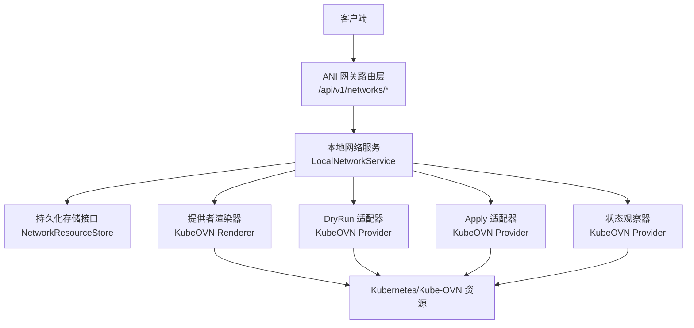
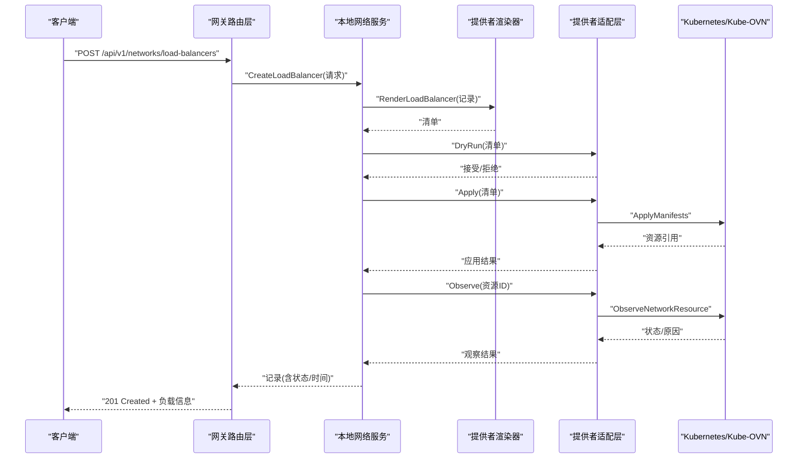
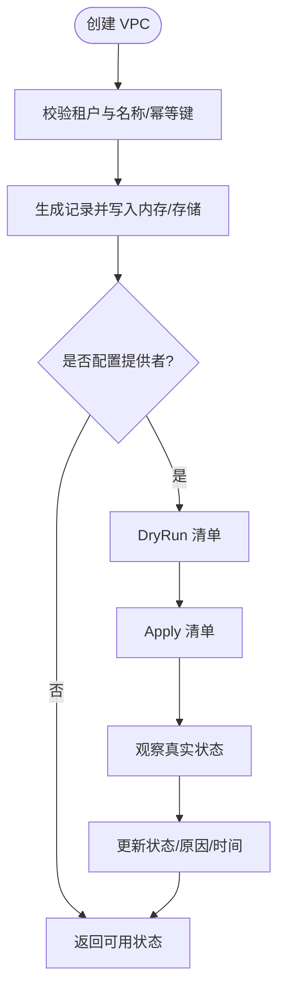
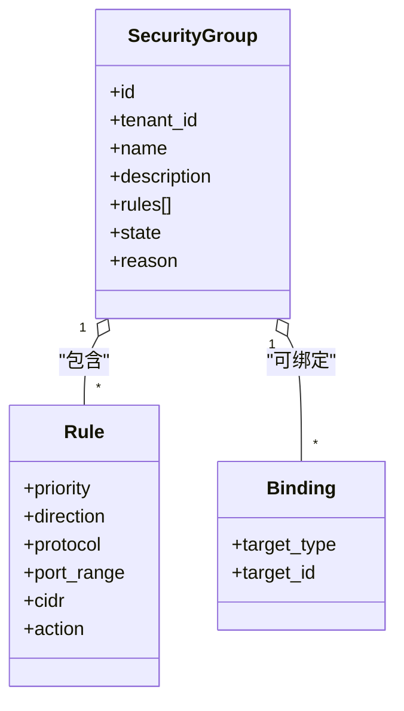
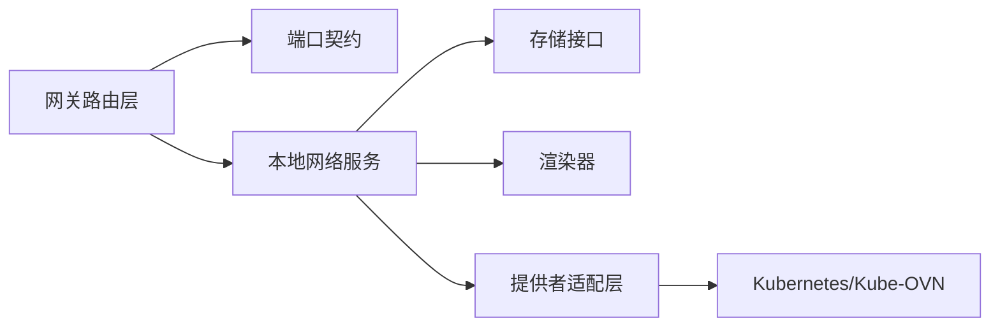

# 网络管理 API

<cite>
**本文引用的文件**
- [network_resources.go](file://repo/services/ani-gateway/internal/router/network_resources.go)
- [network_service.go](file://repo/pkg/adapters/runtime/network_service.go)
- [kubeovn_network_provider.go](file://repo/pkg/adapters/runtime/kubeovn_network_provider.go)
- [network_runtime.go](file://repo/services/ani-gateway/network_runtime.go)
- [network_resources.go（端口定义）](file://repo/pkg/ports/network_resources.go)
- [network_resources_test.go](file://repo/services/ani-gateway/internal/router/network_resources_test.go)
</cite>

## 目录
1. [简介](#简介)
2. [项目结构](#项目结构)
3. [核心组件](#核心组件)
4. [架构总览](#架构总览)
5. [详细组件分析](#详细组件分析)
6. [依赖关系分析](#依赖关系分析)
7. [性能与可靠性](#性能与可靠性)
8. [故障诊断与排错](#故障诊断与排错)
9. [结论](#结论)
10. [附录：API 参考](#附录api-参考)

## 简介
本文件面向 ANI 平台的网络管理 API，覆盖 VPC、子网、安全组、负载均衡器与路由的完整生命周期管理。文档基于网关路由层、运行时服务层、提供者适配层与端口契约进行系统化说明，包含多租户隔离、流量策略、防火墙规则、端口映射、拓扑概览、状态回写与 SDN 集成等能力。同时给出运维视角的监控与排错建议，以及跨集群通信与 SDN 集成的使用示例。

## 项目结构
网络管理 API 由四层组成：
- 网关路由层：暴露 HTTP 接口，负责参数校验、租户上下文注入、响应序列化与错误归一化。
- 运行时服务层：实现业务编排、幂等控制、资源状态机、提供者执行流程与持久化边界。
- 提供者适配层：对接 Kube-OVN/Kubernetes 等底层 SDN，提供渲染、DryRun、Apply、观察能力。
- 端口契约层：统一数据结构、请求/响应类型与接口定义，保证跨模块一致性。

图表来源
- [network_resources.go:246-283](file://repo/services/ani-gateway/internal/router/network_resources.go#L246-L283)
- [network_service.go:111-163](file://repo/pkg/adapters/runtime/network_service.go#L111-L163)
- [kubeovn_network_provider.go:50-134](file://repo/pkg/adapters/runtime/kubeovn_network_provider.go#L50-L134)
- [network_runtime.go:47-88](file://repo/services/ani-gateway/network_runtime.go#L47-L88)

章节来源
- [network_resources.go:246-283](file://repo/services/ani-gateway/internal/router/network_resources.go#L246-L283)
- [network_service.go:111-163](file://repo/pkg/adapters/runtime/network_service.go#L111-L163)
- [kubeovn_network_provider.go:50-134](file://repo/pkg/adapters/runtime/kubeovn_network_provider.go#L50-L134)
- [network_runtime.go:47-88](file://repo/services/ani-gateway/network_runtime.go#L47-L88)

## 核心组件
- 网关路由层
  - 注册并处理 /api/v1/networks 下的所有资源端点，包括概览、VPC、子网、安全组、负载均衡器、路由及其规则与绑定。
  - 将 JSON 请求转换为端口请求对象，调用运行时服务，再将记录序列化为 JSON 响应。
  - 统一错误码映射：NOT_FOUND、CONFLICT、BAD_REQUEST 等。

- 运行时服务层
  - LocalNetworkService 维护内存中的资源集合与幂等键表，支持按租户过滤、状态过滤、排序与分页元数据。
  - 提供完整的生命周期：创建、读取、列表、删除；对安全组规则支持优先级、方向、协议、端口范围、CIDR、动作的增删改查与绑定。
  - 当配置了提供者时，走 DryRun→Apply→Observe 流程，并将状态回写到记录中。

- 提供者适配层
  - KubeOVNNetworkProviderAdapter 封装 Kubernetes REST 客户端，实现 DryRun、Apply、Observe 三件套，并对请求进行身份与权限证明校验。
  - 渲染器将 ANI 资源模型转换为 Kube-OVN/Kubernetes 清单，供 DryRun/Apply 使用。

- 端口契约层
  - 定义 NetworkService、NetworkProviderRenderer、NetworkProviderDryRun、NetworkProviderApply、NetworkProviderStatusReader 等接口，以及所有资源记录与请求类型。
  - 明确资源状态枚举：pending、available、failed、deleting、deleted。

章节来源
- [network_resources.go:246-283](file://repo/services/ani-gateway/internal/router/network_resources.go#L246-L283)
- [network_service.go:165-924](file://repo/pkg/adapters/runtime/network_service.go#L165-L924)
- [kubeovn_network_provider.go:50-134](file://repo/pkg/adapters/runtime/kubeovn_network_provider.go#L50-L134)
- [network_resources.go（端口定义）:8-168](file://repo/pkg/ports/network_resources.go#L8-L168)
- [network_resources.go（端口定义）:314-350](file://repo/pkg/ports/network_resources.go#L314-L350)

## 架构总览
网络管理 API 的请求链路如下：
- 客户端通过网关路由层访问 /api/v1/networks/*。
- 路由层解析路径与查询参数，提取租户 ID，构造端口请求对象。
- 运行时服务层执行业务逻辑：校验、幂等、状态机、提供者执行（可选）、持久化。
- 提供者适配层将资源渲染为清单，执行 DryRun/Apply/Observe，最终返回状态。
- 路由层将记录转为 JSON 响应，统一错误码与时间格式。

图表来源
- [network_resources.go:622-642](file://repo/services/ani-gateway/internal/router/network_resources.go#L622-L642)
- [network_service.go:1107-1139](file://repo/pkg/adapters/runtime/network_service.go#L1107-L1139)
- [kubeovn_network_provider.go:72-134](file://repo/pkg/adapters/runtime/kubeovn_network_provider.go#L72-L134)

## 详细组件分析

### VPC 管理
- 能力
  - 创建：支持 CIDR 默认值、幂等键、租户隔离、状态机。
  - 列表：按名称前缀、状态过滤，按更新时间倒序。
  - 获取/删除：按资源 ID 与租户校验，删除标记为已删除。
- 提供者集成
  - 若配置提供者，创建后进入 pending，随后 DryRun→Apply→Observe 更新状态与原因。
- 典型用法
  - 先创建 VPC，再创建子网与安全组，最后创建负载均衡器或路由。

图表来源
- [network_service.go:165-218](file://repo/pkg/adapters/runtime/network_service.go#L165-L218)
- [network_service.go:1062-1075](file://repo/pkg/adapters/runtime/network_service.go#L1062-L1075)

章节来源
- [network_resources.go:294-346](file://repo/services/ani-gateway/internal/router/network_resources.go#L294-L346)
- [network_service.go:165-218](file://repo/pkg/adapters/runtime/network_service.go#L165-L218)
- [network_resources.go（端口定义）:170-175](file://repo/pkg/ports/network_resources.go#L170-L175)

### 子网管理
- 能力
  - 创建：必须关联 VPC，支持 CIDR 与网关地址，默认 CIDR 兜底。
  - 列表：按 VPC ID、状态过滤。
  - 获取/删除：按资源 ID 与租户校验。
  - IP 分配：提供子网 IP 分配列表接口（当前实现为空集合占位）。
- 提供者集成
  - 创建后进入 pending，经 DryRun→Apply→Observe 更新状态。

章节来源
- [network_resources.go:348-420](file://repo/services/ani-gateway/internal/router/network_resources.go#L348-L420)
- [network_service.go:268-388](file://repo/pkg/adapters/runtime/network_service.go#L268-L388)
- [network_resources.go（端口定义）:177-184](file://repo/pkg/ports/network_resources.go#L177-L184)

### 安全组与规则
- 能力
  - 安全组：创建时支持初始规则列表，支持描述字段。
  - 规则：优先级 1-32766，方向 ingress/egress，协议 tcp/udp/icmp/all，端口范围必填，CIDR 必填，动作 allow/deny。
  - 绑定：支持将安全组绑定到实例、网卡、负载均衡器。
  - 列表/获取/更新/删除：支持按方向、协议过滤，更新部分字段。
- 提供者集成
  - 创建后进入 pending，经 DryRun→Apply→Observe 更新状态。
- 安全特性
  - 多租户隔离：所有操作均校验租户 ID，跨租户访问返回未找到。
  - 规则排序：按优先级与方向排序，确保一致输出。

图表来源
- [network_resources.go（端口定义）:123-133](file://repo/pkg/ports/network_resources.go#L123-L133)
- [network_resources.go（端口定义）:42-49](file://repo/pkg/ports/network_resources.go#L42-L49)
- [network_resources.go（端口定义）:114-121](file://repo/pkg/ports/network_resources.go#L114-L121)

章节来源
- [network_resources.go:422-620](file://repo/services/ani-gateway/internal/router/network_resources.go#L422-L620)
- [network_service.go:390-733](file://repo/pkg/adapters/runtime/network_service.go#L390-L733)
- [network_resources.go（端口定义）:186-192](file://repo/pkg/ports/network_resources.go#L186-L192)

### 负载均衡器
- 能力
  - 创建：指定 VPC、可选 Subnet、scheme（internal/public）、监听器列表（协议、端口、目标端口）。
  - 列表：按 VPC ID、状态、scheme 过滤。
  - 获取/删除：按资源 ID 与租户校验。
  - VIP：本地开发模式返回固定标识，真实提供者会分配真实 VIP。
- 提供者集成
  - 创建后进入 pending，经 DryRun→Apply→Observe 更新状态与 VIP。

章节来源
- [network_resources.go:622-678](file://repo/services/ani-gateway/internal/router/network_resources.go#L622-L678)
- [network_service.go:735-850](file://repo/pkg/adapters/runtime/network_service.go#L735-L850)
- [network_resources.go（端口定义）:194-202](file://repo/pkg/ports/network_resources.go#L194-L202)

### 路由表
- 能力
  - 创建：指定 VPC、目的 CIDR、下一跳类型（gateway/instance/nat）、下一跳 ID、描述。
  - 列表：按 VPC ID、下一跳类型过滤。
  - 获取/删除：按资源 ID 与租户校验。
- 提供者集成
  - 创建后进入 pending，经 DryRun→Apply→Observe 更新状态，并记录 provider 与 real_provider 标志。

章节来源
- [network_resources.go:680-735](file://repo/services/ani-gateway/internal/router/network_resources.go#L680-L735)
- [network_service.go:852-969](file://repo/pkg/adapters/runtime/network_service.go#L852-L969)
- [network_resources.go（端口定义）:204-212](file://repo/pkg/ports/network_resources.go#L204-L212)

### 概览与拓扑
- 概览接口
  - 返回资源统计（总数、可用、待处理、失败、删除中）、能力清单、创建顺序、资源关系、删除风险。
  - 用于前端首屏展示与拓扑构建。
- 拓扑关系
  - VPC 包含子网、承载负载均衡器、拥有路由；安全组可绑定负载均衡器。

章节来源
- [network_resources.go:285-292](file://repo/services/ani-gateway/internal/router/network_resources.go#L285-L292)
- [network_service.go:111-163](file://repo/pkg/adapters/runtime/network_service.go#L111-L163)

## 依赖关系分析
- 网关路由层依赖端口契约与服务实现，默认注入本地网络服务。
- 本地网络服务依赖存储接口与提供者三件套（渲染、DryRun、Apply、观察），并通过选项装配。
- 提供者适配层依赖 Kubernetes REST 客户端，执行 DryRun/Apply/Observe，并校验身份与权限证明。
- 运行时配置通过环境变量选择提供者模式（local/kubeovn_rest），并注入用户 ID 与权限证明。

图表来源
- [network_resources.go:235-244](file://repo/services/ani-gateway/internal/router/network_resources.go#L235-L244)
- [network_service.go:15-38](file://repo/pkg/adapters/runtime/network_service.go#L15-L38)
- [network_runtime.go:47-88](file://repo/services/ani-gateway/network_runtime.go#L47-L88)

章节来源
- [network_resources.go:235-244](file://repo/services/ani-gateway/internal/router/network_resources.go#L235-L244)
- [network_service.go:15-38](file://repo/pkg/adapters/runtime/network_service.go#L15-L38)
- [network_runtime.go:47-88](file://repo/services/ani-gateway/network_runtime.go#L47-L88)

## 性能与可靠性
- 幂等性
  - 所有创建接口支持 idempotency_key，避免重复提交导致重复资源。
- 并发安全
  - 本地服务使用读写锁保护内存资源与幂等表，保证并发安全。
- 状态机
  - 资源状态从 pending→available→failed/deleting→deleted，失败时记录原因，便于排查。
- 提供者开关
  - 可通过环境变量关闭 apply，仅执行 DryRun，降低生产风险。
- 超时与重试
  - 网关支持 Kubernetes 请求超时配置，结合后端断路器与重试策略提升鲁棒性。

章节来源
- [network_service.go:1213-1223](file://repo/pkg/adapters/runtime/network_service.go#L1213-L1223)
- [network_service.go:1006-1060](file://repo/pkg/adapters/runtime/network_service.go#L1006-L1060)
- [network_runtime.go:30-45](file://repo/services/ani-gateway/network_runtime.go#L30-L45)

## 故障诊断与排错
- 常见错误
  - 未找到：资源不存在或跨租户访问。
  - 冲突：幂等键冲突或资源状态不满足前置条件。
  - 无效请求：缺少必填字段、字段值非法（如优先级范围、协议、动作）。
- 排查步骤
  - 检查租户 ID 与资源 ID 是否正确。
  - 查看资源 state 与 reason 字段，定位提供者失败原因。
  - 确认 DryRun 是否接受，Apply 是否启用，权限证明是否传入。
  - 核对安全组规则优先级与方向，确保匹配预期。
- 验证手段
  - 使用概览接口查看资源统计与能力状态。
  - 通过测试用例快速验证端到端流程与租户隔离。

章节来源
- [network_resources.go:978-990](file://repo/services/ani-gateway/internal/router/network_resources.go#L978-L990)
- [network_service.go:1141-1183](file://repo/pkg/adapters/runtime/network_service.go#L1141-L1183)
- [network_resources_test.go:77-93](file://repo/services/ani-gateway/internal/router/network_resources_test.go#L77-L93)

## 结论
ANI 网络管理 API 以清晰的层次与契约实现了 VPC、子网、安全组、负载均衡器与路由的全生命周期管理。通过本地服务与提供者适配层的解耦设计，既支持开发调试的快速闭环，也支持生产环境的 SDN 集成与严格的安全控制。结合概览接口与状态回写，平台可提供丰富的拓扑视图与运维能力。建议在生产环境启用 DryRun 门禁、配置合适的超时与重试策略，并持续完善观察者与指标采集，以提升可观测性与稳定性。

## 附录：API 参考
- 概览
  - GET /api/v1/networks/overview
  - 用途：获取资源统计、能力、关系与删除风险。
- VPC
  - POST /api/v1/networks/vpcs
  - GET /api/v1/networks/vpcs
  - GET /api/v1/networks/vpcs/:vpc_id
  - DELETE /api/v1/networks/vpcs/:vpc_id
- 子网
  - POST /api/v1/networks/subnets
  - GET /api/v1/networks/subnets
  - GET /api/v1/networks/subnets/:subnet_id
  - DELETE /api/v1/networks/subnets/:subnet_id
  - GET /api/v1/networks/subnets/:subnet_id/ip-allocations
- 安全组
  - POST /api/v1/networks/security-groups
  - GET /api/v1/networks/security-groups
  - GET /api/v1/networks/security-groups/:security_group_id
  - DELETE /api/v1/networks/security-groups/:security_group_id
  - 规则
    - GET /api/v1/networks/security-groups/:security_group_id/rules
    - POST /api/v1/networks/security-groups/:security_group_id/rules
    - GET /api/v1/networks/security-groups/:security_group_id/rules/:rule_id
    - PUT /api/v1/networks/security-groups/:security_group_id/rules/:rule_id
    - DELETE /api/v1/networks/security-groups/:security_group_id/rules/:rule_id
  - 绑定
    - GET /api/v1/networks/security-groups/:security_group_id/bindings
    - POST /api/v1/networks/security-groups/:security_group_id/bindings
    - DELETE /api/v1/networks/security-groups/:security_group_id/bindings/:binding_id
- 负载均衡器
  - POST /api/v1/networks/load-balancers
  - GET /api/v1/networks/load-balancers
  - GET /api/v1/networks/load-balancers/:load_balancer_id
  - DELETE /api/v1/networks/load-balancers/:load_balancer_id
- 路由
  - POST /api/v1/networks/routes
  - GET /api/v1/networks/routes
  - GET /api/v1/networks/routes/:route_id
  - DELETE /api/v1/networks/routes/:route_id

章节来源
- [network_resources.go:246-283](file://repo/services/ani-gateway/internal/router/network_resources.go#L246-L283)
- [network_resources.go:285-735](file://repo/services/ani-gateway/internal/router/network_resources.go#L285-L735)