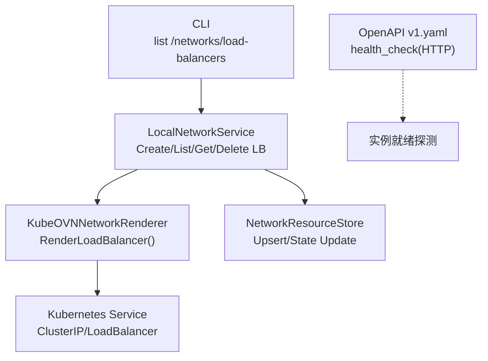
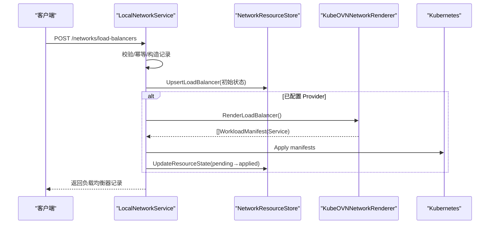
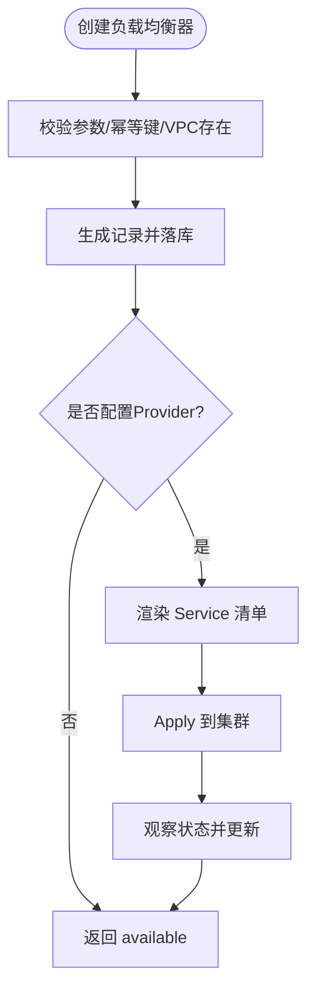
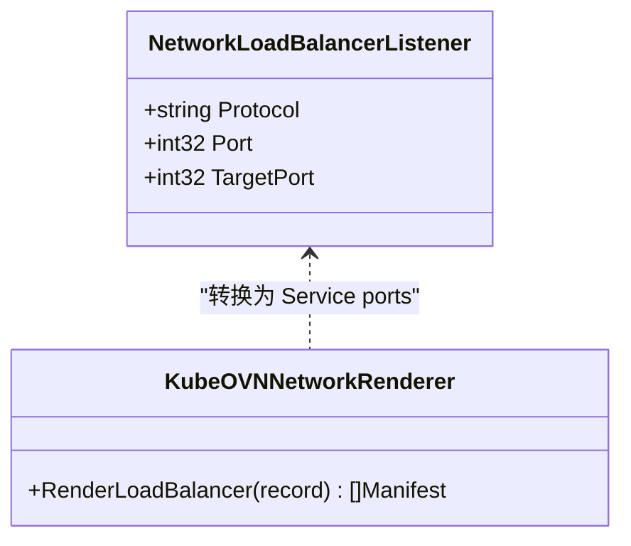
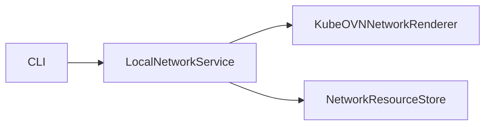

# 负载均衡器管理 API

<cite>
**本文引用的文件**
- [network_resources.go](file://repo/pkg/ports/network_resources.go)
- [network_service.go](file://repo/pkg/adapters/runtime/network_service.go)
- [kubeovn_network_renderer.go](file://repo/pkg/adapters/runtime/kubeovn_network_renderer.go)
- [v1.yaml](file://repo/api/openapi/v1.yaml)
- [main.go](file://repo/cli/ani/main.go)
- [probes_test.go](file://repo/pkg/bootstrap/probes_test.go)
- [observability.go](file://repo/services/ani-gateway/internal/router/observability.go)
- [local_instance_observability_service.go](file://repo/pkg/adapters/runtime/local_instance_observability_service.go)
</cite>

## 目录
1. [简介](#简介)
2. [项目结构](#项目结构)
3. [核心组件](#核心组件)
4. [架构总览](#架构总览)
5. [详细组件分析](#详细组件分析)
6. [依赖关系分析](#依赖关系分析)
7. [性能与高可用](#性能与高可用)
8. [故障排查指南](#故障排查指南)
9. [结论](#结论)
10. [附录：API 参考](#附录api-参考)

## 简介
本文件面向“负载均衡器管理 API”，基于仓库中网络资源端口定义、本地网络服务实现以及 Kube-OVN 渲染器，梳理负载均衡器的创建、监听器配置、状态观察与删除等能力。当前实现聚焦于通过 Kubernetes Service（ClusterIP/LoadBalancer）暴露流量入口，并以安全组（NetworkPolicy）控制入出方向访问策略。健康检查在平台工作负载层以 HTTP 协议进行就绪探测；会话保持、SSL 证书卸载、高级流量分发策略由底层云厂商或 Ingress/Gateway 控制器扩展，不在当前代码范围内。

## 项目结构
- 接口契约与数据模型：位于 pkg/ports，定义网络资源（VPC、子网、安全组、负载均衡器、路由）的 CRUD 请求/响应类型与状态机。
- 运行时适配器：pkg/adapters/runtime 提供 LocalNetworkService（内存态）与 KubeOVNNetworkRenderer（将资源渲染为 Kubernetes/Kube-OVN 清单）。
- OpenAPI 契约：repo/api/openapi/v1.yaml 定义了平台工作负载的健康检查等通用能力。
- CLI：cli/ani 提供对 /networks/load-balancers 的便捷访问。
- 可观测性：bootstrap probes 与 observability 路由用于系统健康与指标查询。

图表来源
- [network_service.go:735-800](file://repo/pkg/adapters/runtime/network_service.go#L735-L800)
- [kubeovn_network_renderer.go:83-106](file://repo/pkg/adapters/runtime/kubeovn_network_renderer.go#L83-L106)
- [network_resources.go:135-202](file://repo/pkg/ports/network_resources.go#L135-L202)
- [v1.yaml:600-608](file://repo/api/openapi/v1.yaml#L600-L608)

章节来源
- [network_resources.go:135-202](file://repo/pkg/ports/network_resources.go#L135-L202)
- [network_service.go:111-163](file://repo/pkg/adapters/runtime/network_service.go#L111-L163)
- [kubeovn_network_renderer.go:83-106](file://repo/pkg/adapters/runtime/kubeovn_network_renderer.go#L83-L106)
- [v1.yaml:600-608](file://repo/api/openapi/v1.yaml#L600-L608)

## 核心组件
- NetworkLoadBalancerListener：定义监听器协议、监听端口与目标端口映射。
- NetworkLoadBalancerRecord：承载负载均衡器元数据（租户、名称、VPC/子网、Scheme、VIP、监听器列表、状态、时间戳）。
- LocalNetworkService：提供负载均衡器的幂等创建、列表、详情、删除，并在配置了 Provider 时进入 Pending→Applied 流程。
- KubeOVNNetworkRenderer：将负载均衡器记录渲染为 Kubernetes Service 清单，支持 ClusterIP 与 LoadBalancer 两种类型，并注入标签与注解以便关联 VPC/Subnet/Scheme。

章节来源
- [network_resources.go:135-202](file://repo/pkg/ports/network_resources.go#L135-L202)
- [network_resources.go:314-359](file://repo/pkg/ports/network_resources.go#L314-L359)
- [network_service.go:735-800](file://repo/pkg/adapters/runtime/network_service.go#L735-L800)
- [kubeovn_network_renderer.go:83-106](file://repo/pkg/adapters/runtime/kubeovn_network_renderer.go#L83-L106)

## 架构总览
负载均衡器管理的调用链如下：
- 客户端通过 CLI 或网关调用 /networks/load-balancers。
- LocalNetworkService 校验参数、幂等键、VPC 存在性，生成记录并持久化。
- 若配置了 Provider，则触发 DryRun/Apply/Status 流程，最终由 KubeOVNNetworkRenderer 渲染为 Service 清单并应用到集群。
- 状态由 StatusReader 观察并回写，形成 pending→available 收敛。

图表来源
- [network_service.go:735-800](file://repo/pkg/adapters/runtime/network_service.go#L735-L800)
- [kubeovn_network_renderer.go:83-106](file://repo/pkg/adapters/runtime/kubeovn_network_renderer.go#L83-L106)
- [network_resources.go:352-359](file://repo/pkg/ports/network_resources.go#L352-L359)

## 详细组件分析

### 负载均衡器数据模型与生命周期
- 监听器：包含协议、端口、目标端口。默认目标端口等于监听端口。
- Scheme：internal 或 public，决定渲染为 ClusterIP 还是 LoadBalancer。
- 状态机：pending、available、failed、deleting、deleted。
- 幂等：使用 IdempotencyKey 保证重复创建不产生重复资源。

图表来源
- [network_service.go:735-800](file://repo/pkg/adapters/runtime/network_service.go#L735-L800)
- [kubeovn_network_renderer.go:83-106](file://repo/pkg/adapters/runtime/kubeovn_network_renderer.go#L83-L106)
- [network_resources.go:8-16](file://repo/pkg/ports/network_resources.go#L8-L16)

章节来源
- [network_resources.go:8-16](file://repo/pkg/ports/network_resources.go#L8-L16)
- [network_resources.go:135-202](file://repo/pkg/ports/network_resources.go#L135-L202)
- [network_service.go:735-800](file://repo/pkg/adapters/runtime/network_service.go#L735-L800)

### 监听器与协议支持
- 当前监听器字段支持 protocol/port/targetPort。
- 渲染器将协议标准化为大写，并将监听端口映射为 Service Port，目标端口映射为 targetPort。
- 未显式指定 targetPort 时，默认与监听端口一致。

图表来源
- [network_resources.go:135-139](file://repo/pkg/ports/network_resources.go#L135-L139)
- [kubeovn_network_renderer.go:234-250](file://repo/pkg/adapters/runtime/kubeovn_network_renderer.go#L234-L250)

章节来源
- [kubeovn_network_renderer.go:234-250](file://repo/pkg/adapters/runtime/kubeovn_network_renderer.go#L234-L250)

### 后端服务器与流量分发
- 当前实现通过 Service selector 将流量转发至带有特定标签的 Pod/工作负载。
- 流量分发策略（如轮询、加权、最少连接）由底层 Kubernetes Service 或 Ingress/Gateway 控制器决定，未在 Core 层暴露。

章节来源
- [kubeovn_network_renderer.go:91-106](file://repo/pkg/adapters/runtime/kubeovn_network_renderer.go#L91-L106)

### 健康检查
- 平台工作负载健康检查采用 HTTP 协议，指定 path 与 port_name，用于判定实例就绪。
- 该健康检查作用于工作负载本身，而非负载均衡器层面的 TCP/HTTP 探针。

章节来源
- [v1.yaml:600-608](file://repo/api/openapi/v1.yaml#L600-L608)

### 会话保持与 SSL 证书管理
- 会话保持：当前未在服务层暴露相关配置项。
- SSL 证书管理：当前未在服务层暴露证书上传/绑定能力；如需 HTTPS 终止，可在上层 Ingress/Gateway 或云厂商 LB 控制器中配置。

章节来源
- [network_resources.go:135-202](file://repo/pkg/ports/network_resources.go#L135-L202)

### 与实例的关联关系
- 负载均衡器通过 Service selector 与带标签的工作负载关联。
- 安全组（NetworkPolicy）可限制入站/出站规则，配合负载均衡器实现访问控制。

章节来源
- [kubeovn_network_renderer.go:91-106](file://repo/pkg/adapters/runtime/kubeovn_network_renderer.go#L91-L106)
- [kubeovn_network_renderer.go:63-81](file://repo/pkg/adapters/runtime/kubeovn_network_renderer.go#L63-L81)

## 依赖关系分析
- LocalNetworkService 依赖 NetworkResourceStore 做持久化，依赖 Provider 渲染器/执行器完成实际资源落地。
- KubeOVNNetworkRenderer 仅负责将记录渲染为 Kubernetes/Kube-OVN 清单，不包含外部依赖。
- CLI 直接调用 /networks/load-balancers 端点，便于运维查看。

图表来源
- [network_service.go:15-38](file://repo/pkg/adapters/runtime/network_service.go#L15-L38)
- [kubeovn_network_renderer.go:13-17](file://repo/pkg/adapters/runtime/kubeovn_network_renderer.go#L13-L17)
- [main.go:128-129](file://repo/cli/ani/main.go#L128-L129)

章节来源
- [network_service.go:15-38](file://repo/pkg/adapters/runtime/network_service.go#L15-L38)
- [main.go:128-129](file://repo/cli/ani/main.go#L128-L129)

## 性能与高可用
- 幂等键：避免重复创建导致的资源抖动。
- 状态收敛：Pending→Available 的异步流程确保应用侧稳定后再对外暴露。
- 可观测性：系统探针与指标可用于评估服务可用性；日志可通过 Loki/Fluent-Bit 采集（见可观测性部分）。

章节来源
- [network_service.go:735-800](file://repo/pkg/adapters/runtime/network_service.go#L735-L800)
- [probes_test.go:171-189](file://repo/pkg/bootstrap/probes_test.go#L171-L189)

## 故障排查指南
- 创建失败：检查 VPC 是否存在、Name/IdempotencyKey 是否合法、Provider 是否配置。
- 状态卡在 pending：确认 Provider Apply 是否成功、Kubernetes 资源是否创建、Status 是否回写。
- 无法访问：检查安全组规则、Service 类型（public/internal）、Selector 是否正确、后端 Pod 是否就绪。
- 健康检查：确认工作负载暴露的 HTTP 路径与端口名匹配。

章节来源
- [network_service.go:735-800](file://repo/pkg/adapters/runtime/network_service.go#L735-L800)
- [kubeovn_network_renderer.go:83-106](file://repo/pkg/adapters/runtime/kubeovn_network_renderer.go#L83-L106)
- [v1.yaml:600-608](file://repo/api/openapi/v1.yaml#L600-L608)

## 结论
当前负载均衡器管理 API 提供了基础的负载均衡器生命周期管理与监听器配置能力，并通过 Kubernetes Service 暴露流量入口。健康检查在工作负载层以 HTTP 方式实现。会话保持、SSL 证书卸载、高级流量分发策略需结合上层 Ingress/Gateway 或云厂商 LB 控制器扩展。可观测性与日志能力已在系统中具备基础支撑，便于运维监控与排障。

## 附录：API 参考
- 负载均衡器资源
  - 创建：POST /networks/load-balancers
  - 列表：GET /networks/load-balancers
  - 详情：GET /networks/load-balancers/{id}
  - 删除：DELETE /networks/load-balancers/{id}
- 关键数据结构
  - 监听器：protocol/port/targetPort
  - 负载均衡器：tenant_id/name/vpc_id/subnet_id/scheme/vip/listeners/state/reason/timestamps
- CLI 示例
  - 列出负载均衡器：network-load-balancers list → /networks/load-balancers

章节来源
- [network_resources.go:135-202](file://repo/pkg/ports/network_resources.go#L135-L202)
- [network_resources.go:314-359](file://repo/pkg/ports/network_resources.go#L314-L359)
- [main.go:128-129](file://repo/cli/ani/main.go#L128-L129)