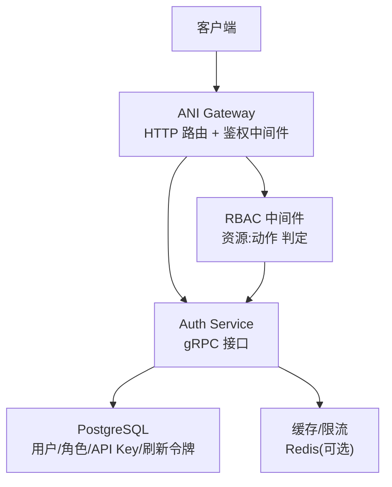
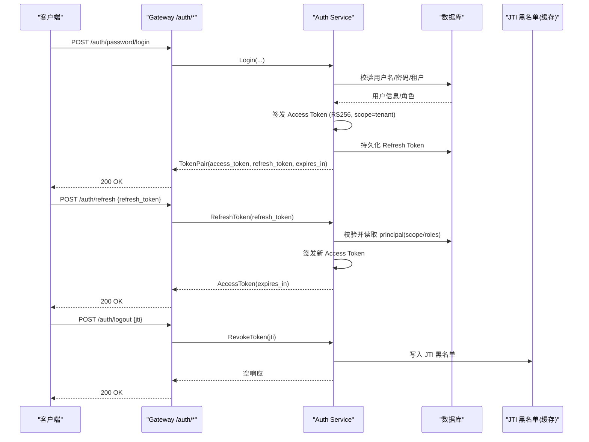
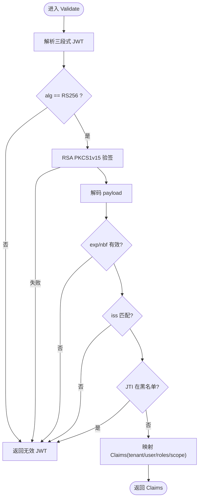
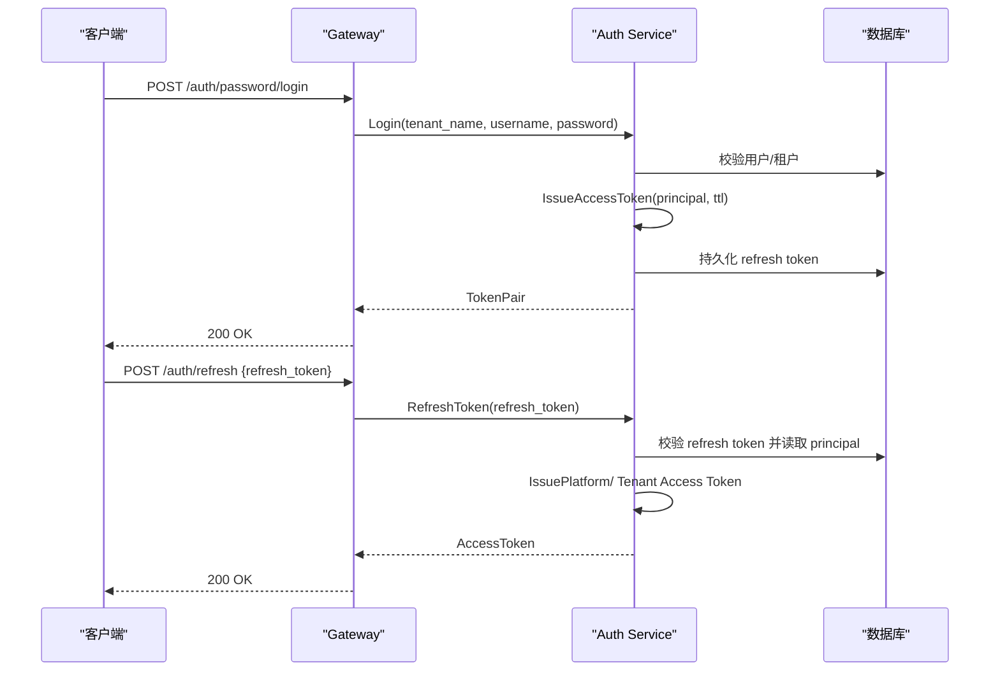
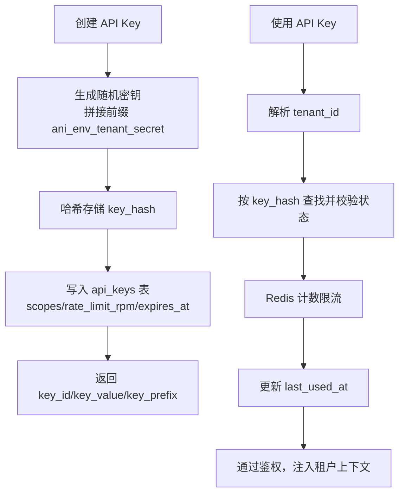
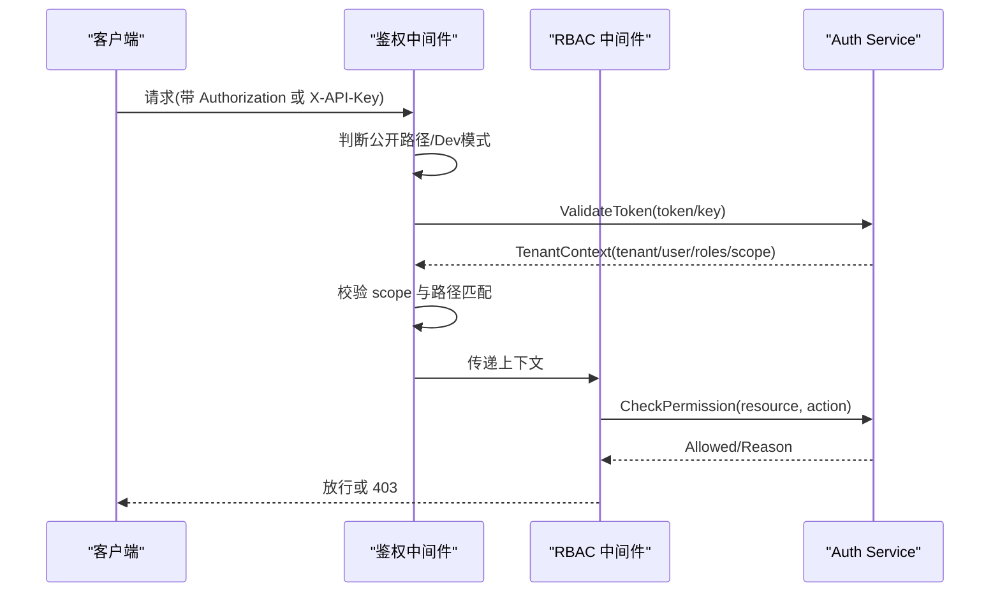
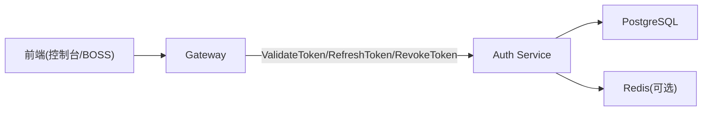

# 认证授权 API

<cite>
**本文引用的文件**
- [services/ani-gateway/internal/router/auth.go](file://services/ani-gateway/internal/router/auth.go)
- [services/ani-gateway/internal/middleware/auth.go](file://services/ani-gateway/internal/middleware/auth.go)
- [services/ani-gateway/internal/middleware/rbac.go](file://services/ani-gateway/internal/middleware/rbac.go)
- [services/auth-service/internal/service/auth_service.go](file://services/auth-service/internal/service/auth_service.go)
- [services/auth-service/internal/service/jwt.go](file://services/auth-service/internal/service/jwt.go)
- [services/auth-service/internal/service/token_issuer.go](file://services/auth-service/internal/service/token_issuer.go)
- [services/auth-service/internal/service/api_keys.go](file://services/auth-service/internal/service/api_keys.go)
- [services/auth-service/internal/service/password_login.go](file://services/auth-service/internal/service/password_login.go)
- [services/auth-service/internal/service/platform_login.go](file://services/auth-service/internal/service/platform_login.go)
- [api/openapi/v1.yaml](file://api/openapi/v1.yaml)
</cite>

## 目录
1. [简介](#简介)
2. [项目结构](#项目结构)
3. [核心组件](#核心组件)
4. [架构总览](#架构总览)
5. [详细组件分析](#详细组件分析)
6. [依赖关系分析](#依赖关系分析)
7. [性能与可用性](#性能与可用性)
8. [故障排查指南](#故障排查指南)
9. [结论](#结论)
10. [附录：端点契约与示例](#附录端点契约与示例)

## 简介
本文件面向 ANI 平台的认证与授权能力，聚焦以下目标：
- 说明 JWT Token 获取、刷新与吊销机制（/auth/token、/auth/refresh、/auth/logout）。
- 说明 API Key 的创建、查询与吊销流程。
- 说明多租户与平台管理员的双域认证流程（scope=tenant 与 scope=platform）及路由隔离。
- 提供 Bearer JWT 与 X-API-Key 两种认证方式的调用方式与错误处理要点。
- 说明权限控制模型与 RBAC 集成方式。

## 项目结构
认证授权由网关层与认证服务共同实现：
- 网关（ani-gateway）暴露 HTTP 端点，负责鉴权中间件、RBAC 校验、请求转发到认证服务。
- 认证服务（auth-service）实现登录、OIDC 回调、Token 签发与验证、API Key 管理、权限检查等。

图表来源
- [services/ani-gateway/internal/router/auth.go:102-113](file://services/ani-gateway/internal/router/auth.go#L102-L113)
- [services/ani-gateway/internal/middleware/auth.go:22-141](file://services/ani-gateway/internal/middleware/auth.go#L22-L141)
- [services/ani-gateway/internal/middleware/rbac.go:17-71](file://services/ani-gateway/internal/middleware/rbac.go#L17-L71)
- [services/auth-service/internal/service/auth_service.go:21-57](file://services/auth-service/internal/service/auth_service.go#L21-L57)

章节来源
- [services/ani-gateway/internal/router/auth.go:102-113](file://services/ani-gateway/internal/router/auth.go#L102-L113)
- [services/ani-gateway/internal/middleware/auth.go:22-141](file://services/ani-gateway/internal/middleware/auth.go#L22-L141)
- [services/ani-gateway/internal/middleware/rbac.go:17-71](file://services/ani-gateway/internal/middleware/rbac.go#L17-L71)
- [services/auth-service/internal/service/auth_service.go:21-57](file://services/auth-service/internal/service/auth_service.go#L21-L57)

## 核心组件
- 网关鉴权中间件：支持 Bearer JWT、X-API-Key、Sandbox Token 三种身份；按路径白名单放行公开端点；按 scope 限制平台/租户访问面。
- 网关 RBAC 中间件：根据方法+路径推断资源与动作，调用认证服务的 CheckPermission 进行细粒度授权。
- 认证服务：
  - 登录：租户密码登录、平台密码登录、OIDC 开始与完成。
  - Token：签发与验证 RS256 JWT，支持 JTI 吊销黑名单。
  - Refresh：基于 refresh token 续期 access token，区分 platform/tenant scope。
  - API Key：生成、列表、吊销、速率限制与过期控制。
  - 权限：内置最小化规则引擎（platform-admin/tenant-admin/auditor/user 与 scope 匹配）。

章节来源
- [services/ani-gateway/internal/middleware/auth.go:22-141](file://services/ani-gateway/internal/middleware/auth.go#L22-L141)
- [services/ani-gateway/internal/middleware/rbac.go:17-71](file://services/ani-gateway/internal/middleware/rbac.go#L17-L71)
- [services/auth-service/internal/service/auth_service.go:59-221](file://services/auth-service/internal/service/auth_service.go#L59-L221)
- [services/auth-service/internal/service/jwt.go:96-169](file://services/auth-service/internal/service/jwt.go#L96-L169)
- [services/auth-service/internal/service/api_keys.go:46-269](file://services/auth-service/internal/service/api_keys.go#L46-L269)

## 架构总览
下图展示一次典型“租户密码登录 → 获取 TokenPair → 刷新 → 吊销”的端到端流程。

图表来源
- [services/ani-gateway/internal/router/auth.go:116-154](file://services/ani-gateway/internal/router/auth.go#L116-L154)
- [services/ani-gateway/internal/router/auth.go:259-285](file://services/ani-gateway/internal/router/auth.go#L259-L285)
- [services/auth-service/internal/service/auth_service.go:59-121](file://services/auth-service/internal/service/auth_service.go#L59-L121)
- [services/auth-service/internal/service/jwt.go:96-169](file://services/auth-service/internal/service/jwt.go#L96-L169)

## 详细组件分析

### 组件 A：JWT 签发与验证
- 签发：使用 RSA 私钥对包含 sub/iss/exp/nbf/iat/jti/tid/uid/roles/scope 的载荷签名，默认 access token 有效期为 1 小时。
- 验证：解析三段式 JWT，校验算法 RS256、时间窗口、签发者、黑名单（JTI），并将 tenant_id 与 scope 映射为 Claims。
- 平台与租户区分：platform token 的 tid 为空且 scope=platform；tenant token 必须携带有效 tid。

图表来源
- [services/auth-service/internal/service/jwt.go:96-169](file://services/auth-service/internal/service/jwt.go#L96-L169)
- [services/auth-service/internal/service/token_issuer.go:44-62](file://services/auth-service/internal/service/token_issuer.go#L44-L62)

章节来源
- [services/auth-service/internal/service/jwt.go:21-169](file://services/auth-service/internal/service/jwt.go#L21-L169)
- [services/auth-service/internal/service/token_issuer.go:19-62](file://services/auth-service/internal/service/token_issuer.go#L19-L62)

### 组件 B：登录与刷新
- 租户密码登录：校验密码后签发 tenant scope 的 TokenPair，并持久化 refresh token。
- 平台密码登录：签发 platform scope 的 TokenPair，用于平台管理端点。
- 刷新：根据 refresh token 的 principal 决定签发 platform 或 tenant 的 access token，避免混用导致 scope 降级。

图表来源
- [services/ani-gateway/internal/router/auth.go:116-154](file://services/ani-gateway/internal/router/auth.go#L116-L154)
- [services/ani-gateway/internal/router/auth.go:259-285](file://services/ani-gateway/internal/router/auth.go#L259-L285)
- [services/auth-service/internal/service/auth_service.go:59-108](file://services/auth-service/internal/service/auth_service.go#L59-L108)
- [services/auth-service/internal/service/password_login.go:76-102](file://services/auth-service/internal/service/password_login.go#L76-L102)
- [services/auth-service/internal/service/platform_login.go:72-88](file://services/auth-service/internal/service/platform_login.go#L72-L88)

章节来源
- [services/auth-service/internal/service/auth_service.go:59-108](file://services/auth-service/internal/service/auth_service.go#L59-L108)
- [services/auth-service/internal/service/password_login.go:76-102](file://services/auth-service/internal/service/password_login.go#L76-L102)
- [services/auth-service/internal/service/platform_login.go:72-88](file://services/auth-service/internal/service/platform_login.go#L72-L88)

### 组件 C：API Key 管理
- 创建：生成唯一 key（前缀含环境/租户标识），哈希存储，记录 scopes、rate_limit_rpm、expires_at。
- 列表：按租户列出 key 元数据，计算是否有效（未撤销且未过期）。
- 吊销：标记 revoked_at。
- 校验：从 key 解析租户，哈希匹配，更新 last_used_at，执行每分钟速率限制。

图表来源
- [services/auth-service/internal/service/api_keys.go:46-119](file://services/auth-service/internal/service/api_keys.go#L46-L119)
- [services/auth-service/internal/service/api_keys.go:121-221](file://services/auth-service/internal/service/api_keys.go#L121-L221)
- [services/auth-service/internal/service/api_keys.go:223-269](file://services/auth-service/internal/service/api_keys.go#L223-L269)
- [services/auth-service/internal/service/api_keys.go:306-318](file://services/auth-service/internal/service/api_keys.go#L306-L318)

章节来源
- [services/auth-service/internal/service/api_keys.go:46-269](file://services/auth-service/internal/service/api_keys.go#L46-L269)

### 组件 D：网关鉴权与 RBAC
- 鉴权顺序：
  1) 公共路径直接放行。
  2) 优先尝试 Bearer JWT（支持 Sandbox Token 本地校验）。
  3) 其次尝试 X-API-Key。
  4) 均失败则拒绝。
- 路径级 scope 隔离：
  - /auth/platform/*、/platform/*、/admin/* 仅允许 scope=platform。
  - 其他路径仅允许 scope=tenant（API Key 默认 tenant scope）。
- RBAC：
  - 根据 HTTP 方法与路径推断 resource:action。
  - 调用 auth-service 的 CheckPermission，结合内置角色与 scope 规则判定。

图表来源
- [services/ani-gateway/internal/middleware/auth.go:22-141](file://services/ani-gateway/internal/middleware/auth.go#L22-L141)
- [services/ani-gateway/internal/middleware/rbac.go:17-71](file://services/ani-gateway/internal/middleware/rbac.go#L17-L71)
- [services/auth-service/internal/service/auth_service.go:123-187](file://services/auth-service/internal/service/auth_service.go#L123-L187)

章节来源
- [services/ani-gateway/internal/middleware/auth.go:22-141](file://services/ani-gateway/internal/middleware/auth.go#L22-L141)
- [services/ani-gateway/internal/middleware/rbac.go:17-71](file://services/ani-gateway/internal/middleware/rbac.go#L17-L71)
- [services/auth-service/internal/service/auth_service.go:123-187](file://services/auth-service/internal/service/auth_service.go#L123-L187)

## 依赖关系分析
- 网关依赖认证服务 gRPC 接口进行 Token 验证与权限检查。
- 认证服务依赖数据库（用户、角色、API Key、刷新令牌）与缓存（JTI 黑名单、API Key 速率限制）。
- 前端 Console/Boss 通过中间件自动注入 Bearer Token，并在临近过期时主动刷新。

图表来源
- [services/ani-gateway/internal/middleware/auth.go:82-137](file://services/ani-gateway/internal/middleware/auth.go#L82-L137)
- [services/auth-service/internal/service/auth_service.go:21-57](file://services/auth-service/internal/service/auth_service.go#L21-L57)

章节来源
- [services/ani-gateway/internal/middleware/auth.go:82-137](file://services/ani-gateway/internal/middleware/auth.go#L82-L137)
- [services/auth-service/internal/service/auth_service.go:21-57](file://services/auth-service/internal/service/auth_service.go#L21-L57)

## 性能与可用性
- 鉴权路径尽量无状态：JWT 本地验签，减少网络往返；仅在必要时调用认证服务。
- 刷新令牌与黑名单：使用缓存降低重复校验成本；JTI 黑名单支持即时失效。
- API Key 速率限制：基于 Redis 分钟级计数，防止滥用。
- 超时与降级：网关在认证服务不可用时返回明确错误码，便于上层重试或降级。

[本节为通用指导，不直接分析具体文件]

## 故障排查指南
常见错误与定位要点：
- 401 未认证：缺少 Authorization/X-API-Key，或 Token/Key 无效/过期。
- 403 无权限：scope 与路径不匹配（如 tenant token 访问平台路径），或 RBAC 判定拒绝。
- 429 限流：API Key 超过 rate_limit_rpm。
- 服务不可用：认证服务不可达或配置缺失。

建议排查步骤：
- 确认请求头是否正确（Bearer 或 X-API-Key）。
- 检查路径是否在公开白名单内。
- 查看网关日志中的 code/message/request_id。
- 核对 scope 与路径隔离策略。
- 检查认证服务健康与依赖（DB/缓存）。

章节来源
- [services/ani-gateway/internal/router/auth.go:533-556](file://services/ani-gateway/internal/router/auth.go#L533-L556)
- [services/ani-gateway/internal/middleware/auth.go:82-141](file://services/ani-gateway/internal/middleware/auth.go#L82-L141)
- [services/auth-service/internal/service/auth_service.go:110-187](file://services/auth-service/internal/service/auth_service.go#L110-L187)

## 结论
本方案通过网关鉴权与认证服务协作，实现了统一的 JWT 与 API Key 认证、多租户与平台双域隔离、以及可扩展的 RBAC 授权。配合刷新与吊销机制，满足生产环境的会话管理与安全合规需求。

[本节为总结性内容，不直接分析具体文件]

## 附录：端点契约与示例

### 端点清单与契约
- POST /api/v1/auth/password/login
  - 用途：租户账号密码登录，返回 TokenPair。
  - 成功：200，返回 access_token、refresh_token、expires_in、issued_at。
  - 失败：400/401/429。
- POST /api/v1/auth/platform/password/login
  - 用途：平台管理员账号密码登录，返回 scope=platform 的 TokenPair。
  - 成功：200。
  - 失败：400/401/429。
- POST /api/v1/auth/oidc/begin
  - 用途：发起 OIDC 登录，返回授权地址与 state。
  - 成功：200。
  - 失败：400。
- POST /api/v1/auth/token
  - 用途：OIDC callback 换取 TokenPair。
  - 成功：200。
  - 失败：400/401。
- POST /api/v1/auth/refresh
  - 用途：使用 refresh_token 刷新 access_token。
  - 成功：200，返回 access_token、expires_in。
  - 失败：400/401。
- POST /api/v1/auth/logout
  - 用途：吊销当前 JWT（传入 jti）。
  - 成功：200。
  - 失败：400/401/403。
- GET/POST /api/v1/auth/api-keys
  - 用途：列出或创建 API Key。
  - 成功：200/201。
  - 失败：400/401/403。
- DELETE /api/v1/auth/api-keys/{key_id}
  - 用途：吊销 API Key。
  - 成功：200。
  - 失败：400/401/403/404。

章节来源
- [api/openapi/v1.yaml:4202-4365](file://api/openapi/v1.yaml#L4202-L4365)
- [services/ani-gateway/internal/router/auth.go:102-113](file://services/ani-gateway/internal/router/auth.go#L102-L113)

### 认证方式与示例

- Bearer JWT
  - 适用场景：用户登录后获取 access_token，后续请求在 Authorization 头携带 Bearer <token>。
  - 前端行为：当剩余有效期小于阈值时主动调用 /auth/refresh 刷新。
  - 参考实现：前端中间件自动注入 Authorization 头，并在 401 时清理会话并重定向。

- X-API-Key
  - 适用场景：服务端或服务间调用，使用 X-API-Key 头携带 API Key。
  - 限制：API Key 默认 tenant scope，无法访问平台管理路径。
  - 速率限制：受 rate_limit_rpm 约束，超限返回 429。

- 多租户与平台隔离
  - 平台路径（/auth/platform/*、/platform/*、/admin/*）仅接受 scope=platform 的 token。
  - 租户路径仅接受 scope=tenant 的 token 或 API Key。

章节来源
- [services/ani-gateway/internal/middleware/auth.go:51-141](file://services/ani-gateway/internal/middleware/auth.go#L51-L141)
- [services/ani-gateway/internal/middleware/auth.go:199-229](file://services/ani-gateway/internal/middleware/auth.go#L199-L229)
- [services/auth-service/internal/service/auth_service.go:123-159](file://services/auth-service/internal/service/auth_service.go#L123-L159)

### 错误处理示例
- 401 Unauthorized
  - 原因：缺少认证头、Token/Key 无效或过期。
  - 处理：检查请求头、刷新 Token、确认 Key 状态。
- 403 Forbidden
  - 原因：scope 与路径不匹配，或 RBAC 拒绝。
  - 处理：确认 token scope 与路径策略，检查角色/作用域。
- 429 Too Many Requests
  - 原因：API Key 速率限制触发。
  - 处理：降低频率或调整 rate_limit_rpm。
- 503 Service Unavailable
  - 原因：认证服务不可用或未配置。
  - 处理：检查服务健康与配置。

章节来源
- [services/ani-gateway/internal/router/auth.go:533-556](file://services/ani-gateway/internal/router/auth.go#L533-L556)
- [services/ani-gateway/internal/middleware/auth.go:82-141](file://services/ani-gateway/internal/middleware/auth.go#L82-L141)
- [services/auth-service/internal/service/auth_service.go:110-187](file://services/auth-service/internal/service/auth_service.go#L110-L187)