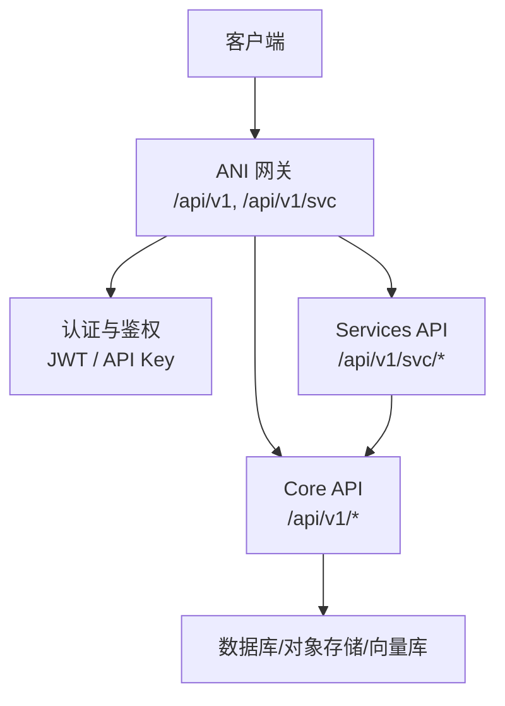
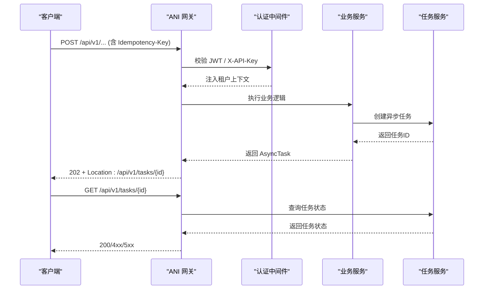
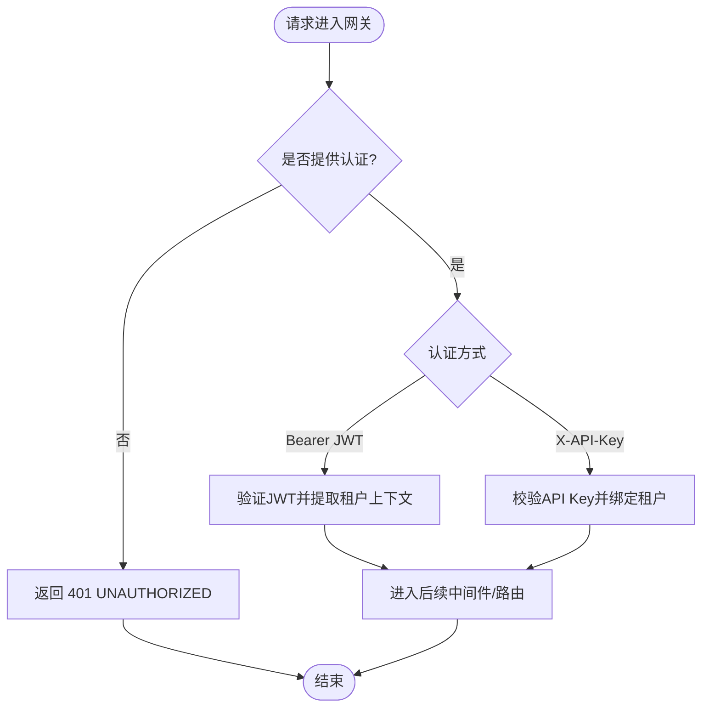
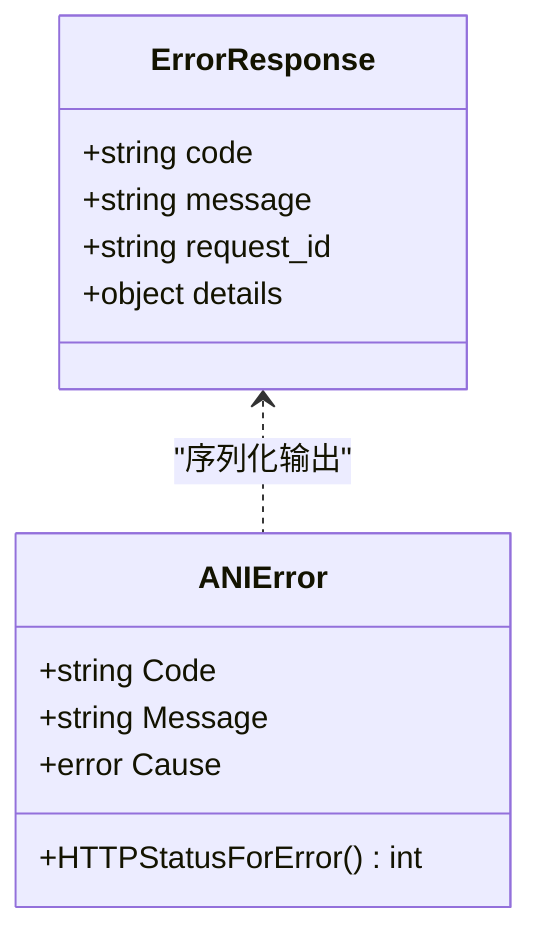
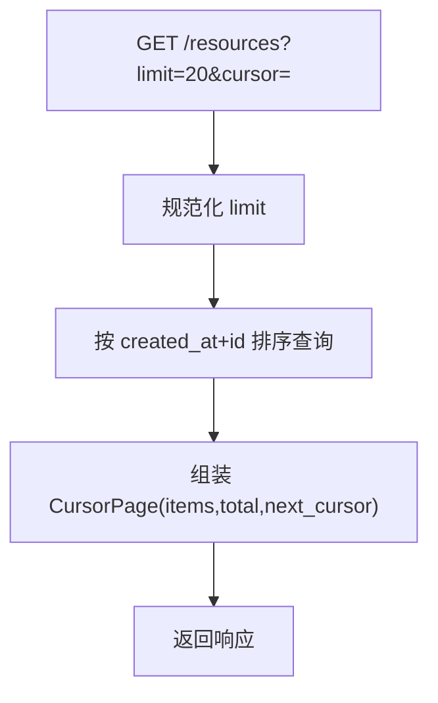
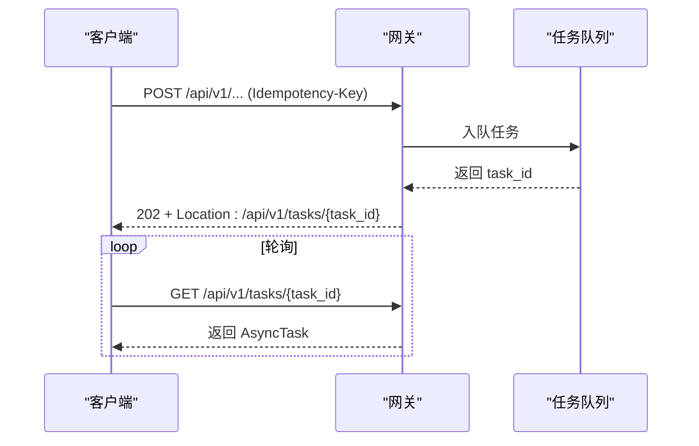
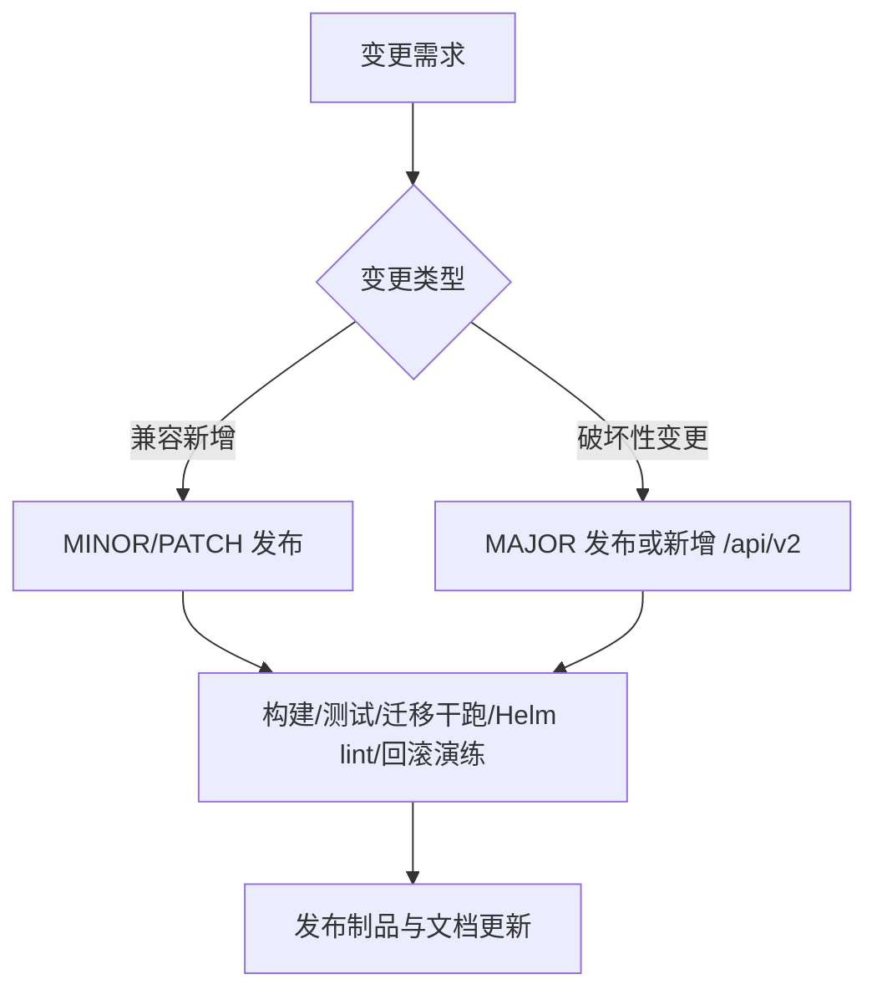
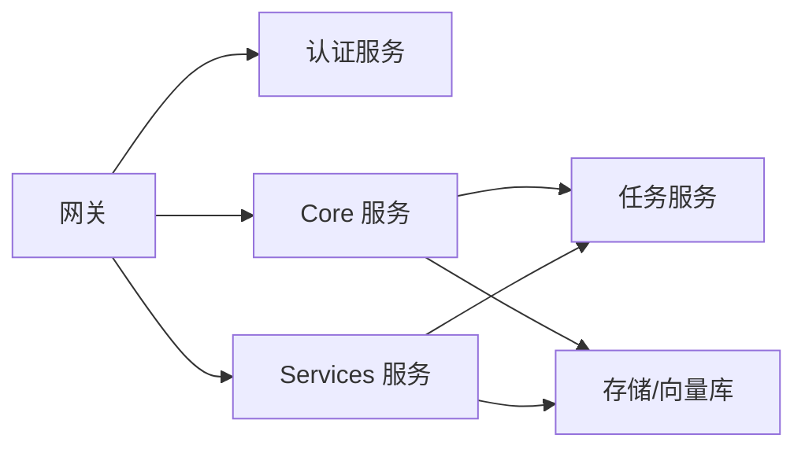

# 通用概念

<cite>
**本文引用的文件**
- [v1.yaml](file://repo/api/openapi/v1.yaml)
- [services_v1.yaml](file://repo/api/openapi/services/v1.yaml)
- [common.proto](file://repo/api/proto/common/v1/common.proto)
- [auth_service.proto](file://repo/api/proto/auth/v1/auth_service.proto)
- [pagination.go](file://repo/pkg/types/pagination.go)
- [errors.go](file://repo/pkg/types/errors.go)
- [ANI-12-版本管理策略.md](file://ANI-12-版本管理策略.md)
- [ANI-14-API对齐与开发工作流.md](file://ANI-14-API对齐与开发工作流.md)
- [core-v1-compatibility-baseline.yaml](file://repo/api/core-v1-compatibility-baseline.yaml)
</cite>

## 目录
1. [简介](#简介)
2. [项目结构](#项目结构)
3. [核心组件](#核心组件)
4. [架构总览](#架构总览)
5. [详细组件分析](#详细组件分析)
6. [依赖关系分析](#依赖关系分析)
7. [性能考虑](#性能考虑)
8. [故障排查指南](#故障排查指南)
9. [结论](#结论)
10. [附录](#附录)

## 简介
本文件面向所有调用方与实现方，统一说明 ANI 平台 REST API 的通用概念与规范，包括：
- 认证机制：Bearer JWT 与 X-API-Key
- 错误处理格式与标准错误码
- 分页机制：游标分页
- 异步操作模式：202 + AsyncTask 轮询或 Webhook
- 版本管理与向后兼容策略
- API 设计规范（路径前缀、幂等键、租户隔离）
- 通用特性：请求重试、超时、限流控制
- 标准请求/响应示例与最佳实践

## 项目结构
ANI 将“基础设施资源”与“业务服务资源”分层管理，并通过统一的网关入口对外暴露：
- Core API：以 /api/v1 为根路径，承载实例、存储、网络、加密、K8s 集群、计量、审计等基础设施能力。
- Services API：以 /api/v1/svc 为根路径，承载模型、推理服务、知识库等业务能力。
- OpenAPI 契约是唯一的真实来源，SDK 由契约生成；内部 gRPC 契约用于服务间通信。

图表来源
- [v1.yaml:16-45](file://repo/api/openapi/v1.yaml#L16-L45)
- [services_v1.yaml:11-20](file://repo/api/openapi/services/v1.yaml#L11-L20)

章节来源
- [v1.yaml:16-45](file://repo/api/openapi/v1.yaml#L16-L45)
- [services_v1.yaml:11-20](file://repo/api/openapi/services/v1.yaml#L11-L20)
- [ANI-14-API对齐与开发工作流.md:67-84](file://ANI-14-API对齐与开发工作流.md#L67-L84)

## 核心组件
- 认证与安全
  - Bearer JWT：短期访问令牌，通过 /auth/token 获取；tenant_id 从 JWT claims 提取，请求体中的 tenant_id 将被忽略。
  - X-API-Key：长期密钥，通过 Console 创建并在请求头中携带。
  - 服务身份：仅接受 aud=ani-core、principal_kind=service 的短期服务 JWT。
- 错误处理
  - 统一错误体：{ code, message, request_id, details? }
  - 标准错误码：UNAUTHORIZED / FORBIDDEN / NOT_FOUND / CONFLICT / BAD_REQUEST / RATE_LIMIT_EXCEEDED / NOT_IMPLEMENTED / INTERNAL_ERROR
- 分页
  - 游标分页：查询参数 limit、cursor；响应包含 items、total、next_cursor。
  - CursorPage 类型在 OpenAPI 与 Go 类型中保持一致。
- 异步操作
  - 202 Accepted + Location Header 指向任务 URL；响应体为 AsyncTask。
  - 支持轮询 GET /tasks/{task_id} 或配置 Webhook。
- 幂等性
  - 所有 POST 创建与有副作用的 PUT/PATCH 必须携带 idempotency_key（UUID），用于防重放与重试安全。

章节来源
- [v1.yaml:24-39](file://repo/api/openapi/v1.yaml#L24-L39)
- [v1.yaml:47-63](file://repo/api/openapi/v1.yaml#L47-L63)
- [v1.yaml:333-373](file://repo/api/openapi/v1.yaml#L333-L373)
- [services_v1.yaml:17-20](file://repo/api/openapi/services/v1.yaml#L17-L20)
- [services_v1.yaml:97-128](file://repo/api/openapi/services/v1.yaml#L97-L128)
- [ANI-14-API对齐与开发工作流.md:83-88](file://ANI-14-API对齐与开发工作流.md#L83-L88)

## 架构总览
下图展示一次典型异步操作的端到端流程：客户端提交创建请求，网关返回 202 与任务引用，随后客户端轮询任务状态直至完成。

图表来源
- [v1.yaml:24-39](file://repo/api/openapi/v1.yaml#L24-L39)
- [v1.yaml:351-373](file://repo/api/openapi/v1.yaml#L351-L373)
- [common.proto:30-36](file://repo/api/proto/common/v1/common.proto#L30-L36)

## 详细组件分析

### 认证机制（Bearer JWT 与 X-API-Key）
- 两种安全方案在 Core 与 Services 均声明，确保跨层一致。
- JWT 有效期短，适合用户会话；API Key 适合服务端集成与自动化。
- 服务身份使用受限 JWT，防止租户用户越权。

图表来源
- [v1.yaml:47-63](file://repo/api/openapi/v1.yaml#L47-L63)
- [services_v1.yaml:17-20](file://repo/api/openapi/services/v1.yaml#L17-L20)
- [auth_service.proto:11-30](file://repo/api/proto/auth/v1/auth_service.proto#L11-L30)

章节来源
- [v1.yaml:24-63](file://repo/api/openapi/v1.yaml#L24-L63)
- [services_v1.yaml:17-20](file://repo/api/openapi/services/v1.yaml#L17-L20)
- [auth_service.proto:11-30](file://repo/api/proto/auth/v1/auth_service.proto#L11-L30)

### 错误处理格式与标准错误码
- 统一错误体包含 code、message、request_id，可选 details。
- 错误码映射到 HTTP 状态码，便于客户端快速判断。
- 内部原因不暴露给客户端，仅记录日志。

图表来源
- [v1.yaml:333-342](file://repo/api/openapi/v1.yaml#L333-L342)
- [errors.go:21-49](file://repo/pkg/types/errors.go#L21-L49)
- [errors.go:51-67](file://repo/pkg/types/errors.go#L51-L67)

章节来源
- [v1.yaml:333-342](file://repo/api/openapi/v1.yaml#L333-L342)
- [errors.go:21-49](file://repo/pkg/types/errors.go#L21-L49)
- [errors.go:51-67](file://repo/pkg/types/errors.go#L51-L67)

### 分页机制（Cursor Page）
- 列表接口统一使用 cursor 分页：limit（默认20，最大100）、cursor（上页 next_cursor）。
- 响应包含 total、items、next_cursor；next_cursor 为空表示最后一页。
- Go 侧提供 EncodeCursor/DecodeCursor，保证游标不可篡改且稳定排序。

图表来源
- [v1.yaml:343-350](file://repo/api/openapi/v1.yaml#L343-L350)
- [pagination.go:12-34](file://repo/pkg/types/pagination.go#L12-L34)
- [pagination.go:36-63](file://repo/pkg/types/pagination.go#L36-L63)

章节来源
- [v1.yaml:343-350](file://repo/api/openapi/v1.yaml#L343-L350)
- [pagination.go:12-63](file://repo/pkg/types/pagination.go#L12-L63)

### 异步操作模式（AsyncTask）
- 写操作若耗时较长，返回 202 与 AsyncTask，Location 指向任务查询接口。
- 客户端可轮询任务状态，或配置 Webhook 接收完成通知。
- 任务状态包括 pending、running、completed、failed、cancelled、dead_letter。

图表来源
- [v1.yaml:36-39](file://repo/api/openapi/v1.yaml#L36-L39)
- [v1.yaml:351-373](file://repo/api/openapi/v1.yaml#L351-L373)
- [common.proto:30-36](file://repo/api/proto/common/v1/common.proto#L30-L36)

章节来源
- [v1.yaml:36-39](file://repo/api/openapi/v1.yaml#L36-L39)
- [v1.yaml:351-373](file://repo/api/openapi/v1.yaml#L351-L373)
- [common.proto:30-36](file://repo/api/proto/common/v1/common.proto#L30-L36)

### 版本管理与向后兼容
- API 契约以 OpenAPI YAML 为唯一真实来源；Core 与 Services 分别维护 v1.yaml。
- 兼容性规则：允许新增字段、枚举值、接口；禁止删除路径/方法/必填字段、修改已有签名。
- 破坏性变更需升级 MAJOR 或新增 /api/v2 并保留 /api/v1。
- 发布遵循 SemVer，首个正式版本 v1.0.0，预发布采用 alpha/beta/rc。

图表来源
- [ANI-12-版本管理策略.md:73-93](file://ANI-12-版本管理策略.md#L73-L93)
- [ANI-12-版本管理策略.md:169-187](file://ANI-12-版本管理策略.md#L169-L187)
- [core-v1-compatibility-baseline.yaml:5-18](file://repo/api/core-v1-compatibility-baseline.yaml#L5-L18)

章节来源
- [ANI-12-版本管理策略.md:73-93](file://ANI-12-版本管理策略.md#L73-L93)
- [ANI-12-版本管理策略.md:169-187](file://ANI-12-版本管理策略.md#L169-L187)
- [core-v1-compatibility-baseline.yaml:5-18](file://repo/api/core-v1-compatibility-baseline.yaml#L5-L18)

### API 设计规范
- 路径前缀：Core 使用 /api/v1，Services 使用 /api/v1/svc。
- 幂等键：所有 POST 创建与有副作用的 PUT/PATCH 必须携带 idempotency_key（UUID）。
- 租户隔离：handler 必须从中间件获取 tenant_id，不得信任请求体或查询参数。
- 响应码：同步创建 201，异步 202，查询 200；错误码与 HTTP 状态严格对应。

章节来源
- [ANI-14-API对齐与开发工作流.md:67-88](file://ANI-14-API对齐与开发工作流.md#L67-L88)

### 通用特性：重试、超时、限流
- 重试：客户端应在幂等键保护下进行有限重试；服务端对重复请求基于幂等键去重。
- 超时：网关与服务应设置合理超时，避免长尾阻塞；对下游依赖调用需带超时与熔断。
- 限流：网关层对 API Key 与租户维度进行速率限制，超限返回 RATE_LIMIT_EXCEEDED。

章节来源
- [errors.go:45-49](file://repo/pkg/types/errors.go#L45-L49)
- [ANI-14-API对齐与开发工作流.md:83-88](file://ANI-14-API对齐与开发工作流.md#L83-L88)

## 依赖关系分析
- 认证依赖：Gateway 中间件调用 Auth 服务校验 JWT 或 API Key，并注入 TenantContext。
- 数据访问：Core/Services 通过适配器与端口抽象访问数据库、对象存储、向量库等。
- 任务系统：写操作通过任务服务异步执行，支持重试、死信队列与进度上报。

图表来源
- [auth_service.proto:11-30](file://repo/api/proto/auth/v1/auth_service.proto#L11-L30)
- [common.proto:9-16](file://repo/api/proto/common/v1/common.proto#L9-L16)
- [v1.yaml:351-373](file://repo/api/openapi/v1.yaml#L351-L373)

## 性能考虑
- 分页：使用游标分页避免深度翻页开销；限制每页大小上限。
- 异步：长耗时操作一律异步化，减少连接占用与超时风险。
- 缓存：对只读热点数据（如规格清单）引入缓存层，降低后端压力。
- 超时与重试：为外部依赖设置超时与退避重试，避免雪崩。
- 限流：对高频接口实施限流，保障整体稳定性。

## 故障排查指南
- 认证失败：检查 JWT 是否过期或 scope 不足；确认 API Key 是否有效且未吊销。
- 权限拒绝：确认租户上下文正确，RBAC 策略是否允许该操作。
- 资源不存在：核对路径参数是否为合法 UUID，资源是否已创建。
- 冲突：检查是否存在同名资源或并发写入导致的冲突。
- 限流：关注 RATE_LIMIT_EXCEEDED，调整客户端重试间隔或申请更高配额。
- 任务失败：查看 AsyncTask 的 error_message 与 attempt_count，必要时重试或人工介入。

章节来源
- [errors.go:51-67](file://repo/pkg/types/errors.go#L51-L67)
- [v1.yaml:333-342](file://repo/api/openapi/v1.yaml#L333-L342)
- [v1.yaml:351-373](file://repo/api/openapi/v1.yaml#L351-L373)

## 结论
本规范统一了 ANI 平台的认证、错误、分页、异步、版本与 API 设计原则，并提供重试、超时、限流等通用能力建议。遵循这些约定可显著提升系统的可维护性、可扩展性与稳定性，同时为多语言 SDK 与第三方集成提供清晰契约。

## 附录

### 标准请求与响应示例（路径参考）
- 认证
  - 登录获取令牌：POST /auth/token
  - 刷新令牌：POST /auth/refresh
  - 登出/撤销：POST /auth/logout
- 资源操作
  - 列表：GET /api/v1/{resource}?limit=20&cursor=<token>
  - 创建：POST /api/v1/{resource}（含 Idempotency-Key）
  - 更新：PUT/PATCH /api/v1/{resource}/{id}（含 Idempotency-Key）
  - 删除：DELETE /api/v1/{resource}/{id}
- 异步任务
  - 查询任务：GET /api/v1/tasks/{task_id}

章节来源
- [v1.yaml:24-39](file://repo/api/openapi/v1.yaml#L24-L39)
- [v1.yaml:333-373](file://repo/api/openapi/v1.yaml#L333-L373)
- [services_v1.yaml:97-128](file://repo/api/openapi/services/v1.yaml#L97-L128)

### 最佳实践清单
- 始终使用幂等键保护写操作，避免重复提交。
- 使用游标分页，不要依赖 offset。
- 对长耗时操作使用异步模式，并实现轮询或 Webhook。
- 严格区分 Core 与 Services 的路径前缀。
- 从中间件获取租户上下文，不在请求体中传递敏感标识。
- 客户端实现指数退避重试，遇到限流时主动降速。
- 遵循版本策略，破坏性变更走 MAJOR 或新增 /api/v2。

章节来源
- [ANI-14-API对齐与开发工作流.md:67-88](file://ANI-14-API对齐与开发工作流.md#L67-L88)
- [ANI-12-版本管理策略.md:73-93](file://ANI-12-版本管理策略.md#L73-L93)