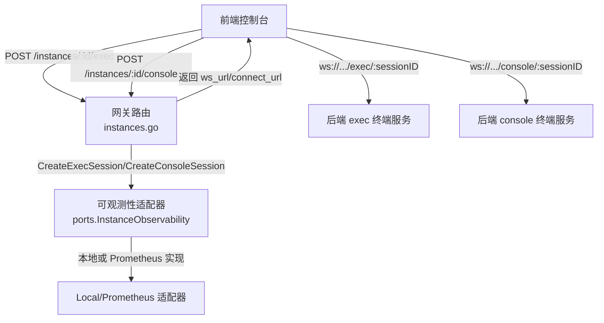
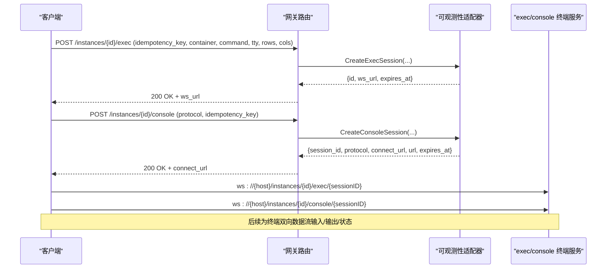
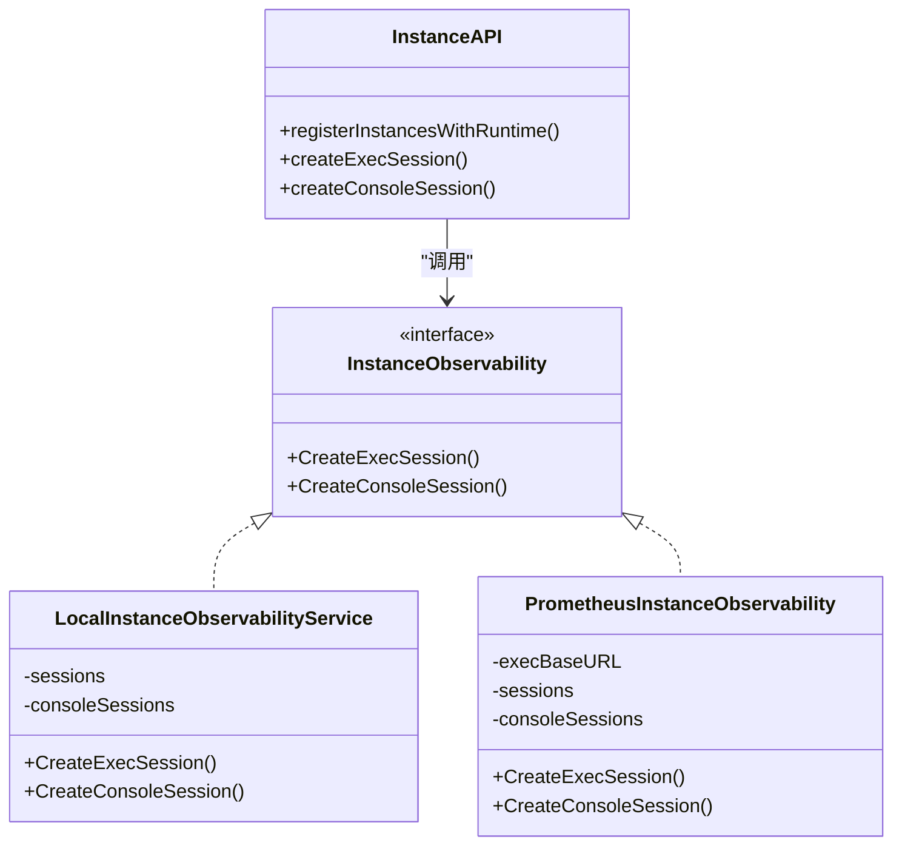
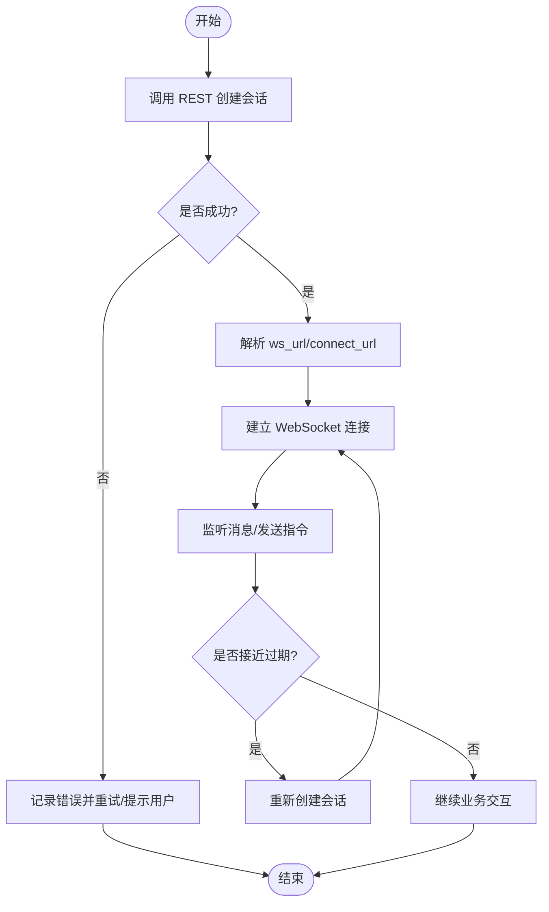

# WebSocket 接口

<cite>
**本文引用的文件**
- [instances.go](file://repo/services/ani-gateway/internal/router/instances.go)
- [instance_observability.go](file://repo/pkg/ports/instance_observability.go)
- [local_instance_observability_service.go](file://repo/pkg/adapters/runtime/local_instance_observability_service.go)
- [prometheus_instance_observability.go](file://repo/pkg/adapters/runtime/prometheus_instance_observability.go)
- [DemoConsolePage.tsx](file://repo/frontends/console/src/demo/DemoConsolePage.tsx)
</cite>

## 目录
1. [简介](#简介)
2. [项目结构](#项目结构)
3. [核心组件](#核心组件)
4. [架构总览](#架构总览)
5. [详细组件分析](#详细组件分析)
6. [依赖关系分析](#依赖关系分析)
7. [性能与可靠性](#性能与可靠性)
8. [故障排查指南](#故障排查指南)
9. [结论](#结论)
10. [附录](#附录)

## 简介
本文件面向客户端与集成方，说明 ANI 平台中基于 WebSocket 的实时通信能力。重点包括：
- 连接建立流程：通过 REST 创建会话，获取可连接的 WebSocket URL 与会话有效期。
- 消息格式与事件类型：exec（容器内命令执行）与 console（VM/VNC 控制台）两类通道。
- 心跳、重连与错误恢复策略建议。
- 在实例控制台、日志流、任务监控等场景中的使用方式。
- 前端连接示例与事件监听实现要点。

## 项目结构
WebSocket 相关能力由网关路由层统一暴露，后端通过“可观测性适配器”生成会话信息并返回 WebSocket 地址；前端先调用 REST 创建会话，再根据返回的 connect_url/ws_url 建立 WebSocket 连接。

图表来源
- [instances.go:779-808](file://repo/services/ani-gateway/internal/router/instances.go#L779-L808)
- [instance_observability.go:88-136](file://repo/pkg/ports/instance_observability.go#L88-L136)
- [local_instance_observability_service.go:113-181](file://repo/pkg/adapters/runtime/local_instance_observability_service.go#L113-L181)
- [prometheus_instance_observability.go:378-448](file://repo/pkg/adapters/runtime/prometheus_instance_observability.go#L378-L448)

章节来源
- [instances.go:779-808](file://repo/services/ani-gateway/internal/router/instances.go#L779-L808)

## 核心组件
- 网关路由层：注册实例相关的 REST 端点，包含 exec 与 console 会话创建接口。
- 可观测性端口定义：抽象出 CreateExecSession 与 CreateConsoleSession 的能力契约。
- 适配器实现：
  - LocalInstanceObservabilityService：开发/本地环境下的内存会话管理，直接构造 ws:// 地址。
  - PrometheusInstanceObservability：生产/集群环境下，结合配置构建 wss:// 地址，支持幂等与会话缓存。
- 前端演示页：展示如何发起控制台请求、显示会话元数据与执行命令。

章节来源
- [instance_observability.go:88-136](file://repo/pkg/ports/instance_observability.go#L88-L136)
- [local_instance_observability_service.go:113-181](file://repo/pkg/adapters/runtime/local_instance_observability_service.go#L113-L181)
- [prometheus_instance_observability.go:378-448](file://repo/pkg/adapters/runtime/prometheus_instance_observability.go#L378-L448)
- [DemoConsolePage.tsx:42-80](file://repo/frontends/console/src/demo/DemoConsolePage.tsx#L42-L80)

## 架构总览
下图展示了从前端到后端的完整交互链路：REST 创建会话 → 返回 WebSocket URL → 前端建立 WS 连接 → 双向传输终端数据。

图表来源
- [instances.go:779-808](file://repo/services/ani-gateway/internal/router/instances.go#L779-L808)
- [instance_observability.go:88-136](file://repo/pkg/ports/instance_observability.go#L88-L136)
- [local_instance_observability_service.go:113-181](file://repo/pkg/adapters/runtime/local_instance_observability_service.go#L113-L181)
- [prometheus_instance_observability.go:378-448](file://repo/pkg/adapters/runtime/prometheus_instance_observability.go#L378-L448)

## 详细组件分析

### 会话创建与协议选择
- exec 会话：用于容器内命令执行，返回 ws_url 与会话过期时间。
- console 会话：用于 VM/VNC 控制台，返回 session_id、protocol、connect_url/url 与会话过期时间。
- 幂等键：exec 会话要求 idempotency_key；console 会话可选 idempotency_key 以复用已有会话。

章节来源
- [instance_observability.go:88-136](file://repo/pkg/ports/instance_observability.go#L88-L136)
- [local_instance_observability_service.go:113-181](file://repo/pkg/adapters/runtime/local_instance_observability_service.go#L113-L181)
- [prometheus_instance_observability.go:378-448](file://repo/pkg/adapters/runtime/prometheus_instance_observability.go#L378-L448)

### 适配器实现差异
- Local 适配器：
  - 会话存储在内存 map 中，按租户+实例+幂等键去重。
  - ws_url/connect_url 固定为本地回环地址，便于开发调试。
  - 默认协议为空时归一化为 vnc。
- Prometheus 适配器：
  - 会话同样内存缓存，但 ws_url/connect_url 基于配置的 ExecBaseURL（通常为 wss://gateway/...）。
  - 支持注入日志存储（LogStore），未注入时回退到 K8s Pod Log API。
  - 指标采集兼容 VM 与容器/GPU 容器场景。

章节来源
- [local_instance_observability_service.go:113-181](file://repo/pkg/adapters/runtime/local_instance_observability_service.go#L113-L181)
- [prometheus_instance_observability.go:378-448](file://repo/pkg/adapters/runtime/prometheus_instance_observability.go#L378-L448)

### 前端控制台示例
- 页面会先调用 demo 控制台接口获取实例信息与会话元数据，然后渲染连接信息、执行命令并展示输出。
- 该示例体现了“先 REST 创建会话，再根据返回的 connect_url 进行后续操作”的模式。

章节来源
- [DemoConsolePage.tsx:42-80](file://repo/frontends/console/src/demo/DemoConsolePage.tsx#L42-L80)

## 依赖关系分析
- 网关路由依赖 InstanceObservability 接口，具体实现可在本地或 Prometheus 之间切换。
- 适配器内部维护会话映射，保证幂等与并发安全。
- 前端仅依赖 REST 返回的连接信息，不感知后端适配器细节。

图表来源
- [instances.go:779-808](file://repo/services/ani-gateway/internal/router/instances.go#L779-L808)
- [instance_observability.go:88-136](file://repo/pkg/ports/instance_observability.go#L88-L136)
- [local_instance_observability_service.go:113-181](file://repo/pkg/adapters/runtime/local_instance_observability_service.go#L113-L181)
- [prometheus_instance_observability.go:378-448](file://repo/pkg/adapters/runtime/prometheus_instance_observability.go#L378-L448)

章节来源
- [instances.go:779-808](file://repo/services/ani-gateway/internal/router/instances.go#L779-L808)

## 性能与可靠性
- 会话缓存：适配器对会话采用内存缓存与读写锁保护，避免重复创建与竞态。
- 超时控制：会话记录中包含 expires_at，客户端应在过期前完成连接或刷新会话。
- 降级路径：Prometheus 适配器在未注入日志存储时回退到 K8s Pod Log API，保障可用性。
- 指标采集：容器与 VM 指标分别处理，单 exporter 不可用时字段降级为 nil，不影响其他字段。

章节来源
- [local_instance_observability_service.go:113-181](file://repo/pkg/adapters/runtime/local_instance_observability_service.go#L113-L181)
- [prometheus_instance_observability.go:88-140](file://repo/pkg/adapters/runtime/prometheus_instance_observability.go#L88-L140)
- [prometheus_instance_observability.go:155-324](file://repo/pkg/adapters/runtime/prometheus_instance_observability.go#L155-L324)

## 故障排查指南
- 参数校验失败：若缺少必要字段（如 tenant_id、instance_id、idempotency_key），将返回无效参数错误。
- 会话不存在或已过期：客户端应检查返回的 expires_at，并在必要时重新创建会话。
- 网络问题：wss 连接需确保证书与代理配置正确；ws 仅适用于本地开发。
- 日志查询异常：当注入日志存储失败或未注入时，Prometheus 适配器会回退到 K8s Pod Log API。

章节来源
- [local_instance_observability_service.go:183-199](file://repo/pkg/adapters/runtime/local_instance_observability_service.go#L183-L199)
- [prometheus_instance_observability.go:88-140](file://repo/pkg/adapters/runtime/prometheus_instance_observability.go#L88-L140)

## 结论
ANI 平台的 WebSocket 能力通过“REST 创建会话 + 返回 WebSocket URL”的方式解耦了认证与会话生命周期管理，适配不同运行环境（本地/集群）并提供一致的接口契约。客户端只需关注 REST 响应中的 ws_url/connect_url 与 expires_at，即可建立稳定的终端连接。

## 附录

### 接口清单与字段说明
- 创建 exec 会话
  - 方法/路径：POST /instances/{instance_id}/exec
  - 请求体关键字段：idempotency_key、container、command、tty、rows、cols
  - 响应关键字段：id、ws_url、expires_at、dev_profile
- 创建 console 会话
  - 方法/路径：POST /instances/{instance_id}/console
  - 请求体关键字段：protocol、idempotency_key
  - 响应关键字段：session_id、protocol、connect_url、url、expires_at、dev_profile

章节来源
- [instances.go:779-808](file://repo/services/ani-gateway/internal/router/instances.go#L779-L808)
- [instance_observability.go:88-136](file://repo/pkg/ports/instance_observability.go#L88-L136)

### 连接与使用流程

[此图为概念流程图，无需源码引用]

### 心跳、重连与错误恢复建议
- 心跳机制：建议在应用层实现周期性 ping/pong，服务端可根据空闲超时断开连接。
- 重连策略：指数退避 + 抖动，最大重试次数限制；每次重连前检查 expires_at，必要时先刷新会话。
- 错误恢复：捕获连接关闭与网络错误，区分瞬时错误与永久错误；对终端类错误提供用户可见提示。

[本节为通用实践建议，不直接分析具体文件]

### 典型使用场景
- 实例控制台：通过 console 会话接入 VM/VNC 控制台，protocol 默认为 vnc。
- 日志流：通过 REST 拉取日志列表（非 WebSocket），结合分页 cursor 实现滚动加载。
- 任务监控：通过 REST 查询任务/操作状态，配合 WebSocket 终端进行交互式运维。

章节来源
- [DemoConsolePage.tsx:42-80](file://repo/frontends/console/src/demo/DemoConsolePage.tsx#L42-L80)
- [prometheus_instance_observability.go:88-140](file://repo/pkg/adapters/runtime/prometheus_instance_observability.go#L88-L140)