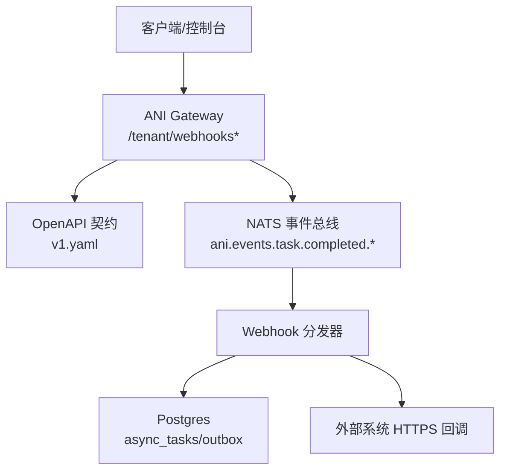
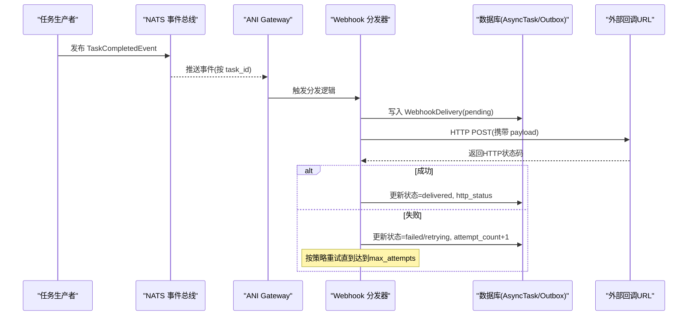
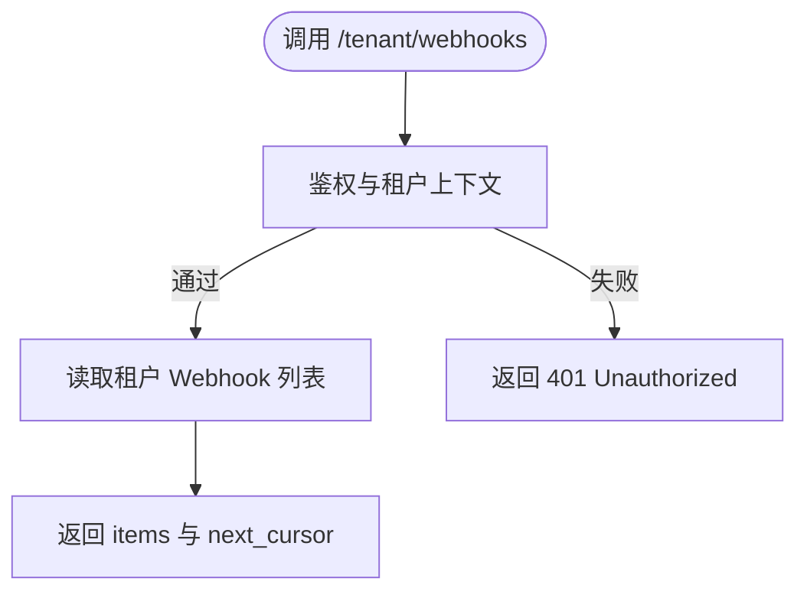
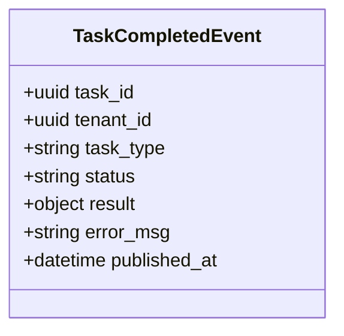
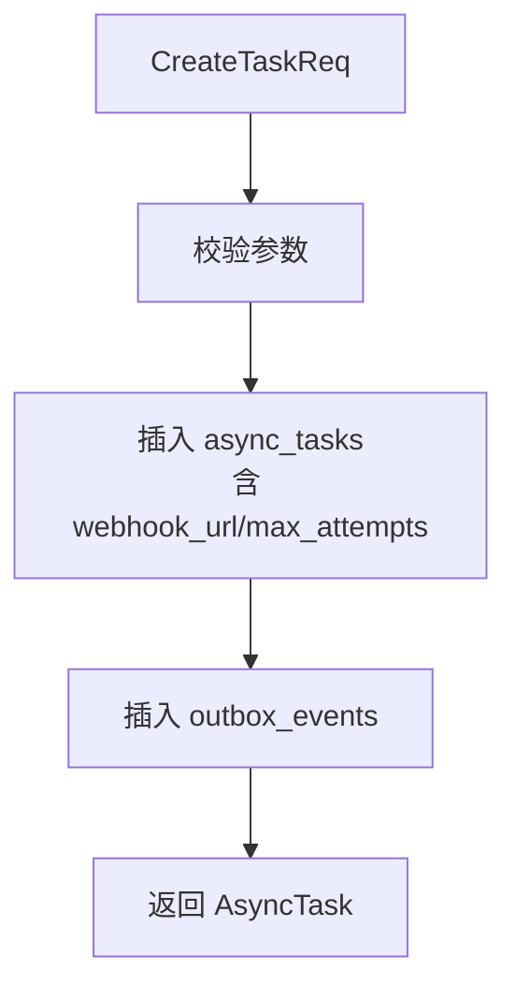
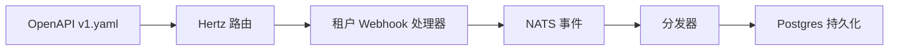

# Webhook 接口

<cite>
**本文引用的文件**
- [services/v1.yaml](file://repo/api/openapi/services/v1.yaml)
- [messages.go](file://repo/pkg/nats/messages.go)
- [tenant_resources.go](file://repo/services/ani-gateway/internal/router/tenant_resources.go)
- [task_repo.go](file://repo/pkg/repo/task_repo.go)
- [ops-webhook.md](file://docs/ANI-boss-email-notification-docs/references/boss-modules/integration/ops-webhook.md)
</cite>

## 目录
1. [简介](#简介)
2. [项目结构](#项目结构)
3. [核心组件](#核心组件)
4. [架构总览](#架构总览)
5. [详细组件分析](#详细组件分析)
6. [依赖关系分析](#依赖关系分析)
7. [性能与可靠性](#性能与可靠性)
8. [故障排查指南](#故障排查指南)
9. [结论](#结论)
10. [附录](#附录)

## 简介
本文件面向“Webhook 接口”的集成与使用，聚焦以下目标：
- 事件通知机制：基于异步任务完成事件进行出站投递。
- Webhook 注册与管理：租户级 Webhook 的创建、删除与投递日志查询。
- 回调 URL 配置：通过 OpenAPI 定义请求体字段与校验规则。
- 支持的事件类型：以任务生命周期事件为主，并扩展平台运维事件（文档层面）。
- 消息 Payload 格式：统一 NATS 事件结构与投递记录结构。
- 重试机制：基于异步任务执行器与投递状态机实现。
- Webhook 服务器示例：提供事件处理、签名验证、错误处理的参考实现建议。
- 应用场景：自动化工作流与第三方系统集成。

## 项目结构
仓库中与 Webhook 相关的关键位置：
- API 契约：OpenAPI 定义了租户 Webhook 的 CRUD 与投递日志查询。
- 网关路由：Hertz 路由组暴露 /tenant/webhooks 系列端点。
- 事件总线：NATS subject 发布任务完成事件，供 Gateway SSE 与 Webhook 分发消费。
- 任务持久化：Postgres 存储异步任务、最大尝试次数、webhook_url 等。
- 文档：平台运维 Webhook 设计文档补充了事件类型、字段口径与错误示例。

**图表来源**
- [tenant_resources.go:12-22](file://repo/services/ani-gateway/internal/router/tenant_resources.go#L12-L22)
- [services/v1.yaml:2305-2370](file://repo/api/openapi/services/v1.yaml#L2305-L2370)
- [messages.go:115-133](file://repo/pkg/nats/messages.go#L115-L133)
- [task_repo.go:74-125](file://repo/pkg/repo/task_repo.go#L74-L125)

**章节来源**
- [services/v1.yaml:2305-2370](file://repo/api/openapi/services/v1.yaml#L2305-L2370)
- [tenant_resources.go:12-22](file://repo/services/ani-gateway/internal/router/tenant_resources.go#L12-L22)
- [messages.go:115-133](file://repo/pkg/nats/messages.go#L115-L133)
- [task_repo.go:74-125](file://repo/pkg/repo/task_repo.go#L74-L125)

## 核心组件
- 租户 Webhook 管理 API
  - GET /tenant/webhooks：列出当前租户已注册的 Webhook。
  - POST /tenant/webhooks：创建 Webhook，包含 idempotency_key、url、events、可选 secret。
  - DELETE /tenant/webhooks/{webhook_id}：删除指定 Webhook。
  - GET /tenant/webhooks/{webhook_id}/deliveries：分页查询投递日志，支持 status 过滤。
- 事件模型
  - TaskCompletedEvent：任务完成事件，包含 task_id、tenant_id、task_type、status、result/error_msg、published_at。
  - Subject：ani.events.task.completed.{task_id}。
- 任务与投递
  - AsyncTask：持久化任务元数据，包括 max_attempts、webhook_url、attempt_count、status 等。
  - WebhookDelivery：单次投递记录，包含 event_type、payload、status、http_status、attempt_count、created_at/delivered_at。

**章节来源**
- [services/v1.yaml:558-576](file://repo/api/openapi/services/v1.yaml#L558-L576)
- [services/v1.yaml:744-763](file://repo/api/openapi/services/v1.yaml#L744-L763)
- [services/v1.yaml:2305-2370](file://repo/api/openapi/services/v1.yaml#L2305-L2370)
- [messages.go:115-133](file://repo/pkg/nats/messages.go#L115-L133)
- [task_repo.go:40-72](file://repo/pkg/repo/task_repo.go#L40-L72)

## 架构总览
Webhook 的整体流程如下：
- 业务服务完成任务后，向 NATS 发布 TaskCompletedEvent。
- Gateway 或专用分发器订阅该事件，根据租户 Webhook 订阅列表匹配事件类型。
- 将事件封装为 WebhookDelivery 写入持久层，并发起 HTTP 回调到配置的 url。
- 根据响应码更新投递状态；失败时按策略重试，直至达到最大尝试次数。

**图表来源**
- [messages.go:115-133](file://repo/pkg/nats/messages.go#L115-L133)
- [services/v1.yaml:744-763](file://repo/api/openapi/services/v1.yaml#L744-L763)
- [task_repo.go:74-125](file://repo/pkg/repo/task_repo.go#L74-L125)

## 详细组件分析

### 租户 Webhook 管理 API
- 列表：GET /tenant/webhooks
  - 响应：items 数组，每项为 Webhook。
- 创建：POST /tenant/webhooks
  - 请求体：CreateWebhookRequest，必填 idempotency_key、url、events；可选 secret。
  - 响应：201 + Webhook。
  - 错误：400、401、409、422。
- 删除：DELETE /tenant/webhooks/{webhook_id}
  - 响应：204。
  - 错误：401、403、404。
- 投递日志：GET /tenant/webhooks/{webhook_id}/deliveries
  - 查询参数：limit、cursor、status（pending/delivered/failed/retrying）。
  - 响应：WebhookDeliveryListResponse。

**图表来源**
- [services/v1.yaml:2305-2370](file://repo/api/openapi/services/v1.yaml#L2305-L2370)
- [tenant_resources.go:12-22](file://repo/services/ani-gateway/internal/router/tenant_resources.go#L12-L22)

**章节来源**
- [services/v1.yaml:2305-2370](file://repo/api/openapi/services/v1.yaml#L2305-L2370)
- [services/v1.yaml:558-576](file://repo/api/openapi/services/v1.yaml#L558-L576)
- [services/v1.yaml:744-763](file://repo/api/openapi/services/v1.yaml#L744-L763)
- [tenant_resources.go:12-22](file://repo/services/ani-gateway/internal/router/tenant_resources.go#L12-L22)

### 事件模型与主题
- 主题命名：ani.events.task.completed.{task_id}
- 事件结构：TaskCompletedEvent
  - 关键字段：task_id、tenant_id、task_type、status、result、error_msg、published_at。
- 消费者：Gateway SSE 推送器、Webhook 分发器。

**图表来源**
- [messages.go:115-133](file://repo/pkg/nats/messages.go#L115-L133)

**章节来源**
- [messages.go:115-133](file://repo/pkg/nats/messages.go#L115-L133)

### 任务与投递持久化
- AsyncTask 字段：
  - 标识：tenant_id、idempotency_key、task_type、resource_type、resource_id。
  - 执行：status、attempt_count、max_attempts、progress_pct、lease_owner、lease_until、last_heartbeat_at、dead_letter_at。
  - 回调：webhook_url。
  - 时间：created_at、started_at、completed_at。
- 创建任务时同时写入 outbox_events，用于后续事件分发。
- 最大尝试次数默认值：若未设置则默认为 3。

**图表来源**
- [task_repo.go:74-125](file://repo/pkg/repo/task_repo.go#L74-L125)

**章节来源**
- [task_repo.go:40-72](file://repo/pkg/repo/task_repo.go#L40-L72)
- [task_repo.go:74-125](file://repo/pkg/repo/task_repo.go#L74-L125)

### 平台运维 Webhook（概念与边界）
- 平台级 Webhook 用于跨租户出站告警与运营事件，区别于租户 Webhook。
- 文档中定义了页面目标字段、查询/写入/返回字段、状态与能力口径、错误示例等。
- 注意：Core v1.yaml 尚未包含 platform ops webhook path，需待 YAML 合入后对齐。

**章节来源**
- [ops-webhook.md:128-383](file://docs/ANI-boss-email-notification-docs/references/boss-modules/integration/ops-webhook.md#L128-L383)
- [ops-webhook.md:385-449](file://docs/ANI-boss-email-notification-docs/references/boss-modules/integration/ops-webhook.md#L385-L449)

## 依赖关系分析
- API 契约驱动：所有 Webhook 相关路径与 Schema 由 services/v1.yaml 冻结。
- 网关路由：Hertz 路由组将 /tenant/webhooks* 映射到具体 handler。
- 事件总线：NATS subject 作为解耦通道，确保任务完成事件可被多消费者订阅。
- 持久化：Postgres 存储任务与投递记录，支撑重试与审计。

**图表来源**
- [services/v1.yaml:2305-2370](file://repo/api/openapi/services/v1.yaml#L2305-L2370)
- [tenant_resources.go:12-22](file://repo/services/ani-gateway/internal/router/tenant_resources.go#L12-L22)
- [messages.go:115-133](file://repo/pkg/nats/messages.go#L115-L133)
- [task_repo.go:74-125](file://repo/pkg/repo/task_repo.go#L74-L125)

**章节来源**
- [services/v1.yaml:2305-2370](file://repo/api/openapi/services/v1.yaml#L2305-L2370)
- [tenant_resources.go:12-22](file://repo/services/ani-gateway/internal/router/tenant_resources.go#L12-L22)
- [messages.go:115-133](file://repo/pkg/nats/messages.go#L115-L133)
- [task_repo.go:74-125](file://repo/pkg/repo/task_repo.go#L74-L125)

## 性能与可靠性
- 幂等性：创建 Webhook 要求 idempotency_key，避免重复提交。
- 重试策略：
  - 基于 AsyncTask.max_attempts 控制最大尝试次数。
  - WebhookDelivery.status 反映 pending/delivered/failed/retrying。
- 超时与背压：
  - 建议在分发器中为 HTTP 回调设置超时与退避策略。
  - 对瞬时错误采用指数退避，对永久错误尽快标记 failed。
- 可观测性：
  - 通过 deliveries list 查看最近投递状态与 HTTP 状态码。
  - 结合任务进度与心跳信息定位长耗时任务。

[本节为通用指导，不直接分析具体文件]

## 故障排查指南
- 常见问题
  - 401 Unauthorized：缺少认证或租户上下文不正确。
  - 403 Forbidden：无权限访问 Webhook 资源。
  - 404 Not Found：webhook_id 不存在。
  - 400 Bad Request：请求体字段缺失或格式非法（如 url 非合法 URI）。
  - 409 Conflict：idempotency_key 冲突。
  - 422 Precondition Failed：预条件校验失败（如 events 为空）。
- 排查步骤
  - 检查 /tenant/webhooks/{webhook_id}/deliveries 中的 status 与 http_status。
  - 核对事件类型是否匹配订阅列表。
  - 确认 webhook_url 可达且返回期望状态码。
  - 检查 AsyncTask 的 attempt_count 与 max_attempts 是否已达上限。

**章节来源**
- [services/v1.yaml:2305-2370](file://repo/api/openapi/services/v1.yaml#L2305-L2370)
- [services/v1.yaml:558-576](file://repo/api/openapi/services/v1.yaml#L558-L576)
- [services/v1.yaml:744-763](file://repo/api/openapi/services/v1.yaml#L744-L763)

## 结论
本仓库提供了租户级 Webhook 的完整 API 契约与基础实现骨架，并通过 NATS 事件与 Postgres 持久化实现了可靠的任务完成通知与投递追踪。平台运维 Webhook 在文档层面已有明确规划，待 Core YAML 合入后进一步对齐。集成方应遵循幂等、重试与可观测性最佳实践，确保回调稳定可靠。

[本节为总结，不直接分析具体文件]

## 附录

### Webhook 服务器实现示例（参考）
以下为参考实现要点，便于构建健壮的外部回调服务：
- 事件处理
  - 接收 POST 请求，解析 JSON body 为事件对象。
  - 根据 event_type 路由到对应处理器。
- 签名验证
  - 若 Webhook 配置了 secret，应在请求头中携带签名（例如 X-Signature）。
  - 服务端使用共享密钥计算 HMAC 并与请求头比对，不一致则拒绝。
- 错误处理
  - 对业务异常返回明确的 4xx/5xx 状态码。
  - 对临时网络错误返回 5xx，以便发送方重试。
- 幂等与去重
  - 基于事件 ID 或任务 ID 做本地去重，避免重复处理。
- 可观测性
  - 记录请求时间、事件类型、处理结果与耗时。
  - 暴露健康检查与健康指标。

[本节为概念性说明，不直接分析具体文件]

### 典型应用场景
- 自动化工作流
  - 任务完成后自动触发下游流水线（如部署、测试、归档）。
- 第三方系统集成
  - 将平台告警与运营事件推送到 PagerDuty、Slack、钉钉、企业微信等。
- 审计与合规
  - 保留投递日志与 HTTP 状态码，满足审计需求。

[本节为概念性说明，不直接分析具体文件]