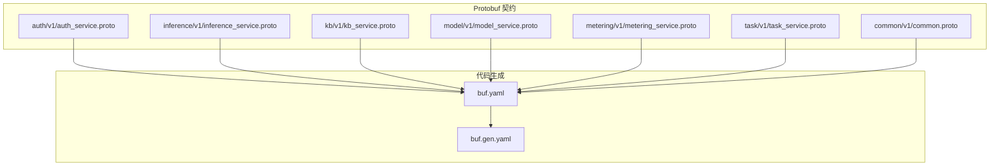
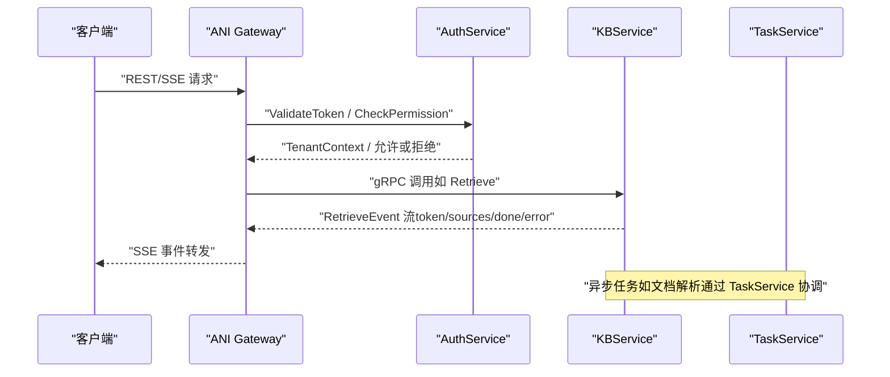
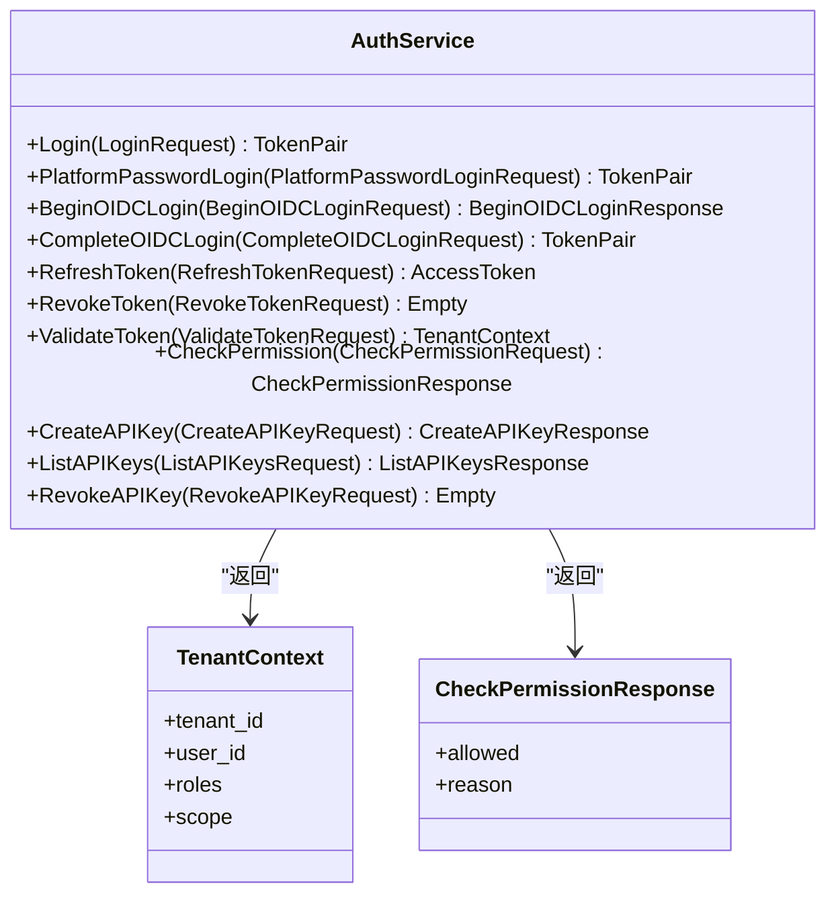
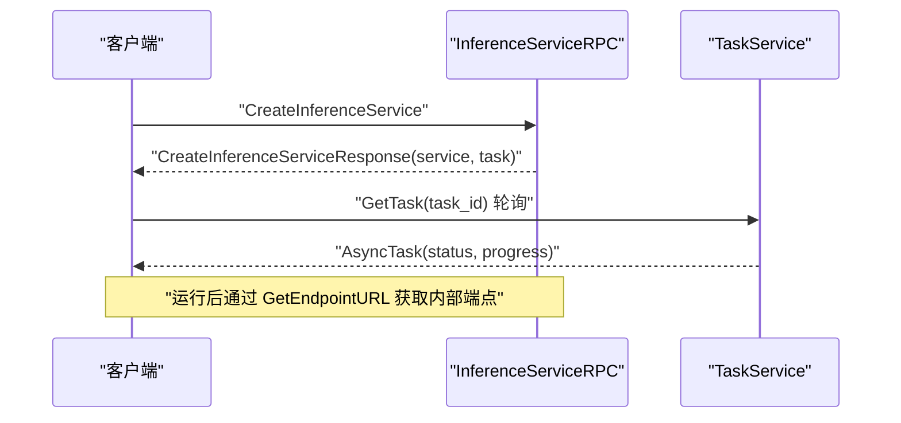
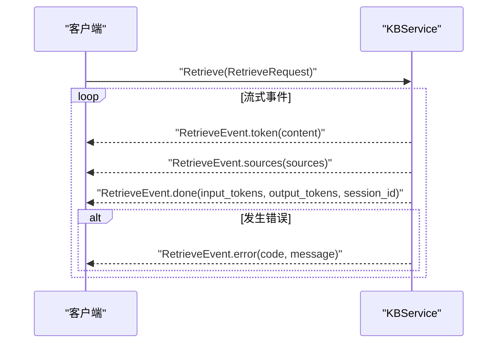
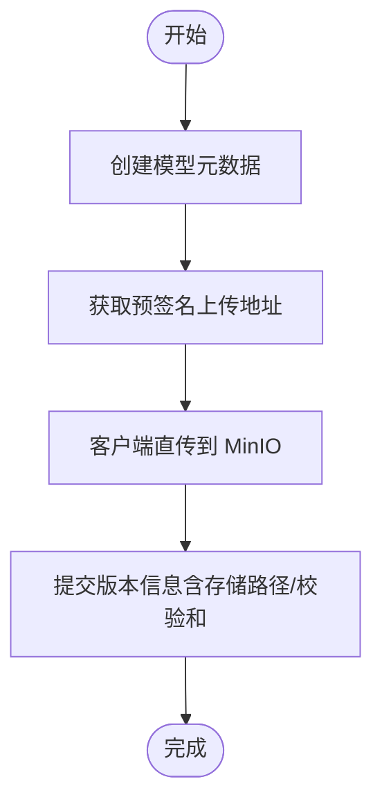
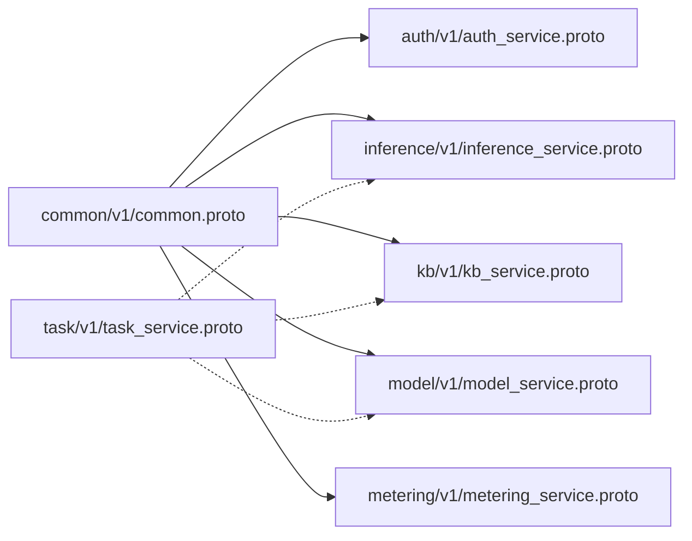

# gRPC 接口

<cite>
**本文引用的文件**
- [auth_service.proto](file://repo/api/proto/auth/v1/auth_service.proto)
- [common.proto](file://repo/api/proto/common/v1/common.proto)
- [inference_service.proto](file://repo/api/proto/inference/v1/inference_service.proto)
- [kb_service.proto](file://repo/api/proto/kb/v1/kb_service.proto)
- [metering_service.proto](file://repo/api/proto/metering/v1/metering_service.proto)
- [model_service.proto](file://repo/api/proto/model/v1/model_service.proto)
- [task_service.proto](file://repo/api/proto/task/v1/task_service.proto)
- [buf.yaml](file://repo/api/proto/buf.yaml)
- [buf.gen.yaml](file://repo/api/proto/buf.gen.yaml)
- [v1.yaml](file://repo/api/openapi/v1.yaml)
- [client.go](file://repo/sdks/services/go/anisdk/client.go)
- [main.go](file://repo/sdks/services/go/examples/basic/main.go)
</cite>

## 目录
1. [简介](#简介)
2. [项目结构](#项目结构)
3. [核心组件](#核心组件)
4. [架构总览](#架构总览)
5. [详细组件分析](#详细组件分析)
6. [依赖关系分析](#依赖关系分析)
7. [性能与可靠性](#性能与可靠性)
8. [故障排查指南](#故障排查指南)
9. [结论](#结论)
10. [附录](#附录)

## 简介
本文件面向使用 ANI 平台 gRPC 接口的开发者，系统化说明 Protobuf 服务定义、消息类型、枚举、流式处理、错误处理机制，以及客户端连接配置、认证设置、超时处理等实践。同时给出 gRPC 与 REST API 的映射关系与选型建议，帮助在不同场景下选择合适协议。

## 项目结构
ANI 的 gRPC 契约位于 repo/api/proto 下，按领域分包（auth、inference、kb、model、metering、task），公共类型在 common.v1。代码生成由 buf 管理，通过 protoc-gen-go、protoc-gen-go-grpc、protoc-gen-grpc-gateway 生成 Go 服务端/客户端与 HTTP 网关代码。

图表来源
- [buf.yaml:1-11](file://repo/api/proto/buf.yaml#L1-L11)
- [buf.gen.yaml:1-19](file://repo/api/proto/buf.gen.yaml#L1-L19)

章节来源
- [buf.yaml:1-11](file://repo/api/proto/buf.yaml#L1-L11)
- [buf.gen.yaml:1-19](file://repo/api/proto/buf.gen.yaml#L1-L19)

## 核心组件
- 认证与授权：AuthService（登录、OIDC、令牌刷新/撤销、权限校验、API Key 管理）
- 推理服务：InferenceServiceRPC（创建/查询/删除推理服务、端点路由、状态同步）
- 知识库：KBService（CRUD、文档上传与解析、RAG 查询与流式检索）
- 模型仓库：ModelService（模型元数据、版本管理、导入、直传下载）
- 计量：MeteringService（用量记录、查询、汇总）
- 任务：TaskService（异步任务状态、取消、进度上报、租约、失败/完成）

这些服务共享 common.v1 中的租户上下文、分页、异步任务引用和资源类型枚举。

章节来源
- [auth_service.proto:11-30](file://repo/api/proto/auth/v1/auth_service.proto#L11-L30)
- [inference_service.proto:11-33](file://repo/api/proto/inference/v1/inference_service.proto#L11-L33)
- [kb_service.proto:11-53](file://repo/api/proto/kb/v1/kb_service.proto#L11-L53)
- [model_service.proto:11-40](file://repo/api/proto/model/v1/model_service.proto#L11-L40)
- [metering_service.proto:11-22](file://repo/api/proto/metering/v1/metering_service.proto#L11-L22)
- [task_service.proto:10-35](file://repo/api/proto/task/v1/task_service.proto#L10-L35)
- [common.proto:9-48](file://repo/api/proto/common/v1/common.proto#L9-L48)

## 架构总览
gRPC 服务通常部署在内部网络，外部通过 ANI Gateway 暴露 REST/SSE 接口；部分内部 RPC（如 UpdateStatus、UpdateTaskProgress）受 RBAC 限制仅内部调用。

图表来源
- [auth_service.proto:20-25](file://repo/api/proto/auth/v1/auth_service.proto#L20-L25)
- [kb_service.proto:35-44](file://repo/api/proto/kb/v1/kb_service.proto#L35-L44)
- [task_service.proto:10-35](file://repo/api/proto/task/v1/task_service.proto#L10-L35)

## 详细组件分析

### 认证与授权（AuthService）
- 主要能力
  - 登录与 OIDC 流程：密码登录、平台密码登录、开始/完成 OIDC
  - 令牌管理：刷新、撤销
  - 鉴权：ValidateToken（返回 TenantContext）、CheckPermission（RBAC）
  - API Key：创建、列表、撤销
- 关键消息
  - LoginRequest、PlatformPasswordLoginRequest、BeginOIDCLoginRequest/Response、CompleteOIDCLoginRequest
  - TokenPair、AccessToken、RefreshTokenRequest、RevokeTokenRequest
  - ValidateTokenRequest、CheckPermissionRequest/Response
  - Create/List/Revoke API Key 相关消息
- 错误与权限
  - 未认证时 ValidateToken 返回 UNAUTHENTICATED
  - 权限不足时 CheckPermissionResponse.allowed=false，并附带 reason

图表来源
- [auth_service.proto:11-30](file://repo/api/proto/auth/v1/auth_service.proto#L11-L30)
- [common.proto:9-16](file://repo/api/proto/common/v1/common.proto#L9-L16)
- [auth_service.proto:81-96](file://repo/api/proto/auth/v1/auth_service.proto#L81-L96)

章节来源
- [auth_service.proto:11-30](file://repo/api/proto/auth/v1/auth_service.proto#L11-L30)
- [auth_service.proto:32-96](file://repo/api/proto/auth/v1/auth_service.proto#L32-L96)
- [common.proto:9-16](file://repo/api/proto/common/v1/common.proto#L9-L16)

### 推理服务（InferenceServiceRPC）
- 生命周期管理：创建（异步，返回初始状态与 AsyncTaskRef）、获取、列表、删除
- 路由能力：GetEndpointURL 供 Gateway 将推理流量转发到具体 K8s Service
- 内部回调：UpdateStatus 由 Operator 调用更新 CRD 阶段
- 关键消息：Create/Get/List/Delete 请求与响应、InferenceServiceStatus、PlacementSpec、EncryptionKeyRef

图表来源
- [inference_service.proto:11-33](file://repo/api/proto/inference/v1/inference_service.proto#L11-L33)
- [task_service.proto:10-35](file://repo/api/proto/task/v1/task_service.proto#L10-L35)

章节来源
- [inference_service.proto:11-33](file://repo/api/proto/inference/v1/inference_service.proto#L11-L33)
- [inference_service.proto:35-127](file://repo/api/proto/inference/v1/inference_service.proto#L35-L127)

### 知识库（KBService）
- 资源管理：知识库 CRUD、文档上传 URL、通知上传完成、文档查询/删除
- RAG 查询：同步 Query 与流式 Retrieve（Server-streaming）
- 流式事件：RetrieveEvent 包含 token、sources、done、error 四种事件
- 扩展能力（P1 声明）：引用列表、会话列表、权限更新

图表来源
- [kb_service.proto:35-44](file://repo/api/proto/kb/v1/kb_service.proto#L35-L44)
- [kb_service.proto:164-209](file://repo/api/proto/kb/v1/kb_service.proto#L164-L209)

章节来源
- [kb_service.proto:11-53](file://repo/api/proto/kb/v1/kb_service.proto#L11-L53)
- [kb_service.proto:55-209](file://repo/api/proto/kb/v1/kb_service.proto#L55-L209)

### 模型仓库（ModelService）
- 模型元数据：创建、获取、列表、软删除
- 版本管理：创建版本（需先通过 GetUploadURL 直传到 MinIO）
- 导入：从 HuggingFace/ModelScope 异步导入，返回 AsyncTaskRef
- 下载：为 Init Container 提供预签名 GET URL

图表来源
- [model_service.proto:11-40](file://repo/api/proto/model/v1/model_service.proto#L11-L40)
- [model_service.proto:42-123](file://repo/api/proto/model/v1/model_service.proto#L42-L123)

章节来源
- [model_service.proto:11-40](file://repo/api/proto/model/v1/model_service.proto#L11-L40)
- [model_service.proto:42-157](file://repo/api/proto/model/v1/model_service.proto#L42-L157)

### 计量（MeteringService）
- 记录用量：RecordUsage（fire-and-forget）
- 查询用量：QueryUsage（支持按资源类型、可用区、天/小时分组）
- 周期汇总：GetSummary（用于 BOSS 报表）

章节来源
- [metering_service.proto:11-22](file://repo/api/proto/metering/v1/metering_service.proto#L11-L22)
- [metering_service.proto:24-70](file://repo/api/proto/metering/v1/metering_service.proto#L24-L70)

### 任务（TaskService）
- 任务状态：GetTask、CancelTask
- Worker 协作：UpdateTaskProgress、AcquireTaskLease、HeartbeatTaskLease、FailTask、CompleteTask
- 任务实体：AsyncTask（状态机、重试、死信队列、租约、Webhook）

章节来源
- [task_service.proto:10-35](file://repo/api/proto/task/v1/task_service.proto#L10-L35)
- [task_service.proto:37-113](file://repo/api/proto/task/v1/task_service.proto#L37-L113)

## 依赖关系分析
- 公共依赖：所有服务均可能引用 common.v1 的 TenantContext、CursorPageRequest/Meta、AsyncTaskRef、ResourceType
- 生成管线：buf.yaml 定义模块与规则；buf.gen.yaml 指定插件与输出路径，确保 Go/gRPC/Gateway 代码一致
- 内部边界：部分 RPC 明确标注“仅内部调用”（如 UpdateStatus、UpdateTaskProgress），由 Gateway RBAC 屏蔽外部访问

图表来源
- [common.proto:9-48](file://repo/api/proto/common/v1/common.proto#L9-L48)
- [inference_service.proto:11-33](file://repo/api/proto/inference/v1/inference_service.proto#L11-L33)
- [kb_service.proto:11-53](file://repo/api/proto/kb/v1/kb_service.proto#L11-L53)
- [model_service.proto:11-40](file://repo/api/proto/model/v1/model_service.proto#L11-L40)
- [metering_service.proto:11-22](file://repo/api/proto/metering/v1/metering_service.proto#L11-L22)
- [task_service.proto:10-35](file://repo/api/proto/task/v1/task_service.proto#L10-L35)

章节来源
- [buf.yaml:1-11](file://repo/api/proto/buf.yaml#L1-L11)
- [buf.gen.yaml:1-19](file://repo/api/proto/buf.gen.yaml#L1-L19)

## 性能与可靠性
- 流式优先：长耗时或大结果集场景（如 Retrieve）建议使用 Server-streaming，避免阻塞与超时
- 幂等性：写操作尽量携带 idempotency_key，防止重试导致重复计费或副作用
- 异步化：创建类操作返回 AsyncTaskRef，客户端轮询或配置 Webhook 接收完成通知
- 租约与心跳：Worker 通过 AcquireTaskLease/HeartbeatTaskLease 保证任务不重复执行与故障恢复
- 限流与配额：API Key 可配置 rate_limit_rpm，结合 Gateway 限流策略保护后端

章节来源
- [kb_service.proto:17-24](file://repo/api/proto/kb/v1/kb_service.proto#L17-L24)
- [task_service.proto:23-35](file://repo/api/proto/task/v1/task_service.proto#L23-L35)
- [auth_service.proto:98-105](file://repo/api/proto/auth/v1/auth_service.proto#L98-L105)

## 故障排查指南
- 认证失败
  - 现象：ValidateToken 返回 UNAUTHENTICATED
  - 排查：检查 JWT/API Key 是否有效、是否过期、是否属于目标租户
- 权限不足
  - 现象：CheckPermissionResponse.allowed=false，reason 说明原因
  - 排查：确认用户角色/范围 scope 与资源动作匹配
- 流式中断
  - 现象：Retrieve 收到 error 事件或连接断开
  - 排查：检查 code（如 INFERENCE_UNAVAILABLE、STREAM_INTERRUPTED），必要时重试并携带新的 idempotency_key
- 任务失败
  - 现象：AsyncTask.status=failed 或 dead_letter
  - 排查：查看 error_message 与 compensating_action，必要时重新获取租约并重试

章节来源
- [auth_service.proto:20-25](file://repo/api/proto/auth/v1/auth_service.proto#L20-L25)
- [auth_service.proto:85-96](file://repo/api/proto/auth/v1/auth_service.proto#L85-L96)
- [kb_service.proto:202-209](file://repo/api/proto/kb/v1/kb_service.proto#L202-L209)
- [task_service.proto:91-113](file://repo/api/proto/task/v1/task_service.proto#L91-L113)

## 结论
ANI 的 gRPC 契约以领域服务划分，配合 common 公共类型形成清晰的服务边界。通过流式 RPC、异步任务与租约机制，兼顾了高吞吐与可靠性。对外通过 Gateway 提供 REST/SSE 接入，内部服务间则直接使用 gRPC，实现高效通信与严格权限控制。

## 附录

### gRPC 与 REST API 映射与选型指南
- 映射原则
  - 读写型资源（CRUD）：REST 更直观，适合浏览器/脚本快速集成
  - 流式/实时：SSE/流式 gRPC 更适合（如 Retrieve）
  - 内部服务间：优先 gRPC，减少序列化开销
- 参考规范
  - REST 基础约定、错误格式、分页、异步任务等在 OpenAPI 中统一描述
  - gRPC 服务定义在 proto 文件中，Gateway 可将 gRPC 转译为 REST/SSE

章节来源
- [v1.yaml:1-39](file://repo/api/openapi/v1.yaml#L1-L39)

### 客户端实现示例（Go SDK）
- 初始化与认证
  - 通过 NewClient(baseURL, token) 创建客户端，token 为 Bearer JWT 或 API Key
  - BaseURL 默认指向 services 层网关前缀
- 幂等性与分页
  - WithIdempotencyKey(body, key) 为写操作注入幂等键
  - CursorParams(limit, cursor) 构造分页参数
- 错误处理
  - 使用 IsAPIErrorCode(code) 判断标准错误码
  - 通过 APIError 的 Code/Message/RequestID/Details 定位问题

章节来源
- [client.go:16-20](file://repo/sdks/services/go/anisdk/client.go#L16-L20)
- [client.go:402-442](file://repo/sdks/services/go/anisdk/client.go#L402-L442)
- [client.go:507-556](file://repo/sdks/services/go/anisdk/client.go#L507-L556)
- [main.go:10-22](file://repo/sdks/services/go/examples/basic/main.go#L10-L22)

### 连接配置、超时与重试建议
- 连接配置
  - TLS：生产环境启用 mTLS，证书由平台签发与管理
  - 多端点：Gateway 支持多实例，客户端应支持负载均衡与故障转移
- 超时
  - 短请求（CRUD）：建议 5-10 秒
  - 流式请求（Retrieve）：根据业务容忍度设置合理超时，并在客户端做断线重连
- 重试
  - 仅对幂等操作重试（带 idempotency_key）
  - 指数退避与抖动，避免雪崩

[本节为通用指导，不直接分析具体文件]