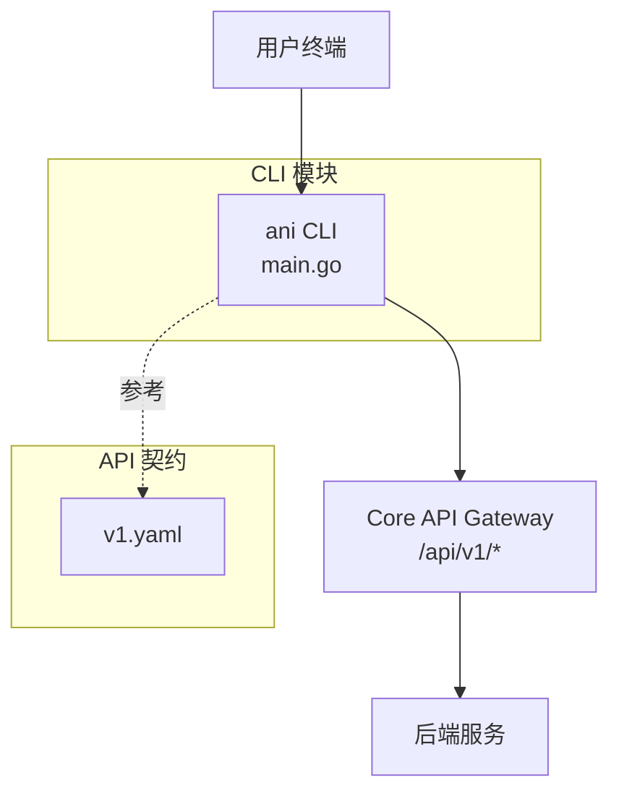
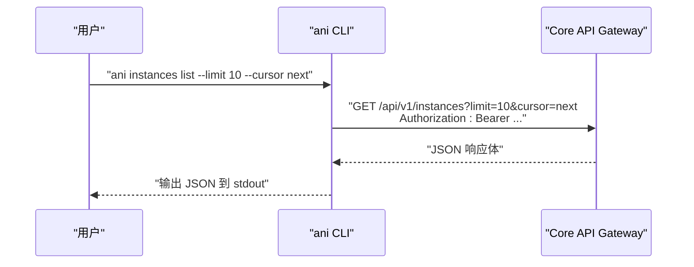
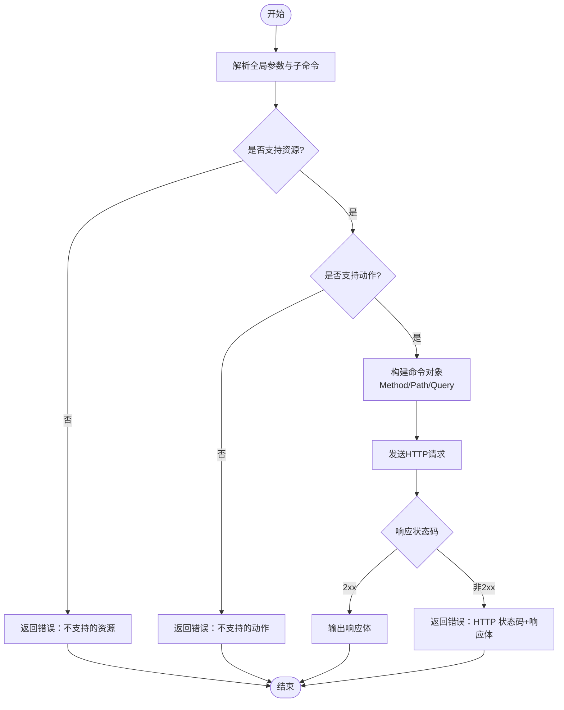
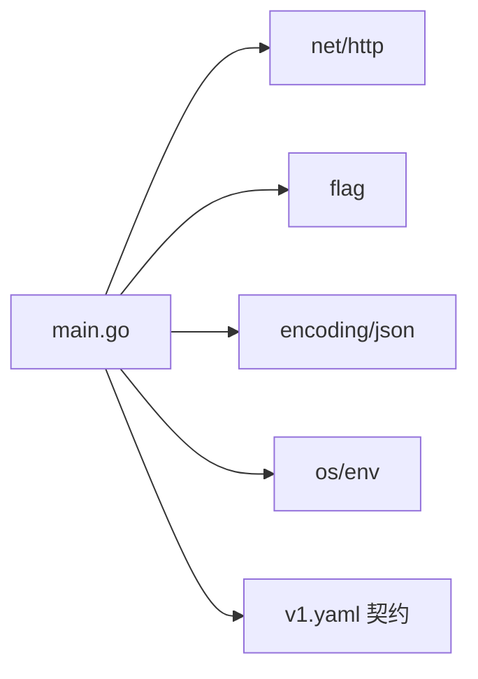

# CLI 工具

<cite>
**本文引用的文件**
- [repo/cli/ani/main.go](file://repo/cli/ani/main.go)
- [repo/cli/ani/main_test.go](file://repo/cli/ani/main_test.go)
- [repo/api/openapi/v1.yaml](file://repo/api/openapi/v1.yaml)
</cite>

## 目录
1. [简介](#简介)
2. [项目结构](#项目结构)
3. [核心组件](#核心组件)
4. [架构总览](#架构总览)
5. [详细组件分析](#详细组件分析)
6. [依赖关系分析](#依赖关系分析)
7. [性能与超时](#性能与超时)
8. [故障排查指南](#故障排查指南)
9. [结论](#结论)
10. [附录：常用工作流示例](#附录常用工作流示例)

## 简介
本章节面向使用 ani CLI 的工程师，说明如何安装、配置并调用 ani 命令来访问 ANI Core API。该 CLI 是一个轻量级 HTTP 客户端，用于列举和管理基础设施资源（如实例、网络、存储、向量库等），以及查询可观测性指标和计量用量。它支持通过环境变量或命令行参数设置目标 API 地址与认证令牌，并以 JSON 形式输出结果，便于脚本化与自动化。

## 项目结构
CLI 源码位于 repo/cli/ani 目录，包含入口程序 main.go 与单元测试 main_test.go；API 契约定义在 repo/api/openapi/v1.yaml。CLI 仅实现 Core 资源的 list 与少量 get 能力，不直接操作 Services 资源（模型、推理、知识库等）。

图表来源
- [repo/cli/ani/main.go:42-84](file://repo/cli/ani/main.go#L42-L84)
- [repo/api/openapi/v1.yaml:1-46](file://repo/api/openapi/v1.yaml#L1-L46)

章节来源
- [repo/cli/ani/main.go:1-251](file://repo/cli/ani/main.go#L1-L251)
- [repo/api/openapi/v1.yaml:1-46](file://repo/api/openapi/v1.yaml#L1-L46)

## 核心组件
- 全局参数
  - --base-url：Core API 基础地址，默认 http://127.0.0.1:4010/api/v1，也可通过环境变量 ANI_BASE_URL 覆盖。
  - --token：Bearer Token，可通过环境变量 ANI_TOKEN 提供。
  - --version / --version-format：打印版本信息，支持 text 与 json 两种格式。
- 子命令与资源
  - instances, network-vpcs, network-subnets, network-security-groups, network-load-balancers, volumes, filesystems, objects, vector-stores, encryption-keys, k8s-clusters, secrets, registry-projects, observability-alert-rules
  - 这些资源统一支持 list 动作，并支持分页参数 --limit 与 --cursor。
  - observability-query 支持 get 动作，需要 --query，可选 --tenant-id。
  - metering-usage 仅支持 get。
- 请求执行
  - 自动拼接 base-url + path + query。
  - 当提供 token 时，添加 Authorization: Bearer <token>。
  - 当存在请求体时，设置 Content-Type: application/json。
  - 对非 2xx 响应返回错误，包含状态码与响应体摘要。

章节来源
- [repo/cli/ani/main.go:17-33](file://repo/cli/ani/main.go#L17-L33)
- [repo/cli/ani/main.go:46-84](file://repo/cli/ani/main.go#L46-L84)
- [repo/cli/ani/main.go:109-201](file://repo/cli/ani/main.go#L109-L201)
- [repo/cli/ani/main.go:203-243](file://repo/cli/ani/main.go#L203-L243)

## 架构总览
ani CLI 作为薄客户端，将用户输入解析为 HTTP 请求，调用 Core API。所有资源路径均基于 v1.yaml 中定义的 /api/v1 前缀。CLI 不维护本地状态，也不缓存数据，每次调用均为一次远程请求。

图表来源
- [repo/cli/ani/main.go:46-84](file://repo/cli/ani/main.go#L46-L84)
- [repo/cli/ani/main.go:203-243](file://repo/cli/ani/main.go#L203-L243)
- [repo/api/openapi/v1.yaml:16-46](file://repo/api/openapi/v1.yaml#L16-L46)

## 详细组件分析

### 命令解析与路由
- 入口函数解析全局参数后，根据资源名与动作构建 command 对象。
- 不支持的资源会报错，例如 services 相关资源（model/inference/knowledge-base 等）被显式拒绝。
- 对于 list 类资源，统一映射到对应的 /api/v1/* 路径，并附加 limit/cursor 查询参数。
- observability-query 要求必须提供 --query，可选 tenant_id。
- metering-usage 仅允许 get。

图表来源
- [repo/cli/ani/main.go:109-201](file://repo/cli/ani/main.go#L109-L201)
- [repo/cli/ani/main.go:203-243](file://repo/cli/ani/main.go#L203-L243)

章节来源
- [repo/cli/ani/main.go:109-201](file://repo/cli/ani/main.go#L109-L201)
- [repo/cli/ani/main.go:203-243](file://repo/cli/ani/main.go#L203-L243)

### 认证与鉴权
- 认证方式：Bearer JWT 或 X-API-Key。CLI 当前通过 --token 注入 Authorization: Bearer。
- 若未提供 token，则不会添加认证头。
- 服务端从 JWT claims 提取 tenant_id，请求体中的 tenant_id 字段将被忽略（由 API 契约约定）。

章节来源
- [repo/cli/ani/main.go:221-223](file://repo/cli/ani/main.go#L221-L223)
- [repo/api/openapi/v1.yaml:24-63](file://repo/api/openapi/v1.yaml#L24-L63)

### 分页与列表
- 所有 list 资源支持 --limit 与 --cursor。
- 典型用法：先获取一批数据，再根据 next_cursor 继续翻页。

章节来源
- [repo/cli/ani/main.go:160-179](file://repo/cli/ani/main.go#L160-L179)
- [repo/api/openapi/v1.yaml:33-35](file://repo/api/openapi/v1.yaml#L33-L35)

### 可观测性查询
- observability-query get 需要 --query（PromQL），可选 --tenant-id。
- 请求将映射到 /api/v1/observability/query。

章节来源
- [repo/cli/ani/main.go:181-201](file://repo/cli/ani/main.go#L181-L201)

### 计量用量
- metering-usage 仅支持 get，无额外参数。

章节来源
- [repo/cli/ani/main.go:150-155](file://repo/cli/ani/main.go#L150-L155)

### 版本信息
- --version 输出文本或 JSON 格式的版本元数据，便于 CI 集成与发布证据收集。

章节来源
- [repo/cli/ani/main.go:56-107](file://repo/cli/ani/main.go#L56-L107)
- [repo/cli/ani/main_test.go:119-173](file://repo/cli/ani/main_test.go#L119-L173)

## 依赖关系分析
- 运行时依赖：标准库 net/http、flag、encoding/json 等。
- 外部依赖：无第三方 Go 包。
- 接口契约：严格遵循 v1.yaml 的 URL 前缀与认证约定。

图表来源
- [repo/cli/ani/main.go:1-15](file://repo/cli/ani/main.go#L1-L15)
- [repo/api/openapi/v1.yaml:1-46](file://repo/api/openapi/v1.yaml#L1-L46)

章节来源
- [repo/cli/ani/main.go:1-15](file://repo/cli/ani/main.go#L1-L15)
- [repo/api/openapi/v1.yaml:1-46](file://repo/api/openapi/v1.yaml#L1-L46)

## 性能与超时
- 每个请求有 30 秒上下文超时，避免长时间挂起。
- 建议在生产环境中配合合理的重试与退避策略（在脚本层实现）。

章节来源
- [repo/cli/ani/main.go:207-208](file://repo/cli/ani/main.go#L207-L208)

## 故障排查指南
- 常见错误
  - 不支持的资源：如 model/inference/knowledge-base 等属于 Services 资源，CLI 明确拒绝。
  - 不支持的动作：如 metering-usage 仅支持 get，observability-query 仅支持 get。
  - 缺少必要参数：如 observability-query 必须提供 --query。
  - 认证失败：检查 --token 或 ANI_TOKEN 是否正确，确认服务端已签发有效 JWT。
  - 网络或网关错误：检查 --base-url 或 ANI_BASE_URL 指向的 Gateway 可达性与证书。
- 调试技巧
  - 使用 --version --version-format json 验证 CLI 版本与构建信息。
  - 将输出重定向到文件以便后续分析：ani instances list > out.json。
  - 结合 shell 管道与 jq 处理 JSON 输出。
  - 通过环境变量切换 base-url，快速在不同环境间切换。

章节来源
- [repo/cli/ani/main.go:114-157](file://repo/cli/ani/main.go#L114-L157)
- [repo/cli/ani/main.go:181-201](file://repo/cli/ani/main.go#L181-L201)
- [repo/cli/ani/main.go:239-241](file://repo/cli/ani/main.go#L239-L241)
- [repo/cli/ani/main_test.go:18-36](file://repo/cli/ani/main_test.go#L18-L36)

## 结论
ani CLI 提供了对 ANI Core 基础设施资源的简洁访问能力，适合脚本化与自动化场景。通过环境变量与命令行参数管理配置与认证，结合分页参数可实现批量遍历。对于 Services 资源，请使用对应 SDK 或 API 客户端。

## 附录：常用工作流示例
以下示例展示如何在不同场景下使用 ani CLI。请根据实际环境替换 base-url 与 token。

- 列出实例（分页）
  - 首次获取：ani instances list --limit 20
  - 下一页：ani instances list --limit 20 --cursor "<next_cursor>"
- 列出网络资源
  - VPC：ani network-vpcs list --limit 10
  - 子网：ani network-subnets list --limit 10
  - 安全组：ani network-security-groups list --limit 10
  - 负载均衡器：ani network-load-balancers list --limit 10
- 列出存储与对象
  - 卷：ani volumes list --limit 10
  - 文件系统：ani filesystems list --limit 10
  - 对象：ani objects list --limit 10
- 其他资源
  - 向量库：ani vector-stores list --limit 10
  - 加密密钥：ani encryption-keys list --limit 10
  - K8s 集群：ani k8s-clusters list --limit 10
  - 密钥：ani secrets list --limit 10
  - 镜像仓库项目：ani registry-projects list --limit 10
  - 可观测性告警规则：ani observability-alert-rules list --limit 10
- 可观测性查询
  - 查询指标：ani observability-query get --query "up" --tenant-id "<tenant>"
- 计量用量
  - 获取用量：ani metering-usage get
- 认证与环境
  - 通过环境变量设置：export ANI_BASE_URL="https://your-gateway/api/v1"
  - 通过环境变量设置令牌：export ANI_TOKEN="<jwt-or-api-key>"
  - 或通过命令行参数：ani --base-url "..." --token "..." instances list
- 版本信息
  - 文本格式：ani --version
  - JSON 格式：ani --version --version-format json

注意
- 上述资源均映射到 /api/v1 下的具体路径，CLI 负责拼装方法与查询参数。
- 如需创建实例或更新资源，请使用官方 SDK 或直接调用 Core API（CLI 当前仅提供 list/get）。

章节来源
- [repo/cli/ani/main.go:109-201](file://repo/cli/ani/main.go#L109-L201)
- [repo/cli/ani/main.go:203-243](file://repo/cli/ani/main.go#L203-L243)
- [repo/api/openapi/v1.yaml:16-46](file://repo/api/openapi/v1.yaml#L16-L46)