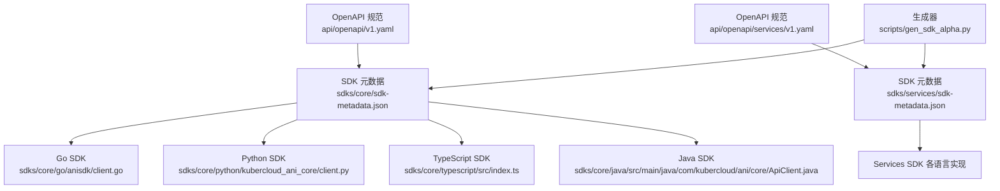
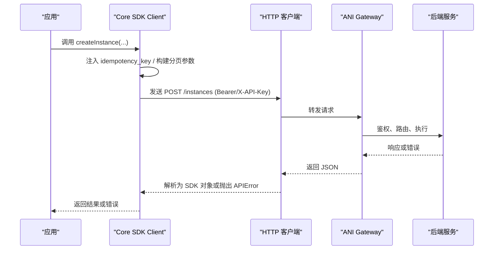
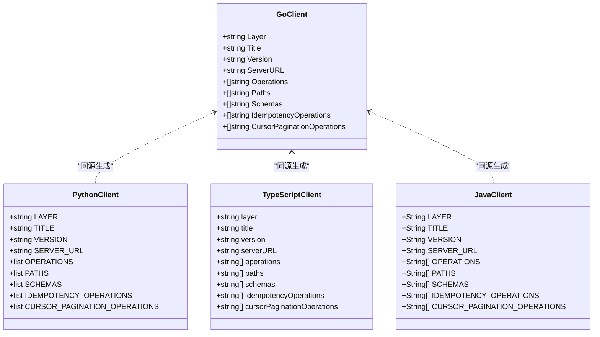
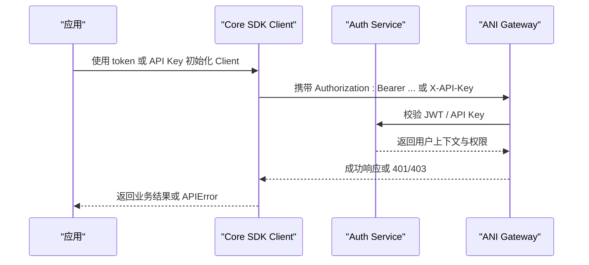
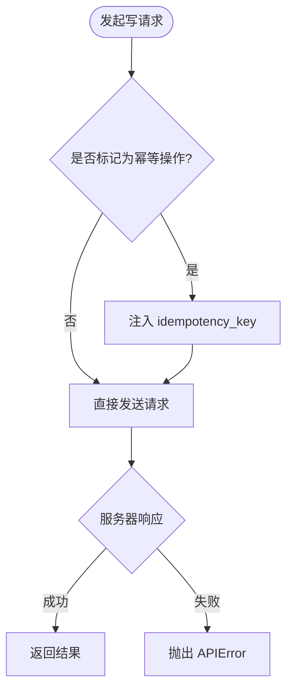
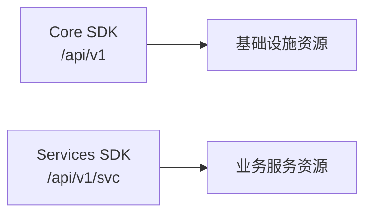
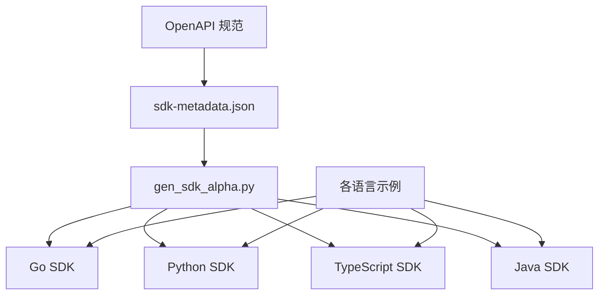
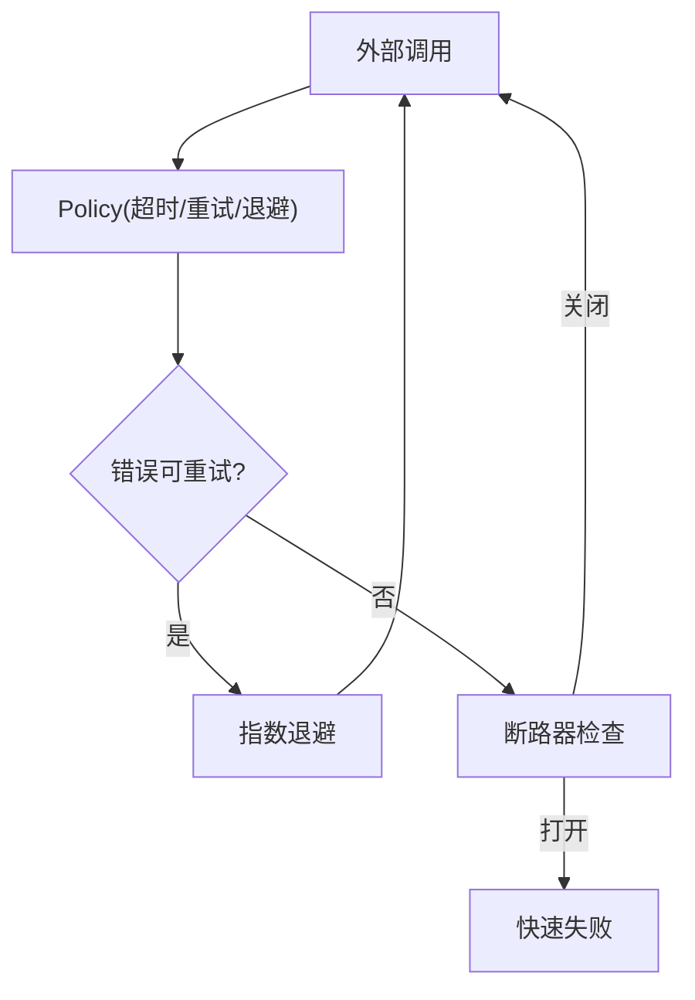

# Core SDK 概览

<cite>
**本文引用的文件**
- [api/openapi/v1.yaml](file://repo/api/openapi/v1.yaml)
- [api/openapi/services/v1.yaml](file://repo/api/openapi/services/v1.yaml)
- [sdks/core/sdk-metadata.json](file://repo/sdks/core/sdk-metadata.json)
- [sdks/services/sdk-metadata.json](file://repo/sdks/services/sdk-metadata.json)
- [scripts/gen_sdk_alpha.py](file://repo/scripts/gen_sdk_alpha.py)
- [sdks/core/go/anisdk/client.go](file://repo/sdks/core/go/anisdk/client.go)
- [sdks/core/python/kubercloud_ani_core/client.py](file://repo/sdks/core/python/kubercloud_ani_core/client.py)
- [sdks/core/typescript/src/index.ts](file://repo/sdks/core/typescript/src/index.ts)
- [sdks/core/java/src/main/java/com/kubercloud/ani/core/ApiClient.java](file://repo/sdks/core/java/src/main/java/com/kubercloud/ani/core/ApiClient.java)
- [sdks/core/go/examples/basic/main.go](file://repo/sdks/core/go/examples/basic/main.go)
- [sdks/core/python/examples/basic.py](file://repo/sdks/core/python/examples/basic.py)
- [sdks/core/typescript/examples/basic.mjs](file://repo/sdks/core/typescript/examples/basic.mjs)
- [ANI-02-产品功能设计.md](file://ANI-02-产品功能设计.md)
- [development-records/sprint14-core-resilience-plan.md](file://repo/development-records/sprint14-core-resilience-plan.md)
</cite>

## 目录
1. [简介](#简介)
2. [项目结构](#项目结构)
3. [核心组件](#核心组件)
4. [架构总览](#架构总览)
5. [详细组件分析](#详细组件分析)
6. [依赖关系分析](#依赖关系分析)
7. [性能与韧性考虑](#性能与韧性考虑)
8. [故障排查指南](#故障排查指南)
9. [结论](#结论)
10. [附录：快速开始与升级指南](#附录快速开始与升级指南)

## 简介
Core SDK 是面向 ANI Core API（基础设施平台 REST API）的多语言客户端集合，提供统一的认证、错误处理、幂等键注入、游标分页等能力。SDK 由 OpenAPI 规范驱动生成，保证多语言一致性与契约一致性。Core SDK 聚焦“平台资源”（实例、存储、网络、K8s 集群、计量、可观测性等），而 Services SDK 聚焦“业务服务”（模型、推理服务、知识库、租户计划等）。两者通过不同的 Base URL 和 API 契约解耦，便于独立演进。

## 项目结构
仓库将 SDK 按层组织在 sdks/core 与 sdks/services 下，每层包含 Go、Python、TypeScript、Java 四种语言的实现与示例；同时维护 sdk-metadata.json 描述操作、模式、幂等与分页策略。OpenAPI 规范位于 api/openapi 目录，作为唯一真实来源，由脚本统一生成各语言 SDK。

**图表来源**
- [scripts/gen_sdk_alpha.py:15-30](file://repo/scripts/gen_sdk_alpha.py#L15-L30)
- [sdks/core/sdk-metadata.json:1-10](file://repo/sdks/core/sdk-metadata.json#L1-L10)
- [sdks/services/sdk-metadata.json:1-10](file://repo/sdks/services/sdk-metadata.json#L1-L10)

**章节来源**
- [scripts/gen_sdk_alpha.py:15-30](file://repo/scripts/gen_sdk_alpha.py#L15-L30)
- [sdks/core/sdk-metadata.json:1-10](file://repo/sdks/core/sdk-metadata.json#L1-L10)
- [sdks/services/sdk-metadata.json:1-10](file://repo/sdks/services/sdk-metadata.json#L1-L10)

## 核心组件
- 统一抽象层：所有语言 SDK 暴露一致的 Client、请求方法、错误类型、幂等键注入、游标分页辅助函数。
- 认证机制：支持 Bearer JWT 与 X-API-Key 两种认证方式；tenant_id 从 JWT claims 提取，请求体中的 tenant_id 字段被忽略。
- 错误处理：统一错误体 { code, message, request_id, details? }，并提供 isAPIErrorCode 等工具函数。
- 幂等性：对需要幂等的写操作自动识别并注入 idempotency_key。
- 分页：对带 limit/cursor 参数的列表接口提供 cursorParams 辅助。

这些能力在各语言 SDK 中保持一致，便于跨语言迁移与团队协作。

**章节来源**
- [api/openapi/v1.yaml:24-38](file://repo/api/openapi/v1.yaml#L24-L38)
- [sdks/core/go/anisdk/client.go:16-20](file://repo/sdks/core/go/anisdk/client.go#L16-L20)
- [sdks/core/python/kubercloud_ani_core/client.py:6-9](file://repo/sdks/core/python/kubercloud_ani_core/client.py#L6-L9)
- [sdks/core/typescript/src/index.ts:2-5](file://repo/sdks/core/typescript/src/index.ts#L2-L5)
- [sdks/core/java/src/main/java/com/kubercloud/ani/core/ApiClient.java:24-27](file://repo/sdks/core/java/src/main/java/com/kubercloud/ani/core/ApiClient.java#L24-L27)

## 架构总览
Core SDK 的调用路径遵循“应用 → SDK Client → HTTP 客户端 → ANI Gateway → 后端服务”。SDK 负责拼装请求、附加认证头、注入幂等键、构造分页参数，并将结构化错误返回给调用方。

**图表来源**
- [sdks/core/go/anisdk/client.go:16-20](file://repo/sdks/core/go/anisdk/client.go#L16-L20)
- [sdks/core/python/kubercloud_ani_core/client.py:6-9](file://repo/sdks/core/python/kubercloud_ani_core/client.py#L6-L9)
- [sdks/core/typescript/src/index.ts:2-5](file://repo/sdks/core/typescript/src/index.ts#L2-L5)
- [sdks/core/java/src/main/java/com/kubercloud/ani/core/ApiClient.java:24-27](file://repo/sdks/core/java/src/main/java/com/kubercloud/ani/core/ApiClient.java#L24-L27)

## 详细组件分析

### 多语言客户端类图

**图表来源**
- [sdks/core/go/anisdk/client.go:16-20](file://repo/sdks/core/go/anisdk/client.go#L16-L20)
- [sdks/core/python/kubercloud_ani_core/client.py:6-9](file://repo/sdks/core/python/kubercloud_ani_core/client.py#L6-L9)
- [sdks/core/typescript/src/index.ts:2-5](file://repo/sdks/core/typescript/src/index.ts#L2-L5)
- [sdks/core/java/src/main/java/com/kubercloud/ani/core/ApiClient.java:24-27](file://repo/sdks/core/java/src/main/java/com/kubercloud/ani/core/ApiClient.java#L24-L27)

**章节来源**
- [sdks/core/go/anisdk/client.go:16-20](file://repo/sdks/core/go/anisdk/client.go#L16-L20)
- [sdks/core/python/kubercloud_ani_core/client.py:6-9](file://repo/sdks/core/python/kubercloud_ani_core/client.py#L6-L9)
- [sdks/core/typescript/src/index.ts:2-5](file://repo/sdks/core/typescript/src/index.ts#L2-L5)
- [sdks/core/java/src/main/java/com/kubercloud/ani/core/ApiClient.java:24-27](file://repo/sdks/core/java/src/main/java/com/kubercloud/ani/core/ApiClient.java#L24-L27)

### 认证流程序列图

**图表来源**
- [api/openapi/v1.yaml:24-63](file://repo/api/openapi/v1.yaml#L24-L63)
- [api/openapi/services/v1.yaml:18-21](file://repo/api/openapi/services/v1.yaml#L18-L21)

**章节来源**
- [api/openapi/v1.yaml:24-63](file://repo/api/openapi/v1.yaml#L24-L63)
- [api/openapi/services/v1.yaml:18-21](file://repo/api/openapi/services/v1.yaml#L18-L21)

### 幂等键注入流程图

**图表来源**
- [sdks/core/go/anisdk/client.go:734-796](file://repo/sdks/core/go/anisdk/client.go#L734-L796)
- [sdks/core/python/kubercloud_ani_core/client.py:723-785](file://repo/sdks/core/python/kubercloud_ani_core/client.py#L723-L785)
- [sdks/core/typescript/src/index.ts:719-781](file://repo/sdks/core/typescript/src/index.ts#L719-L781)
- [sdks/core/java/src/main/java/com/kubercloud/ani/core/ApiClient.java:741-800](file://repo/sdks/core/java/src/main/java/com/kubercloud/ani/core/ApiClient.java#L741-L800)

**章节来源**
- [sdks/core/go/anisdk/client.go:734-796](file://repo/sdks/core/go/anisdk/client.go#L734-L796)
- [sdks/core/python/kubercloud_ani_core/client.py:723-785](file://repo/sdks/core/python/kubercloud_ani_core/client.py#L723-L785)
- [sdks/core/typescript/src/index.ts:719-781](file://repo/sdks/core/typescript/src/index.ts#L719-L781)
- [sdks/core/java/src/main/java/com/kubercloud/ani/core/ApiClient.java:741-800](file://repo/sdks/core/java/src/main/java/com/kubercloud/ani/core/ApiClient.java#L741-L800)

### Core SDK 与 Services SDK 的区别与适用场景
- Core SDK：面向基础设施资源（实例、存储、网络、K8s 集群、计量、可观测性等），Base URL 为 /api/v1。适用于平台集成、自动化编排、运维工具。
- Services SDK：面向业务服务（模型、推理服务、知识库、租户计划等），Base URL 为 /api/v1/svc。适用于上层业务系统集成、AI 工作流编排。

**图表来源**
- [sdks/core/sdk-metadata.json:1-6](file://repo/sdks/core/sdk-metadata.json#L1-L6)
- [sdks/services/sdk-metadata.json:1-6](file://repo/sdks/services/sdk-metadata.json#L1-L6)
- [api/openapi/v1.yaml:16-18](file://repo/api/openapi/v1.yaml#L16-L18)
- [api/openapi/services/v1.yaml:11-13](file://repo/api/openapi/services/v1.yaml#L11-L13)

**章节来源**
- [sdks/core/sdk-metadata.json:1-6](file://repo/sdks/core/sdk-metadata.json#L1-L6)
- [sdks/services/sdk-metadata.json:1-6](file://repo/sdks/services/sdk-metadata.json#L1-L6)
- [api/openapi/v1.yaml:16-18](file://repo/api/openapi/v1.yaml#L16-L18)
- [api/openapi/services/v1.yaml:11-13](file://repo/api/openapi/services/v1.yaml#L11-L13)

## 依赖关系分析
- 生成器依赖 OpenAPI 规范，抽取 operationId、scope、schemas、idempotency 与分页信息，输出到各语言 SDK。
- SDK 元数据文件与生成的代码保持同步，确保操作列表、路径、模式一致。
- 示例代码验证 SDK 的基本能力（基础配置、幂等键注入、游标分页、错误工具）。

**图表来源**
- [scripts/gen_sdk_alpha.py:15-30](file://repo/scripts/gen_sdk_alpha.py#L15-L30)
- [sdks/core/sdk-metadata.json:1-10](file://repo/sdks/core/sdk-metadata.json#L1-L10)
- [sdks/core/go/examples/basic/main.go:10-22](file://repo/sdks/core/go/examples/basic/main.go#L10-L22)
- [sdks/core/python/examples/basic.py:4-15](file://repo/sdks/core/python/examples/basic.py#L4-L15)
- [sdks/core/typescript/examples/basic.mjs:4-13](file://repo/sdks/core/typescript/examples/basic.mjs#L4-L13)

**章节来源**
- [scripts/gen_sdk_alpha.py:15-30](file://repo/scripts/gen_sdk_alpha.py#L15-L30)
- [sdks/core/sdk-metadata.json:1-10](file://repo/sdks/core/sdk-metadata.json#L1-L10)
- [sdks/core/go/examples/basic/main.go:10-22](file://repo/sdks/core/go/examples/basic/main.go#L10-L22)
- [sdks/core/python/examples/basic.py:4-15](file://repo/sdks/core/python/examples/basic.py#L4-L15)
- [sdks/core/typescript/examples/basic.mjs:4-13](file://repo/sdks/core/typescript/examples/basic.mjs#L4-L13)

## 性能与韧性考虑
- 重试与退避：适配器层提供 Policy（超时、最大尝试次数、指数退避）与 Retryable 错误分类，用于外部调用的韧性增强。
- 断路器：命名断路器可在持续失败时快速失败，避免雪崩。
- 健康与降级：readyz 探针区分强依赖与弱依赖，弱依赖不可用时进入降级模式。
- 多端点故障转移：Redis、MinIO、Milvus 支持端点列表与故障转移，提升可用性。

**图表来源**
- [development-records/sprint14-core-resilience-plan.md:203-233](file://repo/development-records/sprint14-core-resilience-plan.md#L203-L233)
- [development-records/sprint14-core-resilience-plan.md:408-419](file://repo/development-records/sprint14-core-resilience-plan.md#L408-L419)
- [development-records/sprint14-core-resilience-plan.md:454-471](file://repo/development-records/sprint14-core-resilience-plan.md#L454-L471)

**章节来源**
- [development-records/sprint14-core-resilience-plan.md:203-233](file://repo/development-records/sprint14-core-resilience-plan.md#L203-L233)
- [development-records/sprint14-core-resilience-plan.md:408-419](file://repo/development-records/sprint14-core-resilience-plan.md#L408-L419)
- [development-records/sprint14-core-resilience-plan.md:454-471](file://repo/development-records/sprint14-core-resilience-plan.md#L454-L471)

## 故障排查指南
- 认证失败：确认使用 Bearer JWT 或 X-API-Key；检查 token 有效期与 scope；若 401/403，查看错误码与 request_id。
- 参数错误：核对必填字段与类型；使用 SDK 提供的 cursorParams 与 withIdempotencyKey 辅助函数。
- 幂等冲突：若出现幂等冲突，检查重复请求与 idempotency_key 是否正确。
- 分页问题：确保列表接口使用 limit 与 cursor；使用 SDK 的游标分页辅助。
- 韧性相关：关注 readyz 状态与降级语义；必要时调整 Policy 的超时与重试策略。

**章节来源**
- [api/openapi/v1.yaml:24-38](file://repo/api/openapi/v1.yaml#L24-L38)
- [sdks/core/go/examples/basic/main.go:10-22](file://repo/sdks/core/go/examples/basic/main.go#L10-L22)
- [sdks/core/python/examples/basic.py:4-15](file://repo/sdks/core/python/examples/basic.py#L4-L15)
- [sdks/core/typescript/examples/basic.mjs:4-13](file://repo/sdks/core/typescript/examples/basic.mjs#L4-L13)

## 结论
Core SDK 通过 OpenAPI 驱动的生成式架构，实现了多语言一致、契约稳定、易于集成的客户端能力。其统一的认证、错误处理、幂等与分页机制降低了集成复杂度；与 Services SDK 的清晰边界使平台与业务资源独立演进。结合韧性策略与健康探针，Core SDK 能在生产环境中提供可靠的调用体验。

## 附录：快速开始与升级指南

### 安装与基础配置
- Go：引入 core-go 模块，使用 NewClient(baseURL, token) 初始化。
- Python：安装 kubercloud_ani_core，使用 Client(base_url, token) 初始化。
- TypeScript：导入 @kubercloud/ani-core-alpha，使用 new Client({ baseURL, token }) 初始化。
- Java：引入 com.kubercloud.ani.core，使用 ApiClient 常量与服务端地址。

参考示例：
- [sdks/core/go/examples/basic/main.go:10-22](file://repo/sdks/core/go/examples/basic/main.go#L10-L22)
- [sdks/core/python/examples/basic.py:4-15](file://repo/sdks/core/python/examples/basic.py#L4-L15)
- [sdks/core/typescript/examples/basic.mjs:4-13](file://repo/sdks/core/typescript/examples/basic.mjs#L4-L13)
- [sdks/core/java/src/main/java/com/kubercloud/ani/core/ApiClient.java:24-27](file://repo/sdks/core/java/src/main/java/com/kubercloud/ani/core/ApiClient.java#L24-L27)

**章节来源**
- [sdks/core/go/examples/basic/main.go:10-22](file://repo/sdks/core/go/examples/basic/main.go#L10-L22)
- [sdks/core/python/examples/basic.py:4-15](file://repo/sdks/core/python/examples/basic.py#L4-L15)
- [sdks/core/typescript/examples/basic.mjs:4-13](file://repo/sdks/core/typescript/examples/basic.mjs#L4-L13)
- [sdks/core/java/src/main/java/com/kubercloud/ani/core/ApiClient.java:24-27](file://repo/sdks/core/java/src/main/java/com/kubercloud/ani/core/ApiClient.java#L24-L27)

### 第一个示例
- 创建 Client 并设置 base URL 与 token。
- 使用 withIdempotencyKey 包装写请求体，确保幂等。
- 使用 cursorParams 构造分页参数。
- 使用 APIError 工具判断错误码。

参考示例：
- [sdks/core/go/examples/basic/main.go:10-22](file://repo/sdks/core/go/examples/basic/main.go#L10-L22)
- [sdks/core/python/examples/basic.py:4-15](file://repo/sdks/core/python/examples/basic.py#L4-L15)
- [sdks/core/typescript/examples/basic.mjs:4-13](file://repo/sdks/core/typescript/examples/basic.mjs#L4-L13)

**章节来源**
- [sdks/core/go/examples/basic/main.go:10-22](file://repo/sdks/core/go/examples/basic/main.go#L10-L22)
- [sdks/core/python/examples/basic.py:4-15](file://repo/sdks/core/python/examples/basic.py#L4-L15)
- [sdks/core/typescript/examples/basic.mjs:4-13](file://repo/sdks/core/typescript/examples/basic.mjs#L4-L13)

### 版本兼容性与升级指南
- 版本来源：SDK 版本与标题来自 OpenAPI info.version 与 info.title。
- 兼容性策略：Base URL 前缀稳定（/api/v1），新版本以新 spec 文件管理；SDK 通过生成器与元数据保持同步。
- 升级步骤：更新 OpenAPI 规范后重新生成 SDK；校验 sdk-metadata.json 与示例；运行冒烟测试确保操作列表与辅助函数正常。

参考：
- [api/openapi/v1.yaml:3-8](file://repo/api/openapi/v1.yaml#L3-L8)
- [sdks/core/sdk-metadata.json:1-6](file://repo/sdks/core/sdk-metadata.json#L1-L6)
- [scripts/gen_sdk_alpha.py:53-97](file://repo/scripts/gen_sdk_alpha.py#L53-L97)

**章节来源**
- [api/openapi/v1.yaml:3-8](file://repo/api/openapi/v1.yaml#L3-L8)
- [sdks/core/sdk-metadata.json:1-6](file://repo/sdks/core/sdk-metadata.json#L1-L6)
- [scripts/gen_sdk_alpha.py:53-97](file://repo/scripts/gen_sdk_alpha.py#L53-L97)