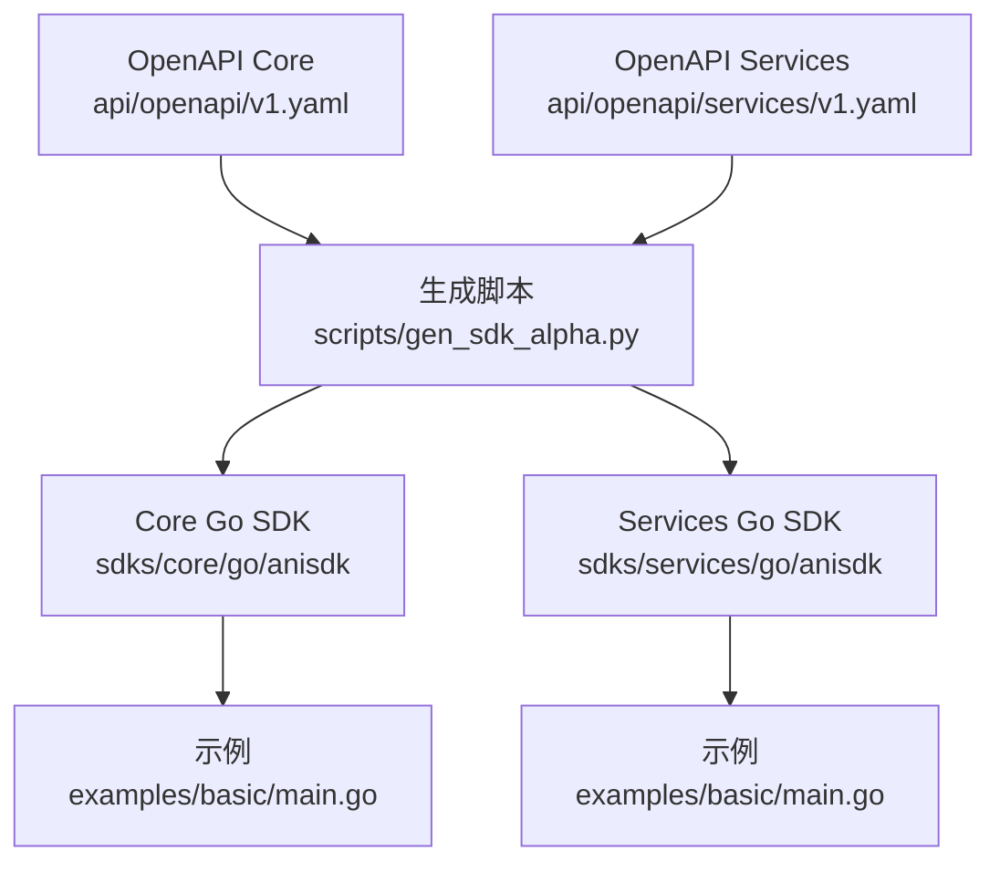
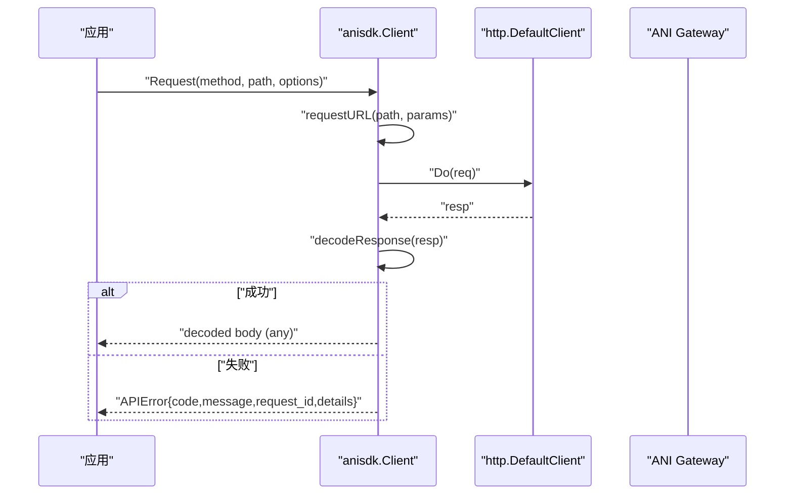
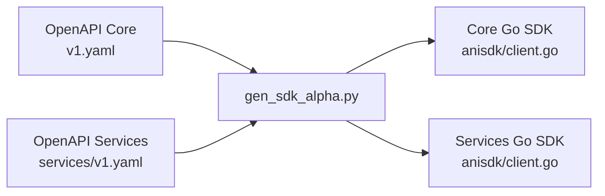

# Go SDK 使用指南

<cite>
**本文引用的文件**
- [repo/sdks/core/go/anisdk/client.go](file://repo/sdks/core/go/anisdk/client.go)
- [repo/sdks/services/go/anisdk/client.go](file://repo/sdks/services/go/anisdk/client.go)
- [repo/sdks/core/go/examples/basic/main.go](file://repo/sdks/core/go/examples/basic/main.go)
- [repo/sdks/services/go/examples/basic/main.go](file://repo/sdks/services/go/examples/basic/main.go)
- [repo/sdks/core/go/anisdk/client_test.go](file://repo/sdks/core/go/anisdk/client_test.go)
- [repo/sdks/services/go/anisdk/client_test.go](file://repo/sdks/services/go/anisdk/client_test.go)
- [repo/scripts/gen_sdk_alpha.py](file://repo/scripts/gen_sdk_alpha.py)
- [repo/api/openapi/v1.yaml](file://repo/api/openapi/v1.yaml)
- [repo/api/openapi/services/v1.yaml](file://repo/api/openapi/services/v1.yaml)
- [repo/README.md](file://repo/README.md)
</cite>

## 目录
1. [简介](#简介)
2. [项目结构](#项目结构)
3. [核心组件](#核心组件)
4. [架构总览](#架构总览)
5. [详细组件分析](#详细组件分析)
6. [依赖关系分析](#依赖关系分析)
7. [性能与并发注意事项](#性能与并发注意事项)
8. [故障排查指南](#故障排查指南)
9. [结论](#结论)
10. [附录：API 参考与示例路径](#附录api-参考与示例路径)

## 简介
本指南面向使用 KuberCloud ANI 的 Go 开发者，提供 Core 与 Services 两套轻量级 Go SDK 的安装、初始化、配置、调用、错误处理与最佳实践说明。SDK 由 OpenAPI 规范自动生成，保证与后端 API 契约一致；当前处于 v0.x 开发期，首个正式版本目标为 v1.0.0（2026-09-30）。

## 项目结构
仓库中 SDK 位于 repo/sdks 下，分为 core 与 services 两个独立模块，每个模块包含 anisdk 包与基础示例。SDK 代码由脚本从 OpenAPI 规范生成，确保操作列表、路径、Schema、幂等键与分页参数与接口定义保持一致。

图表来源
- [repo/scripts/gen_sdk_alpha.py:15-30](file://repo/scripts/gen_sdk_alpha.py#L15-L30)
- [repo/scripts/gen_sdk_alpha.py:161-200](file://repo/scripts/gen_sdk_alpha.py#L161-L200)
- [repo/api/openapi/v1.yaml:1-46](file://repo/api/openapi/v1.yaml#L1-L46)
- [repo/api/openapi/services/v1.yaml:1-20](file://repo/api/openapi/services/v1.yaml#L1-L20)

章节来源
- [repo/README.md:18-67](file://repo/README.md#L18-L67)
- [repo/scripts/gen_sdk_alpha.py:15-30](file://repo/scripts/gen_sdk_alpha.py#L15-L30)

## 核心组件
- 客户端 Client：维护 BaseURL 与 Token，提供通用 Request 方法发送 HTTP 请求并解码响应。
- 请求选项 RequestOptions：支持 Body、Params、Headers 注入。
- 工具函数：
  - NewIdempotencyKey / WithIdempotencyKey：生成或注入幂等键，用于写操作的幂等性。
  - CursorParams：构造 cursor 分页查询参数。
  - IsAPIErrorCode / NewAPIError：统一错误码校验与错误对象构造。
- 元数据常量：Layer、Title、Version、ServerURL、Operations、Paths、Schemas、IdempotencyOperations、CursorPaginationOperations、ErrorCodes。

章节来源
- [repo/sdks/core/go/anisdk/client.go:16-230](file://repo/sdks/core/go/anisdk/client.go#L16-L230)
- [repo/sdks/services/go/anisdk/client.go:16-372](file://repo/sdks/services/go/anisdk/client.go#L16-L372)
- [repo/sdks/services/go/anisdk/client.go:374-556](file://repo/sdks/services/go/anisdk/client.go#L374-L556)

## 架构总览
Core SDK 与 Services SDK 共享相同的实现模式：通过统一的 Request 方法发起 HTTP 请求，自动设置 Accept、Content-Type、Authorization 头，并将 JSON 响应解码为任意类型；当状态码≥400 时返回结构化 APIError。

图表来源
- [repo/sdks/services/go/anisdk/client.go:391-442](file://repo/sdks/services/go/anisdk/client.go#L391-L442)
- [repo/sdks/services/go/anisdk/client.go:444-496](file://repo/sdks/services/go/anisdk/client.go#L444-L496)

## 详细组件分析

### 安装与模块管理
- 模块路径
  - Core：github.com/kubercloud/ani-sdks/core-go
  - Services：github.com/kubercloud/ani-sdks/services-go
- 推荐方式
  - 在项目中引入对应模块，并通过 go get 获取最新版本。
  - 若需锁定版本，可使用 go mod tidy 与版本标签进行约束。
- 版本策略
  - 当前为 v0.x 开发期，首个正式版本目标为 v1.0.0（2026-09-30）。
  - 建议在生产环境固定具体版本，避免上游变更影响稳定性。

章节来源
- [repo/sdks/core/go/go.mod:1-4](file://repo/sdks/core/go/go.mod#L1-L4)
- [repo/sdks/services/go/go.mod:1-4](file://repo/sdks/services/go/go.mod#L1-L4)
- [repo/README.md:93-97](file://repo/README.md#L93-L97)

### 客户端初始化与配置
- 基本初始化
  - 使用 NewClient(baseURL, token) 创建客户端实例。
  - baseURL 为空时将回退到默认 ServerURL。
  - token 将作为 Authorization: Bearer 附加到请求头。
- 认证方式
  - 支持 Bearer JWT 与 X-API-Key Header（由服务端鉴权）。
  - tenant_id 从 JWT claims 提取，请求体中的 tenant_id 将被忽略。
- 连接池与超时
  - 当前 SDK 内部使用 http.DefaultClient，未暴露自定义 Transport、超时或连接池配置。
  - 如需控制超时、重试、TLS 等，建议在业务层封装一个自定义 HTTP 客户端，并在后续扩展 SDK 时替换底层请求执行器。

章节来源
- [repo/sdks/services/go/anisdk/client.go:391-442](file://repo/sdks/services/go/anisdk/client.go#L391-L442)
- [repo/api/openapi/v1.yaml:24-27](file://repo/api/openapi/v1.yaml#L24-L27)
- [repo/api/openapi/services/v1.yaml:17-20](file://repo/api/openapi/services/v1.yaml#L17-L20)

### 幂等性与分页
- 幂等键
  - 对需要幂等的写操作，使用 WithIdempotencyKey(body, key) 注入 idempotency_key。
  - 可通过 NewIdempotencyKey(prefix) 生成随机幂等键。
  - 幂等操作集合由生成脚本根据 OpenAPI 中 required 字段推导。
- Cursor 分页
  - 使用 CursorParams(limit, cursor) 构造 limit 与 cursor 查询参数。
  - 分页能力同样由生成脚本基于 operation 的 parameters 推导。

章节来源
- [repo/sdks/services/go/anisdk/client.go:507-542](file://repo/sdks/services/go/anisdk/client.go#L507-L542)
- [repo/scripts/gen_sdk_alpha.py:78-81](file://repo/scripts/gen_sdk_alpha.py#L78-L81)
- [repo/scripts/gen_sdk_alpha.py:100-113](file://repo/scripts/gen_sdk_alpha.py#L100-L113)

### 错误处理
- 错误对象
  - APIError 包含 code、message、request_id、details。
  - 当响应状态码≥400 且内容为 JSON 时，会尝试解析为标准错误结构并返回 APIError。
- 错误码校验
  - IsAPIErrorCode(code) 可用于判断是否为已知错误码。
  - ErrorCodes 列表由生成脚本从 OpenAPI 描述与 responses 中提取。
- 建议
  - 捕获 error 后优先断言为 APIError，再按 code 分支处理。
  - 记录 request_id 便于问题追踪。

章节来源
- [repo/sdks/services/go/anisdk/client.go:374-389](file://repo/sdks/services/go/anisdk/client.go#L374-L389)
- [repo/sdks/services/go/anisdk/client.go:461-496](file://repo/sdks/services/go/anisdk/client.go#L461-L496)
- [repo/sdks/services/go/anisdk/client.go:544-556](file://repo/sdks/services/go/anisdk/client.go#L544-L556)
- [repo/scripts/gen_sdk_alpha.py:116-133](file://repo/scripts/gen_sdk_alpha.py#L116-L133)

### 上下文与并发安全
- 上下文
  - 当前 Request 方法未接受 context.Context，无法直接传递取消信号或超时。
  - 建议在业务层做外部超时控制（例如 goroutine + channel 或上层 HTTP 客户端包装），待 SDK 升级后可直接传入 context。
- 并发安全
  - Client 仅包含 BaseURL 与 Token 等只读字段，适合多协程共享。
  - 注意不要在运行时修改已共享实例的字段；如需不同 BaseURL 或 Token，请创建新实例。

章节来源
- [repo/sdks/services/go/anisdk/client.go:391-442](file://repo/sdks/services/go/anisdk/client.go#L391-L442)

### 常见用例

#### 实例管理（Core）
- 典型流程
  - 使用 NewClient 初始化客户端。
  - 通过 WithIdempotencyKey 为创建类操作注入幂等键。
  - 调用底层 Request 方法访问实例相关路径（如创建、查询、生命周期操作）。
  - 处理可能的 APIError。
- 参考示例
  - 见 examples/basic/main.go 中对 NewClient、WithIdempotencyKey、CursorParams、NewAPIError 的使用。

章节来源
- [repo/sdks/core/go/examples/basic/main.go:10-22](file://repo/sdks/core/go/examples/basic/main.go#L10-L22)
- [repo/sdks/core/go/anisdk/client.go:21-230](file://repo/sdks/core/go/anisdk/client.go#L21-L230)

#### 存储操作（Core）
- 典型流程
  - 使用 CursorParams 进行对象或桶列表的分页查询。
  - 对上传、创建等写操作使用 WithIdempotencyKey 保证幂等。
  - 读取响应并处理可能的 APIError。
- 参考示例
  - 见 examples/basic/main.go 中对 CursorParams 的使用。

章节来源
- [repo/sdks/core/go/examples/basic/main.go:10-22](file://repo/sdks/core/go/examples/basic/main.go#L10-L22)
- [repo/sdks/core/go/anisdk/client.go:797-800](file://repo/sdks/core/go/anisdk/client.go#L797-L800)

#### 网络配置（Core）
- 典型流程
  - 通过 Request 访问网络资源路径（如 VPC、子网、路由、负载均衡器等）。
  - 使用幂等键保护创建与更新操作。
  - 使用 CursorParams 分页列举资源。
- 参考示例
  - 见 examples/basic/main.go 中对基础工具函数的组合使用。

章节来源
- [repo/sdks/core/go/anisdk/client.go:123-152](file://repo/sdks/core/go/anisdk/client.go#L123-L152)
- [repo/sdks/core/go/examples/basic/main.go:10-22](file://repo/sdks/core/go/examples/basic/main.go#L10-L22)

#### 推理服务与知识库（Services）
- 典型流程
  - 使用 NewClient 指向 Services 端点（/api/v1/svc）。
  - 对推理服务创建、更新、生命周期操作使用幂等键。
  - 对知识库文档、会话、模型等资源进行 CRUD 与查询。
- 参考示例
  - 见 services 示例中对基础工具函数的使用。

章节来源
- [repo/sdks/services/go/examples/basic/main.go:10-22](file://repo/sdks/services/go/examples/basic/main.go#L10-L22)
- [repo/sdks/services/go/anisdk/client.go:21-113](file://repo/sdks/services/go/anisdk/client.go#L21-L113)

## 依赖关系分析
- 生成依赖
  - SDK 由 scripts/gen_sdk_alpha.py 从 api/openapi/v1.yaml 与 api/openapi/services/v1.yaml 生成。
  - 生成过程提取 operations、paths、schemas、idempotencyOperations、cursorPaginationOperations、errorCodes。
- 运行依赖
  - SDK 仅依赖标准库 net/http、encoding/json、net/url 等。
  - 无第三方依赖，便于集成与部署。

图表来源
- [repo/scripts/gen_sdk_alpha.py:15-30](file://repo/scripts/gen_sdk_alpha.py#L15-L30)
- [repo/scripts/gen_sdk_alpha.py:161-200](file://repo/scripts/gen_sdk_alpha.py#L161-L200)
- [repo/api/openapi/v1.yaml:1-46](file://repo/api/openapi/v1.yaml#L1-L46)
- [repo/api/openapi/services/v1.yaml:1-20](file://repo/api/openapi/services/v1.yaml#L1-L20)

章节来源
- [repo/scripts/gen_sdk_alpha.py:53-97](file://repo/scripts/gen_sdk_alpha.py#L53-L97)
- [repo/scripts/gen_sdk_alpha.py:116-133](file://repo/scripts/gen_sdk_alpha.py#L116-L133)

## 性能与并发注意事项
- 连接复用
  - 使用 http.DefaultClient 会复用连接，适合高并发场景。
- 超时控制
  - 当前 SDK 未暴露超时配置，建议在业务层通过外层包装或等待 SDK 升级以支持 context 与自定义 Transport。
- 重试与退避
  - SDK 未内置重试逻辑，建议在业务层实现指数退避与熔断策略，针对可重试错误码进行处理。
- 内存与序列化
  - 大对象上传/下载建议使用流式处理，避免一次性加载到内存。
- 并发安全
  - Client 实例可被多协程共享；避免并发修改其字段。

[本节为通用指导，不直接分析具体文件]

## 故障排查指南
- 常见问题
  - 401/403：检查 Token 是否有效、权限是否足够。
  - 400/422：检查请求体必填字段与 idempotency_key 是否正确注入。
  - 404：确认资源 ID 与路径是否正确。
  - 5xx：查看 request_id 与服务端日志。
- 定位步骤
  - 打印 APIError 的 code、message、request_id。
  - 核对 Operations 与 Paths 是否与期望一致。
  - 使用 CursorParams 验证分页参数。
  - 使用 IsAPIErrorCode 快速判断错误类别。
- 测试辅助
  - 使用 smoke 测试验证 SDK 元数据、工具函数与 Request 方法可用性。

章节来源
- [repo/sdks/core/go/anisdk/client_test.go:6-48](file://repo/sdks/core/go/anisdk/client_test.go#L6-L48)
- [repo/sdks/services/go/anisdk/client_test.go:6-48](file://repo/sdks/services/go/anisdk/client_test.go#L6-L48)
- [repo/sdks/services/go/anisdk/client.go:461-496](file://repo/sdks/services/go/anisdk/client.go#L461-L496)

## 结论
本 Go SDK 提供了轻量、稳定、与 OpenAPI 契约一致的 Core 与 Services 客户端。通过幂等键与 cursor 分页工具，能够覆盖大多数基础设施与业务服务的调用场景。当前版本尚未暴露上下文与连接池配置，建议在业务层做好超时、重试与错误处理，并关注后续 SDK 升级以增强可观测性与可控性。

[本节为总结，不直接分析具体文件]

## 附录：API 参考与示例路径
- 模块与包
  - Core：github.com/kubercloud/ani-sdks/core-go/anisdk
  - Services：github.com/kubercloud/ani-sdks/services-go/anisdk
- 关键类型与方法
  - Client：BaseURL、Token、Request(method, path, RequestOptions)
  - RequestOptions：Body、Params、Headers
  - 工具：NewIdempotencyKey、WithIdempotencyKey、CursorParams、IsAPIErrorCode、NewAPIError
  - 元数据：Layer、Title、Version、ServerURL、Operations、Paths、Schemas、IdempotencyOperations、CursorPaginationOperations、ErrorCodes
- 示例路径
  - Core 示例：repo/sdks/core/go/examples/basic/main.go
  - Services 示例：repo/sdks/services/go/examples/basic/main.go
- 生成依据
  - Core OpenAPI：repo/api/openapi/v1.yaml
  - Services OpenAPI：repo/api/openapi/services/v1.yaml
  - 生成脚本：repo/scripts/gen_sdk_alpha.py

章节来源
- [repo/sdks/core/go/anisdk/client.go:16-230](file://repo/sdks/core/go/anisdk/client.go#L16-L230)
- [repo/sdks/services/go/anisdk/client.go:16-372](file://repo/sdks/services/go/anisdk/client.go#L16-L372)
- [repo/sdks/core/go/examples/basic/main.go:10-22](file://repo/sdks/core/go/examples/basic/main.go#L10-L22)
- [repo/sdks/services/go/examples/basic/main.go:10-22](file://repo/sdks/services/go/examples/basic/main.go#L10-L22)
- [repo/scripts/gen_sdk_alpha.py:15-30](file://repo/scripts/gen_sdk_alpha.py#L15-L30)
- [repo/api/openapi/v1.yaml:1-46](file://repo/api/openapi/v1.yaml#L1-L46)
- [repo/api/openapi/services/v1.yaml:1-20](file://repo/api/openapi/services/v1.yaml#L1-L20)